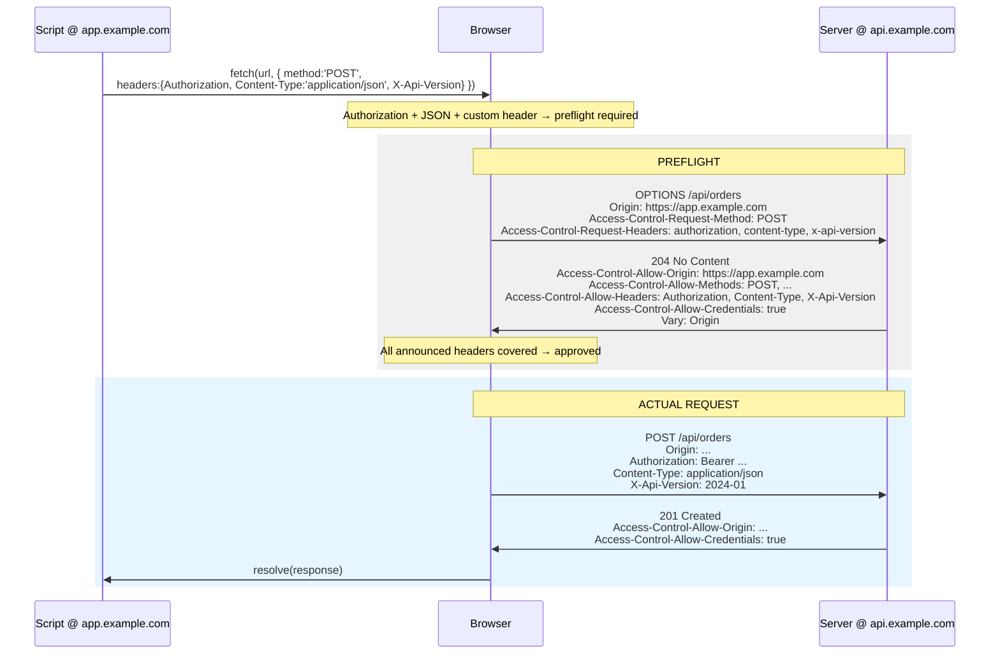
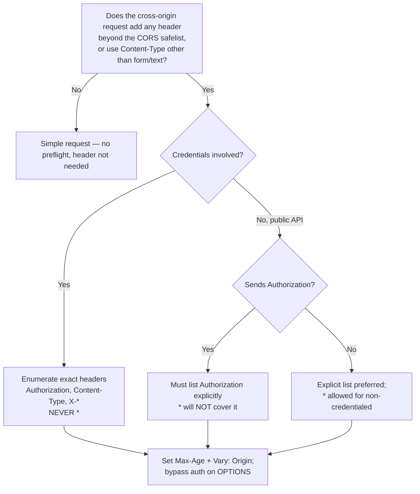

# Access-Control-Allow-Headers

## Quick Summary

`Access-Control-Allow-Headers` is a **preflight response** header. On the automatic `OPTIONS` request the browser sends before a "non-simple" cross-origin request, it lists the **request headers** the server permits the real request to carry — for example `Authorization, Content-Type, X-Api-Version`. The browser compares this list against what it announced in [`Access-Control-Request-Headers`](./Access-Control-Request-Headers.md); every non-safelisted header the real request wants to send must be covered, or the preflight fails and the request is never sent. Its value is either an explicit comma-separated list or the wildcard `*` — but `*` is *ignored in credentialed mode*, and `*` never covers `Authorization` even in anonymous mode, so real APIs almost always enumerate. It is the header-side twin of [`Access-Control-Allow-Methods`](./Access-Control-Allow-Methods.md). Read [CORS Overview](./CORS-Overview.md) and [Access-Control-Allow-Origin](./Access-Control-Allow-Origin.md) first — this header only operates inside the preflight handshake described there.

## What problem does this header solve?

A pre-CORS server could assume that a cross-origin browser request looked like a plain HTML form: standard headers only, no `Authorization`, no custom `X-*` headers, and a `Content-Type` limited to form encodings. CORS relaxed the Same-Origin Policy enough to let scripts add arbitrary headers — bearer tokens, API keys, `Content-Type: application/json`, tracing headers — and that is *exactly* the kind of powerful request an old server never consented to receive cross-origin. `Access-Control-Allow-Headers` is the server's per-header opt-in: the browser announces which non-safelisted headers it intends to send, and the server replies with the subset it will accept. If any intended header is missing from the reply, the browser refuses to send the real request. This is why adding a single custom header like `X-Requested-With` to a `fetch` can suddenly "break CORS" on an endpoint that worked a moment ago — the request became non-simple and the header must now be explicitly allowed.

## Why was it introduced?

It shipped as part of the CORS specification (W3C, 2009–2014; now the WHATWG **Fetch Standard**, which defines the preflight and the *CORS-safelisted request-header* set). The safelist — `Accept`, `Accept-Language`, `Content-Language`, and a restricted `Content-Type` (`application/x-www-form-urlencoded`, `multipart/form-data`, `text/plain`), plus a couple of others like a simple `Range` — captures exactly what a legacy form could already send, so those headers never require permission. **Everything else** must be granted via `Access-Control-Allow-Headers`. Making it opt-in preserves the fail-closed posture: a server that emits nothing cannot be sent custom headers or `Authorization` cross-origin. The `*` wildcard was added later as a convenience for public APIs, with the deliberate carve-outs that it does not apply with credentials and never covers `Authorization`.

## How does it work?

- **Browser behavior:** When a request carries any non-safelisted header (or a `Content-Type` outside the safelisted three, most notably `application/json`), the browser preflights. It sends the intended header *names* — lowercased and comma-separated — in [`Access-Control-Request-Headers`](./Access-Control-Request-Headers.md), then checks that every one appears in the response's `Access-Control-Allow-Headers` (case-insensitive) or that the value is `*` (non-credentialed only, and never covering `Authorization`). Any uncovered header fails the preflight. Matching is on header **names**, not values — the browser never previews header *values* to the server.
- **Server behavior:** The server sets this on the `OPTIONS` response. The two strategies mirror origin handling: a static list of the headers your API accepts, or **echo back** whatever arrived in `Access-Control-Request-Headers`. Echoing is convenient but is a policy decision (see Security). The header is meaningless on the actual (non-`OPTIONS`) response.
- **Proxy behavior:** End-to-end response header; forward proxies pass it through. Stripping it on `OPTIONS` breaks all preflighted requests that use custom headers.
- **CDN behavior:** If the preflight reflects per-origin or echoes `Access-Control-Request-Headers`, cached `OPTIONS` responses must key on the relevant request headers (`Vary`) or one client's header grant leaks to another. Most CDNs don't cache `OPTIONS` by default.
- **Reverse proxy behavior:** Nginx/Envoy often answer the preflight with a hard-coded allow-list. If both proxy and app emit `Access-Control-Allow-Headers`, browsers see duplicates and reject the preflight.

## HTTP Request Example

The browser-generated preflight — note the header *names* announced, lowercased:

```http
OPTIONS /api/orders HTTP/1.1
Host: api.example.com
Origin: https://app.example.com
Access-Control-Request-Method: POST
Access-Control-Request-Headers: authorization, content-type, x-api-version
```

`content-type` appears here because the real `POST` will send `Content-Type: application/json`, which is *not* on the safelist and therefore counts as a header that needs permission.

## HTTP Response Example

```http
HTTP/1.1 204 No Content
Access-Control-Allow-Origin: https://app.example.com
Access-Control-Allow-Methods: GET, POST, PUT, PATCH, DELETE
Access-Control-Allow-Headers: Authorization, Content-Type, X-Api-Version
Access-Control-Allow-Credentials: true
Access-Control-Max-Age: 600
Vary: Origin
```

Every header the browser announced (`authorization`, `content-type`, `x-api-version`) is present in `Access-Control-Allow-Headers`, so the preflight passes. Because `Access-Control-Allow-Credentials: true` is set, `*` could not have been used here — the list must be explicit.

## Express.js Example

```js
const express = require('express');
const cors = require('cors');
const app = express();

const ALLOWLIST = new Set(['https://app.example.com', 'https://admin.example.com']);

const corsOptions = {
  origin(origin, callback) {
    if (!origin) return callback(null, true);
    if (ALLOWLIST.has(origin)) return callback(null, true);
    return callback(new Error(`CORS: origin ${origin} not allowed`));
  },
  methods: ['GET', 'POST', 'PUT', 'PATCH', 'DELETE'],
  // The explicit list that becomes Access-Control-Allow-Headers on the preflight.
  // Any header your front-end adds to a request MUST appear here, or the preflight
  // fails. Content-Type is required the moment you send application/json.
  allowedHeaders: ['Authorization', 'Content-Type', 'X-Api-Version'],
  credentials: true,   // exact-origin + Allow-Credentials: true → `*` is not an option here
  maxAge: 600,
};

// Mount before auth/routes so the credential-less preflight OPTIONS is answered.
app.use(cors(corsOptions));

app.post('/api/orders', requireAuth, express.json(), (req, res) => {
  // The preflight already approved Authorization + Content-Type + X-Api-Version.
  const order = createOrder(req.user, req.body);
  res.status(201).json(order);
});

app.listen(4000);
```

Why each piece matters: **`allowedHeaders`** is the literal source of the header. Forget `X-Api-Version` here and every request that sends it dies at the preflight — but works in curl/Postman, which mislead you into thinking the server is fine. **`Content-Type` must be listed** because `application/json` is not safelisted; this is the single most common surprise. **`credentials: true`** means you cannot fall back to `*`; you must enumerate. If `cors` is given no `allowedHeaders`, it conveniently *reflects* `Access-Control-Request-Headers` back — handy in development, but you should pin an explicit list in production so you control exactly what is accepted. Hand-rolled, this is `res.setHeader('Access-Control-Allow-Headers', 'Authorization, Content-Type, X-Api-Version')` inside the `OPTIONS` branch.

## Node.js Example

Raw `http` module, showing the echo-back strategy and that the header belongs only on the preflight:

```js
const http = require('http');

const ALLOWLIST = new Set(['https://app.example.com']);
const ALLOWED = 'Authorization, Content-Type, X-Api-Version';

http.createServer((req, res) => {
  const origin = req.headers.origin;
  if (origin && ALLOWLIST.has(origin)) {
    res.setHeader('Access-Control-Allow-Origin', origin);
    res.setHeader('Access-Control-Allow-Credentials', 'true');
    res.setHeader('Vary', 'Origin');
  }

  if (req.method === 'OPTIONS') {
    res.setHeader('Access-Control-Allow-Methods', 'GET, POST, PUT, PATCH, DELETE');
    // Static allow-list. Alternatively, echo what the browser announced:
    //   const asked = req.headers['access-control-request-headers'];
    //   res.setHeader('Access-Control-Allow-Headers', asked || ALLOWED);
    // Echoing is permissive — only do it if you trust every allowlisted origin.
    res.setHeader('Access-Control-Allow-Headers', ALLOWED);
    res.setHeader('Access-Control-Max-Age', '600');
    res.writeHead(204);
    return res.end();
  }

  res.writeHead(200, { 'Content-Type': 'application/json' });
  res.end(JSON.stringify({ ok: true }));
}).listen(4000);
```

The chore the middleware hides: reading `req.headers['access-control-request-headers']` if you echo, and remembering the header is only meaningful on the `OPTIONS` branch.

## React Example

React never sets `Access-Control-Allow-Headers`; it *triggers* the preflight by adding headers to a request. The moment you attach an `Authorization` bearer token or send JSON, the request becomes non-simple and this server header decides whether it survives:

```jsx
import { useCallback } from 'react';

function useCreateOrder(token) {
  return useCallback(async (payload) => {
    // Three things here each force a preflight:
    //  - Authorization (not safelisted)
    //  - Content-Type: application/json (not a safelisted Content-Type)
    //  - X-Api-Version (custom header)
    // The server's Access-Control-Allow-Headers MUST cover all three or this rejects.
    const res = await fetch('https://api.example.com/api/orders', {
      method: 'POST',
      credentials: 'include',
      headers: {
        Authorization: `Bearer ${token}`,
        'Content-Type': 'application/json',
        'X-Api-Version': '2024-01',
      },
      body: JSON.stringify(payload),
    });
    if (!res.ok) throw new Error(`HTTP ${res.status}`);
    return res.json();
  }, [token]);
}
```

Teaching point: a missing header in the server's allow-list surfaces as an opaque `TypeError: Failed to fetch`. The diagnosis is *only* in the Network tab's `OPTIONS` row, where the Console message names the offending header ("Request header field x-api-version is not allowed by Access-Control-Allow-Headers in preflight response").

## Browser Lifecycle

1. Script issues a `fetch` carrying a non-safelisted header (or non-safelisted `Content-Type`); the browser flags a preflight.
2. Browser sends `OPTIONS` with `Origin` and [`Access-Control-Request-Headers`](./Access-Control-Request-Headers.md) listing the intended header names (lowercased).
3. Response arrives; browser reads `Access-Control-Allow-Headers`.
4. **Match test:** every announced header appears in the list (case-insensitive), OR the value is `*` and the request is non-credentialed (and none of the announced headers is `Authorization`).
5. On success, the preflight is cached (per `Access-Control-Max-Age`) and the real request is sent, carrying those headers.
6. On failure, the browser aborts and rejects the promise; the real request — and its headers — never reach the server.



## Production Use Cases

- **Token-authenticated APIs:** allow `Authorization` so bearer tokens can be sent cross-origin.
- **JSON APIs:** allow `Content-Type` because `application/json` is not safelisted — mandatory for essentially every modern API.
- **Custom protocol headers:** `X-Api-Version`, `X-Request-Id`, `X-Csrf-Token`, `X-Idempotency-Key` — each must be explicitly listed.
- **Tracing/observability:** distributed-tracing headers like `traceparent`/`X-B3-*` sent from the browser require allowing.
- **Development convenience:** echoing `Access-Control-Request-Headers` back so any header the front-end experiments with just works — then locking to an explicit list before production.

## Common Mistakes

- **Forgetting `Content-Type`.** The most frequent CORS bug: sending `application/json` makes the request non-simple, and if `Content-Type` isn't in `Access-Control-Allow-Headers`, the preflight fails. It feels unrelated to "headers" because you set it via the body encoding, but it counts.
- **Relying on `*` with credentials.** In credentialed mode `*` is treated literally, matching a header literally named `*` — so it covers nothing. Enumerate.
- **Assuming `*` covers `Authorization`.** By spec, `*` never authorizes `Authorization`; it must always be listed explicitly, even in anonymous mode.
- **Case or whitespace fears.** Matching is case-insensitive and tolerant of surrounding spaces, but do keep the list a clean comma-separated set.
- **Setting it on the real response.** Browsers read it only on the `OPTIONS` preflight.
- **Auth middleware blocking the preflight.** The credential-less `OPTIONS` must bypass auth or you never emit this header.
- **Echoing the request headers into a credentialed, loosely-allowlisted response** — effectively "allow any header," which combined with reflected origins broadens attack surface.

## Security Considerations

- **Browser-only enforcement.** Restricting headers here does not stop `curl`/Postman/another server from sending any header they like — CORS is enforced only in browsers. This header governs which *website scripts* may attach which headers in a user's browser, not what an attacker can send directly. Validate and authorize on the server regardless.
- **Echoing `Access-Control-Request-Headers` is a policy choice.** Reflecting whatever the browser asks for is convenient but means "allow any header." Combined with reflected origins and `Allow-Credentials: true`, it widens what an allowlisted (possibly XSS-compromised) origin can do. Prefer an explicit list in production.
- **`Authorization` explicitness is a safety net.** The spec's refusal to let `*` cover `Authorization` prevents a careless public `*` policy from accidentally permitting credentialed-style header sends; respect it by listing `Authorization` only where you truly accept tokens.
- **Header names, not values, are negotiated.** The preflight never reveals header *values*, so don't treat the allow-list as a validation layer — it only gates which names may be sent.

## Performance Considerations

- Like all preflight headers, the cost is the extra `OPTIONS` round-trip, mitigated by `Access-Control-Max-Age`. List all headers your API uses in one preflight so a single cached grant covers subsequent requests.
- Adding a new custom header to your front-end *invalidates* the effective preflight cache for requests that include it, forcing a fresh `OPTIONS`. Batch header changes to avoid repeated re-preflighting.
- The header's byte cost is trivial; the optimization target is minimizing preflight frequency, not shortening the list.

## Reverse Proxy Considerations

```nginx
location /api/ {
    if ($request_method = OPTIONS) {
        add_header Access-Control-Allow-Origin  $http_origin always;
        add_header Access-Control-Allow-Methods "GET, POST, PUT, PATCH, DELETE" always;
        # Explicit allow-list. To echo what the browser asked, use
        #   add_header Access-Control-Allow-Headers $http_access_control_request_headers always;
        add_header Access-Control-Allow-Headers "Authorization, Content-Type, X-Api-Version" always;
        add_header Access-Control-Allow-Credentials "true" always;
        add_header Access-Control-Max-Age 600 always;
        add_header Vary Origin always;
        add_header Content-Length 0;
        return 204;
    }
    proxy_pass http://app_upstream;
}
```

Gotchas: `$http_access_control_request_headers` lets Nginx echo the requested headers (the permissive strategy). Use `always` so the header survives non-2xx. Ensure only one layer (proxy *or* app) emits `Access-Control-Allow-Headers` to avoid duplicates.

## CDN Considerations

- If the preflight echoes `Access-Control-Request-Headers` or reflects origin, cached `OPTIONS` responses must vary on the corresponding request headers, or one client's header grant is served to another.
- Cloudflare/CloudFront typically forward `OPTIONS` to origin rather than caching it; if you enable edge CORS, keep the edge allow-list in sync with the origin's.
- When the CDN injects CORS at the edge, be explicit about `Authorization` and `Content-Type` — an edge policy that drops `Content-Type` breaks all JSON POSTs.

## Cloud Deployment Considerations

- **AWS API Gateway:** REST APIs' CORS setup emits a static `Access-Control-Allow-Headers` from the mock `OPTIONS` integration; HTTP APIs use `corsConfiguration.allowHeaders`. Add `Authorization`, `Content-Type`, and any custom headers there.
- **AWS ALB:** does not synthesize CORS; the app/Lambda must.
- **Cloudflare Workers / Lambda@Edge:** centralize the header allow-list at the edge.
- **GCP/Azure gateways:** provide `allowHeaders` config; verify it matches what your front-end sends, especially `Content-Type`.

## Debugging

- **Chrome DevTools → Network:** inspect the **`OPTIONS`** row's *Response Headers* for `Access-Control-Allow-Headers`. The Console names the exact offending header when the preflight fails ("Request header field ... is not allowed").
- **curl (simulate preflight):** `curl -i -X OPTIONS -H "Origin: https://app.example.com" -H "Access-Control-Request-Method: POST" -H "Access-Control-Request-Headers: authorization, content-type, x-api-version" https://api.example.com/api/orders` — verify each requested header appears in the response.
- **Postman / Bruno:** confirm the server emits the list; they don't enforce CORS, so success there only proves the header exists.
- **Node/Express logging:** log `req.headers['access-control-request-headers']` in the `OPTIONS` path to see precisely which names the browser is asking to send.

## Best Practices

- [ ] List `Content-Type` whenever the front-end sends JSON (it is *not* safelisted).
- [ ] List `Authorization` explicitly wherever tokens are sent — `*` never covers it.
- [ ] Enumerate headers (never `*`) whenever credentials are involved.
- [ ] Prefer a pinned explicit allow-list in production over echoing `Access-Control-Request-Headers`.
- [ ] Include all custom headers in one preflight and set `Access-Control-Max-Age` to amortize the round-trip.
- [ ] Ensure the `OPTIONS` preflight bypasses authentication.
- [ ] Keep one CORS owner (app *or* proxy) to avoid duplicate headers.

## Related Headers

- [`Access-Control-Request-Headers`](./Access-Control-Request-Headers.md) — the paired *request* header the browser sends in the preflight; this header is the direct answer to it.
- [`Access-Control-Allow-Methods`](./Access-Control-Allow-Methods.md) — the sibling grant for the request *method* in the same preflight.
- [`Access-Control-Allow-Origin`](./Access-Control-Allow-Origin.md) — must also be present; origin approval is checked alongside header approval.
- [`Access-Control-Allow-Credentials`](./Access-Control-Allow-Credentials.md) — when `true`, disables the `*` wildcard here and forces an explicit list.
- `Access-Control-Expose-Headers` — the mirror image on the *response* side: which response headers JS may *read* after the request succeeds.
- [`Access-Control-Max-Age`](./Access-Control-Max-Age.md) — caches this preflight grant.
- [`Vary`](../06-Caching-Headers/Vary.md) — needed when the preflight reflects origin or echoes requested headers.

## Decision Tree



## Mental Model

If [`Access-Control-Allow-Methods`](./Access-Control-Allow-Methods.md) is the line on the guest pass saying *what the guest may do*, `Access-Control-Allow-Headers` is the line saying *what the guest may carry in*. During the browser's **advance phone call** (the preflight), the guest declares "I'm bringing a signed ID (`Authorization`), a sealed JSON envelope (`Content-Type: application/json`), and a version tag (`X-Api-Version`)." The host reads back the list of items permitted through the door. Anything the guest declared that isn't on the host's list means the guest is turned away *before entering* — the real visit never happens. And note two house rules the doorman enforces no matter what: an "everyone welcome" sign (`*`) is ignored the moment the guest brings the household's keys (credentials), and it *never* covers a signed ID (`Authorization`) — that must always be named explicitly.
