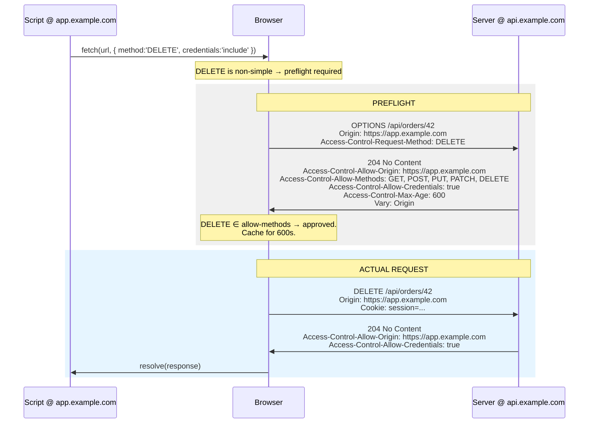
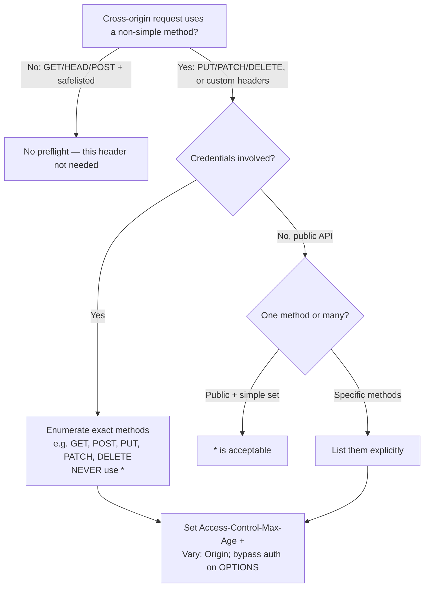

# Access-Control-Allow-Methods

## Quick Summary

`Access-Control-Allow-Methods` is a **preflight response** header. It appears only on the automatic `OPTIONS` response the browser sends before a "non-simple" cross-origin request, and it enumerates the HTTP methods the server is willing to accept from the requesting origin — for example `GET, POST, PUT, PATCH, DELETE`. The browser compares the method it announced in [`Access-Control-Request-Method`](./Access-Control-Request-Method.md) against this list; if the method is present (or the list is `*` in a non-credentialed request), the preflight passes and the real request is sent. If not, the browser aborts and the promise rejects with a CORS error. It is a *permission grant scoped to the preflight*, and it is easy to confuse with the unrelated [`Allow`](../04-Response-Headers/Allow.md) header, which advertises methods on a `405`/`OPTIONS` for the resource itself, independent of CORS. Read [CORS Overview](./CORS-Overview.md) and [Access-Control-Allow-Origin](./Access-Control-Allow-Origin.md) first — this header only makes sense inside the preflight handshake described there.

## What problem does this header solve?

The [Same-Origin Policy](./CORS-Overview.md) let a pre-CORS server assume that any powerful cross-origin method — `PUT`, `DELETE`, `PATCH` — was impossible from a browser script. When CORS relaxed that boundary, the specification had to protect those legacy servers from suddenly receiving state-changing cross-origin requests they never consented to. The solution: for any method beyond the "simple" set (`GET`, `HEAD`, `POST`), the browser must **ask first** with a preflight `OPTIONS`, and the server must **explicitly list the method** it will honor. `Access-Control-Allow-Methods` is that explicit list. It answers the browser's question — *"I'm about to send a `DELETE` cross-origin; do you allow that?"* — with a concrete yes-or-no per method. Without it, a CORS-aware browser will never send a `DELETE` cross-origin, which is exactly the fail-closed guarantee that makes it safe to expose an API to browser front-ends on other origins.

## Why was it introduced?

It arrived with the rest of the CORS machinery in the W3C Cross-Origin Resource Sharing spec (2009–2014), now folded into the WHATWG **Fetch Standard**, which defines the preflight algorithm and the exact matching rules. The design intent was **method-level opt-in**: a server that emits no `Access-Control-Allow-Methods` (or omits a given method from the list) cannot be driven with that method from a cross-origin script, so old servers stay locked down by default. The header lives on the preflight specifically — not the actual response — because its job is to *authorize sending the real request in the first place*, not to authorize reading a response that already happened (that is [`Access-Control-Allow-Origin`](./Access-Control-Allow-Origin.md)'s job). The `*` wildcard value was added later in the Fetch Standard as a convenience for public, non-credentialed APIs.

## How does it work?

- **Browser behavior:** When a `fetch`/XHR uses a non-simple method (anything but `GET`/`HEAD`/`POST`), the browser first sends a preflight `OPTIONS` carrying [`Access-Control-Request-Method`](./Access-Control-Request-Method.md). It then reads `Access-Control-Allow-Methods` from the response and checks that the announced method is a case-sensitive member of the comma-separated list — or that the value is `*` **and** the request is not credentialed. On success it caches the result (see `Access-Control-Max-Age`) and sends the real request; on failure it aborts before the real request is ever dispatched. The browser does *not* require every method your API supports to be listed — only the one it is about to use — but servers conventionally list all of them so one cached preflight covers many methods.
- **Server behavior:** The server sets this header on its `OPTIONS` response. It may return a static list, or reflect exactly the method named in `Access-Control-Request-Method`. `GET` and `HEAD` are always implicitly allowed by the spec regardless of the list, but listing them explicitly is harmless and common. Note the header is **meaningless on the actual (non-OPTIONS) response** — browsers ignore it there.
- **Proxy behavior:** It is an end-to-end response header; forward proxies pass it through untouched. A proxy that rewrites or drops it on `OPTIONS` silently breaks every preflighted request.
- **CDN behavior:** Because the preflight response can vary by origin (when paired with reflected [`Access-Control-Allow-Origin`](./Access-Control-Allow-Origin.md)), a CDN caching `OPTIONS` responses must key on `Origin` (via `Vary: Origin`) or it may serve one origin's method grant to another. Many CDNs don't cache `OPTIONS` by default.
- **Reverse proxy behavior:** Nginx/HAProxy/Envoy commonly answer the `OPTIONS` preflight themselves with a hard-coded `Access-Control-Allow-Methods`, offloading it from the app. If both the proxy and the app emit it, you get duplicate headers, which browsers reject.

## HTTP Request Example

The browser-generated preflight — your `fetch` code never writes this `OPTIONS`:

```http
OPTIONS /api/orders/42 HTTP/1.1
Host: api.example.com
Origin: https://app.example.com
Access-Control-Request-Method: DELETE
Access-Control-Request-Headers: authorization, content-type
```

`Access-Control-Request-Method: DELETE` is the browser announcing the method the *real* request will use. `Access-Control-Allow-Methods` in the response is the direct answer to it.

## HTTP Response Example

```http
HTTP/1.1 204 No Content
Access-Control-Allow-Origin: https://app.example.com
Access-Control-Allow-Methods: GET, POST, PUT, PATCH, DELETE
Access-Control-Allow-Headers: authorization, content-type
Access-Control-Max-Age: 600
Vary: Origin
```

`204 No Content` is conventional (a preflight has no body). `Access-Control-Allow-Methods` lists every method this resource accepts so the single cached preflight covers future `PUT`/`PATCH`/`DELETE` calls too, and `Access-Control-Max-Age: 600` caches that grant for 10 minutes to avoid re-preflighting.

## Express.js Example

Use the community-standard `cors` middleware; it emits `Access-Control-Allow-Methods` on the preflight and answers `OPTIONS` for you.

```js
const express = require('express');
const cors = require('cors');
const app = express();

const ALLOWLIST = new Set(['https://app.example.com', 'https://admin.example.com']);

const corsOptions = {
  origin(origin, callback) {
    if (!origin) return callback(null, true);          // non-browser / same-origin — CORS irrelevant
    if (ALLOWLIST.has(origin)) return callback(null, true);
    return callback(new Error(`CORS: origin ${origin} not allowed`));
  },
  // The explicit list that becomes Access-Control-Allow-Methods on the preflight.
  // Only these methods will pass the OPTIONS check; a cross-origin PATCH would fail
  // if you dropped PATCH here, even though the route handler exists.
  methods: ['GET', 'POST', 'PUT', 'PATCH', 'DELETE'],
  credentials: true,   // exact-origin reflection + Allow-Credentials: true (no `*`)
  maxAge: 600,         // cache the preflight so repeated calls skip the OPTIONS round-trip
};

// Mount BEFORE auth and routes: the preflight OPTIONS carries no cookies/token,
// so an auth guard running first would reject it with 401 and break CORS.
app.use(cors(corsOptions));

app.delete('/api/orders/:id', requireAuth, (req, res) => {
  // By the time we reach here, the preflight already approved DELETE for this origin.
  deleteOrder(req.params.id);
  res.status(204).end();
});

app.listen(4000);
```

Why each piece matters: **`methods`** is the literal source of the header — omit a method and every cross-origin call using it dies at the preflight with a cryptic console error, even though Postman and curl (which ignore CORS) work fine. **`credentials: true`** forces exact-origin reflection, which in turn means the method list must be an explicit enumeration, not `*` (see Common Mistakes). **Mount order** is the single most common cause of "preflight returns 401": the credential-less `OPTIONS` must reach `cors` before your JWT/session middleware. If you were hand-rolling this, you would `res.setHeader('Access-Control-Allow-Methods', 'GET, POST, PUT, PATCH, DELETE')` inside an `if (req.method === 'OPTIONS')` branch and `return res.status(204).end()`.

## Node.js Example

Raw `http` module — this is exactly what the middleware does under the hood, and it shows that the header only belongs on the `OPTIONS` branch:

```js
const http = require('http');

const ALLOWLIST = new Set(['https://app.example.com']);

http.createServer((req, res) => {
  const origin = req.headers.origin;
  if (origin && ALLOWLIST.has(origin)) {
    res.setHeader('Access-Control-Allow-Origin', origin);   // exact origin, not `*`
    res.setHeader('Access-Control-Allow-Credentials', 'true');
    res.setHeader('Vary', 'Origin');                        // preflight varies by origin → cache safety
  }

  if (req.method === 'OPTIONS') {
    // These three headers ONLY make sense on the preflight response.
    res.setHeader('Access-Control-Allow-Methods', 'GET, POST, PUT, PATCH, DELETE');
    res.setHeader('Access-Control-Allow-Headers', 'Authorization, Content-Type');
    res.setHeader('Access-Control-Max-Age', '600');
    res.writeHead(204);        // no body on a preflight
    return res.end();
  }

  // Actual request: note we do NOT set Access-Control-Allow-Methods here — browsers ignore it.
  res.writeHead(200, { 'Content-Type': 'application/json' });
  res.end(JSON.stringify({ ok: true }));
}).listen(4000);
```

The manual chores the middleware hides: you must branch on `req.method === 'OPTIONS'`, set `Vary: Origin`, and remember that emitting `Access-Control-Allow-Methods` on the real response is wasted bytes.

## React Example

React never sets `Access-Control-Allow-Methods` — it is a server response header. React's only role is to trigger a fetch whose *method* forces a preflight. The moment you use anything beyond `GET`/`POST`, or add a non-safelisted header, the browser preflights and this header decides whether your request survives:

```jsx
import { useCallback } from 'react';

function DeleteOrderButton({ id }) {
  const onDelete = useCallback(async () => {
    // DELETE is a non-simple method → browser sends OPTIONS first, automatically.
    // If the server's Access-Control-Allow-Methods omits DELETE, THIS line rejects
    // with "TypeError: Failed to fetch" and the DELETE never reaches the server.
    const res = await fetch(`https://api.example.com/api/orders/${id}`, {
      method: 'DELETE',
      credentials: 'include',   // sending cookies → server must reflect exact origin + allow credentials
    });
    if (!res.ok) throw new Error(`HTTP ${res.status}`);
  }, [id]);

  return <button onClick={onDelete}>Delete</button>;
}
```

The teaching point: a missing method in the server's allow-list is invisible in the React code and surfaces only as an opaque `TypeError`. You must open the Network tab and inspect the *`OPTIONS`* row — not the `DELETE` row, which never appears — to see that the preflight failed.

## Browser Lifecycle

1. Script calls `fetch` with a non-simple method (e.g. `PUT`); the browser decides a preflight is required.
2. Browser sends `OPTIONS` with `Origin` and [`Access-Control-Request-Method: PUT`](./Access-Control-Request-Method.md).
3. Response arrives; browser reads `Access-Control-Allow-Methods`.
4. **Match test:** the announced method is a case-sensitive member of the list, OR the value is `*` and the request is not credentialed. (`GET`/`HEAD` are always implicitly allowed.)
5. On success, the browser caches the preflight (per `Access-Control-Max-Age`) and dispatches the real `PUT`, which must *also* pass the [`Access-Control-Allow-Origin`](./Access-Control-Allow-Origin.md) check on its own response.
6. On failure (method absent, or `*` used with credentials, or non-2xx preflight), the browser aborts and rejects the promise; the real request is never sent, so no server side effect occurs.



## Production Use Cases

- **REST API behind an SPA:** list `GET, POST, PUT, PATCH, DELETE` so all CRUD operations from `app.example.com` pass one cached preflight.
- **Read-only public API:** you can omit the header entirely (only simple `GET`s), or set `Access-Control-Allow-Methods: GET` for clarity; no credentials means `*` is also valid.
- **File-upload / partial-update endpoints:** `PUT`/`PATCH` must be listed or chunked uploads and JSON `PATCH` bodies fail at preflight.
- **GraphQL over HTTP:** typically only `POST` (and sometimes `GET`), so a tight `POST, GET` list suffices — but because GraphQL uses `Content-Type: application/json`, it is *always* preflighted, so this header is mandatory.
- **API gateway offload:** the gateway/reverse proxy answers `OPTIONS` with a fixed method list, so the app never sees preflights.

## Common Mistakes

- **Confusing it with [`Allow`](../04-Response-Headers/Allow.md).** `Allow` is a general HTTP header describing which methods a *resource* supports (sent on `405 Method Not Allowed` and on plain `OPTIONS`). `Access-Control-Allow-Methods` is CORS-specific, appears only on preflights, and governs *cross-origin permission*, not resource capability. A `405` with `Allow: GET, POST` tells any client the method is unsupported; `Access-Control-Allow-Methods` tells only the *browser* which methods a cross-origin script may use.
- **`*` with credentials.** In credentialed mode the browser treats `*` as a literal method name (not a wildcard), so it never matches `PUT`/`DELETE` and the preflight fails. Enumerate methods explicitly whenever `credentials: 'include'` is in play.
- **Setting it on the actual response instead of the preflight.** Browsers only read it on the `OPTIONS` response; on the real response it is ignored.
- **Case mismatch.** Method matching is case-sensitive; `Delete` will not match a request for `DELETE`.
- **Forgetting `OPTIONS` needs to bypass auth.** If auth middleware rejects the credential-less preflight, you never emit this header and every non-simple request fails.
- **Assuming listing a method implements it.** The header only *permits* the browser to send the method; you still need an actual route handler, or the real request returns `404`/`405`.

## Security Considerations

- **This header is browser-only enforcement.** Listing only `GET` does not stop `curl`, Postman, or another server from sending a `DELETE` — they ignore CORS entirely. Method restriction here protects *other websites' scripts in a victim's browser* from driving your API, not your API from direct attackers. Real method authorization must live in your route logic.
- **Don't over-grant.** Listing `DELETE`/`PUT` when the endpoint only needs `GET` widens the set of cross-origin operations a permitted origin can perform if that origin is later compromised (XSS on your own front-end). Grant the minimum.
- **Reflecting `Access-Control-Request-Method` blindly** while also reflecting `Origin` and allowing credentials effectively lets any allowlisted origin use any method — acceptable if your allowlist is trusted, dangerous if you also reflect origins loosely.
- **Preflight is a CSRF-relevant gate but not CSRF protection.** The preflight requirement means a cross-origin `DELETE` with a JSON body can't be silently sent by a `<form>`, which incidentally blocks some CSRF vectors — but do not rely on it. Defend CSRF with tokens/`SameSite`, as covered in the [Overview](./CORS-Overview.md).

## Performance Considerations

- The cost of this header is the **preflight round-trip** it participates in — an extra RTT before the first non-simple request to each origin/path. Amortize it with `Access-Control-Max-Age` so a single `OPTIONS` covers many subsequent requests.
- List *all* methods your API uses in one preflight response so the cached grant covers `GET`, `PUT`, `DELETE`, etc. together — otherwise a `DELETE` after a cached `PUT` preflight may trigger a fresh `OPTIONS`.
- The header bytes themselves are negligible; the win is eliminating repeated preflights, not shrinking the list.

## Reverse Proxy Considerations

Answering the preflight at Nginx offloads it from the app and centralizes the method policy:

```nginx
location /api/ {
    if ($request_method = OPTIONS) {
        add_header Access-Control-Allow-Origin  $http_origin always;
        add_header Access-Control-Allow-Methods "GET, POST, PUT, PATCH, DELETE" always;
        add_header Access-Control-Allow-Headers "Authorization, Content-Type" always;
        add_header Access-Control-Allow-Credentials "true" always;
        add_header Access-Control-Max-Age 600 always;
        add_header Vary Origin always;
        add_header Content-Length 0;
        return 204;                 # answer the preflight here; never proxy OPTIONS upstream
    }
    proxy_pass http://app_upstream; # real methods go to the app
}
```

Gotchas: use the `always` flag so the header survives non-2xx; and pick **one** owner for CORS — if Nginx *and* the app both emit `Access-Control-Allow-Methods`, the browser sees duplicates and rejects the preflight.

## CDN Considerations

- If you cache `OPTIONS` responses at the edge, make the cache key include `Origin` (via `Vary: Origin` and CDN config) whenever the preflight reflects the origin, or one tenant's method grant leaks to another.
- Many CDNs (Cloudflare, CloudFront) do not cache `OPTIONS` by default and will pass it to origin — fine, but it means the preflight isn't offloaded unless you configure it.
- If the CDN injects CORS headers at the edge, ensure its method list matches the origin's to avoid drift where the edge allows a method the origin rejects (or vice versa).

## Cloud Deployment Considerations

- **AWS API Gateway:** for REST APIs, enabling CORS auto-creates a mock `OPTIONS` integration that returns a fixed `Access-Control-Allow-Methods`; you set the list in the console/OpenAPI. HTTP APIs configure it via `corsConfiguration.allowMethods`. The gateway, not your Lambda, answers the preflight.
- **AWS ALB:** does not synthesize CORS; your app or a Lambda must emit the method list.
- **Cloudflare Workers / Lambda@Edge:** a clean place to answer `OPTIONS` centrally with a shared method policy.
- **GCP/Azure API gateways:** expose `allowMethods`-style config; verify it varies on `Origin` and that the list matches your backend's real capabilities.

## Debugging

- **Chrome DevTools → Network:** find the **`OPTIONS`** row (not the real request). Its *Response Headers* show `Access-Control-Allow-Methods`. If the preflight failed, the Console names the reason ("Method DELETE is not allowed by Access-Control-Allow-Methods in preflight response").
- **curl (simulate a preflight):** `curl -i -X OPTIONS -H "Origin: https://app.example.com" -H "Access-Control-Request-Method: DELETE" https://api.example.com/api/orders/42` — check the `Access-Control-Allow-Methods` line and the status.
- **Postman / Bruno:** confirm the server *emits* the right list, but remember they don't enforce CORS, so a passing call proves only that the header exists.
- **Node/Express logging:** log `req.method` and `req.headers['access-control-request-method']` inside your `OPTIONS` handling to see exactly what the browser asked for versus what you allow.

## Best Practices

- [ ] List every method your cross-origin front-ends use in one preflight response so a single cached `OPTIONS` covers them all.
- [ ] Enumerate methods explicitly (never `*`) whenever credentials are involved.
- [ ] Keep the list minimal — grant only the methods actually needed.
- [ ] Pair reflected preflights with `Vary: Origin` and set `Access-Control-Max-Age` to amortize the round-trip.
- [ ] Ensure the preflight `OPTIONS` bypasses authentication middleware.
- [ ] Pick one CORS owner (app *or* proxy) to avoid duplicate headers.
- [ ] Don't confuse it with [`Allow`](../04-Response-Headers/Allow.md); enforce real method authorization server-side, since CORS is browser-only.

## Related Headers

- [`Access-Control-Request-Method`](./Access-Control-Request-Method.md) — the paired *request* header the browser sends in the preflight; this header is the direct answer to it.
- [`Access-Control-Allow-Origin`](./Access-Control-Allow-Origin.md) — must also be present on the preflight (and the real response); origin approval is checked alongside method approval.
- [`Access-Control-Allow-Headers`](./Access-Control-Allow-Headers.md) — the sibling grant for request *headers* in the same preflight.
- [`Access-Control-Allow-Credentials`](./Access-Control-Allow-Credentials.md) — when `true`, forbids the `*` wildcard here and forces an explicit method list.
- [`Access-Control-Max-Age`](./Access-Control-Max-Age.md) — caches this preflight grant to avoid re-asking.
- [`Allow`](../04-Response-Headers/Allow.md) — the *non-CORS* method-advertisement header; describes resource capability on `405`/`OPTIONS`, unrelated to cross-origin permission.
- [`Vary`](../06-Caching-Headers/Vary.md) — `Vary: Origin` keeps a reflected preflight from being cache-poisoned across origins.

## Decision Tree



## Mental Model

If [`Access-Control-Allow-Origin`](./Access-Control-Allow-Origin.md) is the guest pass that names *who* may read the food, `Access-Control-Allow-Methods` is the line on the pass listing *what the guest is allowed to do* — look (`GET`), add a dish (`POST`), replace one (`PUT`), tweak one (`PATCH`), or clear a plate (`DELETE`). The browser-bouncer reads this line during the **advance phone call** (the preflight): before the guest even walks in with a `DELETE` in hand, the browser rings the host and asks "is deleting allowed for this guest?" Only a yes lets the guest proceed. And do not confuse this line with the kitchen's public menu board ([`Allow`](../04-Response-Headers/Allow.md)) posted for *everyone* — that board says what the restaurant *can* cook; the guest pass says what *this cross-origin visitor* is permitted to order.
