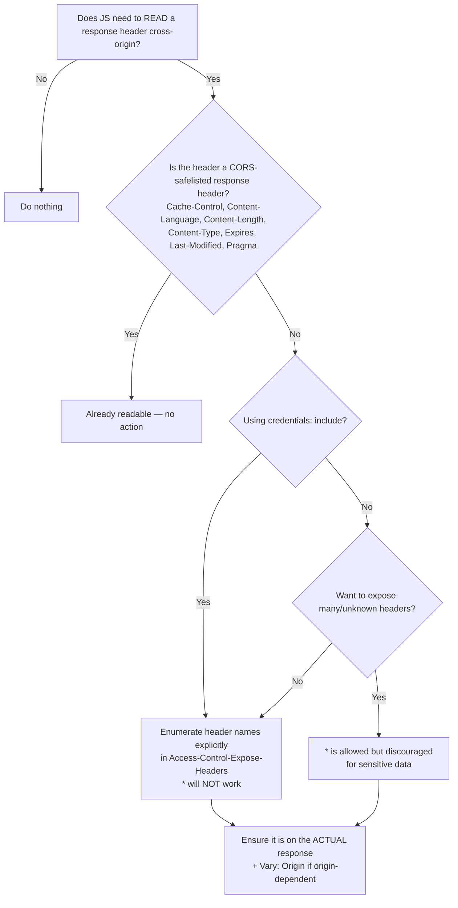

# Access-Control-Expose-Headers

## Quick Summary

`Access-Control-Expose-Headers` is a **response** header, set by the **server**, that controls **which response headers JavaScript running on a cross-origin page is allowed to read**. By default, a cross-origin `fetch`/`XMLHttpRequest` can only read a tiny allow-list of response headers (the *CORS-safelisted response headers*). Everything else — your `X-Total-Count`, `X-Request-Id`, `ETag`, `Location`, `Content-Disposition` — is present on the wire but **invisible** to `response.headers.get(...)` unless the server explicitly names it here. This header does **not** affect whether the request succeeds, nor whether the header is sent; it only lifts the read barrier the browser enforces on scripts. It is a comma-separated list of header names, or the wildcard `*` (with a hard credentials caveat covered below).

## What problem does this header solve?

You build a paginated list endpoint. The body is the array of items; the total count lives in `X-Total-Count: 4213` so your React table can render "Page 1 of 85" without a second query. On a same-origin app this just works. Move the frontend to `app.example.com` and the API to `api.example.com`, and suddenly:

```js
const res = await fetch('https://api.example.com/orders?page=1');
res.headers.get('X-Total-Count'); // null  ← header is on the wire, but hidden
```

The header is right there in DevTools' Network tab. `curl` sees it. But `res.headers.get()` returns `null`. Nothing errored, nothing logged — the value silently vanished. This is the exact problem `Access-Control-Expose-Headers` solves: **cross-origin JS reads are restricted to a safelist by default**, and the server must opt each additional header into readability.

The same trap bites: reading `Location` after a redirect-creating POST, reading a job id from `X-Request-Id` for support correlation, reading `Content-Disposition` to recover a download filename, reading `ETag` to drive your own conditional-request logic, reading `Retry-After` to back off intelligently, or reading pagination cursors in `Link`.

## Why was it introduced?

The header is part of the original **CORS specification** (W3C, ~2009–2014, now folded into the WHATWG **Fetch Standard**). CORS had to reconcile two goals: let sites make cross-origin requests, while preserving the pre-CORS security assumption that a script could not learn arbitrary information about a response from another origin.

Before CORS, the Same-Origin Policy meant a page essentially could not read cross-origin responses at all. CORS relaxed this — but the designers were deliberately conservative. Rather than expose the full response header set (which can carry sensitive routing, auth, and infrastructure details), they defined a minimal **CORS-safelisted response header** set that is always readable, and required servers to explicitly whitelist anything beyond it via `Access-Control-Expose-Headers`. This mirrors the request-side conservatism (safelisted request headers, preflight for the rest): the default is "reveal nothing extra," and the server must consciously opt in.

The CORS-safelisted response headers are:

- `Cache-Control`
- `Content-Language`
- `Content-Length`
- `Content-Type`
- `Expires`
- `Last-Modified`
- `Pragma`

(Note: `Content-Length` is readable via `Content-Range` semantics but has historically been quirky across engines; treat the list above as the reliable baseline.) Any header **not** on that list is unreadable from cross-origin script unless exposed.

## How does it work?

The header applies to the **actual** cross-origin response (both simple requests and the response to the actual request following a preflight). It is **not** a preflight-only header — it must be present on the real response whose headers you want to read. A common failure is putting it only on the `OPTIONS` preflight response; the preflight's headers are consumed by the browser's CORS machinery, not handed to your script.

- **Browser behavior:** After receiving a cross-origin response, the browser builds the `Headers` object exposed to JS by filtering. It starts from the CORS-safelisted set, then adds every header named in `Access-Control-Expose-Headers` (case-insensitive match). Headers not in that union are stripped from the JS-visible `Headers` object — `get()` returns `null`, and they do not appear during iteration. The raw bytes were still received; the filtering is purely at the JS boundary. If the response is a credentialed request (`credentials: 'include'`), the wildcard `*` is **not** treated as "all headers" — it is matched literally against a header literally named `*` (essentially useless), so you must enumerate names explicitly.
- **Server behavior:** The server (or app framework) must emit `Access-Control-Expose-Headers` on the actual response with the list of custom/non-safelisted headers it wants readable. It has no other effect server-side; the header is advisory metadata for the browser.
- **Proxy behavior:** Forward proxies pass the header through unchanged. A misconfigured proxy that strips "unknown" `X-*` or `Access-Control-*` headers will silently break exposure — the header value arrives, but the exposure directive is gone, so JS reads `null`.
- **CDN behavior:** CDNs forward it, but watch for two things: (1) header-normalization or allow-list features that drop headers not explicitly configured, and (2) `Vary`/caching interactions — if the exposed set differs by `Origin`, you must `Vary: Origin` or a cached response with the wrong exposure list can be served to another origin.
- **Reverse proxy behavior:** Nginx/HAProxy/Envoy pass it through, but if the reverse proxy is the entity *adding* CORS headers (common when the app is CORS-unaware), you must configure `add_header Access-Control-Expose-Headers ...` there and ensure it applies to the real response, not just `OPTIONS`.

## HTTP Request Example

A cross-origin GET. Note the request itself says nothing about exposure — exposure is entirely a response-side decision.

```http
GET /orders?page=1 HTTP/1.1
Host: api.example.com
Origin: https://app.example.com
Accept: application/json
```

## HTTP Response Example

```http
HTTP/1.1 200 OK
Content-Type: application/json
X-Total-Count: 4213
X-Request-Id: 7c1f9a2e-3b44-4c8a-9f21-0d5e6b8a1122
X-Page-Cursor: eyJvZmZzZXQiOjUwfQ==
Access-Control-Allow-Origin: https://app.example.com
Access-Control-Expose-Headers: X-Total-Count, X-Request-Id, X-Page-Cursor
Vary: Origin

{ "items": [ /* ... */ ] }
```

Now `res.headers.get('X-Total-Count')` returns `"4213"` in the browser. Without the `Access-Control-Expose-Headers` line, all three `X-*` headers are on the wire but read as `null`.

## Express.js Example

```js
const express = require('express');
const app = express();

// The single source of truth for which custom headers the browser may read.
// Keep this list explicit and audited — never reflexively expose everything.
const EXPOSED_HEADERS = ['X-Total-Count', 'X-Request-Id', 'X-Page-Cursor'];

// A small CORS middleware scoped to the API. We set headers on the ACTUAL
// response, not just on OPTIONS, because Expose-Headers is read from the real
// response the script receives.
app.use((req, res, next) => {
  const origin = req.headers.origin;

  // Reflect a vetted origin rather than using '*', so this also works with
  // credentials and so Expose-Headers wildcard caveats never bite us.
  const allowed = new Set(['https://app.example.com']);
  if (origin && allowed.has(origin)) {
    res.setHeader('Access-Control-Allow-Origin', origin);
    // Because the response now varies by Origin, caches must key on it,
    // otherwise a cached exposure list could leak to a different origin.
    res.setHeader('Vary', 'Origin');
  }

  // The line that actually makes the custom headers readable in JS.
  // Comma-separated, case-insensitive. Present on every real response.
  res.setHeader('Access-Control-Expose-Headers', EXPOSED_HEADERS.join(', '));

  next();
});

app.get('/orders', (req, res) => {
  const page = Number(req.query.page || 1);
  const total = 4213;

  // These headers are meaningless to the client unless exposed above.
  res.setHeader('X-Total-Count', String(total));
  res.setHeader('X-Request-Id', req.id || 'unknown');
  res.setHeader('X-Page-Cursor', Buffer.from(JSON.stringify({ offset: (page - 1) * 50 })).toString('base64'));

  res.json({ items: [/* ... */] });
});

app.listen(3000);
```

Using the popular `cors` package, the equivalent is one option:

```js
const cors = require('cors');
app.use(cors({
  origin: 'https://app.example.com',
  // Maps directly to Access-Control-Expose-Headers on actual responses.
  exposedHeaders: ['X-Total-Count', 'X-Request-Id', 'X-Page-Cursor'],
}));
```

If you omit `exposedHeaders`, the `cors` package sends **no** `Access-Control-Expose-Headers`, and your custom headers stay invisible to JS — a frequent "it works in curl but not in the browser" bug.

## Node.js Example

Raw `http` module — no framework hiding the mechanics:

```js
const http = require('http');

const ALLOWED_ORIGIN = 'https://app.example.com';

const server = http.createServer((req, res) => {
  const origin = req.headers.origin;

  if (origin === ALLOWED_ORIGIN) {
    res.setHeader('Access-Control-Allow-Origin', origin);
    res.setHeader('Vary', 'Origin');
  }

  // Expose the custom headers regardless of route; the browser only honors it
  // when the response is actually cross-origin, so it is harmless same-origin.
  res.setHeader('Access-Control-Expose-Headers', 'X-Total-Count, X-Request-Id');

  res.setHeader('X-Total-Count', '4213');
  res.setHeader('X-Request-Id', 'req-abc-123');
  res.setHeader('Content-Type', 'application/json');
  res.end(JSON.stringify({ items: [] }));
});

server.listen(3000);
```

## React Example

React never sets or reads this header directly — it reads the *effect* of it through `fetch`. The point is that your data-fetching code will silently get `null` unless the server exposed the header.

```jsx
import { useEffect, useState } from 'react';

function useOrders(page) {
  const [state, setState] = useState({ items: [], total: 0, loading: true });

  useEffect(() => {
    let cancelled = false;

    fetch(`https://api.example.com/orders?page=${page}`)
      .then(async (res) => {
        // This read returns "4213" ONLY if the server sent
        // Access-Control-Expose-Headers: X-Total-Count.
        // Otherwise it is null and the guard below defends against NaN.
        const rawTotal = res.headers.get('X-Total-Count');
        const total = rawTotal != null ? Number(rawTotal) : 0;

        const body = await res.json();
        if (!cancelled) setState({ items: body.items, total, loading: false });
      });

    return () => { cancelled = true; };
  }, [page]);

  return state;
}
```

The defensive `rawTotal != null` check is the tell of a seasoned engineer: cross-origin header reads are only as reliable as the server's exposure config, and the failure mode is a silent `null`, not an exception.

## Browser Lifecycle

1. Script issues a cross-origin `fetch`/`XHR`.
2. If it is a non-simple request, the browser runs a preflight first (see [Access-Control-Request-Method](./Access-Control-Request-Method.md)); the preflight response's headers are consumed internally, **not** exposed to script.
3. The actual request goes out; the server responds with the body plus headers, including `Access-Control-Expose-Headers`.
4. The network layer receives **all** headers into the internal response.
5. The CORS filtering step builds the JS-visible `Headers` object = CORS-safelisted set ∪ headers named in `Access-Control-Expose-Headers` (credentialed `*` handled literally).
6. Any header outside that union is dropped from the JS view. `headers.get()` for it returns `null`; it is absent from iteration.
7. Your promise resolves with the filtered `Response`.

## Production Use Cases

- **Pagination metadata:** `X-Total-Count`, `X-Page`, `X-Per-Page`, or a `Link` header for cursor pagination.
- **Observability / support:** `X-Request-Id` / `X-Trace-Id` so the frontend can surface an id users quote to support, and so client logs correlate with server traces.
- **Downloads:** `Content-Disposition` so a blob download can recover the server-suggested filename.
- **Rate limiting UX:** `X-RateLimit-Remaining`, `Retry-After` so the client can show cooldowns and back off.
- **Resource creation:** `Location` and `ETag` after a `POST`/`PUT`, so the SPA can navigate to or cache the new resource without a re-fetch.
- **Optimistic concurrency:** exposing `ETag` to feed `If-Match` on the next write.

## Common Mistakes

- **Setting it only on the OPTIONS preflight.** The preflight's headers never reach script; the header must be on the **actual** response. This is the single most common cause of "why is `get()` null."
- **Assuming custom headers are readable by default.** They are on the wire (DevTools/curl see them) but filtered out of the JS `Headers` object. The wire visibility fools people into thinking the code is wrong elsewhere.
- **Using `*` with credentials.** With `credentials: 'include'`, `*` is matched literally, not as "everything" — you must enumerate names. Silent breakage.
- **Forgetting `Vary: Origin`** when the exposed list or allowed origin is origin-dependent, causing cache poisoning across origins.
- **Expecting it to make a request succeed.** It has zero effect on request success or on which headers are *sent*; it only governs *readability*.
- **Case/whitespace fussiness fears** — names are case-insensitive; extra spaces around commas are tolerated. The real bugs are structural (wrong response, missing header), not cosmetic.

## Security Considerations

This header is a **deliberate confidentiality boundary**. Every header you expose is data you hand to arbitrary cross-origin script. Do not blanket-expose:

- **Never expose infrastructure/debug headers** (`Server`, `X-Powered-By`, internal routing headers, `Set-Cookie` — which is not exposable anyway and must never be, as it would defeat `HttpOnly`).
- **Avoid `*` on principle for anything sensitive**; enumerate. `*` also cannot be used with credentials, which is a hint from the spec authors that broad exposure and auth do not mix.
- **Treat exposed headers as public** relative to the allowed origins. If `app.example.com` is compromised via XSS, everything you exposed is readable.
- Exposure interacts with `Access-Control-Allow-Origin`: only responses actually shared with an origin can have their headers read, so tightening the allowed-origin list is the primary control; exposure is the secondary, per-header control.

## Performance Considerations

Negligible direct cost — it is a short response header. The performance-relevant subtlety is **caching**: if the exposed set varies by origin you need `Vary: Origin`, which fragments cache keys and lowers hit ratios. Prefer a **stable, origin-independent exposure list** where possible so responses cache uniformly. Exposing headers can *save* round-trips (e.g., reading `X-Total-Count` avoids a separate count query, reading `Location`/`ETag` avoids a re-fetch), so it is often a net performance win at the application level.

## Reverse Proxy Considerations

If Nginx terminates CORS on behalf of a CORS-unaware app:

```nginx
location /api/ {
    # Expose custom headers to browser JS on the ACTUAL response.
    add_header Access-Control-Expose-Headers "X-Total-Count, X-Request-Id" always;
    # 'always' ensures the header is added even on 4xx/5xx responses,
    # otherwise error responses won't expose the request id you need to debug them.

    proxy_pass http://backend;
}
```

The `always` flag matters: without it, `add_header` is skipped for non-2xx/3xx responses, so you lose exposure exactly on the error responses where `X-Request-Id` is most useful. Also confirm the proxy is not stripping the upstream's own `Access-Control-Expose-Headers` if the app already sets it (avoid double-setting, which can produce a duplicated header some browsers mishandle).

## CDN Considerations

- Ensure the CDN forwards `Access-Control-Expose-Headers` (most do by default). Header allow-list features (e.g., Cloudflare Transform Rules, Fastly VCL) can inadvertently drop it.
- If the exposed list depends on `Origin`, cache-key on `Origin` (`Vary: Origin` or explicit cache key config) to avoid serving one origin's exposure directive to another.
- CDNs that inject their own headers (`CF-Ray`, `X-Cache`) will not be readable in JS unless you also add them to the exposure list — occasionally desired for edge-debugging tooling.

## Cloud Deployment Considerations

- **API Gateway / ALB / managed platforms:** If the gateway manages CORS (AWS API Gateway, Azure APIM, GCP API Gateway), configure the exposed headers there; the gateway may override or strip app-set CORS headers. In AWS API Gateway, this maps to the `Access-Control-Expose-Headers` in the CORS configuration / integration response mapping.
- **Lambda/serverless:** You must set the header in your handler's response object; there is no framework middleware unless you add one. Function URLs and API Gateway both have distinct CORS config surfaces — set it in whichever terminates CORS.
- **Ingress controllers (Kubernetes):** NGINX Ingress exposes `nginx.ingress.kubernetes.io/cors-expose-headers` annotation.

## Debugging

- **Chrome DevTools:** The Network tab shows the header **on the wire regardless of exposure** — so seeing `X-Total-Count` in DevTools does **not** mean JS can read it. Test the actual read in the Console: `(await fetch(url)).headers.get('X-Total-Count')`. `null` = not exposed.
- **curl:** `curl -i https://api.example.com/orders` shows the header if sent, and confirms `Access-Control-Expose-Headers` is present. curl ignores CORS, so it cannot reproduce the *filtering* — only verify what the server emits.
- **Postman / Bruno:** Same as curl — they do not enforce CORS, so all headers are visible. Useful to confirm the server side, useless to reproduce the browser filter.
- **Node.js:** A plain `http` client sees everything; the filtering exists only in browsers.
- **Express logging:** Log `res.getHeaders()` right before send to confirm `Access-Control-Expose-Headers` is on the **actual** route response, not just the OPTIONS handler.
- **Key mental test:** "Present on the wire but `get()` returns null" ⇒ exposure problem, not a sending problem.

## Best Practices

- Maintain **one explicit, audited list** of exposed headers; treat it like a public API surface.
- Set it on the **actual response**, and set it uniformly (a middleware) so no route forgets it.
- Prefer **enumerated names over `*`**, always when credentials are involved.
- Pair with `Vary: Origin` when the CORS response is origin-dependent.
- Use `always`/equivalent so error responses also expose diagnostic headers like `X-Request-Id`.
- Never expose secrets, cookies, or infrastructure headers.
- Keep the exposed list origin-independent when you can, to preserve cache efficiency.

## Related Headers

- [Access-Control-Allow-Origin](./Access-Control-Allow-Origin.md) — decides *whether* the response is shared at all; exposure only matters for shared responses.
- [Access-Control-Allow-Headers](./Access-Control-Allow-Headers.md) — the request-side analogue (which request headers are allowed), not to be confused with expose (which response headers are readable).
- [Access-Control-Allow-Credentials](./Access-Control-Allow-Credentials.md) — its presence changes how `*` is interpreted here.
- [Vary](../06-Caching-Headers/Vary.md) — needed when exposure/allow-origin varies by `Origin`.
- [CORS Overview](./CORS-Overview.md) — the full model these headers compose into.

## Decision Tree



## Mental Model

Think of the cross-origin response as arriving in a **locked display case**. The full response (all headers) is inside the case — `curl` and DevTools can walk behind the glass and see everything. But **JavaScript can only touch what the shopkeeper (the server) has placed on the front counter**. The CORS-safelisted headers are always on the counter. `Access-Control-Expose-Headers` is the shopkeeper's list saying "these custom items are also cleared to hand to the customer." Anything not on the counter or the list stays behind glass: visible in inspection tools, untouchable by script. The wildcard `*` is a "hand them anything" note — but the shop refuses to honor it once the customer is carrying credentials, forcing the shopkeeper to name each item.
