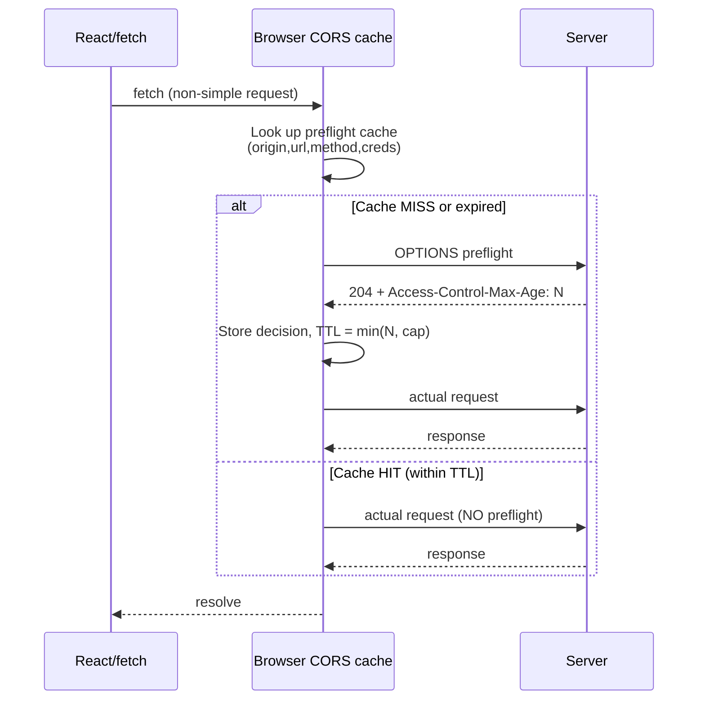
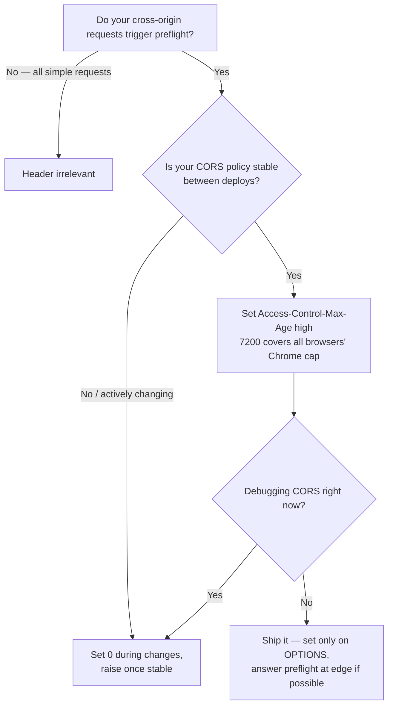

# Access-Control-Max-Age

## Quick Summary

`Access-Control-Max-Age` is a **response** header, set by the **server on a CORS preflight (`OPTIONS`) response**, that tells the browser **how many seconds it may cache the preflight result** for a given request. While the cache is warm, the browser skips the preflight entirely and fires the actual request directly, eliminating a full network round-trip. The value is an integer number of seconds. A value of `0` disables caching (re-preflight every time); a negative value is invalid. Critically, **browsers cap this value** — Chromium caps at 7200 seconds (2 hours), Firefox at 86400 seconds (24 hours) — so requesting a larger value is silently clamped down to the browser's ceiling. It is one of the highest-leverage, lowest-effort CORS performance knobs.

## What problem does this header solve?

CORS forces a **preflight** `OPTIONS` request before any "non-simple" cross-origin request (custom headers, `PUT`/`DELETE`/`PATCH`, non-simple content types — see [Access-Control-Request-Method](./Access-Control-Request-Method.md)). That preflight is a full round-trip: DNS/TCP/TLS may already be warm, but you still pay one RTT of latency and one request/response cycle **before** the request you actually care about.

Now imagine an SPA on `app.example.com` talking to `api.example.com` where nearly every call sends `Authorization` and `Content-Type: application/json` — both trigger preflight. Without caching, **every single API call becomes two round-trips**: preflight, then real request. On a 100 ms RTT mobile connection, that is +100 ms tax on every mutation and many reads. A dashboard firing 15 requests on load pays 15 extra RTTs.

`Access-Control-Max-Age` lets the server say "the preflight answer for this shape of request is stable — cache it for N seconds." The browser then preflights **once**, and every matching request for the next N seconds goes straight through. The two-round-trip tax collapses to one round-trip after the first call.

## Why was it introduced?

Preflight was baked into CORS (W3C CORS spec, now the WHATWG **Fetch Standard**) as the safety mechanism that lets servers vet dangerous cross-origin requests before they execute. But the designers immediately recognized preflight's latency cost, and included a caching mechanism from the start: `Access-Control-Max-Age` plus a browser-internal **preflight result cache** (also called the CORS-preflight cache). The header is the server's TTL hint; the cache is the browser's storage. The browser caps the TTL because a stale preflight decision (e.g., a header you have since disallowed) should not linger indefinitely — the caps bound the blast radius of a misconfiguration or a policy change.

## How does it work?

The preflight cache is keyed (per the Fetch Standard) by a tuple of: **request origin, request URL, the request method** (from `Access-Control-Request-Method`), and the **credentials mode**. Header-level entries are also cached. When a matching entry is warm, the browser omits the preflight and sends the actual request.

- **Browser behavior:** On receiving a preflight response with `Access-Control-Max-Age: N`, the browser stores the preflight result (allowed methods, allowed headers, credentials decision) in its per-origin preflight cache with TTL = `min(N, browser_cap)`. Subsequent matching non-simple requests within the TTL skip preflight. **Caps:** Chromium clamps to **7200 s (2 h)**; Firefox clamps to **86400 s (24 h)**; Safari/WebKit has historically used small values. Requesting `600000` on Chrome effectively yields 7200. `0` means "do not cache — preflight every time." Absent header ⇒ a small browser default (Chromium default is 5 s). The cache is also cleared by browser-cache clears and is scoped per browsing session/profile.
- **Server behavior:** The server sets `Access-Control-Max-Age` **only on the `OPTIONS` preflight response**. It has no meaning on the actual response. The value should reflect how stable your CORS policy is.
- **Proxy behavior:** Forward proxies pass it through. Proxies generally should **not** cache `OPTIONS` responses themselves; the caching that matters here is the browser's private preflight cache, not an HTTP shared cache.
- **CDN behavior:** A CDN may cache the `OPTIONS` response as an HTTP object, but that is orthogonal to the browser preflight cache. If the CDN caches `OPTIONS` responses per-origin incorrectly, it can serve the wrong CORS decision — usually you want CDNs to pass `OPTIONS` to origin or cache carefully with `Vary: Origin, Access-Control-Request-Method, Access-Control-Request-Headers`.
- **Reverse proxy behavior:** Nginx/Envoy typically synthesize the `OPTIONS` response (short-circuiting the app) and set `Access-Control-Max-Age` there for speed; this is a common and good pattern since the app never needs to see preflights.

## HTTP Request Example

The preflight the browser sends (the browser generates this; JS cannot):

```http
OPTIONS /orders HTTP/1.1
Host: api.example.com
Origin: https://app.example.com
Access-Control-Request-Method: PATCH
Access-Control-Request-Headers: authorization, content-type
```

## HTTP Response Example

The preflight response — note `Access-Control-Max-Age`:

```http
HTTP/1.1 204 No Content
Access-Control-Allow-Origin: https://app.example.com
Access-Control-Allow-Methods: GET, POST, PATCH, DELETE
Access-Control-Allow-Headers: authorization, content-type
Access-Control-Max-Age: 7200
Vary: Origin, Access-Control-Request-Method, Access-Control-Request-Headers
```

With this, the browser caches the "PATCH to /orders with authorization+content-type is allowed" decision for 7200 s (Chrome cap) and skips preflight on subsequent matching calls.

## Express.js Example

```js
const express = require('express');
const cors = require('cors');
const app = express();

app.use(cors({
  origin: 'https://app.example.com',
  methods: ['GET', 'POST', 'PATCH', 'DELETE'],
  allowedHeaders: ['Authorization', 'Content-Type'],
  // Maps to Access-Control-Max-Age on the preflight response.
  // 7200 = Chromium's ceiling; going higher is pointless there, though
  // Firefox would honor up to 86400. Pick the value your policy stability
  // justifies; here we assume CORS rules change rarely (deploys, not per-request).
  maxAge: 7200,
}));

app.patch('/orders/:id', (req, res) => res.json({ ok: true }));

app.listen(3000);
```

Manual version, showing that the header belongs **only** on the preflight:

```js
app.use((req, res, next) => {
  const origin = req.headers.origin;
  if (origin === 'https://app.example.com') {
    res.setHeader('Access-Control-Allow-Origin', origin);
    res.setHeader('Vary', 'Origin, Access-Control-Request-Method, Access-Control-Request-Headers');
  }

  if (req.method === 'OPTIONS') {
    // This is a preflight. Answer it fully and set the cache TTL.
    res.setHeader('Access-Control-Allow-Methods', 'GET, POST, PATCH, DELETE');
    res.setHeader('Access-Control-Allow-Headers', 'Authorization, Content-Type');
    // Cache the preflight decision so the NEXT matching request skips OPTIONS.
    res.setHeader('Access-Control-Max-Age', '7200');
    // 204: no body needed for a preflight; keeps it cheap.
    return res.status(204).end();
  }

  next();
});
```

Setting `Access-Control-Max-Age` on the actual (non-OPTIONS) response is a no-op the browser ignores — a common source of confusion.

## Node.js Example

```js
const http = require('http');

http.createServer((req, res) => {
  const origin = req.headers.origin;
  if (origin === 'https://app.example.com') {
    res.setHeader('Access-Control-Allow-Origin', origin);
    res.setHeader('Vary', 'Origin, Access-Control-Request-Method, Access-Control-Request-Headers');
  }

  if (req.method === 'OPTIONS') {
    res.setHeader('Access-Control-Allow-Methods', 'GET, POST, PATCH, DELETE');
    res.setHeader('Access-Control-Allow-Headers', 'Authorization, Content-Type');
    res.setHeader('Access-Control-Max-Age', '7200'); // seconds; capped by browser
    res.writeHead(204);
    return res.end();
  }

  res.writeHead(200, { 'Content-Type': 'application/json' });
  res.end(JSON.stringify({ ok: true }));
}).listen(3000);
```

## React Example

React/`fetch` never sets `Access-Control-Max-Age` — it is purely server-side. But its effect is observable: with a warm preflight cache, the mutation below issues **one** network request; cold, it issues two (OPTIONS then PATCH).

```jsx
async function saveOrder(id, patch) {
  // This request is "non-simple" (PATCH + Authorization + JSON content type),
  // so the browser preflights it. If a matching preflight is cached (thanks to
  // Access-Control-Max-Age), the OPTIONS is skipped and only this PATCH goes out.
  const res = await fetch(`https://api.example.com/orders/${id}`, {
    method: 'PATCH',
    headers: {
      'Authorization': `Bearer ${getToken()}`,
      'Content-Type': 'application/json',
    },
    body: JSON.stringify(patch),
  });
  return res.json();
}
```

To *see* the difference: open DevTools Network, filter by the endpoint, and watch the `OPTIONS` row appear only on the first call within the TTL window.

## Browser Lifecycle



1. JS triggers a non-simple cross-origin request.
2. Browser consults its preflight cache by (origin, URL, method, credentials mode).
3. **Miss/expired:** send `OPTIONS`, read `Access-Control-Max-Age`, store the decision with TTL = `min(value, cap)`, then send the actual request.
4. **Hit:** skip `OPTIONS`, send the actual request directly.
5. On TTL expiry the entry is evicted and the next request re-preflights.

## Production Use Cases

- **Auth-heavy SPAs:** Every request carries `Authorization`, forcing preflight. A 2-hour `max-age` turns "preflight on every call" into "preflight once per session-ish," roughly halving request count and shaving an RTT off most interactions.
- **Chatty dashboards:** Pages firing many mutations benefit hugely; the first call warms the cache, the rest skip preflight.
- **Mobile / high-latency clients:** The RTT savings are proportionally larger on slow networks — this is where `max-age` earns the most.
- **Stable public APIs:** If CORS policy changes only on deploy, a high `max-age` is safe and effective.

## Common Mistakes

- **Setting it on the actual response instead of the OPTIONS response** — the browser only reads it from preflight responses; elsewhere it is ignored.
- **Expecting values above the browser cap to take effect** — `Access-Control-Max-Age: 86400` on Chrome silently becomes 7200. Do not assume your huge value is honored; test in the target browser.
- **Setting `0` or omitting it** and then blaming CORS for slowness — no caching means preflight on every non-simple request.
- **Forgetting the cache key includes method and headers** — a warm PATCH entry does not cover a DELETE; each distinct request shape preflights separately (though header lists cache too).
- **Caching too aggressively while iterating on CORS config** — during development a large `max-age` makes CORS changes appear not to take effect because the browser is honoring a stale cached decision. Use `0` (or clear the cache) while debugging, then raise it in production.
- **Assuming it caches the actual response** — it caches only the *preflight decision*, never response bodies.

## Security Considerations

`Access-Control-Max-Age` is a **latency/security tradeoff**. A long TTL means a preflight decision persists in the browser even after you tighten your server policy — for up to the cap. If you revoke permission for a header or method, clients with a warm cache may keep skipping preflight and sending the now-disallowed request until their entry expires; the browser will re-preflight only after TTL, and only then enforce the new rule. The browser caps (2 h Chrome, 24 h Firefox) exist precisely to bound this window. Guidance:

- Keep `max-age` modest if your CORS policy might tighten reactively (e.g., during an incident). During an active security response, you may want to *lower* it or set `0` so new policy takes effect quickly.
- Never treat `max-age` as a security control — it only affects *when* the browser re-asks; it does not weaken the actual-request checks, which still apply on every real response via `Access-Control-Allow-Origin` etc.

## Performance Considerations

This is the header's whole reason for existing. The savings model:

- **Cold:** `T = RTT_preflight + RTT_actual` per non-simple request.
- **Warm:** `T = RTT_actual`.

For a session making `N` matching requests within the TTL, preflights drop from `N` to `1` — savings of `(N-1) × RTT`. On a 15-request dashboard load at 80 ms RTT, that is ~1.1 s saved. The header itself costs a handful of bytes on the preflight response. Set the highest value your policy stability supports (up to the browser cap) to maximize hit rate. Combine with short-circuiting `OPTIONS` at the edge/reverse proxy so even cold preflights are cheap.

## Reverse Proxy Considerations

Answer and cache preflights at the proxy so the app never sees `OPTIONS`:

```nginx
location /api/ {
    if ($request_method = OPTIONS) {
        add_header Access-Control-Allow-Origin "https://app.example.com" always;
        add_header Access-Control-Allow-Methods "GET, POST, PATCH, DELETE" always;
        add_header Access-Control-Allow-Headers "Authorization, Content-Type" always;
        # Cache the preflight decision in the browser for 2h (Chrome cap).
        add_header Access-Control-Max-Age 7200 always;
        add_header Content-Length 0;
        return 204;
    }
    proxy_pass http://backend;
}
```

This makes cold preflights terminate at the edge (sub-millisecond) and warm ones disappear entirely. Ensure `Vary` covers `Origin` and the preflight request headers if the decision is dynamic.

## CDN Considerations

- The browser preflight cache is client-side and independent of the CDN; `max-age` targets it directly.
- If you also let the CDN cache `OPTIONS` responses as HTTP objects, key them on `Origin, Access-Control-Request-Method, Access-Control-Request-Headers` to avoid serving one request shape's decision to another. Getting this wrong yields intermittent CORS failures that are painful to diagnose.
- Cloudflare/Fastly generally forward `Access-Control-Max-Age` unchanged; verify it is not stripped by header transform rules.

## Cloud Deployment Considerations

- **AWS API Gateway:** `MaxAge` is a first-class CORS setting (`maxAge` in HTTP API CORS config); it emits `Access-Control-Max-Age`. Remember the browser cap still applies on top of whatever you set.
- **ALB / managed load balancers:** If they synthesize CORS responses, set the max-age there; otherwise it comes from your app.
- **Kubernetes NGINX Ingress:** `nginx.ingress.kubernetes.io/cors-max-age` annotation.
- **Serverless:** For Lambda behind API Gateway, prefer configuring CORS (including max-age) at the gateway so preflights never invoke (and never bill) your function.

## Debugging

- **Chrome DevTools → Network:** Watch for the `OPTIONS` row. If it appears on the first request but not subsequent ones, caching is working. To reset, use the "Disable cache" checkbox (which also affects preflight cache) or clear browsing data. Chromium also exposes `chrome://net-internals` for deeper inspection.
- **Verify the value the browser actually used:** because of caps, the honored TTL may be lower than what you sent. Empirically, note when `OPTIONS` reappears — that interval reveals the effective TTL (bounded by the cap).
- **curl:** `curl -i -X OPTIONS -H 'Origin: https://app.example.com' -H 'Access-Control-Request-Method: PATCH' https://api.example.com/orders` shows the `Access-Control-Max-Age` the server emits. curl has no preflight cache, so it only verifies the server side.
- **Postman / Bruno:** Confirm the server emits the header on OPTIONS; they do not model the browser preflight cache.
- **Debugging tip:** If CORS config changes "aren't taking effect," you are likely hitting a warm preflight cache — set `max-age` to `0` temporarily and hard-reload.

## Best Practices

- Set it **only** on the preflight (`OPTIONS`) response.
- Use the **largest value your policy stability justifies**, but know it is clamped (7200 Chrome, 86400 Firefox) — `7200` is the pragmatic universal choice.
- Short-circuit and answer preflights at the reverse proxy/edge to make even cold preflights cheap.
- During CORS development or a security incident, drop it to `0` so changes apply immediately.
- Pair with correct `Vary` so caches key on the request-shape inputs.
- Don't rely on it for security; it only shifts *when* re-validation happens.

## Related Headers

- [Access-Control-Request-Method](./Access-Control-Request-Method.md) — part of the preflight-cache key; determines what a warm entry covers.
- [Access-Control-Request-Headers](./Access-Control-Request-Headers.md) — header list that also participates in preflight caching.
- [Access-Control-Allow-Methods](./Access-Control-Allow-Methods.md) / [Access-Control-Allow-Headers](./Access-Control-Allow-Headers.md) — the decisions being cached.
- [Access-Control-Allow-Origin](./Access-Control-Allow-Origin.md) — still enforced on every actual response regardless of preflight caching.
- [CORS Overview](./CORS-Overview.md) — the preflight flow in full.

## Decision Tree



## Mental Model

Think of preflight as a **bouncer checking your ID at the door**. Without `Access-Control-Max-Age`, the bouncer re-checks your ID *every single time* you walk in — even if you were just inside. `Access-Control-Max-Age` is the bouncer stamping your hand: "cleared for the next 2 hours." While the stamp is valid you walk straight past. But the club sets a maximum stamp duration (the browser cap) no matter how long you ask for, and the stamp only says "you may enter" — the bouncer still checks what you actually do inside every time (the real-response CORS checks never get cached). When the club changes its rules, stamped guests keep getting the old treatment until their stamp fades — which is why you keep the stamp duration modest when the rules might change.
