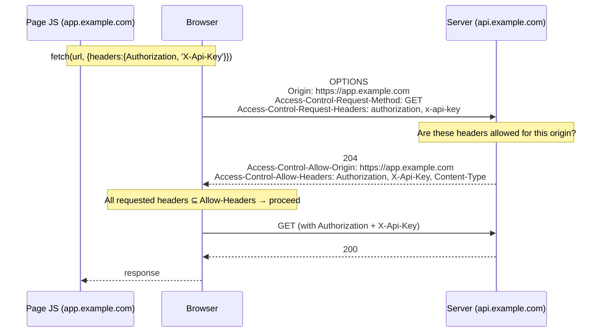
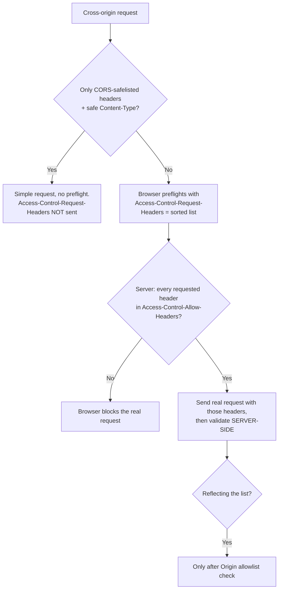

# Access-Control-Request-Headers

## Quick Summary

`Access-Control-Request-Headers` is a **request** header that the **browser** automatically adds to a CORS **preflight** (`OPTIONS`) request to announce *which non-safelisted request headers the real cross-origin request intends to send* — e.g. `Access-Control-Request-Headers: authorization, content-type, x-api-key`. It is the header counterpart to [`Access-Control-Request-Method`](./Access-Control-Request-Method.md): where that one asks "may I use this method?", this one asks "may I send these headers?". The server answers on the preflight response with [`Access-Control-Allow-Headers`](./Access-Control-Allow-Headers.md). Like its sibling, it is a [forbidden header](../02-Core-Concepts/Forbidden-and-Restricted-Headers.md) — page JavaScript cannot set it; only the browser can — and its value is an alphabetically-sorted, lowercased, comma-separated list of the header names your `fetch`/`axios` call added that aren't on the CORS "safelist." Adding a single custom header (like `Authorization` or `X-Requested-With`) to a cross-origin request is one of the most common reasons a request suddenly starts preflighting.

## What problem does this header solve?

CORS lets a page make cross-origin requests, but request *headers* are a distinct channel of power and risk. A custom header like `X-Admin-Override: true`, or an `Authorization` bearer token, or a JSON `Content-Type` that changes how the server parses the body — these are all things a plain HTML form could **never** send cross-origin before CORS existed. Allowing them silently would expand what a malicious origin could do to a server that wasn't designed to expect cross-origin traffic.

`Access-Control-Request-Headers` solves this by making the browser **declare, in advance, exactly which "non-safe" headers it's about to send**, so the server can approve or reject them *before* the real request runs. Just as [`Access-Control-Request-Method`](./Access-Control-Request-Method.md) protects against dangerous *methods*, this protects against dangerous *headers*. Without it, a server would receive custom headers on a cross-origin request with no chance to veto them ahead of time, and CORS's "ask before you act" guarantee would be incomplete.

## Why was it introduced?

It was introduced with CORS (W3C CORS, 2014; now the WHATWG **Fetch Standard**) as part of the preflight design. The spec defines a small set of **CORS-safelisted request headers** — roughly `Accept`, `Accept-Language`, `Content-Language`, and `Content-Type` *when its value is one of the "safe" form types* (`text/plain`, `application/x-www-form-urlencoded`, `multipart/form-data`), plus a few others under value constraints — because those are headers (and values) a legacy HTML form could already emit cross-origin. **Any other header** the page adds is "new power" and triggers a preflight.

`Access-Control-Request-Headers` is how the browser communicates that "new power" list to the server during the preflight so the server can decide. It's a **forbidden header name**, so page JS can't forge or override it — the user agent computes it deterministically from the headers the request actually sets. That determinism (sorted, lowercased) also makes preflight responses cacheable and comparable.

## How does it work?

When JS makes a cross-origin request that includes non-safelisted headers, the browser preflights and lists those headers:



- **Browser behavior:** The browser collects every request header that is *not* CORS-safelisted, **lowercases** them, **sorts** them alphabetically, joins with `, `, and puts the result in `Access-Control-Request-Headers` on the preflight. After the preflight, it checks that *every* requested header appears in the response's [`Access-Control-Allow-Headers`](./Access-Control-Allow-Headers.md) (case-insensitively, or `*` for non-credentialed requests). If any is missing, it aborts and never sends the real request.
- **Server behavior:** On `OPTIONS`, the server reads `Access-Control-Request-Headers` and responds with `Access-Control-Allow-Headers` listing the headers it permits (a common shortcut is to **reflect** the requested list, but only after validating the origin).
- **Proxy behavior:** Passes it through unchanged.
- **CDN behavior:** If caching preflights, the cache key must include this header (and `Origin` + `Access-Control-Request-Method`), or a preflight requesting `authorization` might be answered from a cached preflight that didn't allow it.
- **Reverse proxy behavior:** Often the tier that answers `OPTIONS`; it can echo `Access-Control-Request-Headers` back into `Access-Control-Allow-Headers`.

The header appears **only on the preflight `OPTIONS`** — never on the real request (the real request just carries the actual headers) and never on a response.

## HTTP Request Example

A preflight announcing two custom headers (note the lowercased, sorted list):

```http
OPTIONS /api/orders HTTP/1.1
Host: api.example.com
Origin: https://app.example.com
Access-Control-Request-Method: POST
Access-Control-Request-Headers: authorization, content-type, x-idempotency-key
```

The actual request that follows carries the real headers (but **not** `Access-Control-Request-Headers`):

```http
POST /api/orders HTTP/1.1
Host: api.example.com
Origin: https://app.example.com
Authorization: Bearer eyJ...
Content-Type: application/json
X-Idempotency-Key: 7f3a-...

{"item":"sku-1","qty":2}
```

## HTTP Response Example

Granting the requested headers:

```http
HTTP/1.1 204 No Content
Access-Control-Allow-Origin: https://app.example.com
Access-Control-Allow-Methods: POST, GET, OPTIONS
Access-Control-Allow-Headers: Authorization, Content-Type, X-Idempotency-Key
Access-Control-Max-Age: 600
Vary: Origin, Access-Control-Request-Headers
```

A **denial** (a requested header is missing → browser blocks the real request):

```http
HTTP/1.1 204 No Content
Access-Control-Allow-Origin: https://app.example.com
Access-Control-Allow-Methods: POST, GET, OPTIONS
Access-Control-Allow-Headers: Content-Type
```

Here the browser sees the request wanted `authorization` and `x-idempotency-key` but the server only allowed `Content-Type`, so it refuses to send the `POST`.

## Express.js Example

You rarely parse `Access-Control-Request-Headers` yourself, but reflecting it (post origin-validation) is the most robust pattern:

```js
const express = require('express');
const app = express();

const ALLOWED_ORIGINS = new Set(['https://app.example.com']);

app.use((req, res, next) => {
  const origin = req.headers.origin;
  if (origin && ALLOWED_ORIGINS.has(origin)) {
    res.set('Access-Control-Allow-Origin', origin);
    res.vary('Origin');
  }

  if (req.method === 'OPTIONS' && origin && ALLOWED_ORIGINS.has(origin)) {
    // The browser tells us exactly which non-safe headers it wants to send.
    const requested = req.headers['access-control-request-headers']; // e.g. 'authorization, content-type'

    res.set('Access-Control-Allow-Methods', 'GET, POST, PUT, PATCH, DELETE, OPTIONS');

    // Reflect the requested headers back. Safe ONLY because we already validated
    // the origin above. Reflecting for ANY origin is how you accidentally allow
    // arbitrary headers from arbitrary sites.
    res.set('Access-Control-Allow-Headers', requested || 'Content-Type, Authorization');

    // Because our response now depends on this request header, caches must key on it.
    res.vary('Access-Control-Request-Headers');

    res.set('Access-Control-Max-Age', '600');
    return res.status(204).end();
  }
  next();
});

app.post('/api/orders', express.json(), (req, res) => {
  res.status(201).json({ id: 'ord_1', body: req.body });
});

app.listen(3000);
```

Idiomatic `cors` package version (it reflects `Access-Control-Request-Headers` by default when you don't specify `allowedHeaders`):

```js
const cors = require('cors');
app.use(cors({
  origin: 'https://app.example.com',
  allowedHeaders: ['Content-Type', 'Authorization', 'X-Idempotency-Key'], // becomes Access-Control-Allow-Headers
}));
```

Why each piece matters: reflecting `req.headers['access-control-request-headers']` into `Access-Control-Allow-Headers` is convenient and robust (it adapts to whatever the client sends), but it's **only** safe inside the `ALLOWED_ORIGINS` guard — otherwise you're telling every origin "yes, send whatever custom headers you want." `res.vary('Access-Control-Request-Headers')` stops a cache from serving a preflight that allowed `authorization` to a later preflight that didn't ask for it (and vice-versa). Remove the reflection/allow-list and the browser will block any request that adds `Authorization`, which manifests as "my authenticated API works in Postman but not in the browser."

## Node.js Example

Raw `http`:

```js
const http = require('http');
const ALLOWED = new Set(['https://app.example.com']);

http.createServer((req, res) => {
  const origin = req.headers.origin;
  const trusted = origin && ALLOWED.has(origin);
  if (trusted) {
    res.setHeader('Access-Control-Allow-Origin', origin);
    res.setHeader('Vary', 'Origin, Access-Control-Request-Headers');
  }

  if (req.method === 'OPTIONS') {
    const wantsHeaders = req.headers['access-control-request-headers'] || '';
    console.log('Preflight requests headers:', wantsHeaders);
    if (trusted) {
      res.setHeader('Access-Control-Allow-Methods', 'GET, POST, OPTIONS');
      // Reflect (validated origin only) or use a fixed allowlist:
      res.setHeader('Access-Control-Allow-Headers', wantsHeaders || 'Content-Type');
      res.setHeader('Access-Control-Max-Age', '600');
    }
    res.statusCode = 204;
    return res.end();
  }

  res.setHeader('Content-Type', 'application/json');
  res.end(JSON.stringify({ ok: true }));
}).listen(3000);
```

The core insight is identical to Express: read `access-control-request-headers`, answer with `Access-Control-Allow-Headers`, and only reflect after validating the origin.

## React Example

React can't set `Access-Control-Request-Headers` (forbidden), but it *causes* it whenever a `fetch`/`axios` call adds a non-safelisted header:

```jsx
// Adding Authorization + a JSON Content-Type makes this NON-simple → the browser
// sends a preflight with `Access-Control-Request-Headers: authorization, content-type`.
async function createOrder(order, token) {
  const res = await fetch('https://api.example.com/api/orders', {
    method: 'POST',
    headers: {
      'Content-Type': 'application/json',  // application/json is NOT safelisted → triggers preflight
      Authorization: `Bearer ${token}`,    // custom header → also listed in the preflight
      'X-Idempotency-Key': crypto.randomUUID(),
    },
    body: JSON.stringify(order),
  });
  if (!res.ok) throw new Error('order failed');
  return res.json();
}

// Contrast: a request with ONLY safelisted headers is simple → no preflight.
async function ping() {
  return fetch('https://api.example.com/ping'); // no custom headers → no Access-Control-Request-Headers
}
```

Key points for React devs:
1. **`Content-Type: application/json` alone forces a preflight** — this is why virtually every JSON API call preflights. There's no way around it for JSON bodies (short of using a safelisted content type, which changes parsing).
2. If a call fails with a CORS error mentioning a header (e.g. "Request header field authorization is not allowed by Access-Control-Allow-Headers"), the server's `Access-Control-Allow-Headers` doesn't include a header your request sent — fix it server-side.
3. Every distinct *set* of custom headers can produce a distinct preflight; keeping headers consistent lets [`Access-Control-Max-Age`](./Access-Control-Max-Age.md) caching work better.

## Browser Lifecycle

1. JS makes a cross-origin request whose header set includes at least one **non-safelisted** header (or a non-safe `Content-Type`).
2. The browser builds `Access-Control-Request-Headers` by taking those headers, **lowercasing** and **sorting** them, and joining with commas; it sends this on the preflight `OPTIONS` alongside [`Access-Control-Request-Method`](./Access-Control-Request-Method.md).
3. It receives the preflight response and checks that **every** requested header is covered by [`Access-Control-Allow-Headers`](./Access-Control-Allow-Headers.md) (case-insensitive; `*` allowed only for non-credentialed requests, and even then `Authorization` must be listed explicitly per the spec).
4. **All covered** → the browser sends the real request with the actual headers. **Any missing** → CORS error; real request never sent.
5. The preflight decision can be cached per [`Access-Control-Max-Age`](./Access-Control-Max-Age.md), keyed (conceptually) on origin + method + this header set.

## Production Use Cases

- **Token-authenticated APIs:** any request with `Authorization: Bearer ...` cross-origin triggers a preflight listing `authorization`; the server must allow it.
- **JSON APIs:** `Content-Type: application/json` is non-safelisted, so essentially all JSON POST/PUT/PATCH preflight with `content-type` in the list.
- **Idempotency / tracing / tenancy headers:** custom headers like `X-Idempotency-Key`, `X-Request-Id`, `X-Tenant-Id` all appear in `Access-Control-Request-Headers` and must be allowlisted.
- **Reflecting for flexible gateways:** API gateways/edge often reflect `Access-Control-Request-Headers` into `Access-Control-Allow-Headers` (post origin validation) to support many clients without enumerating every header.
- **CSRF-token headers:** sending an anti-CSRF token via a custom header (a common pattern) forces preflight and must be allowlisted.

## Common Mistakes

- **`Access-Control-Allow-Headers` doesn't include a sent header.** The #1 cause of "works in Postman, fails in browser." Add the header (or reflect the request list).
- **Reflecting the request list for *any* origin.** Convenient but insecure if not gated behind an origin allowlist — you're granting arbitrary headers to arbitrary sites.
- **Assuming `Access-Control-Allow-Headers: *` covers everything.** Under credentialed requests, `*` is treated literally (not a wildcard), and even without credentials, `Authorization` must be named explicitly in current spec text — so relying on `*` can silently fail for auth.
- **Trying to set it from JS.** Forbidden; ignored.
- **Forgetting it's lowercased/sorted.** If you string-match the raw value, remember the browser normalizes it.
- **Not handling `OPTIONS` at all.** No preflight response → every header-bearing cross-origin request is blocked.
- **Caching preflights without `Vary: Access-Control-Request-Headers`.** A cached preflight for one header set gets wrongly applied to another.

## Security Considerations

- **Reflect only after validating the origin.** Blindly echoing `Access-Control-Request-Headers` into `Access-Control-Allow-Headers` for all origins effectively disables header-level CORS protection. Always gate on an allowlist.
- **It's browser-trustworthy, not server-authoritative.** A forbidden header can't be forged by page JS, so a real browser reports honestly — but a non-browser client can send any headers regardless of preflight. **Authorize and validate the actual request server-side**; never treat the preflight as security.
- **Don't over-grant.** Allowing headers you don't use (or a broad `*`) widens what malicious origins can attempt. List only what your API consumes.
- **`Authorization` is special.** Per the Fetch spec, wildcard `Access-Control-Allow-Headers: *` does **not** cover `Authorization`; it must be explicitly allowed. Relying on `*` for auth headers is a subtle, common bug.
- **Header injection via reflection.** Sanitize if you construct the allow list from the request — though the browser's normalization limits abuse, defense-in-depth matters at the edge.

## Performance Considerations

- **Each new custom header can change the preflight**, and different header sets defeat preflight caching. Keep the header set stable across requests to the same endpoint.
- **[`Access-Control-Max-Age`](./Access-Control-Max-Age.md)** caches the preflight (including the allowed-headers decision), removing the `OPTIONS` round-trip for repeated matching requests — the main mitigation for preflight latency.
- **Minimize custom headers** where possible; every one contributes to preflighting and to header size.
- **Answer `OPTIONS` cheaply** (204, no body, no DB) — pure overhead.

## Reverse Proxy Considerations

Reflecting the requested headers at Nginx (origin validated via `map`):

```nginx
map $http_origin $cors_origin {
  default "";
  "https://app.example.com" $http_origin;
}

server {
  location /api/ {
    if ($request_method = OPTIONS) {
      add_header Access-Control-Allow-Origin  $cors_origin always;
      add_header Access-Control-Allow-Methods "GET, POST, PUT, PATCH, DELETE, OPTIONS" always;
      # Reflect exactly what the browser asked for (validated origin only):
      add_header Access-Control-Allow-Headers $http_access_control_request_headers always;
      add_header Access-Control-Max-Age 600 always;
      add_header Vary "Origin, Access-Control-Request-Headers" always;
      return 204;
    }
    proxy_pass http://app_upstream;
  }
}
```

Key points: `$http_access_control_request_headers` is Nginx's variable for the incoming `Access-Control-Request-Headers`; echoing it into `Access-Control-Allow-Headers` supports arbitrary client header sets. Guard it behind the `$cors_origin` map so only trusted origins get the reflection. The `Vary` line keeps cached preflights correct.

## CDN Considerations

- **Preflight caching must key on this header.** If a CDN caches `OPTIONS` responses, include `Access-Control-Request-Headers` (and `Origin`, `Access-Control-Request-Method`) in the cache key, or a preflight that allowed `authorization` could be served to one that shouldn't have it.
- **Cloudflare/Fastly/CloudFront** can reflect or fix the allowed-headers list at the edge; if you reflect, validate the origin at the edge too.
- **Managed CORS features** often auto-build `Access-Control-Allow-Headers` from the request; verify they don't over-permit.
- Ensure the CDN forwards `OPTIONS` and this header to origin if the origin owns CORS logic.

## Cloud Deployment Considerations

- **API Gateways (AWS API Gateway, Apigee):** you declare allowed headers in CORS config; the gateway returns them in `Access-Control-Allow-Headers`. Include every custom header your clients send (esp. `Authorization`, `Content-Type`).
- **Load balancers:** pass through; no interpretation.
- **Serverless:** ensure the function or fronting gateway answers `OPTIONS` and lists the headers; a common failure is a Lambda that handles `POST` but not the preflight.
- **Managed edge (Vercel/Netlify):** set allowed headers in middleware/config; test with an actual browser, not just curl.

## Debugging

- **Chrome DevTools → Network:** the `OPTIONS`/preflight row's **Request Headers** show `Access-Control-Request-Headers`; the **Response Headers** must show a superset in `Access-Control-Allow-Headers`. A console error like "Request header field X is not allowed by Access-Control-Allow-Headers in preflight response" points straight here.
- **curl (simulate):** `curl -i -X OPTIONS https://api.example.com/api/orders -H 'Origin: https://app.example.com' -H 'Access-Control-Request-Method: POST' -H 'Access-Control-Request-Headers: authorization, content-type'` — confirm the response's `Access-Control-Allow-Headers` covers both.
- **Postman / Bruno:** can send the preflight manually to inspect the answer; they don't enforce CORS, so a passing request there doesn't prove the browser will allow it.
- **Node.js/Express logging:** log `req.headers['access-control-request-headers']` on `OPTIONS`.
- **Reproduce the exact set:** copy the failing request's headers, subtract the safelisted ones, lowercase+sort — that's what the browser sends; verify each is allowed.

## Best Practices

- [ ] Never set this header in client code — it's forbidden and browser-managed.
- [ ] Ensure [`Access-Control-Allow-Headers`](./Access-Control-Allow-Headers.md) covers **every** non-safelisted header your clients send (especially `Authorization` and `Content-Type`).
- [ ] Reflect `Access-Control-Request-Headers` **only** after validating the [`Origin`](../03-Request-Headers/Origin.md).
- [ ] Don't rely on `Access-Control-Allow-Headers: *` for `Authorization` — list it explicitly.
- [ ] Add `Vary: Origin, Access-Control-Request-Headers` when preflights are cacheable.
- [ ] Set [`Access-Control-Max-Age`](./Access-Control-Max-Age.md) and keep your client header set stable to maximize preflight cache hits.
- [ ] List only headers you actually consume — avoid over-granting.
- [ ] Authorize/validate the **actual** request server-side; the preflight is not security.

## Related Headers

- [Access-Control-Allow-Headers](./Access-Control-Allow-Headers.md) — the response header that answers this; must cover every requested header.
- [Access-Control-Request-Method](./Access-Control-Request-Method.md) — the sibling preflight header announcing the intended method.
- [Access-Control-Allow-Methods](./Access-Control-Allow-Methods.md) — answers the method question.
- [Access-Control-Allow-Origin](./Access-Control-Allow-Origin.md) / [Origin](../03-Request-Headers/Origin.md) — origin validation, prerequisite for reflection.
- [Access-Control-Allow-Credentials](./Access-Control-Allow-Credentials.md) — changes wildcard semantics (`*` no longer a wildcard, `Authorization` must be explicit).
- [Access-Control-Max-Age](./Access-Control-Max-Age.md) — caches the preflight so this header isn't re-sent every time.
- [Content-Type](../04-Response-Headers/Content-Type.md) — `application/json` is the usual reason a request becomes non-simple.
- [Forbidden and Restricted Headers](../02-Core-Concepts/Forbidden-and-Restricted-Headers.md) — why JS can't set this.
- [CORS Overview](./CORS-Overview.md) — the whole model.

## Decision Tree



## Mental Model

Think of `Access-Control-Request-Headers` as the **customs declaration form you fill out before entering a country with unusual items in your luggage**. Ordinary items (a `GET` with only safelisted headers) need no declaration — walk through the green channel. But if you're carrying something special — a *diplomatic passport* (`Authorization`), a *sealed document in an unusual format* (`Content-Type: application/json`), or *specialized equipment* (`X-Idempotency-Key`) — you must declare each item in advance: "I intend to bring `authorization, content-type, x-idempotency-key`." Customs (the server) checks its rules and stamps an approval listing what's permitted (`Access-Control-Allow-Headers`). Only if *every* declared item is on the approved list do you proceed. Two things keep it honest: the form is filled out by the *airport system*, not by you scribbling whatever you want (it's a forbidden header the browser controls), and — crucially — customs still *inspects your actual luggage when you arrive* (server-side validation), because a declaration form is a courtesy, not a guarantee.
