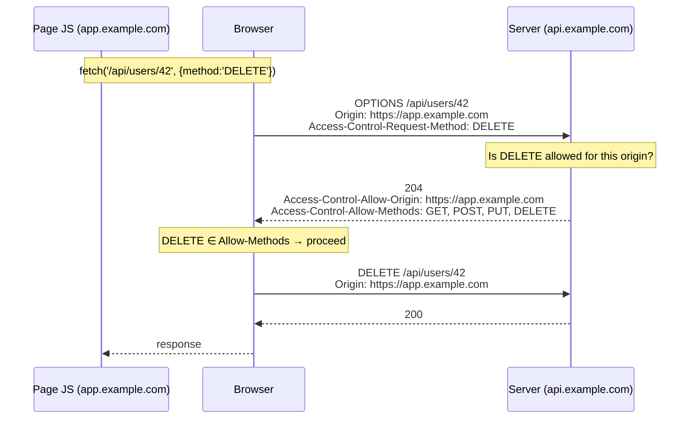
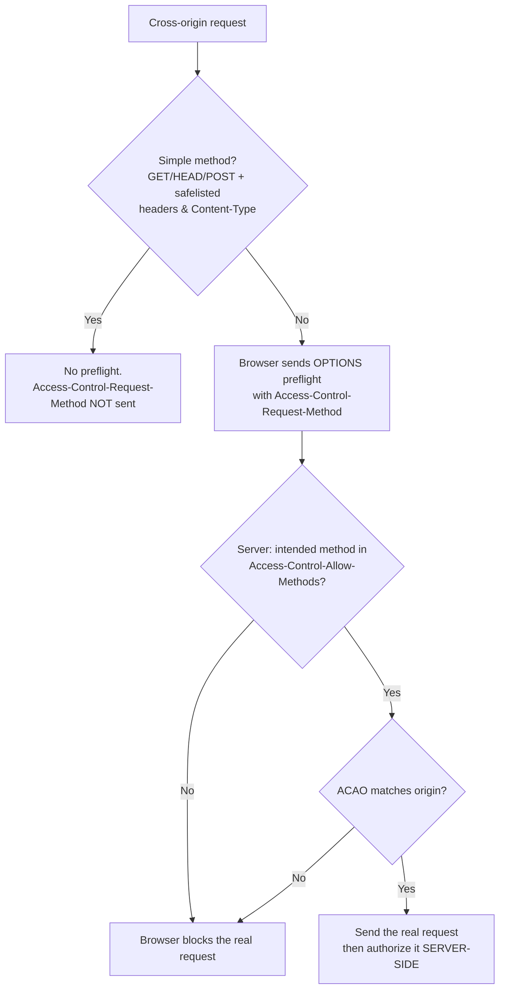

# Access-Control-Request-Method

## Quick Summary

`Access-Control-Request-Method` is a **request** header that the **browser** — not your code — automatically adds to a CORS **preflight** (`OPTIONS`) request. It announces, in advance, *which HTTP method the real cross-origin request intends to use* — e.g. `Access-Control-Request-Method: PUT`. Together with its sibling [`Access-Control-Request-Headers`](./Access-Control-Request-Headers.md), it is the browser's way of *asking the server for permission before it acts*: "I'm about to send a `PUT` from origin `X` — will you allow it?" The server answers on the preflight response via [`Access-Control-Allow-Methods`](./Access-Control-Allow-Methods.md). You never set this header manually (it's on the [Forbidden Headers](../02-Core-Concepts/Forbidden-and-Restricted-Headers.md) list, so JavaScript *can't*), but understanding it is essential for reasoning about why preflights happen, why they fail, and how to configure a server to satisfy them.

## What problem does this header solve?

Some cross-origin requests can *change state* — a `DELETE /api/users/42`, a `PUT` that overwrites a record, a `PATCH`. If the browser fired those off blindly and only checked CORS on the *response*, the damage would already be done: the server would have deleted the user before the browser discovered the origin wasn't allowed to read the result. For "non-simple" methods, that's unacceptable.

The preflight mechanism solves this by making the browser **ask first, act second**. Before sending a state-changing or otherwise non-simple cross-origin request, the browser sends a harmless `OPTIONS` "preflight" that carries `Access-Control-Request-Method` (and possibly `Access-Control-Request-Headers`). This lets the server veto the request *before any real method executes*. `Access-Control-Request-Method` is the specific field that tells the server which method is coming, so the server can decide whether to permit `DELETE`/`PUT`/`PATCH` from that origin. Without it, the server would have no way to authorize the method ahead of time, and the whole "check before executing dangerous cross-origin operations" guarantee would collapse.

## Why was it introduced?

It was introduced as part of the original CORS design (W3C CORS, 2014; now the WHATWG **Fetch Standard**) alongside the entire preflight concept. The CORS spec draws a line between **"simple" requests** — `GET`, `HEAD`, and `POST` with only a handful of "CORS-safelisted" request headers and a safelisted `Content-Type` (`text/plain`, `application/x-www-form-urlencoded`, `multipart/form-data`) — which can be sent directly, and **everything else**, which must be preflighted. The reasoning: "simple" requests are ones a plain HTML form could already make cross-origin *before* CORS existed, so they introduce no new attack surface; anything a form couldn't do (a `PUT`, a `DELETE`, a JSON `Content-Type`, a custom header) is *new* power that the server must explicitly grant.

`Access-Control-Request-Method` exists to carry the *method* dimension of that "new power" question to the server during preflight. It's a **forbidden header name**, meaning the Fetch spec prohibits page JavaScript from setting or overriding it — only the user agent may — which guarantees the server can trust it as an honest statement of the browser's intent (within the browser's own integrity; see Security).

## How does it work?

When JS initiates a non-simple cross-origin request, the browser pauses and first sends a preflight:



- **Browser behavior:** The browser decides a request is non-simple, constructs the `OPTIONS` preflight, and sets `Access-Control-Request-Method` to the (uppercased) method of the pending real request. It then checks the response's [`Access-Control-Allow-Methods`](./Access-Control-Allow-Methods.md): if the intended method is listed (or the response says `*` for a non-credentialed request), it proceeds; otherwise it aborts with a CORS error and **never sends the real request**.
- **Server behavior:** On an `OPTIONS` request, the server reads `Access-Control-Request-Method`, decides whether to permit it for the requesting [`Origin`](../03-Request-Headers/Origin.md), and responds with `Access-Control-Allow-Methods` (and the other CORS headers). It should return quickly (typically `204`) with no body.
- **Proxy behavior:** Forward proxies pass it through untouched; it's a normal request header.
- **CDN behavior:** CDNs may cache preflight (`OPTIONS`) responses; the cache key should include `Origin`, `Access-Control-Request-Method`, and `Access-Control-Request-Headers` so a preflight for `DELETE` isn't answered with a cached preflight for `GET`.
- **Reverse proxy behavior:** Often the tier that answers `OPTIONS` directly (to offload the app); it reads `Access-Control-Request-Method` and emits the matching `Access-Control-Allow-Methods`.

The header appears **only on the preflight `OPTIONS` request** — never on the actual request, and never on any response.

## HTTP Request Example

A preflight for an intended `DELETE`:

```http
OPTIONS /api/users/42 HTTP/1.1
Host: api.example.com
Origin: https://app.example.com
Access-Control-Request-Method: DELETE
Access-Control-Request-Headers: authorization
```

The actual request that follows (note: **no** `Access-Control-Request-Method` here — it was only for the preflight):

```http
DELETE /api/users/42 HTTP/1.1
Host: api.example.com
Origin: https://app.example.com
Authorization: Bearer eyJ...
```

## HTTP Response Example

The server's preflight reply, granting the method:

```http
HTTP/1.1 204 No Content
Access-Control-Allow-Origin: https://app.example.com
Access-Control-Allow-Methods: GET, POST, PUT, PATCH, DELETE, OPTIONS
Access-Control-Allow-Headers: Authorization, Content-Type
Access-Control-Max-Age: 600
Vary: Origin, Access-Control-Request-Method, Access-Control-Request-Headers
```

A **denial** (method not permitted → browser blocks the real request):

```http
HTTP/1.1 204 No Content
Access-Control-Allow-Origin: https://app.example.com
Access-Control-Allow-Methods: GET, POST
```

Here the browser sees `DELETE` is not in `Allow-Methods` and refuses to send the `DELETE`.

## Express.js Example

You almost never read `Access-Control-Request-Method` by hand — the `cors` package or your middleware answers preflights for you — but it's instructive to see the raw logic:

```js
const express = require('express');
const app = express();

const ALLOWED_ORIGINS = new Set(['https://app.example.com']);
const ALLOWED_METHODS = ['GET', 'POST', 'PUT', 'PATCH', 'DELETE', 'OPTIONS'];

app.use((req, res, next) => {
  const origin = req.headers.origin;
  if (origin && ALLOWED_ORIGINS.has(origin)) {
    res.set('Access-Control-Allow-Origin', origin);
    res.vary('Origin');
  }

  if (req.method === 'OPTIONS') {
    // The browser is ASKING permission. Read what method it intends to use.
    const requested = req.headers['access-control-request-method']; // e.g. 'DELETE'

    // Answer with the methods we actually support. The browser compares its
    // intended method against this list; if absent, it aborts the real request.
    res.set('Access-Control-Allow-Methods', ALLOWED_METHODS.join(', '));
    res.set('Access-Control-Allow-Headers', req.headers['access-control-request-headers'] || 'Content-Type, Authorization');
    res.set('Access-Control-Max-Age', '600');           // cache this preflight (see A-C-Max-Age).
    // Optional: reject early if the requested method is unsupported.
    if (requested && !ALLOWED_METHODS.includes(requested)) {
      return res.status(204).end(); // omit Allow-Methods match → browser blocks it anyway.
    }
    return res.status(204).end();   // preflight: no body.
  }
  next();
});

app.delete('/api/users/:id', (req, res) => {
  // This handler only runs AFTER the browser's preflight succeeded.
  res.json({ deleted: req.params.id });
});

app.listen(3000);
```

Idiomatic version with the `cors` package (handles `Access-Control-Request-Method` internally):

```js
const cors = require('cors');
app.use(cors({
  origin: 'https://app.example.com',
  methods: ['GET', 'POST', 'PUT', 'PATCH', 'DELETE'], // becomes Access-Control-Allow-Methods
}));
```

Why each piece matters: reading `req.headers['access-control-request-method']` shows you *what the browser is about to do*; the response's `Access-Control-Allow-Methods` is the gate. If you omit `Allow-Methods` (or don't include the requested method), the preflight "succeeds" HTTP-wise but the browser still blocks the real request — a confusing failure mode where the `OPTIONS` returns `204` yet the `DELETE` never fires. Note the `cors` package must be registered **before** your route handlers so it can intercept `OPTIONS`.

## Node.js Example

Raw `http` — you must explicitly branch on `OPTIONS` and read the header:

```js
const http = require('http');
const ALLOWED = new Set(['https://app.example.com']);
const METHODS = 'GET, POST, PUT, DELETE, OPTIONS';

http.createServer((req, res) => {
  const origin = req.headers.origin;
  if (origin && ALLOWED.has(origin)) {
    res.setHeader('Access-Control-Allow-Origin', origin);
    res.setHeader('Vary', 'Origin');
  }

  if (req.method === 'OPTIONS') {
    const wants = req.headers['access-control-request-method']; // browser's intended method
    console.log('Preflight for method:', wants);
    res.setHeader('Access-Control-Allow-Methods', METHODS);
    res.setHeader('Access-Control-Allow-Headers', req.headers['access-control-request-headers'] || 'Content-Type');
    res.setHeader('Access-Control-Max-Age', '600');
    res.statusCode = 204;
    return res.end();
  }

  // Actual request handling here...
  res.setHeader('Content-Type', 'application/json');
  res.end(JSON.stringify({ ok: true }));
}).listen(3000);
```

The takeaway: at the raw level, the preflight is just an `OPTIONS` request whose `Access-Control-Request-Method` you inspect and answer. Everything higher-level (Express `cors`, framework middleware) is sugar over exactly this.

## React Example

React code **cannot** set `Access-Control-Request-Method` — it's a forbidden header; if you try, the browser silently ignores it. What React code *does* is trigger the preflight by making a non-simple request:

```jsx
// This DELETE is a non-simple method → the browser AUTOMATICALLY sends a
// preflight OPTIONS carrying `Access-Control-Request-Method: DELETE` first.
async function deleteUser(id) {
  const res = await fetch(`https://api.example.com/api/users/${id}`, {
    method: 'DELETE',                       // ← this is what the browser announces in the preflight
    headers: { Authorization: `Bearer ${token}` }, // custom header ALSO forces preflight
  });
  if (!res.ok) throw new Error('delete failed');
}

// A plain GET with no custom headers is a SIMPLE request → NO preflight, so
// Access-Control-Request-Method is never sent.
async function listUsers() {
  const res = await fetch('https://api.example.com/api/users'); // simple → no OPTIONS
  return res.json();
}
```

Key points for React devs:
1. You never write this header; you *cause* it by choosing a non-simple method or adding custom headers.
2. If your `DELETE`/`PUT`/`PATCH` mysteriously fails with a CORS error, open DevTools and look at the **`OPTIONS` request** — the `Access-Control-Request-Method` it sent must appear in the server's `Access-Control-Allow-Methods`.
3. Reducing preflights (fewer custom headers, using simple methods where possible, a large `Access-Control-Max-Age`) is a real perf lever for chatty SPAs.

## Browser Lifecycle

1. JS makes a cross-origin request the browser classifies as **non-simple** (method not `GET`/`HEAD`/`POST`, or a non-safelisted header/`Content-Type`).
2. The browser **constructs a preflight `OPTIONS`** to the same URL, setting `Origin`, `Access-Control-Request-Method` (the intended method), and — if there are non-safelisted headers — `Access-Control-Request-Headers`.
3. It sends the preflight and inspects the response.
4. It checks that the intended method is in [`Access-Control-Allow-Methods`](./Access-Control-Allow-Methods.md) (or `*` when non-credentialed) and that `Access-Control-Allow-Origin` matches.
5. **Pass** → the browser sends the **real request** (which does *not* carry `Access-Control-Request-Method`). **Fail** → CORS error, real request never sent.
6. The preflight result (including which methods are allowed) may be cached for up to [`Access-Control-Max-Age`](./Access-Control-Max-Age.md) seconds, skipping the `OPTIONS` on subsequent matching requests.

## Production Use Cases

- **Any REST API using `PUT`/`PATCH`/`DELETE` cross-origin:** every such call triggers a preflight carrying `Access-Control-Request-Method`; the server must list those methods in `Access-Control-Allow-Methods`.
- **Offloading preflight to the edge:** answering `OPTIONS` at Nginx/CDN based on `Access-Control-Request-Method` to keep the app server out of the preflight path.
- **Preflight caching at the CDN:** keying cached `OPTIONS` responses on `Access-Control-Request-Method` so different methods get correct answers.
- **API gateway CORS policies:** gateways read this header to decide whether the intended method is permitted before routing to the backend.
- **Debugging "the request never fired":** inspecting the preflight's `Access-Control-Request-Method` vs the server's `Allow-Methods` is the first diagnostic step.

## Common Mistakes

- **Trying to set it from JS.** It's forbidden; your assignment is ignored. The method comes from the `fetch`/XHR `method` option.
- **Server not handling `OPTIONS`.** If the app 404s or 405s the preflight (many routers don't auto-handle `OPTIONS`), the browser blocks the real request. Ensure `OPTIONS` is answered.
- **`Allow-Methods` missing the requested method.** The `OPTIONS` returns `204` but omits the intended method → browser blocks it, and it looks like a phantom failure.
- **Registering CORS middleware after routes.** The route handler for `OPTIONS` may respond first without CORS headers. Register CORS/preflight handling early.
- **Forgetting `Vary` on cached preflights.** Caching an `OPTIONS` response without varying on `Access-Control-Request-Method`/`-Headers`/`Origin` serves the wrong permissions to different requests.
- **Assuming every request preflights.** Simple `GET`/`POST` don't; if you expect to see `Access-Control-Request-Method` and don't, the request was simple.
- **Case confusion.** The value is the uppercase method name; compare case-insensitively but emit standard casing in `Allow-Methods`.

## Security Considerations

- **It's the browser's honest statement of intent — trust it only as far as you trust the browser.** Because it's a forbidden header, page JS can't forge it, so a *real browser* sends a truthful value. But a non-browser client (curl, a bot, a compromised app) can send any `Access-Control-Request-Method` it likes. **Never rely on the preflight for server-side authorization** — CORS is a browser-enforced policy, not a server access control. Always authorize the *actual* request on the server.
- **Preflight is a safety feature, not a security boundary against non-browsers.** Its value is protecting *your users'* browsers from malicious *origins*, not protecting your server from arbitrary clients.
- **Don't leak your full method surface unnecessarily.** Returning an over-broad `Access-Control-Allow-Methods` (e.g. reflecting `Access-Control-Request-Method` blindly, or listing methods that shouldn't be cross-origin) can widen what malicious origins attempt. List only what you truly support.
- **Method-based routing on `OPTIONS`.** If you answer preflights at the edge, ensure the edge logic can't be tricked into granting a method the backend would reject.

## Performance Considerations

- **Every non-simple request costs a preflight round-trip** before the real one — latency you can feel on chatty SPAs, especially on high-RTT mobile links.
- **Mitigate with [`Access-Control-Max-Age`](./Access-Control-Max-Age.md):** a cached preflight means the browser skips the `OPTIONS` (for the same origin/method/headers) for up to the max-age. This is the single biggest CORS perf win.
- **Design to avoid preflights where feasible:** using simple methods and safelisted headers/`Content-Type` avoids the `OPTIONS` entirely (though JSON APIs almost always trip preflight via `Content-Type: application/json`).
- **Answer `OPTIONS` cheaply** (a `204` with headers, no DB access, no body) — it's pure overhead you want as fast as possible.

## Reverse Proxy Considerations

Answering the preflight at Nginx, reading `Access-Control-Request-Method` implicitly:

```nginx
server {
  location /api/ {
    if ($request_method = OPTIONS) {
      add_header Access-Control-Allow-Origin  $http_origin always;   # validate via map in prod
      add_header Access-Control-Allow-Methods "GET, POST, PUT, PATCH, DELETE, OPTIONS" always;
      add_header Access-Control-Allow-Headers "Authorization, Content-Type" always;
      add_header Access-Control-Max-Age 600 always;
      add_header Vary "Origin, Access-Control-Request-Method, Access-Control-Request-Headers" always;
      return 204;   # short-circuit: never hit the app for preflights.
    }
    proxy_pass http://app_upstream;
  }
}
```

Key points: Nginx doesn't need to *read* `Access-Control-Request-Method` explicitly here — it answers every `OPTIONS` with the full allowed set, which the browser then filters against its intended method. If you want per-method logic, use a `map $http_access_control_request_method ...`. The `Vary` line ensures any caching layer keys preflights correctly.

## CDN Considerations

- **Preflight caching:** CDNs can cache `OPTIONS` responses to eliminate the round-trip, but the cache key **must** include `Origin`, `Access-Control-Request-Method`, and `Access-Control-Request-Headers` — otherwise a cached preflight for `GET` could be served to a `DELETE` preflight, granting or denying the wrong method.
- **Cloudflare/Fastly/CloudFront** each let you either pass `OPTIONS` to origin or synthesize preflight responses at the edge; if you synthesize, replicate the method allowlist accurately.
- **Managed CORS features** on some CDNs read `Access-Control-Request-Method` to build the matching `Access-Control-Allow-Methods` automatically.
- Ensure the CDN forwards `OPTIONS` (some default to stripping/handling them) so your origin's CORS logic isn't bypassed unexpectedly.

## Cloud Deployment Considerations

- **API Gateways (AWS API Gateway, Apigee, Kong):** you typically configure CORS declaratively; the gateway reads `Access-Control-Request-Method` on `OPTIONS` and returns the configured `Allow-Methods`. Ensure the gateway actually handles `OPTIONS` (AWS API Gateway needs an explicit `OPTIONS` method/mock integration unless using the CORS shortcut).
- **Load balancers:** pass `OPTIONS` through; they don't interpret this header.
- **Serverless:** make sure your function (or the gateway in front of it) responds to `OPTIONS`; a Lambda that only handles `DELETE` will never see the preflight succeed.
- **Managed edge (Vercel/Netlify):** configure preflight responses in middleware/`_headers`/`vercel.json`; verify `OPTIONS` is routed to your handler.

## Debugging

- **Chrome DevTools → Network:** find the `OPTIONS` row (its Type is often "preflight"). Its **Request Headers** show `Access-Control-Request-Method`; the **Response Headers** must show a matching `Access-Control-Allow-Methods`. A red real-request row with a CORS console error usually means a mismatch here.
- **curl (simulate a preflight):** `curl -i -X OPTIONS https://api.example.com/api/users/42 -H 'Origin: https://app.example.com' -H 'Access-Control-Request-Method: DELETE'` — check that `Access-Control-Allow-Methods` includes `DELETE`.
- **Postman / Bruno:** you can send an `OPTIONS` with this header manually to inspect the server's answer, but remember these tools don't *enforce* CORS.
- **Node.js/Express logging:** log `req.method === 'OPTIONS' && req.headers['access-control-request-method']` to see every preflight's intended method.
- **Confirm the real request fired:** after a successful preflight, DevTools should show the actual `DELETE`/`PUT` row; if it's absent, the browser blocked it despite the `204`.

## Best Practices

- [ ] Never attempt to set this header in client code — it's forbidden and browser-managed.
- [ ] Ensure your server/edge **handles `OPTIONS`** and returns [`Access-Control-Allow-Methods`](./Access-Control-Allow-Methods.md) that includes every method your API exposes cross-origin.
- [ ] Register CORS/preflight handling **before** route handlers.
- [ ] Return preflights as a fast `204` with no body.
- [ ] Set [`Access-Control-Max-Age`](./Access-Control-Max-Age.md) to cache preflights and cut round-trips.
- [ ] Add `Vary: Origin, Access-Control-Request-Method, Access-Control-Request-Headers` if preflights are cacheable.
- [ ] **Authorize the actual request server-side** — never treat a passed preflight as authorization.
- [ ] List only the methods you truly support in `Allow-Methods`; don't over-expose.

## Related Headers

- [Access-Control-Allow-Methods](./Access-Control-Allow-Methods.md) — the response header that answers this preflight question; the intended method must appear here.
- [Access-Control-Request-Headers](./Access-Control-Request-Headers.md) — the sibling preflight header announcing custom request headers; answered by [`Access-Control-Allow-Headers`](./Access-Control-Allow-Headers.md).
- [Origin](../03-Request-Headers/Origin.md) — sent alongside on the preflight; the server validates it.
- [Access-Control-Allow-Origin](./Access-Control-Allow-Origin.md) — must match for the preflight to pass.
- [Access-Control-Max-Age](./Access-Control-Max-Age.md) — caches the preflight result so this header isn't sent every time.
- [Access-Control-Allow-Credentials](./Access-Control-Allow-Credentials.md) — required (with a specific origin) when the real request carries credentials.
- [Forbidden and Restricted Headers](../02-Core-Concepts/Forbidden-and-Restricted-Headers.md) — why JS can't set this header.
- [CORS Overview](./CORS-Overview.md) — the preflight model in full.

## Decision Tree



## Mental Model

Think of `Access-Control-Request-Method` as the browser **phoning ahead to a restaurant before showing up with a large, unusual order**. For a trivial order (a coffee to-go — a "simple" `GET`), you just walk in; no call needed. But for something that could cause real disruption — "I'm going to come in and *rearrange your furniture*" (a `DELETE`) — the polite, safe thing is to call first: "Hi, I'm from *this address* (`Origin`), and I intend to *rearrange furniture* (`Access-Control-Request-Method: DELETE`) — is that OK?" The restaurant checks its policy and says "yes, we allow rearranging, moving, and cleaning" (`Access-Control-Allow-Methods`). Only if furniture-rearranging is on that list do you actually drive over and do it. Two things make this trustworthy: *you can't fake the call* on someone else's behalf (it's a forbidden header the browser controls), and — critically — the restaurant still checks your credentials *when you actually arrive* (server-side authorization), because a phone call is a courtesy, not a security guard.
