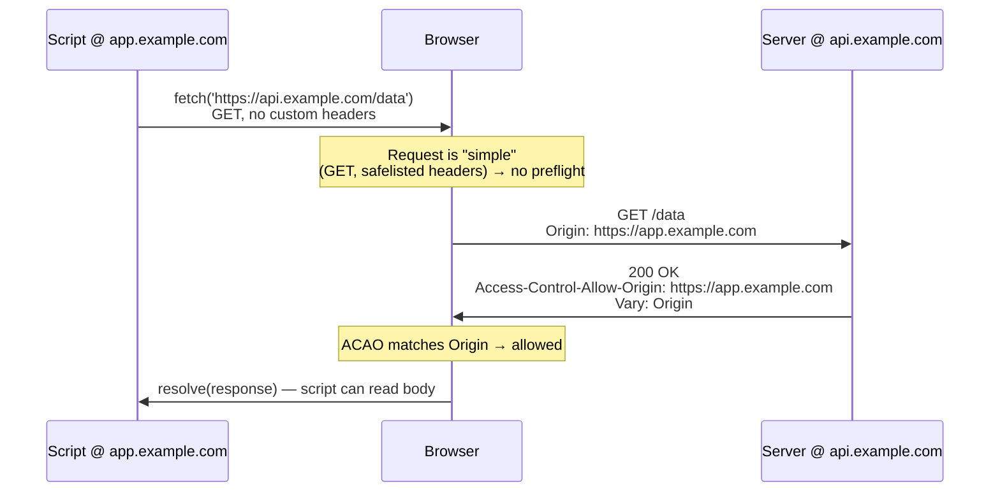
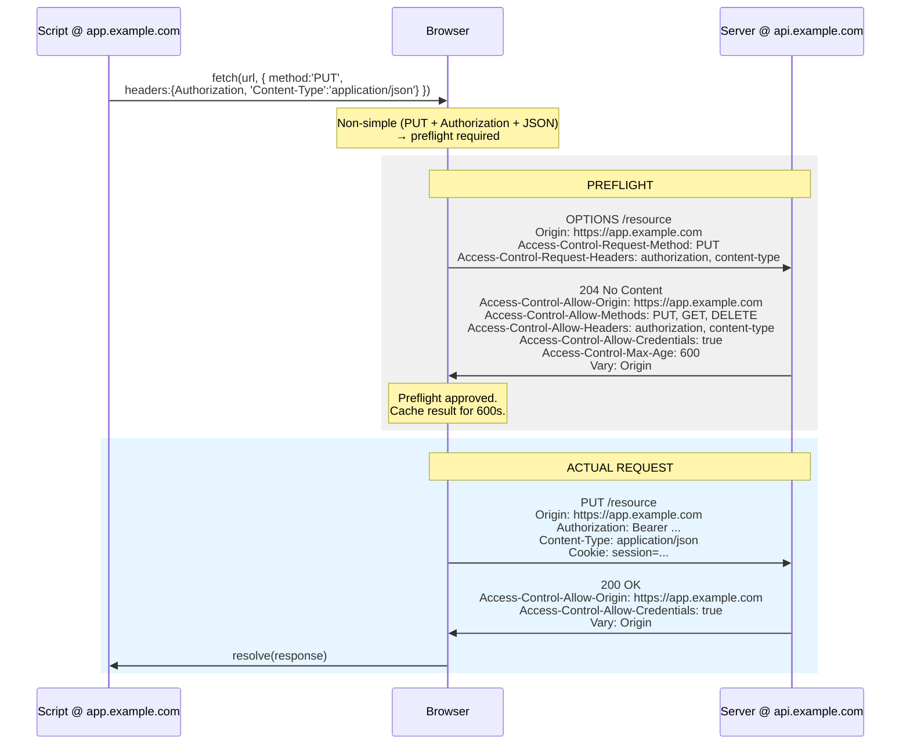

# CORS Overview

> Cross-Origin Resource Sharing is the single most misunderstood mechanism in web development. Engineers "fix" it by copy-pasting `Access-Control-Allow-Origin: *` until the console goes quiet, without understanding that they've often either opened a hole or papered over a design mistake. This chapter builds the model from the ground up: what an origin is, why the browser refuses cross-origin reads, what the preflight actually negotiates, and where the enforcement really lives. Read this before any of the individual `Access-Control-*` pages — they assume everything here.

## The one sentence that unlocks everything

**CORS is a mechanism by which a server tells the *browser* to relax the Same-Origin Policy for a specific origin.** It is not a security feature of your server. It is not a firewall. It does not stop anyone from calling your API. It is a browser-enforced *client-side* policy, and every `Access-Control-*` header is a message from your server to the browser saying "it's okay to let *this* page read *this* response." If you internalize only one thing, make it this: **CORS protects your users' browsers from other websites, not your server from attackers.**

## The Same-Origin Policy: the thing CORS relaxes

Before CORS there was the **Same-Origin Policy (SOP)**, and CORS makes no sense until you understand what SOP forbids.

The SOP is a foundational browser security boundary dating to Netscape Navigator 2.0 (1995). Its purpose: **scripts running on origin A must not be able to read data from origin B.** Without it, a tab you have open on `evil.com` could, using your logged-in cookies, issue `fetch('https://bank.com/account')` and read your balance, then POST it to the attacker. The entire multi-tab web would be a data-exfiltration free-for-all.

SOP applies per **origin**, and the enforcement point is the browser — specifically the rendering engine and its networking stack, gatekeeping what JavaScript in a document is allowed to *observe*.

### What exactly is an "origin"?

An origin is the **tuple `(scheme, host, port)`**. All three must match for two URLs to be same-origin. Not the path. Not the query. Not the fragment. Just scheme + host + port.

Given `https://app.example.com:443/dashboard`:

| URL | Same origin? | Why |
|---|---|---|
| `https://app.example.com/settings` | ✅ Yes | Same scheme/host/port (443 is implicit for https), path differs — irrelevant |
| `http://app.example.com/dashboard` | ❌ No | Scheme differs (`http` vs `https`) |
| `https://api.example.com/dashboard` | ❌ No | Host differs (`api` vs `app` subdomain) |
| `https://example.com/dashboard` | ❌ No | Host differs (apex vs subdomain) |
| `https://app.example.com:8443/dashboard` | ❌ No | Port differs |

Two traps that catch experienced engineers:

- **Subdomains are cross-origin.** `app.example.com` calling `api.example.com` is a cross-origin request and needs CORS. "Same site" is not "same origin." (Cookies use "site" — the registrable domain — which is why `SameSite` cookie semantics and CORS origin semantics are *different boundaries*. See [Set-Cookie](../08-Cookies/Set-Cookie.md).)
- **`http` → `https` on the same host is cross-origin.** The scheme is part of the tuple.

The `Origin` header the browser sends is always **serialized as `scheme://host:port` with no path and no trailing slash** (e.g. `https://app.example.com`). See [Origin](../03-Request-Headers/Origin.md) for the full mechanics of how and when the browser attaches it.

### What SOP blocks — and what it doesn't

This is the most under-appreciated nuance. SOP does **not** stop the browser from *sending* a cross-origin request. It stops the calling script from *reading the response*.

- A `<form>` on `evil.com` can POST to `bank.com` — always could, still can. (This is why CSRF exists and why CSRF tokens, not CORS, defend against it — see below.)
- An `` fetches cross-origin — always allowed.
- A `<script src="https://cdn.com/lib.js">` executes cross-origin code — always allowed (this is how CDNs and JSONP work).
- But `fetch('https://other.com/data')` from JavaScript: the request may go out, yet **the browser will not hand the response body/headers to your script** unless CORS says it's allowed.

So CORS governs one specific thing: **can this script read this cross-origin response?** (And, for "non-simple" requests, *can this request even be sent* — the preflight gate, below.)

## Why CORS was introduced

In the SOP-only era (pre-2009), the only ways to pull data across origins were ugly hacks:

- **JSONP** — abuse `<script>` (which is exempt from SOP) by wrapping JSON in a function call: `callback({...})`. This works only for GET, has no error handling, and is a remote-code-execution vector because you're literally executing whatever the other server returns. It's a security disaster that we tolerated for a decade.
- **Server-side proxies** — route the cross-origin call through your own backend so the browser only ever talks same-origin. Still common and legitimate, but adds latency and infrastructure.
- **`document.domain` fiddling, iframe `postMessage` gymnastics**, Flash `crossdomain.xml`, etc.

CORS was standardized by the W3C (originally as "Cross-Origin Resource Sharing," folded into the WHATWG **Fetch Standard**, with the wire semantics later reflected in RFC 6454 for the origin concept). It gave us a *sanctioned, opt-in, granular* way for a server to say "I permit `https://app.example.com` to read my responses, including with credentials, using these methods and these headers." It replaced JSONP's all-or-nothing RCE hack with a negotiated, header-driven protocol that the browser enforces.

## Simple requests vs preflighted requests

The Fetch spec splits cross-origin requests into two classes, and this split is the crux of CORS. The distinction exists to preserve **backwards compatibility**: any request an old HTML form could already make must not require new machinery, but anything *more* powerful than a form must be pre-authorized.

### "Simple" requests (the spec calls them requests that don't trigger a preflight)

A request is "simple" — sent directly, no preflight — if it meets **all** of these:

1. **Method** is one of `GET`, `HEAD`, or `POST`.
2. **Headers** are limited to the *CORS-safelisted request headers*: `Accept`, `Accept-Language`, `Content-Language`, `Content-Type`, and a few others (`Range` with a simple byte range). Any header outside this set (e.g. `Authorization`, `X-Requested-With`, a custom `X-Api-Version`) makes it non-simple.
3. **`Content-Type`**, if present, is one of exactly three values: `application/x-www-form-urlencoded`, `multipart/form-data`, or `text/plain`. **Crucially, `application/json` is NOT on this list** — which is why virtually every modern JSON API call is preflighted.
4. No `ReadableStream` upload body, and no event listeners registered on the `XMLHttpRequestUpload` object.

For a simple request, the browser **sends it immediately** with an `Origin` header, then inspects the response. If the response's [Access-Control-Allow-Origin](./Access-Control-Allow-Origin.md) matches (or is `*`), the script gets the response. If not, the request *already happened on the server* but the browser **throws away the response** and rejects the promise with a CORS error. The server-side side effect is not undone — this matters for POST.

### "Preflighted" requests

If a request fails any of the "simple" conditions — a `PUT`/`DELETE`/`PATCH`, an `Authorization` header, a `Content-Type: application/json`, a custom header — the browser will not send it blindly. It first sends a **preflight**: an automatic `OPTIONS` request that asks permission. Only if the preflight response grants permission does the browser send the real request.

The preflight is the browser saying: *"I'm about to send a `PUT` with an `Authorization` header and a JSON body to your origin. Before I do anything that could have side effects, do you allow it?"* This is why preflights exist: to protect servers that predate CORS from receiving powerful cross-origin requests they never consented to. A pre-CORS server can't be tricked into processing a cross-origin `DELETE`, because a CORS-aware browser won't send the `DELETE` until an `OPTIONS` handshake succeeds — and old servers don't answer that handshake with permission.

## The preflight handshake, in detail

The preflight is an `OPTIONS` request the browser generates **on its own** — your `fetch` code never mentions `OPTIONS`. It carries no body and includes:

- `Origin: https://app.example.com` — who's asking.
- `Access-Control-Request-Method: PUT` — the method the *real* request will use.
- `Access-Control-Request-Headers: authorization, content-type` — the non-safelisted headers the real request will carry (lowercased, comma-separated). See [Access-Control-Allow-Headers](./Access-Control-Allow-Headers.md).

The server must answer (typically `204 No Content`) with:

- [Access-Control-Allow-Origin](./Access-Control-Allow-Origin.md) — echoing the origin (or `*`).
- [Access-Control-Allow-Methods](./Access-Control-Allow-Methods.md) — the methods it permits.
- [Access-Control-Allow-Headers](./Access-Control-Allow-Headers.md) — the headers it permits.
- Optionally [Access-Control-Allow-Credentials](./Access-Control-Allow-Credentials.md)`: true` if cookies/HTTP-auth are in play.
- Optionally `Access-Control-Max-Age: 600` — how long the browser may **cache this preflight result**, so it doesn't re-ask before every request.

If the preflight response satisfies what the browser asked for, the browser proceeds to the **actual** request (which *also* carries `Origin` and must *also* receive valid CORS response headers — the preflight approving something doesn't exempt the real response). If the preflight fails — wrong origin, missing method, missing header, non-2xx status — the browser **never sends the real request** and rejects the promise.

### Mermaid: a simple request (no preflight)



If the response had lacked `Access-Control-Allow-Origin`, the server would still have run the handler and returned 200, but the browser would have **blocked the read** and the promise would reject with a `TypeError` — the classic opaque "CORS error" in the console.

### Mermaid: a preflighted request



Note the two round trips. The first request the user's action triggers costs an extra RTT because of the `OPTIONS`. `Access-Control-Max-Age` amortizes that over subsequent requests.

## Credentials mode — the part everyone gets wrong

By default, cross-origin `fetch`/XHR requests **do not send credentials** — no cookies, no HTTP auth, no client TLS certs. The response is treated as anonymous. To send them you must explicitly opt in:

```js
fetch('https://api.example.com/me', { credentials: 'include' });
```

`credentials` has three values: `'omit'` (never), `'same-origin'` (the default for `fetch` — send only to same origin), and `'include'` (always, even cross-origin). (`XMLHttpRequest` uses `xhr.withCredentials = true`.)

When credentials are included, the browser applies **stricter rules**, and both request *and* response must cooperate:

1. The server's response **must** include [Access-Control-Allow-Credentials](./Access-Control-Allow-Credentials.md)`: true`. Without it, the browser blocks the response even if it arrived with valid cookies.
2. The server's [Access-Control-Allow-Origin](./Access-Control-Allow-Origin.md) **must be the exact origin, never `*`.** A wildcard is illegal in credentialed mode and the browser rejects it. This is deliberate: `*` means "anyone," and "anyone + your cookies" is exactly the CSRF-flavored catastrophe SOP was built to prevent.
3. Likewise, [Access-Control-Allow-Headers](./Access-Control-Allow-Headers.md) and [Access-Control-Allow-Methods](./Access-Control-Allow-Methods.md) **cannot use `*` as a wildcard** in credentialed mode — you must enumerate them.

Because the server must reflect the *exact* origin (not `*`) whenever it supports multiple origins, the response **must** also send [Vary: Origin](../06-Caching-Headers/Vary.md) — otherwise a shared cache (CDN, reverse proxy, even the browser cache) may serve a response computed for origin A to a request from origin B, breaking CORS non-deterministically. This is covered in depth on the ACAO page but it applies to *every* dynamically-reflected CORS response.

## The full cast of CORS headers

**Request headers (browser → server), all set automatically by the browser — you cannot set them from JS:**

| Header | When | Meaning |
|---|---|---|
| [`Origin`](../03-Request-Headers/Origin.md) | Every cross-origin request + all preflights + same-origin non-GET/HEAD | Who is making the request |
| `Access-Control-Request-Method` | Preflight only | Method the real request will use |
| `Access-Control-Request-Headers` | Preflight only | Non-safelisted headers the real request will carry |

**Response headers (server → browser):**

| Header | On | Meaning |
|---|---|---|
| [`Access-Control-Allow-Origin`](./Access-Control-Allow-Origin.md) | Preflight + actual | Which origin may read this response (`*` or an exact origin) |
| [`Access-Control-Allow-Methods`](./Access-Control-Allow-Methods.md) | Preflight | Permitted methods |
| [`Access-Control-Allow-Headers`](./Access-Control-Allow-Headers.md) | Preflight | Permitted request headers |
| [`Access-Control-Allow-Credentials`](./Access-Control-Allow-Credentials.md) | Preflight + actual | Whether cookies/auth may be sent and read |
| `Access-Control-Max-Age` | Preflight | Seconds the browser may cache this preflight |
| `Access-Control-Expose-Headers` | Actual | Which *response* headers JS is allowed to read (by default only the safelisted `Cache-Control`, `Content-Language`, `Content-Type`, `Expires`, `Last-Modified`, `Pragma` are readable) |

That last one, `Access-Control-Expose-Headers`, is the mirror image of the request-side rules and is frequently forgotten: even on a successful CORS response, `response.headers.get('X-Total-Count')` returns `null` unless the server sent `Access-Control-Expose-Headers: X-Total-Count`. The body is readable; most custom headers are not, unless exposed.

## Why CORS is browser enforcement, not server security

This deserves its own section because misunderstanding it causes both security holes and wasted effort.

**CORS runs entirely in the browser.** The server merely emits advisory headers. Enforcement — blocking the read, throwing away the response, refusing to send the real request after a failed preflight — all happens inside the user's browser, as a courtesy the browser extends to *other* websites' data.

Consequences:

- **`curl`, Postman, a Python script, another server, or a native mobile app completely ignore CORS.** They will happily read your response regardless of `Access-Control-Allow-Origin`. If your API is public data, that's fine. If it's sensitive, **CORS is not what's protecting it — your authentication/authorization is.** Setting `Access-Control-Allow-Origin: https://app.example.com` does not stop an attacker from `curl`ing your endpoint; it only stops *a script running on some other website in a victim's browser* from reading the response.
- **CORS is not CSRF protection, and CSRF protection is not CORS.** CSRF exploits the fact that the browser *sends* cookies on cross-origin requests (a `<form>` POST). CORS governs whether a script can *read the response*. A CSRF attack often doesn't care about the response at all — it just wants the side effect (transfer money, change email). So a permissive-read CORS policy doesn't create CSRF, and a strict CORS policy doesn't prevent it. Defend CSRF with anti-CSRF tokens, `SameSite` cookies, and checking `Origin`/`Referer` *server-side*. (Note: verifying the `Origin` header *on the server* is a legitimate defense — but that's you reading a header, not "CORS.")
- **Tightening CORS never makes an insecure endpoint secure.** If an endpoint returns data it shouldn't to an authenticated attacker, no CORS header fixes that. Fix authorization.

The mental correction: think of CORS response headers as **permission slips the server hands to the browser to give to a third-party website.** The server is granting *someone else's page* access to read its responses in the user's browser. That framing makes the wildcard-plus-credentials prohibition obviously correct: you'd be handing a signed blank permission slip ("anyone may read this, and bring the user's cookies") to every website on earth.

## Common failure modes

These are the recurring shapes of "why is CORS broken" — recognize them by symptom:

1. **"No `Access-Control-Allow-Origin` header is present."** The server didn't emit ACAO at all — often because the request errored (500) *before* your CORS middleware ran, or the CORS middleware is mounted after the route, or an upstream proxy stripped it. Remember: an error response also needs CORS headers, or the browser masks your real error as a CORS error.

2. **"The value `*` is not allowed when credentials mode is `include`."** You set `Access-Control-Allow-Origin: *` but used `credentials: 'include'`. Reflect the exact origin instead, add `Access-Control-Allow-Credentials: true`, and `Vary: Origin`.

3. **The preflight `OPTIONS` returns 401/404/405.** Your auth middleware rejects the credential-less `OPTIONS`, or your router has no `OPTIONS` handler, or a `body-parser`/auth guard runs first. Preflights carry no cookies and no auth by design — you must let them through *before* authentication. `405 Method Not Allowed` on `OPTIONS` is a classic missing-handler tell.

4. **Custom header silently blocked.** You added `X-Api-Key` to your fetch; the server's `Access-Control-Allow-Headers` doesn't list it, so the preflight fails. Every custom request header must be allowed. See [Access-Control-Allow-Headers](./Access-Control-Allow-Headers.md).

5. **Response header unreadable from JS.** `response.headers.get('X-Total-Count')` is `null` even though DevTools shows it. You forgot `Access-Control-Expose-Headers`.

6. **Works in Postman, fails in browser.** By definition — Postman ignores CORS. This is a CORS-config problem, not a server-logic problem.

7. **Intermittent CORS failures behind a CDN.** Missing [`Vary: Origin`](../06-Caching-Headers/Vary.md): the cache served origin A's ACAO to origin B.

8. **Redirect during preflight.** Preflights must not be redirected; a `301`/`302` on the `OPTIONS` (e.g. http→https, or trailing-slash redirect) breaks CORS. Point the client at the final URL.

## Using the `cors` npm middleware

For Express, hand-rolling CORS headers is error-prone; the community-standard [`cors`](https://www.npmjs.com/package/cors) middleware handles preflight, origin reflection, `Vary`, and credentials correctly. The minimal safe pattern:

```js
const cors = require('cors');

const allowlist = new Set(['https://app.example.com', 'https://admin.example.com']);

app.use(cors({
  origin(origin, callback) {
    // origin is undefined for same-origin/non-browser requests — allow those
    if (!origin || allowlist.has(origin)) return callback(null, true);
    return callback(new Error('Origin not allowed by CORS'));
  },
  credentials: true,          // sets Access-Control-Allow-Credentials: true
  maxAge: 600,                // Access-Control-Max-Age
}));
```

`cors` automatically reflects the approved origin (never `*` when a function is used), sets `Vary: Origin`, and — critically — you should mount it **before** your auth middleware and **before** route handlers, and make sure it answers `OPTIONS`. The per-header pages show fuller, hardened versions. But the takeaway: prefer the vetted middleware over ad-hoc `res.setHeader` calls, and understand what it emits — the middleware is only correct if *you* feed it a correct origin policy.

## Mental model

**CORS is a bouncer at the door of a private party — but the bouncer works for the browser, checking a guest list the server printed.** The server prints the list (`Access-Control-Allow-Origin` and friends) and hands it to the browser. When a script from another origin tries to walk in and read the response, the browser-bouncer checks whether that origin is on the list. If it is, the script gets in. If not, the browser turns it away — *even though the server already handed over the food.* The party host (your server) can print any list it wants, but the bouncer only exists inside browsers: anyone arriving by `curl` or from another server skips the door entirely, because they never hired a bouncer. So the guest list controls *which websites' scripts may read your responses in a user's browser* — nothing more. Real security is who you let cook in the kitchen (authentication) and what each guest is allowed to touch (authorization).

## Related Reading

- [Origin](../03-Request-Headers/Origin.md) — the request header that starts every CORS exchange
- [Access-Control-Allow-Origin](./Access-Control-Allow-Origin.md) — the reflect-vs-`*` decision and mandatory `Vary`
- [Access-Control-Allow-Methods](./Access-Control-Allow-Methods.md) · [Access-Control-Allow-Headers](./Access-Control-Allow-Headers.md) · [Access-Control-Allow-Credentials](./Access-Control-Allow-Credentials.md)
- [Vary](../06-Caching-Headers/Vary.md) — why `Vary: Origin` is non-negotiable for reflected CORS
- [Set-Cookie](../08-Cookies/Set-Cookie.md) — `SameSite` is a *different* boundary than CORS
