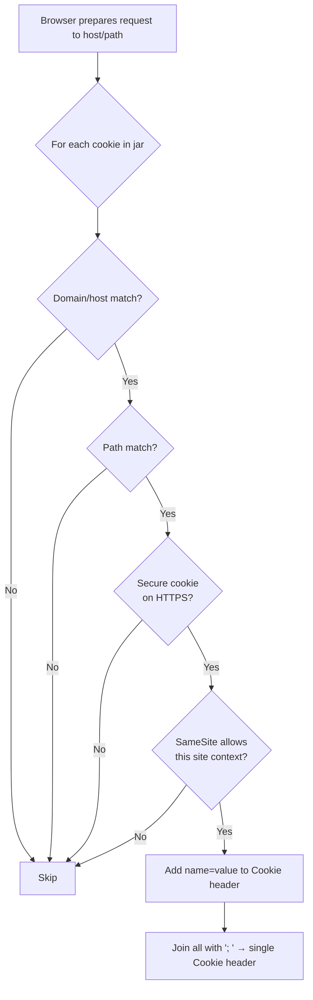
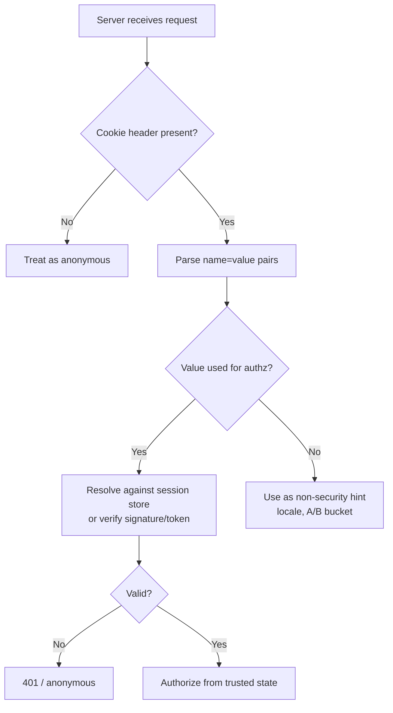

# Cookie

## Quick Summary

`Cookie` is a **request-only** header the browser sends automatically to echo back the cookies a server previously planted via [Set-Cookie](./Set-Cookie.md). It carries only `name=value` pairs — the attributes (`Domain`, `Path`, `Secure`, `HttpOnly`, `SameSite`, …) that governed *whether* the cookie is sent do **not** appear on the wire; they already did their filtering job in the browser. All applicable cookies for a request are folded into a **single** `Cookie` header, separated by `; ` (semicolon-space). The server reads it to recover session identity or client state. Two rules dominate everything you do with it: the server must **never trust** the contents (the client can send anything), and cookies marked `HttpOnly` are readable by the server on every request but invisible to `document.cookie` in the browser. `Cookie` is the inbound half of the round-trip whose outbound half is [Set-Cookie](./Set-Cookie.md).

## What problem does this header solve?

Statelessness (see [Cookies Overview](./Cookies-Overview.md)) means the server can't tell that two requests came from the same client. `Set-Cookie` plants an identifier; the `Cookie` header is how that identifier **comes back on every subsequent request without any client-side code**. That "without any code" property is the whole value: page navigations, image loads, `fetch`, XHR, and form submissions *all* automatically carry the `Cookie` header to the matching scope. This is precisely why cookies — not `localStorage` tokens — are the robust carrier for session identity: an in-memory JS token is lost on a full-page navigation or new tab, but a cookie rides along on the very first byte of the navigation request, so the server-rendered page already knows who you are. The `Cookie` header solves "re-present my identity, reliably and automatically, on the exact set of requests the issuer authorized."

## Why was it introduced?

`Cookie` and `Set-Cookie` were introduced together in Netscape's 1994 cookie mechanism and standardized alongside each other through **RFC 2109 (1997)**, **RFC 2965 (2000)**, and finally **RFC 6265 (2011)**, which is the practical reference. RFC 2965 tried to add a richer `Cookie2`/`Set-Cookie2` pair with attributes echoed back to the server (`$Path`, `$Domain`, `Version`); browsers never adopted it, and RFC 6265 formally deprecated it, cementing the simple reality: **the request carries only `name=value` pairs, no attributes.** The subsequent evolution has been almost entirely on the `Set-Cookie` / browser-policy side (`SameSite`, prefixes, CHIPS) — those changes alter *which* cookies the browser puts into the `Cookie` header, but the header's on-the-wire shape has been stable for over a decade.

## How does it work?

Before each request, the browser scans its cookie jar and selects every cookie whose scope matches the request, then concatenates their `name=value` pairs into one `Cookie` header.

- **Browser behavior:** For each stored cookie it checks: does the request host match the cookie's `Domain` (or exact host for host-only)? Does the request path fall under the cookie's `Path`? Is the request over HTTPS if the cookie is `Secure`? Does the request's **site context** satisfy the cookie's `SameSite`? All matches are attached. `HttpOnly` does *not* affect sending — an `HttpOnly` cookie is still sent on every matching request; it only hides the cookie from JavaScript. The browser also enforces ordering and size limits (below).
- **Server behavior:** Parses the `Cookie` header into a map. It sees only the values; it cannot tell which domain/path a cookie was scoped to — only that it arrived (which implies the scope matched). Frameworks (Express + `cookie-parser`) expose it as `req.cookies`. The server must treat every value as untrusted input.
- **Proxy behavior:** Forward proxies pass `Cookie` through. Because `Cookie` (like [Authorization](../09-Authentication/Authorization.md)) makes a response user-specific, a correct cache must either not cache such responses or include the relevant cookie in the cache key via [Vary](../04-Response-Headers/Vary.md).
- **CDN behavior:** By default CDNs are wary of `Cookie` — a request with a session cookie usually means "personalized, don't serve a shared cached copy." CDNs let you configure which cookies are part of the cache key; a cookie that affects the response but isn't keyed causes cross-user content bleed.
- **Reverse proxy behavior:** Nginx forwards `Cookie` upstream untouched. It can be configured to strip specific cookies before forwarding (e.g. drop analytics cookies so they don't bust the proxy cache).



## HTTP Request Example

A single cookie:

```http
GET /dashboard HTTP/1.1
Host: app.example.com
Cookie: sid=abc123
```

Several cookies — all folded into one header, `; `-separated, values only (no attributes):

```http
GET /api/profile HTTP/1.1
Host: app.example.com
Cookie: sid=abc123; __Host-csrf=9f2c1a; locale=en-GB; ab_bucket=B
```

In **HTTP/2 and HTTP/3** the spec allows the single logical `Cookie` header to be split into multiple `cookie` field lines in the HPACK/QPACK block for better compression; the receiving server reconstructs one `Cookie` string. This is the mirror image of [Set-Cookie](./Set-Cookie.md)'s rule — cookies are the one place the request header may be split, and the response header must *not* be joined.

## HTTP Response Example

`Cookie` never appears on a response. The response-side counterpart is [Set-Cookie](./Set-Cookie.md), which *establishes* what the browser will later echo back in `Cookie`:

```http
HTTP/1.1 200 OK
Set-Cookie: sid=abc123; Max-Age=1209600; Path=/; Secure; HttpOnly; SameSite=Lax
```

The relationship is strict cause-and-effect: a `Set-Cookie` on a response is the *only* way a `Cookie` header appears on future requests (barring JS `document.cookie` writes for non-`HttpOnly` cookies).

## Express.js Example

```js
const express = require('express');
const cookieParser = require('cookie-parser');
const app = express();

// Parses the incoming Cookie header. The secret unlocks signed-cookie verification.
app.use(cookieParser(process.env.COOKIE_SECRET));

app.get('/dashboard', async (req, res) => {
  // req.cookies is the parsed Cookie header: { sid: 'abc123', locale: 'en-GB', ... }.
  // These values are 100% attacker-controllable — treat as untrusted input.
  const sid = req.cookies.sid;
  if (!sid) return res.status(401).send('no session');

  // NEVER trust the cookie's meaning directly. Resolve it against the server-side store,
  // which is the actual source of truth. A forged sid simply won't resolve.
  const session = await sessionStore.get(sid);
  if (!session) return res.status(401).send('invalid session');

  // Signed cookies live on req.signedCookies (only present if signature verified).
  // A tampered signed cookie is DROPPED — it won't appear here at all.
  const cartId = req.signedCookies.cartId;

  res.send(renderDashboard(session.userId, cartId));
});

// Guard against cookie-bloat crashing requests: reject absurdly large cookie headers early.
app.use((req, res, next) => {
  const raw = req.headers.cookie || '';
  if (raw.length > 8192) return res.status(431).send('cookie header too large'); // 431 = Request Header Fields Too Large
  next();
});

app.listen(3000);
```

The pivotal lines: `req.cookies.sid` gives you the value, but the security comes from `sessionStore.get(sid)` — the cookie is just a lookup key. `req.signedCookies` only contains cookies whose HMAC verified; a forged or edited signed cookie is silently excluded, so its mere presence is proof of authenticity (not secrecy). The 431 guard defends against a malicious or accidentally-bloated cookie jar producing opaque failures.

## Node.js Example

Raw `http` gives you the unparsed string; you parse it yourself:

```js
const http = require('http');

function parseCookies(header = '') {
  return Object.fromEntries(
    header.split('; ').filter(Boolean).map(pair => {
      const i = pair.indexOf('=');
      return [pair.slice(0, i), decodeURIComponent(pair.slice(i + 1))];
    })
  );
}

http.createServer((req, res) => {
  const cookies = parseCookies(req.headers.cookie); // e.g. { sid: 'abc123' }
  // Same rule: cookies.sid is untrusted. Validate against a store or verify a signature.
  if (!cookies.sid) { res.writeHead(401).end('no session'); return; }
  res.writeHead(200).end(`hello session ${cookies.sid}`);
}).listen(3000);
```

`req.headers.cookie` is a single string (the browser already folded everything into one header), so unlike `Set-Cookie` (an array) you never deal with multiple `Cookie` headers on the Node side.

## React Example

React participates in the `Cookie` header only indirectly, and the constraints are the important lesson:

1. **React cannot read `HttpOnly` cookies** — `document.cookie` excludes them by design. So React never sees the session token, which is exactly what makes it XSS-resistant. Don't architect any React logic that needs to read the session cookie; you can't, and that's the point.
2. **Cookies are auto-sent same-origin; cross-origin needs explicit opt-in.** A same-origin `fetch('/api/me')` carries the `Cookie` header with zero configuration. A cross-origin call does *not* unless you opt in and the server cooperates on CORS:

```jsx
async function getProfile() {
  // credentials:'include' tells the browser to attach the Cookie header on this
  // cross-origin request. Without it the request is anonymous — the #1 "why am I
  // logged out in the SPA but not in a browser tab" bug.
  const res = await fetch('https://api.example.com/me', {
    credentials: 'include',
  });
  return res.json();
}
// Server must also return Access-Control-Allow-Credentials: true and a specific
// (non-'*') Access-Control-Allow-Origin, or the browser blocks the response.
```

3. **Non-`HttpOnly` cookies (e.g. a CSRF token) are readable** and a common React pattern is to read a `csrf` cookie and echo it in a request header (double-submit). See [Cookie-Attributes](./Cookie-Attributes.md) and [Sessions vs Stateless Tokens](./Sessions-vs-Stateless-Tokens.md).
4. **SSR:** during server-side rendering (Next.js), the incoming request's `Cookie` header must be **forwarded** to any backend fetch, or the server-rendered request is unauthenticated and the page renders logged-out before hydration.

## Browser Lifecycle

1. **Request initiated** (navigation, subresource, `fetch`, form post). The browser determines the target host, path, scheme, and the **site context** (is this a same-site or cross-site request, and is it a top-level navigation?).
2. **Jar scan + matching.** Each stored cookie is tested against domain, path, `Secure`/scheme, and `SameSite`/site-context. `HttpOnly` is *not* a send-time filter — those cookies are included.
3. **Ordering.** Matches are ordered: cookies with longer `Path` first; among equal paths, by creation time (earliest first) per RFC 6265. **Do not depend on this order** — it is a "SHOULD" and varies at the edges.
4. **Serialization.** Selected `name=value` pairs are joined with `; ` into one `Cookie` header.
5. **Send.** The header goes out on the request. In HTTP/2/3 it may be split across field lines for compression.
6. **Limits enforced.** If the jar is enormous the browser has already evicted (per-domain ~180 cookies, ~4 KB each); the assembled `Cookie` header can still be large enough to trip server/proxy header limits (typically 8–16 KB), yielding `400`/`431`.

## Production Use Cases

- **Session authentication:** the `Cookie` header carries the opaque `sid` that the server resolves against Redis/DB every request.
- **CSRF double-submit:** the browser sends both the session cookie and a readable `csrf` cookie; the SPA also echoes the CSRF value in a header, and the server compares.
- **Locale / theme:** server-rendered pages read `Cookie: locale=…` to render in the right language on the first byte (before any JS).
- **A/B testing / feature flags:** an `ab_bucket` cookie routes the request to a variant server-side, keeping the experience consistent across navigation.
- **Load-balancer affinity:** some LBs read a cookie to pin a client to a backend (though a shared session store is more robust).

## Common Mistakes

- **Trusting cookie values.** `if (req.cookies.role === 'admin')` is an instant privilege-escalation bug — the client can set any value. Authorization must derive from a validated session/token, never from a raw cookie.
- **Forgetting `credentials: 'include'`** on cross-origin `fetch`/axios, so the `Cookie` header isn't sent and the API sees an anonymous request.
- **Depending on cookie ordering** when two cookies share a name (the duplicate-cookie trap from [Cookies Overview](./Cookies-Overview.md)); order is not guaranteed across browsers.
- **Expecting to read an `HttpOnly` cookie in JS** — you can't, and you shouldn't try to work around it.
- **Cookie bloat.** Accumulating cookies until the `Cookie` header exceeds proxy limits produces opaque `400 Bad Request` with no body. Audit jar size.
- **Sending cookies to third parties unintentionally** — before `SameSite=Lax` defaults, cookies rode on every cross-site subresource, leaking session identity; understand the site-context rules in [Cookie-Attributes](./Cookie-Attributes.md).

## Security Considerations

- **The golden rule: never trust the `Cookie` header.** It is fully client-controlled. Every byte can be forged, replayed, or omitted. Use it only as a key into trusted server state, or verify a cryptographic signature/token.
- **`HttpOnly` limits XSS damage, not the header's presence.** The cookie still travels on every request (good — that's how sessions work); it's just unreadable by injected JS, so a script can't exfiltrate it. It does *not* stop the script from making authenticated same-origin requests (the browser attaches the cookie automatically) — that's the "XSS can still act as the user" caveat, which is why you also need CSP and input sanitization.
- **Session fixation / replay:** a stolen `Cookie` value is a bearer credential — whoever holds it *is* the user until the server-side session expires or is revoked. Bind sessions to server-side state you can invalidate, keep TTLs short, and prefer instant-revocable server-side sessions for high-value apps.
- **Cross-site sending is a CSRF vector.** Because the browser attaches the cookie automatically even on requests triggered by another site, a state-changing endpoint protected only by "the cookie was present" is CSRF-vulnerable. `SameSite` + CSRF tokens close this — see [Sessions vs Stateless Tokens](./Sessions-vs-Stateless-Tokens.md).
- **Confidentiality:** cookie values are plaintext on the wire without TLS. Always HTTPS; pair `Secure` cookies with [Strict-Transport-Security](../05-Security-Headers/Strict-Transport-Security.md).

## Performance Considerations

- **The `Cookie` header is sent on every matching request** — including static assets if they share the scope. A 2 KB cookie on a page with 100 subresources adds ~200 KB of upload across the page load. Serve static assets from a cookieless host/path.
- **Header size limits:** an oversized `Cookie` header trips server (`ClientHeaderBufferSize` in Nginx, Node's `--max-http-header-size`) and CDN limits, producing hard failures. Keep the jar lean.
- **HTTP/2/3 header compression (HPACK/QPACK)** dedupes repeated cookie values across requests on one connection, but the first request and new connections pay full cost; large cookies still hurt.
- **Cache defeat:** a `Cookie` on a request often forces cache bypass at CDNs/reverse proxies (they treat it as "personalized"), so cookie-bearing requests miss the cache — another reason to keep cookies off asset requests.

## Reverse Proxy Considerations

Strip cache-busting cookies before they reach a cached upstream, and preserve the important ones:

```nginx
location /assets/ {
    proxy_pass http://app_upstream;
    # Assets don't need cookies; removing them keeps the response cacheable and cuts upstream bytes.
    proxy_set_header Cookie "";
    proxy_cache assets_cache;
    proxy_cache_valid 200 1y;
}

location /api/ {
    proxy_pass http://app_upstream;
    # Preserve the Cookie header for authenticated API calls (default: forwarded as-is).
    # Do NOT cache these — they're per-user:
    proxy_no_cache $http_cookie;
    proxy_cache_bypass $http_cookie;
}
```

Clearing `Cookie` on the asset location both improves cache hit-rate and prevents the upstream from seeing session data on requests that have no business carrying it.

## CDN Considerations

- **Cookies default to cache-bypass.** A request with a session cookie is treated as personalized. Configure the cache key to *ignore* non-essential cookies (analytics/marketing) so they don't fragment or bypass the cache — but only cookies that don't change the response.
- **Cloudflare** "Cache Everything" plus a cookie-based bypass rule is a common pattern: cache anonymous HTML at the edge, bypass when the session cookie is present.
- **Vary interplay:** if a response genuinely varies by a cookie, the safe (if hit-rate-costly) approach is a cookie-keyed cache; a lazy `Vary: Cookie` effectively disables caching because every jar is unique.
- **Cookieless asset domain** remains the cleanest way to keep the CDN from ever seeing a `Cookie` on static content.

## Cloud Deployment Considerations

- **Header-size limits differ by platform.** AWS ALB (~64 KB total headers), API Gateway, and Cloudflare each cap header size; a bloated `Cookie` header can be rejected before it ever reaches your app. Know your platform's limit.
- **Sticky sessions:** if you rely on LB cookie affinity (`AWSALB`, `SERVERID`), understand it's a routing cookie layered on top of yours; prefer a shared session store to avoid affinity fragility.
- **`trust proxy`:** to correctly evaluate `Secure` cookie sending decisions and client IP, Express behind an LB needs `app.set('trust proxy', 1)` so it honors [X-Forwarded-Proto](../14-Proxies/X-Forwarded-Proto.md).
- **Multi-region session stores:** a `Cookie` set in one region must resolve where the request lands; replicate the store or pin routing.

## Debugging

- **Chrome DevTools → Network → (request) → Headers:** shows the exact `Cookie` sent. **Application → Cookies** shows the jar and which are `HttpOnly` (JS-invisible). A cookie present in the jar but absent from the request means a scope/`SameSite` mismatch — DevTools flags blocked cookies with a reason.
- **`document.cookie` in the console:** shows only non-`HttpOnly` cookies for the current origin — useful to confirm what JS can and cannot see.
- **curl:** `curl -b 'sid=abc123' https://app.example.com/dashboard` sends a `Cookie` header; `-b jar.txt` replays a saved jar from `-c`.
- **Postman / Bruno:** both auto-attach stored cookies and show the outgoing `Cookie`; Postman's cookie manager lets you inspect/edit per domain. Bruno can assert on `req.headers.cookie`.
- **Node/Express logging:** `app.use((req,res,next)=>{console.log(req.headers.cookie); next();})` prints the raw header; `console.log(req.cookies)` (with `cookie-parser`) prints the parsed map.

## Best Practices

- [ ] Treat every cookie value as untrusted; authorize from server-side state, never from the raw cookie.
- [ ] Resolve session cookies against a store (or verify a signed/encrypted token) on every request.
- [ ] Use `credentials: 'include'` / `withCredentials: true` for cross-origin authenticated calls, with matching CORS.
- [ ] Serve static assets from a cookieless host/path to keep the `Cookie` header off them.
- [ ] Keep the total jar small; guard against oversized `Cookie` headers (return 431).
- [ ] Never rely on cookie ordering or on reading `HttpOnly` cookies in JS.
- [ ] Strip non-essential cookies at the proxy/CDN before caching.
- [ ] Always transmit over HTTPS; pair `Secure` cookies with HSTS.

## Related Headers

- [Set-Cookie](./Set-Cookie.md) — the response that plants what `Cookie` later echoes; the two form the round-trip.
- [Cookie-Attributes](./Cookie-Attributes.md) — the attributes (`Domain`/`Path`/`SameSite`/…) that decide *which* cookies land in the `Cookie` header.
- [Authorization](../09-Authentication/Authorization.md) — the alternative credential carrier; unlike `Cookie` it is not auto-attached, so it's CSRF-immune but must be added by client code.
- [Vary](../04-Response-Headers/Vary.md) — a response that depends on a cookie must vary its cache key on it, or shared caches leak.
- [Cache-Control](../06-Caching-Headers/Cache-Control.md) — cookie-bearing/personalized responses should be `private`/`no-store`.
- [Origin](../03-Request-Headers/Origin.md) / [CORS Overview](../07-CORS/CORS-Overview.md) — govern whether cross-origin requests may carry the `Cookie` header at all.
- [Strict-Transport-Security](../05-Security-Headers/Strict-Transport-Security.md) — keeps cookie transmission on HTTPS.

## Decision Tree



## Mental Model

If [Set-Cookie](./Set-Cookie.md) is the luggage tag the airline attaches, `Cookie` is you **showing your claim ticket at the counter — automatically, without being asked, every single time you approach.** The browser is your ever-present assistant who flashes the right ticket for the right counter based on the rules printed on the tag (only this airport, only secure flights, only when *you* walked up rather than a stranger sending you). The counter staff (server) reads the number off the ticket — but crucially, **the ticket proves nothing by itself**; a forger can print any number. The staff must look up that number in the back-room ledger (the session store) to see if it maps to a real coat. So the two iron laws follow directly: the assistant hands over the ticket everywhere the rules allow (which is why cross-site auto-presentation is a CSRF risk), and the counter must never grant your coat on the strength of the printed number alone.
