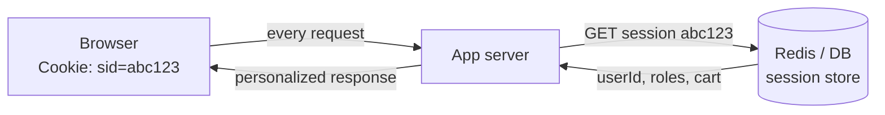

# Cookies Overview

## Why cookies exist: state on top of a stateless protocol

HTTP is stateless by design. Every request is a self-contained transaction: the server receives it, produces a response, and — as far as the protocol is concerned — forgets everything. There is no built-in notion of "this is the same person who logged in two requests ago." Two TCP connections from the same browser, or even two requests multiplexed on one HTTP/2 connection, carry no intrinsic identity linking them.

That statelessness is a feature. It is *why* HTTP scales: any request can go to any server behind a load balancer, caches can serve responses without knowing who asked, and a crashed server loses no conversational context. But almost every real application needs *some* continuity — a shopping cart that survives page navigation, a logged-in session, a language preference, an A/B-test bucket. The protocol gives you no place to keep that continuity.

Cookies are the mechanism that bolts stateful behavior onto stateless HTTP **without changing the protocol's request/response shape**. The server hands the browser a small piece of data and says "give this back to me on every future request." The browser complies automatically. Now the server can recognize the returning client — not because HTTP remembers, but because the client re-presents an identifier the server issued. State lives on the *ends* (browser storage + server-side session store or a signed token); the *wire* stays stateless.

This is the single most important mental frame for the whole chapter: **a cookie is a server-issued token that the browser promises to echo back, scoped by rules the server declares.** Everything else — attributes, security flags, `SameSite`, prefixes — is refinement of *which* requests the browser echoes it on and *who* is allowed to read it.

## The round trip: `Set-Cookie` out, `Cookie` back

The entire cookie system is two headers working as a pair:

- The server sends [Set-Cookie](./Set-Cookie.md) in a **response**. This is the "store this" instruction. One `Set-Cookie` header per cookie (this is a hard rule — see below).
- The browser sends [Cookie](./Cookie.md) in subsequent **requests**. This is the "here's what you told me to keep" echo. All applicable cookies are folded into a single `Cookie` header, `; `-separated.

```mermaid
sequenceDiagram
    participant B as Browser
    participant S as Server (Express/Node)
    participant DB as Session Store (Redis/DB)

    Note over B,S: 1. Login — no cookie yet
    B->>S: POST /login (email + password)
    S->>DB: create session, store {userId, ...}, get sid
    S-->>B: 200 OK<br/>Set-Cookie: sid=abc123; HttpOnly; Secure; SameSite=Lax; Path=/
    Note over B: Browser stores cookie in the cookie jar,<br/>keyed by (domain, path, name)

    Note over B,S: 2. Any later request to the same scope
    B->>S: GET /dashboard<br/>Cookie: sid=abc123
    S->>DB: look up session by sid=abc123
    DB-->>S: {userId: 42, ...}
    S-->>B: 200 OK (personalized dashboard)

    Note over B,S: 3. Logout
    B->>S: POST /logout<br/>Cookie: sid=abc123
    S->>DB: destroy session abc123
    S-->>B: 200 OK<br/>Set-Cookie: sid=; Max-Age=0 (expire it)
    Note over B: Browser deletes the cookie
```

Three things about this loop are worth internalizing:

1. **The browser does the echoing for you, automatically, on every matching request** — page navigations, image loads, `fetch`, XHR, form posts. You never write "attach the cookie" code in the browser. This is exactly why cookies are the default carrier for session identity: they survive full-page navigations that would wipe an in-memory JS token.
2. **The server never "reads a cookie from the browser" out of band.** It only ever sees the `Cookie` header the browser chose to send, according to the scoping and `SameSite` rules baked into the original `Set-Cookie`. If the cookie doesn't arrive, 99% of the time it's a scoping/attribute mismatch, not a bug in your handler.
3. **The value is opaque to HTTP.** `sid=abc123` means nothing to the browser or any proxy. It's just bytes to echo. All meaning lives server-side (session lookup) or inside a cryptographically signed/encrypted payload (a token).

## Anatomy of a cookie: it is not just name=value

Every cookie has a **name/value pair** plus a set of **attributes** that control storage duration, scope, and access. The attributes are set only via `Set-Cookie`; they are *not* sent back in the `Cookie` header. The browser strips them and keeps only `name=value` for the return trip. This asymmetry trips up beginners constantly: you send `Set-Cookie: sid=abc; Domain=.example.com; Path=/; Secure; HttpOnly; SameSite=Lax` but the browser sends back only `Cookie: sid=abc`. The server cannot see, from the `Cookie` header alone, which domain/path a cookie was scoped to — it only knows the cookie arrived, which itself implies the scope matched.

The attribute set (covered exhaustively in [Set-Cookie](./Set-Cookie.md)):

- **`Expires` / `Max-Age`** — lifetime. Absent ⇒ *session cookie* (dies when the browser session ends). Present ⇒ *persistent cookie* (survives restarts until expiry).
- **`Domain` / `Path`** — scope: which hosts and URL paths the browser will send it to.
- **`Secure`** — only send over HTTPS.
- **`HttpOnly`** — hide from JavaScript (`document.cookie` can't read it).
- **`SameSite`** — send on cross-site requests? (`Strict` / `Lax` / `None`). The CSRF and privacy lever.
- **`Partitioned`** (CHIPS) — bind the cookie to the *top-level site*, partitioning third-party cookies per embedding site.

## Cookie scoping: `Domain` and `Path` decide who gets the echo

Scoping is the part engineers most often get subtly wrong, because the rules are asymmetric and full of legacy quirks.

### Domain scope

- **No `Domain` attribute** ⇒ the cookie is a *host-only* cookie. It is sent **only** to the exact host that set it. `app.example.com` sets it ⇒ only `app.example.com` gets it, not `example.com`, not `api.example.com`. This is the safest default and what you want most of the time.
- **`Domain=example.com`** ⇒ the cookie is sent to `example.com` **and all subdomains** (`app.example.com`, `api.example.com`, …). Note the historical wart: even if you write `Domain=.example.com` with a leading dot, modern browsers (per RFC 6265) treat it identically to `Domain=example.com` — the leading dot is ignored, and subdomains are always included. You **cannot** scope a cookie *up* to a parent you don't control, and you cannot set a cookie for a completely different registrable domain (the browser blocks setting `Domain=google.com` from `example.com` via the Public Suffix List).

The security consequence: a domain-scoped cookie on `example.com` is readable by *every* subdomain, including a compromised or user-content subdomain (`user123.example.com`). This is the "cookie tossing" / subdomain trust problem. Prefer host-only cookies unless you genuinely need cross-subdomain SSO — and if you do, see the `__Host-` prefix in [Set-Cookie](./Set-Cookie.md), which *forbids* a `Domain` attribute precisely to lock a cookie to one host.

### Path scope

- **`Path=/`** (typical) ⇒ sent to every path on the host.
- **`Path=/admin`** ⇒ sent only to `/admin` and its subpaths (`/admin`, `/admin/users`, …), not to `/` or `/api`.

Path scoping is **not a security boundary.** It's an ergonomic/organizational tool. Same-origin JavaScript can read cookies from any path via tricks (creating an iframe at the target path), and path matching is prefix-based and easy to get wrong (`/admin` also matches `/administrator`? No — RFC 6265 requires either an exact match or a `/` boundary, so `/admin` matches `/admin/x` but not `/administrator`). Do not use `Path` to isolate sensitive cookies from less-trusted parts of the same origin; use separate origins or server-side authorization.

The `(Domain, Path, Name)` triple is the **key** in the browser's cookie jar. Setting a cookie with the same name but a different domain or path creates a *second, distinct* cookie — a classic source of "I see two `sid` cookies and the wrong one wins" bugs. When two cookies with the same name both match a request, the browser sends both, and the server sees `Cookie: sid=old; sid=new` with **no reliable ordering guarantee across browsers** (RFC 6265 suggests longer paths first, but you must not depend on it). This is the "duplicate cookie" trap.

## Session vs persistent cookies

The distinction is entirely about the presence of `Expires`/`Max-Age`:

- **Session cookie** (no lifetime attribute): the browser holds it in memory and is *supposed* to discard it when the browsing session ends. Use for short-lived session identifiers where "close the browser = logged out" is desirable. Caveat: many browsers have "continue where you left off" / session-restore features that **preserve session cookies across restarts**, so "session cookie" ≠ "guaranteed gone on close." Never rely on it for security-critical expiry; enforce expiry server-side too.
- **Persistent cookie** (`Max-Age=1209600` or an `Expires` date): written to disk, survives restarts until the deadline. Use for "remember me," long-lived preferences, analytics IDs. `Max-Age` (seconds, relative) is preferred over `Expires` (absolute date) because it's immune to client-clock skew — but for maximum compatibility with ancient clients some libraries emit both; when both are present, `Max-Age` wins.

The critical production rule: **cookie lifetime is not session lifetime.** A persistent cookie carrying a session ID can outlive the server-side session (which you should expire independently in Redis/DB). Security = server-side expiry; the cookie's job is only to *carry* the identifier. Treat the cookie deadline as a UX convenience and the server-side TTL as the real security boundary.

## First-party vs third-party cookies (and the deprecation)

Whether a cookie is "first-party" or "third-party" is **not a property of the cookie** — it's a property of the *context in which a request is made*:

- **First-party**: the cookie's domain matches the site the user is currently visiting (the top-level document's site). You're on `nytimes.com` and `nytimes.com` reads its own cookie.
- **Third-party**: the request goes to a *different* site than the top-level one — e.g. `nytimes.com` embeds an ad iframe or pixel from `doubleclick.net`, and `doubleclick.net`'s cookie rides along. That same `doubleclick.net` cookie, seen across thousands of embedding sites, lets the third party build a cross-site profile. This is the engine of cross-site tracking.

Third-party cookies powered the ad-tech ecosystem for two decades and are now being dismantled:

- **Safari (ITP)** has blocked third-party cookies by default since ~2020.
- **Firefox (Total Cookie Protection)** partitions all third-party cookies by top-level site.
- **Chrome** spent years planning full third-party cookie deprecation; the strategy has shifted repeatedly (from removal, to a user-choice prompt, to — as of the current landscape — keeping them while pushing the Privacy Sandbox APIs and, crucially, defaulting third-party cookies to a **partitioned** model via CHIPS). The direction of travel is unambiguous even though the exact endpoint keeps moving: **unpartitioned cross-site cookies are going away as a tracking primitive.**

What survives, and what you should build on:
- **`SameSite=None; Secure`** is now *mandatory* for any cookie intended to work in a third-party context. A cookie without an explicit `SameSite` is treated as `Lax` by modern browsers and will simply not be sent cross-site.
- **`Partitioned` (CHIPS)** lets a legitimate third-party cookie (e.g. an embedded support widget, an SSO helper) keep working *per top-level site* — the browser maintains a separate cookie jar partition for each embedding site, so cross-site linking is impossible but the widget still has state on the site you're actually on. This is the sanctioned replacement for the *functional* (non-tracking) uses of third-party cookies. See [Set-Cookie](./Set-Cookie.md).

For a full-stack engineer the takeaway is architectural: **design so your critical cookies are first-party.** Serve your API from the same site as your app (or a subdomain of it), so session cookies are first-party and unaffected by third-party deprecation. If you're building an embeddable widget, plan for CHIPS from day one. And note the interaction with [CORS](../07-CORS/CORS-Overview.md): cross-origin `fetch` only sends cookies with `credentials: 'include'` *and* a matching server-side `Access-Control-Allow-Credentials: true` *and* a specific (non-`*`) `Access-Control-Allow-Origin` — cookie transport and CORS are separate gates that must *both* open.

## Cookies vs localStorage vs tokens: choosing a state carrier

These are constantly conflated. They solve overlapping problems with very different trade-offs.

| Dimension | Cookies | localStorage / sessionStorage | Bearer token (in JS memory) |
|---|---|---|---|
| Sent automatically on requests | **Yes** (to matching scope) | No — you attach it manually | No — you attach it manually |
| Readable by JS | Only if not `HttpOnly` | Always | Always (it's a JS variable) |
| XSS exposure | **Protected** if `HttpOnly` | **Fully exposed** — any injected script reads it | Exposed while in memory |
| CSRF exposure | **Yes** — auto-sent, needs `SameSite`/token defense | No (not auto-sent) | No (not auto-sent) |
| Survives page reload / new tab | Yes | localStorage yes; sessionStorage per-tab | **No** — memory is wiped |
| Size limit | ~4 KB per cookie, sent on *every* request | ~5–10 MB, never sent on requests | Limited by memory |
| Works for non-XHR requests (nav, ``) | **Yes** | No | No |
| Cross-subdomain sharing | Via `Domain` attribute | No (origin-bound) | Manual |

The staff-engineer synthesis:

- **For session authentication in a classic web app, use an `HttpOnly; Secure; SameSite` cookie carrying an opaque session ID.** It's XSS-resistant (JS can't steal it), auto-attached (survives navigation), and CSRF is handled by `SameSite=Lax`/`Strict` plus, for state-changing cross-site flows, a CSRF token. This is the most robust default and what battle-tested frameworks (Rails, Django, Laravel, `express-session`) do.
- **Do not put JWTs or session tokens in `localStorage`.** It feels convenient for SPAs, but it is readable by any XSS payload — one injected script exfiltrates every user's token. The "but cookies have CSRF" objection is answered by `SameSite`; the "localStorage has XSS" objection has *no* clean answer. This is why the security consensus has moved back toward `HttpOnly` cookies for the actual credential.
- **The pragmatic hybrid many SPAs use:** short-lived access token in memory (never persisted) + a long-lived refresh token in an `HttpOnly; Secure; SameSite=Strict` cookie scoped tightly to the `/auth/refresh` path. You get automatic, XSS-safe refresh (the cookie) and no persistent secret in JS-readable storage. See [Authorization](../09-Authentication/Authorization.md) for how the access token then rides in the `Authorization` header.
- **`localStorage` is for non-secret client state** — UI preferences, draft content, cached non-sensitive data — where the ~4 KB cookie budget and per-request transmission cost would be wasteful.

The transmission-cost point deserves emphasis: **every cookie in scope is sent on every matching request, including static assets.** A bloated cookie jar adds bytes to thousands of requests and can blow past proxy/CDN header-size limits (often 8–16 KB total), causing opaque `400 Bad Request` errors. `localStorage` costs zero request bytes. Choosing the wrong carrier is a real performance and reliability decision, not just a security one. See [Cookie](./Cookie.md) for cookie-bloat mechanics.

## Session architecture: where the state actually lives

There are two dominant server-side patterns, and the cookie's role differs in each.

### 1. Server-side sessions (opaque session ID in the cookie)

The cookie holds a random, meaningless identifier. All real state lives in a server-side store keyed by that ID.



- **Pros:** the cookie is tiny (just an ID); you can *invalidate* a session instantly (delete the store entry = immediate logout everywhere); sensitive data never leaves the server.
- **Cons:** every request needs a store lookup (mitigate with Redis + short in-process cache); the store is shared state that all app instances must reach (a scaling and availability dependency).
- **When:** the default for stateful apps where instant revocation and server control matter (banking, admin panels, anything with "log out all devices").

### 2. Stateless tokens (self-contained, signed)

The cookie (or `Authorization` header) holds a signed/encrypted token (e.g. a JWT) that *contains* the claims (`userId`, `exp`, `roles`). The server verifies the signature and trusts the contents — no store lookup.

- **Pros:** no server-side session store; any instance can verify independently; scales horizontally with zero shared state.
- **Cons:** **you cannot easily revoke a token before it expires** (it's valid until `exp` regardless of what happened) — mitigations (short TTL + refresh, a denylist) reintroduce some statefulness; tokens are larger than an opaque ID; if you put them in a JS-readable place you re-open the XSS hole.
- **When:** APIs, microservices, mobile, anywhere the shared-store dependency is the bottleneck and short token TTLs make revocation lag acceptable.

**Signed cookies** are a middle ground: the value is `data.signature` where the server HMACs the data with a secret. This detects *tampering* (the client can't forge a valid `admin=true`) but does **not** hide the data (it's not encrypted — anyone can read it, they just can't change it undetected). Express's `cookie-parser` supports this; see [Set-Cookie](./Set-Cookie.md). Use signed cookies for non-secret-but-must-be-authentic data (a preference the server issued, an unauthenticated cart ID). For actual secrets, either keep the value opaque with server-side lookup, or encrypt.

The decision axis in one line: **opaque-ID-in-cookie when you need revocation and secrecy; signed/stateless-token when you need to avoid a shared store and can live with delayed revocation.**

## The must-not-fold rule (a preview)

Unlike almost every other HTTP header, **multiple `Set-Cookie` headers must NOT be combined into one comma-separated line.** Cookie values (and `Expires` dates like `Wed, 09 Jun 2021 10:18:14 GMT`) legally contain commas, so folding would be ambiguous and corrupt the cookies. Every cookie gets its own `Set-Cookie` header line. This has a concrete Node.js consequence: `res.getHeader('Set-Cookie')` returns an **array**, and the raw multi-header form is why you must use `res.headers.getSetCookie()` in the fetch/undici API rather than `res.headers.get('set-cookie')` (which would incorrectly join them). Detailed in [Set-Cookie](./Set-Cookie.md).

## Mental Model

**A cookie is a coat-check ticket.** When you log in, the server (the coat-check attendant) takes your "coat" (your session state) and hands you a numbered ticket (`sid=abc123`). The ticket itself is worthless paper — it holds no coat, just a number. On every future visit to the counter, you automatically present the ticket (the browser sends `Cookie:` for you, without being asked), and the attendant fetches your coat by looking up the number in the back room (the session store). The attendant controls the rules printed on the ticket: which counters honor it (`Domain`/`Path`), whether it only works in daylight (`Secure`), whether a pickpocket can read the number off it (`HttpOnly`), and whether it's valid when someone *else* hands it to the counter on your behalf (`SameSite`). Lose the ticket and someone else can claim your coat — which is why the *ticket's* security attributes matter as much as what's in the back room. And if the attendant tears up their copy of the ledger entry (deletes the server-side session), your ticket becomes instantly worthless no matter how new it looks — because the value was never in the ticket, only in the number's meaning to the one who issued it.
