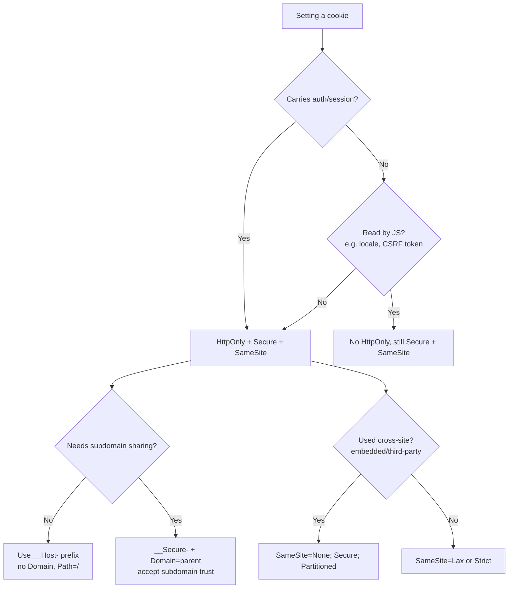

# Set-Cookie

## Quick Summary

`Set-Cookie` is a **response-only** header the server sends to tell the browser "store this cookie and echo it back on future requests." Each header carries exactly one cookie: a mandatory `name=value` pair plus optional attributes (`Expires`, `Max-Age`, `Domain`, `Path`, `Secure`, `HttpOnly`, `SameSite`, `Partitioned`, `Priority`) that control the cookie's lifetime, scope, transport, and script-visibility. It is the outbound half of the cookie round-trip; the browser strips the attributes and returns only `name=value` in the [Cookie](./Cookie.md) request header. `Set-Cookie` is unique among HTTP headers in one crucial way: when a response sets several cookies, each gets its **own** `Set-Cookie` line and they must **never** be comma-folded into one header — because cookie values and `Expires` dates legally contain commas. Get `Set-Cookie` right and you have secure, correctly-scoped sessions; get it wrong and you leak sessions across subdomains, expose tokens to XSS, or silently fail to set anything at all.

## What problem does this header solve?

HTTP is stateless (see [Cookies Overview](./Cookies-Overview.md)): the server forgets you the instant it finishes a response. Yet nearly every application needs continuity — a logged-in session, a cart, a locale, an experiment bucket. `Set-Cookie` is the mechanism by which the server **plants a piece of state in the client and dictates the exact rules under which that state comes back**: which hosts and paths receive it, whether HTTPS is required, whether JavaScript may read it, and whether it rides on cross-site requests. Without it, the only way to correlate requests would be to stuff identifiers into every URL (fragile, leaky via [Referer](../03-Request-Headers/Referer.md), un-shareable) or to demand credentials on every request (unusable). `Set-Cookie` solves the *precise* problem: issue a scoped, policy-bearing token once, and have the browser re-present it automatically and safely.

## Why was it introduced?

Cookies were invented at Netscape in 1994 by Lou Montulli to give a shopping cart persistent state, and the original `Set-Cookie` shipped in Netscape's informal spec. It was first standardized in **RFC 2109 (1997)**, revised in **RFC 2965 (2000)** (which introduced the largely-ignored `Set-Cookie2`/`Cookie2` variant and the `Version`/`Comment` attributes that never caught on), and finally re-based on what browsers *actually did* in **RFC 6265 (2011)** — the document you should treat as canonical. RFC 6265 deliberately abandoned the over-engineered RFC 2965 model and codified the de-facto Netscape behavior. Since then the important additions have come through **RFC 6265bis** (the ongoing revision): the `SameSite` attribute (defense against CSRF and cross-site tracking), the `__Secure-`/`__Host-` name prefixes, the Lax-by-default change, and most recently `Partitioned` (CHIPS) for privacy-preserving third-party cookies. The through-line: the header keeps accreting *scoping and security* controls because the original design gave the browser too much latitude to send cookies where they shouldn't go.

## How does it work?

The server emits `Set-Cookie` on a response. The browser parses it, and if it passes the security/scoping checks, writes an entry into its **cookie jar** keyed by the `(Domain, Path, Name)` triple. On every subsequent request the browser evaluates each stored cookie against the request's target host, path, scheme, and site-context, and attaches the matching ones as a single [Cookie](./Cookie.md) header.

- **Browser behavior:** Parses `name=value` and attributes. Rejects the cookie outright if it violates a rule (e.g. `Secure` set over plain HTTP, a `__Host-` prefix with a `Domain`, an oversized value, a public-suffix `Domain`). Stores it; enforces `HttpOnly` (hides from `document.cookie`), `Secure` (HTTPS-only transmission), `SameSite` (cross-site gating), and expiry. Silently drops attributes it doesn't recognize (forward-compatibility), which is why unknown future attributes don't break old browsers.
- **Server behavior:** Sets the header. Frameworks serialize the options object into the correct wire syntax. The server is responsible for coherence — e.g. never emit `SameSite=None` without `Secure`, or the cookie is rejected.
- **Proxy behavior:** A forward proxy passes `Set-Cookie` through untouched (it is an end-to-end header). A **shared cache** treats the presence of `Set-Cookie` as a strong signal *not* to cache the response (a cached `Set-Cookie` would hand one user's session to another) — Nginx and most CDNs refuse to cache responses bearing `Set-Cookie` by default.
- **CDN behavior:** Most CDNs bypass cache (or strip the cookie) on responses carrying `Set-Cookie`, precisely to avoid cross-user session leakage. Some let you configure cookie-aware cache keys, but the safe default everywhere is "response with `Set-Cookie` = do not cache."
- **Reverse proxy behavior:** Nginx passes upstream `Set-Cookie` through; it can rewrite the `Domain`/`Path` (`proxy_cookie_domain`, `proxy_cookie_path`) or add security flags (`proxy_cookie_flags`) when the upstream app is unaware it sits behind a different public hostname.

```mermaid
sequenceDiagram
    participant B as Browser
    participant P as Reverse Proxy / CDN
    participant S as Origin (Express)

    B->>S: POST /login (via proxy)
    S-->>P: 200 OK<br/>Set-Cookie: sid=abc; HttpOnly; Secure; SameSite=Lax; Path=/
    Note over P: Response has Set-Cookie<br/>→ do NOT cache; pass through
    P-->>B: 200 OK + Set-Cookie
    Note over B: Parse, validate, store in cookie jar<br/>keyed by (Domain, Path, Name)
    B->>S: GET /dashboard<br/>Cookie: sid=abc
```

## HTTP Request Example

`Set-Cookie` never appears on a request — it is response-only. The request side of the loop is the [Cookie](./Cookie.md) header the browser sends back after a cookie has been set:

```http
GET /dashboard HTTP/1.1
Host: app.example.com
Cookie: sid=abc123
```

Note the asymmetry: the browser sends back **only** `name=value`. None of the attributes (`Domain`, `Path`, `Secure`, `SameSite`, …) travel in `Cookie` — they governed *whether* the cookie was sent, not what is transmitted.

## HTTP Response Example

A single hardened session cookie:

```http
HTTP/1.1 200 OK
Content-Type: text/html; charset=utf-8
Set-Cookie: sid=abc123; Max-Age=1209600; Path=/; Secure; HttpOnly; SameSite=Lax
```

**Multiple** cookies in one response — each on its own line, never comma-joined:

```http
HTTP/1.1 200 OK
Content-Type: application/json
Set-Cookie: sid=abc123; Path=/; Secure; HttpOnly; SameSite=Lax
Set-Cookie: __Host-csrf=9f2c1a; Path=/; Secure; HttpOnly; SameSite=Strict
Set-Cookie: locale=en-GB; Path=/; Secure; SameSite=Lax; Max-Age=31536000
```

The moment you try to fold these into `Set-Cookie: sid=abc123, __Host-csrf=9f2c1a, ...` you corrupt the cookies, because the `Expires` date format (`Expires=Wed, 09 Jun 2021 10:18:14 GMT`) contains a comma and readers cannot tell a value-comma from a header-separator-comma. This is the one header where the generic "comma-fold repeated headers" rule from [Case-Sensitivity-and-Ordering](../02-Core-Concepts/Case-Sensitivity-and-Ordering.md) is explicitly forbidden. In HTTP/2 and HTTP/3 each cookie is simply its own header field in the HPACK/QPACK field block — the wire has no ambiguity there, but tools that reconstruct HTTP/1.1-style views must still keep them separate.

## Express.js Example

```js
const express = require('express');
const cookieParser = require('cookie-parser');
const app = express();

// cookie-parser reads incoming Cookie headers into req.cookies.
// The secret enables SIGNED cookies (HMAC), surfaced on req.signedCookies.
app.use(cookieParser(process.env.COOKIE_SECRET)); // rotate this secret via env, never hardcode.

const isProd = process.env.NODE_ENV === 'production';

app.post('/login', (req, res) => {
  const sid = createSession(req.body); // returns an opaque, high-entropy random ID (>=128 bits).

  // res.cookie(name, value, options) serializes to a Set-Cookie header.
  res.cookie('sid', sid, {
    httpOnly: true,               // JS cannot read it via document.cookie → neutralizes token theft via XSS.
    secure: isProd,               // only sent over HTTPS in prod; false in dev so it works over http://localhost.
    sameSite: 'lax',              // sent on top-level navigations but not on cross-site subresource/AJAX → baseline CSRF defense.
    maxAge: 1000 * 60 * 60 * 24 * 14, // Express takes MILLISECONDS and emits Max-Age in SECONDS (14 days here).
    path: '/',                    // valid for the whole site. Path is NOT a security boundary.
    // domain: undefined → host-only cookie (only this exact host). Safest default; do not set a Domain unless you need subdomain sharing.
  });
  // Remove httpOnly and an XSS payload can steal the session. Remove secure in prod and the
  // cookie leaks over any accidental HTTP request. Remove sameSite and you re-open CSRF.

  res.json({ ok: true });
});

// A SIGNED cookie: value is tamper-evident (HMAC with COOKIE_SECRET) but NOT encrypted/hidden.
app.post('/cart', (req, res) => {
  res.cookie('cartId', req.body.cartId, {
    signed: true,   // Express appends s:<value>.<hmac>; cookie-parser verifies it on the way back.
    httpOnly: true,
    secure: isProd,
    sameSite: 'lax',
    path: '/',
  });
  res.json({ ok: true });
});

// __Host- prefixed cookie: the browser REJECTS it unless Secure, Path=/, and NO Domain.
// This locks the cookie to exactly one host — the strongest anti-cookie-tossing guarantee.
app.post('/login-strict', (req, res) => {
  res.cookie('__Host-sid', createSession(req.body), {
    httpOnly: true,
    secure: true,     // MANDATORY for __Host- (browser drops it otherwise).
    sameSite: 'lax',
    path: '/',        // MANDATORY: must be exactly "/".
    // domain MUST be omitted — setting it makes the browser reject the cookie.
  });
  res.json({ ok: true });
});

// Deleting a cookie: clearCookie must be called with the SAME path/domain used to set it,
// or the browser targets a different (Domain, Path, Name) key and the real cookie survives.
app.post('/logout', (req, res) => {
  destroySession(req.cookies.sid);          // kill the SERVER-SIDE session first — that's the real revocation.
  res.clearCookie('sid', { path: '/', httpOnly: true, secure: isProd, sameSite: 'lax' });
  res.json({ ok: true });
});

app.listen(3000);
```

Every option is load-bearing. `httpOnly` is your XSS containment; `secure` prevents plaintext leakage; `sameSite` is your CSRF baseline; `maxAge`/absence decides persistent-vs-session; `path`/`domain` decide the jar key (and therefore whether `clearCookie` can find the cookie to delete). The single most common Express cookie bug is calling `clearCookie('sid')` with default options after having set it with a custom `path`/`domain` — the delete misses and the user stays logged in.

## Node.js Example

Raw `http` gives you no serialization help — you build the header string yourself and must remember the array-not-string rule for multiple cookies:

```js
const http = require('http');
const crypto = require('crypto');

http.createServer((req, res) => {
  if (req.url === '/login' && req.method === 'POST') {
    const sid = crypto.randomBytes(18).toString('base64url'); // 144 bits of entropy — unguessable.

    // Multiple cookies MUST be an ARRAY of strings, not one comma-joined string.
    // Node emits each array element as its own Set-Cookie line on the wire.
    res.setHeader('Set-Cookie', [
      `sid=${sid}; Max-Age=1209600; Path=/; Secure; HttpOnly; SameSite=Lax`,
      `csrf=${crypto.randomBytes(16).toString('hex')}; Path=/; Secure; SameSite=Strict`,
    ]);
    res.writeHead(200, { 'Content-Type': 'application/json' });
    return res.end(JSON.stringify({ ok: true }));
  }
  res.writeHead(404).end();
}).listen(3000);
```

If you mistakenly write `res.setHeader('Set-Cookie', 'sid=...; ..., csrf=...; ...')` (a single joined string), the browser sees one malformed cookie and both are effectively broken. Always pass an array. Reading back what you set: `res.getHeader('Set-Cookie')` returns the **array** — never a joined string — precisely because these headers must stay separate.

## React Example

React never sets `Set-Cookie` — it runs in the browser and has no ability to write response headers; only the server can. React's relationship to `Set-Cookie` is entirely indirect, in three places:

1. **It cannot read `HttpOnly` cookies (by design).** `document.cookie` returns everything *except* `HttpOnly` cookies. This is the whole point: your React code literally cannot see the session token, so an injected XSS script running in the same context can't exfiltrate it either. Do not try to "read the session in React" — you architect around the fact that you can't.
2. **`fetch`/`axios` must opt in to sending cookies cross-origin.** A cookie set by `api.example.com` is only attached to a cross-origin `fetch` from `app.example.com` when you pass `credentials: 'include'` (fetch) or `withCredentials: true` (axios), *and* the server returns the matching CORS credential headers. See [Cookie](./Cookie.md) and [CORS Overview](../07-CORS/CORS-Overview.md).

```jsx
async function login(email, password) {
  // credentials:'include' → the browser will store the Set-Cookie from the response
  // AND send existing cookies on this cross-origin call. Without it, Set-Cookie on a
  // cross-origin response is silently dropped.
  await fetch('https://api.example.com/login', {
    method: 'POST',
    credentials: 'include',
    headers: { 'Content-Type': 'application/json' },
    body: JSON.stringify({ email, password }),
  });
  // Note: you never touch the cookie in JS. The browser stored it; it rides automatically next time.
}
```

3. **SSR frameworks (Next.js) forward `Set-Cookie` deliberately.** In a Next.js Route Handler or Server Action you set cookies via `cookies().set(...)`, which the framework serializes into `Set-Cookie` on the streamed response — the same header, just abstracted. During SSR you must also *forward* the incoming `Cookie` header to your backend fetch, or the server-rendered request runs unauthenticated.

## Browser Lifecycle

1. **Response arrives** with one or more `Set-Cookie` headers.
2. **Validation.** For each cookie the browser checks: is `Secure` set on a non-HTTPS response? (reject) Does a `__Host-`/`__Secure-` prefix's constraints hold? (reject if not) Is `Domain` a public suffix or not a suffix of the current host? (reject) Is `SameSite=None` present without `Secure`? (reject) Is the value within size limits? (reject if over ~4 KB).
3. **Storage.** A valid cookie is written to the jar under `(Domain, Path, Name)`. If a cookie with the same key exists, it is **overwritten** (this is how you update a value). A different path/domain creates a *separate* cookie with the same name — the duplicate-cookie trap.
4. **Expiry bookkeeping.** No `Expires`/`Max-Age` → session cookie (memory, discarded on session end — modulo session-restore). Otherwise persistent (written to disk with the deadline). `Max-Age=0` or a past `Expires` → delete immediately.
5. **Attachment.** On each later request the browser scans the jar, matches by domain/path/scheme/site, and attaches matches as [Cookie](./Cookie.md).
6. **Eviction.** Beyond expiry, browsers evict cookies under per-domain count limits (~180) and total-jar limits, using an LRU-ish policy — an over-eager cookie-setter can push out its own earlier cookies.

## Production Use Cases

- **Session identity:** `Set-Cookie: sid=<opaque>; HttpOnly; Secure; SameSite=Lax; Path=/`, backed by a server-side store. The default for stateful web apps.
- **CSRF token (double-submit):** a non-`HttpOnly` `__Host-csrf` cookie the SPA reads and echoes in a request header, compared server-side against the session. `SameSite=Strict` for extra defense.
- **Persistent preferences:** locale, theme — `Max-Age=31536000`, not `HttpOnly` (JS may want to read them), `SameSite=Lax`.
- **"Remember me":** a long-lived, tightly-scoped refresh cookie (`Path=/auth/refresh`, `SameSite=Strict`) separate from the short-lived session — see [Sessions vs Stateless Tokens](./Sessions-vs-Stateless-Tokens.md).
- **A/B test bucket / analytics ID:** persistent, `SameSite=Lax`; increasingly `Partitioned` when set in a third-party context.
- **Logout / deletion:** re-issue with `Max-Age=0` and identical scope to evict.

## Common Mistakes

- **Deleting with the wrong scope.** `clearCookie('sid')` after setting it with `path:'/app'` targets `(host, /, sid)`, not `(host, /app, sid)` — the cookie survives and the user stays logged in. Always delete with the exact `path`/`domain` used to set it.
- **`SameSite=None` without `Secure`.** Modern browsers reject it silently. The cookie is simply never stored, and your cross-site integration mysteriously "doesn't send cookies."
- **`Domain` too broad.** `Domain=example.com` shares the cookie with *every* subdomain, including untrusted user-content subdomains — the cookie-tossing risk. Prefer host-only (omit `Domain`) unless you truly need cross-subdomain SSO; then use `__Host-` where possible.
- **Comma-folding multiple cookies** (in hand-rolled Node or misbehaving middleware) — corrupts every cookie. Use an array.
- **Setting cookies on cacheable responses.** A `Set-Cookie` on a response a CDN caches (misconfigured) leaks one session to everyone. Never attach `Set-Cookie` to a `public`-cacheable response; pair session-setting responses with `Cache-Control: no-store`/`private` (see [Cache-Control](../06-Caching-Headers/Cache-Control.md)).
- **Missing `Secure` in prod.** The cookie leaks over any plaintext request (an `http://` link, a downgrade). Always `Secure` in production.
- **Relying on cookie expiry for security.** The cookie deadline is a UX hint; enforce the real session TTL server-side.
- **Oversized cookies.** Storing a JWT with many claims pushes past 4 KB (rejected) or bloats every request. Keep cookies small; put big state server-side.

## Security Considerations

- **`HttpOnly` is your XSS blast-radius limiter.** It doesn't prevent XSS, but it stops an injected script from reading the session token via `document.cookie`. Always set it on auth cookies.
- **`Secure` prevents plaintext exposure** and, combined with [Strict-Transport-Security](../05-Security-Headers/Strict-Transport-Security.md), removes the downgrade window.
- **`SameSite` is CSRF defense at the browser layer.** `Lax` (the modern default) blocks the classic cross-site form-POST attack; `Strict` blocks even top-level cross-site navigations carrying the cookie. Detailed in [Cookie-Attributes](./Cookie-Attributes.md).
- **Name prefixes are browser-enforced integrity.** `__Secure-` requires `Secure`; `__Host-` additionally requires `Path=/` and *forbids* `Domain`, guaranteeing the cookie is host-locked and can't be overwritten by a sibling subdomain (defeats cookie tossing). Prefixes are the rare case where the *name* changes browser behavior.
- **Session fixation:** always issue a **new** session ID on privilege change (login), so a pre-login `sid` an attacker planted can't be promoted to an authenticated one.
- **Signed ≠ encrypted.** `cookie-parser` signing makes a value tamper-evident, not secret. Never put confidential data in a signed-but-unencrypted cookie.
- **Header injection.** If a cookie value is built from unsanitized user input containing CRLF, an attacker could inject additional headers. Frameworks encode this, but never interpolate raw user input into a hand-built `Set-Cookie` string.

## Performance Considerations

- **Every cookie you set is sent on every matching future request**, including static assets. A bloated cookie jar adds bytes to thousands of requests. Keep cookies to an opaque ID; store the rest server-side.
- **`Set-Cookie` suppresses caching.** A response carrying it is uncacheable at shared tiers, so route session-setting through non-cacheable endpoints and keep static/CDN paths cookie-free (a dedicated cookieless asset domain is a classic optimization).
- **HTTP/2/3 HPACK/QPACK** compress repeated cookie headers across a connection, softening the cost — but the first request and cross-connection requests still pay full size.
- **Number matters too:** more cookies = more parsing and more eviction churn. Consolidate where sensible.

## Reverse Proxy Considerations

When your app runs behind Nginx under a different public hostname/scheme, rewrite cookie scope and harden flags at the edge:

```nginx
location / {
    proxy_pass http://app_upstream;

    # App thinks it's on internal.local; rewrite the cookie Domain to the public host.
    proxy_cookie_domain internal.local app.example.com;

    # Strip an upstream /app prefix so cookies scope to the public path.
    proxy_cookie_path /app/ /;

    # Force security flags even if the upstream app forgot them (Nginx 1.15.7+):
    proxy_cookie_flags ~ secure httponly samesite=lax;

    # Never let a Set-Cookie response get cached:
    proxy_no_cache $http_set_cookie;
    proxy_cache_bypass $http_set_cookie;
}
```

`proxy_cookie_flags` is invaluable when you can't easily change a legacy upstream but must guarantee `Secure`/`HttpOnly` at the boundary. Do not, however, treat the proxy as a substitute for correct app-level attributes.

## CDN Considerations

- **Default: responses with `Set-Cookie` are not cached.** Cloudflare, Fastly, CloudFront all bypass or strip cache on `Set-Cookie` to prevent cross-user leakage. Rely on this; don't fight it.
- **Cache-key cookie stripping:** CDNs let you ignore/strip specific cookies from the cache key so that a marketing/analytics cookie doesn't shatter your cache hit-rate. Configure this carefully — stripping a cookie that *does* affect the response causes wrong-content delivery.
- **Cloudflare** can add or rewrite cookies via Workers/Transform Rules; useful for edge-set A/B buckets. Ensure `Secure`/`SameSite` are present.
- **Serve assets from a cookieless path/host** so the CDN never sees a cookie on static requests — maximizes hit rate and trims request size.

## Cloud Deployment Considerations

- **`secure: true` behind a TLS-terminating load balancer:** the app sees plain HTTP from the LB and Express won't set a `Secure` cookie unless it trusts the proxy. Set `app.set('trust proxy', 1)` so Express reads [X-Forwarded-Proto](../14-Proxies/X-Forwarded-Proto.md) and treats the connection as HTTPS. Without it, `secure` cookies silently don't get set behind an ALB/ELB.
- **Sticky sessions vs shared store:** if the session state lives in server memory, you need LB session affinity; the robust pattern is a shared store (Redis) so any instance can serve any request — see [Sessions vs Stateless Tokens](./Sessions-vs-Stateless-Tokens.md).
- **API Gateways** may cache; ensure authenticated routes that emit `Set-Cookie` are excluded from gateway caching.
- **Multi-region:** a session cookie set in one region must resolve against a store the serving region can reach; use a globally-replicated store or region-pinned routing.

## Debugging

- **Chrome DevTools → Application → Cookies:** the authoritative view of the jar — name, value, domain, path, expiry, `Secure`/`HttpOnly`/`SameSite`/`Partitioned` flags. The **Network** tab shows the `Set-Cookie` on each response and flags rejected cookies with a warning icon (hover for the reason: "this Set-Cookie was blocked because…").
- **curl:** `curl -sD - -o /dev/null https://app.example.com/login -X POST` prints every `Set-Cookie` line separately. `curl -c jar.txt ... ` saves cookies; `-b jar.txt` replays them.
- **Postman / Bruno:** both maintain a cookie jar and display `Set-Cookie`; Postman's "Cookies" manager lets you inspect and edit stored cookies per domain. Bruno lets you assert on `res.headers['set-cookie']` in test scripts (an array).
- **Node.js:** `res.getHeader('Set-Cookie')` returns the array you set. On the receiving side of undici/fetch, use `response.headers.getSetCookie()` — never `.get('set-cookie')`, which incorrectly joins them.
- **Express logging:** `res.on('finish', () => console.log(res.getHeader('Set-Cookie')))` prints exactly what left the server.

## Best Practices

- [ ] Auth cookies: always `HttpOnly` + `Secure` + an explicit `SameSite`.
- [ ] Store only an opaque, high-entropy ID (or a signed token); keep real state server-side.
- [ ] Omit `Domain` (host-only) unless you genuinely need subdomain sharing.
- [ ] Prefer `Max-Age` over `Expires` (clock-skew immune); enforce the real TTL server-side.
- [ ] Use `__Host-` for session/CSRF cookies where the single-host constraint fits.
- [ ] `SameSite=None` must always be paired with `Secure`.
- [ ] Delete with the exact `path`/`domain` used to set — verify the cookie actually disappears.
- [ ] Never attach `Set-Cookie` to a cacheable response; pair with `Cache-Control: no-store`/`private`.
- [ ] Set `trust proxy` so `secure` cookies work behind a TLS-terminating LB.
- [ ] Rotate the session ID on login (session-fixation defense).

## Related Headers

- [Cookie](./Cookie.md) — the request-side echo; `Set-Cookie` is the "store" instruction, `Cookie` is the "here it is" reply.
- [Cookie-Attributes](./Cookie-Attributes.md) — the deep dive on every attribute (`Domain`, `Path`, `Expires`/`Max-Age`, `Secure`, `HttpOnly`, `SameSite`, `Partitioned`, `Priority`, prefixes).
- [Cookies Overview](./Cookies-Overview.md) — the conceptual frame for the whole chapter.
- [Sessions vs Stateless Tokens](./Sessions-vs-Stateless-Tokens.md) — how the cookie you set fits a session or token architecture.
- [Cache-Control](../06-Caching-Headers/Cache-Control.md) — a `Set-Cookie` response must not be shared-cached; use `no-store`/`private`.
- [Strict-Transport-Security](../05-Security-Headers/Strict-Transport-Security.md) — closes the downgrade window that `Secure` alone leaves open.
- [Authorization](../09-Authentication/Authorization.md) — the header-based alternative to cookie-carried credentials.
- [Case-Sensitivity-and-Ordering](../02-Core-Concepts/Case-Sensitivity-and-Ordering.md) — why `Set-Cookie` is the exception to comma-folding of repeated headers.

## Decision Tree



## Mental Model

`Set-Cookie` is the **luggage tag the airline (server) attaches to your bag at check-in.** The tag has a claim number (`name=value`) and printed routing rules: which airports will accept it (`Domain`/`Path`), that it only travels on secure flights (`Secure`), that only staff — not passengers — may read the routing barcode (`HttpOnly`), and whether it's honored when a *connecting* carrier hands it over (`SameSite`). The airline prints all this once at check-in; from then on the handling systems (the browser) route the bag automatically according to those rules, and the passenger never touches the tag. Print the tag wrong — too broad a routing zone, no "secure flights only" mark — and the bag ends up on the wrong carousel for the wrong traveler. The `__Host-` prefix is the tamper-proof, single-airport tag that the baggage system flatly refuses to accept unless it's printed to the strictest spec.
