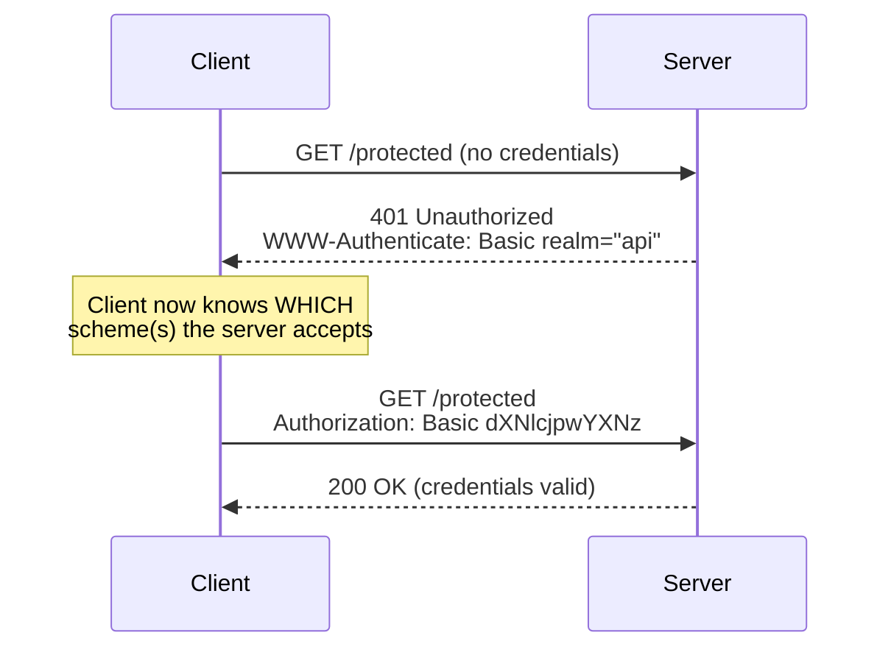
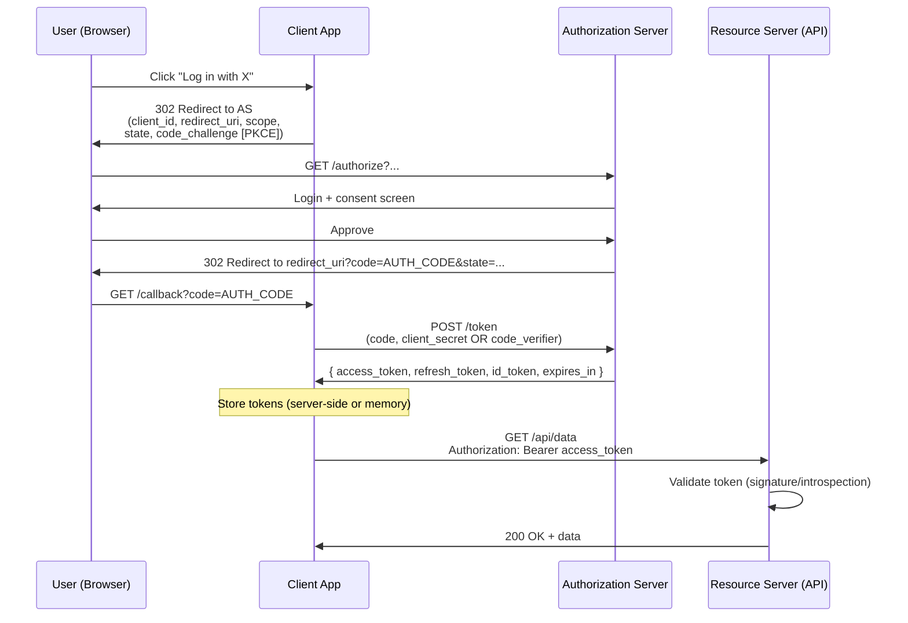
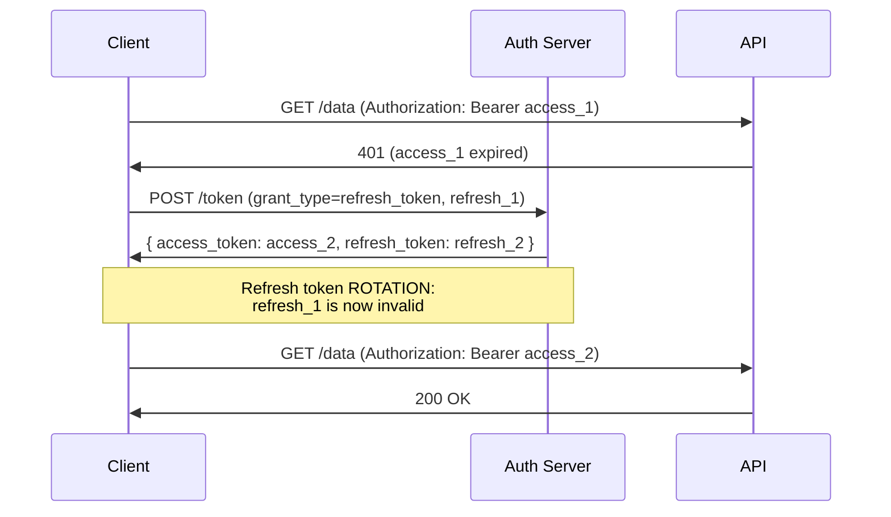

# Authentication Overview

## Quick Summary

Authentication is the machinery by which a server decides *who is talking to it* and, subsequently, *what they are allowed to do*. At the HTTP layer this is not one mechanism but a family of them, and they all reduce to the same physical question: **which bytes, in which header (or cookie), carry the caller's identity claim, and how does the server verify them?** HTTP standardizes a challenge/response dance around the `401 Unauthorized` status, the [WWW-Authenticate](./WWW-Authenticate.md) response header, and the [Authorization](./Authorization.md) request header. On top of that thin standard, the industry has layered token formats (JWT), delegation protocols (OAuth 2.0, OpenID Connect), transport-level identity (mutual TLS), and the older, stateful, cookie-based session model. This chapter is the map: it shows *where the credential physically rides* in each scheme, why you'd pick one over another, and how they interact with browsers, proxies, and CDNs. The per-header deep dives live in the sibling pages; this is the orientation you read first.

## Authentication vs Authorization

These two words are used interchangeably in hallway conversation and they must never be conflated in code.

- **Authentication (AuthN)** answers *"who are you?"* — it establishes identity. Verifying a password, validating a JWT signature, checking a client certificate against a CA: all AuthN.
- **Authorization (AuthZ)** answers *"are you allowed to do this?"* — it makes an access-control decision *given* an already-established identity. Checking that `user.role === 'admin'`, that a token's `scope` contains `orders:write`, that the tenant ID in the URL matches the tenant ID in the token: all AuthZ.

The confusingly named [Authorization](./Authorization.md) request header carries **authentication** material (a credential), despite its name. This is a historical wart: RFC 7235 named the header after the *act of authorizing the request to proceed*, not after the AuthZ decision. Internalize the split now, because the single most common security bug in web applications is code that authenticates a caller correctly and then forgets to authorize the specific action — the classic *IDOR* (Insecure Direct Object Reference), where a valid token for user A is used to read user B's invoice because the handler never checked ownership.

A useful discipline: authentication produces a trustworthy `req.user` (or equivalent); authorization is *everything you do afterward* to gate the specific resource. AuthN is largely centralizable (one middleware); AuthZ is largely not (it lives next to your business logic, because only the business logic knows what "allowed" means for this resource).

## The problem authentication solves

HTTP is stateless by design. Every request arrives as an independent event with no memory of the last one — the server that handled your login has, by the time your next request lands, forgotten you exist (and may literally be a different server behind a load balancer). Yet almost every real application must answer "is this the same person who logged in, and are they who they claim to be?" on *every single request*. Authentication is the set of techniques for **re-establishing identity on each stateless request** without forcing the user to re-enter their password every time.

Every scheme below is a different answer to one question: *what compact, verifiable proof of identity does the client attach to each request, and how does the server check it cheaply?*

## The 401 challenge/response model

RFC 7235 defines the canonical negotiation. It is worth understanding even if you never use HTTP Basic, because Bearer tokens reuse the same status code and headers.



The flow:

1. Client requests a protected resource with no credentials.
2. Server refuses with **`401 Unauthorized`** and — critically — a **[WWW-Authenticate](./WWW-Authenticate.md)** header describing *which authentication scheme(s)* the client may use and any parameters (the `realm`, accepted token types, error details). A `401` without a `WWW-Authenticate` header is technically malformed, though many APIs violate this.
3. The client constructs a credential for one of the offered schemes and retries, this time with an **[Authorization](./Authorization.md)** header.
4. The server validates and returns `200` (or `403 Forbidden` if the identity is valid but *not permitted* — an AuthZ failure, distinct from `401`).

The `401` vs `403` distinction is load-bearing. **`401` means "I don't know who you are — (re)authenticate."** **`403` means "I know exactly who you are, and the answer is no."** Returning `401` for an authorization failure invites clients to pointlessly re-authenticate; returning `403` for a missing credential deprives them of the `WWW-Authenticate` challenge they need to proceed. There is a parallel universe for proxies — `407` and [Proxy-Authenticate](./Proxy-Authenticate.md) / [Proxy-Authorization](./Proxy-Authorization.md) — covered in those pages.

## Header-based schemes

All header-based schemes share the wire format defined in RFC 7235: `Authorization: <scheme> <credentials>`. The scheme token tells the server how to parse and verify what follows.

### Basic

`Authorization: Basic base64(username ":" password)`. The credentials are the user's password, Base64-encoded (which is **encoding, not encryption** — trivially reversible). Basic is only safe over TLS, sends the raw password on every request, and offers no logout mechanism. It survives in machine-to-machine and internal contexts because it is trivial to implement. Detailed in [Authorization](./Authorization.md) and [WWW-Authenticate](./WWW-Authenticate.md) (the latter drives the browser's native login dialog).

### Bearer

`Authorization: Bearer <token>`. "Bearer" means *whoever holds this token may use it* — like cash, there is no additional proof of ownership. The token is usually a JWT or an opaque reference token. This is the dominant scheme for modern APIs, SPAs talking to their backend, and OAuth 2.0 access tokens. Its entire security rests on keeping the token secret in transit (TLS) and at rest (never in `localStorage` if you can avoid it, never in logs, never in URLs).

### Digest

`Authorization: Digest ...` — a challenge/response scheme where the client proves knowledge of the password by hashing it together with a server-supplied `nonce`, so the password itself never crosses the wire. It predates ubiquitous TLS and was designed to be safe over plaintext HTTP. Today TLS solves the same problem more comprehensively, and Digest's complexity (nonce management, `qop`, quality-of-protection, MD5's weakness) means it is effectively legacy. You will meet it in old enterprise gear and some IP cameras; you will rarely deploy it new.

### Negotiate (SPNEGO / Kerberos / NTLM)

`Authorization: Negotiate <base64 GSSAPI token>` — the Windows/Active-Directory world's single-sign-on scheme. The browser, when it trusts the site (intranet zone), transparently obtains a Kerberos ticket and hands it over, giving true SSO with no password prompt. It is multi-round-trip (the `401`/`Authorization` dance can bounce several times) and connection-oriented, which makes it notoriously hostile to load balancers and HTTP/2. Relevant if you build for corporate intranets; irrelevant for public internet apps.

## Cookie-based sessions (the stateful alternative)

The oldest web-native approach does **not** use the `Authorization` header at all. On successful login the server issues a session identifier via [Set-Cookie](../08-Cookies/Set-Cookie.md); the browser then automatically attaches it via the [Cookie](../08-Cookies/Cookie.md) header on every subsequent same-site request. The server looks the session ID up in a store (Redis, database, signed cookie) to recover the user.

Why this still dominates traditional server-rendered apps:

- **Automatic transport.** The browser sends the cookie without any JavaScript. This is a feature (works with plain `<form>` posts, ``, SSR navigation) and a curse (it is exactly the mechanism that makes CSRF possible — see below).
- **Revocable server-side.** Because the session is looked up in a store, you can invalidate it instantly (logout, "sign out everywhere," ban a user). Stateless JWTs cannot be revoked without adding a store, which negates their main advantage.
- **`HttpOnly` + `Secure` + `SameSite`.** A session cookie can be made unreadable to JavaScript (`HttpOnly`), TLS-only (`Secure`), and immune to most cross-site sending (`SameSite=Lax|Strict`), giving it a strong default security posture that `localStorage`-stored tokens cannot match. See [Set-Cookie](../08-Cookies/Set-Cookie.md).

The tradeoff is statefulness: sessions require shared server-side storage (or signed stateless cookies), which is operational weight that pure-token APIs avoid.

## JWT at the header level

A JSON Web Token is three Base64URL segments joined by dots: `header.payload.signature`.

```
eyJhbGciOiJIUzI1NiIsInR5cCI6IkpXVCJ9   ← header:  {"alg":"HS256","typ":"JWT"}
.eyJzdWIiOiIxMjMiLCJzY29wZSI6InJlYWQi   ← payload: {"sub":"123","scope":"read","exp":...}
.SflKxwRJSMeKKF2QT4fwpMeJf36POk6yJV_adQssw5c  ← signature over header.payload
```

At the HTTP layer the salient facts are:

- **The payload is not secret.** It is Base64URL, not encrypted. Anyone who intercepts the token — or opens DevTools — can read `sub`, `scope`, `exp`. Never put secrets in a JWT payload. The signature guarantees *integrity* (nobody tampered), not *confidentiality*.
- **Where it rides:** almost always `Authorization: Bearer <jwt>`. Occasionally in a cookie (to get `HttpOnly`), which trades the XSS-resistance win for CSRF exposure you must then handle.
- **Statelessness is the point and the trap.** The server verifies the signature with a key it already holds and trusts the claims *without a database lookup* — fast and horizontally scalable. But that same property means you cannot revoke a leaked token before its `exp`. Keep access-token lifetimes short (minutes) and pair them with a revocable refresh mechanism.
- **`alg` is an attack surface.** The `alg:none` downgrade and RS256→HS256 confusion attacks are historically devastating. Always pin the expected algorithm server-side; never let the token tell you how to verify itself. Covered concretely in [Authorization](./Authorization.md).

## OAuth 2.0 and OpenID Connect at the header level

OAuth 2.0 is a **delegation** framework: it lets a user grant a third-party app limited access to their resources without sharing their password. OpenID Connect (OIDC) is a thin identity layer on top that adds an `id_token` (a JWT describing *who the user is*, for the client to consume) alongside OAuth's `access_token` (an opaque or JWT credential *for calling the resource server*).

The header-level takeaways cut through the ceremony:

- The multi-step dance (redirects, `code`, `client_secret`, PKCE) exists entirely to **safely mint an access token** without exposing long-lived credentials to the browser or the network.
- Once minted, the access token is used exactly like any Bearer token: `Authorization: Bearer <access_token>` on each API call. The resource server does not care that OAuth produced it.
- The `id_token` (OIDC) is *not* sent to APIs as a Bearer credential. It is consumed once by the client to learn the user's identity. Sending it to a resource server is a common mistake.



The **authorization-code flow with PKCE** shown above is the current best practice for both server-side and public (SPA/mobile) clients. The older *implicit flow* (token returned directly in the redirect fragment) is deprecated because it leaks tokens into browser history and referrers. The `state` parameter defends against CSRF on the redirect; `code_challenge`/`code_verifier` (PKCE) defends against authorization-code interception on public clients that can't keep a `client_secret`.

## API keys

A long random string identifying a *calling application* (not an end user), typically for server-to-server or developer-facing APIs. There is no standardized header — you'll see `Authorization: Bearer sk_live_...`, `X-API-Key: ...`, or a query parameter (avoid the query string: it leaks into logs, proxies, and [Referer](../03-Request-Headers/Referer.md)). API keys are simple and long-lived, which makes rotation and scoping (per-key rate limits and permissions) the real operational concern. Treat them exactly like passwords at rest: hash them in your database, show them once.

## Mutual TLS (mTLS)

Identity established at the **transport layer**, below HTTP. In ordinary TLS only the *server* presents a certificate; in mTLS the *client* also presents one, and the server validates it against a trusted CA. Because this happens during the TLS handshake, there is *no `Authorization` header at all* — the identity is the client certificate itself. Terminating proxies typically forward the verified identity to the app in a header like `X-Client-Cert` or `X-SSL-Client-S-DN` (which your app must then trust *only* from the proxy, never from the public internet). mTLS is the standard for high-assurance service-to-service auth (service meshes, banking APIs, IoT fleets) because it's phishing-proof and requires no shared secret to transmit.

## Why tokens in `Authorization` vs cookies

This is the decision that trips up every SPA team. The two are not "better/worse"; they optimize for different threats and architectures.

| Dimension | `Authorization: Bearer` token | Session/JWT in a `Cookie` |
|---|---|---|
| Sent automatically by browser | No — JS must attach it | Yes — automatic on matching requests |
| CSRF exposure | **Immune** (attacker's site can't set your `Authorization` header) | **Exposed** — needs `SameSite` + CSRF tokens |
| XSS exposure | **High if in `localStorage`** (JS-readable, exfiltratable) | **Low with `HttpOnly`** (JS can't read it) |
| Works across origins / third-party APIs | Naturally | Painful (cross-site cookie restrictions) |
| Server-side revocation | Hard (need a denylist/introspection) | Easy (delete the session) |
| Triggers CORS preflight | Yes (custom header) — see [Authorization](./Authorization.md) | No (cookies aren't a "custom header") |

The pragmatic synthesis many teams land on: **store tokens in `HttpOnly`, `Secure`, `SameSite` cookies** to get XSS resistance, and add CSRF protection (double-submit token or `SameSite=Strict/Lax`) to cover the resulting CSRF surface. This gives you cookies' XSS story with tokens' backend statelessness. Pure `Authorization: Bearer` from JS memory (never `localStorage`) is the other defensible choice, especially for cross-origin APIs. Putting a raw JWT in `localStorage` and reading it with JS is the choice that looks easiest and ages worst.

## Refresh flows

Short-lived access tokens (good for security — a leak expires fast) are bad for UX (the user gets logged out constantly) unless you can renew silently. The **refresh token** is a longer-lived, higher-value credential whose *only* job is to obtain new access tokens.



Key production concerns:

- **Store the refresh token more carefully than the access token** — it's the crown jewel. `HttpOnly` cookie scoped to the token endpoint path is the standard; never in `localStorage`.
- **Rotation with reuse detection.** Each refresh returns a *new* refresh token and invalidates the old one. If an already-used refresh token is presented again, that signals theft (two parties hold it) — revoke the entire token family. This is the single most important refresh-security control.
- **Concurrency.** When multiple in-flight requests all 401 at once, they must not all fire refreshes; funnel them through a single in-flight refresh promise and replay the queued requests with the new token.

## Mental Model

**Authentication is showing ID at a door; authorization is what the bouncer lets you do once you're inside.** The different schemes are just different kinds of ID and different ways of carrying it. HTTP Basic is handing over your actual house key every time — simple, but you'd better trust everyone in the hallway (TLS). A Bearer token is a wristband: whoever wears it gets in, so don't drop it. A cookie session is a coat-check ticket — the venue keeps the real record and can tear up your ticket the moment you're banned. OAuth is valet parking: you hand the valet a limited token, not your car keys, and they fetch only your car. mTLS is a biometric scan at the transport door, before anyone even reaches the desk. And the `401`/`WWW-Authenticate`/`Authorization` cycle is the doorman saying "I need to see ID — here are the kinds I accept," to which you reply by presenting the right one. Everything else in this chapter is detail on which ID to carry, where to keep it, and how the doorman checks it without calling headquarters on every single guest.

## Related Reading

- [Authorization](./Authorization.md) — the request header that carries the credential.
- [WWW-Authenticate](./WWW-Authenticate.md) — the `401` challenge that tells clients how to authenticate.
- [Proxy-Authorization](./Proxy-Authorization.md) / [Proxy-Authenticate](./Proxy-Authenticate.md) — the proxy-tier (`407`) equivalents.
- [Cookie](../08-Cookies/Cookie.md) / [Set-Cookie](../08-Cookies/Set-Cookie.md) — the cookie-based session alternative.
