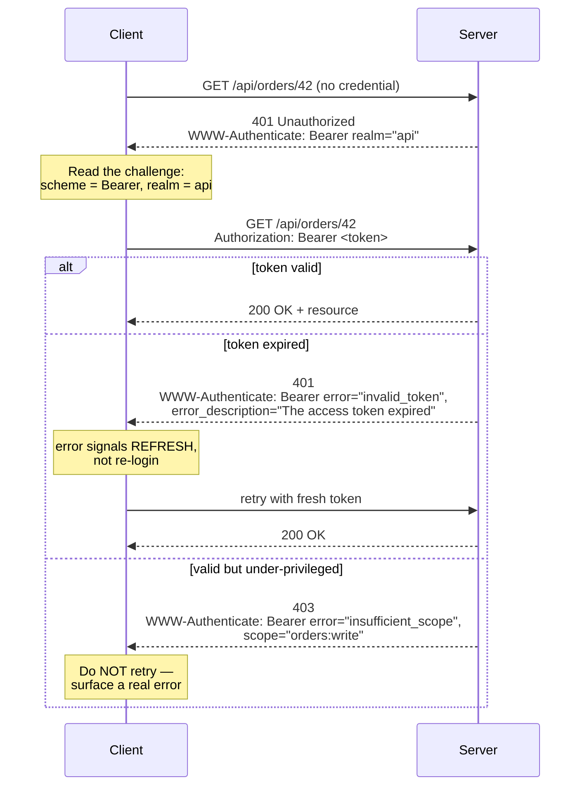
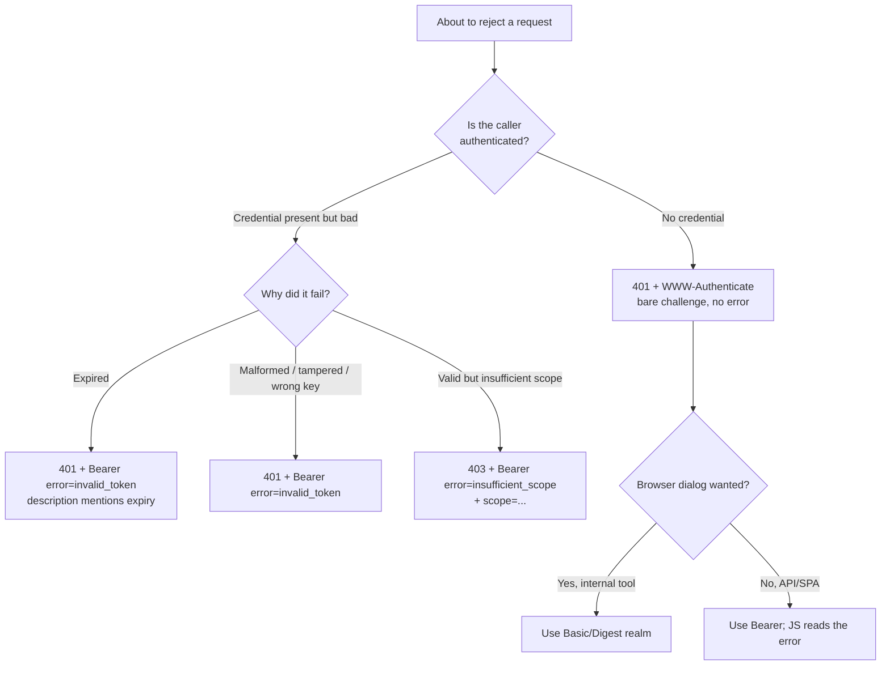

# WWW-Authenticate

## Quick Summary

`WWW-Authenticate` is the **server's half of the HTTP authentication handshake**. It is a response header, sent almost exclusively with a **`401 Unauthorized`** status, whose job is to tell the client *"you need to authenticate, and here is exactly how."* Each value names an authentication **scheme** (`Basic`, `Bearer`, `Digest`, `Negotiate`) followed by scheme-specific parameters — the `realm` (a human-readable protection space), and for Bearer, machine-readable `error`/`error_description` fields (RFC 6750). It is the challenge that the client answers by re-sending the request with an [Authorization](./Authorization.md) header carrying a credential for one of the offered schemes. In a browser, a `WWW-Authenticate: Basic`/`Digest`/`Negotiate` challenge triggers the **native credential dialog** with no JavaScript involved. A `401` without a `WWW-Authenticate` header is technically malformed per RFC 9110 — the challenge is not optional decoration, it is the contract that makes the [Authorization](./Authorization.md) header interoperable.

## What problem does this header solve?

A protected endpoint that simply rejects unauthenticated callers is useless if the caller has no idea *how* to become authenticated. Does this server want a password (Basic)? A signed token (Bearer)? A Kerberos ticket (Negotiate)? What realm are we even authenticating into — the admin panel or the public API? Without a standardized way to advertise "here are the credentials I accept and the parameters you need," every client would have to hard-code out-of-band knowledge of each server's auth scheme, and browsers could never offer a generic login prompt.

`WWW-Authenticate` solves this by making the challenge **self-describing and machine-parseable**. The server publishes, on the very response that rejects the request, the menu of acceptable schemes and their parameters. The client — human-driven browser or automated API consumer — reads the menu, constructs the right credential, and retries. It turns authentication from a bespoke per-server protocol into a single interoperable negotiation that HTTP clients, servers, and proxies all understand. For Bearer specifically, RFC 6750's `error`/`error_description` fields let the server tell an OAuth client *why* the token was rejected (expired vs. malformed vs. insufficient scope) so the client can react intelligently — refresh, re-login, or give up — instead of blindly retrying.

## Why was it introduced?

`WWW-Authenticate` shipped in **HTTP/1.0 (RFC 1945, 1996)** alongside HTTP Basic authentication and the [Authorization](./Authorization.md) header, as the server's side of the "password-protected directory" use case that defined early web auth. HTTP/1.1 formalized it and added **Digest** (RFC 2617, 1999). The authentication framework was later cleanly separated into **RFC 7235 ("HTTP/1.1: Authentication", 2014)** and is now consolidated in **RFC 9110 ("HTTP Semantics", 2022)**.

The design was deliberately **extensible**: `WWW-Authenticate` advertises schemes from an IANA-maintained registry, and a response may list *several* challenges so the client can pick the strongest it supports. That extensibility is why the modern **Bearer** scheme (**RFC 6750, 2012**, born of OAuth 2.0) slots into the identical header decades later — RFC 6750 defined not just `Bearer` but the `realm`, `scope`, `error`, and `error_description` parameters that make OAuth's error signaling work over plain HTTP. The header outlived its 1996 use case because the abstraction — *server advertises a menu of schemes + parameters; client answers with a credential* — turned out to be exactly right.

## How does it work?

- **Browser behavior:** For `Basic`, `Digest`, and `Negotiate`, the browser handles the challenge *itself*. A `401` + `WWW-Authenticate: Basic realm="Admin"` pops the **native username/password dialog** (the `realm` string is shown to the user as the "site says…" label). On submit, the browser builds the [Authorization](./Authorization.md) header, retries, and then **caches those credentials for that origin+realm and auto-sends them for the rest of the session**. For `Bearer`, the browser does **nothing** — it does not understand Bearer challenges, shows no dialog, and surfaces the `401` to your JavaScript, which must parse `error`/`error_description` and react. `Negotiate` triggers a transparent Kerberos/NTLM exchange for trusted intranet sites.
- **Server behavior:** The origin *emits* `WWW-Authenticate` on every `401`. It decides which schemes to advertise, sets the `realm`, and — for Bearer — populates `error`/`error_description` to explain the rejection. A well-behaved server never sends a bare `401` without a challenge.
- **Proxy behavior:** `WWW-Authenticate` is an **end-to-end** header (it pertains to origin authentication) and a forward proxy passes it through untouched. The proxy's *own* authentication challenge uses the parallel [Proxy-Authenticate](./Proxy-Authenticate.md) header with a `407` status — a deliberately separate channel so proxy auth and origin auth never collide.
- **CDN behavior:** CDNs forward `401` + `WWW-Authenticate` from origin unchanged. Because a `401` is an error response, CDNs generally do not cache it by default (and you rarely want them to — a cached `401` would lock out authenticated users). Some edge auth products (Cloudflare Access, signed-URL gates) generate their own challenges at the edge before the request reaches origin.
- **Reverse proxy behavior:** Nginx/HAProxy/Envoy can *originate* the challenge themselves when they terminate auth (e.g. Nginx `auth_basic` emits `WWW-Authenticate: Basic realm="..."`), or transparently forward the origin's challenge upstream-to-downstream. When offloading auth to the proxy, the proxy is the one speaking the `401`/challenge protocol to the client.

## HTTP Request Example

The client first requests a protected resource with no credential:

```http
GET /api/orders/42 HTTP/1.1
Host: api.example.com
Accept: application/json
```

## HTTP Response Example

The server refuses and advertises the challenge. A Bearer challenge for an **expired token**, using RFC 6750 error fields:

```http
HTTP/1.1 401 Unauthorized
WWW-Authenticate: Bearer realm="api", error="invalid_token", error_description="The access token expired"
Content-Type: application/json
Content-Length: 27

{"error":"invalid_token"}
```

A Basic challenge (this is what triggers the browser dialog):

```http
HTTP/1.1 401 Unauthorized
WWW-Authenticate: Basic realm="Admin Area", charset="UTF-8"
Content-Length: 0
```

A response can offer **multiple** challenges — the client picks the strongest it supports:

```http
HTTP/1.1 401 Unauthorized
WWW-Authenticate: Bearer realm="api", error="invalid_token"
WWW-Authenticate: Basic realm="api"
```

A Bearer challenge for an **insufficient-scope** failure (note: RFC 6750 allows `403` here because the token is valid but under-privileged — this is an authorization, not authentication, failure):

```http
HTTP/1.1 403 Forbidden
WWW-Authenticate: Bearer realm="api", error="insufficient_scope", scope="orders:write", error_description="Requires orders:write"
```

## Express.js Example

A production challenge helper plus a Bearer verification middleware that emits correct, differentiated `WWW-Authenticate` values. The header value is where all the client's intelligence comes from — get it wrong and clients loop forever or fail silently.

```js
const express = require('express');
const jwt = require('jsonwebtoken');
const app = express();

// One place that builds a spec-correct Bearer challenge. Centralizing this stops
// call sites from hand-concatenating strings and mangling the quoting rules
// (RFC 6750: parameters are quoted-strings; commas separate them).
function bearerChallenge({ error, description, scope } = {}) {
  let v = 'Bearer realm="api"';           // realm: the protection space, shown/logged by clients
  if (error)       v += `, error="${error}"`;             // machine-readable code: invalid_token | invalid_request | insufficient_scope
  if (description) v += `, error_description="${description}"`; // human-readable; safe to show in logs, NOT secret
  if (scope)       v += `, scope="${scope}"`;             // for insufficient_scope: tells the client what it needs
  return v;
}

function requireAuth(req, res, next) {
  const header = req.headers.authorization; // Node lowercases header names

  // 1. No credential at all -> bare challenge, no error code. RFC 6750 says a
  //    request with no token gets a challenge WITHOUT an error parameter, so the
  //    client can't confuse "you sent a bad token" with "you sent no token".
  if (!header || !header.startsWith('Bearer ')) {
    res.set('WWW-Authenticate', bearerChallenge()); // <-- the contract: 401 MUST carry a challenge
    return res.status(401).json({ error: 'missing_token' });
  }

  const token = header.slice('Bearer '.length).trim();

  try {
    // Pin algorithm/issuer/audience — see Authorization.md for why each matters.
    const claims = jwt.verify(token, PUBLIC_KEY, {
      algorithms: ['RS256'], issuer: 'https://issuer.example.com/', audience: 'https://api.example.com',
    });
    req.user = { id: claims.sub, scope: (claims.scope || '').split(' ') };
    next();
  } catch (err) {
    // 2. Bad/expired token -> error="invalid_token" and a description that tells
    //    the CLIENT whether to refresh (expired) or give up/re-login (invalid).
    const description = err.name === 'TokenExpiredError'
      ? 'The access token expired'      // client should hit its refresh flow
      : 'The access token is invalid';  // malformed/tampered/wrong-key: re-authenticate
    res.set('WWW-Authenticate', bearerChallenge({ error: 'invalid_token', description }));
    return res.status(401).json({ error: 'invalid_token' });
  }
}

// 3. Authorization failure: token is VALID but lacks the scope. This is 403 +
//    insufficient_scope, and we tell the client the scope it needs. Using 401 here
//    would (wrongly) invite a pointless re-authentication.
function requireScope(scope) {
  return (req, res, next) => {
    if (!req.user.scope.includes(scope)) {
      res.set('WWW-Authenticate',
        bearerChallenge({ error: 'insufficient_scope', description: `Requires ${scope}`, scope }));
      return res.status(403).json({ error: 'insufficient_scope' });
    }
    next();
  };
}

app.post('/api/orders', requireAuth, requireScope('orders:write'), (req, res) => res.status(201).json({ id: 1 }));

// A Basic-auth realm (this WWW-Authenticate value is what makes the browser dialog appear).
app.get('/internal', (req, res, next) => {
  const header = req.headers.authorization || '';
  if (!header.startsWith('Basic ')) {
    // realm string is shown verbatim in the browser's native login prompt.
    res.set('WWW-Authenticate', 'Basic realm="Internal Tools", charset="UTF-8"');
    return res.status(401).end();
  }
  next();
}, (req, res) => res.send('secret dashboard'));

app.listen(3000);
```

If you drop the `res.set('WWW-Authenticate', ...)` lines, clients still get a `401` but with **no instructions** — the browser won't prompt, OAuth clients can't tell expiry from tampering, and the whole handshake degrades to guesswork. If you conflate the missing-token challenge with `error="invalid_token"`, clients that special-case "no token yet" break.

## Node.js Example

The raw `http` module is identical on the wire; only the ergonomics differ. Nothing is emitted for you.

```js
const http = require('http');

http.createServer((req, res) => {
  const auth = req.headers.authorization || '';
  if (!auth.startsWith('Bearer ')) {
    // writeHead's second arg sets headers atomically before the status line is flushed.
    res.writeHead(401, {
      'WWW-Authenticate': 'Bearer realm="api"',   // the challenge — same wire bytes as Express
      'Content-Type': 'application/json',
    });
    return res.end(JSON.stringify({ error: 'missing_token' }));
  }
  // ...verify token; on failure re-send WWW-Authenticate with error="invalid_token"...
  res.writeHead(200).end('ok');
}).listen(3000);
```

The only meaningful contrast with Express is that you must remember to attach the header on *every* `401` path yourself — there is no helper — which is precisely why the Express example centralizes it in `bearerChallenge()`.

## React Example

React never reads `WWW-Authenticate` for Basic/Digest/Negotiate — those are consumed by the **browser**, not your code, and produce the native dialog before any JS runs. React's only real interaction is with the **Bearer** challenge, which the browser ignores and hands to your fetch layer. The correct pattern is to parse `error`/`error_description` and branch: refresh on expiry, redirect to login on invalid.

```jsx
// A fetch wrapper that reads the Bearer challenge to decide how to react.
async function apiFetch(url, opts = {}) {
  const res = await fetch(url, { ...opts, headers: { ...opts.headers, Authorization: `Bearer ${getAccessToken()}` } });

  if (res.status === 401) {
    // The browser does NOTHING with a Bearer challenge — WE must parse it.
    const challenge = res.headers.get('WWW-Authenticate') || '';
    // RFC 6750 error codes travel in the challenge, not just the body.
    if (/error="invalid_token"/.test(challenge) && /expired/i.test(challenge)) {
      await refreshAccessToken();          // expired -> silently refresh and replay
      return apiFetch(url, opts);
    }
    redirectToLogin();                     // invalid/tampered/no-refresh-possible -> re-authenticate
    throw new Error('unauthenticated');
  }
  if (res.status === 403) {
    const challenge = res.headers.get('WWW-Authenticate') || '';
    const need = challenge.match(/scope="([^"]+)"/)?.[1]; // insufficient_scope tells us what's missing
    throw new Error(`Forbidden${need ? `: needs ${need}` : ''}`); // show a real message, don't retry
  }
  return res.json();
}
```

Note the CORS caveat: to read `WWW-Authenticate` from a cross-origin response, the server must expose it via `Access-Control-Expose-Headers: WWW-Authenticate`, otherwise `res.headers.get('WWW-Authenticate')` returns `null` even though the header is on the wire.

## Browser Lifecycle

1. **Request without credentials** hits a protected resource.
2. **Server responds `401` + `WWW-Authenticate`.**
3. **Scheme dispatch:**
   - **Basic/Digest:** the browser parses the `realm`, shows the **native credential dialog** ("`example.com` says: `<realm>`"), and pauses the navigation. On submit it builds the [Authorization](./Authorization.md) header and **automatically retries the same request**.
   - **Negotiate:** for a trusted (intranet-zone) site, the browser transparently fetches a Kerberos/NTLM token and retries — possibly over several `401`/`Authorization` round trips — with no user prompt.
   - **Bearer:** the browser does **not** act; it delivers the `401` and body to your JS.
4. **Credential caching (Basic/Digest):** the browser remembers the credentials for that **origin+realm** and pre-emptively attaches them to subsequent matching requests, so the dialog appears only once per session. This is also why Basic auth has no clean "logout" — the browser keeps re-sending until the tab/browser closes or a scripted bogus `401` clears it.
5. **On success (`200`)** the navigation/resource load completes normally.

## Production Use Cases

- **OAuth 2.0 / OIDC resource servers:** every rejected API call returns `WWW-Authenticate: Bearer ...` with an RFC 6750 `error`, letting SPAs and mobile apps distinguish "refresh me" from "log me in again." See [Bearer, JWT and OAuth](./Bearer-JWT-OAuth.md).
- **Internal tools & staging environments:** `WWW-Authenticate: Basic realm="Staging"` gives a zero-code login gate via the browser dialog — acceptable behind TLS+VPN for low-stakes internal apps.
- **Corporate intranets:** `WWW-Authenticate: Negotiate` delivers Windows single-sign-on with no password prompt.
- **API discoverability:** well-behaved public APIs (and the OAuth spec) rely on the challenge so generic clients (Postman's auto-auth, SDKs) know which flow to run.
- **Legacy devices:** IP cameras, routers, and printers still ship `Digest` challenges.

## Common Mistakes

- **Returning `401` with no `WWW-Authenticate`.** Technically malformed; browsers won't prompt and OAuth clients lose their error signal. Always attach a challenge.
- **Using `401` for authorization failures.** A valid-but-under-privileged token is `403` + `error="insufficient_scope"`, not `401`. `401` invites a useless re-authentication of an already-authenticated user.
- **Putting secrets in `error_description`.** It is meant to be human-readable and is often logged/shown. Never leak token contents, stack traces, or which user exists ("no such user" vs "wrong password" enables enumeration).
- **Mangling the quoting.** Parameters are `quoted-strings` separated by commas: `Bearer realm="api", error="invalid_token"`. Unquoted values or missing commas make strict parsers reject the challenge.
- **Sending a `Bearer` challenge and expecting the browser to prompt.** Browsers only prompt for `Basic`/`Digest`/`Negotiate`. Bearer challenges are for your JS.
- **Forgetting `Access-Control-Expose-Headers`.** Cross-origin JS cannot read `WWW-Authenticate` unless you expose it — your careful `error` codes become invisible.
- **Advertising a scheme you don't actually verify** (e.g. offering `Basic` but only accepting Bearer), which strands clients that pick the wrong one.

## Security Considerations

- **User enumeration via `error_description`.** Distinct messages for "user not found" vs "bad password" let attackers enumerate accounts. Keep failure text generic for credential endpoints.
- **The Basic dialog is a phishing surface.** Any page that can trigger a `401` can pop a browser credential prompt; combined with a spoofed `realm`, users may be tricked into typing real credentials. Browsers now suppress the dialog for cross-origin subresource `401`s to blunt this.
- **`realm` is attacker-visible.** Don't leak internal hostnames, environment names, or infra topology in the realm string.
- **No confidentiality without TLS.** A `Basic` challenge invites the client to send a Base64'd (i.e. plaintext-equivalent) password — worthless without TLS. Never issue a `Basic` challenge over plain HTTP.
- **Cache poisoning of `401`.** If a shared cache ever stored a `401` challenge keyed loosely, it could lock out or mis-challenge users; keep error responses uncacheable.
- **Downgrade in multi-challenge responses.** Offering both `Bearer` and `Basic` lets a MITM or a weak client pick the weaker scheme; only advertise `Basic` where you truly accept it and always under TLS.

## Performance Considerations

The header is tiny and appears only on the rejection path, so its direct cost is negligible. The performance story is about **round trips**: the `401` challenge/`Authorization` retry doubles the latency of the *first* protected request. For `Basic`/`Digest` the browser mitigates this by caching credentials and pre-emptively sending them after the first challenge. For `Bearer`, well-designed clients attach the token pre-emptively (so the `401` path is only hit on expiry), and the RFC 6750 `error="invalid_token"`/`expired` signal lets a client refresh-and-replay in a single extra round trip rather than bouncing the user back through a full login. `Negotiate` is the outlier — its multi-round-trip handshake and connection affinity add latency and fight HTTP/2 multiplexing and load-balancer connection reuse.

## Reverse Proxy Considerations

Nginx originating a Basic challenge itself (auth offloaded to the edge):

```nginx
location /internal/ {
    auth_basic "Internal Tools";              # this string becomes the WWW-Authenticate realm
    auth_basic_user_file /etc/nginx/.htpasswd; # Nginx emits 401 + WWW-Authenticate: Basic realm="Internal Tools"
    proxy_pass http://app_upstream;
}
```

Nginx validating a token via subrequest and forwarding the *upstream's* challenge on failure:

```nginx
location /api/ {
    auth_request /_authz;                          # subrequest to an auth service
    error_page 401 = @challenge;                   # on 401, run the named location
    proxy_pass http://app_upstream;
}
location @challenge {
    add_header WWW-Authenticate 'Bearer realm="api", error="invalid_token"' always; # 'always' => sent even on 4xx
    return 401;
}
```

Two rules: use `always` on `add_header` or Nginx drops it on error responses; and if the proxy terminates auth, it — not the origin — owns the challenge, so keep the realm and error semantics consistent with what your API docs promise.

## CDN Considerations

- **Don't cache `401`s.** A cached challenge served to an authenticated user is a lockout bug. Most CDNs skip caching `4xx` by default; verify yours does, and never set `Cache-Control: public` on a `401`.
- **Edge auth products** (Cloudflare Access, AWS CloudFront + Lambda@Edge, Fastly compute) can generate the `401`/`WWW-Authenticate` (or redirect to an IdP) at the edge, shielding origin from unauthenticated traffic. When they do, the challenge the client sees is the CDN's, not your app's.
- **Expose the header cross-origin.** If your CDN sits on a different origin than the SPA, ensure `Access-Control-Expose-Headers: WWW-Authenticate` survives the edge so browser JS can read the Bearer error.
- CDNs pass `WWW-Authenticate` through unmodified for dynamic (uncached) responses, which is the normal case for authenticated APIs.

## Cloud Deployment Considerations

- **AWS API Gateway / ALB:** JWT authorizers and Cognito integrations emit their own `401` + `WWW-Authenticate: Bearer` when a token is missing/invalid, short-circuiting before your compute runs. ALB's built-in OIDC auth redirects to the IdP instead of challenging.
- **Azure API Management / Apigee / Kong:** policy-based JWT validation produces standardized Bearer challenges at the gateway; you configure the realm and error mapping in policy.
- **Serverless (Lambda, Cloud Functions, Workers):** you set `WWW-Authenticate` on the response object exactly as in Node; just remember cold vs warm invocations don't change the header, only latency.
- **Load balancers** pass the header through untouched; the gotcha is trust — if an upstream *proxy* injects identity headers after validating auth, the app must trust those only from the proxy, never from the client.

## Debugging

- **Chrome DevTools → Network → the `401` request → Response Headers:** read the exact `WWW-Authenticate` value. If a native login dialog appeared, that was a `Basic`/`Digest` challenge. For Bearer, confirm the `error`/`error_description` you expect are present.
- **curl:** `curl -i https://api.example.com/protected` prints the `401` and its `WWW-Authenticate`. Add `-u user:pass` to answer a Basic challenge, or `-H "Authorization: Bearer $TOKEN"` for Bearer. `curl --negotiate -u : URL` exercises SPNEGO.
- **Postman:** the *Authorization* tab auto-constructs the credential; the *Console* shows the `401` challenge that preceded a successful retry.
- **Bruno:** per-request *Auth* tab plus the *Timeline* view exposes both the challenge and your answer, and it versions auth config in git.
- **Node.js/Express:** log `res.getHeader('WWW-Authenticate')` in a `res.on('finish')` hook to confirm the exact challenge you emit — but never log the client's `Authorization` credential alongside it.

## Best Practices

- [ ] Send a `WWW-Authenticate` header on **every** `401` — never a bare `401`.
- [ ] Use `401` + challenge for authentication failures; `403` + `error="insufficient_scope"` for authorization failures.
- [ ] For Bearer, populate `error`/`error_description` (RFC 6750) so clients can distinguish expired from invalid and refresh vs. re-login.
- [ ] Send a *bare* Bearer challenge (no `error`) when no token was supplied; add `error="invalid_token"` only when one was and it failed.
- [ ] Quote all parameters and separate them with commas: `Bearer realm="api", error="invalid_token"`.
- [ ] Keep `error_description` generic on credential endpoints to avoid user enumeration; never leak secrets or internals.
- [ ] Only advertise schemes you actually verify; only offer `Basic` over TLS.
- [ ] Add `Access-Control-Expose-Headers: WWW-Authenticate` for cross-origin SPAs.
- [ ] Never cache `401` responses in shared caches.

## Related Headers

- [Authorization](./Authorization.md) — the client's answer to this challenge; the two form one matched request/response handshake.
- [Proxy-Authenticate](./Proxy-Authenticate.md) — the exact `407` counterpart for authenticating to a **proxy** instead of the origin.
- [Proxy-Authorization](./Proxy-Authorization.md) — the client's answer to a `Proxy-Authenticate` challenge.
- [Authentication Overview](./Authentication-Overview.md) — the `401` model in the context of every scheme.
- [Bearer, JWT and OAuth](./Bearer-JWT-OAuth.md) — how OAuth clients consume the RFC 6750 `error` fields.
- [Access-Control-Expose-Headers](../07-CORS/Access-Control-Expose-Headers.md) — required for cross-origin JS to read this header.

## The Authorization ↔ WWW-Authenticate handshake



## Decision Tree



## Mental Model

`WWW-Authenticate` is the **"we require ID — here are the kinds we accept" sign posted on the locked door**, and [Authorization](./Authorization.md) is you presenting the ID. The `realm` is the name of the room you're trying to enter, printed on the sign so you know which key ring to reach for. The scheme is the *type* of ID demanded: "Basic" means "slide your password under the door" (only sane inside a sealed tunnel — TLS); "Bearer" means "show your wristband"; "Negotiate" means "the building's badge system will vouch for you automatically." For Bearer, the `error`/`error_description` fields are the doorman not just saying "no" but telling you *why* — "your wristband expired, go get a new one at the desk" (refresh) versus "that wristband is a forgery" (leave). A door that just says "no" with no sign (`401` without the header) leaves you standing there with no idea what to do — which is exactly the useless state the header exists to prevent.
