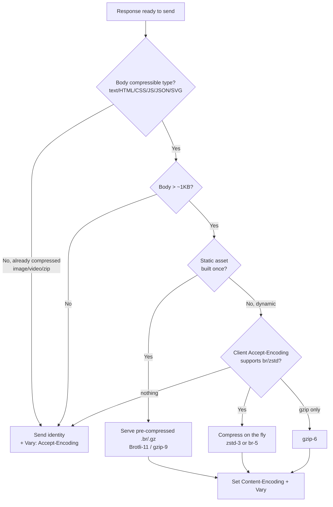

# Accept-Encoding

## Quick Summary

`Accept-Encoding` is a **request** header sent by the client (browser, `fetch`, `curl`, another service) that advertises which **content-codings** — compression algorithms applied to the response body — the client is able to decode. Typical value: `Accept-Encoding: gzip, deflate, br, zstd`. It is one half of a negotiation: the client says "I can decompress any of these," and the server picks *one* (or none), compresses the body with it, and announces its choice in the [Content-Encoding](./Content-Encoding.md) response header. The header carries optional quality values (`q=`) to express preference, supports the special tokens `identity` (no compression) and `*` (wildcard), and — crucially — every response whose body varies by the chosen encoding **must** carry `Vary: Accept-Encoding` so that shared caches ([proxies](../14-Proxies/Proxies-Overview.md), [CDNs](../15-CDNs/CDN-Caching-Overview.md)) never hand a Brotli-compressed body to a client that only understands gzip. It is an **end-to-end** request header, but the compression decision it triggers is frequently made not by your origin at all, but by a reverse proxy or CDN in front of it.

## What problem does this header solve?

Text-based web payloads — HTML, CSS, JavaScript, JSON, SVG, XML — are enormously redundant. A React bundle is thousands of repeated identifiers, whitespace, and boilerplate; a JSON API response repeats the same keys on every array element. Shipping those bytes uncompressed wastes bandwidth, inflates latency (more bytes = more round trips to fill the congestion window), and costs money (CDNs and clouds bill egress by the gigabyte). Compression routinely shrinks these payloads by **70–90%**, which is the single highest-leverage transfer optimization available.

But compression only works if the recipient can *decompress* it, and not every client supports every algorithm: a 2010-era browser knows `gzip` but not `br` (Brotli, ~2016) or `zstd` (~2021); a minimal IoT HTTP client might support nothing. If the server unconditionally Brotli-compressed every response, older or constrained clients would receive an unreadable blob. `Accept-Encoding` solves this by making compression **negotiated and opt-in per client**: the server only ever applies a coding the client explicitly said it can handle. It turns "compress everything and hope" into "compress with the best algorithm this particular client understands."

## Why was it introduced?

Content-coding negotiation appeared in **HTTP/1.1 (RFC 2068, 1997; refined in RFC 2616, 1999)**, alongside `gzip`, `compress`, and `deflate` as registered codings. `gzip` (DEFLATE in a gzip wrapper, RFC 1952) quickly became the universal default because zlib was ubiquitous and patent-free, whereas Unix `compress` (LZW) was patent-encumbered and effectively died.

The header's semantics were later consolidated into **RFC 7231 §5.3.4 (2014)** and now **RFC 9110 §12.5.3 (2022)**. The coding registry grew as new algorithms proved their worth on the wire:

- **Brotli (`br`)** — Google, standardized as **RFC 7932 (2016)**. Ships with a large built-in static dictionary tuned for web content, so it beats gzip on typical HTML/CSS/JS at equivalent CPU. Browsers restricted `br` advertisement to **HTTPS only** to avoid breakage from dumb HTTP-transparent proxies that mangle unknown codings.
- **Zstandard (`zstd`)** — Facebook/Meta, **RFC 8878 (2021)**, registered as an HTTP content-coding in **RFC 8878 / draft work**; Chrome shipped `zstd` support in 2024. Zstd's headline feature is a *dramatically* better compression-ratio-per-CPU-cycle curve, making it attractive for dynamic (on-the-fly) compression where gzip level 6 was the old compromise.

Each new coding is purely additive: clients append it to `Accept-Encoding` when they can decode it, and servers ignore codings they don't implement. The negotiation model designed in 1997 absorbed Brotli and Zstd decades later without a single protocol change — a testament to why negotiation beats hard-coding.

## How does it work?

The mechanic is a two-header handshake. Request carries `Accept-Encoding: <list>`; response carries `Content-Encoding: <one coding>` (or omits it, meaning `identity` — no compression) plus `Vary: Accept-Encoding`.

- **Browser behavior:** Browsers send `Accept-Encoding` **automatically on every request** and you cannot override it from `fetch`/`XMLHttpRequest` — it is a [forbidden header name](../02-Core-Concepts/Forbidden-and-Restricted-Headers.md), because the browser must guarantee it can decode whatever comes back (it transparently decompresses before your JS ever sees the bytes). Chrome/Edge/Firefox on HTTPS send roughly `gzip, deflate, br, zstd`; on plain HTTP they historically drop `br`. When the response arrives, the browser reads `Content-Encoding`, decompresses in the network stack, and delivers the *decoded* body to the rendering engine and to `Response.body`/`response.text()`. Your application code never sees compressed bytes.
- **Server behavior:** The origin parses the client's `Accept-Encoding`, intersects it with the codings it supports and is *willing* to apply (some content types aren't worth compressing — see below), applies the winning coding to the body, sets `Content-Encoding`, sets `Vary: Accept-Encoding`, and sets [Content-Length](../04-Response-Headers/Content-Length.md) to the **compressed** byte count (or streams it under [Transfer-Encoding: chunked](./Transfer-Encoding.md) with no length). If the client accepts nothing the server can offer, the server should return `identity` (uncompressed); returning a coding the client didn't list is a protocol violation that yields garbage. If `Accept-Encoding: identity;q=0` (or `*;q=0` with no acceptable coding) makes *every* representation unacceptable, the strictly-correct response is `406 Not Acceptable`, though in practice servers just send uncompressed.
- **Proxy behavior:** A forward proxy forwards `Accept-Encoding` untouched (it's end-to-end). A **caching** proxy must honor `Vary: Accept-Encoding` — it keys its cache on the normalized request encoding so it never serves a `br` body to a gzip-only client. Historically, broken HTTP proxies that "helpfully" stripped or corrupted unknown codings are the reason Brotli is HTTPS-only (encrypted traffic is opaque to them). Some proxies are configured to *re-compress* or *decompress-and-recompress*, which is usually a mistake (double work, potential double-compression bugs).
- **CDN behavior:** This is where compression usually *actually happens* in production. CDNs (Cloudflare, Fastly, CloudFront, Akamai) commonly compress at the edge: your origin can send uncompressed (or gzip) and the CDN normalizes `Accept-Encoding`, stores one representation per coding, and serves Brotli/gzip based on the viewer's header. CDNs deliberately **normalize** `Accept-Encoding` to a small number of buckets (e.g., "supports br", "supports gzip only", "none") to avoid cache fragmentation from the hundreds of distinct header orderings clients emit. Cloudflare, for instance, ignores the exact string and decides internally.
- **Reverse proxy behavior:** Nginx (`gzip on` / `ngx_brotli`), HAProxy, Envoy, and Apache commonly own compression, offloading it from your Node process. The reverse proxy reads `Accept-Encoding` from the client, compresses the upstream's (uncompressed) response, and adds `Content-Encoding` + `Vary`. Critically, a reverse proxy will **not** compress a response the upstream already compressed (it sees an existing `Content-Encoding`) — so decide in *one* place whether Node or Nginx compresses, never both.

## HTTP Request Example

```http
GET /assets/app.4f9a.js HTTP/1.1
Host: example.com
Accept-Encoding: zstd, br, gzip, deflate
Accept: */*
User-Agent: Mozilla/5.0 (...) Chrome/126.0 Safari/537.36
```

With explicit quality values expressing preference and an exclusion:

```http
GET /report HTTP/1.1
Host: example.com
Accept-Encoding: br;q=1.0, gzip;q=0.8, identity;q=0.5, *;q=0
```

Read this as: "Strongly prefer Brotli (q=1.0), accept gzip (q=0.8), tolerate uncompressed (q=0.5), and refuse anything else (`*;q=0`)." A missing `q` defaults to `q=1.0`. `q=0` means "explicitly not acceptable."

## HTTP Response Example

Server chose Brotli:

```http
HTTP/1.1 200 OK
Content-Type: application/javascript; charset=utf-8
Content-Encoding: br
Vary: Accept-Encoding
Content-Length: 32118
Cache-Control: public, max-age=31536000, immutable

<32118 bytes of Brotli-compressed JavaScript>
```

Server chose not to compress (small body, or already-compressed content type):

```http
HTTP/1.1 200 OK
Content-Type: image/png
Vary: Accept-Encoding
Content-Length: 40213

<raw PNG bytes — no Content-Encoding, PNG is already compressed>
```

Note that even when the server sends `identity`, keeping `Vary: Accept-Encoding` is correct and harmless: it tells caches the *representation could* have varied by encoding.

## Express.js Example

The canonical approach is the official [`compression`](https://github.com/expressjs/compression) middleware. It reads `Accept-Encoding`, picks a coding, wraps `res.write`/`res.end` to compress the stream, and sets `Content-Encoding` + `Vary` for you.

```js
const express = require('express');
const compression = require('compression');

const app = express();

app.use(compression({
  // Only compress bodies larger than this many bytes. Below the TCP MSS
  // (~1400B) compression can make the payload BIGGER (headers + framing
  // overhead) and wastes CPU. 1KB is a sane floor. Remove -> you gzip
  // 12-byte JSON error bodies for no benefit.
  threshold: 1024,

  // Compression effort, 0 (none) - 9 (max). 6 is zlib's default: the
  // knee of the ratio/CPU curve. Level 9 costs ~2x CPU for ~1% smaller
  // output on typical text -> not worth it for DYNAMIC responses. Raise
  // to 9 only for pre-compressed static assets you build once.
  level: 6,

  // Per-request opt-out hook. Return false to skip compression for this
  // response entirely. We honor the de-facto "x-no-compression" escape
  // hatch AND delegate to the library's default heuristic (which skips
  // already-compressed content types and respects Cache-Control: no-transform).
  filter(req, res) {
    if (req.headers['x-no-compression']) return false;
    return compression.filter(req, res);
  },
}));

// A representative text response — highly compressible JSON.
app.get('/api/products', (req, res) => {
  // We do NOT set Content-Encoding or Vary ourselves. The middleware
  // detects a compressible Content-Type, reads Accept-Encoding, and sets
  // both. Setting them manually here would double up / conflict.
  res.json({ products: buildLargeCatalog() });
});

app.listen(3000);
```

Why each piece matters:

- **`threshold: 1024`** — Compression has fixed overhead (gzip adds ~18 bytes of header/trailer, plus the CPU to run DEFLATE). For a 200-byte JSON error, the compressed result is often *larger* and always slower. Removing this means you pay CPU to inflate tiny responses.
- **`level: 6`** — `compression` compresses **on the fly, per request**, so CPU is spent on the hot path. Level 9 roughly doubles CPU for a marginal size win; under load that CPU is your throughput ceiling. This is exactly why high-traffic sites *pre-compress* static assets at build time (level 11 Brotli / level 9 gzip, paid once) and let the origin serve those files directly — see the Node example.
- **`filter`** — The default `compression.filter` uses the [`mime-db` compressible table](https://github.com/jshttp/mime-db) to skip content types that are already compressed (JPEG, PNG, MP4, `application/zip`). Re-compressing them wastes CPU and can slightly *inflate* them. It also respects `Cache-Control: no-transform`, which is the standard "do not recompress me" signal. The `x-no-compression` check is a manual escape hatch (useful for debugging or for endpoints where you compress the body yourself).

**Ordering gotcha:** `compression` wraps the response stream, so it must be registered **before** any route that writes a body. Also note the well-known interaction with **Server-Sent Events / streaming**: buffering compression can delay flushing individual events. `compression` handles this by flushing on `res.flush()`, but if you stream, either disable compression for that route (`x-no-compression`) or call `res.flush()` after each event. Node's [`zlib.Z_SYNC_FLUSH`](https://nodejs.org/api/zlib.html) is what makes this work.

**Note:** `compression` currently ships **gzip and deflate only**. For Brotli/Zstd from Express you either upgrade to a middleware that supports them (`shrink-ray-current`, or `@fastify/compress` on Fastify), or — the recommended production pattern — **let Nginx/Cloudflare do Brotli** and keep Node out of the compression business entirely.

## Node.js Example

Raw `http` + `zlib`, doing negotiation by hand. This is what the middleware does under the hood and is worth seeing once.

```js
const http = require('http');
const zlib = require('zlib');

// Parse Accept-Encoding into a preference-ordered list, honoring q-values.
function parseAcceptEncoding(header = '') {
  return header
    .split(',')
    .map((part) => {
      const [coding, ...params] = part.trim().split(';');
      const qParam = params.find((p) => p.trim().startsWith('q='));
      const q = qParam ? parseFloat(qParam.split('=')[1]) : 1.0; // default q=1
      return { coding: coding.trim().toLowerCase(), q };
    })
    .filter((e) => e.coding && !Number.isNaN(e.q))
    .sort((a, b) => b.q - a.q); // highest preference first
}

// Choose the best coding WE support that the client accepts with q>0.
function chooseEncoding(acceptEncoding) {
  const prefs = parseAcceptEncoding(acceptEncoding);
  const supported = ['br', 'gzip', 'deflate']; // our capability, best-first
  for (const { coding, q } of prefs) {
    if (q <= 0) continue;                     // q=0 = explicitly refused
    if (coding === '*') {                     // wildcard: pick our best
      const first = supported.find((s) =>
        !prefs.some((p) => p.coding === s && p.q <= 0));
      if (first) return first;
    }
    if (supported.includes(coding)) return coding; // exact match, honored by pref order
  }
  return 'identity'; // nothing matched -> send raw
}

const server = http.createServer((req, res) => {
  const body = Buffer.from(JSON.stringify({ hello: 'world', data: bigArray() }));
  const encoding = chooseEncoding(req.headers['accept-encoding']);

  // ALWAYS advertise that the body varies by Accept-Encoding, even for
  // identity — otherwise a shared cache could serve a br body to a
  // gzip-only client (or vice versa). This single header is the most
  // commonly forgotten and most dangerous omission in manual compression.
  res.setHeader('Vary', 'Accept-Encoding');
  res.setHeader('Content-Type', 'application/json');

  if (encoding === 'identity') {
    res.setHeader('Content-Length', body.length); // uncompressed length
    return res.end(body);
  }

  // Content-Encoding announces the coding the client must reverse.
  res.setHeader('Content-Encoding', encoding);

  const compressor =
    encoding === 'br'   ? zlib.createBrotliCompress()
  : encoding === 'gzip' ? zlib.createGzip()
  :                       zlib.createDeflate();

  // We STREAM the compressed output, so we do NOT know Content-Length up
  // front. Node will use Transfer-Encoding: chunked automatically. If you
  // need Content-Length (e.g. for a CDN that won't cache chunked), compress
  // into a buffer first with zlib.gzipSync/brotliCompressSync and set it.
  compressor.pipe(res);
  compressor.end(body);
});

server.listen(3000);
```

The load-bearing details:

- **q-value parsing** — `Accept-Encoding: gzip;q=0.5, br` must prefer `br` (implicit q=1) over gzip. Getting the default-to-1.0 rule wrong silently ships the worse algorithm.
- **`q=0` handling** — `identity;q=0` means the client refuses uncompressed; `br;q=0` means "I decode br but don't want it here." Ignoring `q=0` can send a body the client explicitly rejected.
- **`Vary` set unconditionally** — see the inline comment; this is the correctness linchpin for caches.
- **`Content-Length` reflects compressed size** — when you buffer. When you stream, you omit it and Node chunks. Never set `Content-Length` to the *uncompressed* size alongside a `Content-Encoding` — the client reads too few or too many bytes and the connection breaks.

For one-shot buffered compression: `zlib.gzipSync(body)`, `zlib.brotliCompressSync(body, { params: { [zlib.constants.BROTLI_PARAM_QUALITY]: 11 } })` — quality 11 is Brotli's max, appropriate only for build-time asset compression.

## React Example

React (and the browser generally) is a **pure consumer** here — it never sets `Accept-Encoding` and never decompresses. The browser's network layer sends the header and transparently decodes the response *before* `fetch` resolves:

```jsx
// The browser attaches Accept-Encoding automatically. You literally CANNOT
// set it — it's a forbidden header. This line is silently ignored by spec:
async function load() {
  const res = await fetch('/api/products', {
    headers: { 'Accept-Encoding': 'br' }, // <-- IGNORED by the browser
  });
  // res.body is ALREADY decompressed. There is no compressed-bytes API.
  const data = await res.json();
  return data;
}
```

Where React engineers actually interact with this header:

1. **Build-time pre-compression.** Your bundler is the real player. A Vite/webpack plugin emits `app.js`, `app.js.br`, and `app.js.gz` at build time using max-effort Brotli/gzip, so the server serves a file whose compression was paid for *once*, not per request.

   ```js
   // vite.config.js — pre-compress the production bundle
   import viteCompression from 'vite-plugin-compression';
   export default {
     plugins: [
       viteCompression({ algorithm: 'brotliCompress', ext: '.br' }),
       viteCompression({ algorithm: 'gzip', ext: '.gz' }),
     ],
   };
   ```

   The server (Nginx `gzip_static on; brotli_static on;`, or `express.static` with a static-gzip middleware) then reads `Accept-Encoding`, and if the client supports `br` and an `app.js.br` exists, serves that file directly with `Content-Encoding: br`. No runtime compression at all.

2. **SSR responses (Next.js, Remix, custom Node SSR).** The HTML stream your React server renders is compressed by the same origin/proxy machinery as any other response. For streaming SSR (`renderToPipeableStream`), the streaming-vs-buffering-compression flush concern from the Express section applies: you want `Z_SYNC_FLUSH` behavior so the shell arrives before the whole document is rendered.

## Browser Lifecycle

1. **Request construction.** For *every* outgoing request (navigation, subresource, `fetch`, `XHR`), the browser's network stack injects `Accept-Encoding` from its built-in capability list. On HTTPS: typically `gzip, deflate, br, zstd` (Chrome 2024+). On plain HTTP, Brotli/Zstd may be omitted. Application JS cannot read or modify it.
2. **Transit.** The header travels end-to-end. Intermediaries may cache-key on it (via `Vary`) or, at a CDN, normalize it.
3. **Response arrival.** The stack reads `Content-Encoding`. If present and recognized, it pipes the body through the matching decompressor (a streaming inflate/brotli-decode) *inside the network process*.
4. **Delivery.** The **decompressed** bytes are handed to the HTML parser / image decoder / `Response` object. `response.headers.get('content-encoding')` still shows `br`, but `response.text()` gives you decoded text and `Content-Length` (if present) reflects the *compressed* size — a frequent source of "why is `contentLength !== body.length`" confusion.
5. **Cache storage.** The browser's HTTP cache stores the response keyed with `Vary: Accept-Encoding` in mind, so a later request with the same `Accept-Encoding` reuses it.
6. **Error path.** If `Content-Encoding` names a coding the browser can't decode, or the body is corrupt/mis-declared (e.g., server said `gzip` but sent raw), the browser raises `ERR_CONTENT_DECODING_FAILED` and the resource fails to load — a hard failure, not a graceful fallback.

## Production Use Cases

- **Static asset delivery.** Pre-compress JS/CSS/HTML/SVG with Brotli-11 and gzip-9 at build time; serve `.br`/`.gz` variants via `Content-Encoding` negotiation. This is the highest-ROI use: max compression, zero per-request CPU.
- **JSON API responses.** Compress large list/detail payloads on the fly (gzip-6 or zstd) at the reverse proxy or via `compression`. A 400KB JSON catalog drops to ~40KB — a 10x transfer win that dominates the small CPU cost.
- **CDN edge compression.** Origin serves uncompressed or gzip; the CDN Brotli-compresses at the edge and caches per-encoding. Offloads CPU from origin and puts the compressed bytes physically close to users.
- **Server-Sent Events / log streaming.** Compress long-lived text streams with sync-flush so each event ships immediately while still benefiting from compression.
- **Mobile / high-latency networks.** The bytes saved translate directly into fewer round trips to fill the congestion window — compression's latency benefit is largest exactly where users are least tolerant.

## Common Mistakes

- **Forgetting `Vary: Accept-Encoding`.** The cardinal sin. A shared cache stores whichever variant it saw first and serves it to everyone — gzip clients get Brotli garbage (`ERR_CONTENT_DECODING_FAILED`) or vice versa. Always emit `Vary: Accept-Encoding` on any response whose body depends on the coding.
- **Double compression.** Node's `compression` middleware *and* Nginx *and* the CDN all trying to compress. Best case wasted CPU; worst case a body compressed twice (e.g., `Content-Encoding: gzip` applied to already-gzip'd bytes) that clients can't decode because they reverse only one layer. Decide in exactly one hop.
- **Compressing already-compressed content.** gzip'ing JPEG/PNG/MP4/PDF/ZIP wastes CPU and can *grow* the payload. Rely on the compressible MIME table; don't `gzip on` everything.
- **Compressing tiny responses.** Below ~1KB, overhead exceeds savings. Use a `threshold`.
- **Setting `Content-Length` to the uncompressed size.** With a `Content-Encoding` present, `Content-Length` must be the *compressed* byte count. Mismatch = truncated or hung responses.
- **Assuming `fetch` can request a specific coding.** It can't; the browser owns `Accept-Encoding`. Server-side clients (Node, curl) *can* set it — and if you set it manually in Node you become responsible for decompressing manually (many HTTP libraries won't auto-decode a coding you asked for out of band).
- **The BREACH/CRIME class of bug** — compressing responses that mix secrets with attacker-controlled input over HTTPS (see Security).

## Security Considerations

- **CRIME (2012) / BREACH (2013).** These attacks exploit the fact that compression ratio *leaks information about content*. If a response body contains both a **secret** (a CSRF token, session identifier) and **attacker-influenced reflected input**, an attacker who can observe the *compressed length* of many responses can, by guessing the secret one character at a time and watching the compressed size shrink when their guess matches (because compression dedupes the repeated substring), recover the secret. BREACH targets HTTP response compression specifically. Mitigations: (1) don't reflect user input into responses that also contain secrets; (2) put secrets in headers/cookies rather than bodies where feasible; (3) randomize response length (padding); (4) rate-limit and monitor; (5) use CSRF tokens that rotate. **Do not** respond by disabling compression globally — that throws away the 90% bandwidth win to defend a narrow, specific pattern. Instead, disable compression selectively on responses that combine secrets + reflected input, or ensure they never coexist.
- **Zip/decompression bombs (server-side).** If your server *decompresses* request bodies (a client sending `Content-Encoding: gzip` on an upload), a tiny malicious payload can expand to gigabytes and exhaust memory. Always cap the decompressed size. (This is a [Content-Encoding](./Content-Encoding.md) concern in depth, but relevant here because `Accept-Encoding` on the *response* has a mirror in request-body compression.)
- **`Content-Encoding` mismatch DoS.** Declaring a coding you didn't actually apply crashes clients with decode errors — a self-inflicted outage more than an attack, but a reason to keep compression logic in one well-tested place.
- **HTTPS-only Brotli** exists precisely because plaintext intermediaries corrupting unknown codings was a real security/reliability problem.

## Performance Considerations

- **The ratio/CPU tradeoff is the whole game.** gzip-6 ≈ default balance. Brotli beats gzip on ratio at comparable CPU for *static* content (thanks to its dictionary), but Brotli-11 is very slow — fine offline, unacceptable per request. Zstd offers the best ratio-per-CPU for *dynamic* compression and is the modern choice where supported.
- **Pre-compress static, on-the-fly dynamic.** Static assets: compress once at max effort at build time. Dynamic responses: compress on the fly at a moderate level (gzip-4..6 / zstd-3), and cache the compressed result at the CDN so you pay CPU once per cache generation, not per request.
- **Compression can *reduce* latency, not just bytes.** Fewer bytes fit in fewer TCP segments; the response completes in fewer round trips, which matters most on high-RTT links. This is why compressing even already-small-but-above-threshold text is worthwhile.
- **Don't compress below the MSS.** A payload that fits in one packet uncompressed gains nothing from compression and costs CPU.
- **CPU offload.** Moving compression to Nginx/CDN frees your event loop; Node's single-threaded model means synchronous `gzipSync` on a large body *blocks all other requests*. Use the async streaming APIs or offload entirely.

## Reverse Proxy Considerations

Nginx with gzip and Brotli (via `ngx_brotli`):

```nginx
# --- gzip (built in) ---
gzip on;
gzip_comp_level 5;                 # moderate; per-request CPU on the proxy
gzip_min_length 1024;              # don't compress tiny bodies
gzip_proxied any;                  # compress even when serving as a proxy
gzip_vary on;                      # emit "Vary: Accept-Encoding" automatically
gzip_types text/plain text/css application/json application/javascript
           application/xml image/svg+xml;  # ONLY compressible types; never images/video

# --- Brotli (ngx_brotli module) ---
brotli on;
brotli_comp_level 5;               # on-the-fly level; keep moderate
brotli_types text/plain text/css application/json application/javascript
             application/xml image/svg+xml;

# --- pre-compressed static files (the real win) ---
gzip_static on;                    # serve app.js.gz if it exists + client accepts gzip
brotli_static on;                  # serve app.js.br if it exists + client accepts br
```

- **`gzip_vary on`** is non-negotiable for cache correctness — it adds `Vary: Accept-Encoding`.
- **`*_static on`** makes Nginx serve your build-time pre-compressed files with zero runtime CPU; this is where max-effort Brotli-11 pays off.
- **Never enable proxy compression AND app compression.** If Node already sent `Content-Encoding`, Nginx sees it and skips (good), but keep the intent explicit: pick one layer.
- **`proxy_set_header Accept-Encoding ""`** is sometimes used to force the upstream to send uncompressed so Nginx (or a downstream cache/ESI processor) can read/modify the body — a deliberate pattern for edge-side includes.

## CDN Considerations

- **Normalization.** CDNs collapse the wild variety of `Accept-Encoding` strings into a few canonical buckets to prevent cache fragmentation. Cloudflare largely ignores the raw string and decides internally; Fastly lets you normalize via VCL (`set req.http.Accept-Encoding = "gzip";`); CloudFront has explicit "compress objects automatically" plus you must whitelist `Accept-Encoding` in the cache policy for it to compress and cache per-encoding.
- **Edge Brotli.** Most CDNs Brotli-compress at the edge regardless of what the origin sent, and cache per coding. Let them: origin sends gzip or identity, CDN upgrades to Brotli for capable clients.
- **`Vary: Accept-Encoding` interaction.** With CDN normalization, the CDN manages variants internally; you still send `Vary: Accept-Encoding` so any *downstream* (browser, corporate proxy) cache stays correct. Beware `Vary: *` or over-broad `Vary` values that make content effectively uncacheable at the edge.
- **Pre-compressed origin files** — some CDNs will pass through your `.br` origin file; others prefer to compress themselves. Check whether your CDN honors origin `Content-Encoding` or re-does it.

## Cloud Deployment Considerations

- **AWS.** CloudFront: enable automatic compression and include `Accept-Encoding` in the cache policy (normalized). ALB/API Gateway: API Gateway has a "minimum compression size" setting to gzip responses; Lambda behind API Gateway can return compressed bodies but must set `Content-Encoding` and (for binary) base64-encode. ALB itself does not compress — put a CDN in front or compress in the app.
- **GCP.** Cloud CDN compresses dynamically at the edge; Cloud Load Balancing does not compress — compress in the backend or rely on Cloud CDN.
- **Azure.** Front Door / CDN support compression with a configurable MIME allow-list and size range.
- **Managed platforms.** Vercel and Netlify compress (Brotli/gzip) automatically at their edge; you generally should *not* also compress in your function, to avoid double compression. Cloudflare Pages/Workers compress at the edge.
- **Serverless caveat.** In Lambda/Cloud Functions, on-the-fly compression burns billable CPU-ms *and* the platform edge often compresses anyway — usually cheaper to let the edge do it and return uncompressed from the function.

## Debugging

- **Chrome DevTools:** Network tab → a request → Headers shows the sent `Accept-Encoding` and the received `Content-Encoding`. The "Size" column shows *transferred* (compressed) over *resource* (decompressed) size — the ratio is your compression payoff. Right-click column header → enable "Content-Encoding" column to see it at a glance.
- **curl:** `curl -sv -H 'Accept-Encoding: br, gzip' https://example.com/app.js -o /dev/null` shows the request/response headers. Use `curl --compressed https://example.com/` to have curl advertise codings *and* auto-decompress. To confirm what the server actually sent, omit `--compressed` and inspect: `curl -sD - -H 'Accept-Encoding: gzip' https://example.com/ -o body.gz` then `file body.gz` / `gunzip -c body.gz`.
- **Verify the negotiation:** `curl -H 'Accept-Encoding: gzip' ...` vs `curl -H 'Accept-Encoding: br' ...` and confirm `Content-Encoding` flips accordingly and `Vary: Accept-Encoding` is present in both.
- **Postman / Bruno:** Both send `Accept-Encoding` and auto-decompress by default; check the response headers panel for `Content-Encoding`. Bruno lets you toggle "send Accept-Encoding" in settings — useful to test the identity path.
- **Node:** `require('http').get({ ..., headers: { 'accept-encoding': 'gzip' } }, res => console.log(res.headers['content-encoding']))` — remember Node does **not** auto-decompress; you must pipe through `zlib.createGunzip()` yourself.
- **Express logging:** log `req.headers['accept-encoding']` and, after the response, `res.getHeader('content-encoding')` to confirm the middleware's choice. If `content-encoding` is always undefined, check `threshold`, the `filter`, and that the route runs *after* `app.use(compression())`.
- **Common failure signature:** `ERR_CONTENT_DECODING_FAILED` in the browser = the declared coding doesn't match the actual bytes (double compression, mislabeled body, or a proxy that recompressed).

## Best Practices

- Compress all text-based responses above ~1KB; never compress already-compressed binaries.
- Always emit `Vary: Accept-Encoding` on anything whose body varies by coding.
- Pre-compress static assets at max effort (Brotli-11 + gzip-9) at build time; compress dynamic responses at a moderate level on the fly.
- Compress in exactly **one** hop (app *or* reverse proxy *or* CDN) — never stacked.
- Prefer Brotli for capable clients, gzip as the universal fallback, `identity` when nothing else fits.
- Never manually set `Accept-Encoding` from browser JS (ignored); when you set it in a server-side client, own the decompression too.
- Keep `Content-Length` consistent with the *compressed* body, or omit it and stream chunked.
- Selectively disable compression on responses that mix secrets with reflected user input (BREACH), not globally.
- Let the edge (CDN/managed platform) compress in serverless deployments to save billable CPU.

## Related Headers

- **[Content-Encoding](./Content-Encoding.md)** — the response header that answers `Accept-Encoding`; names the coding actually applied. The negotiation's other half.
- **[Vary](../06-Caching-Headers/Vary.md)** — `Vary: Accept-Encoding` is mandatory for cache correctness whenever the body varies by coding.
- **[Transfer-Encoding](./Transfer-Encoding.md)** — often confused with content-coding. `Transfer-Encoding: gzip` is *hop-by-hop* body framing; `Accept-Encoding`/`Content-Encoding` are *end-to-end* representation codings. Different layer entirely.
- **[Accept](../03-Request-Headers/Accept.md)** / **[Accept-Language](../03-Request-Headers/Accept-Language.md)** — sibling proactive-negotiation request headers; same `q`-value grammar. See [Content Negotiation Overview](../11-Content-Negotiation/Content-Negotiation-Overview.md).
- **[Content-Length](../04-Response-Headers/Content-Length.md)** — reflects the *compressed* size when a coding is applied.
- **[Cache-Control](../06-Caching-Headers/Cache-Control.md)** — `no-transform` tells intermediaries not to recompress; interacts with `Accept-Encoding`.

## Decision Tree



Then ask: *Is compression already happening at the CDN or reverse proxy?* If yes, don't also compress in the app.

## Mental Model

**`Accept-Encoding` is a customs declaration in reverse: the client stamps its passport with "I can read these languages" and the server writes its reply in the best language on that list.** The client lists the dialects it speaks (`gzip, br, zstd`), ranked by preference (`q`). The server picks one it also speaks, writes the letter in that dialect, and stamps the envelope with which dialect it used (`Content-Encoding`) plus a note to every post office along the way — "this letter's language depends on the reader, file it accordingly" (`Vary: Accept-Encoding`). The reader's *mailroom* (the browser's network stack) translates back to plain text before handing it up; the reader never sees the coded form. Get the "file it accordingly" note wrong, and the post office hands a Brotli letter to someone who only reads gzip — gibberish.
