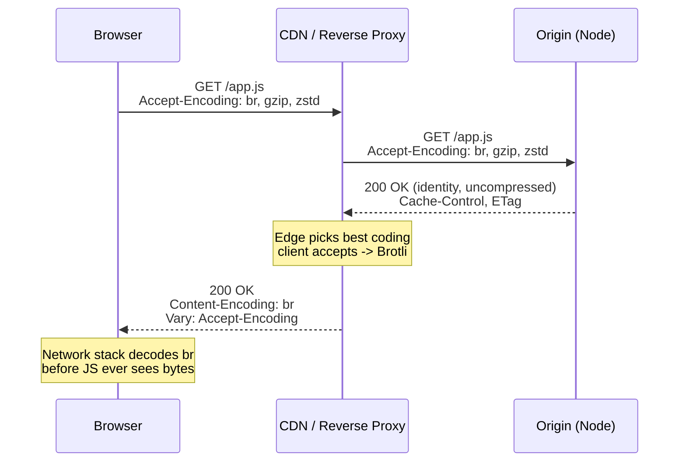
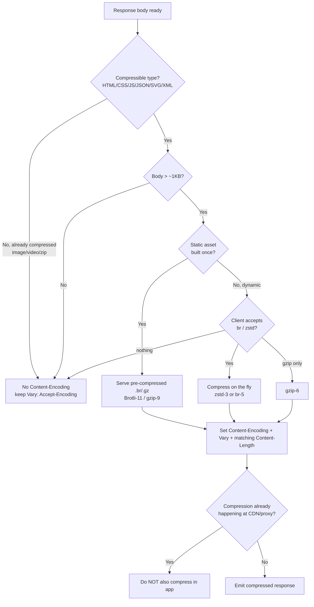

# Content-Encoding

## Quick Summary

`Content-Encoding` is a **response** header (and, less commonly, a request header on bodies you `POST`/`PUT`) that names the **content-coding** — the compression algorithm — that has been applied to the message body, in the order it was applied. Typical value: `Content-Encoding: br`. It is the server's half of the compression handshake begun by the client's [`Accept-Encoding`](./Accept-Encoding.md): the client advertises the codings it can decode, the server picks exactly one it supports, compresses the body, and stamps `Content-Encoding` with its choice so the recipient knows which transform to reverse. Common values are `gzip`, `br` (Brotli), `deflate`, and `zstd` (Zstandard). Crucially, `Content-Encoding` is a property of the **representation** — it is *end-to-end*, travels unchanged to the final recipient, and is part of what [`ETag`](../06-Caching-Headers/ETag.md) identifies and what [`Vary: Accept-Encoding`](../06-Caching-Headers/Vary.md) protects in caches. It is fundamentally different from [`Transfer-Encoding`](./Transfer-Encoding.md), which is *hop-by-hop* framing. Getting `Content-Encoding` wrong — mismatched with the actual bytes, applied twice, or served without `Vary` — produces the hard browser failure `ERR_CONTENT_DECODING_FAILED`.

## What problem does this header solve?

Once a server has *decided* to compress a body, the recipient faces an obvious problem: **compressed bytes are unintelligible unless you know how to decompress them.** A Brotli-compressed JavaScript file and a gzip-compressed one and the raw source are three different byte streams for the same logical content. The recipient needs an unambiguous, in-band signal saying "these bytes have been run through algorithm X; reverse X before parsing." `Content-Encoding` is that signal.

Without it, the client would have to *guess* — sniff magic bytes, try each decompressor, or assume a coding — all of which are fragile and insecure. With it, the contract is explicit and self-describing: the server states exactly which transform(s) it applied and in what order, and the client mechanically reverses them. This is what makes the 70–90% size reduction of text compression *safe* to deploy: the negotiation ([`Accept-Encoding`](./Accept-Encoding.md)) guarantees the client *can* decode the coding, and `Content-Encoding` tells it *which* one to use.

It also draws a clean line between two different notions of "the body." `Content-Encoding` describes a transform that is intrinsic to the resource's *representation* — the compressed form is still "the resource," it just needs decoding. That is why it is end-to-end (every hop and the final client see the same coding) and why caches must key on it. Contrast [`Transfer-Encoding`](./Transfer-Encoding.md), which describes how a *single hop* framed the bytes on the wire and is stripped before the next hop.

## Why was it introduced?

Content-coding negotiation arrived with **HTTP/1.1 (RFC 2068, 1997; refined in RFC 2616, 1999)**, which registered `gzip`, `compress`, and `deflate` as content-codings and defined the `Content-Encoding` response header to name them. `gzip` (the DEFLATE algorithm wrapped in the gzip container format, RFC 1952) became the near-universal default: zlib was everywhere, fast, and unencumbered by patents. Unix `compress` (LZW) was patent-burdened and effectively died on the web. `deflate` — nominally the raw zlib/DEFLATE stream — became a footgun because early servers disagreed on whether to send the raw DEFLATE stream (RFC 1951) or the zlib-wrapped one (RFC 1950), so some clients reject one form; **gzip is preferred over `deflate` for interoperability to this day.**

The semantics were consolidated into **RFC 7231 §3.1.2.2 (2014)** and now **RFC 9110 §8.4 (2022)**. The coding registry grew as better algorithms proved themselves on the wire:

- **Brotli (`br`)** — Google, **RFC 7932 (2016)**. Ships a large built-in static dictionary tuned for web text, so at comparable CPU it beats gzip on typical HTML/CSS/JS. Browsers restrict `br` advertisement to **HTTPS** to dodge breakage from HTTP-transparent proxies that mangle unknown codings.
- **Zstandard (`zstd`)** — Meta, **RFC 8878 (2021)**; Chrome shipped HTTP `zstd` support in 2024. Its headline property is a dramatically better compression-ratio-per-CPU-cycle curve, making it the modern choice for on-the-fly (dynamic) compression where gzip level 6 was the historic compromise.

The design is purely additive: servers ignore codings they don't implement, clients append codings they can decode, and the 1997 negotiation model absorbed Brotli and Zstd decades later with zero protocol changes.

## How does it work?

The mechanic is a two-header handshake. The request carries [`Accept-Encoding: <list>`](./Accept-Encoding.md); the response carries `Content-Encoding: <coding>` (or omits it, meaning `identity` — no compression) plus [`Vary: Accept-Encoding`](../06-Caching-Headers/Vary.md). The coding named by `Content-Encoding` is the transform the recipient must **reverse** to recover the original bytes. Multiple codings may be listed comma-separated in application order (e.g. `Content-Encoding: gzip, br` means "brotli was applied last, so decode brotli first, then gzip") — but in practice stacking codings is rare and usually a bug.



- **Browser behavior:** The browser reads `Content-Encoding` from the response, pipes the body through the matching decompressor **inside the network process**, and hands the *decoded* bytes to the parser, image decoder, or `Response` object. Your application code never sees compressed bytes; `response.text()` returns decoded text even though `response.headers.get('content-encoding')` still reads `br`. If the named coding is one the browser can't decode, or the bytes don't actually match the declared coding (server said `gzip` but sent raw), the browser raises **`ERR_CONTENT_DECODING_FAILED`** — a hard failure, no graceful fallback.
- **Server behavior:** The origin decides *whether* to compress (based on content type, body size, and CPU budget), intersects its supported codings with the client's `Accept-Encoding`, applies exactly one winning coding, sets `Content-Encoding`, sets `Vary: Accept-Encoding`, and sets [`Content-Length`](../04-Response-Headers/Content-Length.md) to the **compressed** byte count (or omits it and streams under [`Transfer-Encoding: chunked`](./Transfer-Encoding.md)). It must never declare a coding it didn't actually apply.
- **Proxy behavior:** Because `Content-Encoding` is end-to-end, a forwarding proxy passes it through untouched. A **caching** proxy must honor `Vary: Accept-Encoding` so it never hands a Brotli body to a gzip-only client. A misconfigured proxy that decompresses-then-recompresses is doing wasted, error-prone work and risks double-compression bugs.
- **CDN behavior:** In production the CDN is frequently where compression *actually happens*. The origin sends uncompressed (or gzip); the CDN stores one representation per coding and serves Brotli/gzip based on the viewer's normalized `Accept-Encoding`, setting `Content-Encoding` itself. CDNs normalize `Accept-Encoding` into a few buckets to avoid cache fragmentation, and they treat the compressed form as a distinct cache variant.
- **Reverse proxy behavior:** Nginx (`gzip on` / `ngx_brotli`), HAProxy, Envoy, and Apache commonly own compression and set `Content-Encoding`, offloading it from your Node process. A reverse proxy will **not** re-compress a response that already carries `Content-Encoding` from upstream (good), which is exactly why you must pick *one* layer to compress in.

## HTTP Request Example

`Content-Encoding` is overwhelmingly a *response* header, but it is legal and occasionally used on **request** bodies — a client uploading a large compressed payload:

```http
POST /api/import HTTP/1.1
Host: api.example.com
Content-Type: application/json
Content-Encoding: gzip
Content-Length: 8241

<8241 bytes of gzip-compressed JSON>
```

Here the *client* has compressed the upload; the *server* must be prepared to decompress it (and must guard against decompression bombs — see Security). Note the paired request-negotiation header is different: the response's coding is negotiated via [`Accept-Encoding`](./Accept-Encoding.md), but a request body's coding is not negotiated at all — the client just declares it and hopes the server supports it, since there is no standard "which codings do you accept on uploads?" header.

## HTTP Response Example

Server chose Brotli for a JS bundle:

```http
HTTP/1.1 200 OK
Content-Type: application/javascript; charset=utf-8
Content-Encoding: br
Vary: Accept-Encoding
Content-Length: 32118
ETag: "9f2c-br-a1b2c3"
Cache-Control: public, max-age=31536000, immutable

<32118 bytes of Brotli-compressed JavaScript>
```

Server declined to compress an already-compressed media type — no `Content-Encoding` at all, which means `identity`:

```http
HTTP/1.1 200 OK
Content-Type: image/png
Vary: Accept-Encoding
Content-Length: 40213

<raw PNG bytes — PNG is already DEFLATE-compressed internally>
```

Keeping `Vary: Accept-Encoding` even on the `identity` response is correct and harmless — it tells caches the representation *could* have varied by coding.

## Express.js Example

The canonical approach is the official [`compression`](https://github.com/expressjs/compression) middleware, which reads `Accept-Encoding`, picks a coding, wraps the response stream, and sets `Content-Encoding` + `Vary` for you.

```js
const express = require('express');
const compression = require('compression');
const app = express();

app.use(compression({
  // Below ~1KB the gzip header/trailer (~18 bytes) plus framing overhead can
  // make the body BIGGER, and you pay CPU for nothing. 1KB is a sane floor.
  threshold: 1024,

  // 0 (none) .. 9 (max). 6 is zlib's default — the knee of the ratio/CPU
  // curve. Level 9 costs ~2x CPU for ~1% smaller output on text, which is a
  // bad trade for DYNAMIC per-request compression. Raise to 9 only for
  // static assets you compress ONCE at build time.
  level: 6,

  // Per-response opt-out. compression.filter uses the mime-db "compressible"
  // table to SKIP already-compressed types (JPEG/PNG/MP4/zip) and respects
  // Cache-Control: no-transform. We add a manual escape hatch for debugging
  // and for streaming endpoints (SSE) where buffering compression stalls events.
  filter(req, res) {
    if (req.headers['x-no-compression']) return false;
    return compression.filter(req, res);
  },
}));

// A highly compressible JSON response. We deliberately do NOT set
// Content-Encoding or Vary ourselves — the middleware detects a compressible
// Content-Type, reads Accept-Encoding, applies the coding, and sets BOTH.
// Setting them by hand here would double up and conflict with the middleware.
app.get('/api/products', (req, res) => {
  res.json({ products: buildLargeCatalog() }); // ~400KB -> ~40KB gzip'd
});

app.listen(3000);
```

Why each piece is load-bearing:

- **`threshold: 1024`** — remove it and you gzip 12-byte error bodies, inflating them and wasting CPU on the hot path.
- **`level: 6`** — `compression` runs DEFLATE *per request* on the event loop. Under load, CPU is your throughput ceiling; level 9 buys almost nothing for double the cost. This is precisely why high-traffic sites pre-compress static assets at build time (Brotli-11 / gzip-9, paid once) and serve those files directly.
- **`filter`** — skipping the compressible check would re-compress JPEGs and MP4s, wasting CPU and slightly *growing* them; honoring `Cache-Control: no-transform` is the standard "do not recompress me" signal.

**Ordering gotcha:** `compression` wraps `res.write`/`res.end`, so it must be registered **before** any route that writes a body. **Streaming gotcha (SSE):** buffering compression delays flushing individual events; `compression` flushes on `res.flush()` (via `zlib.Z_SYNC_FLUSH`), so for a stream either disable compression for that route (`x-no-compression`) or call `res.flush()` after each event.

**Algorithm coverage:** `compression` currently ships **gzip and deflate only**. For Brotli/Zstd from Node you either use a middleware that supports them (`shrink-ray-current`, or `@fastify/compress` on Fastify) or — the recommended production pattern — let **Nginx/Cloudflare do Brotli** and keep Node out of the compression business.

## Node.js Example

Raw `http` + `zlib`, choosing a coding by hand and streaming the compressed output. This is what the middleware does under the hood:

```js
const http = require('http');
const zlib = require('zlib');

http.createServer((req, res) => {
  const body = Buffer.from(JSON.stringify({ hello: 'world', data: bigArray() }));
  const accepts = req.headers['accept-encoding'] || '';

  // ALWAYS advertise that the body varies by Accept-Encoding — even for
  // identity. Omit this and a shared cache can serve a br body to a gzip-only
  // client. This is the single most-forgotten, most-dangerous omission.
  res.setHeader('Vary', 'Accept-Encoding');
  res.setHeader('Content-Type', 'application/json');

  // Pick the best coding WE support that the client accepts. (Real code should
  // parse q-values; simplified here — see Accept-Encoding.md for full parsing.)
  let encoding = 'identity';
  if (/\bbr\b/.test(accepts)) encoding = 'br';
  else if (/\bgzip\b/.test(accepts)) encoding = 'gzip';
  else if (/\bdeflate\b/.test(accepts)) encoding = 'deflate';

  if (encoding === 'identity') {
    res.setHeader('Content-Length', body.length); // uncompressed length is known
    return res.end(body);
  }

  // Content-Encoding names the transform the client must REVERSE. It must match
  // the bytes we actually emit, or the browser throws ERR_CONTENT_DECODING_FAILED.
  res.setHeader('Content-Encoding', encoding);

  const compressor =
      encoding === 'br'   ? zlib.createBrotliCompress()
    : encoding === 'gzip' ? zlib.createGzip()
    :                       zlib.createDeflate();

  // We STREAM the compressed output, so Content-Length is unknown up front —
  // Node emits Transfer-Encoding: chunked automatically. If a downstream CDN
  // refuses to cache chunked responses, buffer instead with zlib.gzipSync /
  // zlib.brotliCompressSync and set an explicit (compressed) Content-Length.
  compressor.pipe(res);
  compressor.end(body);
}).listen(3000);
```

The load-bearing details: `Content-Encoding` **must** match the emitted bytes; `Vary` is the cache-correctness linchpin; `Content-Length`, if set, must be the **compressed** size (never the uncompressed one alongside a coding, or the client reads too many/few bytes and the connection hangs or truncates). For build-time asset compression: `zlib.brotliCompressSync(body, { params: { [zlib.constants.BROTLI_PARAM_QUALITY]: 11 } })` — quality 11 is Brotli's max, appropriate only offline. Note that synchronous `gzipSync` on a large body **blocks the entire event loop**; use the streaming/async APIs for per-request work.

## React Example

React and the browser are **pure consumers** of `Content-Encoding` — they never set it and never decompress in JS. The browser's network layer reverses the coding transparently before `fetch` resolves:

```jsx
async function load() {
  const res = await fetch('/api/products'); // browser sent Accept-Encoding automatically
  // res.body is ALREADY decompressed. There is no compressed-bytes API.
  console.log(res.headers.get('content-encoding')); // 'br' — the label survives,
  const data = await res.json();                     // but the bytes are decoded.
  return data;
}
```

Where React engineers actually shape `Content-Encoding`:

1. **Build-time pre-compression.** Your bundler is the real player: a Vite/webpack plugin emits `app.js`, `app.js.br`, and `app.js.gz` using max-effort Brotli/gzip so compression is paid *once*. The server (Nginx `brotli_static on; gzip_static on;` or a static-gzip middleware) then serves the pre-compressed file directly with the right `Content-Encoding`, spending zero runtime CPU.

   ```js
   // vite.config.js — emit pre-compressed variants for the production build
   import viteCompression from 'vite-plugin-compression';
   export default {
     plugins: [
       viteCompression({ algorithm: 'brotliCompress', ext: '.br' }),
       viteCompression({ algorithm: 'gzip', ext: '.gz' }),
     ],
   };
   ```

2. **SSR responses.** The HTML stream from `renderToPipeableStream` (Next.js/Remix/custom Node SSR) is compressed by the same origin/proxy machinery as any response; the streaming-compression flush concern from the Express section applies — you want `Z_SYNC_FLUSH` behavior so the shell arrives before the full document renders.

## Browser Lifecycle

1. **Request.** The browser injects [`Accept-Encoding`](./Accept-Encoding.md) automatically (`gzip, deflate, br, zstd` on HTTPS). Application JS cannot read or set it.
2. **Response header parse.** The network stack reads `Content-Encoding`. If absent, the body is `identity` (used as-is). If present, it selects the matching decompressor.
3. **Decode.** The body is piped through a streaming decompressor (inflate / brotli-decode / zstd-decode) **inside the network process**, before the parser or `Response` object touches it.
4. **Delivery.** The **decompressed** bytes reach the HTML parser / image decoder / `response.text()`. The `Content-Encoding` header value survives on the `Response`, but the body is decoded and `Content-Length` (if present) reflects the *compressed* size — the classic "why is `contentLength !== body.length`" confusion.
5. **Cache.** The HTTP cache stores the response keyed with `Vary: Accept-Encoding` in mind, so a later request with the same `Accept-Encoding` reuses the correct variant.
6. **Error path.** A coding the browser can't decode, or bytes that don't match the declared coding, yields **`ERR_CONTENT_DECODING_FAILED`** and the resource fails to load entirely.

## Production Use Cases

- **Static asset delivery.** Pre-compress JS/CSS/HTML/SVG with Brotli-11 + gzip-9 at build time and serve `.br`/`.gz` via negotiation. Highest ROI: max compression, zero per-request CPU.
- **JSON API responses.** Compress large list/detail payloads on the fly (gzip-6 or zstd) at the reverse proxy or via `compression`. A 400KB catalog → ~40KB, a 10x transfer win dominating the small CPU cost.
- **CDN edge compression.** Origin serves uncompressed/gzip; the CDN Brotli-compresses at the edge and caches per-encoding, physically close to users, offloading origin CPU.
- **Compressed uploads.** Clients (mobile apps, batch importers) send `Content-Encoding: gzip` request bodies to shrink large uploads — server decompresses with a size cap.
- **High-latency / mobile.** Fewer bytes fill the congestion window in fewer round trips — the latency benefit is largest exactly where users are least tolerant.

## Common Mistakes

- **Forgetting [`Vary: Accept-Encoding`](../06-Caching-Headers/Vary.md).** The cardinal sin. A shared cache stores whichever variant it saw first and serves it to everyone — gzip clients get Brotli garbage (`ERR_CONTENT_DECODING_FAILED`). Always emit it whenever the body varies by coding.
- **Double compression.** Node's `compression` *and* Nginx *and* the CDN all compressing. Best case wasted CPU; worst case a body compressed twice (`Content-Encoding: gzip` over already-gzip'd bytes) that no client can decode because clients reverse only the declared layers. Decide in exactly **one** hop.
- **Declaring a coding you didn't apply.** `Content-Encoding: gzip` on raw bytes = instant `ERR_CONTENT_DECODING_FAILED`. Keep compression in one well-tested place.
- **Compressing already-compressed content.** gzip'ing JPEG/PNG/MP4/PDF/ZIP wastes CPU and can *grow* the payload. Rely on the compressible MIME table.
- **Compressing tiny responses.** Below the ~1400-byte TCP MSS, overhead exceeds savings. Use a `threshold`.
- **Setting [`Content-Length`](../04-Response-Headers/Content-Length.md) to the uncompressed size** while a `Content-Encoding` is present. The client reads the wrong number of bytes → truncation or a hung connection.
- **Confusing `Content-Encoding` with [`Transfer-Encoding`](./Transfer-Encoding.md).** `Content-Encoding: gzip` is an end-to-end representation coding stored by caches and covered by `ETag`; `Transfer-Encoding: gzip` is hop-by-hop wire framing stripped before the next hop. Different layers entirely.
- **Compressing responses that mix secrets with reflected input over HTTPS** — the BREACH class (see Security).

## Security Considerations

- **BREACH (2013) / CRIME (2012).** These attacks exploit that compression ratio *leaks information about content*. If a response body contains both a **secret** (a CSRF token, session ID) and **attacker-influenced reflected input**, an attacker who observes the *compressed length* across many requests can recover the secret one character at a time: when their guess matches part of the secret, compression dedupes the repeated substring and the body shrinks measurably. CRIME targeted request compression (TLS/SPDY-level, now disabled); BREACH targets HTTP *response* body compression specifically. **Mitigations:** (1) never reflect user input into responses that also contain secrets; (2) keep secrets in headers/cookies rather than compressible bodies; (3) length randomization (padding); (4) rotate CSRF tokens per request; (5) rate-limit. **Do not** disable compression globally to defend a narrow pattern — disable it *selectively* on the specific responses that combine secrets + reflection.
- **Decompression bombs (server-side).** If your server decompresses `Content-Encoding: gzip`/`br` **request** bodies, a tiny malicious payload can expand to gigabytes and exhaust memory. Always cap the decompressed size (stream through the decompressor with a byte counter and abort past a limit) and reject unknown/multiple codings.
- **`Content-Encoding` mismatch as self-inflicted DoS.** Declaring a coding you didn't apply crashes every client with decode errors — a full outage. One reason to keep compression logic centralized and tested.
- **HTTPS-only Brotli** exists precisely because plaintext intermediaries corrupting unknown codings was a real reliability/security problem; encrypted traffic is opaque to such proxies.

## Performance Considerations

- **The ratio/CPU tradeoff is the whole game.** gzip-6 ≈ default balance. Brotli beats gzip on ratio at comparable CPU for *static* content (its dictionary), but Brotli-11 is very slow — fine offline, unacceptable per request. Zstd offers the best ratio-per-CPU for *dynamic* compression.
- **Pre-compress static, on-the-fly dynamic.** Compress static assets once at max effort at build time; compress dynamic responses at a moderate level (gzip-4..6 / zstd-3) and cache the compressed result at the CDN so CPU is paid once per cache generation, not per request.
- **Compression reduces latency, not just bytes.** Fewer bytes fit in fewer TCP segments; the response completes in fewer round trips — most impactful on high-RTT links.
- **CPU offload.** Node is single-threaded; synchronous `gzipSync` on a large body blocks all requests. Prefer async streaming APIs, or offload compression to Nginx/CDN entirely.
- **Don't compress below the MSS.** A payload that fits in one packet uncompressed gains nothing and costs CPU.

## Reverse Proxy Considerations

Nginx with gzip (built in) and Brotli (via `ngx_brotli`), including pre-compressed static serving:

```nginx
# --- on-the-fly gzip ---
gzip on;
gzip_comp_level 5;                 # moderate; this CPU runs on the proxy per request
gzip_min_length 1024;              # skip tiny bodies
gzip_proxied any;                  # compress even when acting as a proxy
gzip_vary on;                      # emit "Vary: Accept-Encoding" automatically — mandatory
gzip_types text/plain text/css application/json application/javascript
           application/xml image/svg+xml;   # ONLY compressible types; never images/video

# --- on-the-fly Brotli (ngx_brotli module) ---
brotli on;
brotli_comp_level 5;               # keep moderate for per-request work
brotli_types text/plain text/css application/json application/javascript
             application/xml image/svg+xml;

# --- pre-compressed static files (the real win) ---
gzip_static on;                    # serve app.js.gz if it exists + client accepts gzip
brotli_static on;                  # serve app.js.br if it exists + client accepts br
```

Key points: **`gzip_vary on`** is non-negotiable for cache correctness. **`*_static on`** serves your build-time Brotli-11/gzip-9 files with zero runtime CPU — this is where max-effort compression pays off. **Never** enable proxy compression *and* app compression: if Node already set `Content-Encoding`, Nginx sees it and skips (good), but keep the intent explicit and pick one layer. `proxy_set_header Accept-Encoding "";` forces the upstream to send uncompressed so Nginx (or an ESI/sub-filter processor) can read the body — a deliberate pattern when the proxy must modify the body before compressing it itself.

## CDN Considerations

- **Edge Brotli.** Most CDNs (Cloudflare, Fastly, CloudFront, Akamai) Brotli-compress at the edge regardless of what the origin sent, and cache per coding. Let them: origin sends gzip or identity, the CDN upgrades to Brotli for capable clients and sets `Content-Encoding`.
- **Normalization.** CDNs collapse the many `Accept-Encoding` string permutations into a few buckets to prevent cache fragmentation. Cloudflare largely ignores the raw string; Fastly normalizes via VCL; CloudFront requires `Accept-Encoding` in the cache policy for it to compress and cache per-encoding.
- **`Vary: Accept-Encoding` still matters.** Even with edge normalization, send it so any *downstream* cache (browser, corporate proxy) stays correct. Avoid over-broad `Vary` values that hurt edge cacheability.
- **Origin pre-compressed files.** Some CDNs pass through your origin `.br`/`.gz` (honoring origin `Content-Encoding`); others prefer to compress themselves. Verify which, or you may double-compress.

## Cloud Deployment Considerations

- **AWS.** CloudFront: enable automatic compression and include `Accept-Encoding` in the cache policy. API Gateway has a "minimum compression size" setting; a Lambda behind it can return a compressed body but must set `Content-Encoding` and, for binary output, base64-encode. ALB itself does **not** compress — put a CDN in front or compress in the app.
- **GCP.** Cloud CDN compresses dynamically at the edge; Cloud Load Balancing does not — compress in the backend or rely on Cloud CDN.
- **Azure.** Front Door / CDN support compression with a configurable MIME allow-list and size range.
- **Managed platforms.** Vercel, Netlify, and Cloudflare Pages/Workers compress (Brotli/gzip) at their edge automatically; you should generally **not** also compress in your function, to avoid double compression.
- **Serverless caveat.** On-the-fly compression in Lambda/Cloud Functions burns billable CPU-ms *and* the platform edge usually compresses anyway — cheaper to return uncompressed from the function and let the edge do it.

## Debugging

- **Chrome DevTools:** Network → a request → Headers shows the received `Content-Encoding`. The **Size** column shows *transferred* (compressed) over *resource* (decompressed) size — the ratio is your payoff. Right-click the column header → enable "Content-Encoding".
- **curl:** `curl -sD - -H 'Accept-Encoding: br, gzip' https://example.com/app.js -o /dev/null` dumps response headers so you can read `Content-Encoding`. `curl --compressed URL` advertises codings *and* auto-decompresses. To inspect the raw compressed bytes: `curl -sD - -H 'Accept-Encoding: gzip' URL -o body.gz` then `file body.gz` / `gunzip -c body.gz`. Flip `Accept-Encoding` between `gzip` and `br` and confirm `Content-Encoding` flips and `Vary: Accept-Encoding` is present in both.
- **Postman / Bruno:** both auto-decompress and show `Content-Encoding` in the response headers panel. Bruno lets you toggle sending `Accept-Encoding`, useful for testing the identity path.
- **Node:** `require('http').get({ ..., headers: { 'accept-encoding': 'gzip' } }, res => console.log(res.headers['content-encoding']))` — Node does **not** auto-decompress; pipe through `zlib.createGunzip()`/`createBrotliDecompress()` yourself.
- **Express logging:** after the response, log `res.getHeader('content-encoding')`. Always `undefined`? Check `threshold`, the `filter`, and that the route runs *after* `app.use(compression())`.
- **Failure signature:** `ERR_CONTENT_DECODING_FAILED` in the browser = declared coding ≠ actual bytes (double compression, mislabel, or a proxy that recompressed).

## Best Practices

- [ ] Compress all text-based responses above ~1KB; never compress already-compressed binaries (JPEG/PNG/MP4/zip).
- [ ] Always emit [`Vary: Accept-Encoding`](../06-Caching-Headers/Vary.md) on any response whose body varies by coding.
- [ ] Pre-compress static assets at max effort (Brotli-11 + gzip-9) at build time; compress dynamic responses at a moderate level on the fly.
- [ ] Compress in exactly **one** hop (app *or* reverse proxy *or* CDN) — never stacked.
- [ ] Prefer Brotli for capable clients, gzip as the universal fallback, `identity` when nothing fits.
- [ ] Keep [`Content-Length`](../04-Response-Headers/Content-Length.md) consistent with the *compressed* body, or omit it and stream chunked.
- [ ] Ensure `Content-Encoding` always matches the bytes actually emitted.
- [ ] Cap decompressed size when accepting `Content-Encoding` on request bodies (bomb defense).
- [ ] Disable compression *selectively* on responses mixing secrets with reflected input (BREACH), not globally.
- [ ] Let the edge compress in serverless deployments to save billable CPU.

## Related Headers

- **[Accept-Encoding](./Accept-Encoding.md)** — the request header this one answers; advertises which codings the client can decode. The negotiation's other half.
- **[Vary](../06-Caching-Headers/Vary.md)** — `Vary: Accept-Encoding` is mandatory for cache correctness whenever the body varies by coding; without it caches cross-serve variants.
- **[Transfer-Encoding](./Transfer-Encoding.md)** — often confused with `Content-Encoding`. `Transfer-Encoding` is *hop-by-hop* wire framing (`chunked`); `Content-Encoding` is *end-to-end* representation coding. Different layers.
- **[Content-Length](../04-Response-Headers/Content-Length.md)** — reflects the *compressed* size when a coding is applied; must never state the uncompressed size alongside a `Content-Encoding`.
- **[ETag](../06-Caching-Headers/ETag.md)** — identifies a *representation*, so a Brotli variant and a gzip variant need distinct ETags; a shared ETag across codings causes 304s that swap the coding underneath the client.
- **[Cache-Control](../06-Caching-Headers/Cache-Control.md)** — `no-transform` forbids intermediaries from recompressing; long `max-age` + pre-compression is the static-asset pattern.

## Decision Tree



## Mental Model

**`Content-Encoding` is the label on a shipped package that names the wrapping it arrived in.** The client's [`Accept-Encoding`](./Accept-Encoding.md) told the warehouse "I own a Brotli-opener, a gzip-opener, and a zstd-opener." The warehouse picked one wrapping it also owns, sealed the package in it, and wrote the wrapping's name on the outside (`Content-Encoding: br`) so the recipient grabs the matching opener. It also pinned a note for every depot on the route — "the wrapping depends on who's receiving this; shelve each wrapping separately" ([`Vary: Accept-Encoding`](../06-Caching-Headers/Vary.md)). The recipient's *mailroom* (the browser's network stack) unwraps before handing the contents up; the person inside never sees the wrapping. Write the wrong wrapping name on the label — or apply two wrappings and name only one — and the recipient reaches for the wrong opener and gets nothing but shredded packing material (`ERR_CONTENT_DECODING_FAILED`). And unlike [`Transfer-Encoding`](./Transfer-Encoding.md) — which is just how *one leg of the journey* boxed the goods for that truck and is unboxed at the next depot — `Content-Encoding` is intrinsic to the package itself and rides all the way to the door.
