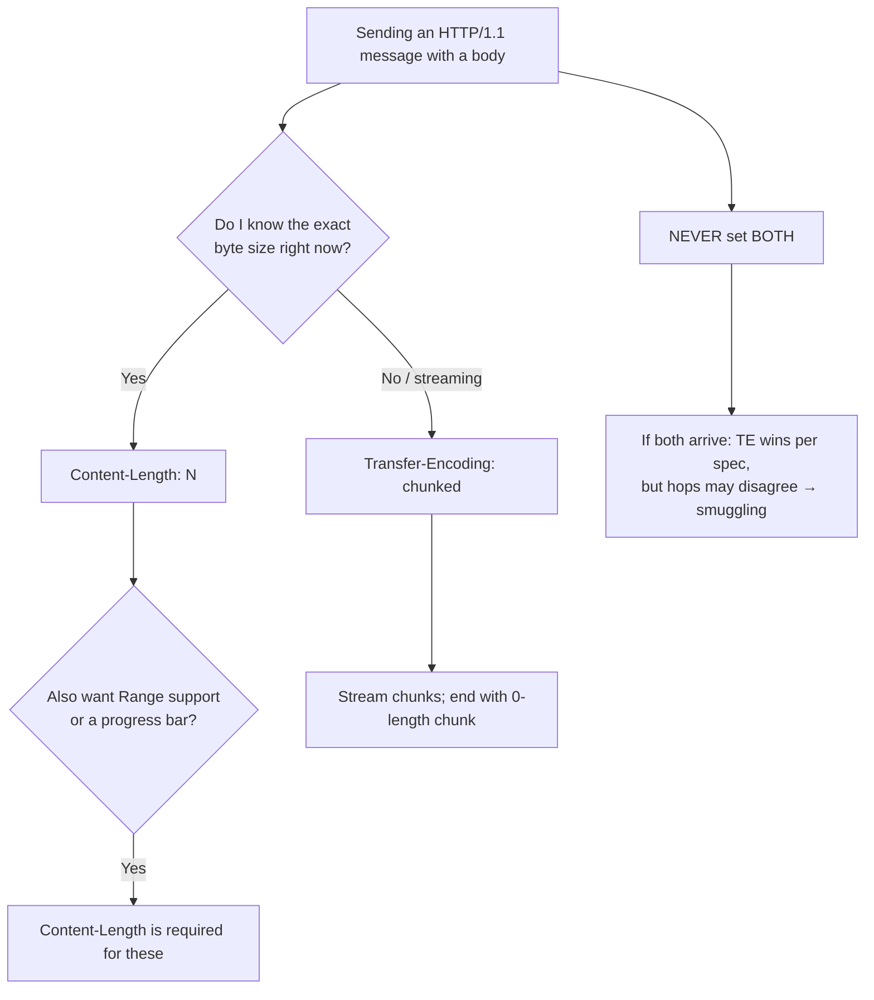

# Content-Length vs Transfer-Encoding

> This is a **concept page**, not a single-header page. It exists because the relationship between these two headers is the source of one of the most important correctness-and-security topics in HTTP/1.1: **message framing** — how a receiver knows where a body ends. Read [`Content-Length`](../04-Response-Headers/Content-Length.md) and [`Transfer-Encoding`](./Transfer-Encoding.md) for the individual deep-dives; read this to understand how they interact, conflict, and must be reconciled.

## Quick Summary

Every HTTP/1.1 message with a body must answer one question: **where does the body end?** There are exactly two mechanisms, and a message must use **exactly one**:

- [`Content-Length: N`](../04-Response-Headers/Content-Length.md) — "the body is exactly N bytes." Used when the size is known up front. Enables [`Range`](../13-Range-Requests/Range.md) requests and determinate progress bars.
- [`Transfer-Encoding: chunked`](./Transfer-Encoding.md) — "the body arrives as length-prefixed chunks, ending with a zero-length chunk." Used when the size is *not* known up front (streaming, dynamic generation).

They are **mutually exclusive**. A message carrying both is malformed; the spec says `Transfer-Encoding` wins and `Content-Length` must be ignored/removed — but the real danger is that *different servers resolve the conflict differently*, which is the root cause of **HTTP request smuggling**. In HTTP/2 and HTTP/3, neither header does framing at all — the binary protocol frames messages itself, `Transfer-Encoding: chunked` is forbidden, and `Content-Length`, if present, is only an advisory consistency check.

## What problem does this concept solve?

HTTP/1.1 reuses one TCP connection for many request/response pairs (keep-alive). The receiver reads bytes off the socket and must know precisely when one message's body stops and the next message begins — otherwise it either waits forever for bytes that won't come, or mistakes the start of the next message for body data. This "framing" problem has two solutions depending on whether the sender knows the total size:

- **Size known** → declare it (`Content-Length`). Simple, cheap, supports byte ranges and progress UI.
- **Size unknown** → stream in chunks (`Transfer-Encoding: chunked`), because you can't declare a length you don't have yet, and closing the connection to signal "the end" (the HTTP/1.0 way) would destroy keep-alive.

The framing question is *mandatory* and *singular*: pick one mechanism, apply it consistently, and every hop on the path must agree on the answer. When they don't, the connection **desynchronizes**.

## The framing decision



The rule of thumb for application code: **you rarely choose explicitly** — the runtime decides. In Node/Express, `res.send(buffer/string)` (known length) → `Content-Length`; `res.write()` before you know the size, or `stream.pipe(res)` → `Transfer-Encoding: chunked`. Your job is to *not fight it* and *never emit both*.

## How the two headers compare

| Property | `Content-Length` | `Transfer-Encoding: chunked` |
|---|---|---|
| **Scope** | End-to-end (describes the representation size) | **Hop-by-hop** (describes this connection's framing) |
| **When used** | Size known before sending | Size unknown / streaming |
| **Body shape** | One contiguous block of N bytes | Series of `hex-length CRLF data CRLF`, ending `0 CRLF CRLF` |
| **Enables `Range`** | Yes | No (needs a known length) |
| **Determinate progress bar** | Yes | No |
| **Keep-alive with unknown size** | N/A | Yes — its whole reason to exist |
| **Trailers (post-body headers)** | No | Yes |
| **Mutable by proxies** | Recomputed if body changes | May be added/removed/re-chunked per hop |
| **HTTP/2 & HTTP/3** | Advisory only (consistency check) | **Forbidden** (protocol error) |

The single most important row is **Scope**. `Content-Length` is a fact about the *content*; `Transfer-Encoding` is a fact about the *transfer over one hop*. A proxy that buffers a chunked response and forwards it whole will legitimately *replace* `Transfer-Encoding: chunked` with a computed `Content-Length` — and it **must remove** the now-false `Transfer-Encoding` when it does. Conversely, a streaming proxy keeps chunked and must **not** invent a `Content-Length`.

## HTTP Examples

**Known size — `Content-Length`:**

```http
HTTP/1.1 200 OK
Content-Type: application/json
Content-Length: 27

{"message":"hello world!!"}
```

**Unknown size — `Transfer-Encoding: chunked`:**

```http
HTTP/1.1 200 OK
Content-Type: application/json
Transfer-Encoding: chunked

1b
{"message":"hello world!!"}
0

```

**Malformed — BOTH present (never send this):**

```http
HTTP/1.1 200 OK
Content-Length: 27
Transfer-Encoding: chunked

... ← two hops may disagree on how to read this body
```

## The desync / request smuggling problem

Because framing must be agreed by **every** hop, and because a message can (illegally) contain both headers or an obfuscated `Transfer-Encoding`, an attacker can craft a request that a **front-end** (CDN/LB/reverse proxy) and a **back-end** (app server) parse *differently*. The three classic variants:

- **CL.TE** — front-end uses `Content-Length`, back-end uses `Transfer-Encoding`. The front-end forwards what it thinks is one request; the back-end sees a chunked body that ends early, treating the *remainder* as the start of a **new** request smuggled onto the connection.
- **TE.CL** — the reverse: front-end honors `Transfer-Encoding`, back-end honors `Content-Length`.
- **TE.TE** — both *support* `Transfer-Encoding`, but the attacker **obfuscates** it (`Transfer-Encoding:\tchunked`, duplicate headers, odd casing, `Transfer-Encoding: chunked, x`) so exactly one hop fails to recognize it and falls back to `Content-Length`.

```mermaid
sequenceDiagram
    participant Atk as Attacker
    participant FE as Front-end (uses Content-Length)
    participant BE as Back-end (uses Transfer-Encoding)
    participant V as Victim (next request on same conn)
    Atk->>FE: POST with BOTH CL and TE (crafted)
    Note over FE: Reads per Content-Length → forwards whole blob
    FE->>BE: forwards blob
    Note over BE: Reads per chunked → body ends early;<br/>leftover bytes = a SMUGGLED request prefix
    V->>FE: normal request
    FE->>BE: forwards victim request
    Note over BE: Prepends smuggled prefix to victim's request<br/>→ auth bypass / cache poison / hijack
```

The consequence is severe: bypassing front-end security controls, poisoning shared caches, capturing other users' requests/credentials, or hijacking sessions.

## Defenses (this is the whole point)

- [ ] **Never generate a message with both headers.** Let the runtime pick one.
- [ ] Ensure **every hop uses the same, strict, spec-conformant parser**. Reject — don't "fix" — ambiguous or obfuscated framing.
- [ ] Configure the front-end to **normalize**: strip `Transfer-Encoding` when it can't fully process it, reject requests with both headers, reject duplicated/obfuscated `Transfer-Encoding`.
- [ ] Prefer **HTTP/2 (or HTTP/3) end-to-end**, where chunked doesn't exist and framing ambiguity is structurally impossible. If you must downgrade h2→h1 at a hop, use a battle-tested proxy that rejects h2 requests that would produce ambiguous h1.
- [ ] Keep proxies, CDNs, and app servers **patched** — smuggling defenses are an ongoing arms race and most fixes ship in the HTTP parsers.
- [ ] Disable connection reuse to the back-end if you cannot guarantee parser agreement (defense of last resort — it hurts performance).
- [ ] Test with authorized tooling (e.g. Burp's HTTP Request Smuggler) against staging.

## Node.js / Express behavior (what actually happens)

- `res.send(str|Buffer)` / `res.json(obj)` → Node computes and sets **`Content-Length`**; no chunking.
- `res.write(...)` (one or more) then `res.end()` **without** a prior `Content-Length` → Node sets **`Transfer-Encoding: chunked`** automatically.
- `readableStream.pipe(res)` → chunked, unless a `Content-Length` is known/set.
- Setting `Content-Length` **and** then streaming more/less than that many bytes → truncation or a hung/errored response. Don't.
- Node's HTTP server **rejects** requests that violate framing rules (it has hardening against smuggling); keep Node updated.
- Under HTTP/2 (`http2` module / frameworks): don't set `Transfer-Encoding`; the framework/protocol handles framing.

```js
// Known length → Content-Length (framing by size)
app.get('/a', (req, res) => res.json({ ok: true }));      // Content-Length set for you

// Unknown length → chunked (framing by chunks)
app.get('/b', (req, res) => {
  res.type('text/plain');
  res.write('part 1\n');                                   // triggers Transfer-Encoding: chunked
  setTimeout(() => { res.write('part 2\n'); res.end(); }, 100);
});

// NEVER:
// res.setHeader('Content-Length', 5); res.setHeader('Transfer-Encoding', 'chunked');
```

## HTTP/2 & HTTP/3

Framing moves into the protocol: messages are carried in binary `HEADERS` + `DATA` frames with explicit lengths and end-of-stream flags. Therefore:

- `Transfer-Encoding: chunked` is **forbidden** and a connection/stream error if sent.
- `Content-Length`, if present, is **not** used for framing — it's only checked for consistency against the actual `DATA` bytes; a mismatch is a protocol error.
- Streaming is done via multiple `DATA` frames (and it's *better* than h1 chunked: multiplexed, no HTTP-layer head-of-line blocking).
- The smuggling class largely disappears **within** h2/h3, but re-appears at **downgrade boundaries** (h2 front-end → h1 back-end), so the defenses above still matter at those hops.

See [HTTP Versions and Headers](../01-Introduction/HTTP-Versions-and-Headers.md).

## Debugging

- **curl:** `curl -sD - -o /dev/null https://host/path` shows which framing header was used. `curl -v --raw` reveals raw chunk sizes. `-N` disables buffering to watch streamed chunks arrive.
- **Chrome DevTools:** the response Headers show `Content-Length` or `Transfer-Encoding` (h1); h2/h3 responses show neither `Transfer-Encoding` nor rely on `Content-Length` for framing (look at the Protocol column: `h2`/`h3`).
- **Wireshark/tcpdump:** to *see* actual framing bytes on the wire (chunk sizes, connection reuse) when diagnosing desync.
- **Smuggling testing:** authorized use of Burp Suite's smuggler, or crafted `printf | openssl s_client` payloads against staging.
- **Consistency check across hops:** send a request through the full chain and confirm the framing header is coherent at each hop (no "both", no leftover `Transfer-Encoding` after a buffering proxy).

## Mental Model

Framing is **how you tell the mail room where one package ends and the next begins on a shared conveyor belt**. You have two honest labeling systems: put the exact weight on the box (`Content-Length` — great, the clerk knows precisely when the box is fully unloaded, and can even fetch "just pages 100–200" for you), or ship a train of small labeled envelopes ending with an empty "that's everything" envelope (`chunked` — perfect when you're still packing as it ships). The **cardinal rule** is that a single package must use **one** labeling system: if you stamp a weight *and* attach an envelope train, two mail rooms down the line may count differently, and in the gap where their counts disagree, a saboteur can slip a forged package onto the belt addressed to the next customer (request smuggling). Modern rail (HTTP/2/3) replaces this fragile labeling with a belt that has built-in dividers — you can't miscount because the dividers are part of the machine — which is why the old envelope system is retired there entirely.
