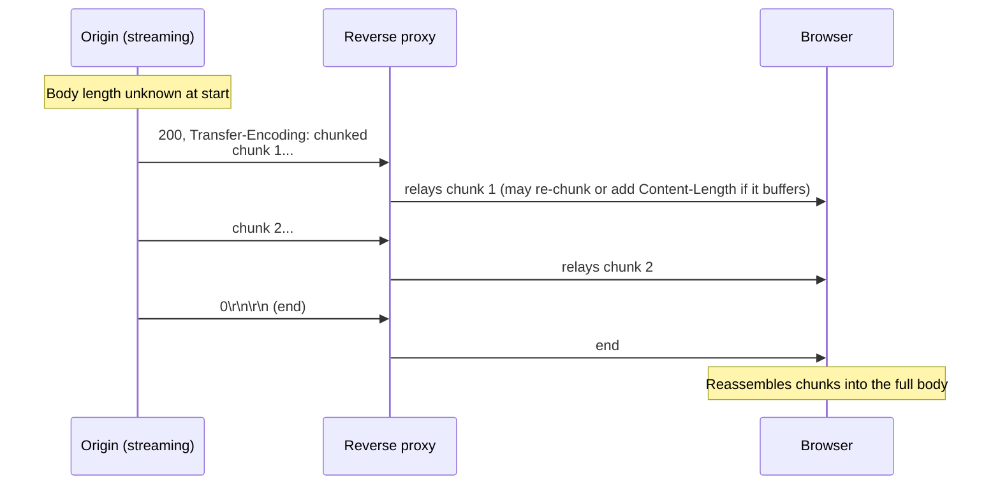
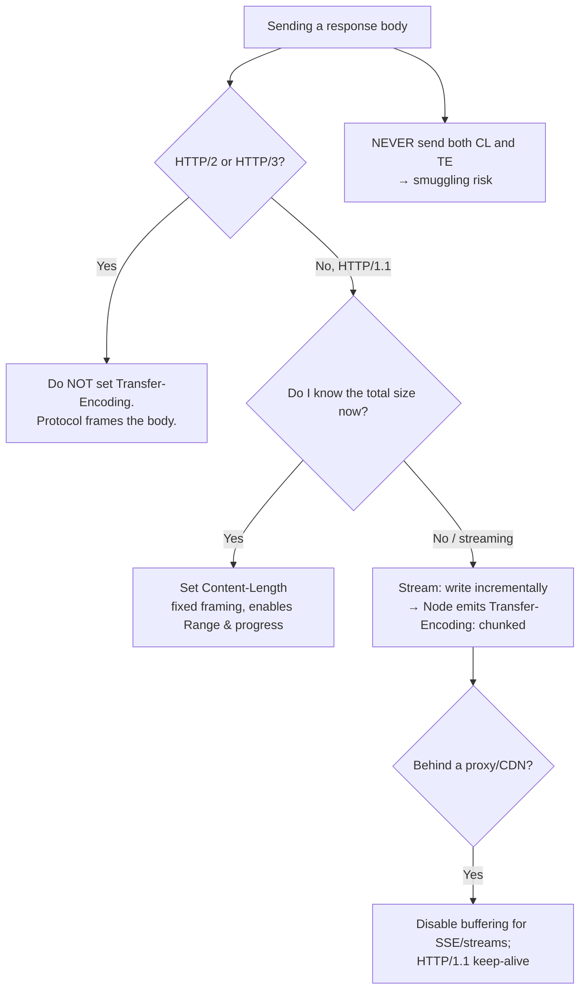

# Transfer-Encoding

## Quick Summary

`Transfer-Encoding` is a **hop-by-hop** header that describes *how the message body was encoded for transfer over a single connection* — most importantly `Transfer-Encoding: chunked`, which frames the body as a series of length-prefixed chunks so the sender can start transmitting **before it knows the total size**. It is fundamentally different from [`Content-Encoding`](./Content-Encoding.md): `Content-Encoding` is an *end-to-end* property of the *representation* (the resource is genuinely gzip-compressed, and stays that way from origin to browser), whereas `Transfer-Encoding` is a *per-connection* property of the *transfer* (this particular hop chose to stream the bytes in chunks) that each hop may add or remove. It answers the framing question every HTTP/1.1 message must answer — "where does the body end?" — via chunked framing when [`Content-Length`](../04-Response-Headers/Content-Length.md) is unknown up front. It is the mechanism behind streaming responses, Server-Sent Events, and dynamically-generated payloads. It is also the single most notorious source of **HTTP request smuggling** vulnerabilities, because disagreements between servers about `Transfer-Encoding` vs `Content-Length` let attackers desynchronize a connection. In HTTP/2 and HTTP/3, `Transfer-Encoding: chunked` **does not exist** — framing is handled by the protocol layer, and sending it is a protocol error.

## What problem does this header solve?

HTTP/1.1 runs multiple requests and responses over a single persistent (keep-alive) connection, one after another. For that to work, the receiver must know *exactly where each message body ends* so it can find the start of the next one. The simple solution is [`Content-Length`](../04-Response-Headers/Content-Length.md): "the body is exactly N bytes." But there are common situations where **you don't know N when you start sending**:

- A response generated on the fly (a database query streamed as JSON, a report rendered progressively, an LLM token stream) — you want to send the first bytes immediately, long before the last byte exists.
- A proxy relaying an upstream stream whose length the upstream never declared.
- Server-Sent Events / long-lived streams that never "end" in the `Content-Length` sense.

Before `Transfer-Encoding: chunked`, the only way to send a body of unknown length was to **close the connection** to signal "the body ends here" (the HTTP/1.0 approach) — which destroys keep-alive and forces a new TCP+TLS handshake for the next request. Chunked transfer encoding solves this: each chunk is prefixed with its own length in hex, a zero-length chunk marks the end, and the connection stays open for reuse. It lets a server **stream a body of unknown total size while keeping the connection alive**.

## Why was it introduced?

`Transfer-Encoding` and chunked framing were introduced with **HTTP/1.1 (RFC 2068, 1997; RFC 2616, 1999)** precisely to make persistent connections work with dynamically-sized bodies. HTTP/1.0 had no chunked encoding; unknown-length bodies required connection close, which is why HTTP/1.0 keep-alive was so limited. HTTP/1.1 made persistent connections the default and needed a length-delimiting mechanism that didn't require knowing the size in advance — that's chunked.

The rules were re-specified in **RFC 7230 (2014)** and again in **RFC 9112 (2022, "HTTP/1.1")**, which sharpened the security-critical requirements after a decade of request-smuggling attacks: a message must not have *both* `Transfer-Encoding` and `Content-Length` (or if it does, `Transfer-Encoding` wins and `Content-Length` must be ignored/removed), `chunked` must be the *final* encoding in the list, and a server receiving a malformed combination should reject the message rather than guess. The design point that `Transfer-Encoding` is **hop-by-hop** — legitimately altered by each intermediary — is also what makes it dangerous: two hops can legitimately disagree about how to frame the same bytes.

## How does it work?

With `Transfer-Encoding: chunked`, the body is sent as a sequence of chunks. Each chunk is: a line with the chunk size in **hexadecimal**, `CRLF`, the chunk data, `CRLF`. A final chunk of size `0` (followed by optional trailers and a final `CRLF`) terminates the body.

```
HTTP/1.1 200 OK
Content-Type: application/json
Transfer-Encoding: chunked

1b
{"status":"processing","p":0}
1a
{"status":"processing","p":50}
19
{"status":"done","result":42}
0

```

(`1b`, `1a`, `19` are the hex byte-lengths of each following chunk; `0` ends it.)



- **Browser behavior:** Browsers transparently **decode** chunked responses — your JS never sees chunk boundaries; it sees a normal body (or a readable stream via `Response.body`). Browsers generally do **not** send `Transfer-Encoding: chunked` on request bodies to servers (they buffer and send `Content-Length` instead), though `fetch` with a `ReadableStream` upload body can trigger chunked request bodies where supported.
- **Server behavior:** A server sending a body of unknown length uses chunked automatically (Node/Express do this when you `write()` without setting `Content-Length`). A server *receiving* a chunked request must decode it and enforce the strict framing rules to avoid smuggling.
- **Proxy behavior:** Because it's hop-by-hop, a proxy may **decode** an inbound chunked body and re-send it with `Content-Length` (if it buffers the whole thing), or **re-chunk** it, or forward chunked. This legitimate mutability is why the header must not be treated as end-to-end.
- **CDN behavior:** CDNs often buffer origin responses and may convert chunked → `Content-Length` (or vice-versa) depending on whether they stream or store; for streaming pass-through they keep chunked.
- **Reverse proxy behavior:** Nginx decides based on `proxy_buffering` — buffered responses become `Content-Length`; streamed (`proxy_buffering off`) responses stay chunked. Nginx also strips/handles `Transfer-Encoding` per hop and defends against smuggling.

## HTTP Request Example

A rare but legal chunked *request* body (e.g. streaming an upload of unknown size):

```http
POST /api/upload HTTP/1.1
Host: api.example.com
Content-Type: application/octet-stream
Transfer-Encoding: chunked

200
<512 bytes of data>
200
<512 bytes of data>
0

```

Note there is **no `Content-Length`** — the two are mutually exclusive. A request carrying *both* is exactly the ambiguity smuggling exploits.

## HTTP Response Example

A streamed JSON response of unknown length:

```http
HTTP/1.1 200 OK
Content-Type: application/json
Transfer-Encoding: chunked
Cache-Control: no-store

7
{"a":1}
0

```

The same resource with a *known* length uses `Content-Length` instead (never both):

```http
HTTP/1.1 200 OK
Content-Type: application/json
Content-Length: 7

{"a":1}
```

Chunked with **trailers** (metadata computed only after the body, e.g. a checksum):

```http
HTTP/1.1 200 OK
Content-Type: application/octet-stream
Transfer-Encoding: chunked
Trailer: Digest

400
<1024 bytes>
0
Digest: sha-256=:abc123...:

```

## Express.js Example

You almost never set `Transfer-Encoding` by hand — Node sets it **automatically** when you stream without a known length. The important skill is knowing *when* Node chooses chunked vs `Content-Length`, and never fighting it:

```js
const express = require('express');
const app = express();

// 1) Streaming JSON of unknown size → Node uses chunked AUTOMATICALLY.
//    We never set Content-Length (we don't know it) and never set
//    Transfer-Encoding ourselves — writing without a length triggers chunked.
app.get('/api/export', async (req, res) => {
  res.type('application/json');
  res.write('[');                          // first bytes go out immediately (chunked).
  let first = true;
  for await (const row of db.streamRows()) {  // async iterator over a large result set
    res.write((first ? '' : ',') + JSON.stringify(row));
    first = false;
  }
  res.write(']');
  res.end();                                // sends the terminating 0-length chunk.
  // Because we called write() before knowing total size, Node set
  // `Transfer-Encoding: chunked` for us. Setting Content-Length here would be a bug.
});

// 2) Piping a stream (file, upstream, transform) → chunked as well.
const fs = require('fs');
app.get('/report.csv', (req, res) => {
  res.type('text/csv');
  fs.createReadStream('/data/report.csv').pipe(res); // pipe → chunked unless size is set.
});

// 3) Known-size body → Node uses Content-Length, NOT chunked. Let it.
app.get('/api/small', (req, res) => {
  const body = JSON.stringify({ ok: true });
  res.type('application/json').send(body);  // res.send() sets Content-Length; no chunking.
});

// 4) DANGER: never manually set both. This is a smuggling foot-gun and Node/HTTP
//    will reject or misbehave. Pick ONE framing and let Node manage it.
// res.setHeader('Content-Length', 10);
// res.setHeader('Transfer-Encoding', 'chunked'); // <-- do NOT do this.

app.listen(3000);
```

Why each piece matters: in route 1, calling `res.write()` before the body is complete is *the* trigger for chunked — Node can't set a `Content-Length` it doesn't know, so it frames each `write()` as a chunk and the final `res.end()` sends the zero chunk. This is what makes streaming exports and SSE possible. In route 3, `res.send(string/Buffer)` knows the length, so Node uses `Content-Length` and the response is *not* chunked — trying to force chunking here gains nothing. Route 4 is the anti-pattern: setting both headers creates the exact `Content-Length`/`Transfer-Encoding` ambiguity that smuggling attacks weaponize; never do it, and never trust a body that arrived with both.

## Node.js Example

Raw `http` makes the automatic behavior explicit:

```js
const http = require('http');

http.createServer((req, res) => {
  if (req.url === '/stream') {
    res.writeHead(200, { 'Content-Type': 'text/plain' });
    // No Content-Length set → the moment we write, Node adds Transfer-Encoding: chunked.
    let n = 0;
    const timer = setInterval(() => {
      res.write(`tick ${n++}\n`);        // each write ≈ one chunk on the wire.
      if (n === 5) { clearInterval(timer); res.end(); } // res.end() → 0-length terminating chunk.
    }, 500);
    return;
  }

  if (req.url === '/fixed') {
    const body = 'hello';
    // Setting Content-Length makes Node use fixed-length framing (NOT chunked).
    res.writeHead(200, { 'Content-Type': 'text/plain', 'Content-Length': Buffer.byteLength(body) });
    return res.end(body);
  }

  res.statusCode = 404;
  res.end();
}).listen(3000);

// Reading a chunked RESPONSE as a client: Node decodes it transparently.
http.get('http://example.com/stream', (res) => {
  console.log('TE:', res.headers['transfer-encoding']); // 'chunked' if streamed
  res.on('data', (buf) => process.stdout.write(buf));    // you get decoded bytes, not chunks
});
```

The contrast is the whole lesson: set `Content-Length` → fixed framing; write without it → chunked. Node never lets you send both, and it decodes inbound chunking for you.

## React Example

React never sets `Transfer-Encoding` (it's a server/transfer concern), but modern React apps *consume* chunked streams heavily:

1. **Streaming responses via `Response.body`.** A chunked response can be read progressively with the Streams API — the backbone of streaming UIs (LLM token streams, progressive data loading):

```jsx
async function streamAnswer(prompt, onToken) {
  const res = await fetch('/api/chat', { method: 'POST', body: JSON.stringify({ prompt }) });
  // The server responds Transfer-Encoding: chunked; we read it chunk-by-chunk.
  const reader = res.body.getReader();
  const decoder = new TextDecoder();
  for (;;) {
    const { value, done } = await reader.read(); // each read ≈ one (or more) transfer chunk(s)
    if (done) break;
    onToken(decoder.decode(value, { stream: true }));
  }
}
```

2. **Server-Sent Events** (`EventSource`) ride on a chunked (`text/event-stream`) response; React apps use them for live updates. The chunking is invisible — you get `message` events.

3. **React 18 SSR streaming** (`renderToPipeableStream`/`renderToReadableStream`) sends the HTML shell first and streams Suspense boundaries as they resolve — the transport under the hood is a chunked response. React devs benefit from `Transfer-Encoding` without ever naming it; the payoff is faster Time-To-First-Byte and progressive hydration.

## Browser Lifecycle

1. The response arrives with `Transfer-Encoding: chunked` (no `Content-Length`).
2. The browser's HTTP stack **reads chunk-by-chunk**, decoding each length-prefixed chunk and appending to the body, delivering bytes progressively.
3. Any [`Content-Encoding`](./Content-Encoding.md) (gzip/br) is applied to the *representation* and is decoded **separately** — the browser first de-chunks (transfer layer), then de-compresses (content layer).
4. The zero-length chunk signals end-of-body; the connection is returned to the pool for reuse (keep-alive preserved — the whole point of chunked).
5. To JS, the body appears normal (or as a `ReadableStream` if consumed via `Response.body`); chunk boundaries are not exposed as such.
6. In HTTP/2/3 there is no chunked framing at all — the browser relies on the protocol's `DATA` frames; `Transfer-Encoding` must not appear.

## Production Use Cases

- **Streaming large exports/reports** without buffering the whole thing in memory (stream rows straight to the socket).
- **LLM / AI token streaming** to the browser as tokens are generated.
- **Server-Sent Events** and other long-lived event streams.
- **React 18 / framework SSR streaming** for faster TTFB and progressive rendering.
- **Proxying upstreams of unknown length** (a gateway relaying a streamed backend response).
- **Trailers** for post-body metadata: integrity digests, gRPC-web status, timing computed only after the body is sent.

## Common Mistakes

- **Sending both `Transfer-Encoding` and `Content-Length`.** Illegal and a smuggling vector; per spec `Transfer-Encoding` wins and `Content-Length` must be ignored/stripped, but many stacks misbehave. Never emit both.
- **Setting `Transfer-Encoding: chunked` in HTTP/2/3.** It's a protocol error — framing is the protocol's job there. Don't copy HTTP/1.1 habits into h2/h3 code paths.
- **Treating it as end-to-end / compression.** It's hop-by-hop framing, *not* content compression. Use [`Content-Encoding`](./Content-Encoding.md) for compression.
- **Manually setting `Content-Length` on a streamed response.** If you set a wrong/placeholder length while writing incrementally, you truncate or hang the response. Let Node choose chunked.
- **Forwarding `Transfer-Encoding` blindly through a buffering proxy.** If the proxy buffers and adds `Content-Length`, it must remove the stale `Transfer-Encoding`, or downstream sees both.
- **Assuming `Range` works with chunked.** Byte-range serving generally needs a known length; chunked streaming and range requests don't mix cleanly.
- **Expecting to read `Transfer-Encoding` on an HTTP/2 response** — you won't; it's absent by design.

## Security Considerations

- **HTTP Request Smuggling (the big one).** When a front-end (proxy/CDN/LB) and a back-end disagree on how to parse a request's framing — one honoring `Content-Length`, the other `Transfer-Encoding` (CL.TE / TE.CL / TE.TE attacks) — an attacker can smuggle a second, hidden request onto the connection, poisoning other users' requests, bypassing auth, or hijacking sessions. Defenses: **reject messages with both headers**; normalize/strip `Transfer-Encoding` variants; ensure every hop uses the *same* HTTP parser semantics; prefer HTTP/2 end-to-end (no chunked ambiguity); and use servers that reject malformed `Transfer-Encoding` (obfuscated casing, duplicate headers, `Transfer-Encoding: chunked, chunked`) instead of guessing.
- **`TE.TE` obfuscation.** Attackers hide `Transfer-Encoding` from one hop using tricks like `Transfer-Encoding:\tchunked`, casing, or duplicated headers so only one hop treats it as chunked. Strict, spec-conformant parsing that rejects anything non-canonical is the defense.
- **Denial of service.** Malicious chunk sizes, extremely large chunk counts, or slow-drip chunking (a "slowloris"-style body) can exhaust resources. Enforce body/chunk size limits and timeouts.
- **Trailer injection.** Only allowlist expected trailer fields; never let trailers override security-relevant headers (many servers ignore trailers for exactly this reason).

## Performance Considerations

- **Chunked enables streaming = lower TTFB.** You send the first bytes without waiting to compute the whole body — a large perceived-latency win for big/dynamic responses and SSR.
- **Keep-alive preserved.** Unlike the HTTP/1.0 "close to signal end" hack, chunked keeps the connection reusable, avoiding repeated TCP/TLS handshakes.
- **Per-chunk overhead.** Each chunk has a small size-line overhead; pathologically tiny chunks (one byte each) waste bandwidth and CPU. Batch writes into reasonable chunk sizes.
- **No `Content-Length` means no progress bar.** Clients can't show a determinate download progress without a length; if you *can* cheaply know the size, `Content-Length` gives better UX and enables range requests.
- **HTTP/2/3 are strictly better for streaming** (multiplexed `DATA` frames, no head-of-line blocking at the HTTP layer), which is one reason chunked framing was removed there.

## Reverse Proxy Considerations

Nginx's framing choice hinges on buffering:

```nginx
server {
  location /stream/ {
    proxy_pass http://app_upstream;
    proxy_buffering off;          # stream through → preserves chunked / SSE, low TTFB.
    proxy_http_version 1.1;       # required for chunked upstream + keep-alive.
    proxy_set_header Connection ""; # keep upstream connection alive.
    # Nginx will NOT add Content-Length; it relays the chunked body.
  }

  location /api/ {
    proxy_pass http://app_upstream;
    # Default proxy_buffering on: nginx may buffer and send Content-Length to the
    # client, converting an upstream chunked body to fixed-length. It removes the
    # stale Transfer-Encoding when it does so.
  }
}
```

Key points: for SSE/streaming you must set `proxy_buffering off` and `proxy_http_version 1.1`, or nginx buffers and breaks the stream. Nginx (and other conformant proxies) will **not** forward both `Content-Length` and `Transfer-Encoding`; when it re-frames it strips the one that no longer applies — this is part of what keeps it smuggling-safe. Ensure your entire chain (LB → CDN → nginx → app) uses consistent, modern parsers.

## CDN Considerations

- **Buffering vs streaming:** CDNs that buffer objects to disk typically serve them with `Content-Length`; those in streaming/pass-through mode preserve `Transfer-Encoding: chunked`. For SSE/streaming you often must disable edge buffering or use the CDN's streaming mode.
- **Cloudflare** streams responses and supports chunked/SSE, but some features (e.g. certain transformations) require buffering; check that your streaming endpoints aren't being buffered.
- **CloudFront/Fastly** similarly stream by default for most content but may buffer for edge compute or transforms.
- **Smuggling posture:** reputable CDNs are hardened against request smuggling and reject ambiguous `Content-Length`/`Transfer-Encoding` combinations; still, keep your origin conformant so a re-framing hop never sees ambiguity.
- **HTTP/2/3 at the edge:** the client↔CDN hop is usually h2/h3 (no chunked), while CDN↔origin may be h1 (chunked); the CDN bridges the framing.

## Cloud Deployment Considerations

- **Load balancers (ALB/GCLB):** support chunked and streaming; some have buffering/idle-timeout settings that can cut long streams — tune timeouts for SSE/long streams. AWS ALB streams responses; API Gateway historically buffered (limiting streaming) though newer response-streaming features exist.
- **API Gateways:** many buffer the full response (breaking chunked streaming) unless you use a streaming-capable mode (e.g. Lambda response streaming). Check limits before relying on chunked through a gateway.
- **Serverless:** classic request/response Lambdas buffer; use response-streaming variants for chunked output. Function platforms may cap body size and duration.
- **Managed platforms (Vercel/Netlify):** support streaming responses (Edge/Node runtimes) but with documented limits; use their streaming APIs rather than assuming raw chunked passes through unchanged.

## Debugging

- **Chrome DevTools → Network:** a chunked response often shows Size without a precise "Content-Length" and streams in the response over time; the Headers tab shows `Transfer-Encoding: chunked` (for h1). For h2/h3 you'll see the `:status` pseudo-header and no `Transfer-Encoding`.
- **curl:** `curl -v --raw https://example.com/stream` shows the raw chunk sizes (hex) when `--raw` is used; without it, curl de-chunks for you. `curl -sD - -o /dev/null` shows whether `Transfer-Encoding` or `Content-Length` was used.
- **curl (streaming):** `curl -N https://example.com/sse` disables buffering so you see SSE/streamed chunks arrive live.
- **Postman / Bruno:** display the decoded body; Postman can show streamed responses for SSE. They hide chunk framing.
- **Node.js:** log `res.headers['transfer-encoding']` on a client response; use `--raw`-style tooling or a TCP capture (`tcpdump`/Wireshark) to see actual chunk bytes.
- **Smuggling checks:** security tooling (e.g. Burp's HTTP Request Smuggler) sends crafted `CL`/`TE` combinations; use it in authorized testing to verify your chain rejects ambiguity.

## Best Practices

- [ ] Let the runtime choose framing: set [`Content-Length`](../04-Response-Headers/Content-Length.md) when you know the size, otherwise stream (Node emits `chunked` for you).
- [ ] **Never** send both `Transfer-Encoding` and `Content-Length`.
- [ ] **Never** send `Transfer-Encoding: chunked` on HTTP/2 or HTTP/3.
- [ ] Ensure every hop (LB → CDN → proxy → app) uses a modern, strict parser that **rejects** ambiguous framing — this is your primary smuggling defense.
- [ ] For SSE/streaming through a proxy, disable buffering (`proxy_buffering off`) and use HTTP/1.1 keep-alive.
- [ ] Batch writes into sensibly-sized chunks; avoid one-byte chunks.
- [ ] Enforce body size limits, chunk limits, and read timeouts to prevent chunked-body DoS.
- [ ] Use [`Content-Encoding`](./Content-Encoding.md) for compression — don't confuse transfer framing with content compression.
- [ ] Prefer HTTP/2/3 end-to-end for streaming to eliminate chunked-framing ambiguity entirely.

## Related Headers

- [Content-Length](../04-Response-Headers/Content-Length.md) — the alternative framing (known size); the two are mutually exclusive, and their disagreement is the root of smuggling. See also [Content-Length vs Transfer-Encoding](./Content-Length-vs-Transfer-Encoding.md).
- [Content-Encoding](./Content-Encoding.md) — end-to-end content compression, decoded *separately* from (and after) chunked de-framing.
- [Accept-Encoding](./Accept-Encoding.md) — negotiates content compression, not transfer encoding.
- [TE](../03-Request-Headers/Accept-Encoding.md) — the request-side header by which a client advertises acceptable transfer encodings and willingness to accept trailers.
- [Trailer](../04-Response-Headers/Content-Type.md) — declares which header fields appear in the chunked trailer section.
- [Connection](../03-Request-Headers/Connection.md) — chunked exists to keep connections alive; both are hop-by-hop.
- [End-to-End vs Hop-by-Hop Headers](../01-Introduction/End-to-End-vs-Hop-by-Hop-Headers.md) — explains why `Transfer-Encoding` is hop-by-hop and legitimately mutable.
- [HTTP Versions and Headers](../01-Introduction/HTTP-Versions-and-Headers.md) — why chunked is absent from HTTP/2/3.

## Decision Tree



## Mental Model

Think of `Transfer-Encoding: chunked` as **shipping a book to a reader chapter-by-chapter while you're still writing it**, versus `Content-Length`, which is **mailing the whole finished book in one box with the page count on the label**. If the book is done, you weigh it, print "742 pages" on the box, and send it — the reader knows exactly when they've received everything (`Content-Length`). But if you're writing as you go and want the reader to start *now*, you mail each chapter in its own envelope labeled with its length, and a final empty envelope that means "the book is complete" (`chunked`). The crucial subtleties: this is about *how you ship*, not *what the book is* — a separate matter of whether the text is written in shorthand you'll expand later (`Content-Encoding`/compression), which every reader must decode regardless of shipping method. Each postal hub (proxy) may legitimately repackage your envelopes — combine chapters into one box, or split a box back into envelopes — which is exactly why you must **never put two conflicting weight labels on the same package**: if the sending hub says "742 pages" and the receiving hub counts envelopes instead, a thief can slip a forged chapter into the gap between them (request smuggling).
