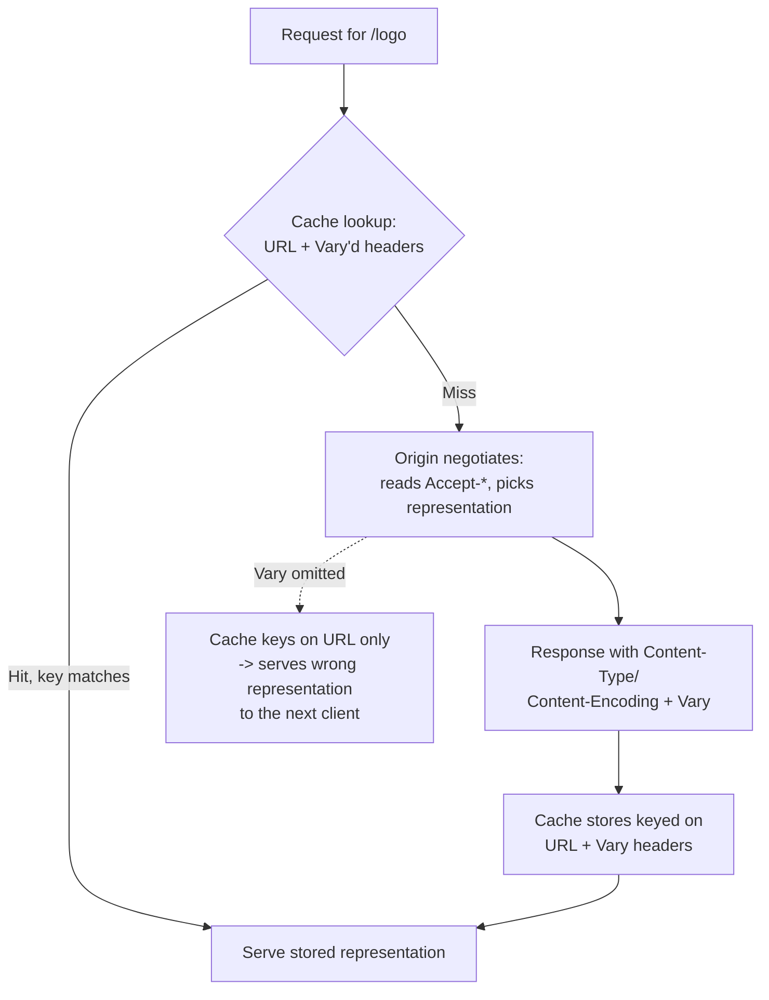
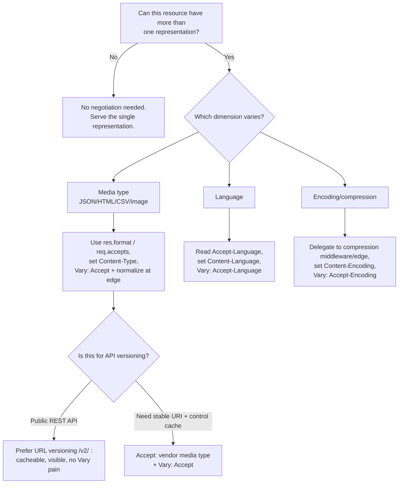

# Content Negotiation Overview

## Quick Summary

**Content negotiation** is the mechanism by which a client and a server agree on the best *representation* of a resource when more than one exists. One URL — say `/api/users/42` or `/logo` — can be a family of representations differing in **media type** (JSON vs XML vs HTML), **natural language** (English vs French), **encoding** (gzip vs br vs identity), and **charset**. The client advertises what it can accept and how strongly it prefers each option using the **`Accept` family** of request headers (`Accept`, [`Accept-Language`](../03-Request-Headers/Accept-Language.md), [`Accept-Encoding`](../10-Compression/Accept-Encoding.md), `Accept-Charset`), each dimension weighted with **quality values (`q`)**. The server picks a representation, serves it, and *declares its choice* in the response with [`Content-Type`](../04-Response-Headers/Content-Type.md), `Content-Language`, and [`Content-Encoding`](../10-Compression/Content-Encoding.md). Because the chosen bytes now depend on request headers, any cache in the path **must** be told which headers mattered via [`Vary`](../06-Caching-Headers/Vary.md) — get that wrong and a cache serves French to an English speaker or gzip to a client that can't decode it. This is the model that lets one canonical, cacheable, shareable URL transparently serve the right thing to every client.

## What problem does this header solve?

A resource is an abstract thing; the bytes you return are one concrete *representation* of it. The abstract "user 42" can be rendered as JSON for a mobile app, as an HTML profile page for a browser, or as vCard for a contacts import. "The homepage" exists in a dozen languages. "app.js" exists uncompressed and Brotli-compressed. If identity and representation were the same thing, you would be forced to encode the format, language, and encoding into the URL: `/api/users/42.json`, `/fr/index.html`, `/app.js.br`. That fragments everything that keys on the URL — your links, your bookmarks, your cache entries, your CDN hit ratio, your API surface — and pushes the combinatorial explosion (formats × languages × encodings) into your routing table.

Content negotiation solves the *precise* version of this: keep **one canonical URL** and let the client and server agree, per request, on which representation to exchange — based on what the client can actually render and prefers, and what the server can actually produce. The production wins are concrete: stable shareable URLs, a single cache key that transparently upgrades as clients gain capabilities (AVIF, Brotli), internationalization without URL sprawl, and API evolution without breaking existing clients.

## Why was it introduced?

Content negotiation is not a bolt-on; it is baked into HTTP's original design philosophy. HTTP/1.0 (RFC 1945, 1996) already carried `Accept`, `Accept-Encoding`, `Accept-Language`, and `Accept-Charset`. HTTP/1.1 (RFC 2068 → RFC 2616, 1999) formalized the two flavors — **server-driven (proactive)** and **agent-driven (reactive)** — and the `q`-value preference model. The rules live today in **RFC 9110 §12** ("HTTP Semantics"): §12.1 defines the two mechanisms, §12.5 defines the proactive `Accept-*` fields, and §12.4.1 defines the `q` (quality value) syntax.

The design goal was **format independence**: Tim Berners-Lee's web was meant to be a space of *resources* addressable by URI, where the concrete media type, language, and encoding were negotiated details rather than part of a resource's identity. The mechanism aged unevenly. Media-type negotiation largely collapsed to "everyone picks JSON," but two dimensions grew *more* important after the spec was written: **image format negotiation** (the WebP → AVIF rollout leans entirely on `Accept`) and **compression negotiation** (Brotli deployment leans entirely on [`Accept-Encoding`](../10-Compression/Accept-Encoding.md)). Language negotiation remains the backbone of server-side i18n, and custom media types (`application/vnd.myapp.v2+json`) became a recognized API-versioning strategy.

## Proactive vs Reactive Negotiation

HTTP defines two ways to negotiate. Almost everything in production is proactive; reactive is a historical curiosity worth understanding so you recognize it.

**Proactive (server-driven) negotiation.** The client sends its preferences up front in the `Accept-*` headers. The server algorithmically selects one representation and returns it directly (`200 OK`) with the matching `Content-*` headers. One round trip. This is what browsers, `fetch`, `curl`, and every API framework do.

- **Pro:** one round trip; the server, which knows its representations best, does the choosing.
- **Con:** the server must guess from headers that are coarse (a browser's `Accept` doesn't distinguish "I'd tolerate PNG" from "I love PNG" beyond `q`), and negotiated responses complicate caching (you must `Vary`).

**Reactive (agent-driven) negotiation.** The server, instead of choosing, returns `300 Multiple Choices` with a *list* of available representations (as links / a body the agent parses), and the client (or user) picks one and issues a second request for the chosen URL.

- **Pro:** the client makes the final call with full knowledge of its own constraints; no server-side heuristics.
- **Con:** an extra round trip, and there was never a standard machine-readable format for the choice list, so browsers never implemented automatic selection. In practice `300` is rare; you'll occasionally see a *transparent* hybrid where the server picks a default but advertises alternatives via the `Alternates`/`Link` headers.

```mermaid
sequenceDiagram
    participant C as Client
    participant S as Server
    Note over C,S: Proactive (server-driven) — the common case
    C->>S: GET /users/42<br/>Accept: application/json;q=1.0, text/html;q=0.8
    S->>S: Score each representation vs Accept, pick best
    S-->>C: 200 OK<br/>Content-Type: application/json<br/>Vary: Accept
    Note over C,S: Reactive (agent-driven) — rare
    C->>S: GET /users/42
    S-->>C: 300 Multiple Choices<br/>(list of variant URLs)
    C->>C: Choose a variant
    C->>S: GET /users/42.json
    S-->>C: 200 OK<br/>Content-Type: application/json
```

## The Accept family and quality values

Each negotiation dimension has a dedicated request header, and each shares the same **quality value** grammar: a list of options, each optionally suffixed with `;q=` and a number from `0` to `1` (up to three decimals). `q` expresses *relative preference*, **not** priority-by-order — `q=1.0` is the implicit default, and `q=0` means "explicitly unacceptable." Higher `q` wins.

| Dimension | Request header | Response header | Example value |
|---|---|---|---|
| Media type | `Accept` | [`Content-Type`](../04-Response-Headers/Content-Type.md) | `application/json, text/html;q=0.8, */*;q=0.1` |
| Language | [`Accept-Language`](../03-Request-Headers/Accept-Language.md) | `Content-Language` | `en-US, en;q=0.9, fr;q=0.5` |
| Encoding | [`Accept-Encoding`](../10-Compression/Accept-Encoding.md) | [`Content-Encoding`](../10-Compression/Content-Encoding.md) | `br, gzip;q=0.9, *;q=0.1` |
| Charset | `Accept-Charset` | `charset=` param on `Content-Type` | `utf-8, iso-8859-1;q=0.5` |

- **`Accept`** — willing media types, with **specificity ranking**: `type/subtype` (e.g. `text/html`) beats `type/*` (`text/*`) beats `*/*`. When a representation matches several ranges, the most specific match's `q` wins. See [Accept](../03-Request-Headers/Accept.md) for the full algorithm.
- **[`Accept-Language`](../03-Request-Headers/Accept-Language.md)** — preferred natural languages as BCP 47 tags. Matching uses **basic filtering**: `en` matches `en-US`, `en-GB`, etc. A request for `fr-CA` should fall back to `fr` if `fr-CA` isn't produced.
- **[`Accept-Encoding`](../10-Compression/Accept-Encoding.md)** — content codings the client can *decode* (`gzip`, `br`, `deflate`, `zstd`, `identity`). This is a hard capability constraint, not a soft taste: serving `br` to a client that omitted it produces unreadable garbage. `identity;q=0` means "you must compress."
- **`Accept-Charset`** — largely **deprecated**. RFC 9110 §12.5.2 explicitly discourages it; UTF-8 won, and modern browsers no longer send it. Include the heading for completeness but don't build logic on it; put the charset in the `Content-Type` parameter (`text/html; charset=utf-8`) instead.

### How a server picks a representation

For each dimension independently, the server runs the same conceptual algorithm:

1. Parse the client's `Accept-*` into a list of `(option, q)` pairs.
2. Enumerate the representations it can actually produce for this resource.
3. Score each producible representation against the client list (most-specific match, then that match's `q`).
4. Discard anything scoring `q=0` (explicitly unacceptable) or unmatched.
5. Serve the highest-scoring representation; on ties, apply a server preference order.
6. If nothing acceptable can be produced: return **`406 Not Acceptable`** (media type / language) or **`415`**-adjacent behavior — though in practice servers often ignore the mismatch and serve a sensible default, because a hard `406` breaks more clients than it helps. For encoding, an unmatched `Accept-Encoding` means fall back to `identity` (uncompressed), never `406`.

Crucially, the dimensions are negotiated **independently**: a response can be JSON (`Accept`), in French (`Accept-Language`), Brotli-compressed (`Accept-Encoding`) — three separate decisions producing one response.

## The response side: declaring the choice

Negotiation is a two-way contract. After the server chooses, it must *tell the client and every cache what it chose*, using the `Content-*` response headers:

- **[`Content-Type`](../04-Response-Headers/Content-Type.md)** — the media type (and charset) of the body actually returned, e.g. `application/json; charset=utf-8`. This is the definitive answer to `Accept`.
- **`Content-Language`** — the natural language(s) of the body, e.g. `Content-Language: fr-CA`. Answers `Accept-Language`. Frequently omitted even when it should be present — a common i18n bug, because caches and assistive tech rely on it.
- **[`Content-Encoding`](../10-Compression/Content-Encoding.md)** — the content coding applied, e.g. `Content-Encoding: br`. Answers `Accept-Encoding`. If present, the client must decode it before interpreting the body; a missing/incorrect `Content-Encoding` is why "the JSON looks like binary garbage."

These are **representation metadata**: they describe the specific bytes on the wire, not the abstract resource. If you re-negotiate and return different bytes, these headers change accordingly.

## The critical role of Vary for caching

Here is where content negotiation and caching collide. A cache stores a response keyed by (method + URL). But under negotiation, **the URL alone no longer identifies the bytes** — `/logo` might be an AVIF for one client and a PNG for another. If the cache keys only on the URL, it will serve the first client's representation to everyone: French to English speakers, Brotli to clients that can't decode it, JSON to a browser expecting HTML.

The fix is the [`Vary`](../06-Caching-Headers/Vary.md) response header. It tells every cache: *"this response depends on these request headers; include them in the cache key."*

```http
HTTP/1.1 200 OK
Content-Type: application/json
Content-Language: en-US
Content-Encoding: br
Vary: Accept, Accept-Language, Accept-Encoding
```

`Vary` is not optional politeness — it is a **correctness requirement**. The rule is simple and strict: **if the response varied on a request header, that header must appear in `Vary`.** Miss one and you get cache-serving-wrong-content bugs that are intermittent (depend on which client populated the cache first) and therefore brutal to debug.

The trade-off is hit ratio. `Vary: Accept` looks correct but is a performance trap: raw `Accept` strings are extremely high-cardinality (every browser build sends a slightly different one), so `Vary: Accept` shards your cache into thousands of near-duplicate entries and destroys your hit rate. The production solution is **normalization at the edge** — the CDN collapses `Accept` down to a low-cardinality signal (e.g. "does it contain `image/avif`? `image/webp`? else fallback") before keying. `Accept-Encoding` has the same problem and the same fix (normalize to `br` / `gzip` / `identity`). See [Vary](../06-Caching-Headers/Vary.md) for the full treatment.



## API versioning: Accept vs URL

A recurring real-world decision that *is* content negotiation: how to version an API. Two dominant strategies.

**Versioning via `Accept` (media-type / "content negotiation" versioning).** The client requests a specific version through a **custom vendor media type**:

```http
GET /users/42 HTTP/1.1
Accept: application/vnd.myapp.v2+json
```

The URL `/users/42` stays canonical forever; the version is a negotiated representation. This is REST-purist-approved (the resource identity is stable; only its representation changes) and lets the same entity serve v1 and v2 bytes. Downsides: it's invisible in a browser address bar and server logs, harder to `curl` casually, and every cache in the path **must** `Vary: Accept` — with all the cardinality pain that implies.

**Versioning via URL path (`/v1/`, `/v2/`).** The version lives in the path:

```http
GET /v2/users/42 HTTP/1.1
Accept: application/json
```

Pragmatic and dominant in practice (Stripe, GitHub's REST v3, Twitter). It's trivially visible, cacheable without `Vary` gymnastics, easy to route (Nginx `location /v2/`), and self-documenting. The purist objection — that `/v1/users/42` and `/v2/users/42` are "the same resource" with two URLs — is real but rarely matters operationally.

**Guidance:** default to **URL versioning** for public REST APIs (operability and cacheability win); reserve `Accept`-based versioning for cases where you genuinely need one stable URI per resource and you control the caching layer. GitHub famously offered both (`Accept: application/vnd.github.v3+json` alongside path stability). A third dimension — versioning via a custom header like `X-API-Version` — is a variant of the `Accept` approach with the same cache-key caveats but even less standardization; prefer real content negotiation over inventing a header.

## Express.js Example

Express has first-class content-negotiation support built on the `negotiator` library. `req.accepts()` (and friends) score the client's `Accept-*` for you; `res.format()` dispatches to a handler per media type. Both **set `Vary` automatically** — a critical, easily-missed detail.

```js
const express = require('express');
const app = express();

// 1) res.format(): media-type negotiation with automatic Vary: Accept.
//    Express reads the client's Accept header, picks the best-matching key,
//    and — importantly — appends 'Accept' to the Vary response header for you.
app.get('/users/:id', (req, res) => {
  const user = { id: req.params.id, name: 'Ada Lovelace', role: 'admin' };

  res.format({
    // Key = media type. Express scores each against the client's Accept and
    // dispatches to the highest-scoring handler.
    'application/json': () => {
      res.json(user); // sets Content-Type: application/json; charset=utf-8
    },
    'text/html': () => {
      // Browsers navigating here send text/html-leaning Accept, so they land here.
      res.send(`<h1>${user.name}</h1><p>Role: ${user.role}</p>`);
    },
    'text/csv': () => {
      res.type('text/csv').send(`id,name,role\n${user.id},${user.name},${user.role}`);
    },
    // default runs if NOTHING acceptable matches. Without it, Express sends 406.
    default: () => {
      res.status(406).type('text/plain').send('Not Acceptable');
    },
  });
  // res.format has already done `res.vary('Accept')`. If you hand-rolled this
  // negotiation with req.accepts() you MUST call res.vary('Accept') yourself,
  // or caches will serve JSON to HTML clients and vice versa.
});

// 2) req.accepts(): manual scoring when you need custom control flow.
app.get('/report', (req, res) => {
  // Returns the best matching type from the list, or false if none acceptable.
  const type = req.accepts(['json', 'html', 'csv']);
  res.vary('Accept'); // <-- REQUIRED: req.accepts does NOT set Vary for you.

  if (!type) return res.status(406).send('Not Acceptable'); // honor client constraints
  if (type === 'json') return res.json({ ok: true });
  if (type === 'csv')  return res.type('csv').send('ok\ntrue');
  return res.send('<p>ok</p>');
});

// 3) Language negotiation. req.acceptsLanguages scores Accept-Language.
//    We must set Content-Language AND Vary: Accept-Language ourselves.
const messages = {
  en: { hello: 'Hello' },
  fr: { hello: 'Bonjour' },
  'es': { hello: 'Hola' },
};
app.get('/greeting', (req, res) => {
  // Basic filtering + fallback: pick the best supported language, default 'en'.
  const lang = req.acceptsLanguages('en', 'fr', 'es') || 'en';
  res.vary('Accept-Language');            // cache key must include the language dimension
  res.set('Content-Language', lang);      // declare the language of the body we chose
  res.json({ message: messages[lang].hello });
});

// 4) Encoding negotiation is best delegated to middleware, not hand-rolled.
//    compression() reads Accept-Encoding, compresses when beneficial, sets
//    Content-Encoding, and adds Vary: Accept-Encoding automatically.
const compression = require('compression');
app.use(compression()); // gzip/br per client capability; never compress if client can't decode

app.listen(3000);
```

Every negotiation call here is load-bearing. `res.format`'s auto-`Vary` is the reason it's safer than a hand-rolled `req.accepts` chain where forgetting `res.vary()` is a classic production cache-poisoning bug. The `default`/`406` branch is what honors the client's stated constraints instead of silently lying about the `Content-Type`.

## Node.js Example

The raw `http` module gives you **nothing** — no parsing of `Accept`, no `Vary`, no `Content-Language`. You implement the negotiation algorithm yourself, which is instructive for seeing what Express hides:

```js
const http = require('http');

// Minimal q-value parser: "en-US,en;q=0.9,fr;q=0.5" -> [['en-us',1],['en',0.9],['fr',0.5]]
function parseAcceptLanguage(header = '') {
  return header
    .split(',')
    .map((part) => {
      const [tag, ...params] = part.trim().split(';');
      const qParam = params.find((p) => p.trim().startsWith('q='));
      const q = qParam ? parseFloat(qParam.split('=')[1]) : 1.0; // default q=1.0
      return [tag.trim().toLowerCase(), q];
    })
    .filter(([tag, q]) => tag && q > 0)     // drop q=0 (explicitly unacceptable)
    .sort((a, b) => b[1] - a[1]);           // highest preference first
}

const supported = ['en', 'fr', 'es'];
const messages = { en: 'Hello', fr: 'Bonjour', es: 'Hola' };

http.createServer((req, res) => {
  if (req.url === '/greeting') {
    const prefs = parseAcceptLanguage(req.headers['accept-language']);
    // Basic filtering: match on the primary subtag (en-US -> en).
    let chosen = 'en'; // sensible default so we never 406 a browser out of a greeting
    for (const [tag] of prefs) {
      const primary = tag.split('-')[0];
      if (supported.includes(primary)) { chosen = primary; break; }
    }

    res.setHeader('Content-Type', 'application/json; charset=utf-8');
    res.setHeader('Content-Language', chosen); // declare our choice
    res.setHeader('Vary', 'Accept-Language');  // MUST, or a shared cache serves one language to all
    res.end(JSON.stringify({ message: messages[chosen] }));
    return;
  }
  res.statusCode = 404;
  res.end();
}).listen(3000);
```

The contrast with Express is the whole lesson: Express's `req.acceptsLanguages` + `res.format` collapse the parser, the q-sort, the basic-filtering fallback, and the `Vary` bookkeeping into two method calls. Rolling it by hand is fine for one dimension but error-prone across three — which is why production code uses the framework helpers or `negotiator` directly.

## React Example

React never touches the `Accept-*` headers as a UI concern — it has no direct access to setting request headers on navigations or reading response headers. Its relationship to content negotiation is entirely **indirect**, in three places:

1. **The browser negotiates for it.** When React fetches data, the browser attaches (or you override) `Accept`, and applies `Accept-Encoding` automatically. You influence media type via the `fetch` `headers` option:

```jsx
function useUser(id) {
  const [user, setUser] = React.useState(null);
  React.useEffect(() => {
    fetch(`/users/${id}`, {
      // Explicit Accept so the endpoint's res.format() picks JSON, not the HTML
      // representation a browser navigation would get. Without this, a fetch
      // defaults to Accept: */* and you rely on the server's default branch.
      headers: { Accept: 'application/json' },
    })
      .then((r) => r.json())
      .then(setUser);
  }, [id]);
  return user;
}
```

2. **Language negotiation and SSR.** In a server-rendered React app (Next.js, Remix), the *server* reads `Accept-Language` on the incoming request and chooses the locale to render — React components receive the resolved locale as data/context. The response should carry `Content-Language` and `Vary: Accept-Language`, which is the SSR framework's job, not the component's. Client-side, `navigator.language` (derived from the same browser locale that populates `Accept-Language`) is what i18n libraries read.

3. **Build-time encoding negotiation is invisible to React.** The `Accept-Encoding` / `Content-Encoding` dance for your bundle happens entirely at the CDN/server; React's toolchain just emits the assets. You never write encoding logic in a component.

## Browser Lifecycle

1. **Request construction.** The browser attaches `Accept-*` headers automatically, tailored to the request *destination*: a document navigation sends an HTML-leaning `Accept`; an `` request sends an image-leaning one; `fetch`/XHR default to `Accept: */*`. `Accept-Language` comes from the user's language settings; `Accept-Encoding` from the browser's decoder support (today `gzip, deflate, br`, plus `zstd` in newer builds). You cannot alter navigation `Accept-*`, but you fully control `fetch`/XHR.
2. **Cache check.** Before hitting the network, the browser checks its HTTP cache using the cache key — URL **plus** any headers named in the stored response's `Vary`. A `Vary: Accept-Language` entry only hits if the current request's `Accept-Language` matches the stored one.
3. **Server negotiation.** On a miss, the request reaches the origin (through CDN/proxy), which negotiates and returns the chosen representation with `Content-Type`/`Content-Language`/`Content-Encoding` and `Vary`.
4. **Decoding.** The browser reads `Content-Encoding` and *decompresses* (br/gzip) before handing the body to the parser. It reads `Content-Type` to decide how to interpret the bytes (render HTML, parse JSON, decode an image) — and enforces [`X-Content-Type-Options: nosniff`](../05-Security-Headers/X-Content-Type-Options.md) if present.
5. **Cache store.** The response is stored keyed on URL + `Vary` headers, so the next matching request can be served locally.

## Production Use Cases

- **Image format upgrade (AVIF/WebP/PNG):** the browser's image `Accept` advertises `image/avif,image/webp,...`; the CDN (Cloudflare Polish, Fastly Image Optimizer) serves the best format the client supports from one canonical `/logo` URL, keyed on a normalized `Accept`.
- **Compression (Brotli/gzip):** every text asset is negotiated via [`Accept-Encoding`](../10-Compression/Accept-Encoding.md); the biggest single transfer-size win on the web, entirely automatic when you enable `compression()` / edge compression.
- **Internationalization:** server reads [`Accept-Language`](../03-Request-Headers/Accept-Language.md), renders the right locale, sets `Content-Language` + `Vary: Accept-Language`. The i18n backbone for SSR apps.
- **Dual HTML/JSON endpoints:** the same `/users/42` renders an HTML profile for a browser and JSON for an API client via `res.format()` — common in hypermedia and Rails-style apps.
- **API versioning via vendor media types:** `Accept: application/vnd.myapp.v2+json` selects the response schema while keeping stable URIs.
- **`curl`/script clients:** send explicit `Accept: application/json` to force machine-readable output from an endpoint that also serves HTML.

## Common Mistakes

- **Negotiating without `Vary`.** The single most damaging mistake: return a representation that depends on `Accept-Language` (or `Accept`, `Accept-Encoding`) but omit `Vary`. A shared cache then serves whichever representation it stored first to everyone — French to English users, Brotli to clients that can't decode it. Intermittent, load-dependent, and miserable to debug.
- **`Vary: Accept` on a CDN without normalization.** Correct but a hit-ratio catastrophe: raw `Accept` is nearly unique per client, so the cache shards into thousands of entries. Normalize at the edge before keying.
- **Treating `q`-order as list-order.** `Accept: text/html, application/json` does **not** mean "prefer HTML" — both default to `q=1.0`, a tie broken by server preference. Preference is expressed by `q`, not position.
- **Ignoring `q=0`.** `identity;q=0` means "you must compress." Serving uncompressed anyway violates the client's stated hard constraint.
- **Serving a `Content-Encoding` the client didn't accept.** Returning `br` to a client whose `Accept-Encoding` lacked it delivers undecodable bytes — a hard failure, not degradation. Encoding is a capability, not a taste.
- **Forgetting `Content-Language`.** Choosing a language via `Accept-Language` but not declaring `Content-Language` breaks caches and assistive tech that rely on the declared language.
- **Hard `406` on media-type mismatch.** Strictly correct, but a `406` often breaks clients that would happily accept a sensible default. Many APIs serve JSON regardless; decide deliberately.
- **`Accept-Charset` logic.** Building behavior on a deprecated header modern browsers no longer send. Use `Content-Type; charset=utf-8` and move on.

## Security Considerations

- **Cache poisoning via unkeyed negotiation inputs.** If a response varies on a header not listed in `Vary`, an attacker can prime a shared cache with a malicious/wrong representation that is then served to all users. Every input that changes the response must be in the cache key. See [Vary](../06-Caching-Headers/Vary.md) and [Cache-Control](../06-Caching-Headers/Cache-Control.md).
- **Language/format as a fingerprinting vector.** `Accept-Language` and the exact `Accept` string are high-entropy and contribute to browser fingerprinting. You can't stop the browser sending them, but don't log/store them needlessly, and prefer normalized cache keys so you're not persisting per-user variants.
- **Content-Type confusion / MIME sniffing.** Negotiation determines the `Content-Type` you *declare*; if it doesn't match the actual bytes, browsers may sniff and mis-execute content (e.g. treat an upload as HTML → stored XSS). Pair correct `Content-Type` with [`X-Content-Type-Options: nosniff`](../05-Security-Headers/X-Content-Type-Options.md).
- **Decompression bombs.** On the *request* side, if you accept compressed request bodies, a tiny gzip payload can expand to gigabytes. Cap decompressed size. (Response-side `Content-Encoding` is you compressing your own output, which is safe.)
- **`Vary` and authenticated responses.** When you `Vary` on `Cookie`/`Authorization` for personalized negotiation, ensure shared caches treat the response as `private` — a wrong combination leaks one user's representation to another.

## Performance Considerations

- **Compression is the headline win.** `Accept-Encoding`-driven Brotli/gzip typically cuts text payloads 70–90%. Enable it everywhere; it's the cheapest large perf gain available.
- **`Vary` cardinality directly governs cache hit ratio.** `Vary: Accept-Encoding` is cheap (3–4 real values after normalization). `Vary: Accept` or `Vary: User-Agent` is expensive (near-unique). Always normalize high-cardinality dimensions at the edge before they enter the cache key.
- **Negotiation cost is negligible; cache misses from bad `Vary` are not.** The q-value scoring is microseconds; a shredded cache that forces origin hits costs orders of magnitude more.
- **Pre-compress static assets** (`app.js.br`, `app.js.gz`) and serve them conditionally rather than compressing on every request — CPU saved per hit. Nginx `gzip_static`/`brotli_static` does exactly this.
- **Image negotiation offloads bytes** — AVIF over JPEG can halve image weight, negotiated transparently per client capability.

## Reverse Proxy Considerations

Nginx participates in negotiation both by compressing on the fly and by branching on `Accept-*`. It must include the varied headers in any proxy cache key.

```nginx
# On-the-fly compression negotiated from Accept-Encoding.
gzip on;
gzip_types text/plain text/css application/json application/javascript;
gzip_vary on;   # adds `Vary: Accept-Encoding` so caches key correctly. MUST be on.

# Serve pre-compressed files when the client accepts them (no per-request CPU).
# Requires the ngx_brotli module for brotli_static.
location /assets/ {
  gzip_static on;      # serve app.js.gz if present and client sent Accept-Encoding: gzip
  brotli_static on;    # prefer app.js.br if present and client sent Accept-Encoding: br
}

# Branch on Accept for image format negotiation: serve WebP to capable clients.
map $http_accept $webp_suffix {
  default        "";
  "~*image/webp" ".webp";   # if Accept contains image/webp, use the .webp variant
}
location ~ ^/img/(?<name>.+)\.(png|jpg)$ {
  # try_files falls back to the original if no .webp exists.
  try_files /img/$name$webp_suffix $uri =404;
  add_header Vary Accept;   # REQUIRED: the response depends on Accept -> caches must key on it
}
```

Key points: `gzip_vary on` is what emits `Vary: Accept-Encoding` — without it, a downstream cache serves compressed bytes to clients that didn't ask. When you `map $http_accept`, you *must* add `Vary: Accept` (and ideally normalize) or the proxy cache serves WebP to non-WebP clients. Pre-compressed `*_static` directives trade disk for CPU and are the right default for static assets.

## CDN Considerations

- **Normalization is the whole game.** Every serious CDN normalizes negotiation headers before keying: Cloudflare collapses `Accept-Encoding` to gzip/br/none and (with Polish/Image Resizing) `Accept` to a WebP/AVIF capability flag; Fastly encourages rewriting `Accept`/`Accept-Encoding` in VCL to a canonical value before it hits the cache key. Never `Vary` on a raw high-cardinality header at the edge.
- **CDNs may negotiate *for* you.** Cloudflare Polish, Fastly Image Optimizer, and CloudFront + Lambda@Edge can transcode images per `Accept` at the edge from a single origin object — you store one master, the CDN serves AVIF/WebP/JPEG appropriately.
- **`Vary` must match the CDN's cache-key config.** If your origin says `Vary: Accept-Language` but the CDN's cache key ignores `Accept-Language`, the CDN serves one language to all. Align them explicitly (CloudFront cache policies, Cloudflare Cache Rules).
- **Compression at the edge vs origin.** Many CDNs compress on egress themselves; if so, your origin can serve `identity` to the CDN and let the edge negotiate `Accept-Encoding` with the client. Decide where compression happens to avoid double-compressing.

## Cloud Deployment Considerations

- **API Gateways (AWS API Gateway, Apigee, Kong)** can have response caches keyed on method+path+configured headers. If you negotiate but the gateway cache ignores `Accept-*`, it serves one representation to all — configure the gateway to include the varied headers in its cache key, or disable caching for negotiated routes.
- **Load balancers (ALB, GCP HTTPS LB)** generally pass `Accept-*` and `Content-*` through untouched and don't negotiate — but some can compress; verify with a `curl` through the LB.
- **Managed platforms (Vercel, Netlify)** handle `Accept-Encoding` compression at their edge automatically and honor `Vary` for their edge cache; SSR frameworks on them read `Accept-Language` in server functions.
- **Multi-tier alignment:** Browser → CDN → API Gateway → LB → App. Every shared caching tier must agree on which `Accept-*` headers are part of the key. A mismatch anywhere in the chain is a wrong-representation bug.

## Debugging

- **Chrome DevTools → Network:** click a request → **Headers** to see the request `Accept-*` you sent and the response `Content-Type`/`Content-Language`/`Content-Encoding`/`Vary`. The response should echo a representation consistent with your `Accept-*`.
- **curl:** force a dimension and inspect the choice — `curl -H 'Accept: application/json' -sD - -o /dev/null https://api.example.com/users/42` (media type), `curl -H 'Accept-Language: fr' ...` (language), `curl -H 'Accept-Encoding: br' --compressed ...` (encoding; `--compressed` also decodes for you). Confirm the response `Vary` lists exactly the headers you varied on.
- **Postman / Bruno:** set `Accept-*` in the request headers tab and read the response headers panel. Bruno's git-based tests are handy for asserting `res.headers['content-language']` matches the requested language across a suite.
- **Node.js/Express logging:** log the negotiation inputs and outputs — `app.use((req,res,next)=>{res.on('finish',()=>console.log(req.headers.accept, '->', res.getHeader('content-type'), '| vary:', res.getHeader('vary')));next();})` — to catch a missing `Vary` immediately.
- **Cache-behavior test:** issue two requests with different `Accept-Language` values and confirm you get different bodies *and* that flipping back returns the cached copy (`cf-cache-status: HIT`). If the second language reuses the first's body, your `Vary` or cache-key config is wrong.

## Best Practices

- [ ] Prefer proactive (server-driven) negotiation; treat `300 Multiple Choices` as a curiosity, not a design.
- [ ] For every `Accept-*` header your response depends on, set the corresponding [`Vary`](../06-Caching-Headers/Vary.md) entry — no exceptions.
- [ ] Always declare your choice: set `Content-Type`, and set `Content-Language`/`Content-Encoding` whenever you negotiated them.
- [ ] Normalize high-cardinality dimensions (`Accept`, `Accept-Encoding`) at the edge before they enter any cache key.
- [ ] Enable compression everywhere (`compression()`, `gzip_vary on`, edge compression); it's the biggest cheap win.
- [ ] Use `res.format()` over hand-rolled `req.accepts` chains so `Vary` is set for you; if you hand-roll, call `res.vary()` explicitly.
- [ ] Provide a sensible `default`/fallback rather than reflexively returning `406`.
- [ ] Default to URL-based API versioning; reserve `Accept`-based versioning for when you truly need stable URIs and control the cache layer.
- [ ] Don't build logic on the deprecated `Accept-Charset`; standardize on UTF-8 via the `Content-Type` charset parameter.
- [ ] Verify end-to-end (browser + CDN + curl) that different `Accept-*` inputs yield the right representations and cache hits.

## Related Headers

- [Accept](../03-Request-Headers/Accept.md) — the media-type dimension; drives `res.format()` and `Content-Type` selection.
- [Accept-Language](../03-Request-Headers/Accept-Language.md) — the language dimension; answered by `Content-Language`, keyed by `Vary: Accept-Language`.
- [Accept-Encoding](../10-Compression/Accept-Encoding.md) — the compression dimension; answered by [Content-Encoding](../10-Compression/Content-Encoding.md), keyed by `Vary: Accept-Encoding`.
- [Content-Type](../04-Response-Headers/Content-Type.md) — declares the chosen media type (and charset) of the body.
- [Content-Encoding](../10-Compression/Content-Encoding.md) — declares the applied content coding; must be one the client accepted.
- [Vary](../06-Caching-Headers/Vary.md) — the linchpin: makes negotiated responses cacheable correctly by adding the negotiation headers to the cache key.
- [Cache-Control](../06-Caching-Headers/Cache-Control.md) — governs *whether/how long* the negotiated representation is cached; works with `Vary` which governs *what key* it's cached under.
- [X-Content-Type-Options](../05-Security-Headers/X-Content-Type-Options.md) — stops the browser from second-guessing the negotiated `Content-Type` via MIME sniffing.

## Decision Tree



## Mental Model

Think of content negotiation as **ordering at a restaurant that only lists one dish name on the menu**. The dish — "the user profile," "the homepage," "the logo" — has one name (the URL), but the kitchen (origin) can plate it many ways: in English or French, as JSON or HTML, compressed or not. When you order, you don't just name the dish; you hand the waiter a card of your **preferences** with little stars beside each (`q` values): "JSON, please — but HTML is fine if you must; English, or French if there's no English; and yes, vacuum-seal it for the trip (compress) — I have the equipment to open that at home." The kitchen reads your card, plates the best version it can, and tapes a **label** on the plate saying exactly what it made (`Content-Type`, `Content-Language`, `Content-Encoding`) so you're not surprised. The subtle, dangerous part is the **pass-through window** (the cache): if the expo shelf just labels each plate by dish name and forgets to note "this one's the French vacuum-sealed JSON," the next diner who wanted plain English HTML gets handed a sealed French JSON plate. That note — "also sort these by who ordered what" — is [`Vary`](../06-Caching-Headers/Vary.md), and it's the difference between a kitchen that scales and one that serves everyone the wrong meal.
