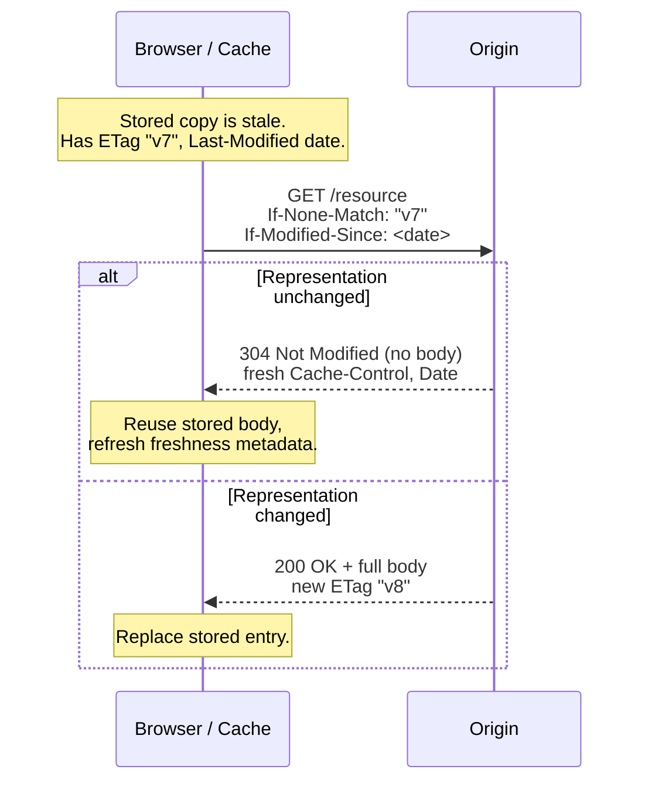
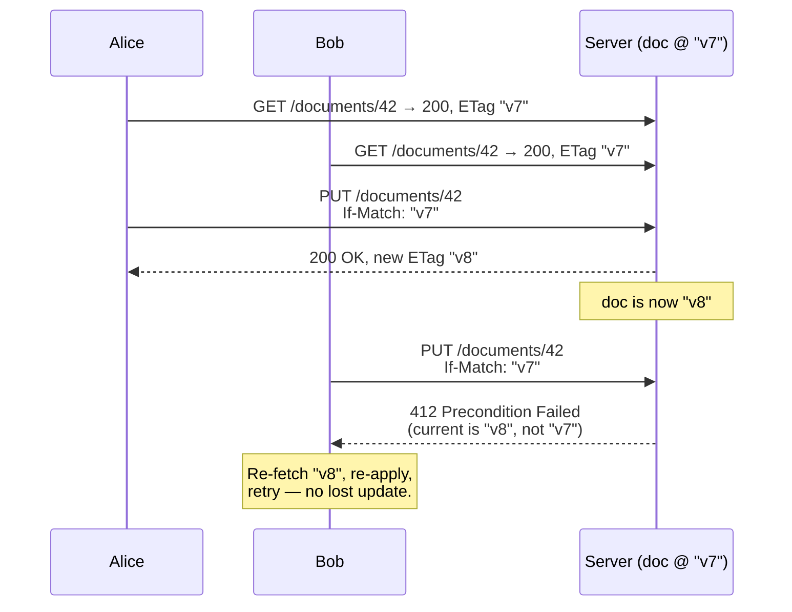

# Conditional Requests Overview

A conditional request is an ordinary HTTP request with an extra header that turns it into a question of the form *"do this, but only if the resource is in the state I think it is."* The server evaluates a **precondition** against the current representation of the resource and either proceeds normally or short-circuits with a special status code — `304 Not Modified` for the caching family, `412 Precondition Failed` for the concurrency family. That single mechanism underpins two things that look unrelated on the surface but are the same idea underneath: **making caches cheap** (don't re-download bytes that haven't changed) and **making writes safe** (don't overwrite a change you never saw).

This chapter is the map. It defines the two building blocks — *validators* and *precondition headers* — explains the two problem domains they serve, and lays out the precedence rules the server must follow when a client sends more than one precondition at once. The five individual headers each have their own deep-dive page: [If-None-Match](./If-None-Match.md), [If-Modified-Since](./If-Modified-Since.md), [If-Match](./If-Match.md), [If-Unmodified-Since](./If-Unmodified-Since.md), and [If-Range](./If-Range.md). Read this first; it is the model that makes the other five obvious.

## Validators: the two ways to fingerprint a representation

A **validator** is a compact token that identifies a *specific version* of a resource's representation. When the client holds a validator from a previous response, it can hand it back to ask "is this still current?" HTTP defines exactly two validators.

### ETag — the entity tag (a content fingerprint)

An [`ETag`](../06-Caching-Headers/ETag.md) is an opaque string the origin assigns to a representation — typically a hash of the body, a version counter, or a storage-layer revision id. It is the **strong** validator: two responses with the same `ETag` are guaranteed to be byte-for-byte identical (for a strong tag). ETags come in two flavors:

- **Strong** — `ETag: "a1b2c3"`. Byte-for-byte identity. Usable for range requests and any comparison.
- **Weak** — `ETag: W/"a1b2c3"`. "Semantically equivalent but maybe not byte-identical" — e.g. the same article rendered with a different timestamp comment, or a gzipped vs. brotli-encoded variant that means the same thing. Weak tags are fine for cache revalidation but **must not** be used where byte identity matters (like resuming a partial download).

```http
HTTP/1.1 200 OK
ETag: "33a64df551425fcc55e4d42a148795d9f25f89d4"
Content-Type: application/json
```

### Last-Modified — the timestamp (a coarse clock)

A [`Last-Modified`](../06-Caching-Headers/Last-Modified.md) header carries an HTTP-date of when the representation last changed:

```http
HTTP/1.1 200 OK
Last-Modified: Tue, 07 Jul 2026 10:15:00 GMT
Content-Type: application/json
```

`Last-Modified` is the **weaker** validator, and its weakness is structural: HTTP-date has **one-second granularity**. If a resource changes twice within the same second, both changes carry the same `Last-Modified` value, and a client caching after the first change will never learn about the second. It is also only as trustworthy as the origin's clock and file-mtime semantics. Prefer `ETag` when you can compute one; fall back to `Last-Modified` for static files where the filesystem mtime is free and good enough.

> **Rule of thumb:** send *both* when cheap (static file servers do this automatically). The client will use the stronger `ETag` path; `Last-Modified` is the graceful fallback and also feeds heuristic freshness in [Cache-Control](../06-Caching-Headers/Cache-Control.md).

## Precondition headers: the five questions

Each precondition header pairs a validator (or the wildcard `*`) with a comparison, and each is designed for either **safe methods** (GET/HEAD — reading) or **unsafe methods** (PUT/PATCH/DELETE/POST — writing). This split is the single most important thing to internalize.

| Header | Validator | Passes when | Fails with | Designed for |
|---|---|---|---|---|
| [`If-None-Match`](./If-None-Match.md) | ETag | resource does **not** match any listed tag | `304` (safe) / `412` (unsafe) | cache revalidation; create-if-absent |
| [`If-Modified-Since`](./If-Modified-Since.md) | date | resource changed **after** the date | `304` | cache revalidation (GET/HEAD only) |
| [`If-Match`](./If-Match.md) | ETag | resource **matches** a listed tag | `412` | optimistic concurrency (writes) |
| [`If-Unmodified-Since`](./If-Unmodified-Since.md) | date | resource **not** changed since the date | `412` | optimistic concurrency (writes) |
| [`If-Range`](./If-Range.md) | ETag or date | resource unchanged → send range; else send full | `200` (full body) | resumable/partial downloads |

The symmetry is deliberate. `If-None-Match` and `If-Match` are ETag-based mirror images; `If-Modified-Since` and `If-Unmodified-Since` are the date-based mirror images. The "None" / "Un-" prefixes flip the sense of the test so it matches the use case: readers want to proceed only when something is *different* (else give me a cheap 304); writers want to proceed only when nothing is *different* (else reject me to prevent a lost update).

## Use case 1 — Cache revalidation (safe methods → 304)

When a browser or shared cache holds a stored-but-stale response (its [`Cache-Control`](../06-Caching-Headers/Cache-Control.md) freshness lifetime has elapsed, or it carries `no-cache`), it does not blindly re-download. It sends a **conditional GET** carrying the validators it stored: `If-None-Match` with the old `ETag` and/or `If-Modified-Since` with the old `Last-Modified`. The question is "has this changed since the copy I have?"

- If **unchanged**, the origin returns `304 Not Modified` **with no body** — just fresh headers (updated `Cache-Control`, `Date`, sometimes a new `ETag`). The cache refreshes its metadata and serves the body it already had. A 40 KB asset becomes a ~200-byte round trip.
- If **changed**, the origin returns a normal `200 OK` with the new body and new validators. The cache stores the new entry.

```http
GET /assets/logo.svg HTTP/1.1
Host: example.com
If-None-Match: "svg-v7-a1b2c3"
If-Modified-Since: Tue, 07 Jul 2026 10:15:00 GMT
```

```http
HTTP/1.1 304 Not Modified
ETag: "svg-v7-a1b2c3"
Cache-Control: public, max-age=300
Date: Tue, 07 Jul 2026 11:00:00 GMT
```



The two revalidation headers can be sent together, and the precedence rule below decides which wins.

## Use case 2 — Optimistic concurrency (unsafe methods → 412)

The **lost-update problem**: Alice and Bob both GET version 7 of a document. Alice edits and PUTs version 8. Bob, still editing his copy of version 7, PUTs — and silently obliterates Alice's change. Neither the server nor Bob ever noticed. This is the canonical read-modify-write race, and it exists in any system with concurrent writers and no locking.

Optimistic concurrency control (OCC) fixes it without locks. The client sends its write **conditioned on the version it read**: `If-Match: "v7"` (ETag) or `If-Unmodified-Since: <date>`. The server applies the write **only if** the current version still matches. Otherwise it returns `412 Precondition Failed` and changes nothing. Bob gets the 412, re-fetches version 8, re-applies his edit (or surfaces a merge UI), and retries.

```http
PUT /documents/42 HTTP/1.1
Host: example.com
If-Match: "v7"
Content-Type: application/json

{ "title": "Updated title" }
```

```http
HTTP/1.1 412 Precondition Failed
Content-Type: application/json

{ "error": "stale_write", "currentVersion": "v8" }
```



The wildcard `*` gives two extra idioms on writes:

- `If-Match: *` — "proceed only if the resource **exists**." Passes if any current representation exists, fails `412` if not. Guards a PUT/PATCH meant strictly to *update*.
- `If-None-Match: *` — "proceed only if the resource does **not** exist." The standard **create-if-absent / exclusive-create** primitive: a PUT with `If-None-Match: *` succeeds (`201`) only if nothing is there, else `412`. This is how you build safe "create, don't clobber" endpoints.

## Precedence rules (which precondition wins)

RFC 9110 §13.2.2 defines a strict evaluation order so servers behave predictably when a client sends several preconditions. Evaluate in this order and **stop at the first one that determines the outcome**:

1. **`If-Match`** — if present, evaluate it. If it fails → `412`, stop. If it passes, continue.
2. **`If-Unmodified-Since`** — evaluated **only if `If-Match` is absent**. If it fails → `412`, stop.
3. **`If-None-Match`** — if present, evaluate it. If it fails, respond `304` (for GET/HEAD) or `412` (for other methods), stop.
4. **`If-Modified-Since`** — evaluated **only if `If-None-Match` is absent**, and **only for GET/HEAD**. If it fails (not modified) → `304`.
5. **`If-Range`** — evaluated last, only when a [`Range`](../13-Range-Requests/Range.md) header is also present.

Two consequences fall out of this ordering, and both are exam-favorite gotchas:

- **`If-None-Match` beats `If-Modified-Since`.** If a client sends both (which caches routinely do), the server evaluates `If-None-Match` and **ignores `If-Modified-Since` entirely**. The ETag is authoritative; the date is only the fallback for when no ETag was available. This is why sending both is safe — you get strong-validator correctness when the origin has an ETag, and date-based behavior otherwise. It also neatly sidesteps the one-second-granularity bug: if the origin emits ETags, the coarse date never gets a vote.
- **`If-Match` beats `If-Unmodified-Since`** the same way, for the write side.

A clean mental grouping: **ETag validators (steps 1, 3) always take precedence over their date-based counterparts (steps 2, 4).** Strong beats weak.

## Where this sits in the stack

Conditional requests are the connective tissue between [`Cache-Control`](../06-Caching-Headers/Cache-Control.md) (which decides *when* revalidation happens) and the validators [`ETag`](../06-Caching-Headers/ETag.md) / [`Last-Modified`](../06-Caching-Headers/Last-Modified.md) (which decide *how* the comparison is made). `Cache-Control: no-cache` on a response is a standing instruction to *always revalidate*, and revalidation is precisely a conditional GET. On the write side, they are the HTTP-native expression of OCC — the same versioned-write pattern you see in databases (`UPDATE ... WHERE version = ?`), but pushed out to the API boundary so clients participate. And on the transfer side, [`If-Range`](./If-Range.md) ties the mechanism into [`Range`](../13-Range-Requests/Range.md) requests so a resumed download never stitches together bytes from two different versions of a file.

## Best practices at a glance

- [ ] Emit an [`ETag`](../06-Caching-Headers/ETag.md) on any resource that will be revalidated or written concurrently; add [`Last-Modified`](../06-Caching-Headers/Last-Modified.md) when it's free (static files).
- [ ] Send both `If-None-Match` and `If-Modified-Since` on cache revalidation; let precedence pick the winner.
- [ ] Require `If-Match` (or `If-Unmodified-Since`) on PUT/PATCH/DELETE for any resource multiple clients can edit — return `412` on mismatch, never a silent overwrite.
- [ ] Use `If-None-Match: *` for exclusive create; `If-Match: *` for update-only.
- [ ] Prefer strong ETags for writes and ranges; weak ETags are fine for cache revalidation only.
- [ ] Ensure `304` responses carry **no body** and refresh caching metadata; ensure `412` responses **mutate nothing**.

## Related pages

- [If-None-Match](./If-None-Match.md), [If-Modified-Since](./If-Modified-Since.md) — the revalidation (read) family.
- [If-Match](./If-Match.md), [If-Unmodified-Since](./If-Unmodified-Since.md) — the concurrency (write) family.
- [If-Range](./If-Range.md) — conditional range requests.
- [ETag](../06-Caching-Headers/ETag.md), [Last-Modified](../06-Caching-Headers/Last-Modified.md) — the validators.
- [Cache-Control](../06-Caching-Headers/Cache-Control.md) — decides when revalidation is triggered.
- [Range](../13-Range-Requests/Range.md) — partial transfers that `If-Range` guards.
