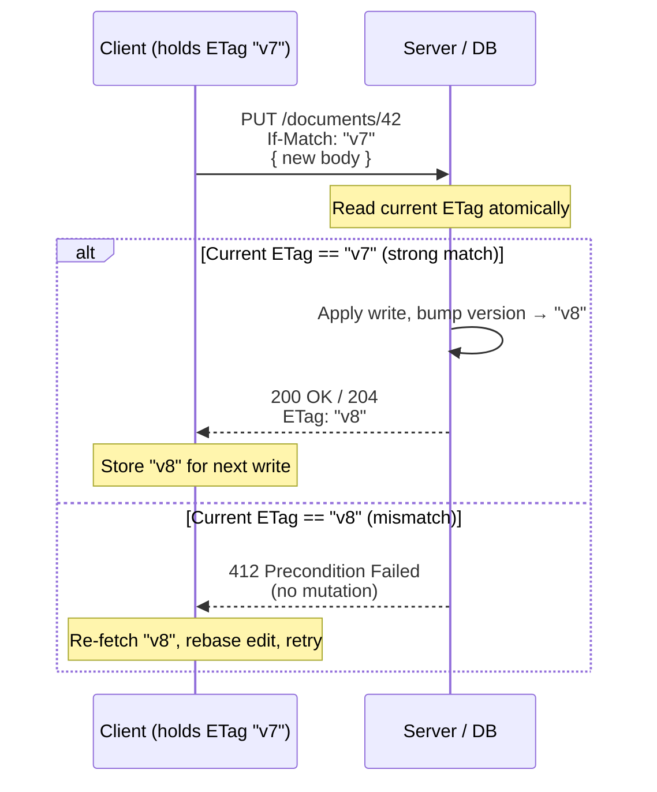
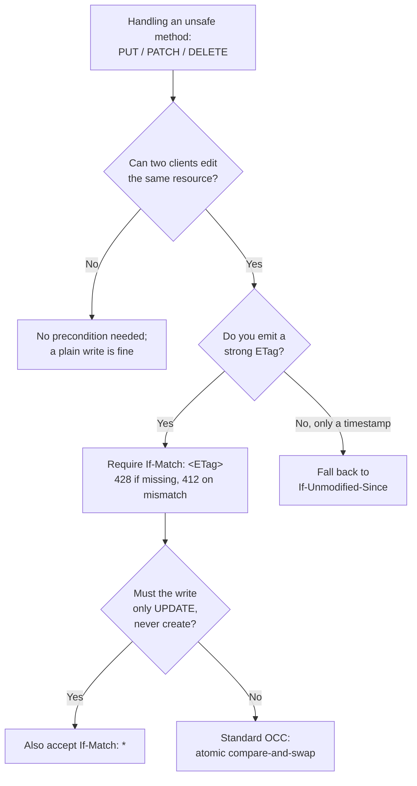

# If-Match

## Quick Summary

`If-Match` is a **request** precondition header sent by a client on an *unsafe* method (PUT, PATCH, DELETE, and occasionally POST) that says: *"apply this write only if the resource's current version matches one of these [`ETag`](../06-Caching-Headers/ETag.md) values I hold."* It is the HTTP-native primitive for **optimistic concurrency control (OCC)** — the compare-and-swap that prevents the *lost-update problem*, where two clients read the same version, both edit it, and the second write silently clobbers the first. If the current representation does not match, the server changes **nothing** and returns `412 Precondition Failed`. The wildcard form `If-Match: *` means "proceed only if the resource exists at all," which turns a PUT into an *update-only* operation. It is the write-side mirror image of [`If-None-Match`](./If-None-Match.md), and the ETag-based counterpart of [`If-Unmodified-Since`](./If-Unmodified-Since.md).

## What problem does this header solve?

The **lost update** is the canonical read-modify-write race, and it appears in every system with concurrent writers and no locking. Concretely: Alice opens document 42 (version `"v7"`) in a browser tab. Bob opens the same document, also version `"v7"`. Alice fixes a typo and saves — the server now holds `"v8"`. Bob, working from his stale copy, saves his own edit a minute later. Without a precondition, Bob's `PUT` overwrites the whole document with a body built from `"v7"`, and Alice's typo fix vanishes. Nobody gets an error. Nobody notices until the data is wrong in production.

`If-Match` solves this by making the write **conditional on the version the client actually read**. Bob's client sends `If-Match: "v7"`. The server compares `"v7"` against the current version `"v8"`, sees they differ, and rejects the write with `412` — mutating nothing. Bob's client can now re-fetch `"v8"`, re-apply his change on top of Alice's, and retry. The database analogue is `UPDATE ... SET ... WHERE version = 7`: the write only lands if the row is still at the version you read. `If-Match` pushes that exact guarantee out to the HTTP boundary so untrusted, distributed clients participate in it.

It also solves a second, subtler problem: **accidental creation**. A plain `PUT /documents/42` will happily *create* the resource if it does not exist. When you mean strictly "update an existing thing," `If-Match: *` fails with `412` if there is nothing there, turning PUT into a pure update.

## Why was it introduced?

Conditional requests were part of HTTP/1.1 from the beginning (RFC 2068, 1997; RFC 2616, 1999), which defined `If-Match` alongside `If-None-Match`, `If-Modified-Since`, and `If-Unmodified-Since`. The design recognized that the web is a massively concurrent, stateless, multi-client system where server-side locks are impractical — you cannot hold a database row lock open across a human's editing session that might last minutes. HTTP needed a *lockless* concurrency strategy, and optimistic concurrency (assume writes rarely conflict; detect the rare conflict at commit time) is the natural fit for a request/response protocol.

The precise, current semantics live in **RFC 9110 §13.1.1 (HTTP Semantics, 2022)**, which supersedes RFC 7232 and RFC 2616. RFC 9110 specifies that `If-Match` uses **strong comparison** — weak ETags (`W/"..."`) never match under `If-Match` — because a write that mutates bytes must be gated on byte-exact identity, not mere semantic equivalence. It also nails down that when the precondition fails, the server responds `412` and performs no side effects, and that a server *should* also evaluate `If-Match` before acting on the request body.

## How does it work?

The server extracts the resource's current strong `ETag`, then compares it against the tag(s) in `If-Match` using **strong comparison** (see the comparison rules below). If any listed tag matches, the precondition passes and the method proceeds normally. If none match — or if `If-Match: *` is sent and the resource does not exist — the server returns `412 Precondition Failed` and makes no change.

- **Browser behavior:** Browsers do not generate `If-Match` automatically. It is set explicitly by application code (`fetch`/`axios`) that has retained an `ETag` from a prior `GET`. The browser simply transmits the header you set; it has no special OCC logic of its own.
- **Server behavior:** The origin is where the comparison happens and where correctness lives. It must read the current version, do a strong comparison, and — critically — perform the read-compare-write as an **atomic** operation (see Common Mistakes) or the race it is meant to prevent leaks back in between the check and the write.
- **Proxy behavior:** Forward proxies pass `If-Match` through untouched. It is an end-to-end request header meant for the origin; a cache has no business evaluating a write precondition.
- **CDN behavior:** CDNs forward `If-Match` to the origin. Writes (PUT/PATCH/DELETE) are not cacheable, so the CDN is a transparent pipe here. It must not strip the header.
- **Reverse proxy behavior:** Nginx/HAProxy pass it upstream by default. The one gotcha is that a reverse proxy or WAF that rewrites request bodies or buffers/retries requests must not silently replay a conditional write — a replay after a `412` could produce surprising behavior.



### Strong vs weak comparison

`If-Match` mandates **strong comparison**: two ETags match only if both are strong (no `W/` prefix) and their opaque strings are byte-for-byte equal. A weak tag (`W/"abc"`) never satisfies `If-Match`, even against an identical `W/"abc"` — because weak tags only promise *semantic* equivalence, and a mutation must be gated on exact-byte identity. This is the opposite policy from [`If-None-Match`](./If-None-Match.md), which uses weak comparison because cache revalidation only cares whether the content is "good enough" to reuse. If your origin only ever emits weak ETags, `If-Match` can never pass — a real footgun. Emit **strong** ETags on any resource clients will write concurrently.

## HTTP Request Example

A conditional update, gated on the version the client read:

```http
PUT /api/documents/42 HTTP/1.1
Host: api.example.com
If-Match: "v7-a1b2c3"
Content-Type: application/json
Authorization: Bearer eyJhbGci...

{ "title": "Q3 Report (final)", "body": "..." }
```

Multiple acceptable versions (rare, but legal — e.g. a client that will accept either of two known-good revisions):

```http
DELETE /api/documents/42 HTTP/1.1
Host: api.example.com
If-Match: "v7-a1b2c3", "v6-99ffee"
```

Update-only guard — succeed only if the resource already exists:

```http
PUT /api/documents/42 HTTP/1.1
Host: api.example.com
If-Match: *
Content-Type: application/json

{ "title": "must already exist" }
```

## HTTP Response Example

Success — the version matched, the write landed, and the server returns the **new** validator so the client can chain its next write:

```http
HTTP/1.1 200 OK
Content-Type: application/json
ETag: "v8-d4e5f6"

{ "id": 42, "title": "Q3 Report (final)", "version": 8 }
```

Conflict — the current version was `"v8"`, not `"v7"`. The server mutated nothing and, as a courtesy, tells the client the current state:

```http
HTTP/1.1 412 Precondition Failed
Content-Type: application/json
ETag: "v8-d4e5f6"

{ "error": "stale_write", "message": "Resource was modified by another client.", "currentVersion": "v8-d4e5f6" }
```

## Express.js Example

```js
const express = require('express');
const crypto = require('crypto');
const app = express();
app.use(express.json());

// Compute a STRONG ETag from the stored representation. Strong is mandatory:
// If-Match uses strong comparison, so a weak tag here would make every write 412.
function strongEtag(doc) {
  const json = JSON.stringify(doc);
  return '"' + crypto.createHash('sha1').update(json).digest('base64') + '"';
}

// GET hands the client the current validator so it can later condition a write on it.
app.get('/api/documents/:id', async (req, res) => {
  const doc = await db.getDocument(req.params.id);
  if (!doc) return res.status(404).end();
  res.set('ETag', strongEtag(doc));          // client stores this to send back as If-Match
  res.set('Cache-Control', 'no-cache');       // always revalidate; this is mutable data
  res.json(doc);
});

app.put('/api/documents/:id', async (req, res) => {
  const ifMatch = req.headers['if-match'];

  // OCC policy decision: REQUIRE a precondition on concurrent-write resources.
  // Refusing unconditional writes is what actually prevents the lost update —
  // an optional If-Match that clients forget to send buys you nothing.
  if (!ifMatch) {
    return res.status(428).json({          // 428 Precondition Required (RFC 6585)
      error: 'precondition_required',
      message: 'Send If-Match with the ETag you read.',
    });
  }

  // The read-compare-write MUST be atomic. Doing getDocument() here, comparing in
  // Node, then updateDocument() later reintroduces the exact race we are preventing:
  // another client can slip a write in between. Push the compare into the storage
  // engine's conditional update (WHERE etag = ? / a transaction / a CAS operation).
  const current = await db.getDocument(req.params.id);

  if (ifMatch.trim() === '*') {
    // Update-only semantics: the resource must already exist.
    if (!current) return res.status(412).json({ error: 'not_found_for_update' });
  } else if (!current) {
    return res.status(404).end();
  } else {
    const currentTag = strongEtag(current);
    // Parse the (possibly comma-separated) list and strong-compare each entry.
    const tags = ifMatch.split(',').map(t => t.trim());
    // Reject weak tags outright: W/"..." can never satisfy If-Match.
    const matched = tags.some(t => !t.startsWith('W/') && t === currentTag);
    if (!matched) {
      res.set('ETag', currentTag);          // tell the client the version they missed
      return res.status(412).json({
        error: 'stale_write',
        currentVersion: currentTag,
      });
    }
  }

  // Perform the write as a conditional update keyed on the version we validated.
  // db.updateIfVersion returns null if another writer beat us between read and write.
  const updated = await db.updateIfVersion(req.params.id, current?.version, req.body);
  if (!updated) {
    // Lost the race at the storage layer — surface it as 412, same as a header mismatch.
    return res.status(412).json({ error: 'stale_write' });
  }

  res.set('ETag', strongEtag(updated));      // new validator for the client's next write
  res.json(updated);
});

app.listen(3000);
```

The load-bearing details: the `428` response *forces* clients to participate in OCC instead of leaving `If-Match` optional; the strong-tag computation is what makes the comparison valid at all; rejecting `W/`-prefixed tags upholds the strong-comparison rule; and `db.updateIfVersion` (a conditional/atomic update) is what closes the time-of-check-to-time-of-use gap that a naive read-then-write in application code would leave open.

## Node.js Example

The raw `http` module gives you nothing for free — no body parsing, no ETag, no precondition handling. The mechanics are identical; you just wire them by hand:

```js
const http = require('http');
const crypto = require('crypto');

const strongEtag = doc =>
  '"' + crypto.createHash('sha1').update(JSON.stringify(doc)).digest('base64') + '"';

http.createServer((req, res) => {
  if (req.method === 'PUT' && req.url.startsWith('/api/documents/')) {
    const id = req.url.split('/').pop();
    const ifMatch = req.headers['if-match'];
    if (!ifMatch) {
      res.statusCode = 428;                   // Precondition Required
      return res.end(JSON.stringify({ error: 'precondition_required' }));
    }

    let body = '';
    req.on('data', c => (body += c));
    req.on('end', async () => {
      const current = await db.getDocument(id);
      if (!current) { res.statusCode = 404; return res.end(); }

      const currentTag = strongEtag(current);
      const matched = ifMatch.split(',').map(t => t.trim())
        .some(t => !t.startsWith('W/') && t === currentTag);

      if (!matched) {
        res.statusCode = 412;                 // no mutation on failure
        res.setHeader('ETag', currentTag);
        return res.end(JSON.stringify({ error: 'stale_write', currentVersion: currentTag }));
      }

      const updated = await db.updateIfVersion(id, current.version, JSON.parse(body));
      if (!updated) { res.statusCode = 412; return res.end(); }
      res.setHeader('ETag', strongEtag(updated));
      res.setHeader('Content-Type', 'application/json');
      res.end(JSON.stringify(updated));
    });
    return;
  }
  res.statusCode = 404;
  res.end();
}).listen(3000);
```

The contrast with Express is only ergonomic (manual body accumulation, manual status codes). The OCC contract — strong compare, no mutation on `412`, atomic conditional write — is identical and equally your responsibility.

## React Example

React never touches `If-Match` at the framework level; it has no notion of HTTP headers. The header lives in your data layer, and the essential job of the UI is to **retain the `ETag` from the read and send it back on the write**:

```jsx
function useDocument(id) {
  const [doc, setDoc] = React.useState(null);
  const etagRef = React.useRef(null);          // hold the validator across renders

  React.useEffect(() => {
    fetch(`/api/documents/${id}`)
      .then(r => { etagRef.current = r.headers.get('ETag'); return r.json(); })
      .then(setDoc);
  }, [id]);

  async function save(next) {
    const res = await fetch(`/api/documents/${id}`, {
      method: 'PUT',
      headers: {
        'Content-Type': 'application/json',
        'If-Match': etagRef.current,           // condition the write on what we read
      },
      body: JSON.stringify(next),
    });

    if (res.status === 412) {
      // Another user saved first. Do NOT clobber — surface a conflict to the user.
      const server = await res.json();
      return { conflict: true, currentVersion: server.currentVersion };
    }
    etagRef.current = res.headers.get('ETag'); // chain: store the new version for next save
    setDoc(await res.json());
    return { conflict: false };
  }

  return { doc, save };
}
```

The `412` branch is the entire point: a collaborative editor turns it into a "this document changed — reload or merge?" prompt instead of a silent overwrite. Note that `fetch` only exposes `ETag` via `response.headers.get('ETag')` for **same-origin** requests, or cross-origin when the server sends `Access-Control-Expose-Headers: ETag` — a common reason `etagRef.current` mysteriously comes back `null` in a CORS setup.

## Browser Lifecycle

1. **Read.** Application code issues `GET`; the browser returns the response and the code stores the `ETag` (the browser's HTTP cache may *also* store it independently, but that copy is not exposed to your JS unless you read the header).
2. **Edit.** The user modifies data locally; the retained `ETag` is unchanged and still represents the version the edit is based on.
3. **Write.** Code issues `PUT`/`PATCH`/`DELETE` with `If-Match: <stored ETag>`. The browser transmits it verbatim — it performs no comparison and caches nothing (unsafe methods are not cacheable).
4. **Success (`2xx`).** The response carries a new `ETag`; the code replaces its stored validator so the *next* write is conditioned on the new version.
5. **Conflict (`412`).** The browser surfaces the status to your code with no special handling. Your app must re-fetch and reconcile. The browser also **invalidates** cached entries for the URL on a non-error unsafe response, but a `412` is not a successful write, so nothing changed to invalidate.

## Production Use Cases

- **Collaborative document / config editing:** Notion-style docs, feature-flag dashboards, CMS entries — anywhere two humans can edit the same record. `If-Match` turns concurrent saves into detectable conflicts instead of silent data loss.
- **REST APIs with safe updates:** Any `PUT`/`PATCH` on a mutable resource. Return the `ETag` on `GET`, require `If-Match` on write, `412` on mismatch. This is the standard contract for well-behaved APIs (Stripe, GitHub, and Google APIs all support ETag-conditioned writes).
- **Distributed key-value / object stores:** S3 supports conditional writes with `If-Match`; DynamoDB, etcd, and CouchDB expose the same compare-and-swap so clients avoid clobbering concurrent updates.
- **Idempotent DELETE with a guard:** `DELETE` with `If-Match: "v7"` deletes only if the resource is still the version you saw — preventing "delete the thing someone just replaced."
- **Update-only endpoints:** `If-Match: *` ensures a `PUT` updates but never creates, useful when creation must go through a different, validated path.

## Common Mistakes

- **Non-atomic read-compare-write.** The single most dangerous bug: `GET` the current version, compare the ETag in application code, then `UPDATE`. Between the compare and the update, another writer can commit — reopening the exact race `If-Match` exists to close (a TOCTOU bug). The comparison must be part of the atomic write: `UPDATE ... WHERE version = ?`, a DB transaction, or a storage-native compare-and-swap.
- **Emitting only weak ETags.** `If-Match` uses strong comparison; a `W/"..."` tag can never match, so *every* conditional write fails `412` and writers are permanently locked out. Emit strong ETags on writable resources.
- **Making `If-Match` optional.** If clients can `PUT` without it, they will — and you have no protection. Enforce it with `428 Precondition Required` on writable resources.
- **Mutating on `412`.** Some handlers do partial work (log, increment a counter, send an event) before checking the precondition. A failed precondition must leave the system exactly as it was; do the check first.
- **Returning `409 Conflict` instead of `412`.** `412 Precondition Failed` is the spec-correct status for a failed request precondition. `409` is for higher-level conflicts (e.g. a business-rule conflict). Mixing them confuses clients written to the standard.
- **Losing the ETag across a CORS boundary.** Forgetting `Access-Control-Expose-Headers: ETag` means the browser hides the header from JS, so clients send `If-Match: null`. Every write then fails.
- **Comparing the whole header string against one tag** without splitting on commas — a multi-tag `If-Match` then never matches.

## Security Considerations

- **`If-Match` is an integrity control, not an authorization control.** It prevents *accidental* overwrites between cooperating clients; it does not stop a malicious client. An attacker who can read the current `ETag` can always satisfy `If-Match`. Never treat a passing precondition as authentication or authorization — enforce those separately (`Authorization`, ownership checks).
- **ETag as an information channel.** If your ETag is a predictable version counter, it leaks how often a resource changes; if it is a hash of the body, it can confirm whether an attacker's guessed content matches (a theoretical oracle for very small resources). Prefer opaque, salted tags for sensitive resources.
- **Denial of service via forced conflicts.** In a hot-write resource, a flood of stale `If-Match` writes will all `412` — cheap to reject, but ensure your `412` path is genuinely side-effect-free so it cannot be used to exhaust resources.
- **Request replay.** A proxy/WAF that retries requests could replay a conditional write. Because the second attempt carries the now-stale ETag, it will `412` — which is actually the safe outcome, but rely on it deliberately rather than by accident.

## Performance Considerations

- **OCC is cheaper than locking under low contention.** No lock is held across the human editing session; the only cost is one extra comparison at write time. When conflicts are rare (the common case), this is essentially free and scales far better than pessimistic locks.
- **Conflicts cost a round trip.** Each `412` forces the client to re-fetch and retry, so under *high* contention on a single hot resource, OCC can thrash (many writers repeatedly losing the race). At that point consider sharding the resource, a queue/serialization point, or CRDT-style merges instead.
- **`412` responses are tiny and fast.** They carry no body work beyond an error message and short-circuit before any expensive write, so rejecting stale writes is much cheaper than performing and then rolling them back.
- **Strong ETag computation.** Hashing the body on every `GET` to produce a strong tag costs CPU; prefer a stored version counter or revision id (already strong and free) over hashing large payloads.

## Reverse Proxy Considerations

Nginx passes `If-Match` upstream untouched by default; the key is not to interfere with conditional writes:

```nginx
location /api/ {
    proxy_pass http://app_upstream;

    # Never cache unsafe methods; PUT/PATCH/DELETE must always reach the origin.
    proxy_cache_methods GET HEAD;              # (default) — excludes writes from caching

    # Do NOT retry a failed conditional write against another upstream: a retry could
    # land after the state changed and behave unexpectedly. Restrict retries to
    # connection errors only, never to non-idempotent request outcomes.
    proxy_next_upstream error timeout;         # not: http_412 / non_idempotent

    # Preserve request headers exactly; some WAF modules strip "unknown" headers.
    proxy_pass_request_headers on;
}
```

The essential rule: a shared cache or reverse proxy must treat a conditional write as opaque pass-through. It must not cache it, must not fabricate a `412`/`304`, and must not blindly retry it. If you run a WAF, verify it does not strip `If-Match` as an "uncommon" header.

## CDN Considerations

- **Writes bypass the cache.** `PUT`/`PATCH`/`DELETE` are not cacheable, so on the write path the CDN is a transparent proxy that must forward `If-Match` to the origin. Confirm your CDN does not drop it.
- **Cache invalidation after a write.** After a successful conditional `PUT`, the *cached* `GET` representation at the edge is now stale. Either the origin should emit a short `s-maxage`/`no-cache` so the next read revalidates, or you must purge the URL. A common bug: the write succeeds, but a CDN keeps serving the old body (and old `ETag`) to readers, who then send stale `If-Match` values and get spurious `412`s.
- **Edge object stores.** S3/R2-style conditional writes (`If-Match` on `PutObject`) are evaluated at the storage layer, giving you compare-and-swap semantics directly at the edge — useful for edge-computed state without a central DB.

## Cloud Deployment Considerations

- **API Gateways (AWS API Gateway, Apigee, Kong):** ensure the gateway forwards `If-Match` to the backend and does not strip it via a request-header allowlist. Gateways that cache responses must exclude write methods (they do by default) so a stale cached `ETag` is not handed to clients.
- **Load balancers (ALB, GCP LB):** pass `If-Match` through untouched; the risk is request **retries** on transient errors. Confirm the LB does not retry non-idempotent requests in a way that replays a conditional write against changed state.
- **Managed data stores:** DynamoDB conditional expressions (`attribute_exists`/version checks), Firestore transactions, Cosmos DB `_etag` + `If-Match` header — all expose the same OCC primitive. When your API sits in front of one, map the store's conditional-write failure directly onto a `412`.
- **Multi-region writes:** with replicated storage, the "current version" differs by region until replication converges. Route conditional writes to a primary or use the store's global conditional-write guarantee, or two regions can each accept a write that conflicts.

## Debugging

- **Chrome DevTools → Network:** inspect the write request's **Request Headers** for `If-Match`, and the **Response** status. A `412` here with a matching-looking ETag usually means a weak/strong mismatch or a whitespace/quoting difference in the tag.
- **curl:** reproduce a conflict deterministically —
  ```bash
  # Read the current validator
  ETAG=$(curl -sD - -o /dev/null https://api.example.com/api/documents/42 | grep -i '^etag:' | cut -d' ' -f2- | tr -d '\r')
  # Conditional update
  curl -i -X PUT https://api.example.com/api/documents/42 \
       -H "If-Match: $ETAG" -H 'Content-Type: application/json' \
       -d '{"title":"new"}'
  # Force a 412 by sending a stale tag
  curl -i -X PUT https://api.example.com/api/documents/42 \
       -H 'If-Match: "stale-v1"' -H 'Content-Type: application/json' -d '{}'
  ```
- **Postman / Bruno:** capture the `ETag` from a `GET` into an environment variable, then reference `{{etag}}` in the `If-Match` of the `PUT`. Bruno's git-based collections are handy for a versioned suite asserting `res.status === 412` on a deliberately stale tag.
- **Node.js / Express logging:** log both sides of the comparison —
  ```js
  console.log('If-Match:', req.headers['if-match'], 'current:', strongEtag(current));
  ```
  Nine times out of ten a mysterious `412` is a quoting (`"v7"` vs `v7`), whitespace, or weak-prefix discrepancy visible instantly in this log.

## Best Practices

- [ ] Emit a **strong** [`ETag`](../06-Caching-Headers/ETag.md) on every resource that clients can write concurrently.
- [ ] **Require** `If-Match` on `PUT`/`PATCH`/`DELETE` for those resources; return `428 Precondition Required` when it is missing.
- [ ] Perform the compare-and-write **atomically** at the storage layer (`WHERE version = ?` / transaction / CAS) — never read-then-write in application code.
- [ ] Return `412 Precondition Failed` (not `409`) on mismatch, and **mutate nothing** on that path.
- [ ] Include the current `ETag` in the `412` response so clients can rebase and retry cheaply.
- [ ] Return the new `ETag` on every successful write so clients can chain their next conditional write.
- [ ] Use `If-Match: *` for update-only endpoints that must not create.
- [ ] Reject weak (`W/`) tags for `If-Match`; expose `ETag` via CORS (`Access-Control-Expose-Headers: ETag`) when clients are cross-origin.

## Related Headers

- [If-None-Match](./If-None-Match.md) — the mirror image: proceed only if the resource does **not** match (create-if-absent, cache revalidation). `If-Match` and `If-None-Match` are the two ETag-based preconditions.
- [If-Unmodified-Since](./If-Unmodified-Since.md) — the date-based equivalent of `If-Match`: same write-guard purpose, but a coarse timestamp instead of a strong ETag. Use it only when no ETag is available; `If-Match` takes precedence when both are sent (RFC 9110 §13.2.2).
- [ETag](../06-Caching-Headers/ETag.md) — the validator `If-Match` compares against; **must be strong** for writes.
- [Last-Modified](../06-Caching-Headers/Last-Modified.md) — feeds `If-Unmodified-Since` when you fall back to date-based OCC.
- [Conditional Requests Overview](./Conditional-Requests-Overview.md) — the model that unifies all five precondition headers and defines their precedence.

## Decision Tree



## Mental Model

`If-Match` is the **"only if the shelf still holds the exact box I inspected"** rule at a warehouse. You (a client) inspect box `"v7"`, take notes, and go away to prepare a replacement. When you come back to swap it in, you tell the clerk: *"replace it — but only if the box on the shelf is still `"v7"`."* If someone already swapped in `"v8"` while you were away, the clerk refuses (`412`), hands nothing over, and tells you the shelf now has `"v8"`. You go re-inspect the new box, redo your work on top of it, and try again. Nobody's change is ever silently thrown away, and no clerk had to lock the whole aisle while you were out — the check happens at the instant of the swap, atomically, which is exactly why it works.
