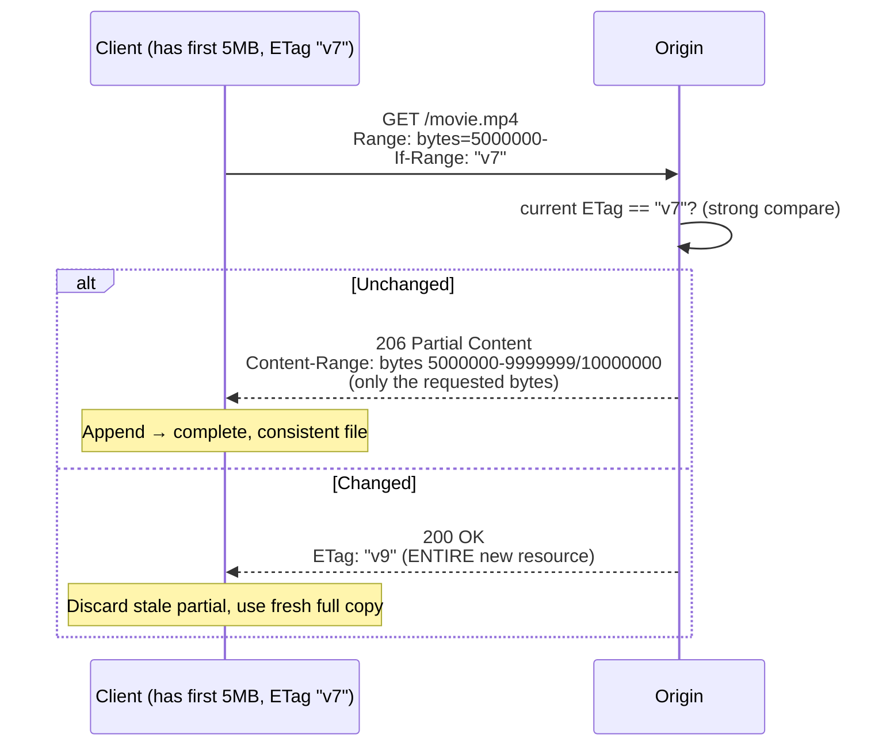
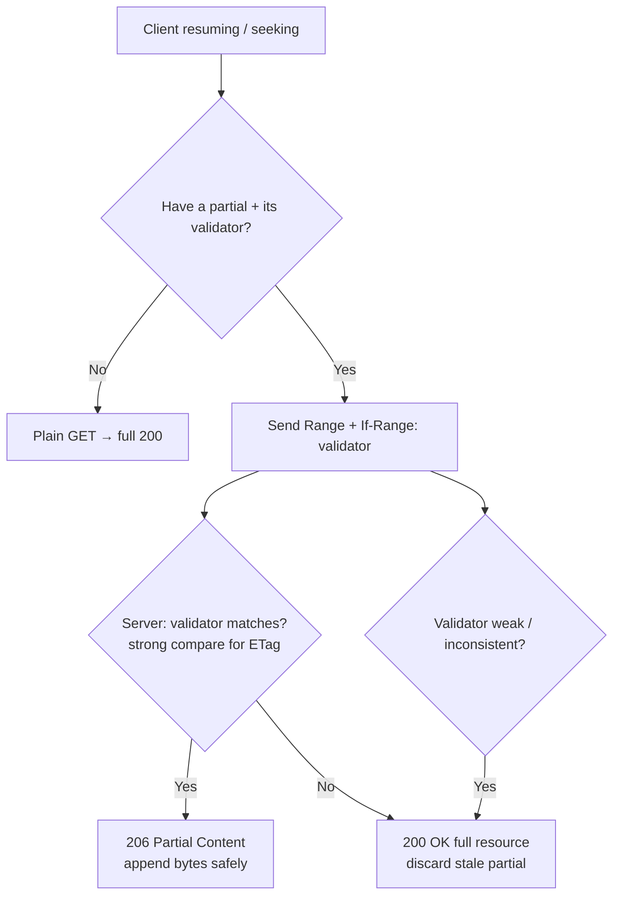

# If-Range

## Quick Summary

`If-Range` is a **request** header used **only together with** a [`Range`](../13-Range-Requests/Range.md) header, carrying either an [`ETag`](../06-Caching-Headers/ETag.md) or an HTTP date. It answers a single, precise question that resumable/partial downloads depend on: *"has the resource changed since I got the part I already have?"* If the validator still matches (the resource is unchanged), the server honors the `Range` and sends **`206 Partial Content`** — just the missing bytes, which stitch perfectly onto what the client holds. If the validator **doesn't** match (the resource changed), the server **ignores** the `Range` and sends the **entire** resource as `200 OK`, because gluing new bytes onto an old partial copy would produce a corrupt file. `If-Range` is the safety interlock of range requests: it makes "resume where I left off" an all-or-nothing, corruption-proof operation. It's what lets a download manager resume a half-downloaded ISO, a video player seek without re-fetching everything, and a paused upload/download pick back up — without the risk of splicing incompatible versions.

## What problem does this header solve?

Range requests let a client fetch *part* of a resource — bytes 5,000,000–10,000,000 of a video, or the remaining half of an interrupted download. But partial fetching has a lurking hazard: **what if the resource changed between the first part and the second?** Imagine a download manager grabbed the first 5 MB of `movie.mp4` yesterday, the file was re-encoded overnight, and today it requests "bytes 5 MB onward." If the server blindly sent bytes 5 MB+ of the *new* file, the client would concatenate the old first-half with the new second-half → a **corrupt, unplayable file**, with no error to signal it.

`If-Range` eliminates that hazard by making the range request **conditional on the resource being unchanged**. The client sends the validator ([`ETag`](../06-Caching-Headers/ETag.md) or [`Last-Modified`](../06-Caching-Headers/Last-Modified.md)) it saw when it fetched the first part. The server checks it:

- **Unchanged** → safe to send just the requested bytes (`206`); they belong to the same version.
- **Changed** → *unsafe* to send a partial; send the whole new resource (`200`) so the client discards its stale partial and starts clean.

This turns resume/seek from "risky splice" into "guaranteed-consistent continuation." Without it, clients would have to make two round-trips (first validate, then range) or risk corruption.

## Why was it introduced?

`If-Range` was introduced with HTTP/1.1's range-request machinery (RFC 2068, 1997; RFC 2616, 1999), specified today in **RFC 7233 (2014, "Range Requests")** and **RFC 9110 §13.1.5 (2022)**. Its explicit purpose in the spec is a **round-trip optimization**: without it, a cautious client resuming a download would have to do a conditional GET *first* (to check the resource hadn't changed) and *then* a separate range request — two requests. `If-Range` folds both into one: "give me these bytes **if** the version matches, **otherwise** give me the whole thing." One request handles both the common case (unchanged → efficient partial) and the exceptional case (changed → correct full download).

The spec is deliberate about **strong vs weak validators** here: an `If-Range` using an `ETag` must use a **strong** comparison (a weak `W/"..."` tag is *not* usable with `If-Range`, because weak equivalence doesn't guarantee byte-for-byte identity, and byte-splicing demands byte-exactness). Dates are inherently weak but permitted with an additional safety caveat (see How it works).

## How does it work?

`If-Range` is evaluated **only when a `Range` header is also present**; on its own it does nothing. The server compares the `If-Range` validator to the resource's current validator:



- **If `If-Range` uses an `ETag`:** compare with the **strong** function. Match → `206` with the requested range. No match → `200` full body. (A weak tag makes `If-Range` unusable → server sends full `200`.)
- **If `If-Range` uses a date:** if the resource's [`Last-Modified`](../06-Caching-Headers/Last-Modified.md) is *equal to or earlier than* the date **and** the origin considers that date a strong indicator (typically: the `Last-Modified` is at least a couple seconds older than the response `Date`, so sub-second changes can't hide), send `206`; otherwise `200`.

Behavior by tier:

- **Browser behavior:** Browsers set `If-Range` automatically when resuming an interrupted download or when the media stack seeks — they echo the validator from the partial they hold. Media elements (`<video>`/`<audio>`) rely on this for seeking. Your JS rarely sets it directly.
- **Server behavior:** The origin must evaluate `If-Range` *before* deciding `206` vs `200`, using strong comparison for ETags. It must send [`Content-Range`](../13-Range-Requests/Content-Range.md) on `206`.
- **Proxy behavior:** Forwards `If-Range`; a cache serving a `206` from a stored representation must ensure the stored version's validator matches.
- **CDN behavior:** CDNs support `If-Range` for range/seek; they compare against the cached object's validator and either serve the range from cache or revalidate/refetch. Byte-range caching + `If-Range` is central to video delivery.
- **Reverse proxy behavior:** Nginx honors `If-Range` for static files and byte-range serving, using strong validators.

## HTTP Request Example

Resuming a download with an ETag validator:

```http
GET /downloads/ubuntu.iso HTTP/1.1
Host: mirror.example.com
Range: bytes=524288000-
If-Range: "5f3a-strong-etag"
```

Resuming with a date validator:

```http
GET /downloads/ubuntu.iso HTTP/1.1
Host: mirror.example.com
Range: bytes=524288000-
If-Range: Tue, 01 Jul 2026 10:00:00 GMT
```

## HTTP Response Example

Unchanged → partial content (the requested tail only):

```http
HTTP/1.1 206 Partial Content
Content-Type: application/octet-stream
Content-Range: bytes 524288000-1048575999/1048576000
Content-Length: 524288000
ETag: "5f3a-strong-etag"
Accept-Ranges: bytes
```

Changed → full resource, `Range` ignored:

```http
HTTP/1.1 200 OK
Content-Type: application/octet-stream
Content-Length: 1150976000
ETag: "9b21-new-etag"
Accept-Ranges: bytes
```

## Express.js Example

Express/`express.static` and `res.sendFile` handle `If-Range` + `Range` for files automatically. For a custom handler (streaming from storage, generated content), you implement the interlock explicitly:

```js
const express = require('express');
const fs = require('fs');
const app = express();

app.get('/downloads/:file', (req, res) => {
  const path = `/data/${req.params.file}`;
  const stat = fs.statSync(path);
  // Strong validator for byte-range safety: size + a content-derived component.
  const etag = `"${stat.size}-${contentHash(path)}"`;
  const lastModified = stat.mtime.toUTCString();

  res.set('Accept-Ranges', 'bytes');
  res.set('ETag', etag);
  res.set('Last-Modified', lastModified);

  const range = req.headers['range'];
  const ifRange = req.headers['if-range'];

  // 1) Decide whether the client's partial is still valid.
  //    If-Range matches → honor Range (206). Else → send full 200.
  let honorRange = !!range;
  if (range && ifRange) {
    const validatorMatches = ifRange === etag                       // strong ETag match
      || (isHttpDate(ifRange) && Date.parse(ifRange) >= Date.parse(lastModified)); // date match
    honorRange = validatorMatches;   // mismatch → fall back to full response.
  }

  if (honorRange) {
    // 2) Parse "bytes=start-end" and stream just that slice as 206.
    const [startStr, endStr] = range.replace(/bytes=/, '').split('-');
    const start = parseInt(startStr, 10);
    const end = endStr ? parseInt(endStr, 10) : stat.size - 1;
    if (start >= stat.size || end >= stat.size || start > end) {
      return res.status(416).set('Content-Range', `bytes */${stat.size}`).end(); // unsatisfiable
    }
    res.status(206);
    res.set('Content-Range', `bytes ${start}-${end}/${stat.size}`);
    res.set('Content-Length', end - start + 1);
    return fs.createReadStream(path, { start, end }).pipe(res);
  }

  // 3) No range, or If-Range mismatch → whole resource, 200.
  res.set('Content-Length', stat.size);
  return fs.createReadStream(path).pipe(res);
});

app.listen(3000);
```

Idiomatic version (let Express do it):

```js
app.get('/downloads/:file', (req, res) => {
  // res.sendFile handles Range, If-Range, ETag, Last-Modified, 206/416 for you.
  res.sendFile(`/data/${req.params.file}`);
});
```

Why each piece matters: the validator check in step 1 is the whole safety mechanism — `honorRange` becomes `false` on a mismatch, which routes to the full-`200` path so the client never splices incompatible bytes. Using a **strong** ETag (size + content hash) matters because `If-Range` byte-splicing requires byte-exact identity; a weak tag would (correctly) force full responses. The `416` branch handles ranges past the end of the file. In practice, `res.sendFile`/`express.static` implement all of this — hand-code it only for custom sources.

## Node.js Example

Raw `http` with the same interlock:

```js
const http = require('http');
const fs = require('fs');

http.createServer((req, res) => {
  const path = '/data/movie.mp4';
  const stat = fs.statSync(path);
  const etag = `"${stat.size}-${stat.mtimeMs.toString(16)}"`; // strong-ish validator

  res.setHeader('Accept-Ranges', 'bytes');
  res.setHeader('ETag', etag);
  res.setHeader('Last-Modified', stat.mtime.toUTCString());

  const range = req.headers['range'];
  const ifRange = req.headers['if-range'];

  // If-Range mismatch (or no range) → serve the whole file as 200.
  const rangeValid = range && (!ifRange || ifRange === etag ||
    (Date.parse(ifRange) >= Date.parse(stat.mtime.toUTCString())));

  if (!rangeValid) {
    res.setHeader('Content-Type', 'video/mp4');
    res.setHeader('Content-Length', stat.size);
    return fs.createReadStream(path).pipe(res);
  }

  const [s, e] = range.replace('bytes=', '').split('-');
  const start = parseInt(s, 10);
  const end = e ? parseInt(e, 10) : stat.size - 1;
  res.writeHead(206, {
    'Content-Type': 'video/mp4',
    'Content-Range': `bytes ${start}-${end}/${stat.size}`,
    'Content-Length': end - start + 1,
  });
  fs.createReadStream(path, { start, end }).pipe(res);
}).listen(3000);
```

The essential logic: `If-Range` mismatch collapses to the full-`200` path; a match proceeds to `206`. Note that `<video>` seeking depends on exactly this working correctly.

## React Example

React never sets `If-Range` directly — the browser handles it in two invisible-but-critical scenarios your React app relies on:

1. **Media seeking.** When your React app renders a `<video src="...">` and the user drags the scrubber, the browser issues a `Range` request with `If-Range` (the validator of the bytes it already buffered). If the file is unchanged, it gets a `206` for the sought region; if it changed mid-playback, it gets a `200` and reloads. Your React code just renders the element — the seek machinery is browser-native.

```jsx
function VideoPlayer({ src }) {
  // The browser issues Range + If-Range requests for seeking automatically.
  // Your server must send Accept-Ranges + a strong ETag/Last-Modified for this to work.
  return <video src={src} controls preload="metadata" />;
}
```

2. **Resumable downloads / large-asset fetching.** If you build a download-resume feature (or use a library), the browser (or the fetch-based downloader) sends `If-Range` when resuming. For manual `fetch`-based chunking, you'd read `Response.headers.get('etag')` from the first chunk and send it as `If-Range` on subsequent ranged fetches, handling a `200` (full) response as "the file changed, restart."

3. **Why your server config matters more than your React code:** if your origin/CDN doesn't emit `Accept-Ranges` and a strong validator, seeking and resume silently degrade to full re-downloads. The fix is server-side, but the symptom (janky video scrubbing) shows up in the React UI.

## Browser Lifecycle

1. The client already holds part of a resource plus its validator ([`ETag`](../06-Caching-Headers/ETag.md) or [`Last-Modified`](../06-Caching-Headers/Last-Modified.md)).
2. To fetch more (resume/seek), the browser sends `Range: bytes=...` **and** `If-Range: <validator>`.
3. The server compares the validator (strong comparison for ETags).
4. **Match** → `206 Partial Content` with [`Content-Range`](../13-Range-Requests/Content-Range.md); the browser appends the bytes to what it has.
5. **Mismatch** → `200 OK` with the whole (new) resource; the browser discards its stale partial and uses the fresh full copy.
6. For media, this repeats per seek; for downloads, once per resume.

## Production Use Cases

- **Resumable large downloads:** ISOs, installers, datasets, backups — resume after a dropped connection without corruption risk.
- **Video/audio streaming and seeking:** `<video>`/`<audio>` scrubbing issues `Range` + `If-Range`; essential for smooth media UX.
- **Download managers / mobile apps:** resume on network changes (Wi-Fi ↔ cellular) safely.
- **Progressive PDF/document viewers:** fetch pages/regions on demand while guaranteeing version consistency.
- **CDN byte-range caching for media:** edges serve ranges from cached objects, using `If-Range` to guard against stale slices.

## Common Mistakes

- **Using a weak ETag with `If-Range`.** Weak tags can't guarantee byte-identity, so `If-Range` is unusable and the server (correctly) sends full `200`s — silently defeating resume/seek efficiency. Use **strong** validators for range-served resources.
- **Ignoring `If-Range` and always honoring `Range`.** Splicing new bytes onto an old partial → corrupt files. Always evaluate the validator first.
- **Missing `Accept-Ranges: bytes`.** Clients may not attempt ranges at all; ensure the server advertises range support.
- **Fleet-inconsistent validators.** Different nodes emitting different ETags/mtimes for identical bytes → `If-Range` mismatches on every resume → constant full re-downloads. Use content-derived, fleet-consistent validators.
- **Date `If-Range` without the safety margin.** If `Last-Modified` equals the response `Date` (sub-second-fresh), a change could hide within the same second; the spec's guidance is to treat such dates cautiously (prefer full response).
- **Sending `If-Range` without `Range`.** It's a no-op alone; both must be present.
- **Not handling `416 Range Not Satisfiable`** for out-of-bounds ranges.

## Security Considerations

- **Integrity is the point.** `If-Range` exists to prevent serving a corrupt (mixed-version) representation; treat weakening it (e.g. always honoring `Range`) as a data-integrity bug.
- **Range-based amplification / DoS.** Malicious clients can request many small or overlapping ranges to amplify server work; combine range handling with limits (max ranges per request, minimum range size) — historically, multi-range requests enabled amplification attacks (e.g. the Apache "Range header DoS"). `If-Range` isn't the cause, but range handling overall needs guardrails.
- **Validator disclosure.** As with `ETag`/`Last-Modified`, avoid encoding sensitive metadata (inode, exact edit times) into validators.
- **Not authorization.** Range/If-Range decisions must follow access checks; don't leak partial content to unauthorized clients because a validator matched.

## Performance Considerations

- **Saves a full round-trip.** `If-Range` collapses "validate then range" into one request — the core efficiency win over doing conditional GET + Range separately.
- **Enables efficient media & resume.** Seeking fetches only the needed region; resume fetches only the remainder — huge bandwidth savings for large media.
- **Strong validators keep hit ratio high.** Consistent strong ETags mean resumes succeed as `206` instead of degrading to full `200` downloads.
- **CDN byte-range caching** relies on this to serve popular media regions from the edge without re-pulling whole files.

## Reverse Proxy Considerations

Nginx handles `If-Range` for static/byte-range serving; the key is enabling range support and consistent validators:

```nginx
server {
  location /downloads/ {
    root /var/www;
    # Nginx sets Accept-Ranges, ETag (mtime+size), Last-Modified and honors
    # Range + If-Range for static files automatically.
    add_header Accept-Ranges bytes;
  }

  location /media/ {
    proxy_pass http://origin_upstream;
    proxy_cache media_cache;
    proxy_cache_valid 200 206 1d;         # cache both full and partial responses.
    proxy_force_ranges on;                # allow range/If-Range even from upstreams that omit Accept-Ranges.
    slice 1m;                             # split into 1MB slices for efficient range caching.
    proxy_set_header Range $slice_range;
    add_header X-Cache-Status $upstream_cache_status;
  }
}
```

Key points: the `slice` module + range caching is the standard way to cache large media efficiently; `If-Range` ensures slices belong to the same version. For a **multi-server** static fleet, mtime-based ETags can differ across nodes — serve from stable storage or content-hashed URLs so `If-Range` matches on resume regardless of which node answers.

## CDN Considerations

- **Byte-range caching is central to video delivery.** CDNs cache object slices and use `If-Range` to ensure a served range matches the client's held version; a validator change forces a full refetch.
- **Cloudflare/CloudFront/Fastly/Akamai** all support `Range`/`If-Range`; ensure your origin emits `Accept-Ranges: bytes` and a **strong**, stable `ETag` so edge range serving and client resume both work.
- **Cross-node validator consistency** is critical — inconsistent ETags across origin nodes break `If-Range` at the edge and cause repeated full pulls.
- **Some CDNs require enabling** range/slice features explicitly for large-file optimization; check vendor docs.

## Cloud Deployment Considerations

- **Object storage (S3/GCS/Azure Blob):** natively support `Range` and emit strong `ETag`s + `Last-Modified`, so `If-Range`-based resume/seek works out of the box — the recommended origin for large media/downloads.
- **API Gateways:** some buffer responses or don't support ranges well; verify range/`If-Range` pass-through for large-file endpoints (or serve those directly from object storage/CDN).
- **Load balancers:** pass `Range`/`If-Range` through; they don't interpret them.
- **Serverless:** streaming ranged responses from a function is limited by size/duration caps; prefer redirecting to object storage or a signed CDN URL for large files.

## Debugging

- **Chrome DevTools → Network:** a seek/resume shows a request with `Range` + `If-Range` and a `206` (partial) or `200` (changed) response; check `Content-Range` on the `206`. Media playback generates many such requests.
- **curl (resume):** `curl -sD - -o /dev/null -r 524288000- -H 'If-Range: "5f3a-strong-etag"' https://host/file.iso` — expect `206` if unchanged, `200` if the ETag no longer matches. curl's `-C -` auto-resumes and sets range/validators.
- **curl (date validator):** `curl -r 0-1023 -H 'If-Range: Tue, 01 Jul 2026 10:00:00 GMT' ...`.
- **Postman / Bruno:** set `Range` + `If-Range` manually; assert `206` and the `Content-Range` header, then change the resource and assert a `200`.
- **Node.js:** log `req.headers['range']` and `req.headers['if-range']` and the validator you compare against.
- **Media test:** scrub a `<video>` and watch DevTools for `206` responses; if you see full `200`s on every seek, your validator is weak/inconsistent or `Accept-Ranges` is missing.

## Best Practices

- [ ] Use a **strong**, fleet-consistent [`ETag`](../06-Caching-Headers/ETag.md) (or reliable [`Last-Modified`](../06-Caching-Headers/Last-Modified.md)) for any range-served resource.
- [ ] Always evaluate `If-Range` **before** honoring [`Range`](../13-Range-Requests/Range.md); mismatch → full `200`.
- [ ] Advertise [`Accept-Ranges: bytes`](../04-Response-Headers/Accept-Ranges.md) so clients attempt ranges.
- [ ] Send [`Content-Range`](../13-Range-Requests/Content-Range.md) on every `206`.
- [ ] Prefer `ETag` over date validators for `If-Range` (byte-exactness); if using dates, apply the sub-second safety margin.
- [ ] Handle `416 Range Not Satisfiable` for out-of-bounds ranges.
- [ ] Serve large media/downloads from object storage/CDN with strong validators for reliable resume/seek.
- [ ] Bound multi-range requests to avoid amplification/DoS.
- [ ] Enforce authorization before serving any range.

## Related Headers

- [Range](../13-Range-Requests/Range.md) — the partner header; `If-Range` guards it. Without `Range`, `If-Range` does nothing.
- [Content-Range](../13-Range-Requests/Content-Range.md) — describes which bytes a `206` contains.
- [Accept-Ranges](../04-Response-Headers/Accept-Ranges.md) — advertises range support to clients.
- [ETag](../06-Caching-Headers/ETag.md) — the strong validator `If-Range` prefers.
- [Last-Modified](../06-Caching-Headers/Last-Modified.md) — the date validator alternative.
- [If-None-Match](./If-None-Match.md) / [If-Modified-Since](./If-Modified-Since.md) — read revalidation; `If-Range` reuses their validators for a different purpose (guarding partials).
- [Range Requests Overview](../13-Range-Requests/Range-Requests-Overview.md) — the full partial-content model.
- [Conditional Requests Overview](./Conditional-Requests-Overview.md) — the precondition family.

## Decision Tree



## Mental Model

Think of `If-Range` as the rule a **jigsaw-puzzle factory** follows when you call to order "just the missing corner pieces" for a puzzle you're halfway through. You tell them the *box's edition code* (the validator) so they can check: is this still the *exact same puzzle print run* you've been assembling? If yes, they ship only the corner pieces you asked for (`206`), and they slot in perfectly with what's on your table. But if they've since reprinted the puzzle with a slightly different image (the resource changed), shipping you "the new corner pieces" would give you a table where half the pieces are from the old print and half from the new — a picture that never resolves. So instead they say "that edition's gone — here's the *whole new puzzle*" (`200`), and you sweep your old half off the table and start fresh. The interlock is what guarantees you never end up gluing two incompatible print runs together — which is exactly why the edition code must be *precise* (a strong [`ETag`](../06-Caching-Headers/ETag.md)): "roughly the same puzzle" isn't good enough when you're fitting individual pieces.
