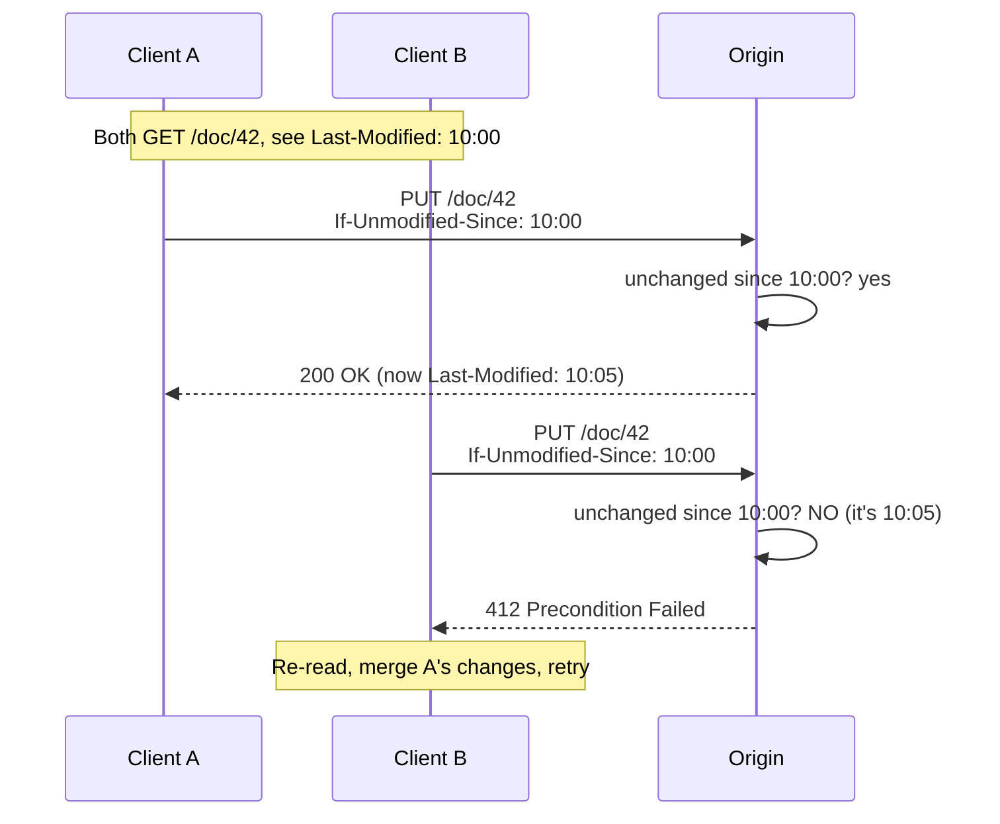
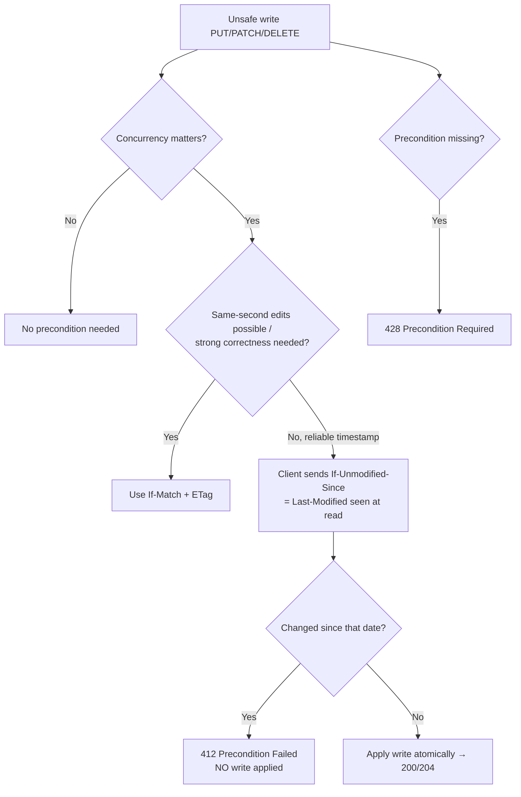

# If-Unmodified-Since

## Quick Summary

`If-Unmodified-Since` is a **request** header carrying an HTTP date, used to make an **unsafe** method (`PUT`/`PATCH`/`POST`/`DELETE`) conditional: "apply this write **only if** the resource has **not** been modified since this date; otherwise reject with `412 Precondition Failed`." It is the **write-side, date-based** precondition — the mirror image of [`If-Modified-Since`](./If-Modified-Since.md) (which is read-side) and the date-based counterpart of [`If-Match`](./Conditional-Requests-Overview.md) (which uses [`ETag`](../06-Caching-Headers/ETag.md) validators). Its job is **optimistic concurrency control**: it prevents the "lost update" / mid-air-collision problem where two clients read a resource, both edit it, and the second silently clobbers the first. The client sends the [`Last-Modified`](../06-Caching-Headers/Last-Modified.md) time it saw when it read the resource; if someone else changed it in the meantime (its modification time moved forward), the server refuses the write. Like all date-based validation it inherits **one-second granularity** and clock/mtime fragility, so where correctness under rapid concurrent edits matters, `If-Match` + `ETag` is preferred — but `If-Unmodified-Since` is simple and ideal when a resource already has a trustworthy modification timestamp.

## What problem does this header solve?

The **lost update problem** is a classic concurrency hazard in any write API. Client A and Client B both `GET /doc/42` (say, last modified at 10:00). Both edit locally. A `PUT`s its version at 10:05; B `PUT`s its version at 10:06 — and B's write silently overwrites A's, because the server blindly applied both. A's work is gone with no error, no warning.

`If-Unmodified-Since` turns the blind write into a **conditional** one. Each client remembers the modification time it saw at read (10:00) and sends `If-Unmodified-Since: <that time>` with its write. The server checks: "is the resource still unmodified since 10:00?" A's write arrives first — still unmodified since 10:00 → applied, and the modification time advances to 10:05. B's write arrives with `If-Unmodified-Since: 10:00`, but the resource is now modified (10:05) → **`412 Precondition Failed`**, write rejected. B is forced to re-read, see A's changes, merge, and retry. No silent data loss.

It also guards **range writes / resumable uploads** and **conditional deletes**: "delete this file only if it hasn't changed since I inspected it" prevents deleting a resource someone else just updated.

## Why was it introduced?

`If-Unmodified-Since` is part of HTTP/1.1 (RFC 2068, 1997; RFC 2616, 1999), specified today in **RFC 7232 (2014)** and **RFC 9110 §13.1.4 (2022)**. It was introduced to give HTTP a **built-in optimistic-locking primitive** using the modification timestamps that resources already had, so applications didn't have to invent ad-hoc "version" fields and custom conflict protocols. It predates widespread `ETag` adoption for writes; when `ETag`/[`If-Match`](./Conditional-Requests-Overview.md) matured, the spec positioned `If-Match` as the **strong** (opaque-validator) precondition and `If-Unmodified-Since` as the **weak** (date-based) one — with the rule that when both are present, `If-Match` is evaluated and `If-Unmodified-Since` is ignored. It endures because date-based concurrency is trivially cheap for resources with a reliable `updated_at`/mtime.

## How does it work?

The client sends `If-Unmodified-Since: <http-date>` on an unsafe method. The origin compares to the resource's current [`Last-Modified`](../06-Caching-Headers/Last-Modified.md):

- **Resource unchanged since that date** (current `Last-Modified` ≤ the header date) → precondition **passes** → apply the method → `200`/`204`/etc.
- **Resource changed after that date** → precondition **fails** → `412 Precondition Failed`, method **not** applied, no side effects.
- **Missing precondition** on a write API that requires it → return `428 Precondition Required` to force clients to opt into the guard.



- **Browser behavior:** Browsers do **not** send `If-Unmodified-Since` automatically — there's no built-in write-revalidation flow the way there is for read caching. Your application code (fetch/axios) sets it deliberately. Browsers just transmit what you set.
- **Server behavior:** The origin evaluates the precondition against a reliable modification time and returns `412` on failure **without applying the write**. This is the crux — the guarantee is worthless if the side effect happens anyway.
- **Proxy behavior:** Forwards it untouched; it's an end-to-end request header meaningful only at the origin.
- **CDN behavior:** Writes are typically uncacheable and pass through to origin; CDNs don't evaluate `If-Unmodified-Since`.
- **Reverse proxy behavior:** Passes it to the app; occasionally an edge/API layer evaluates preconditions, but usually the origin owns write concurrency.

## HTTP Request Example

A guarded update:

```http
PUT /api/docs/42 HTTP/1.1
Host: api.example.com
If-Unmodified-Since: Tue, 01 Jul 2026 10:00:00 GMT
Content-Type: application/json

{"title":"Revised","body":"..."}
```

A guarded delete:

```http
DELETE /api/files/99 HTTP/1.1
Host: api.example.com
If-Unmodified-Since: Tue, 01 Jul 2026 09:30:00 GMT
```

## HTTP Response Example

Precondition passed — write applied, modification time advanced:

```http
HTTP/1.1 200 OK
Content-Type: application/json
Last-Modified: Tue, 01 Jul 2026 10:05:00 GMT

{"id":42,"title":"Revised"}
```

Precondition failed — write rejected:

```http
HTTP/1.1 412 Precondition Failed
Content-Type: application/json
Last-Modified: Tue, 01 Jul 2026 10:05:00 GMT

{"error":"stale","message":"Resource changed since 10:00; re-read and retry"}
```

Precondition required but missing (API demands the guard):

```http
HTTP/1.1 428 Precondition Required
Content-Type: application/json

{"error":"precondition_required","hint":"Send If-Unmodified-Since or If-Match"}
```

## Express.js Example

```js
const express = require('express');
const app = express();
app.use(express.json());

// Optimistic concurrency on writes using a date-based precondition.
app.put('/api/docs/:id', async (req, res) => {
  const doc = await db.docs.find(req.params.id);
  if (!doc) return res.status(404).end();

  const currentModified = new Date(doc.updatedAt);
  const ius = req.headers['if-unmodified-since'];

  // 1) Demand a precondition so writes can't silently clobber. 428 forces the
  //    client to opt into the guard rather than us guessing.
  if (!ius && !req.headers['if-match']) {
    return res.status(428).json({ error: 'precondition_required' });
  }

  // 2) Evaluate If-Unmodified-Since at SECOND resolution (HTTP-date granularity).
  if (ius) {
    const since = Date.parse(ius);
    const changed = Number.isNaN(since) ||
      Math.floor(currentModified.getTime() / 1000) > Math.floor(since / 1000);
    if (changed) {
      // Someone modified it after the client's snapshot → refuse, DO NOT write.
      return res.status(412)
        .set('Last-Modified', currentModified.toUTCString())
        .json({ error: 'stale_version' });
    }
  }

  // 3) Safe to apply: no concurrent change since the client's snapshot.
  const updated = await db.docs.update(req.params.id, req.body);
  res.set('Last-Modified', new Date(updated.updatedAt).toUTCString())
     .json(updated);
});

app.listen(3000);
```

Why each piece matters: returning `428` (step 1) when no precondition is present is what makes the *whole* API safe — if you treat a missing `If-Unmodified-Since` as "just write it," you've reintroduced the lost-update bug for any client that forgets the guard. The **second-resolution** comparison (step 2) prevents millisecond noise in `updatedAt` from producing spurious `412`s. The single most important line is the one that *isn't* there in the failure path: on `412` you **return before touching the database** — the guarantee is that a failed precondition produces **no side effects**. If you updated first and checked later, the header would be decorative.

## Node.js Example

Raw `http`:

```js
const http = require('http');

http.createServer(async (req, res) => {
  if (req.method === 'PUT' && req.url.startsWith('/api/docs/')) {
    const id = req.url.split('/').pop();
    const doc = await findDoc(id);
    if (!doc) { res.statusCode = 404; return res.end(); }

    const currentModified = new Date(doc.updatedAt);
    const ius = req.headers['if-unmodified-since'];

    if (!ius) { res.statusCode = 428; return res.end('precondition required'); }

    const since = Date.parse(ius);
    const changed = Number.isNaN(since) ||
      Math.floor(currentModified.getTime() / 1000) > Math.floor(since / 1000);
    if (changed) {
      res.statusCode = 412;
      res.setHeader('Last-Modified', currentModified.toUTCString());
      return res.end('stale');            // reject WITHOUT applying the write.
    }

    const body = await readBody(req);
    const updated = await updateDoc(id, JSON.parse(body));
    res.setHeader('Last-Modified', new Date(updated.updatedAt).toUTCString());
    res.statusCode = 200;
    return res.end(JSON.stringify(updated));
  }
  res.statusCode = 404;
  res.end();
}).listen(3000);
```

Same discipline: parse defensively, compare at second resolution, and reject with `412` **before** any mutation.

## React Example

React apps set `If-Unmodified-Since` explicitly in mutations to implement optimistic locking:

```jsx
function useDocEditor(id) {
  const [doc, setDoc] = React.useState(null);
  const [lastModified, setLastModified] = React.useState(null);

  // On read, capture the Last-Modified so we can guard the later write.
  React.useEffect(() => {
    fetch(`/api/docs/${id}`).then(async (r) => {
      setLastModified(r.headers.get('last-modified'));  // the snapshot time
      setDoc(await r.json());
    });
  }, [id]);

  async function save(changes) {
    const res = await fetch(`/api/docs/${id}`, {
      method: 'PUT',
      headers: {
        'Content-Type': 'application/json',
        'If-Unmodified-Since': lastModified,   // guard: only apply if unchanged since read
      },
      body: JSON.stringify(changes),
    });
    if (res.status === 412) {
      // Someone else changed it. Re-fetch, show a conflict UI, let the user merge.
      throw new ConflictError('Document changed since you opened it');
    }
    setLastModified(res.headers.get('last-modified')); // advance the snapshot
    return res.json();
  }

  return { doc, save };
}
```

Key points for React devs:
1. **Capture `Last-Modified` at read time** and send it back on write — this is the concurrency token.
2. **Handle `412` as a conflict**, not a generic error: re-fetch, present a merge/overwrite choice, then retry.
3. **Prefer `ETag` + [`If-Match`](./Conditional-Requests-Overview.md)** for collaborative editing where edits can happen within the same second — date granularity will miss rapid concurrent changes. Use `If-Unmodified-Since` when the server exposes a reliable timestamp and edits are relatively infrequent.

## Browser Lifecycle

There is essentially **no automatic browser lifecycle** for `If-Unmodified-Since` — unlike `If-Modified-Since`, the browser never generates it on its own. Its lifecycle is entirely application-driven:

1. Your code reads a resource and captures its [`Last-Modified`](../06-Caching-Headers/Last-Modified.md).
2. Your code issues an unsafe request with `If-Unmodified-Since: <captured date>`.
3. The browser transmits it verbatim.
4. On `412`, your code handles the conflict (re-read/merge/retry); on success, capture the new `Last-Modified`.
5. The browser does not cache or reuse this header; it's a per-write, per-intent signal.

## Production Use Cases

- **Optimistic locking on document/record edits:** prevent lost updates in wikis, CMSes, config editors, spreadsheets.
- **Conditional deletes:** "delete only if unchanged since I looked" to avoid removing a resource someone just updated.
- **Resumable / range uploads:** ensure the target hasn't changed between upload chunks.
- **Inventory / financial mutations:** refuse a decrement/transfer if the underlying record moved since the client read it.
- **Batch/import jobs:** apply changes only against the snapshot the job planned from, aborting if the world shifted.

## Common Mistakes

- **Applying the write before checking (or on failure).** The entire value is that a failed precondition causes **no side effects**. Check first; mutate only on pass.
- **Not requiring a precondition.** If a missing `If-Unmodified-Since` means "just write," clients that forget it reintroduce lost updates. Return `428 Precondition Required`.
- **Millisecond comparison.** `updated_at` with sub-second precision vs a second-granular header → spurious `412`s. Compare truncated to seconds.
- **Using it for reads.** It's a *write* precondition; for read revalidation use [`If-Modified-Since`](./If-Modified-Since.md).
- **Confusing direction with `If-Modified-Since`.** `If-Modified-Since` = "give me the body if it *did* change (else 304)"; `If-Unmodified-Since` = "apply my write if it did *not* change (else 412)". Swapping them is a logic bug.
- **Relying on it under high concurrency.** Same-second edits slip through; use `ETag` + `If-Match` for strong concurrency.
- **Ignoring precedence.** When both `If-Match` and `If-Unmodified-Since` are present, evaluate `If-Match`.

## Security Considerations

- **Clock skew / mtime manipulation.** Because it depends on wall-clock time, server clock changes or mtime resets can make a stale write appear valid (dangerous) or a valid write fail (annoying). Keep clocks synced (NTP) and modification times monotonic; for high-stakes writes prefer opaque `ETag` validators.
- **Not authorization.** A passed precondition means "no concurrent change," not "this client may write." Enforce authz independently and *before* evaluating the precondition.
- **TOCTOU within the handler.** Evaluate the precondition and perform the write **atomically** (e.g. a single conditional DB update `WHERE updated_at = ?`), or a concurrent writer can slip between your check and your write. The HTTP header guards the client's snapshot; the database transaction guards the server's.
- **Information disclosure.** Returning the current `Last-Modified` on a `412` reveals when the resource last changed — usually fine, occasionally sensitive.

## Performance Considerations

- **Cheap concurrency control.** No hashing needed if you already store `updated_at`; a single indexed comparison.
- **Reduces wasted work.** Rejecting a doomed write early (`412`) avoids applying and then rolling back conflicting changes.
- **Atomic conditional writes are ideal.** Pushing the precondition into the storage layer (`UPDATE ... WHERE updated_at = :snapshot`) both closes the TOCTOU gap and avoids an extra read.
- **Negligible wire cost;** it's a single date header.

## Reverse Proxy Considerations

Concurrency preconditions are almost always evaluated at the **origin/app**, not the proxy — the proxy simply forwards them:

```nginx
server {
  location /api/ {
    proxy_pass http://app_upstream;
    # Pass If-Unmodified-Since (and If-Match) straight through; the app owns
    # write concurrency. Do NOT strip conditional headers.
    proxy_pass_request_headers on;   # default; ensure conditional headers reach the app.
  }
}
```

Key points: ensure no proxy/WAF strips `If-Unmodified-Since` (some over-zealous configs drop uncommon headers), or your concurrency guard silently disappears and lost updates return. The proxy has no business short-circuiting a write precondition.

## CDN Considerations

- **Writes bypass the cache.** `PUT`/`PATCH`/`DELETE` are unsafe/uncacheable; the CDN forwards them (and `If-Unmodified-Since`) to the origin.
- **Ensure conditional headers are forwarded.** Confirm the CDN passes `If-Unmodified-Since` to origin (most do for unsafe methods by default).
- **No edge evaluation.** CDNs don't know your resource's current modification time authoritatively, so they can't (and shouldn't) evaluate this precondition.

## Cloud Deployment Considerations

- **Object storage (S3/GCS):** support conditional writes/copies to varying degrees; some offer `If-Unmodified-Since`-style preconditions on operations (and increasingly `If-Match` on put). Check the provider's conditional-request support for your operation.
- **API Gateways:** forward `If-Unmodified-Since` to the backend; ensure it isn't stripped by request-transformation settings.
- **Serverless:** implement the precondition against a stored `updated_at` and, ideally, an atomic conditional store write; never rely on ephemeral local mtime.
- **Databases:** DynamoDB conditional expressions, SQL `WHERE updated_at = ?`, or version columns implement the server-side half atomically.
- **Clock sync:** keep NTP tight across instances so timestamps compare correctly.

## Debugging

- **Chrome DevTools → Network:** inspect the request's `If-Unmodified-Since` and the response status (`200` vs `412` vs `428`) and the returned `Last-Modified`.
- **curl:** `curl -i -X PUT https://host/api/docs/42 -H 'If-Unmodified-Since: Tue, 01 Jul 2026 10:00:00 GMT' -H 'Content-Type: application/json' -d '{"title":"x"}'` — expect `412` if the resource changed since that time, `200` if not.
- **Postman / Bruno:** capture `Last-Modified` from the read, set it as `If-Unmodified-Since` on the write, assert `res.status === 200`; then modify the resource out-of-band and assert the next write returns `412`.
- **Node.js/Express logging:** log `req.headers['if-unmodified-since']`, the resource's current modification time, and the resulting status to confirm the comparison.
- **Conflict test:** simulate two clients with the same snapshot, apply one write, then the other — the second must get `412`.

## Best Practices

- [ ] **Reject before you mutate** — a failed precondition must produce no side effects.
- [ ] Require a precondition on concurrency-sensitive writes; return `428 Precondition Required` when it's missing.
- [ ] Compare at **second** resolution to match HTTP-date granularity.
- [ ] Evaluate the precondition and write **atomically** (conditional DB update) to close the TOCTOU gap.
- [ ] Prefer [`If-Match`](./Conditional-Requests-Overview.md) + [`ETag`](../06-Caching-Headers/ETag.md) when edits can occur within the same second or when correctness is critical.
- [ ] Return the current [`Last-Modified`](../06-Caching-Headers/Last-Modified.md) on `412` so clients can re-sync.
- [ ] Give `If-Match` precedence when both preconditions are present.
- [ ] Enforce authorization **before** the precondition; keep clocks synced (NTP).
- [ ] Handle `412` in clients as a **conflict** (re-read/merge/retry), not a generic failure.

## Related Headers

- [If-Match](./Conditional-Requests-Overview.md) — the ETag-based write precondition (strong); **takes precedence** over `If-Unmodified-Since`.
- [If-Modified-Since](./If-Modified-Since.md) — the read-side date precondition; the mirror of this header.
- [Last-Modified](../06-Caching-Headers/Last-Modified.md) — the modification time captured at read and compared on write.
- [ETag](../06-Caching-Headers/ETag.md) — the opaque validator preferred for robust concurrency.
- [If-None-Match](./If-None-Match.md) — read revalidation / create-if-absent counterpart.
- [If-Range](./If-Range.md) — conditional partial fetch, often using the same validators.
- [Conditional Requests Overview](./Conditional-Requests-Overview.md) — the full precondition model and `412`/`428` semantics.

## Decision Tree



## Mental Model

Think of `If-Unmodified-Since` as writing on your edit request: **"Apply my changes to this contract *only if nobody has touched it since I picked it up at 10:00*."** You photocopied the contract at 10:00, marked it up at your desk, and now you're handing your edits to the clerk. The clerk checks the master copy's "last amended" stamp: if it still says 10:00, your edits go in cleanly and the stamp advances to now. But if a colleague already amended it at 10:05, the clerk hands your request back untouched — "sorry, this changed since your snapshot" (`412`) — so you *can't* accidentally erase your colleague's work; you have to go re-read the current version, reconcile, and resubmit. The safeguard only works because the clerk **refuses the whole request before making any changes** — checking *after* editing would defeat the purpose. And because "last amended" is only stamped to the minute, two people amending within the same minute could still collide (date granularity) — which is why, for a contract being edited furiously by many people at once, you'd switch to a precise *revision number* on every change ([`If-Match`](./Conditional-Requests-Overview.md) + [`ETag`](../06-Caching-Headers/ETag.md)).
