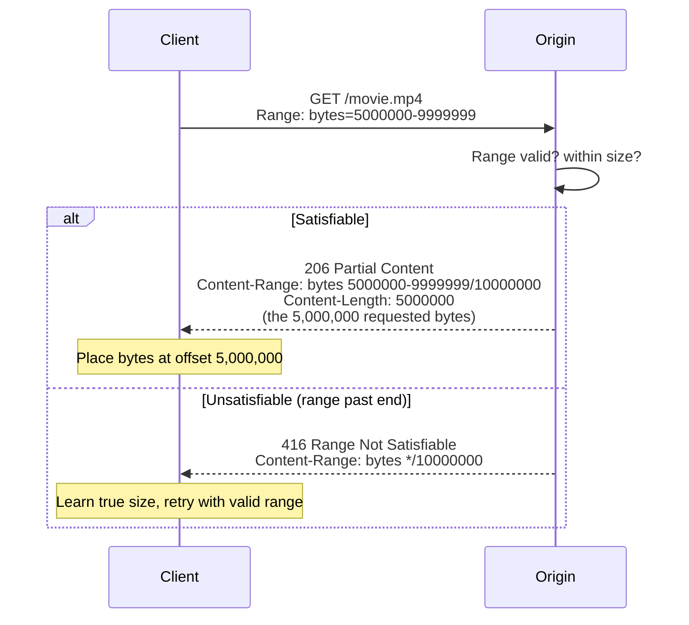
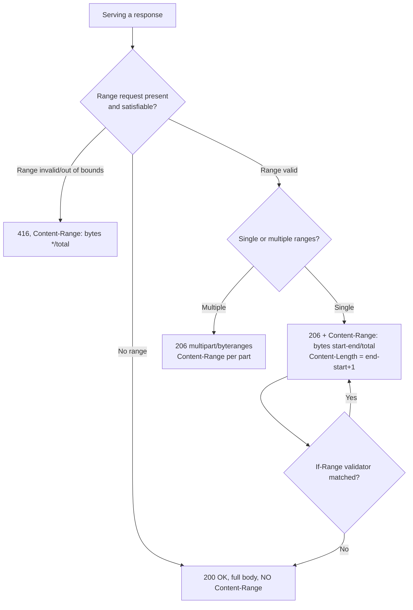

# Content-Range

## Quick Summary

`Content-Range` is a **response** header that tells the client *which portion of a resource the body represents, and how big the whole resource is* — e.g. `Content-Range: bytes 5000000-9999999/10000000` means "these bytes are positions 5,000,000–9,999,999 of a 10,000,000-byte resource." It is the header that makes [`Range`](./Range.md) requests meaningful: when a client asks for part of a resource and the server answers `206 Partial Content`, `Content-Range` is the label that says *exactly where these bytes fit* so the client can assemble them correctly. It appears in two response scenarios — on a **`206 Partial Content`** (here's the slice you asked for, and its place in the whole) and on a **`416 Range Not Satisfiable`** (your requested range was invalid; here's the actual total size, e.g. `Content-Range: bytes */10000000`). It is the response-side counterpart to the request's [`Range`](./Range.md) header and works hand-in-glove with [`Accept-Ranges`](../04-Response-Headers/Accept-Ranges.md) (which advertises range support) and [`If-Range`](../12-Conditional-Requests/If-Range.md) (which guards resume consistency). Without an accurate `Content-Range`, partial responses are unusable — the client wouldn't know where to place the bytes or when it has the whole thing.

## What problem does this header solve?

When a server returns *part* of a resource, the client faces an assembly problem: **where do these bytes go, and how many more are there?** A download manager resuming at byte 5 MB needs to confirm the server actually sent bytes from 5 MB (not from 0). A video player seeking to the middle needs to know the received chunk's position to place it in its buffer. A client stitching multiple ranged fetches into a complete file needs to know the *total* size to know when it's done.

`Content-Range` answers all three: it states the **start and end byte offsets** of the returned body and the **total size** of the complete resource. This lets the client:
- verify it got the range it asked for,
- place the bytes at the correct offset in its assembly buffer/file,
- compute how much remains (total − end − 1),
- and detect completion (when the accumulated ranges cover `0` to `total−1`).

On the error side, when a client asks for a range that doesn't exist (e.g. bytes 20 MB–30 MB of a 10 MB file), `Content-Range: bytes */10000000` on a `416` tells the client the real size so it can retry with a valid range instead of guessing.

## Why was it introduced?

`Content-Range` was introduced with HTTP/1.1's range mechanism (RFC 2068, 1997; RFC 2616, 1999), specified today in **RFC 7233 (2014, "Range Requests")** and **RFC 9110 §14.4 (2022)**. The motivation was **resumable and partial transfers**: the ability to fetch byte ranges so an interrupted download could resume from where it stopped rather than restarting, and so large media could be seeked without downloading everything. A partial response is worthless unless the client can locate the bytes precisely — hence a mandatory, machine-readable descriptor of "which bytes, out of how many." `Content-Range` is that descriptor. The spec also defines its role on `416` (communicating the true size when a range is unsatisfiable) and its interaction with multi-range requests (which use `multipart/byteranges` with a `Content-Range` per part rather than a single top-level header).

## How does it work?

The syntax is: `Content-Range: <unit> <start>-<end>/<total>` (almost always `unit = bytes`). `total` may be `*` if the server doesn't know the full size; on `416`, the form is `bytes */<total>` (no range, just the size).



- **Browser behavior:** Browsers *read* `Content-Range` when resuming downloads and when media elements seek — they use it to place bytes and track completion. Your JS rarely reads it directly (the browser assembles the file), but the Streams API and manual chunked fetchers can.
- **Server behavior:** The origin computes and emits `Content-Range` on every `206` and `416`. It must ensure the offsets are correct and consistent with the actual bytes sent and with [`Content-Length`](../04-Response-Headers/Content-Length.md) (which equals `end − start + 1` for a single range).
- **Proxy behavior:** Forwards `Content-Range`; a caching proxy that stores partial responses must key/track them by range and keep `Content-Range` accurate.
- **CDN behavior:** CDNs doing byte-range/slice caching emit `Content-Range` for edge-served ranges and rely on it for assembling/serving slices — central to video delivery.
- **Reverse proxy behavior:** Nginx sets `Content-Range` when serving ranges of static files or when its `slice` module reassembles range-cached content.

## HTTP Request Example

A ranged request (the client asks for a slice):

```http
GET /downloads/ubuntu.iso HTTP/1.1
Host: mirror.example.com
Range: bytes=524288000-1048575999
```

An open-ended resume (from an offset to the end):

```http
GET /downloads/ubuntu.iso HTTP/1.1
Host: mirror.example.com
Range: bytes=524288000-
```

## HTTP Response Example

`206` with a single range (note `Content-Length` = end − start + 1):

```http
HTTP/1.1 206 Partial Content
Content-Type: application/octet-stream
Content-Range: bytes 524288000-1048575999/1048576000
Content-Length: 524288000
Accept-Ranges: bytes
ETag: "iso-v1-strong"
```

`416` when the range is invalid (past the end) — reports the true total:

```http
HTTP/1.1 416 Range Not Satisfiable
Content-Range: bytes */1048576000
Content-Type: text/plain
```

Multi-range response uses `multipart/byteranges`, with a `Content-Range` **per part** (no single top-level one):

```http
HTTP/1.1 206 Partial Content
Content-Type: multipart/byteranges; boundary=SEP
Content-Length: 320

--SEP
Content-Type: application/pdf
Content-Range: bytes 0-99/5000

<100 bytes>
--SEP
Content-Type: application/pdf
Content-Range: bytes 4900-4999/5000

<100 bytes>
--SEP--
```

## Express.js Example

`res.sendFile`/`express.static` emit `Content-Range` automatically. A custom handler shows the mechanics:

```js
const express = require('express');
const fs = require('fs');
const app = express();

app.get('/downloads/:file', (req, res) => {
  const path = `/data/${req.params.file}`;
  const { size } = fs.statSync(path);          // total resource size
  res.set('Accept-Ranges', 'bytes');           // advertise range support

  const range = req.headers['range'];
  if (!range) {
    // No range → whole file, 200 (no Content-Range on a full response).
    res.set('Content-Length', size);
    return fs.createReadStream(path).pipe(res);
  }

  // Parse "bytes=start-end" (end optional → to EOF).
  const m = /^bytes=(\d*)-(\d*)$/.exec(range);
  if (!m) return res.status(416).set('Content-Range', `bytes */${size}`).end();

  let start = m[1] === '' ? undefined : parseInt(m[1], 10);
  let end = m[2] === '' ? undefined : parseInt(m[2], 10);

  // Handle suffix ranges like "bytes=-500" (last 500 bytes).
  if (start === undefined && end !== undefined) { start = size - end; end = size - 1; }
  if (end === undefined) end = size - 1;

  // 1) Validate: unsatisfiable ranges → 416 WITH the true size in Content-Range.
  if (Number.isNaN(start) || start < 0 || start >= size || end >= size || start > end) {
    return res.status(416).set('Content-Range', `bytes */${size}`).end();
  }

  // 2) 206 with an ACCURATE Content-Range and matching Content-Length.
  const chunkSize = end - start + 1;
  res.status(206);
  res.set('Content-Range', `bytes ${start}-${end}/${size}`);   // where these bytes belong
  res.set('Content-Length', chunkSize);                        // MUST equal end-start+1
  res.set('Content-Type', 'application/octet-stream');
  fs.createReadStream(path, { start, end }).pipe(res);         // stream exactly that slice
});

app.listen(3000);
```

Idiomatic version:

```js
app.get('/downloads/:file', (req, res) => res.sendFile(`/data/${req.params.file}`));
// sendFile handles Range → Content-Range, Content-Length, 206/416, Accept-Ranges, ETag.
```

Why each piece matters: the `416` branch (step 1) emits `Content-Range: bytes */size` — this is the *only* way the client learns the real size when its range was invalid, letting it retry correctly instead of failing blindly. In step 2, `Content-Range` must state the *actual* offsets streamed, and `Content-Length` must equal `end − start + 1` exactly — if they disagree, the client mis-assembles or hangs waiting for bytes that never come. The suffix-range handling (`bytes=-500`) is a real case media players and downloaders use (grab the file's tail/footer). Hand-code this only for custom sources; `sendFile` is correct and safer for files.

## Node.js Example

Raw `http`:

```js
const http = require('http');
const fs = require('fs');

http.createServer((req, res) => {
  const path = '/data/movie.mp4';
  const { size } = fs.statSync(path);
  res.setHeader('Accept-Ranges', 'bytes');

  const range = req.headers['range'];
  if (!range) {
    res.setHeader('Content-Type', 'video/mp4');
    res.setHeader('Content-Length', size);
    return fs.createReadStream(path).pipe(res);
  }

  const [s, e] = range.replace('bytes=', '').split('-');
  const start = parseInt(s, 10);
  const end = e ? parseInt(e, 10) : size - 1;

  if (start >= size || end >= size || start > end) {
    res.writeHead(416, { 'Content-Range': `bytes */${size}` }); // true size on error
    return res.end();
  }

  res.writeHead(206, {
    'Content-Type': 'video/mp4',
    'Content-Range': `bytes ${start}-${end}/${size}`,           // placement descriptor
    'Content-Length': end - start + 1,                          // == range length
  });
  fs.createReadStream(path, { start, end }).pipe(res);
}).listen(3000);
```

The core contract: `206` ⇒ accurate `Content-Range` + matching `Content-Length`; `416` ⇒ `Content-Range: bytes */total`.

## React Example

React never sets `Content-Range` (response header) and rarely reads it — the browser assembles ranged downloads and media buffers for you. Where it surfaces:

1. **Media playback / seeking (invisible).** A `<video>` element seeks by issuing `Range` requests; the browser reads `Content-Range` to place the received bytes in its buffer. Your React code just renders the element; correct server `Content-Range` is what makes scrubbing smooth.

```jsx
function VideoPlayer({ src }) {
  // Browser issues Range requests; reads Content-Range to assemble the buffer.
  // Your server must return accurate 206 + Content-Range for seeking to work.
  return <video src={src} controls />;
}
```

2. **Manual chunked download (advanced).** If you build a resumable downloader in JS, you read `Content-Range` to track progress and detect completion:

```jsx
async function downloadChunk(url, start, chunkSize) {
  const res = await fetch(url, { headers: { Range: `bytes=${start}-${start + chunkSize - 1}` } });
  const cr = res.headers.get('content-range');          // e.g. "bytes 0-1023/1048576"
  const total = cr ? parseInt(cr.split('/')[1], 10) : null; // learn the total size
  const bytes = new Uint8Array(await res.arrayBuffer());
  return { bytes, total, done: cr && parseInt(cr.split('-')[1], 10) + 1 >= total };
}
```

3. **Why it matters server-side:** if your origin/CDN returns wrong or missing `Content-Range`, video seeking breaks and resumable downloads corrupt — symptoms appear in the React UI but the fix is on the server.

## Browser Lifecycle

1. The client sends a [`Range`](./Range.md) request (resume or seek), possibly with [`If-Range`](../12-Conditional-Requests/If-Range.md).
2. The server responds `206` with `Content-Range` describing the slice and total.
3. The browser reads `Content-Range` to **place** the bytes at the right offset and track how much of the resource it now has.
4. It repeats for further ranges (seeks/chunks), each `Content-Range` locating the new bytes.
5. When accumulated ranges cover the whole resource (per the `total`), the file/media is complete.
6. On `416`, the browser reads `Content-Range: bytes */total` to learn the true size and can retry within bounds.

## Production Use Cases

- **Resumable downloads:** placing resumed bytes at the correct offset and knowing total size / remaining bytes.
- **Video/audio seeking:** the browser assembles the media buffer using per-range `Content-Range`.
- **CDN byte-range/slice caching:** edges serve and reassemble slices using `Content-Range`.
- **Progressive document/PDF viewers:** fetch specific page ranges and place them accurately.
- **Parallel/multi-connection downloaders:** split a file into ranges across connections, using `Content-Range` to reassemble.
- **`416` size discovery:** clients learn a resource's size from `Content-Range: bytes */total` when a range is out of bounds.

## Common Mistakes

- **`Content-Length` not equal to `end − start + 1`.** The client hangs waiting for missing bytes or truncates. They must agree exactly for a single-range `206`.
- **Wrong or off-by-one offsets.** Ranges are **inclusive** on both ends (`bytes 0-99` is 100 bytes). Off-by-one produces corrupt assembly.
- **Omitting `Content-Range` on `206`.** A `206` without it is unusable — the client can't place the bytes. (And a full response must **not** carry `Content-Range`.)
- **Missing `Content-Range` on `416`.** Without `bytes */total`, the client can't learn the size to retry.
- **Using `Content-Range` on a `200`.** It belongs only on `206`/`416`; putting it on a full `200` is malformed.
- **Multi-range confusion.** Multiple ranges use `multipart/byteranges` with a `Content-Range` per part — not a single top-level header listing several ranges.
- **Total mismatch across a fleet.** If different nodes report different totals (or ETags), resume/assembly breaks. Keep size/validators consistent.

## Security Considerations

- **Range/multi-range amplification (DoS).** Historically, crafted `Range` headers requesting many overlapping ranges (the Apache "Range header DoS", CVE-2011-3192) amplified server work into memory/CPU exhaustion. Bound the number of ranges per request, enforce a minimum range size, and cap total ranged work. `Content-Range` isn't the cause, but it's part of the range subsystem you must harden.
- **Information disclosure via total size.** `Content-Range: bytes */total` reveals the exact resource size even on `416` — usually benign, occasionally sensitive; be deliberate for protected resources.
- **Not authorization.** Serving a range must follow access-control checks; don't return partial content (or size) to unauthorized clients because a range parsed successfully.
- **Consistency with [`If-Range`](../12-Conditional-Requests/If-Range.md).** Ensure the bytes described by `Content-Range` actually belong to the version the client is resuming, or you serve a corrupt splice — the whole reason `If-Range` exists.

## Performance Considerations

- **Enables partial transfer = massive bandwidth savings** for resume and media seeking — fetch only what's needed.
- **Accurate `Content-Range` avoids re-fetches:** correct placement/size means no wasted redundant downloads.
- **Parallel ranged downloads** can improve throughput on high-latency links (multiple connections, each a range) — `Content-Range` makes reassembly possible.
- **CDN slice caching** serves popular regions from the edge without pulling whole files, using `Content-Range` per slice.
- **Multi-range overhead:** `multipart/byteranges` adds boundary/header overhead per part; for many small ranges the overhead can dominate — consider whether a single larger range is better.

## Reverse Proxy Considerations

Nginx serves ranges with correct `Content-Range` for static files and via the slice module for cached range serving:

```nginx
server {
  location /downloads/ {
    root /var/www;
    add_header Accept-Ranges bytes;
    # Nginx computes Content-Range + Content-Length and returns 206/416 for static files.
  }

  location /media/ {
    proxy_pass http://origin_upstream;
    proxy_cache media_cache;
    proxy_cache_valid 200 206 1d;      # cache full and partial responses.
    slice 1m;                          # cache in 1MB slices; each carries its own Content-Range.
    proxy_set_header Range $slice_range;
    proxy_force_ranges on;             # request ranges upstream even if it omits Accept-Ranges.
    add_header X-Cache-Status $upstream_cache_status;
  }
}
```

Key points: the `slice` module fetches and caches fixed-size slices, each with its own `Content-Range`, then reassembles the client's requested range — the standard pattern for efficient large-media caching. Ensure upstream size/validators are consistent so slice boundaries and totals line up.

## CDN Considerations

- **Byte-range/slice caching is core to video/large-file delivery;** CDNs emit `Content-Range` for edge-served ranges and reassemble slices using it.
- **Cloudflare/CloudFront/Fastly/Akamai** all support range serving; ensure your origin returns correct `Content-Range` on `206`/`416` and advertises [`Accept-Ranges`](../04-Response-Headers/Accept-Ranges.md).
- **Consistent totals/validators** across origin nodes are essential — mismatched sizes break edge reassembly and client resume.
- **Some CDNs require enabling** large-file/slice optimizations explicitly; check vendor configuration.

## Cloud Deployment Considerations

- **Object storage (S3/GCS/Azure Blob):** natively support `Range` and return accurate `Content-Range` on `206`/`416` — the recommended origin for downloads and media.
- **API Gateways:** may buffer or mishandle ranges; verify `Content-Range`/`206` pass-through for large-file endpoints, or serve those from storage/CDN directly.
- **Load balancers:** pass `Content-Range` through untouched.
- **Serverless:** streaming accurate ranged responses is constrained by size/time limits; prefer redirecting to signed storage/CDN URLs for large media rather than proxying ranges through a function.

## Debugging

- **Chrome DevTools → Network:** a `206` row shows `Content-Range` in Response Headers; seeking a `<video>` produces many `206`s. Confirm offsets and total look right, and that `Content-Length` matches the range length.
- **curl (range):** `curl -sD - -o /dev/null -r 0-1023 https://host/file` → expect `206` and `Content-Range: bytes 0-1023/<total>`. Test error: `curl -sD - -o /dev/null -r 999999999999- https://host/file` → expect `416` and `Content-Range: bytes */<total>`.
- **curl (resume):** `curl -C - -O https://host/file.iso` auto-resumes using ranges and reads `Content-Range`.
- **Postman / Bruno:** set a `Range` header, assert `res.status === 206` and parse `Content-Range` for offsets/total.
- **Node.js:** log the `Content-Range` you emit and verify `Content-Length === end - start + 1`.
- **Multi-range check:** request `Range: bytes=0-99,4900-4999` and confirm a `multipart/byteranges` body with a `Content-Range` per part.

## Best Practices

- [ ] On every `206`, emit an accurate `Content-Range` and set [`Content-Length`](../04-Response-Headers/Content-Length.md) = `end − start + 1`.
- [ ] Treat ranges as **inclusive** on both ends; avoid off-by-one errors.
- [ ] On `416`, always send `Content-Range: bytes */<total>` so clients learn the size.
- [ ] Never put `Content-Range` on a full `200` response.
- [ ] Advertise [`Accept-Ranges: bytes`](../04-Response-Headers/Accept-Ranges.md) and pair with [`If-Range`](../12-Conditional-Requests/If-Range.md) + a strong [`ETag`](../06-Caching-Headers/ETag.md) for safe resume.
- [ ] Handle suffix ranges (`bytes=-N`) and open-ended ranges (`bytes=N-`).
- [ ] Keep total size and validators **consistent across the fleet/CDN**.
- [ ] Bound multi-range requests to prevent amplification/DoS.
- [ ] Enforce authorization before serving any range.

## Related Headers

- [Range](./Range.md) — the request header this responds to; `Content-Range` describes what was returned for it.
- [Accept-Ranges](../04-Response-Headers/Accept-Ranges.md) — advertises that the server supports range requests.
- [If-Range](../12-Conditional-Requests/If-Range.md) — guards that the returned range belongs to the version the client is resuming.
- [Content-Length](../04-Response-Headers/Content-Length.md) — must equal the byte count of a single-range `206`.
- [ETag](../06-Caching-Headers/ETag.md) / [Last-Modified](../06-Caching-Headers/Last-Modified.md) — validators that pair with `If-Range` for consistent partials.
- [Content-Type](../04-Response-Headers/Content-Type.md) — `multipart/byteranges` for multi-range responses.
- [Range Requests Overview](./Range-Requests-Overview.md) — the full partial-content model.

## Decision Tree



## Mental Model

Think of `Content-Range` as the **"page X of Y, this envelope contains pages A–B" label on a serialized document mailed in pieces**. If you ask the archive for "pages 51 through 100 of the manuscript," they don't just mail you 50 loose pages — they stamp the envelope "pages 51–100 of 500" (`Content-Range: bytes 50-99/500`). That label is what lets you slot those pages into exactly the right place in your binder and know you still need pages 101–500 to be complete. If you accidentally ask for "pages 600–650" of a 500-page manuscript, the archive doesn't just refuse blankly — it sends back "there is no such range; the manuscript is 500 pages" (`416` with `bytes */500`) so you can ask again correctly. And the label must be *honest*: if the envelope says "pages 51–100" but actually holds 40 pages, your binder ends up with gaps or misfiled pages (which is why `Content-Length` must equal the range length exactly). The label is the difference between a pile of loose pages and a correctly assembled book.
