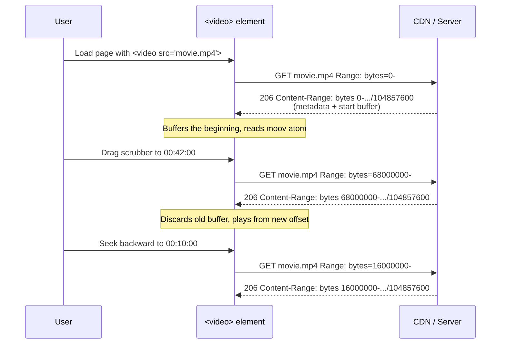

# Range Requests Overview

Range requests are the mechanism by which an HTTP client asks for *part* of a resource instead of the whole thing. A client sends [`Range: bytes=1000000-1999999`](./Range.md) and a compliant server replies with `206 Partial Content`, a [`Content-Range`](./Content-Range.md) header describing exactly which slice it sent, and a body containing only those bytes. This one capability underpins two of the most important behaviors on the modern web: **HTML5 `<video>`/`<audio>` seeking** (jumping to minute 42 of a movie without downloading minutes 0–41) and **resumable / parallel downloads** (a 4 GB installer that survives a dropped connection, or a download manager pulling eight chunks in parallel). If you have ever dragged a video scrubber and had playback resume near-instantly, you have watched range requests work.

This chapter is the conceptual map. The two header pages — [`Range`](./Range.md) (the request) and [`Content-Range`](./Content-Range.md) (the response) — cover the wire syntax and per-header production detail. Here we tie them together: the status codes, the negotiation handshake, how browsers and media players actually drive it, and how Express, raw Node streams, and CDNs implement it.

## The core handshake

Range requests are opt-in and *advertised*. A server tells clients "I support ranges on this resource" by emitting [`Accept-Ranges: bytes`](../04-Response-Headers/Accept-Ranges.md) on a normal `200` response. A client that wants a slice then re-requests with a [`Range`](./Range.md) header. The unit is almost always `bytes` (the only unit browsers and CDNs implement in practice; `Accept-Ranges: none` explicitly disables it).

The three outcomes:

- **`206 Partial Content`** — the server honored the range and returned exactly the requested bytes, with a [`Content-Range`](./Content-Range.md) header stating `start-end/total` and a `Content-Length` equal to the *slice* size, not the full resource.
- **`200 OK`** — the server ignored the range (it is allowed to) and returned the whole resource. Clients must tolerate this; a range request is a *request*, not a command.
- **`416 Range Not Satisfiable`** — the requested range lies entirely outside the resource (e.g. `bytes=99999999-` on a 1 MB file). The server returns `416` plus a `Content-Range: bytes */1048576` telling the client the true total so it can retry sensibly.

A minimal seek into a video file looks like this on the wire:

```http
GET /media/movie.mp4 HTTP/1.1
Host: cdn.example.com
Range: bytes=5242880-
```

```http
HTTP/1.1 206 Partial Content
Content-Type: video/mp4
Accept-Ranges: bytes
Content-Range: bytes 5242880-104857599/104857600
Content-Length: 99614720
```

Note the arithmetic: the resource is `104857600` bytes total, the client asked for "everything from byte 5242880 onward," and the server returned `104857600 - 5242880 = 99614720` bytes. `Content-Range`'s `end` is *inclusive* (`104857599` is the last byte), which is the single most common off-by-one trap in range implementations.

## Byte range syntax at a glance

The [`Range`](./Range.md) header supports three shapes (full detail on its page):

```http
Range: bytes=0-1023           # first 1024 bytes (both ends inclusive)
Range: bytes=1024-            # from byte 1024 to the end (open-ended)
Range: bytes=-500             # the last 500 bytes (suffix range)
Range: bytes=0-99,500-599     # multiple ranges -> multipart/byteranges response
```

`Content-Range` echoes back the concrete resolved range and the total size:

```http
Content-Range: bytes 0-1023/146515      # sent bytes 0..1023 of a 146515-byte resource
Content-Range: bytes 1024-146514/146515 # open-ended range resolved to the true end
Content-Range: bytes */146515           # on a 416: "your range was invalid; total is 146515"
```

## Single range vs. multipart/byteranges

For a single requested range the response is a plain body with `Content-Range` and a `Content-Length` equal to the slice. For **multiple** ranges in one request (`Range: bytes=0-99,200-299`), a compliant server responds with `Content-Type: multipart/byteranges; boundary=...` and a MIME-multipart body where each part carries its own `Content-Type` and `Content-Range`:

```http
HTTP/1.1 206 Partial Content
Content-Type: multipart/byteranges; boundary=3d6b6a416f9b5
Content-Length: 282

--3d6b6a416f9b5
Content-Type: text/plain
Content-Range: bytes 0-99/146515

... first 100 bytes ...
--3d6b6a416f9b5
Content-Type: text/plain
Content-Range: bytes 200-299/146515

... next 100 bytes ...
--3d6b6a416f9b5--
```

In practice multipart/byteranges is rare and often *not* worth supporting: browsers do not request multiple ranges for media (media players issue many *single*-range requests instead), the parsing is fiddly, and multiple overlapping/tiny ranges are a documented DoS vector (see the [`Range`](./Range.md) security section). Express's `res.sendFile` and `express.static` handle single ranges natively but do **not** emit multipart/byteranges — they collapse to `200` or serve the first range depending on version. Most production systems deliberately support only single ranges.

## How browsers and media players use ranges

Ranges are almost never something you call from application code — the browser's networking stack drives them automatically for specific element types.

**HTML5 `<video>`/`<audio>`.** When you write `<video src="/movie.mp4">`, the browser first issues a small range probe (commonly `Range: bytes=0-` or a small initial window) to read the file header/metadata (the `moov` atom in MP4, which must be at the front — see "fast start" below). As the user plays and seeks, the media element issues fresh single-range requests starting at the byte offset it computes for the target timestamp. The server's `206` responses stream into the media buffer. This is why a server that returns `200` for the whole file breaks seeking: the browser cannot jump ahead without downloading everything in between, and Safari in particular will refuse to play a media resource at all if the server does not advertise `Accept-Ranges: bytes` and honor ranges.



The key insight: each seek is an independent range request against the *same* URL. There is no server-side session — the byte offset is the entire state. This is what makes range-based streaming trivially cacheable and CDN-friendly, and it is why "just serve the file with range support" beats a bespoke streaming endpoint for the vast majority of video use cases (below adaptive-bitrate scale).

**Resumable downloads.** Download managers and browsers use ranges to recover from interrupted transfers. If a 4 GB download drops at 2.1 GB, the client reissues `Range: bytes=2202009600-` and continues from where it stopped, provided the resource has not changed. Correctness here depends on [`If-Range`](../12-Conditional-Requests/If-Range.md): the client sends `If-Range: "<etag>"` (or a date) alongside the range, and the server returns `206` only if the validator still matches — otherwise it returns the whole file fresh as `200`, preventing a resumed download from stitching together bytes from two different versions of the file.

**Parallel / segmented downloads.** Aggressive download tools open several connections, each requesting a different byte range of the same file, to saturate bandwidth. This is also how BitTorrent-style thinking maps onto HTTP.

## How servers implement ranges

The server's job on a range request is: parse [`Range`](./Range.md), validate it against the resource's total size, and either stream the requested slice with `206` + [`Content-Range`](./Content-Range.md), or reject with `416`. The correct implementation reads only the requested bytes off disk — never the whole file into memory.

**Express — `res.sendFile` and `express.static`.** Both are built on the `send` library, which implements range requests for you. Given a `Range` header, `send` parses it, sets the `206` status, computes `Content-Range` and the slice `Content-Length`, honors [`If-Range`](../12-Conditional-Requests/If-Range.md), returns `416` for unsatisfiable ranges, and creates a `fs.createReadStream(path, { start, end })` that reads only the requested window. It also emits `Accept-Ranges: bytes` automatically. This is why the correct answer to "how do I stream video from Express?" is almost always **`res.sendFile` / `express.static`, not a hand-rolled endpoint** — you get spec-correct range handling, ETags, and conditional requests for free:

```js
const express = require('express');
const app = express();

// express.static delegates to the `send` library, which fully implements
// Range/206/Content-Range/If-Range/416 and emits Accept-Ranges: bytes.
// Video seeking and resumable downloads work with zero extra code.
app.use('/media', express.static('/srv/media', {
  acceptRanges: true,   // default true; emits Accept-Ranges and honors Range.
  cacheControl: true,
  maxAge: '1h',
}));

app.listen(3000);
```

**Raw Node — `fs.createReadStream` with `start`/`end`.** When you *must* stream from something other than a static file on disk (an S3 object, an encrypted blob, a generated resource), you parse the range and create a read stream over just that window. The critical mechanic is that `fs.createReadStream(path, { start, end })` seeks to `start` and stops after `end` (inclusive), so you move only the requested bytes through the process — memory stays flat regardless of file size. The [`Content-Range`](./Content-Range.md) page and the [`Range`](./Range.md) page carry complete, commented Node implementations including `416` handling and the off-by-one details; the shape is:

```js
// 1. Parse "bytes=start-end" against the known total size.
// 2. If invalid -> 416 + Content-Range: bytes */total, no body.
// 3. Else -> statusCode 206
//           Content-Range: bytes start-end/total
//           Content-Length: end - start + 1   (inclusive!)
//           Accept-Ranges: bytes
//    then pipe fs.createReadStream(path, { start, end }) to the response.
```

Backpressure matters at scale: piping the read stream to the response (rather than buffering) means a slow client throttles the disk read automatically, so thousands of concurrent seekers do not blow up memory.

## Ranges, conditional requests, and cache validators

Range requests do not stand alone — they interlock with the conditional-request machinery:

- [`If-Range`](../12-Conditional-Requests/If-Range.md) guards resumption: "give me the range *only if* the resource still matches this ETag/date, else give me the whole current file." This prevents a resumed or parallel download from concatenating bytes from two different versions.
- [`ETag`](../04-Response-Headers/ETag.md) and [`Last-Modified`](../04-Response-Headers/Last-Modified.md) are the validators `If-Range` compares against. A **strong** ETag is required for `If-Range` to be trustworthy for byte-range consistency; weak validators are not safe for sub-resource assembly.
- [`Content-Length`](../04-Response-Headers/Content-Length.md) means different things on `200` (full size) vs `206` (slice size). The full size lives in the `/total` field of [`Content-Range`](./Content-Range.md). Confusing the two breaks clients that pre-allocate buffers.
- [`Accept-Ranges`](../04-Response-Headers/Accept-Ranges.md) is the advertisement that makes the whole dance discoverable.

## CDN and edge range handling

CDNs are where range requests get operationally interesting, because the edge sits between the seeking client and the origin.

- **Range caching.** A CDN can cache the full object once and then serve arbitrary sub-ranges from its cached copy without re-hitting the origin for each seek. This is the ideal: one origin fetch, unlimited edge seeks.
- **Range coalescing / segmented fetch.** Large-object CDNs (CloudFront, Cloudflare, Fastly, Akamai) often fetch objects from origin in fixed-size **segments** (e.g. 8 MB) rather than one huge GET. A client's `Range: bytes=68000000-` triggers the edge to fetch only the segments covering that offset from origin (using its own range requests upstream), cache them, and serve the slice. This bounds origin egress and makes seeking into huge files cheap. Cloudflare exposes this as its large-file/streaming handling; CloudFront does it automatically for range-supporting origins.
- **Origin requirements.** For edge range handling to work, the **origin must support ranges and emit `Accept-Ranges: bytes` and a strong `ETag`.** If your origin returns `200` for range requests, the CDN cannot do segmented fetch or byte-range slicing efficiently and may buffer whole objects. Managed static/object stores (S3, GCS, Azure Blob, Vercel Blob) all support ranges natively, which is why serving media straight from object storage behind a CDN "just works."
- **Vary and cache keys.** The CDN's cache key must be the URL (not the range) for range coalescing to be effective — the range is satisfied *from* the cached object, it is not part of the key. Misconfiguring the edge to key on the `Range` header shatters the cache into one entry per byte offset and destroys the hit rate.

## When ranges are the wrong tool

Range requests serve **progressive download** of a single file: one URL, many byte offsets. They are *not* adaptive bitrate streaming. If you need quality that adapts to bandwidth, DRM, or live streaming, you move up to **HLS** or **DASH**, where the media is pre-segmented into many small files described by a manifest (`.m3u8` / `.mpd`), and the player picks segments/renditions. Those segment files are themselves often served with range support, but the *seeking and quality logic* lives in the manifest and player, not in HTTP ranges. Rule of thumb: single VOD file up to a few GB, one quality → range requests via `sendFile`/CDN. Multi-quality, live, DRM, or very large catalogs → HLS/DASH.

## Related pages

- [`Range`](./Range.md) — the request header: `bytes=start-end` syntax, open-ended and suffix ranges, multiple ranges, and the large/overlapping-range DoS surface.
- [`Content-Range`](./Content-Range.md) — the response header on `206`/`416`: `bytes start-end/total`, the unsatisfiable `*/total` form, and streaming implementation.
- [`Accept-Ranges`](../04-Response-Headers/Accept-Ranges.md) — the server's advertisement that ranges are supported.
- [`If-Range`](../12-Conditional-Requests/If-Range.md) — the conditional that makes resumable downloads safe.
- [`Content-Length`](../04-Response-Headers/Content-Length.md) — full size vs. slice size on `200` vs `206`.
- [`ETag`](../04-Response-Headers/ETag.md) / [`Last-Modified`](../04-Response-Headers/Last-Modified.md) — the validators `If-Range` compares against.
