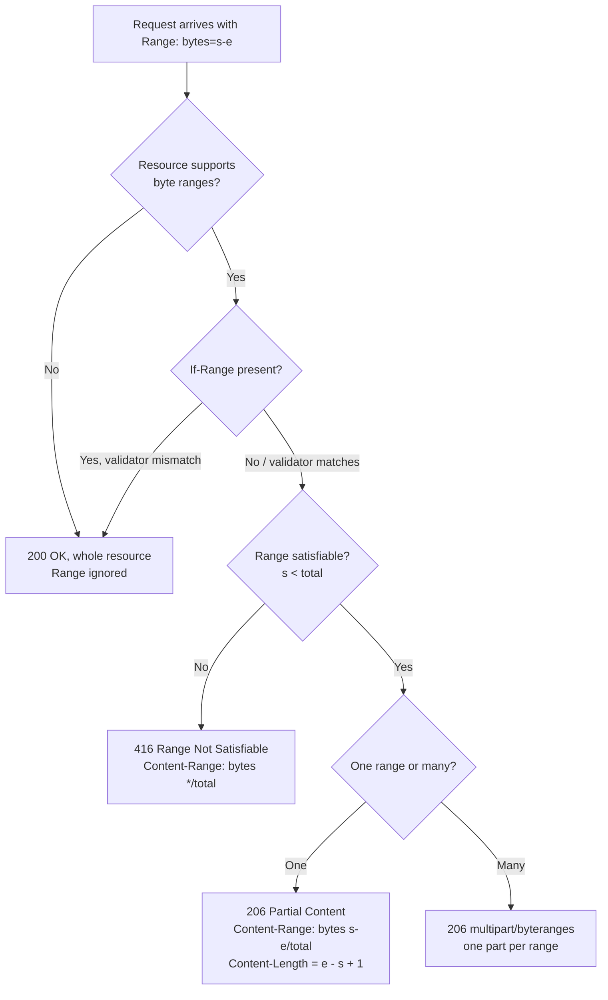
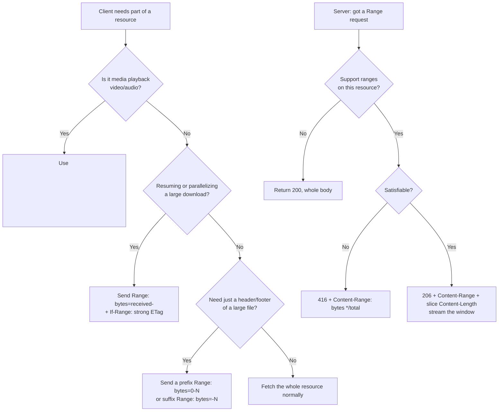

# Range

## Quick Summary

`Range` is a **request** header a client sends to ask for only *part* of a resource instead of the whole thing. Its value is almost always `bytes=start-end` (bytes is the only unit browsers, CDNs, and object stores implement in practice). A server that honors the range replies `206 Partial Content` with a [`Content-Range`](./Content-Range.md) header describing exactly which slice it sent and a body containing only those bytes; a server that ignores it returns the full `200 OK`; and a server whose resource cannot satisfy the range returns `416 Range Not Satisfiable`. `Range` is the single mechanism behind HTML5 `<video>`/`<audio>` **seeking**, **resumable and parallel downloads**, and CDN **segmented fetch** of large objects. It is discovered via [`Accept-Ranges: bytes`](../04-Response-Headers/Accept-Ranges.md) on a normal response, made safe for resumption by [`If-Range`](../12-Conditional-Requests/If-Range.md), and it is the request half of the pair whose response half is [`Content-Range`](./Content-Range.md). See the [Range Requests Overview](./Range-Requests-Overview.md) for the conceptual map.

## What problem does this header solve?

Without `Range`, HTTP is all-or-nothing: to read one byte of a resource you must download every byte. That is fatal for three production scenarios.

**Media seeking.** A user opens a 100 MB, two-hour movie and drags the scrubber to minute 42. Without ranges the browser would have to download minutes 0–41 first — tens of megabytes — before it could show a single frame at the target. Seeking would be unusable. With `Range`, the media element computes the byte offset for minute 42 and asks for exactly that slice; playback resumes in one round trip.

**Resumable downloads.** A 4 GB installer download drops at 2.1 GB on a flaky mobile link. Without ranges the client must restart from byte zero, throwing away 2.1 GB of transfer and the user's patience. With `Range: bytes=2202009600-` the client continues from where it stopped.

**Bandwidth saturation and origin economics.** Download managers open several connections, each pulling a different byte range of the same file in parallel, to fill a fat pipe a single TCP stream cannot. CDNs fetch giant objects from origin in fixed-size segments rather than one enormous GET, bounding origin egress and memory. All of that is `Range` under the hood.

The header solves the general problem of **random access into an HTTP resource** — reading an arbitrary window of a resource without transferring the rest, with no server-side session, using the byte offset as the entire state.

## Why was it introduced?

HTTP/1.0 had no partial-transfer mechanism at all. `Range` (and its response companions `206 Partial Content`, `Content-Range`, `Accept-Ranges`, and `If-Range`) were introduced in **HTTP/1.1, RFC 2068 (1997)** and carried through **RFC 2616 (1999)**. Range requests were later split out and cleanly re-specified in **RFC 7233 (2014, "Range Requests")** and are now defined in **RFC 9110 §14 (2022, "HTTP Semantics")**, the current authoritative reference.

The motivation was concrete and contemporaneous with the late-1990s web: large downloads over unreliable dial-up and early broadband links failed constantly, and restarting a multi-megabyte transfer from scratch was intolerable. Download managers and the "resume" button drove the need. The extensible `range-unit` grammar (`bytes`, with room for others) was designed so that other units could be added later, but in practice `bytes` is the only unit deployed at scale — `Accept-Ranges: none` explicitly disables ranges, and any non-`bytes` unit is universally ignored. When HTML5 `<video>`/`<audio>` arrived a decade later, range requests turned out to be exactly the primitive media seeking needed, and they became load-bearing for a use case their authors never imagined.

## How does it work?

The unit is `bytes`, offsets are **zero-based**, and both ends of a range are **inclusive** — `bytes=0-1023` is the first 1024 bytes. The value supports three shapes plus multi-range:

```
bytes=0-1023        first 1024 bytes (both ends inclusive)
bytes=1024-         from byte 1024 to the end (open-ended)
bytes=-500          the LAST 500 bytes (suffix range; the number is a length, not an offset)
bytes=0-99,500-599  multiple ranges -> multipart/byteranges response
```

The flow: the server advertises support with `Accept-Ranges: bytes` on a `200`; a client re-requests with `Range`; the server validates the range against the resource's total size and returns one of three outcomes — `206` (honored), `200` (ignored, allowed), or `416` (unsatisfiable).

- **Browser behavior:** The browser generates `Range` automatically for specific consumers — the media stack for `<video>`/`<audio>`, and its download engine on resume. Application `fetch()`/XHR can set `Range` manually. On a media element, the browser first issues a probe (`Range: bytes=0-` or a small initial window) to read the container metadata, then issues a fresh single-range request per seek. Browsers essentially never emit *multi*-range requests for media — they issue many single-range requests instead.
- **Server behavior:** The server parses `Range`, clamps/validates it against the resource size, and streams exactly the requested window with `206` + [`Content-Range`](./Content-Range.md) and a `Content-Length` equal to the *slice* size — or returns `416` with `Content-Range: bytes */total`. A server is always free to ignore `Range` and return `200`; clients must tolerate that. It should also honor [`If-Range`](../12-Conditional-Requests/If-Range.md) if present.
- **Proxy behavior:** A forwarding proxy passes `Range` through to the next hop. A caching proxy may satisfy a range from a fully cached object or forward the range upstream; it must never mix bytes from different resource versions.
- **CDN behavior:** The edge either serves the requested slice from a fully cached object (ideal: one origin fetch, unlimited edge seeks) or performs **segmented fetch** — requesting fixed-size chunks (e.g. 8 MB) from origin via its own upstream `Range` requests, caching them, and serving the slice. This requires the origin to support ranges and emit `Accept-Ranges: bytes` + a strong `ETag`.
- **Reverse proxy behavior:** Nginx serves ranges from static files and cached upstream responses natively (`max_ranges`, `proxy_cache`), and can fetch upstream objects in slices with the `slice` module.



## HTTP Request Example

A media seek — jump to a byte offset and stream from there to the end:

```http
GET /media/movie.mp4 HTTP/1.1
Host: cdn.example.com
Range: bytes=68000000-
Accept: */*
```

A resumable download that continues from where it dropped, guarded by the resource's ETag so it never stitches two versions together:

```http
GET /downloads/app-4.2.0.dmg HTTP/1.1
Host: dl.example.com
Range: bytes=2202009600-
If-Range: "a1b2c3d4e5f6"
```

A suffix range — the last 8 bytes (e.g. to read a trailer/footer without downloading the file):

```http
GET /archive/backup.zip HTTP/1.1
Host: files.example.com
Range: bytes=-8
```

## HTTP Response Example

The `206` for the open-ended seek above. Note `Content-Length` is the *slice* size, and `Content-Range`'s end is the inclusive last byte:

```http
HTTP/1.1 206 Partial Content
Content-Type: video/mp4
Accept-Ranges: bytes
Content-Range: bytes 68000000-104857599/104857600
Content-Length: 36857600
ETag: "9f2c-a1b2c3"
Cache-Control: public, max-age=3600
```

The `416` a client gets for `Range: bytes=99999999-` on a 1 MB file — the `*/total` form tells the client the true size so it can retry:

```http
HTTP/1.1 416 Range Not Satisfiable
Content-Range: bytes */1048576
Content-Length: 0
```

A `200` a server is allowed to return, ignoring the `Range` entirely (the client must accept the whole body):

```http
HTTP/1.1 200 OK
Content-Type: video/mp4
Accept-Ranges: bytes
Content-Length: 104857600
```

## Express.js Example

The overwhelmingly correct answer for serving files with range support is **`express.static` / `res.sendFile`** — they delegate to the `send` library, which fully implements `Range`, `206`, `Content-Range`, `If-Range`, `416`, and `Accept-Ranges: bytes` for you, streaming only the requested window off disk. You almost never hand-roll this:

```js
const express = require('express');
const app = express();

// `send` (used by express.static) parses Range, emits Accept-Ranges: bytes,
// returns 206 + Content-Range for valid ranges, 416 for unsatisfiable ones,
// honors If-Range against the file's ETag/mtime, and streams only the slice.
// Video seeking and resumable downloads work with ZERO extra code.
app.use('/media', express.static('/srv/media', {
  acceptRanges: true,  // default true. Set false to disable ranges (emits Accept-Ranges: none).
  cacheControl: true,
  maxAge: '1h',
  etag: true,          // strong-ish validator that If-Range compares against for safe resumption.
}));

app.listen(3000);
```

When the source is **not** a plain file on disk (an S3 object, a decrypted blob, a database BLOB), you must parse `Range` yourself. Here is a production-shaped handler that streams a file with correct `206`/`416` handling — the same logic `send` runs internally:

```js
const fs = require('fs');
const express = require('express');
const app = express();

app.get('/stream/:file', (req, res) => {
  const filePath = `/srv/media/${req.params.file}`;

  let stat;
  try {
    stat = fs.statSync(filePath);          // total size is the ground truth for every range calc.
  } catch {
    return res.sendStatus(404);
  }
  const total = stat.size;

  res.setHeader('Accept-Ranges', 'bytes'); // advertise support even on the 200/whole-file path.
  res.setHeader('Content-Type', 'video/mp4');

  const range = req.headers.range;
  if (!range) {
    // No Range header -> serve the whole file as 200. Streaming keeps memory flat.
    res.setHeader('Content-Length', total);
    return fs.createReadStream(filePath).pipe(res);
  }

  // Parse "bytes=start-end". end may be absent (open-ended); a leading "-N" is a suffix range.
  const m = /^bytes=(\d*)-(\d*)$/.exec(range);
  if (!m) {
    // Malformed or multi-range: reject the multi-range case here (we only do single ranges),
    // 416 with the true total is the safe, spec-compliant answer.
    res.setHeader('Content-Range', `bytes */${total}`);
    return res.status(416).end();
  }

  let start, end;
  if (m[1] === '') {
    // Suffix range: bytes=-500 -> the LAST 500 bytes.
    const suffixLen = parseInt(m[2], 10);
    start = Math.max(total - suffixLen, 0);
    end = total - 1;
  } else {
    start = parseInt(m[1], 10);
    end = m[2] === '' ? total - 1 : parseInt(m[2], 10); // open-ended -> to last byte.
  }
  end = Math.min(end, total - 1);                        // clamp: never read past EOF.

  // Unsatisfiable: start beyond EOF or an inverted range. RFC 9110 -> 416 + Content-Range: */total.
  if (start >= total || start > end) {
    res.setHeader('Content-Range', `bytes */${total}`);
    return res.status(416).end();
  }

  res.status(206);                                       // Partial Content is the whole point.
  res.setHeader('Content-Range', `bytes ${start}-${end}/${total}`); // end is INCLUSIVE.
  res.setHeader('Content-Length', end - start + 1);      // slice size; the +1 is the classic off-by-one.

  // createReadStream with start/end seeks to `start` and stops after `end` (inclusive),
  // so only the requested window ever flows through the process -> flat memory at any file size.
  // Piping gives backpressure for free: a slow client throttles the disk read automatically.
  fs.createReadStream(filePath, { start, end }).pipe(res);
});

app.listen(3000);
```

If you removed the `Content-Length: end - start + 1` line, clients that pre-allocate a buffer of that size would truncate or corrupt the download. If you dropped the `Math.min(end, total-1)` clamp, an over-long `end` would make `createReadStream` throw or send fewer bytes than advertised. If you returned `200` instead of `206`, the media element would treat the slice as the whole file and playback/seeking would break.

## Node.js Example

The raw `http` module differs only in that nothing — not `Accept-Ranges`, not status, not `Content-Range` — is set for you. The parsing/validation logic is identical to the Express handler above; the surrounding shape changes:

```js
const http = require('http');
const fs = require('fs');

http.createServer((req, res) => {
  const filePath = '/srv/media/movie.mp4';
  const { size: total } = fs.statSync(filePath);
  const range = req.headers.range;

  res.setHeader('Accept-Ranges', 'bytes');
  res.setHeader('Content-Type', 'video/mp4');

  if (!range) {
    res.writeHead(200, { 'Content-Length': total });
    return fs.createReadStream(filePath).pipe(res);
  }

  const m = /^bytes=(\d*)-(\d*)$/.exec(range);
  const start = m && m[1] !== '' ? parseInt(m[1], 10)
              : m && m[2] !== '' ? Math.max(total - parseInt(m[2], 10), 0) : 0;
  const end = m && m[1] !== '' && m[2] !== '' ? Math.min(parseInt(m[2], 10), total - 1) : total - 1;

  if (!m || start >= total || start > end) {
    // 416: no body, but MUST report the true size so the client can retry.
    res.writeHead(416, { 'Content-Range': `bytes */${total}` });
    return res.end();
  }

  res.writeHead(206, {
    'Content-Range': `bytes ${start}-${end}/${total}`,
    'Content-Length': end - start + 1,
  });
  fs.createReadStream(filePath, { start, end }).pipe(res);   // window-only read, backpressured.
}).listen(3000);
```

The takeaway is the same as elsewhere in this handbook: Express's `send`-based helpers give you spec-correct range handling for free, whereas raw `http` gives you zero defaults and full responsibility — which is exactly why you should only hand-roll this when the byte source is not a static file.

## React Example

React never sets `Range` in normal app code, and for the dominant use case it never needs to: when you render `<video src="/media/movie.mp4" controls />` or `<audio>`, the **browser's media stack** issues the `Range` probes and per-seek requests entirely on its own — your React component just points at the URL. This is why "streaming video in React" is usually a non-problem: mount a `<video>` element at a range-capable URL and seeking works.

React (or any browser code) *can* set `Range` explicitly via `fetch` when it needs a specific slice — for example, reading just a file header before deciding whether to download the whole thing:

```jsx
function useFileHeader(url) {
  const [header, setHeader] = React.useState(null);
  React.useEffect(() => {
    // Ask for only the first 16 bytes -> a magic-number / container sniff without
    // downloading the file. The browser sends `Range: bytes=0-15`; a range-capable
    // server replies 206 with just those bytes.
    fetch(url, { headers: { Range: 'bytes=0-15' } })
      .then(r => r.arrayBuffer())
      .then(buf => setHeader(new Uint8Array(buf)));
  }, [url]);
  return header;
}
```

Note two browser realities: the Fetch spec forbids setting `Range` on requests in some contexts (it is a "forbidden header name" only for a subset — plain `Range` is allowed), and a **CORS** cross-origin range request may need the server to expose/allow the header. For same-origin media the `<video>` element handles everything; for cross-origin media you additionally need the server to emit permissive CORS headers and honor ranges.

## Browser Lifecycle

1. **Element load.** For `<video>`/`<audio>`, the browser issues an initial request — often `Range: bytes=0-` or a small window — to read the container metadata (for MP4, the `moov` atom, which must be near the front for "fast start"). DevTools shows this as a `206`.
2. **Metadata parse.** The browser reads duration, track layout, and the index that maps timestamps to byte offsets.
3. **Progressive buffering.** As playback proceeds it requests forward ranges to fill the media buffer.
4. **Seek.** When the user drags the scrubber, the browser computes the byte offset for the target timestamp, **abandons the current buffer**, and issues a *fresh single-range request* from that offset. The `206` streams into the buffer and playback resumes.
5. **Download resume.** For file downloads interrupted mid-transfer, the download engine reissues `Range: bytes=<received>-` with `If-Range` set to the stored validator; a matching `206` appends, a `200` restarts.
6. **No session.** Every range request is independent and stateless against the same URL — the byte offset is the entire state. This is what makes range streaming trivially cacheable and CDN-friendly.

## Production Use Cases

- **HTML5 video/audio seeking.** The canonical case: serve an MP4/WebM/MP3 from `express.static`, a CDN, or object storage, and the `<video>`/`<audio>` element drives ranges automatically. Safari in particular *refuses* to play media whose server does not advertise `Accept-Ranges` and honor ranges.
- **Resumable large downloads.** Installers, disk images, datasets, backups. `Range` + [`If-Range`](../12-Conditional-Requests/If-Range.md) lets a dropped 4 GB transfer resume instead of restarting.
- **Parallel / segmented downloads.** Download accelerators open N connections at different offsets to saturate bandwidth a single stream cannot.
- **CDN segmented fetch.** The edge pulls huge objects from origin in fixed-size byte-range chunks, bounding origin egress and enabling instant edge seeks.
- **Partial reads of large files.** Reading a ZIP central directory (at the end), an image's EXIF header (at the front), or a Parquet footer — fetch just the needed window with a suffix or prefix range.
- **PDF progressive rendering.** Linearized ("fast web view") PDFs let a viewer fetch the first page's bytes and specific object ranges without downloading the whole document.

## Common Mistakes

- **Off-by-one on the inclusive end.** `Range`/`Content-Range` ends are *inclusive*. The slice length is `end - start + 1`, not `end - start`. Forgetting the `+1` truncates every response by one byte — the single most common range bug.
- **Returning `200` for a range request.** Legal per spec, but it breaks media seeking (the element thinks the slice is the whole file) and defeats resumable downloads. If you support ranges, return `206`.
- **Setting `Content-Length` to the full size on a `206`.** On `206`, `Content-Length` is the *slice* size; the full size lives in `Content-Range`'s `/total` field. Getting this wrong corrupts clients that pre-allocate buffers.
- **Reading the whole file into memory to serve a slice.** `fs.readFileSync` then slicing defeats the entire memory benefit. Use `fs.createReadStream(path, { start, end })` so only the window is read.
- **Ignoring `If-Range`.** Resuming a download without validating the resource hasn't changed can stitch bytes from two versions into a corrupt file. Honor `If-Range`; return the whole current file as `200` on validator mismatch.
- **Mishandling the suffix range.** `bytes=-500` is the *last* 500 bytes, not "from byte -500." Treating the leading `-` as a start offset produces garbage or a crash.
- **Advertising `Accept-Ranges: bytes` but returning `200`.** Advertising support you don't honor confuses clients and CDNs that plan segmented fetches around it.
- **Attempting multipart/byteranges when you don't need it.** Multi-range responses are fiddly and a DoS vector; most production systems support only single ranges and reject multi-range with `416` or serve `200`.

## Security Considerations

- **Range-amplification / overlapping-range DoS.** A malicious client can send a request with *many* small or heavily overlapping ranges (e.g. `bytes=0-,0-,0-,...` or thousands of tiny windows), forcing the server to build an enormous multipart/byteranges response or do disproportionate work — CPU, memory, and egress amplification. This is a documented class of attack (the 2011 "Apache Killer" exploited exactly this). Mitigations: **cap the number of ranges per request** (Nginx `max_ranges`), reject or coalesce overlapping/degenerate ranges, and prefer supporting only single ranges.
- **Resource-version confusion.** Without [`If-Range`](../12-Conditional-Requests/If-Range.md) + a **strong** validator, a resumed or parallel download can concatenate bytes from two different versions of a mutating resource, producing a silently corrupt file. Weak ETags are *not* safe for byte-range assembly.
- **Information disclosure via range probing.** Ranges let a client read arbitrary windows of a file; if access control is coarse or if error/`416` responses leak the true `/total` size, an attacker can map or partially exfiltrate resources they shouldn't fully access. Enforce authorization on the resource, not per byte.
- **Cache poisoning across ranges.** If a shared cache keys partly on `Range` but mishandles it, one client's slice can be served for another's request. The correct edge behavior keys on the URL and satisfies ranges from the whole cached object.
- **Request smuggling surface.** Like all length-affecting semantics, `Range` interacts with `Content-Length`/`Transfer-Encoding` parsing; ensure your proxy and origin agree on message framing.

## Performance Considerations

- **Ranges are a latency win, not a throughput one.** They let a client fetch exactly the bytes it needs (one seek target) instead of everything — the payoff is time-to-first-frame and avoided waste, not raw speed.
- **Stream, don't buffer.** `fs.createReadStream({ start, end })` piped to the response keeps memory flat and gives automatic backpressure: thousands of concurrent seekers throttle their own disk reads. Buffering whole objects per request is how a media server OOMs.
- **CDN range caching collapses origin load.** Cache the object once at the edge, serve unlimited sub-range seeks from it — origin sees one fetch regardless of how many users scrub around.
- **Segmented fetch bounds origin egress.** Edge segment-fetching (e.g. 8 MB chunks) means a user who watches the first 30 seconds of a 2-hour movie only pulls the segments they touch, not the whole file.
- **MP4 "fast start" matters.** If the `moov` atom is at the *end* of the file, the browser must range-fetch the tail before it can play the head — an extra round trip and a stall. Run `qt-faststart`/`-movflags +faststart` (ffmpeg) so metadata sits at the front.
- **HTTP/2 and HTTP/3.** Range semantics are unchanged across versions, but multiplexing means many concurrent per-seek range requests share one connection cheaply — no per-request TCP/TLS handshake, less head-of-line blocking (especially on HTTP/3/QUIC), which makes range-heavy media traffic smoother.

## Reverse Proxy Considerations

Nginx serves ranges from static files and cached upstream objects natively. The key knobs are range capping (DoS defense) and slice-based upstream fetching:

```nginx
http {
  # Cap the number of ranges per request to blunt overlapping-range amplification.
  max_ranges 1;                 # allow at most a single range; 0 disables ranges entirely.

  proxy_cache_path /var/cache/nginx keys_zone=media:100m max_size=50g inactive=7d;

  server {
    location /media/ {
      # Static files: Nginx honors Range and returns 206/416 automatically.
      root /srv;
    }

    location /proxied-media/ {
      proxy_pass http://origin_upstream;
      proxy_cache media;

      # Fetch large upstream objects in fixed 1 MB slices so a client's deep seek
      # only pulls the covering slices from origin, not the whole file.
      slice 1m;
      proxy_cache_key $uri$slice_range;      # each slice is cached independently.
      proxy_set_header Range $slice_range;   # ask origin for exactly this slice.
      proxy_http_version 1.1;
      proxy_cache_valid 200 206 7d;          # cache both full and partial upstream responses.

      add_header Accept-Ranges bytes;        # advertise range support to clients.
    }
  }
}
```

Points: `max_ranges` is your first line of defense against range-amplification DoS. The `slice` module turns one client range into cached origin slices — the reverse-proxy analogue of CDN segmented fetch. Nginx will serve a `206` from a cached full object without touching origin; if the origin does not support ranges, slicing degrades and Nginx may buffer whole objects.

## CDN Considerations

- **Serve-from-object vs segmented fetch.** The best case: the CDN caches the full object once, then satisfies every sub-range seek from the edge copy — one origin fetch, unlimited seeks. For very large objects, CDNs (CloudFront, Cloudflare, Fastly, Akamai) instead do **segmented fetch**: they split the object into fixed-size segments and fetch only the segments a client's range touches from origin, using their own upstream `Range` requests.
- **Origin requirements.** For either mode to work well, the **origin must support ranges, emit `Accept-Ranges: bytes`, and expose a strong `ETag`.** If the origin returns `200` for range requests, the CDN cannot slice efficiently and may buffer whole objects at the edge. Object stores (S3, GCS, Azure Blob, Vercel Blob) all support ranges natively — which is why "media straight from a bucket behind a CDN" just works.
- **Cache key must be the URL, not the range.** Keying the edge cache on the `Range` header shatters the cache into one entry per byte offset and destroys the hit rate. The range is satisfied *from* the cached object; it is not part of the key.
- **Cloudflare** streams large files and serves ranges from cache; it may require the object to be cacheable. **CloudFront** performs range/segmented fetch automatically against range-capable origins. **Fastly** can cache and serve ranges and supports segmented caching for large objects.

## Cloud Deployment Considerations

- **Object storage is the natural range origin.** S3, GCS, and Azure Blob honor `Range` on `GET` natively and return `206`/`Content-Range`. Serving media/downloads by presigning a bucket URL (or fronting the bucket with a CDN) gets you correct range handling without running a byte-streaming server at all.
- **API Gateways can break ranges.** Some gateways (and serverless function runtimes) buffer the entire response before returning it, which defeats streaming and may drop or mishandle `Range`/`206`. AWS API Gateway historically had payload-size limits and buffered responses; use CloudFront + S3 or a Lambda response-streaming path for large media rather than routing big files through a buffering gateway.
- **Load balancers** (ALB, GCP HTTPS LB) pass `Range`/`206` through untouched but terminate TLS — verify end-to-end with `curl -r`.
- **Serverless size/time limits.** Streaming a multi-GB file from a function that buffers in memory hits the runtime's memory/time cap. Prefer redirecting to a presigned object-store URL or using a runtime that supports true response streaming.

## Debugging

- **Chrome DevTools → Network:** a range-served request shows **Status `206`**; click it → Headers to see the `Range` you sent and the `Content-Range`/`Accept-Ranges` you got back. For a `<video>`, you will see a *series* of `206` requests to the same URL as you seek — that is ranges working.
- **curl:** `curl -r 0-1023 -sD - -o /dev/null https://example.com/file` requests the first 1 KB and dumps response headers — expect `206` + `Content-Range: bytes 0-1023/<total>`. Test unsatisfiable: `curl -r 99999999- https://example.com/small.txt` → `416` + `Content-Range: bytes */<total>`. Test resume safety with `-H 'If-Range: "etag"'`.
- **Postman / Bruno:** add a `Range: bytes=0-1023` request header; both show the `206` status and response headers. Bruno is handy for versioning a suite of range assertions (e.g. assert `res.status === 206` and parse `Content-Range`).
- **Node.js:** log `req.headers.range` on the server to see exactly what the client asked for, and `res.getHeaders()` before `end()` to confirm the `Content-Range`/`Content-Length` you emit.
- **Express logging:** `app.use((req,res,next)=>{res.on('finish',()=>console.log(req.method,req.url,req.headers.range||'-',res.statusCode,res.getHeader('content-range')||'-'));next();})` prints the requested range, status, and returned `Content-Range` per response.
- **ffprobe / mp4 tools:** if seeking is broken despite correct `206`s, check the container: `ffprobe -v trace file.mp4` or confirm the `moov` atom is at the front (`-movflags +faststart`).

## Best Practices

- [ ] Advertise support with [`Accept-Ranges: bytes`](../04-Response-Headers/Accept-Ranges.md) on the normal `200` response for any resource you allow ranges on.
- [ ] Return `206 Partial Content` (never `200`) when you honor a range, with a correct [`Content-Range`](./Content-Range.md) and a slice-sized `Content-Length`.
- [ ] Remember the end is **inclusive**: slice length is `end - start + 1`.
- [ ] Return `416` + `Content-Range: bytes */total` for ranges beyond EOF; never a silent empty `206`.
- [ ] Stream with `fs.createReadStream(path, { start, end })` — never read the whole file into memory.
- [ ] Honor [`If-Range`](../12-Conditional-Requests/If-Range.md) with a **strong** [`ETag`](../04-Response-Headers/ETag.md) so resumed/parallel downloads can't mix versions.
- [ ] Cap ranges per request (Nginx `max_ranges 1`) and prefer single-range support to blunt amplification DoS.
- [ ] Prefer `express.static`/`res.sendFile`, object storage, or a CDN over hand-rolled range code when the source is a file.
- [ ] Run MP4s through `+faststart` so `moov` is at the front and seeking needs no tail fetch.
- [ ] Keep the CDN/edge cache key on the URL, not the `Range`, so ranges are served from one cached object.

## Related Headers

- [Content-Range](./Content-Range.md) — the response half: describes the returned slice as `bytes start-end/total` on `206`, and `*/total` on `416`.
- [Accept-Ranges](../04-Response-Headers/Accept-Ranges.md) — the server's advertisement (`bytes`/`none`) that makes ranges discoverable.
- [If-Range](../12-Conditional-Requests/If-Range.md) — the conditional that makes resumable/parallel downloads safe by pinning the resource version.
- [ETag](../04-Response-Headers/ETag.md) / [Last-Modified](../04-Response-Headers/Last-Modified.md) — the validators `If-Range` compares against; a strong `ETag` is required for safe byte assembly.
- [Content-Length](../04-Response-Headers/Content-Length.md) — full size on `200`, slice size on `206`.
- [Cache-Control](../06-Caching-Headers/Cache-Control.md) — governs how the object (and thus its cached ranges) is stored at the edge.
- [Range Requests Overview](./Range-Requests-Overview.md) — the chapter map tying the status codes and handshake together.

## Decision Tree



## Mental Model

Think of a resource as a **long book on a library shelf**, and `Range` as a note you hand the librarian: *"I don't want the whole book — photocopy pages 68 through 104 and give me just those."* [`Accept-Ranges: bytes`](../04-Response-Headers/Accept-Ranges.md) is the sign on the desk saying "yes, we do partial photocopies, by the page." A `206` is the librarian handing back exactly those pages, stapled with a slip ([`Content-Range`](./Content-Range.md)) that reads "pages 68–104 of 104." A `416` is "that book only has 100 pages" (`*/100`). [`If-Range`](../12-Conditional-Requests/If-Range.md) is you adding *"...but only if it's still the 2nd edition I was reading; if they've swapped in a new edition, just give me the whole new book"* — so you never end up with a Frankenstein copy that's half one edition and half another. Video seeking is you walking back to the desk over and over — "now pages 200–210, now pages 5–9" — each request independent, the page number the only thing either of you needs to remember.
