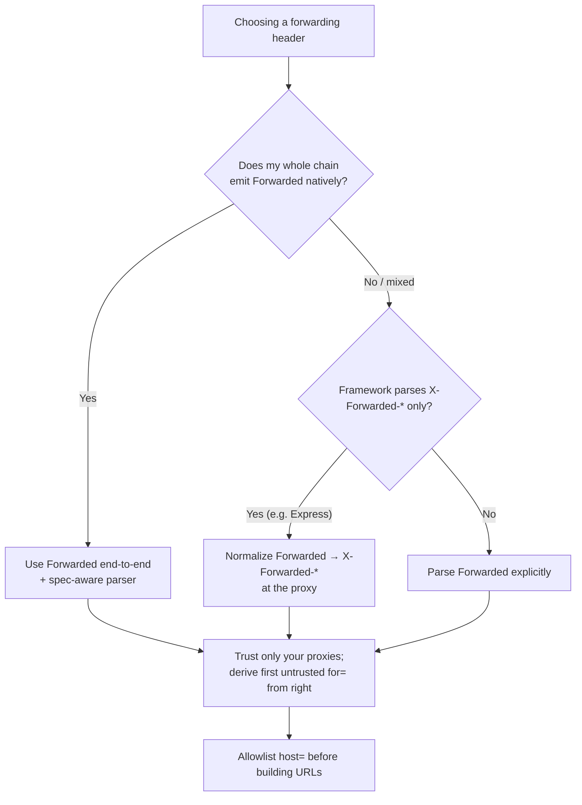

# Forwarded

## Quick Summary

`Forwarded` is the **RFC-standardized request** header (RFC 7239, 2014) that consolidates the whole `X-Forwarded-*` family into one structured field. Instead of three separate ad-hoc headers — [`X-Forwarded-For`](./X-Forwarded-For.md) (client IP), [`X-Forwarded-Proto`](./X-Forwarded-Proto.md) (scheme), [`X-Forwarded-Host`](./X-Forwarded-Host.md) (original host) — `Forwarded` carries all of that (plus a `by=` parameter naming the proxy interface) as a list of semicolon-separated key/value pairs, one comma-separated element per proxy hop: `Forwarded: for=203.0.113.7;proto=https;host=www.example.com, for=198.51.100.4`. Each proxy **appends** its own element, so the list reads left-to-right from client to origin, exactly like XFF. It fixes real ambiguities in the `X-` conventions — it can represent IPv6 unambiguously (quoted), express "unknown" and obfuscated identifiers, and keep each hop's IP/proto/host *grouped together* rather than spread across three independently-truncated lists. Despite being the *correct*, standardized answer, it remains **less widely deployed** than the entrenched `X-Forwarded-*` headers, so most stacks still emit and parse XFF. Like all forwarding headers it is **client-forgeable** and must only be trusted from proxies you control.

## What problem does this header solve?

The `X-Forwarded-*` family works, but it has structural problems that `Forwarded` was designed to fix:

1. **Correlation across three headers.** With `X-Forwarded-For`, `X-Forwarded-Proto`, and `X-Forwarded-Host` as *separate* comma-lists, you can't reliably tell which IP corresponds to which proto/host at a given hop — especially if some proxies add one header but not another, or a list gets truncated. `Forwarded` groups each hop's facts (`for`, `proto`, `host`, `by`) into a single element, so hop N's IP and hop N's scheme stay together.

2. **IPv6 ambiguity.** IPv6 addresses contain colons, which collide with the `host:port` and general HTTP syntax. XFF never defined quoting, so IPv6 in XFF is inconsistently formatted. `Forwarded` mandates quoting for IPv6 (`for="[2001:db8::1]:8080"`), removing the ambiguity.

3. **No standard for "unknown" / obfuscation.** `Forwarded` defines `unknown` and `_obfuscatedIdentifier` tokens for cases where a proxy wants to record "a hop existed" without revealing a real address — useful for privacy and internal-topology hiding.

4. **No specification at all.** `X-Forwarded-*` are conventions with subtly different behavior across implementations. `Forwarded` is an actual RFC with defined grammar and semantics, so independent implementations can interoperate predictably.

In short: `Forwarded` solves the *same* problem as the `X-` family (recovering the client's IP/scheme/host behind proxies) but with a well-specified, unambiguous, extensible structure.

## Why was it introduced?

By the early 2010s, `X-Forwarded-For` and friends were ubiquitous but chaotic — every proxy implemented them slightly differently, IPv6 was a mess, and correlating a hop's IP with its scheme/host was unreliable. The IETF standardized the concept in **RFC 7239 ("Forwarded HTTP Extension", 2014)** to give the web *one* header with defined grammar, IPv6-safe quoting, an explicit obfuscation/`unknown` story, and room for extension parameters. It deliberately mirrors the `X-Forwarded-*` semantics so migration is conceptual-preserving. Adoption has been slow precisely *because* the `X-` headers already worked "well enough" and are baked into countless configs, load balancers, and frameworks — a classic case of an inferior-but-entrenched standard resisting a superior-but-later one. Today you should understand both: emit/parse `Forwarded` where your stack supports it cleanly, but expect to interoperate with `X-Forwarded-*` for the foreseeable future.

## How does it work?

Each hop appends a comma-separated **element**, itself a set of semicolon-separated **parameters**:

- `for=` — the client (or previous hop) that this proxy received the connection from; the analog of one [`X-Forwarded-For`](./X-Forwarded-For.md) entry. IPv6 and ports must be quoted.
- `by=` — the *interface* of the proxy that received the request (which of the proxy's own addresses); no direct `X-` equivalent.
- `proto=` — the client's scheme (`http`/`https`); analog of [`X-Forwarded-Proto`](./X-Forwarded-Proto.md).
- `host=` — the original `Host`; analog of [`X-Forwarded-Host`](./X-Forwarded-Host.md).

```
Forwarded: for=203.0.113.7;proto=https;host=www.example.com, for=198.51.100.4
```

```mermaid
sequenceDiagram
    participant C as Client (203.0.113.7)
    participant CDN as CDN (198.51.100.4)
    participant LB as Load balancer
    participant App as Origin
    C->>CDN: HTTPS GET (Host: www.example.com)
    Note over CDN: append element for the client
    CDN->>LB: Forwarded: for=203.0.113.7;proto=https;host=www.example.com
    Note over LB: append element for the CDN hop
    LB->>App: Forwarded: for=203.0.113.7;proto=https;host=www.example.com, for=198.51.100.4
    Note over App: Real client = first UNTRUSTED element from the right
```

- **Browser behavior:** Browsers do **not** send `Forwarded`; it's an intermediary/server header.
- **Server behavior:** The origin parses `Forwarded` (only from trusted proxies) to recover client IP/scheme/host, walking from the right past trusted hops — exactly the trust model of XFF.
- **Proxy behavior:** A conforming proxy appends its element; at the internet-facing edge it should overwrite client-supplied `Forwarded` to prevent forgery. It may obfuscate `for`/`by`.
- **CDN behavior:** Support varies — some CDNs emit `Forwarded`, most still emit `X-Forwarded-*` (and their own client-IP headers). Check your CDN.
- **Reverse proxy behavior:** Nginx doesn't emit `Forwarded` automatically; you construct it (e.g. via a `map`) or, more commonly, keep using `proxy_set_header X-Forwarded-*`. Some proxies (HAProxy, Envoy) support `Forwarded` natively.

## HTTP Request Example

Single-proxy request:

```http
GET /api/orders HTTP/1.1
Host: app-backend.internal
Forwarded: for=203.0.113.7;proto=https;host=www.example.com
```

Multi-proxy chain with IPv6 (note quoting) and a `by=`:

```http
GET /api/orders HTTP/1.1
Host: app-backend.internal
Forwarded: for="[2001:db8::1]:4711";proto=https;host=www.example.com;by=203.0.113.43, for=198.51.100.4
```

Obfuscated identifiers (privacy / topology hiding):

```http
GET / HTTP/1.1
Host: app.internal
Forwarded: for=_hidden;proto=https;host=www.example.com, for=unknown
```

## HTTP Response Example

`Forwarded` is **request-only** — it does not appear on responses. The origin consumes it and logs the derived client facts. (For a symmetric, response-side record of the proxy chain, see [`Via`](./Via.md).)

## Express.js Example

Express's `trust proxy` natively understands **`X-Forwarded-*`**, not `Forwarded` — so if your edge emits `Forwarded`, you typically parse it yourself or normalize it into XFF at the proxy. Here's robust handling of both:

```js
const express = require('express');
const app = express();

app.set('trust proxy', 1); // governs X-Forwarded-* → req.ip/req.protocol/req.hostname

const ALLOWED_HOSTS = new Set(['www.example.com', 'shop.example.com']);

// Parse the RFC 7239 Forwarded header when present (Express won't do it for you).
function parseForwarded(header) {
  // Returns an array of {for, by, proto, host} elements, left→right.
  return (header || '').split(',').map(element => {
    const params = {};
    element.split(';').forEach(pair => {
      const [k, ...rest] = pair.trim().split('=');
      if (k) params[k.toLowerCase()] = rest.join('=').replace(/^"|"$/g, ''); // unquote
    });
    return params;
  }).filter(p => Object.keys(p).length);
}

app.use((req, res, next) => {
  const fwd = req.headers['forwarded'];
  if (fwd) {
    const hops = parseForwarded(fwd);
    // Take the leftmost element's client facts (already trust-gated at the edge).
    const client = hops[0] || {};
    req.clientIp = client.for || req.ip;
    req.clientProto = client.proto || req.protocol;
    req.clientHost = client.host || req.hostname;
  } else {
    // Fall back to X-Forwarded-* via Express's derived values.
    req.clientIp = req.ip;
    req.clientProto = req.protocol;
    req.clientHost = req.hostname;
  }

  // ALWAYS validate the host before using it (host-header injection defense).
  if (!ALLOWED_HOSTS.has((req.clientHost || '').split(':')[0])) {
    return res.status(400).send('Invalid host');
  }
  next();
});

app.get('/whoami', (req, res) => {
  res.json({ ip: req.clientIp, proto: req.clientProto, host: req.clientHost });
});

app.listen(3000);
```

Why each piece matters: because Express only natively derives from `X-Forwarded-*`, you must **parse `Forwarded` explicitly** if your edge emits it — the `parseForwarded` helper splits elements/parameters and unquotes IPv6/values. The single most important safety line is the host **allowlist** check: even though `Forwarded` is standardized, its `host=` is just as forgeable as XFH, so it must be validated before feeding URL generation. In most real deployments the pragmatic move is to **normalize at the proxy** — have your edge translate `Forwarded` into the `X-Forwarded-*` that Express understands — rather than parse it in every app.

## Node.js Example

Raw `http` — trust-gate, parse, validate:

```js
const http = require('http');

const TRUSTED_PEERS = ['10.0.0.9', '198.51.100.4'];
const ALLOWED_HOSTS = new Set(['www.example.com']);

http.createServer((req, res) => {
  const trusted = TRUSTED_PEERS.includes(req.socket.remoteAddress);
  const fwd = trusted ? req.headers['forwarded'] : null;

  let clientIp = req.socket.remoteAddress, proto = 'http', host = req.headers['host'];
  if (fwd) {
    const first = fwd.split(',')[0];                 // leftmost hop = client
    for (const pair of first.split(';')) {
      const [k, v] = pair.trim().split('=');
      const val = (v || '').replace(/^"|"$/g, '');   // unquote
      if (k === 'for') clientIp = val;
      if (k === 'proto') proto = val;
      if (k === 'host') host = val;
    }
  }

  if (!ALLOWED_HOSTS.has((host || '').split(':')[0])) { res.statusCode = 400; return res.end('bad host'); }
  res.end(JSON.stringify({ clientIp, proto, host }));
}).listen(3000);
```

Same rules as the `X-` family: trust only from known peers, take the leftmost element, unquote IPv6, and validate the host.

## React Example

React never sends or reads `Forwarded` — it's a proxy/server header. Its indirect effects are identical to the `X-Forwarded-*` pages:

1. **Client identification, geo, rate-limit, and link generation** all depend on the server correctly parsing `Forwarded` (or the XFF fallback). Misconfiguration yields wrong-IP logs, shared rate-limit buckets, or wrong-scheme/host URLs — symptoms surface in the React app.
2. **SSR/Next.js** absolute-URL and tenant logic reads forwarding info via the platform; whether that's `Forwarded` or `X-Forwarded-*` is a platform detail, but the correctness impact (canonical URLs, redirects) shows in the rendered app.
3. **You don't set it client-side** — browsers ignore attempts, and a correct server trusts it only from its own proxies.

## Browser Lifecycle

There is **no browser lifecycle** for `Forwarded`. Browsers never generate, read, or expose it. It is created by the first proxy (which records the client's `for`/`proto`/`host`) and appended to by each subsequent hop, then consumed at the origin. The browser is merely the client whose facts get recorded in the first element.

## Production Use Cases

- **Standards-based client-IP/scheme/host recovery** in stacks (HAProxy, Envoy, some gateways) that emit `Forwarded` natively.
- **IPv6-heavy environments** where XFF's lack of quoting is error-prone — `Forwarded`'s quoting is unambiguous.
- **Privacy-conscious topologies** using `_obfuscated`/`unknown` to record hops without leaking real addresses.
- **Correlated per-hop data** where you need each hop's IP+scheme+host grouped (audit, complex multi-proxy debugging).
- **New greenfield infrastructure** choosing the standardized header from the start.

## Common Mistakes

- **Assuming frameworks parse it automatically.** Express `trust proxy` handles `X-Forwarded-*`, **not** `Forwarded` — you must parse `Forwarded` yourself or normalize it upstream.
- **Trusting it unconditionally.** Standardized ≠ trustworthy; it's still a forgeable request header. Trust only from your proxies; validate `host=`.
- **Mishandling quotes/IPv6.** `for="[2001:db8::1]:8080"` must be unquoted and bracket-parsed correctly; naive splitting on `:` or `,` breaks it.
- **Mixing `Forwarded` and `X-Forwarded-*` inconsistently.** If both are present and disagree (some hops emit one, some the other), you can derive conflicting client facts. Pick one canonical source at your trust boundary.
- **Splitting on commas inside quotes.** Element/parameter parsing must respect quoted strings.
- **Reflecting `host=` into URLs without an allowlist.** Same host-header-injection risk as [`X-Forwarded-Host`](./X-Forwarded-Host.md).
- **Expecting universal CDN support.** Many CDNs still emit only `X-Forwarded-*` and vendor headers.

## Security Considerations

- **Client-forgeable — same trust model as the `X-` family.** Only elements appended by proxies inside your trust boundary are meaningful; walk from the right, skip trusted hops, take the first untrusted `for`. Overwrite client-supplied `Forwarded` at the internet-facing edge.
- **Host-header injection via `host=`.** Identical risk to XFH: never build links/redirects from an unvalidated `host=`; allowlist.
- **IP spoofing / rate-limit & allowlist bypass via `for=`.** Same as XFF: naive trust of the leftmost `for` enables spoofing. Key security decisions on the trust-derived value only.
- **Parser robustness = security.** Because the grammar is richer (quotes, obfuscation, extensions), a sloppy parser can be tricked (e.g. quoted commas hiding elements). Use a spec-aware parser and reject malformed input.
- **PII.** `for=` addresses are personal data (GDPR) — handle/retain accordingly; the `_obfuscated`/`unknown` forms can help.
- **Firewall the origin** so the edge can't be bypassed with a forged `Forwarded`.

## Performance Considerations

- **Slightly larger than a single `X-` header** per hop (it packs more per element), but comparable overall to sending the three `X-Forwarded-*` headers together — and compressed under HTTP/2/3.
- **Fewer headers, better correlation:** one structured header can be marginally cheaper to process and log than reconciling three separate lists.
- **Correctness is the real win:** unambiguous IPv6 and grouped per-hop data reduce mis-derivation bugs that cause outages (loops, wrong rate-limit buckets).
- **Parsing cost** is a touch higher than XFF (structured grammar) but negligible per request; derive once and cache on the request object.

## Reverse Proxy Considerations

Nginx has no built-in `Forwarded` support; you either construct it or (more commonly) keep `X-Forwarded-*`. Constructing a minimal `Forwarded`:

```nginx
http {
  # Build a Forwarded element from Nginx variables.
  map $scheme $fwd_proto { default $scheme; }

  server {
    listen 443 ssl;
    server_name www.example.com;

    location / {
      # Emit a standards element for the current hop. To PRESERVE an upstream
      # Forwarded chain, prepend $http_forwarded via another map.
      proxy_set_header Forwarded "for=$remote_addr;host=$host;proto=$scheme";
      # Most deployments ALSO/instead set the X- headers for framework compatibility:
      proxy_set_header X-Forwarded-For $proxy_add_x_forwarded_for;
      proxy_set_header X-Forwarded-Proto $scheme;
      proxy_set_header X-Forwarded-Host $host;
      proxy_pass http://app_upstream;
    }
  }
}
```

Key points: because Nginx won't append to an existing `Forwarded` automatically, `proxy_set_header Forwarded "..."` here *replaces* it — to preserve a chain you must concatenate `$http_forwarded` via a `map`. At the internet-facing edge, replacing (not preserving) client-supplied `Forwarded` is actually the *secure* default. Proxies like **HAProxy** (`option forwardfor` plus `http-request set-header Forwarded`) and **Envoy** support `Forwarded`/XFF more natively.

## CDN Considerations

- **Support is uneven.** Some CDNs emit `Forwarded`; many still emit only `X-Forwarded-*` plus their own authoritative client-IP header (Cloudflare `CF-Connecting-IP`, etc.). Check your CDN's docs and prefer its dedicated header for the client IP when available.
- **Trust only CDN egress ranges** for `Forwarded`, and firewall the origin against bypass.
- **Normalize at the edge:** if your CDN emits `Forwarded` but your app expects XFF (or vice-versa), translate at the reverse proxy so the app has one canonical source.
- **Obfuscation:** CDNs may use `_obfuscated`/`unknown` for internal hops; don't rely on their internal fan-out being visible.

## Cloud Deployment Considerations

- **Load balancers:** AWS ALB, GCP, and Azure LBs predominantly emit `X-Forwarded-*` (not `Forwarded`); set app trust to the LB and use XFF, or normalize.
- **Service meshes (Envoy/Istio):** Envoy supports both `Forwarded` and `X-Forwarded-*` with configurable trusted-hop counts — a good place to standardize.
- **API gateways:** vary; check whether they emit `Forwarded` and configure trust accordingly.
- **Managed platforms (Vercel/Netlify):** expose client facts via platform APIs/headers; use those rather than assuming `Forwarded` is present.
- **Universal rule:** pick one canonical forwarding source at your trust boundary, configure trust to your exact topology, and validate `host=`.

## Debugging

- **curl (spoof test):** `curl -H 'Forwarded: for=1.2.3.4;host=evil.com;proto=https' https://your-origin/whoami` directly at the origin — if the app reflects those values, trust/validation is too loose.
- **Echo endpoint:** return the parsed `for`/`proto`/`host` plus the raw `Forwarded` and `X-Forwarded-*` and `req.socket.remoteAddress` to compare sources.
- **curl through the real path:** hit the public URL and confirm derived client facts match reality.
- **IPv6 parsing check:** send `Forwarded: for="[2001:db8::1]:8080"` and verify your parser extracts the address and port correctly.
- **Nginx:** log `$http_forwarded` and the `$proxy_add_x_forwarded_for` to compare inbound vs emitted.
- **Consistency:** if both `Forwarded` and `X-Forwarded-*` are present, log both and confirm they agree; disagreement signals a normalization gap.

## Best Practices

- [ ] Choose **one** canonical forwarding source at your trust boundary (`Forwarded` *or* `X-Forwarded-*`) and normalize the other to it.
- [ ] Configure trust to your **exact** proxy topology; derive the client as the first untrusted `for` from the right.
- [ ] Overwrite client-supplied `Forwarded` at the internet-facing edge; trust it only from your proxies.
- [ ] Use a **spec-aware parser** (quotes, IPv6 brackets, obfuscation tokens); reject malformed input.
- [ ] **Allowlist** `host=` before using it in URLs/redirects/routing (host-header-injection defense).
- [ ] Remember frameworks like Express handle `X-Forwarded-*`, **not** `Forwarded` — parse or normalize explicitly.
- [ ] Treat `for=` addresses as **PII**; consider obfuscation where appropriate.
- [ ] Firewall the origin so the edge can't be bypassed with a forged header.

## Related Headers

- [X-Forwarded-For](./X-Forwarded-For.md) — the entrenched `for=` predecessor; client IP chain.
- [X-Forwarded-Proto](./X-Forwarded-Proto.md) — the `proto=` predecessor; client scheme.
- [X-Forwarded-Host](./X-Forwarded-Host.md) — the `host=` predecessor; original host.
- [X-Real-IP](./X-Real-IP.md) — a simpler single-client-IP convention.
- [Via](./Via.md) — the other standardized chain header (proxy identities, symmetric on req/resp); complementary to `Forwarded`.
- [Host](../03-Request-Headers/Host.md) — what `host=` preserves.
- [Origin](../03-Request-Headers/Origin.md) — for CSRF/CORS origin checks (not `Forwarded`).
- [Proxies Overview](./Proxies-Overview.md) — the forwarding/trust framing.

## Decision Tree



## Mental Model

Think of `Forwarded` as the **modern, official multi-line customs stamp** that replaced three separate scraps of paper. In the old system, a parcel crossing borders collected three independent sticky notes — one listing sender addresses (`X-Forwarded-For`), one listing "shipped secure?" flags (`X-Forwarded-Proto`), and one listing intended delivery addresses (`X-Forwarded-Host`) — and if one note got torn or a border agent forgot to add to it, you could no longer tell which sender went with which security flag at which crossing. `Forwarded` is the redesigned passport page where **each border crossing gets one complete, structured stamp** — sender, security, destination, and *which* border booth handled it — all grouped on a single line, with proper brackets so even complicated addresses (IPv6) can't be misread, and an option to stamp "identity withheld" for privacy. It's unambiguously the better system. The catch is the same as adopting any new standard while the old paperwork still circulates: most border posts (proxies/CDNs) were built for the three-scraps system and keep using it, so you must be fluent in both — and, exactly as before, a stamp added *before the parcel entered your country* was written by a stranger and means nothing until one of *your own* border booths vouches for it.
