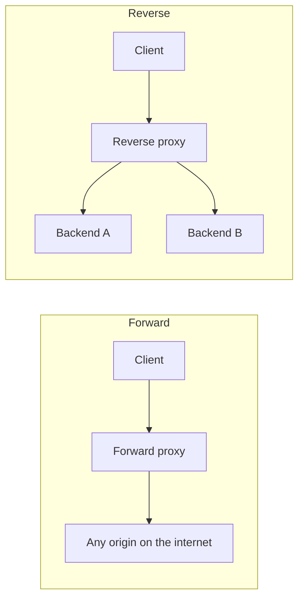
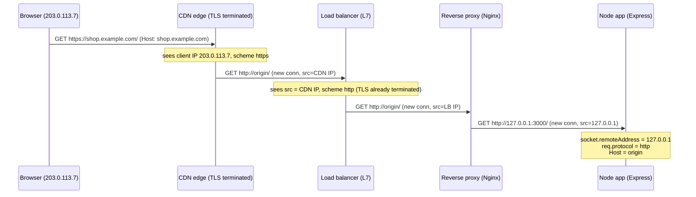
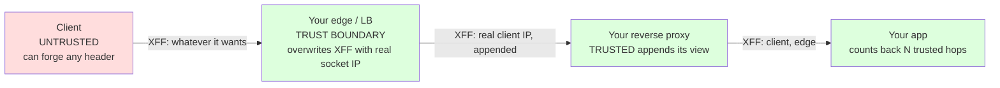

# Proxies Overview

Almost nothing you ship in production talks to the browser directly. Between the client's TCP stack and your Node process there is, at minimum, a load balancer, and usually a CDN edge, a WAF, one or more reverse proxies, and a service mesh sidecar. Every one of these is an *intermediary* — an HTTP-speaking box that terminates one connection and opens another. The moment an intermediary exists, three facts about the request that your application code cares about are no longer trustworthy: **who the client is** (their IP), **how they connected** (http vs https), and **what they asked for** (the `Host` they typed). This chapter is about that problem and the headers invented to solve it.

If you only remember one thing: **every forwarding header is a claim made by whoever wrote it, and it is only as trustworthy as that writer.** Getting the trust boundary wrong is not a style issue — it is how rate limiters get bypassed, how audit logs get poisoned, and how one tenant reads another tenant's cache.

## Forward proxies vs reverse proxies

The words "proxy" and "gateway" get used loosely. The distinction that actually matters is *whose agent the proxy is* — the client's or the server's.

A **forward proxy** sits in front of *clients* and acts on their behalf. Corporate egress proxies, `HTTP_PROXY`-style developer proxies (Charles, mitmproxy), and privacy proxies all fit here. The origin server has no idea the proxy exists, treats it as the client, and sees the proxy's IP as the source. The client explicitly configures it. Forward proxies are the classic subject of `Proxy-Authorization` and `Proxy-Authenticate` (see [End-to-End vs Hop-by-Hop Headers](../01-Introduction/End-to-End-vs-Hop-by-Hop-Headers.md)).

A **reverse proxy** sits in front of *servers* and acts on their behalf. Nginx, HAProxy, Envoy, Traefik, an AWS ALB, a Cloudflare edge — all reverse proxies. The *client* has no idea it exists; it thinks the reverse proxy *is* the origin. The reverse proxy terminates the client's TLS, inspects/routes/rewrites, and opens a fresh connection to a backend (often plain HTTP on a private network). This is the box that must *inject* the forwarding headers, because it is the last node that still knows the truth about the client before that truth is erased by the next hop.



A **load balancer** is a specialized reverse proxy whose primary job is distributing connections across a backend pool. At L4 (TCP/UDP — AWS NLB, IPVS) it forwards packets without parsing HTTP, so it cannot add `X-Forwarded-*` headers (it may use the [PROXY protocol](#the-proxy-protocol-l4-load-balancers) instead). At L7 (HTTP — AWS ALB, GCP HTTPS LB, Nginx `upstream`) it parses HTTP and *can* inject forwarding headers. Knowing which layer your LB operates at tells you whether forwarding headers are even available.

## The forwarding-header problem

Consider a request that traverses a CDN, then a load balancer, then a reverse proxy, then your app. Each hop is a distinct TCP connection:



By the time the request reaches `App`, the kernel-level truth is useless:

- `socket.remoteAddress` is `127.0.0.1` (or the reverse proxy's private IP), **not** the browser's `203.0.113.7`. Every request looks like it came from your own infrastructure.
- The connection to the app is **plain HTTP**, even though the user connected over HTTPS. `req.secure` is `false`, `req.protocol` is `http`.
- The `Host` header the app sees may be an internal origin name (`origin`, `127.0.0.1:3000`) rather than `shop.example.com` that the user typed and that your absolute-URL generation, canonical links, and cookie domains depend on.

Three pieces of end-user reality — **IP, scheme, host** — are destroyed by the very act of proxying, because TCP connections don't compose and HTTP has no built-in notion of "the original client three hops ago." The forwarding headers exist to carry that reality forward *in the message body of the HTTP request itself*, since the transport can't.

The two families that solve this:

| Concern | De-facto header | Standard (RFC 7239) |
|---|---|---|
| Original client IP (+ chain) | [`X-Forwarded-For`](./X-Forwarded-For.md), [`X-Real-IP`](./X-Real-IP.md) | [`Forwarded`](./Forwarded.md) `for=` |
| Original scheme | [`X-Forwarded-Proto`](./X-Forwarded-Proto.md) | `Forwarded` `proto=` |
| Original host | [`X-Forwarded-Host`](./X-Forwarded-Host.md) | `Forwarded` `host=` |
| Proxy chain identity / loop detection | [`Via`](./Via.md) | `Via` (standard) + `Forwarded` `by=` |

## Hop-by-hop stripping — why intermediaries rewrite

Some headers are meaningful only for a single connection and *must not* be forwarded: `Connection`, `Keep-Alive`, `Transfer-Encoding`, `Upgrade`, `TE`, `Trailer`, `Proxy-Authenticate`, `Proxy-Authorization`. A conforming proxy consumes and re-negotiates these per hop. This is why WebSocket upgrades break through a default Nginx config, and why `Transfer-Encoding` can be re-framed to `Content-Length` between hops. The full treatment lives in [End-to-End vs Hop-by-Hop Headers](../01-Introduction/End-to-End-vs-Hop-by-Hop-Headers.md); the key point for *this* chapter is that forwarding headers (`X-Forwarded-*`, `Forwarded`, `Via`) are **end-to-end** — they are meant to survive every hop and accumulate. `Via` in particular is *appended to* by each proxy, and `X-Forwarded-For` grows by one IP per hop. That accumulation is the mechanism, and also the attack surface.

## Trust boundaries — the entire security model

Here is the load-bearing idea of the whole chapter.

Forwarding headers are **plain request headers**. Any client can send them. A curl one-liner can claim:

```http
GET /admin HTTP/1.1
Host: example.com
X-Forwarded-For: 127.0.0.1
X-Forwarded-Proto: https
```

If your app naively believes `X-Forwarded-For`, this client just claimed to be `127.0.0.1` — which your IP allowlist, your rate limiter's "trusted internal" carve-out, or your "localhost can skip auth" shortcut may treat as privileged. This is a real, common, exploited vulnerability class.

The headers become trustworthy **only** when a proxy you control **overwrites** (not appends to) whatever the client sent, replacing it with a value the proxy observed at the socket level. The rule that makes the system safe:

> A forwarding header is trustworthy up to and including the first hop you control, and garbage before it. You must count hops from the outside in and trust *exactly* the number of proxies you actually run — no more, no less.

This "number of trusted hops" is precisely what Express's [`trust proxy`](../17-ExpressJS/Headers-in-Express.md) setting configures, what Nginx's `set_real_ip_from` / `real_ip_recursive` configures, and what every framework's equivalent configures. Set it too high and clients spoof; set it too low and you attribute every request to your own edge. The per-header pages ([`X-Forwarded-For`](./X-Forwarded-For.md), [`X-Forwarded-Proto`](./X-Forwarded-Proto.md)) go deep on the exploit mechanics; internalize the principle here.



Everything to the left of the trust boundary is adversarial input. Everything to the right is infrastructure you operate. The forwarding header is only meaningful once it has crossed that boundary and been rewritten by the first node you trust.

## De-facto `X-Forwarded-*` vs standard `Forwarded`

For a decade the industry converged on the `X-` prefixed headers — `X-Forwarded-For`, `X-Forwarded-Proto`, `X-Forwarded-Host` — which were never standardized; they were conventions popularized by Squid and early load balancers. In 2014, [RFC 7239](./Forwarded.md) unified all three into a single structured header:

```http
Forwarded: for=203.0.113.7;proto=https;host=shop.example.com, for="[2001:db8::1]";proto=https
```

`Forwarded` is technically superior: one header instead of three, explicit parameter names, quoting for IPv6 and ports, obfuscated identifiers for privacy, and a defined syntax that composes cleanly across hops. Yet adoption remains low: the `X-` headers were already entrenched in every proxy config, tutorial, and framework default, and there is no functional pressure to migrate because the old headers still work. You will read and write both, but in the wild you will overwhelmingly see `X-Forwarded-*`. The [`Forwarded`](./Forwarded.md) page explains the standard in full and why it lost the popularity contest.

## The PROXY protocol (L4 load balancers)

When the outermost hop is an **L4** load balancer (AWS NLB, HAProxy in TCP mode), it doesn't parse HTTP and therefore *cannot* add `X-Forwarded-For`. The industry solution is the **PROXY protocol**: the L4 balancer prepends a small binary/text preamble to the TCP stream carrying the original source IP/port before the raw bytes of the HTTP request. The downstream proxy (Nginx `proxy_protocol`, Envoy) parses that preamble, learns the real client IP, and can then set `X-Forwarded-For` for the HTTP hops that follow. Mentioning it here because "my LB doesn't add XFF" is almost always an L4-vs-L7 confusion — see the [`X-Real-IP`](./X-Real-IP.md) and [`X-Forwarded-For`](./X-Forwarded-For.md) pages.

## How the app finally reads the truth

At the far right of the chain, your framework reconstructs the original request from the accumulated headers, *gated by the trust setting*. In Express:

```js
// Trust exactly the proxies in front of you. Here: CDN + LB + reverse proxy = 3 hops.
// Express then reads X-Forwarded-For from the RIGHT, skipping 3 trusted entries,
// to find the real client IP; and reads X-Forwarded-Proto to set req.protocol/req.secure.
app.set('trust proxy', 3);

app.get('/whoami', (req, res) => {
  res.json({
    ip: req.ip,            // real client IP, per X-Forwarded-For + trust proxy
    protocol: req.protocol, // 'https', per X-Forwarded-Proto
    secure: req.secure,     // true
    host: req.hostname,     // shop.example.com, per X-Forwarded-Host (if trusted)
  });
});
```

The details of *why* `3` and not `true`, and what breaks each way, are the substance of the [`X-Forwarded-For`](./X-Forwarded-For.md) and [Headers in Express](../17-ExpressJS/Headers-in-Express.md) pages. The mental picture to carry into them: the app is doing archaeology, digging back through layers of proxy sediment to recover a client fact that TCP threw away — and the trust setting is how deep it's allowed to dig before it hits forged ground.

## Where to go next

- [`Via`](./Via.md) — the standard, always-safe-to-read proxy-chain trail and loop detection.
- [`Forwarded`](./Forwarded.md) — the RFC 7239 standard that unifies the three `X-` headers.
- [`X-Forwarded-For`](./X-Forwarded-For.md) — client IP recovery, spoofing, rate-limit bypass, `trust proxy`.
- [`X-Forwarded-Proto`](./X-Forwarded-Proto.md) — original scheme, TLS termination, redirect loops, secure cookies.
- [`X-Forwarded-Host`](./X-Forwarded-Host.md) — original host, cache poisoning, absolute-URL generation.
- [`X-Real-IP`](./X-Real-IP.md) — the Nginx single-IP convention and when to prefer it.
- [Host](../03-Request-Headers/Host.md) — the header the client actually sends, which `X-Forwarded-Host` preserves across rewrites.
- [End-to-End vs Hop-by-Hop Headers](../01-Introduction/End-to-End-vs-Hop-by-Hop-Headers.md) — why some headers are stripped per hop and forwarding headers are not.
- [Headers in Express](../17-ExpressJS/Headers-in-Express.md) — `trust proxy` in depth.
