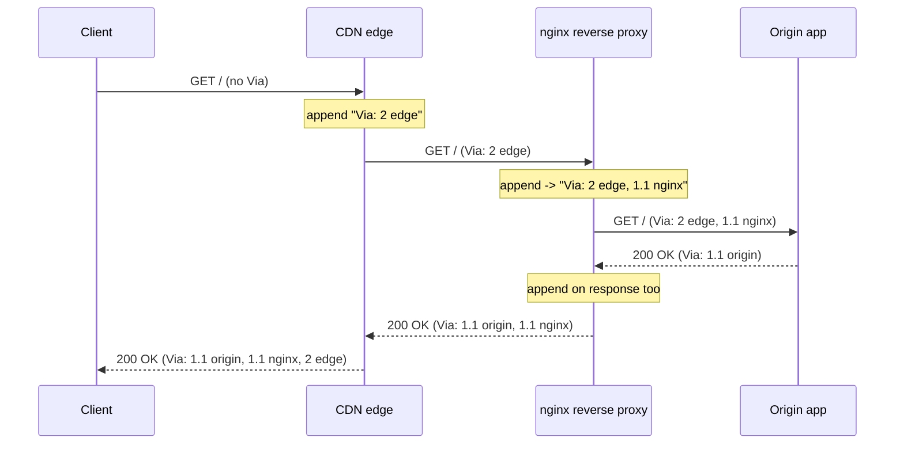
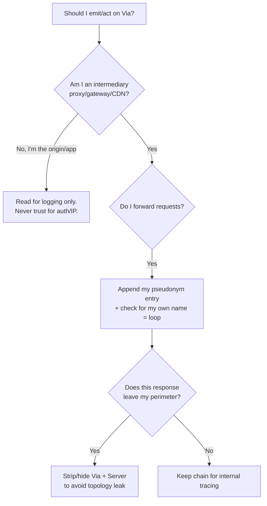

# Via

## Quick Summary

`Via` is the standard, RFC-defined header that records the chain of intermediaries a message passed through. Each proxy or gateway that forwards a request or response **appends** its own entry — protocol version plus an identifier (a hostname, or a deliberately vague pseudonym) — so the header grows into an ordered trail from the sender toward the recipient. Unlike the `X-Forwarded-*` family, `Via` appears on **both requests and responses**, is defined by the HTTP specification itself (RFC 9110, previously RFC 7230/2616), and its two jobs are **loop detection** (a proxy that sees its own name in `Via` knows the request is circling) and **operational visibility** (you can see how many hops a message took and what software handled it). It carries no client IP or scheme — for that you need [`Forwarded`](./Forwarded.md) / [`X-Forwarded-For`](./X-Forwarded-For.md) — so it is complementary to, not a replacement for, the forwarding headers.

## What problem does this header solve?

When a message crosses several intermediaries — a CDN edge, a load balancer, a caching proxy, a reverse proxy — the final recipient has no built-in way to know that any of them existed, let alone how many there were or in what order. That opacity causes two concrete production problems.

The first is **request loops**. Proxy topologies are configured independently by different teams; a routing mistake (proxy A forwards to B, B forwards back to A) creates an infinite forwarding loop that consumes connections and CPU until something falls over. Without a shared record of "who has already handled this message," no single proxy can detect that it is about to re-process a request it already saw.

The second is **diagnosability**. When a response is slow, malformed, or has a header rewritten unexpectedly, you need to know the path it travelled. `Via` gives you an audit trail baked into the message: "this went client → Cloudflare (HTTP/2) → Varnish 6 → nginx 1.25 → app," so you can reason about which hop terminated TLS, which cache served it, and which box mangled a header.

## Why was it introduced?

`Via` was part of HTTP/1.1 from the start — RFC 2068 (1997), then RFC 2616 (1999), re-specified in RFC 7230 (2014) and now RFC 9110 §7.6.3 (2022). It was designed alongside HTTP's explicit model of proxies and gateways, at a time when *forward* caching proxies (Squid, corporate gateways) were the dominant kind of intermediary and controlling **loops** and **cache behavior** across them was a first-class concern. That heritage is why `Via` is spec-blessed and symmetric across request/response, whereas the later `X-Forwarded-*` conventions grew organically out of reverse-proxy and load-balancer deployments and were never standardized until [`Forwarded`](./Forwarded.md) (RFC 7239, 2014). `Via` also historically interacts with `Max-Forwards` for the `TRACE`/`OPTIONS` methods, which count down hops using the same chain concept.

## How does it work?

The syntax of each `Via` entry is:

```
Via: [ <protocol-name> "/" ] <protocol-version> SP <received-by> [ SP <comment> ]
```

- **protocol** — the protocol the *receiving* proxy used on the inbound hop. The name is omitted when it is HTTP (so `1.1` means HTTP/1.1); a non-HTTP protocol is named explicitly (e.g. `HTTP/1.1`, or historically `HTTP/1.0`). For HTTP/2 you commonly see `2` or `2.0`.
- **received-by** — either the host (and optional port) of the proxy, or a **pseudonym**: a made-up token like `edge`, `varnish`, or `1.1 gateway` used deliberately to avoid revealing internal hostnames and topology.
- **comment** — an optional parenthesized note, conventionally the software and version, e.g. `(nginx/1.25.3)` or `(ApacheTrafficServer/9.2)`.

Each intermediary **appends** its entry to the end of the existing `Via` value (comma-separated), so the list reads left-to-right in the order the message was forwarded. This is the same accumulation model as [`X-Forwarded-For`](./X-Forwarded-For.md), and like all forwarding headers it is **end-to-end** — meant to survive every hop rather than be stripped ([End-to-End vs Hop-by-Hop Headers](../01-Introduction/End-to-End-vs-Hop-by-Hop-Headers.md)).

- **Browser behavior:** Browsers neither send nor read `Via`. It is purely an intermediary/server concern. A browser may *see* it on a response but does nothing with it.
- **Server behavior:** The origin can read `Via` to count hops and detect that a request came through unexpected intermediaries; it generally does not act on it beyond logging.
- **Proxy behavior:** This is the header's home. A conforming proxy MUST append its own entry when forwarding, MUST inspect existing entries for its own name to detect loops, and MAY combine consecutive entries with the same protocol. A proxy may also strip or pseudonymize entries for privacy.
- **CDN behavior:** CDNs typically add a `Via` entry (Cloudflare, Fastly, CloudFront all do, often with a pseudonym or their product name) and may add product-specific variants. They frequently rewrite or collapse the header to hide their internal fan-out.
- **Reverse proxy behavior:** Nginx does **not** add `Via` by default; you opt in via config. Squid, Apache Traffic Server, and Varnish add it more readily. Whether a reverse proxy exposes or hides its `Via` is a topology-disclosure decision (see Security Considerations).



## HTTP Request Example

A request that has traversed a CDN edge and an internal reverse proxy before reaching the origin:

```http
GET /api/orders HTTP/1.1
Host: shop.example.com
Via: 2 edge-fra-07, 1.1 nginx-internal (nginx/1.25.3)
X-Forwarded-For: 203.0.113.7, 198.51.100.4
Accept: application/json
```

The `Via` value is read left-to-right as forwarding order: the CDN edge (`edge-fra-07`, speaking HTTP/2) received it first, then handed it to the internal nginx. The origin now knows two intermediaries handled this request; if it saw `nginx-internal` twice, that would signal a loop.

## HTTP Response Example

`Via` is symmetric — intermediaries append on the way back too:

```http
HTTP/1.1 200 OK
Content-Type: application/json
Via: 1.1 origin-app, 1.1 nginx-internal (nginx/1.25.3), 2 edge-fra-07
Age: 12
Cache-Control: public, max-age=60
```

Here the origin added itself first, then nginx, then the edge — so on the response the list reads origin → nginx → edge, mirroring the return path. Combined with [`Age`](../06-Caching-Headers/Cache-Control.md) it tells you a shared cache in the chain served a 12-second-old copy.

## Express.js Example

Express does not manage `Via` for you (it is a proxy concern, and Express is the origin), but you frequently want to **read and log** it for observability, and you must understand it does *not* give you the client IP:

```js
const express = require('express');
const app = express();

// Trust the proxies in front of us so req.ip / req.protocol are correct.
// Via does NOT feed this — X-Forwarded-For does. See the trust-proxy discussion.
app.set('trust proxy', 2);

// Observability middleware: capture the proxy chain for every request.
app.use((req, res, next) => {
  const via = req.headers['via'];               // raw, comma-separated chain or undefined.
  const hops = via ? via.split(',').map(s => s.trim()) : [];
  req.proxyChain = hops;                         // stash for downstream logging.
  if (hops.length > 5) {
    // A surprisingly long chain often means a misroute or an accidental loop.
    console.warn('Unusually deep proxy chain', { path: req.path, hops });
  }
  // Loop smell: our own edge pseudonym appearing twice.
  const selfCount = hops.filter(h => h.includes('nginx-internal')).length;
  if (selfCount > 1) console.error('Possible proxy loop detected', { path: req.path, via });
  next();
});

app.get('/api/orders', (req, res) => {
  res.json({ hopsSeen: req.proxyChain, client: req.ip });
  // req.ip is the REAL client IP from X-Forwarded-For + trust proxy — NOT from Via.
});

// If you deliberately run Express as a forwarding gateway (rare), append your own entry:
app.use('/proxy', (req, res, next) => {
  const prior = req.headers['via'];
  req.headers['via'] = (prior ? prior + ', ' : '') + '1.1 express-gateway';
  next();
});

app.listen(3000);
```

Every line here is about *reading* `Via`, because at the origin that is all you do with it. The critical teaching point is the comment on `req.ip`: engineers routinely conflate `Via` with client-IP recovery. `Via` tells you *how many and which* intermediaries; it never tells you *who the client was*.

## Node.js Example

With the raw `http` module you see the header exactly as it arrived, and if you build a genuine proxy you are responsible for appending your entry and checking for loops:

```js
const http = require('http');

const server = http.createServer((req, res) => {
  const via = req.headers['via'] || '';
  const SELF = '1.1 node-proxy-a';

  // Loop guard: if our identity is already present, we've seen this message before.
  if (via.split(',').map(s => s.trim()).includes(SELF)) {
    res.statusCode = 508; // Loop Detected (WebDAV, but the right semantic signal).
    return res.end('Proxy loop detected via Via header');
  }

  // Append ourselves before forwarding upstream (forwarding logic omitted).
  const outgoingVia = via ? `${via}, ${SELF}` : SELF;
  req.headers['via'] = outgoingVia;

  res.setHeader('Via', outgoingVia); // also annotate the response.
  res.end(`chain now: ${outgoingVia}`);
});

server.listen(3000);
```

The `508 Loop Detected` response is the crux: without appending `SELF` and checking for it, a routing mistake becomes an unbounded loop. This is precisely the class of bug `Via` was designed to make detectable.

## React Example

React never touches `Via`. It is a browser-side library and browsers do not read or set this header; it lives entirely in the intermediary/server tier. The only indirect relevance is operational: when you are debugging a React app's slow or wrong API responses, inspecting the `Via` header on the response in DevTools tells you which caches/proxies handled the call — useful context, but nothing React code interacts with.

## Browser Lifecycle

There is effectively no browser lifecycle for `Via`. The browser does not generate it on requests, does not parse it on responses, does not expose it to `fetch`/XHR beyond the raw header string (and even that is subject to CORS-safelisting on cross-origin responses), and takes no action based on it. Its entire lifecycle happens between the first intermediary and the origin.

## Production Use Cases

- **Loop detection across independently-managed proxies.** In a mesh of services where teams own different hops, `Via`-based loop detection is the safety net that turns an infinite loop into a `508`.
- **Path forensics.** During an incident ("why did clients get a stale/garbled response?"), the `Via` trail on captured responses tells you which cache tier and which proxy version was in the path.
- **Detecting unexpected intermediaries.** An origin seeing a `Via` it doesn't recognize (e.g. a corporate forward proxy, or an interception proxy) learns that a middlebox is in play — relevant for TLS and compatibility debugging.
- **Cache-layer accounting.** Combined with [`Age`](../06-Caching-Headers/Cache-Control.md) and vendor cache-status headers, `Via` helps attribute a cache hit to a specific tier.
- **Compliance/audit.** Some environments require recording the handling chain for requests to sensitive endpoints; `Via` is the standard vehicle.

## Common Mistakes

- **Treating `Via` as a client-IP source.** It carries proxy identities, not the client address. For IP recovery use [`X-Forwarded-For`](./X-Forwarded-For.md) / [`Forwarded`](./Forwarded.md).
- **Assuming it is always present.** Nginx and many reverse proxies do **not** add `Via` by default; absence of `Via` does not mean absence of proxies.
- **Trusting entries for security decisions.** `Via` is client-forgeable like every request header. A hostile client can pre-populate a fake chain; only entries appended by proxies you control are meaningful, and even then `Via` should never gate authorization.
- **Leaking internal hostnames.** Emitting real internal hostnames in `Via` on responses that reach the public exposes your topology. Use pseudonyms.
- **Parsing naively.** The comment field can contain commas inside parentheses in principle; split on top-level commas, not blindly on every comma.
- **Confusing forward order.** On requests the list is sender→recipient; on responses it accumulates along the return path. Don't assume a single canonical direction.

## Security Considerations

- **Topology disclosure.** The single biggest `Via` risk is *information leakage*. Real hostnames, software names, and versions in `Via` (and its cousin `Server`) hand an attacker a map of your internal infrastructure and a list of versioned software to look up CVEs against. Mitigate by replacing hostnames with pseudonyms and stripping software comments on responses that leave your perimeter — many hardened configs simply remove `Via` at the edge on the way out.
- **Forgeability.** Because it is a request header, a client can send an arbitrary `Via`. Never make a trust, routing, or auth decision based on client-supplied `Via` entries. Only proxy-appended entries from nodes inside your trust boundary carry any weight, and even those are for diagnostics, not authorization.
- **Loop-based DoS.** Misconfigured loops (which `Via` is meant to catch) can be weaponized or triggered accidentally to exhaust connections. Ensure every forwarding node actually implements the self-detection check.
- **Not a smuggling defense.** `Via` accounting does not protect against request smuggling; that is governed by consistent `Content-Length`/`Transfer-Encoding` handling between hops ([End-to-End vs Hop-by-Hop Headers](../01-Introduction/End-to-End-vs-Hop-by-Hop-Headers.md)).

## Performance Considerations

`Via` is tiny and its cost is negligible per message, but two effects are worth noting. First, on a deep chain the header grows by one entry per hop; combined with other accumulating headers it marginally increases header size, which matters more under HTTP/1.1 (no header compression) than HTTP/2/3 (HPACK/QPACK compress repeated header names/values). Second, `Via` is a *diagnostic accelerant*: correct chains let you localize a latency problem to a specific hop instead of bisecting blindly, which is a real MTTR win during incidents. It has no effect on caching decisions itself (that is [`Cache-Control`](../06-Caching-Headers/Cache-Control.md)/[`Vary`](../06-Caching-Headers/Cache-Control.md)).

## Reverse Proxy Considerations

Nginx omits `Via` unless you add it. To emit a pseudonymized entry and to strip a client-supplied one:

```nginx
server {
  location / {
    # Do not let a client-supplied Via poison our chain — reset it to our view.
    # (Nginx has no built-in Via append, so we manage it explicitly.)
    proxy_set_header Via "1.1 edge-internal";   # single, pseudonymous entry going upstream.
    proxy_pass http://app_upstream;

    # On the way back, hide origin/proxy identity from the public:
    proxy_hide_header Via;                        # remove any Via the upstream added.
  }
}
```

Notes: `proxy_set_header Via "..."` *replaces* the inbound `Via` rather than appending — if you want to preserve the chain you must build it with a `map`/variable that concatenates `$http_via`. `proxy_hide_header Via` on responses is the standard way to prevent topology leakage to clients. Squid, by contrast, appends `Via` automatically and offers `via on|off` plus `httpd_suppress_version_string` to control disclosure. Apache Traffic Server uses `proxy.config.http.insert_response_via_str` / `insert_request_via_str` with levels controlling how verbose the entry is.

## CDN Considerations

- **Cloudflare** adds its own handling markers and may emit a `Via` entry; it also strips/normalizes many internal headers so you rarely see Cloudflare's true internal hop count. Use `cf-ray` and `cf-cache-status` for Cloudflare-specific tracing rather than relying on `Via`.
- **Fastly (Varnish-based)** commonly emits `Via: 1.1 varnish` and detailed `X-Served-By`/`X-Cache` headers that are more useful than `Via` for hit/miss attribution.
- **AWS CloudFront** adds `Via: 1.1 <hash>.cloudfront.net (CloudFront)` plus `X-Amz-Cf-Id` and `X-Cache: Hit/Miss from cloudfront`.
- **Universal gotcha:** CDNs deliberately obscure their internal fan-out, so `Via` from a CDN reflects the product boundary, not the true number of edge nodes. Treat CDN `Via` entries as "a CDN handled this," and lean on the vendor's dedicated trace headers for detail.

## Cloud Deployment Considerations

- **L7 load balancers (AWS ALB, GCP HTTPS LB)** generally do **not** add `Via`; they add `X-Forwarded-*` instead. Do not expect `Via` to reveal the LB hop.
- **L4 load balancers (AWS NLB)** don't parse HTTP at all and cannot touch `Via` — they may carry the client IP via the PROXY protocol instead (see [`X-Real-IP`](./X-Real-IP.md)).
- **API gateways (AWS API Gateway, Kong, Apigee)** vary: some inject a `Via`, some don't, most add their own request-ID header that is more reliable for tracing.
- **Service meshes (Istio/Envoy)** can add `Via` and rich tracing headers (`x-request-id`, B3/W3C `traceparent`). In a mesh, distributed-tracing headers supersede `Via` for correlating a request across hops, though `Via` still helps for loop detection.

## Debugging

- **Chrome DevTools → Network → Headers:** look under Response Headers for `Via` (and Request Headers if an extension/proxy added one). It tells you which caches/proxies were involved.
- **curl:** `curl -sD - -o /dev/null https://shop.example.com/` dumps response headers including `Via`. Send a fake one to test loop handling: `curl -H 'Via: 1.1 node-proxy-a' https://…`.
- **Postman / Bruno:** both display the full response header set; add a test assertion like `pm.expect(pm.response.headers.get('Via')).to.include('edge')` (Postman) or `expect(res.headers.via).to.contain('edge')` (Bruno) to lock in expected chains.
- **Node.js:** inspect `req.headers['via']` on the server and `res.headers['via']` on a client-side `http.get` response.
- **Express logging:** `app.use((req,res,next)=>{res.on('finish',()=>console.log(req.method,req.path,'via=',req.headers['via']));next();})` records the inbound chain per request.
- **Cross-check with vendor headers:** pair `Via` with `cf-ray` (Cloudflare), `X-Amz-Cf-Id`/`X-Cache` (CloudFront), `X-Served-By` (Fastly) for the full picture.

## Best Practices

- [ ] Use **pseudonyms**, not real internal hostnames, in `Via` entries you emit.
- [ ] **Strip or hide** `Via` (and `Server` version comments) on responses that cross your public perimeter to avoid topology disclosure.
- [ ] Implement **loop detection**: any forwarding node must check for its own identity in `Via` and fail fast (e.g. `508`).
- [ ] **Never** use client-supplied `Via` for authorization, routing trust, or IP attribution.
- [ ] Reset/overwrite inbound `Via` at your trust boundary rather than blindly forwarding a client-provided chain.
- [ ] Log `Via` for observability, but rely on distributed-tracing headers (`traceparent`, `x-request-id`) for correlation in modern stacks.
- [ ] Remember `Via` is symmetric — verify behavior on **both** requests and responses.
- [ ] Don't assume `Via` presence/absence indicates the true number of proxies (many don't add it).

## Related Headers

- [Forwarded](./Forwarded.md) — the RFC 7239 standard; its `by=` parameter overlaps with `Via`'s "which proxy" role, while `for=`/`proto=`/`host=` carry the client facts `Via` omits.
- [X-Forwarded-For](./X-Forwarded-For.md) — the accumulating client-IP trail; the *thing people wrongly expect `Via` to contain*.
- [X-Forwarded-Proto](./X-Forwarded-Proto.md) / [X-Forwarded-Host](./X-Forwarded-Host.md) — original scheme/host; orthogonal to `Via`.
- [X-Real-IP](./X-Real-IP.md) — single client IP convention (Nginx); again, IP not chain.
- `Server` — like `Via` but names only the origin software; same disclosure caution.
- [End-to-End vs Hop-by-Hop Headers](../01-Introduction/End-to-End-vs-Hop-by-Hop-Headers.md) — explains why `Via` is end-to-end and accumulates while `Connection`/`Upgrade` are stripped per hop.
- [Proxies Overview](./Proxies-Overview.md) — the chapter framing for the whole intermediary/trust model.

## Decision Tree



## Mental Model

Think of `Via` as the **stamps in a parcel's passport** as it crosses borders. Every customs post (proxy) it passes through inks its stamp — the country's protocol and either its real name or a discreet code — in order, so anyone reading the passport can retrace the exact route. Two rules follow naturally: a post that finds *its own stamp already in the passport* knows the parcel is going in circles and stops it (loop detection), and a security-conscious post uses a code rather than its real name so a thief reading the passport can't map out the whole customs network (topology hiding). Crucially, the passport says nothing about *who mailed the parcel* — for the sender's return address you need a different document ([`X-Forwarded-For`](./X-Forwarded-For.md) / [`Forwarded`](./Forwarded.md)). And because the traveler could forge stamps before departure, only stamps added by posts you actually operate mean anything.
