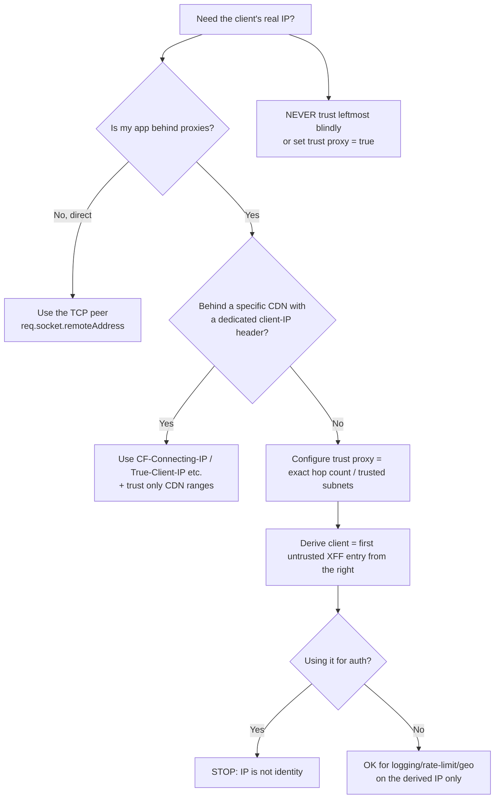

# X-Forwarded-For

## Quick Summary

`X-Forwarded-For` (XFF) is a **de-facto-standard request** header that records the **originating client's IP address** — and the chain of proxy IPs it passed through — as a request travels from browser to origin. When a client connects *directly* to your server, the client's IP is simply the TCP peer address. But the moment a proxy, load balancer, or CDN sits in front of your app, the TCP peer address your app sees is the *proxy's* IP, not the user's — the real client IP is lost. `X-Forwarded-For` is the convention that carries it forward: each proxy **appends** the IP it received the connection from, building a comma-separated list read left-to-right as `client, proxy1, proxy2, ...`. It is the single most important header for logging, geolocation, rate limiting, abuse detection, and audit in any multi-tier deployment — and simultaneously one of the most **dangerous to trust**, because it is a plain request header that any client can forge. Getting XFF handling right (which entries to trust, how many proxies to skip) is a security-critical configuration task, not a convenience. The RFC-standardized replacement is [`Forwarded`](./Forwarded.md), but XFF remains overwhelmingly the most widely deployed.

## What problem does this header solve?

Nearly every production web application runs behind at least one intermediary: a cloud load balancer, an Nginx reverse proxy, a CDN, or all three. TCP only preserves the *immediately connected* peer's address, so by the time a request reaches your Node/Express app, `req.socket.remoteAddress` is the IP of the **last proxy**, not the user. That breaks everything that depends on knowing *who* is making the request by network address:

- **Logging & audit:** access logs full of your load balancer's IP are useless for tracing activity to a user or investigating an incident.
- **Rate limiting & abuse control:** limiting by the proxy IP throttles *all* users at once (they all appear to come from one address).
- **Geolocation & personalization:** country/region detection needs the client IP, not the edge node's.
- **Security decisions:** IP allowlists/denylists, fraud scoring, and geo-blocking need the true origin address.

`X-Forwarded-For` solves this by preserving the client's IP (and the proxy chain) through the hops, so the origin can recover the real address. It's the plumbing that makes "who is this request from?" answerable behind proxies.

## Why was it introduced?

`X-Forwarded-For` originated as an informal convention introduced by the **Squid** caching proxy in the late 1990s and was rapidly adopted across proxies, load balancers, and CDNs — long before any standard existed. Like all `X-` prefixed headers, it was never formally standardized in its original form; it grew organically because the need (recovering client IPs behind proxies) was universal and pressing. The `X-` convention itself was later deprecated (RFC 6648) for *new* headers, and the IETF eventually standardized the concept as [`Forwarded`](./Forwarded.md) (**RFC 7239, 2014**), which combines client IP, protocol, and host into one structured header. But because XFF was already entrenched in virtually every proxy, CDN, and framework on earth, it never went away — today it's the *most* widely deployed forwarding header, and `Forwarded` is the cleaner-but-less-ubiquitous successor. Understanding XFF is non-negotiable for operating real systems.

## How does it work?

Each proxy that forwards a request **appends** the IP address of the host it received the connection from to the `X-Forwarded-For` value (comma-separated). The list therefore reads, left-to-right, from the original client through each intermediary:

```
X-Forwarded-For: <client>, <proxy1>, <proxy2>, ...
```

```mermaid
sequenceDiagram
    participant C as Client (203.0.113.7)
    participant CDN as CDN (198.51.100.4)
    participant LB as Load balancer (10.0.0.9)
    participant App as Origin app
    C->>CDN: GET / (no XFF; TCP peer = 203.0.113.7)
    Note over CDN: append client IP
    CDN->>LB: GET / (X-Forwarded-For: 203.0.113.7)
    Note over LB: append CDN IP
    LB->>App: GET / (X-Forwarded-For: 203.0.113.7, 198.51.100.4)
    Note over App: TCP peer = 10.0.0.9 (the LB)<br/>Real client = leftmost TRUSTED entry
```

The origin recovers the client IP by walking the list **from the right**, skipping IPs it trusts (its own proxies), and taking the first *untrusted* entry — that's the real client. This "trust N proxies" logic is the crux and the danger:

- **Browser behavior:** Browsers do **not** send `X-Forwarded-For`. It's purely an intermediary/server header.
- **Server behavior:** The origin reads XFF to recover the client IP, but **must only trust entries added by proxies it controls**. Everything to the left of your trusted chain is client-supplied and forgeable.
- **Proxy behavior:** A proxy appends the connecting peer's IP. A *security-correct* edge proxy also **strips/overwrites** any client-supplied XFF at the trust boundary so an attacker can't pre-seed fake entries.
- **CDN behavior:** CDNs append the client IP (and often expose it in a dedicated header too, e.g. Cloudflare's `CF-Connecting-IP`, which many prefer over parsing XFF).
- **Reverse proxy behavior:** Nginx sets/extends XFF via `proxy_set_header X-Forwarded-For $proxy_add_x_forwarded_for` and can use the `realip` module to derive `$remote_addr` from trusted XFF entries.

## HTTP Request Example

A request that traversed a CDN and a load balancer before your origin:

```http
GET /api/orders HTTP/1.1
Host: api.example.com
X-Forwarded-For: 203.0.113.7, 198.51.100.4
X-Forwarded-Proto: https
X-Forwarded-Host: api.example.com
```

Here `203.0.113.7` is the real client (leftmost), `198.51.100.4` is the CDN edge; the load balancer that connected to your app is the current TCP peer and (depending on config) may or may not be appended.

A **forged** request an attacker sends directly to your origin, trying to spoof a trusted IP:

```http
GET /admin HTTP/1.1
Host: api.example.com
X-Forwarded-For: 127.0.0.1
```

If your app naively trusts the leftmost entry, it now thinks the request came from localhost — a classic IP-allowlist bypass.

## HTTP Response Example

`X-Forwarded-For` is a **request-only** header — it does not appear on responses. There is no response-side `X-Forwarded-For`; the origin *consumes* it and typically logs the derived client IP rather than echoing it. (If you need to see how far a message travelled on the response side, that's [`Via`](./Via.md), which is symmetric.)

## Express.js Example

Express doesn't trust proxies by default — you must configure `trust proxy` correctly, and *precisely*, or you either get the proxy's IP (useless) or trust forged entries (dangerous):

```js
const express = require('express');
const app = express();

// 1) Tell Express how many trusted proxies sit in front of it. This is the single
//    most important line. Options:
//    - a NUMBER: trust that many hops from the right (skip N proxy IPs).
//    - specific IPs/CIDRs/subnets: trust only these proxy addresses.
//    - 'loopback'/'linklocal'/'uniquelocal': trust private ranges.
//    NEVER use `true` in production — it trusts ALL XFF entries = forgeable.
app.set('trust proxy', 2);   // e.g. CDN + load balancer = 2 trusted hops.
// app.set('trust proxy', '10.0.0.0/8'); // or trust a specific proxy subnet.

app.use((req, res, next) => {
  // 2) With trust proxy set, req.ip is the correctly-derived CLIENT IP:
  //    Express walks XFF from the right, skips trusted hops, returns the client.
  console.log('client ip:', req.ip);              // real client, e.g. 203.0.113.7
  console.log('full chain:', req.ips);            // ['203.0.113.7', '198.51.100.4'] (trusted, left→right)
  console.log('protocol:', req.protocol);         // 'https' derived from X-Forwarded-Proto (also gated by trust proxy)
  next();
});

// 3) Rate limiting MUST key on the derived client IP, not the raw socket.
const rateLimit = require('express-rate-limit');
app.use(rateLimit({
  windowMs: 60_000,
  max: 100,
  // express-rate-limit uses req.ip, which is correct ONLY if trust proxy is right.
  // A wrong trust proxy here = either everyone shares one bucket, or attackers
  // rotate forged XFF to evade limits.
}));

app.get('/api/orders', (req, res) => res.json({ from: req.ip }));

app.listen(3000);
```

Why each piece matters: `app.set('trust proxy', 2)` is what makes `req.ip`, `req.ips`, and `req.protocol` correct — it tells Express exactly how many rightmost XFF entries are *your* proxies (trusted) versus client-supplied (forgeable). Setting it to `true` (trust everything) is a **security bug**: an attacker sends `X-Forwarded-For: <any IP>` and Express reports it as `req.ip`, defeating rate limits and IP allowlists. Setting it too low means `req.ip` returns your proxy's IP (useless logs, one shared rate-limit bucket). The number must **exactly match your real topology** — count the trusted hops between the internet and your app. Rate limiting (step 3) is where a wrong value hurts most: too permissive and attackers rotate fake XFF to get unlimited buckets; too restrictive and all users share one bucket and get throttled together.

## Node.js Example

Raw `http` gives you the socket peer and the raw header — you implement trust yourself:

```js
const http = require('http');
const net = require('net');

// The set of proxy IPs/subnets you actually control (your trust boundary).
const TRUSTED_PROXIES = ['10.0.0.9', '198.51.100.4'];

function clientIpFrom(req) {
  const peer = req.socket.remoteAddress;             // the immediate TCP peer (a proxy)
  const xff = (req.headers['x-forwarded-for'] || '')
    .split(',').map(s => s.trim()).filter(Boolean);  // ['203.0.113.7', '198.51.100.4']

  // Walk from the RIGHT, dropping entries that are our trusted proxies.
  // The first entry that is NOT a trusted proxy is the real client.
  let ip = peer;
  for (let i = xff.length - 1; i >= 0; i--) {
    if (TRUSTED_PROXIES.includes(xff[i])) { ip = xff[i - 1] || xff[i]; continue; }
    ip = xff[i];
    break;
  }
  return net.isIP(ip) ? ip : peer;                   // validate; fall back to peer.
}

http.createServer((req, res) => {
  const clientIp = clientIpFrom(req);
  console.log('client:', clientIp, 'peer:', req.socket.remoteAddress);
  res.end(JSON.stringify({ clientIp }));
}).listen(3000);
```

The lesson: **never** just take `xff.split(',')[0]` (the leftmost) — that's the fully attacker-controlled value. Trust flows from the *right* (your infrastructure) leftward until you exit your controlled proxies. Frameworks (Express `trust proxy`) encapsulate exactly this.

## React Example

React never sends or reads `X-Forwarded-For` — it's a server/proxy header the browser doesn't touch. The relationship is entirely indirect:

1. **Your React app's users get correctly identified (or not) based on server XFF handling.** Geolocation-based UI (currency, language, "you're in the EU" banners), IP-based feature flags, and abuse challenges (CAPTCHA on suspicious IPs) all depend on the server correctly deriving the client IP from XFF. If `trust proxy` is misconfigured, every user might appear to come from the load balancer's IP/region.

2. **Rate-limit errors surface in React.** If XFF handling collapses all users into one rate-limit bucket, your React app starts getting `429 Too Many Requests` for innocent users — a symptom whose root cause is server XFF/trust-proxy config.

3. **You don't set it in fetch/axios** — and *shouldn't*; browsers ignore attempts to set forbidden/hop-related headers, and forging XFF from client code is meaningless (a correct server strips client-supplied XFF at the edge anyway).

## Browser Lifecycle

There is **no browser lifecycle** for `X-Forwarded-For`. The browser never generates it, never reads it, and never exposes it to page JavaScript. Its entire life is between the first proxy and the origin: the first intermediary that receives the browser's connection *starts* the header with the browser's IP, and each subsequent proxy appends. The browser is merely the (unknowing) source of the client IP that the first proxy records.

## Production Use Cases

- **Access logging & audit:** logging the real client IP for every request (compliance, forensics, debugging).
- **Rate limiting & abuse control:** per-client throttling, keyed on the derived client IP.
- **Geolocation:** country/region/city lookup for personalization, compliance (GDPR/geo-restrictions), and fraud scoring.
- **IP allow/deny lists:** restricting admin endpoints or blocking abusive addresses (only safe with correct trust config).
- **Security analytics:** feeding client IPs into WAF/SIEM/fraud systems.
- **Sticky sessions / debugging:** correlating a user's requests across a session by IP.

## Common Mistakes

- **Trusting the leftmost entry blindly.** The leftmost value is fully client-controlled; taking `xff[0]` as "the client" is an IP-spoofing vulnerability (allowlist bypass, rate-limit evasion, log poisoning).
- **`trust proxy: true` (trust all).** Tells the framework to believe every XFF entry — instantly forgeable. Set an exact hop count or trusted subnets.
- **Wrong hop count.** Too low → `req.ip` is your proxy (useless logs, shared rate-limit bucket). Too high → you trust a client-supplied entry.
- **Not stripping client XFF at the edge.** If your outermost proxy *appends* to a client-supplied XFF instead of *replacing* it, attackers pre-seed fake entries. The trust boundary must overwrite.
- **Assuming XFF is always present.** Direct connections (or proxies that don't add it) mean no XFF — fall back to the socket peer.
- **Parsing IPv6 / ports naively.** Entries may be IPv6 (with brackets) or include ports in some setups; validate with a real IP parser.
- **Using XFF for authentication.** IP is not identity; never authenticate based on XFF alone.
- **Preferring XFF over a CDN's dedicated header.** Behind Cloudflare, `CF-Connecting-IP` is more reliable than parsing a possibly-multi-entry XFF.

## Security Considerations

- **XFF is client-forgeable by default — this is the central risk.** Any client can send `X-Forwarded-For: <anything>`. Only entries appended by proxies **inside your trust boundary** are meaningful. Your outermost trusted proxy must **overwrite** (not append to) any inbound XFF so attacker-supplied entries can't survive.
- **IP allowlist bypass.** Naive "allow if XFF contains 10.x / 127.0.0.1" checks are trivially bypassed by sending that value. Derive the client IP correctly (trust-aware) *before* any IP-based authorization, and prefer network-level controls for truly sensitive allowlists.
- **Rate-limit / WAF evasion.** Attackers rotate forged XFF values to get fresh rate-limit buckets or dodge IP bans if you key on an untrusted entry. Key only on the trust-derived client IP.
- **Log injection / poisoning.** XFF values flow into logs; unsanitized, they can inject newlines/control characters or forged IPs into log analysis. Validate as IPs and escape when logging.
- **Privacy/PII.** Client IPs are personal data under GDPR and similar regimes — handle, store, and retain XFF-derived IPs per your privacy obligations.
- **Prefer [`Forwarded`](./Forwarded.md) or CDN-specific headers** where available for cleaner trust semantics, but the same "trust only your own hops" rule applies.

## Performance Considerations

- **Negligible wire cost** — a short header, compressed under HTTP/2/3.
- **The cost is correctness, not speed:** the real performance impact is *indirect* — wrong trust config breaks rate limiting (either DoS-enabling or over-throttling) and pollutes analytics.
- **Deep chains grow the header** by one IP per hop; combined with other accumulating headers this marginally increases request size on long paths.
- **Trust evaluation is cheap** (a small list walk); do it once per request and cache the derived IP on the request object.

## Reverse Proxy Considerations

Nginx is the canonical place to set and *sanitize* XFF:

```nginx
http {
  # realip: derive $remote_addr from XFF, but ONLY trust these proxy sources.
  # This is how you make $remote_addr the real client IP safely.
  set_real_ip_from 10.0.0.0/8;        # your internal LB subnet (trusted)
  set_real_ip_from 198.51.100.0/24;   # your CDN egress range (trusted)
  real_ip_header X-Forwarded-For;
  real_ip_recursive on;               # walk the chain, skipping trusted proxies.

  server {
    location / {
      # Append the connecting peer to XFF when forwarding upstream.
      proxy_set_header X-Forwarded-For $proxy_add_x_forwarded_for;
      proxy_set_header X-Real-IP $remote_addr;      # single client IP (see X-Real-IP page).
      proxy_set_header X-Forwarded-Proto $scheme;
      proxy_pass http://app_upstream;
    }
  }
}
```

Key points: `set_real_ip_from` defines your **trust boundary** — only XFF entries from these sources are believed; anything else is treated as client-supplied. `real_ip_recursive on` walks the chain correctly. At the **outermost** edge (facing the internet), you should *reset* XFF to the real peer rather than trust an inbound one — many edge configs do `proxy_set_header X-Forwarded-For $remote_addr` at the boundary to discard forged prefixes. `$proxy_add_x_forwarded_for` appends (correct for *internal* hops that already sit behind a sanitizing edge).

## CDN Considerations

- **CDNs append the client IP to XFF and usually expose a dedicated, harder-to-forge header:** Cloudflare `CF-Connecting-IP` (+ `True-Client-IP` on some plans), Akamai `True-Client-IP`, Fastly `Fastly-Client-IP`, AWS CloudFront `CloudFront-Viewer-Address`. **Prefer these over parsing XFF** when behind that CDN — they reflect the CDN's authoritative view of the client.
- **Trust only your CDN's egress ranges.** Configure your origin/reverse proxy to accept forwarding headers *only* from the CDN's published IP ranges; otherwise an attacker who finds your origin IP can bypass the CDN and forge XFF directly.
- **Lock down origin access.** Combine XFF trust with firewalling the origin so only the CDN can reach it (authenticated origin pulls, IP allowlists, mTLS) — otherwise XFF trust is meaningless.
- **Multiple entries are normal** behind CDN + LB; derive the client with correct hop counting.

## Cloud Deployment Considerations

- **AWS ALB/ELB:** append the client IP to `X-Forwarded-For` and provide `X-Forwarded-Proto`/`X-Forwarded-Port`; ALB can also use the PROXY protocol. Set your app's trust to the ALB. NLB (L4) doesn't add XFF — use the PROXY protocol or [`X-Real-IP`](./X-Real-IP.md)-style mechanisms.
- **GCP HTTPS LB:** sets `X-Forwarded-For` as `<client>, <LB>`; the *second-to-last* entry is typically the real client from Google's LB (read its docs — the exact position matters).
- **Azure Application Gateway / Front Door:** add XFF and service-specific headers (`X-Azure-ClientIP`, etc.).
- **API Gateways / service meshes:** propagate XFF; meshes (Envoy/Istio) have explicit `num_trusted_hops` config — set it to your topology.
- **Managed platforms (Vercel/Netlify/Cloudflare):** expose the client IP via platform helpers/headers (`x-vercel-forwarded-for`, `request.ip`); prefer the documented platform API over hand-parsing XFF.
- **Universal rule:** whatever the platform, configure trust to your *exact* hop count/proxy set and don't accept forwarding headers from untrusted sources.

## Debugging

- **Chrome DevTools:** you won't see XFF on the request from your browser (the browser doesn't send it); you can inspect it server-side or via an echo endpoint.
- **curl (spoof test):** `curl -H 'X-Forwarded-For: 1.2.3.4' https://your-origin/echo` — if your app reports `1.2.3.4` as the client when hitting it *directly*, your trust config is too permissive.
- **Echo endpoint:** add a temporary route returning `req.ip`, `req.ips`, `req.headers['x-forwarded-for']`, and `req.socket.remoteAddress` to see exactly what each layer contributes.
- **curl through the real path:** hit your public URL (through CDN/LB) and confirm the derived `req.ip` matches your actual public IP.
- **Nginx:** log `$remote_addr` (post-realip), `$http_x_forwarded_for` (raw), and `$proxy_add_x_forwarded_for` to see the transformation.
- **Express:** temporarily log `app.get('trust proxy fn')`-derived values; verify `req.ip` equals your real IP when tested from a known address.

## Best Practices

- [ ] Configure `trust proxy` (or equivalent) to your **exact** proxy topology — a precise hop count or trusted subnets, **never** `true`.
- [ ] Derive the client IP by walking XFF **from the right**, skipping only trusted proxies; take the first untrusted entry.
- [ ] At the internet-facing edge, **overwrite** (don't append to) client-supplied XFF so forged prefixes can't survive.
- [ ] Only accept forwarding headers from your **known proxy/CDN IP ranges**; firewall the origin so the CDN can't be bypassed.
- [ ] Prefer a CDN's dedicated client-IP header (`CF-Connecting-IP`, etc.) when behind that CDN.
- [ ] Key rate limiting, geo, and IP allowlists on the **trust-derived** client IP only.
- [ ] Validate entries as real IPs; **never** authenticate on XFF.
- [ ] Treat client IPs as **PII** (GDPR): handle, log, and retain accordingly.
- [ ] Consider migrating to [`Forwarded`](./Forwarded.md) for cleaner semantics where your stack supports it.

## Related Headers

- [Forwarded](./Forwarded.md) — the RFC 7239 standardized replacement combining client IP, proto, and host in one structured header.
- [X-Forwarded-Proto](./X-Forwarded-Proto.md) — original request scheme (http/https); pairs with XFF for correct redirects/HSTS.
- [X-Forwarded-Host](./X-Forwarded-Host.md) — original `Host` before proxy rewriting.
- [X-Real-IP](./X-Real-IP.md) — a simpler single-client-IP convention (Nginx), no chain.
- [Via](./Via.md) — the standard proxy-chain header (identities, symmetric on req/resp) — the *thing people confuse XFF with*; XFF is IPs, `Via` is proxy identities.
- [Host](../03-Request-Headers/Host.md) — what `X-Forwarded-Host` preserves.
- [Proxies Overview](./Proxies-Overview.md) — the trust-model framing for all forwarding headers.
- [End-to-End vs Hop-by-Hop Headers](../01-Introduction/End-to-End-vs-Hop-by-Hop-Headers.md) — why forwarding headers accumulate.

## Decision Tree



## Mental Model

Think of `X-Forwarded-For` as the **"return address" written on an envelope that passes through a chain of mailrooms**, where each mailroom that handles it *adds a note*: "received from ___." The trouble is that the *original sender* wrote the first line themselves — so they could write *any* return address they like (forgery). What you *can* trust are the notes added by **your own mailrooms** (the proxies you operate), because you know they're honest and they stamp the address they *actually* received the envelope from. So to find the true sender, you start from *your* building and read the notes outward, skipping each of your own mailrooms, until you reach the first note *your* infrastructure didn't write — that's the real originator. If you lazily trust the topmost line (what the sender wrote), anyone can claim to be the CEO, the police, or "localhost." And crucially: the moment an envelope enters your building from the outside world, your front-desk mailroom should **cross out whatever the sender scribbled** and write the address it truly came from — otherwise forged return addresses ride along untouched.
