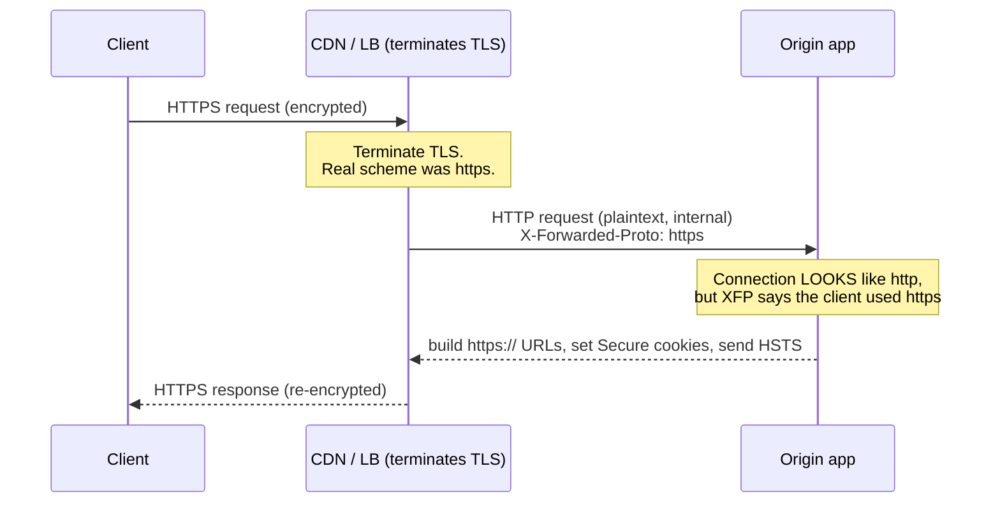

# X-Forwarded-Proto

## Quick Summary

`X-Forwarded-Proto` (XFP) is a **de-facto-standard request** header that records the **protocol scheme the original client used** — `http` or `https` — to reach the outermost proxy. It exists because TLS is almost always **terminated at the edge**: a CDN or load balancer accepts the client's HTTPS connection, decrypts it, and forwards the request to your app over *plain HTTP* on the internal network. From your Node/Express app's point of view, the connection is `http://` — it has no idea the user actually connected securely over `https://`. `X-Forwarded-Proto: https` carries that lost fact forward, so the origin can behave correctly: build absolute URLs with the right scheme, decide whether to redirect to HTTPS, set `Secure` cookies, emit HSTS, and avoid mixed-content and infinite-redirect bugs. It is the scheme-carrying sibling of [`X-Forwarded-For`](./X-Forwarded-For.md) (client IP) and [`X-Forwarded-Host`](./X-Forwarded-Host.md) (original host), and like all of them it is **client-forgeable** and must only be trusted from proxies you control. The RFC-standard equivalent is the `proto=` parameter of [`Forwarded`](./Forwarded.md).

## What problem does this header solve?

TLS termination at the edge is the default topology of the modern web: the CDN/load balancer holds the certificate, terminates HTTPS, and speaks plain HTTP to your origin over a trusted internal network (for performance and simpler cert management). This creates an information gap — **the origin can't tell a secure request from an insecure one** by looking at its own connection, because that connection is *always* HTTP. Without the real scheme, several things break:

- **HTTPS redirects loop forever.** Your app sees `http`, redirects to `https`, the edge terminates TLS and forwards `http` again, your app redirects again... an infinite loop.
- **Absolute URLs get the wrong scheme.** Redirect `Location` headers, canonical links, OAuth callback URLs, sitemaps, and emailed links come out as `http://` even though the user is on `https://` — causing mixed-content warnings or broken flows.
- **`Secure` cookies get dropped.** If your app thinks the connection is insecure, it may refuse to set `Secure` cookies (or set them without `Secure`, a vulnerability).
- **HSTS never gets sent.** [`Strict-Transport-Security`](../05-Security-Headers/Strict-Transport-Security.md) should only be emitted over HTTPS; without knowing the scheme, apps either skip it or send it wrongly.

`X-Forwarded-Proto` closes the gap: `https` (or `http`) tells the origin the client's real scheme so all of the above work correctly.

## Why was it introduced?

Like [`X-Forwarded-For`](./X-Forwarded-For.md), `X-Forwarded-Proto` arose as an informal proxy/load-balancer convention (popularized by proxies and cloud LBs) to solve the TLS-termination information gap — well before any standard existed, and following the (now-deprecated, per RFC 6648) `X-` naming pattern. The need became universal as HTTPS-everywhere and edge TLS termination became standard practice: virtually every deployment terminates TLS at a CDN or LB and needs to tell the backend the real scheme. The IETF later folded this into the standardized [`Forwarded`](./Forwarded.md) header (**RFC 7239, 2014**) via its `proto=` parameter, but XFP remains the most widely deployed form because it was already baked into every proxy, LB, and framework. Its whole reason for existing is the security-and-correctness fallout of terminating TLS somewhere other than your application.

## How does it work?

The outermost proxy that terminates TLS sets `X-Forwarded-Proto` to the scheme the *client* used (`https` if the client connected over TLS, `http` otherwise) and forwards it to the backend over the internal (usually plain-HTTP) hop.



- **Browser behavior:** Browsers do **not** send `X-Forwarded-Proto`; the scheme is implicit in the connection they make. It's purely a proxy→origin header.
- **Server behavior:** The origin reads XFP (only when trusting the proxy) to determine the effective scheme, then uses it for redirects, URL generation, cookie `Secure` flags, and HSTS decisions. Frameworks expose it as a derived value (Express `req.protocol`/`req.secure`).
- **Proxy behavior:** The TLS-terminating proxy sets it to the client's scheme. Intermediate proxies should preserve it (or the outermost trusted one should set it authoritatively).
- **CDN behavior:** CDNs set `X-Forwarded-Proto` to the viewer's scheme; many also enforce HTTPS at the edge (redirecting `http`→`https` before your origin ever sees it).
- **Reverse proxy behavior:** Nginx sets it via `proxy_set_header X-Forwarded-Proto $scheme`, passing its *own* inbound scheme (which, if Nginx itself terminates TLS, is the client's scheme).

## HTTP Request Example

A request forwarded from an HTTPS-terminating edge to a plain-HTTP origin:

```http
GET /dashboard HTTP/1.1
Host: app.example.com
X-Forwarded-Proto: https
X-Forwarded-For: 203.0.113.7
X-Forwarded-Host: app.example.com
```

Even though this arrived at the origin over plain HTTP internally, `X-Forwarded-Proto: https` tells the app the user is on HTTPS.

A **forged** request sent directly to the origin to trick it into thinking an insecure connection is secure:

```http
GET /dashboard HTTP/1.1
Host: app.example.com
X-Forwarded-Proto: https
```

If the app trusts this without validating the source, it may set `Secure` cookies over a genuinely insecure channel or skip an HTTPS redirect it should have performed.

## HTTP Response Example

`X-Forwarded-Proto` is **request-only** — it never appears on responses. What it *influences* on the response is visible in headers like the redirect `Location` (correct scheme), `Set-Cookie` (`Secure` flag), and [`Strict-Transport-Security`](../05-Security-Headers/Strict-Transport-Security.md):

```http
HTTP/1.1 301 Moved Permanently
Location: https://app.example.com/dashboard
Strict-Transport-Security: max-age=31536000; includeSubDomains
Set-Cookie: session=abc; Secure; HttpOnly; SameSite=Lax
```

These correct values are only possible because the app knew (via XFP) that the client's scheme was `https`.

## Express.js Example

Express derives `req.protocol` and `req.secure` from `X-Forwarded-Proto` **only when `trust proxy` is set** — the same switch that governs [`X-Forwarded-For`](./X-Forwarded-For.md):

```js
const express = require('express');
const app = express();

// 1) trust proxy is REQUIRED for req.protocol/req.secure to honor X-Forwarded-Proto.
//    Without it, req.protocol is always 'http' behind a TLS-terminating edge.
//    Use an exact hop count or trusted subnets — NEVER `true` in production.
app.set('trust proxy', 1);   // e.g. one trusted LB/CDN in front.

// 2) Force HTTPS correctly: redirect only when the CLIENT scheme was http.
//    req.secure === (req.protocol === 'https'), derived from XFP under trust proxy.
app.use((req, res, next) => {
  if (!req.secure) {
    // Client used http → redirect to https. With trust proxy set correctly, this
    // does NOT loop (req.secure is true once the client is on https).
    return res.redirect(301, `https://${req.headers.host}${req.originalUrl}`);
  }
  next();
});

// 3) HSTS only over HTTPS (sending it over http is meaningless/ignored).
app.use((req, res, next) => {
  if (req.secure) {
    res.set('Strict-Transport-Security', 'max-age=31536000; includeSubDomains');
  }
  next();
});

// 4) Correct absolute URLs and Secure cookies rely on the derived scheme.
app.get('/login', (req, res) => {
  res.cookie('session', mint(), { secure: req.secure, httpOnly: true, sameSite: 'lax' });
  const callback = `${req.protocol}://${req.get('host')}/auth/callback`; // https:// as expected
  res.json({ callback });
});

app.listen(3000);
```

Why each piece matters: `app.set('trust proxy', 1)` is the linchpin — without it, `req.protocol` is hardcoded to the *connection* scheme (`http` internally), so the HTTPS redirect in step 2 loops forever and `req.secure` is always false. With it set correctly, `req.secure` reflects the *client's* scheme, so the redirect fires exactly once and stops. In step 4, generating the OAuth `callback` with `req.protocol` produces `https://...`; if XFP weren't honored, you'd register an `http://` callback and break the OAuth flow. Setting `trust proxy: true` here is dangerous for the same reason as with XFF: an attacker sends `X-Forwarded-Proto: https` directly to your origin and your app sets `Secure` cookies / skips the redirect over a genuinely insecure channel.

## Node.js Example

Raw `http` — you decide the scheme from the header, guarded by trust:

```js
const http = require('http');

const TRUSTED_PEERS = ['10.0.0.9', '198.51.100.4']; // your LB/CDN

http.createServer((req, res) => {
  const peer = req.socket.remoteAddress;
  const trusted = TRUSTED_PEERS.includes(peer);

  // Only believe X-Forwarded-Proto from a trusted proxy; otherwise use the real
  // connection (this is plain http here since raw http module doesn't do TLS).
  const scheme = trusted && req.headers['x-forwarded-proto']
    ? req.headers['x-forwarded-proto'].split(',')[0].trim()   // first (client) value
    : 'http';

  const isSecure = scheme === 'https';

  if (!isSecure) {
    res.writeHead(301, { Location: `https://${req.headers.host}${req.url}` });
    return res.end();
  }

  res.setHeader('Strict-Transport-Security', 'max-age=31536000; includeSubDomains');
  res.end(`scheme = ${scheme}`);
}).listen(3000);
```

The lesson mirrors XFF: trust the header **only** from known proxy peers, and take the *first* (leftmost, client-side) value if multiple are present. Never believe XFP from an arbitrary direct connection.

## React Example

React never sets `X-Forwarded-Proto` — the browser's scheme is implicit and the header is server-side. The relationship is indirect but consequential:

1. **Mixed-content and broken links come from server scheme bugs.** If your server misreads the scheme (XFP not honored), it emits `http://` absolute URLs — API base URLs, image `src`, OAuth callbacks — and the browser blocks them as mixed content on an HTTPS page, or the links simply break. The symptom appears in the React app (blocked requests, failed logins) but the fix is server XFP/trust-proxy config.

2. **SSR / Next.js scheme awareness.** Server-rendered React that builds absolute URLs (canonical tags, `og:` meta, redirects) must read the forwarded scheme to emit `https://`. Next.js and similar frameworks read `X-Forwarded-Proto` (via the platform) to populate request URL/scheme; misconfiguration yields `http://` canonical URLs and SEO/security issues.

3. **You don't and shouldn't set it in fetch/axios** — the browser controls the scheme, and a correct server ignores client-supplied XFP anyway.

## Browser Lifecycle

There is **no browser lifecycle** for `X-Forwarded-Proto`. The browser never sends or reads it; the client's scheme is simply whether it opened an `http://` or `https://` connection. The header's life begins at the **TLS-terminating edge**, which records the client's scheme and forwards it to the backend. The browser's only role is *being* the client whose scheme gets recorded.

## Production Use Cases

- **HTTP→HTTPS enforcement:** redirect insecure requests to HTTPS without infinite loops behind a TLS-terminating edge.
- **Correct absolute URL generation:** redirects, canonical links, OAuth/OpenID callback URLs, password-reset links, sitemaps, `og:`/`twitter:` meta.
- **`Secure` cookie flags:** set cookies as `Secure` only when the client is genuinely on HTTPS.
- **HSTS emission:** send [`Strict-Transport-Security`](../05-Security-Headers/Strict-Transport-Security.md) only over HTTPS.
- **Scheme-aware logging/analytics:** record whether traffic was secure.
- **Framework request URL construction** (SSR, API frameworks) that needs the client scheme.

## Common Mistakes

- **Not setting `trust proxy` / not honoring XFP.** `req.protocol` stays `http` → infinite HTTPS-redirect loops and `http://` URLs behind an edge.
- **`trust proxy: true` (trust all).** An attacker hitting your origin directly with `X-Forwarded-Proto: https` gets treated as secure — `Secure` cookies over insecure channels, skipped redirects. Trust only your proxies.
- **Reading the wrong element on a multi-value XFP.** If several proxies each append, take the *leftmost* (client) value, not the last.
- **Enforcing HTTPS at the app when the edge already does (or vice-versa) inconsistently.** Decide where the redirect happens (edge is usually best) and make the app's logic loop-safe.
- **Setting HSTS over HTTP.** Meaningless (browsers ignore HSTS on non-HTTPS); gate it on `req.secure`.
- **Confusing XFP with the connection's own TLS.** If your app *itself* terminates TLS, use the real connection scheme; XFP is for when an *upstream* terminated it.
- **Forgetting `X-Forwarded-Port`/host.** Scheme alone isn't always enough for exact URL reconstruction; pair with [`X-Forwarded-Host`](./X-Forwarded-Host.md) and port when needed.

## Security Considerations

- **Forgeable — trust only your proxies.** `X-Forwarded-Proto` is a plain request header; a client can send `https` over an insecure connection. Believing it unconditionally lets an attacker make your app treat insecure traffic as secure — dropping the very protections (Secure cookies, redirects) that keep sessions safe. Only honor XFP from your known proxy/CDN sources.
- **Downgrade/hijack risk.** If XFP can be forged to say `http` when the client is on `https` (or the reverse), you can be tricked into insecure behavior. Correct trust config plus edge-enforced HTTPS mitigates this.
- **Secure-cookie integrity.** The `Secure` flag decision often keys on XFP-derived `req.secure`; a wrong value here directly weakens session security. Get trust config right.
- **Lock down the origin.** As with all forwarding headers, firewall the origin so only the CDN/LB can reach it — otherwise attackers bypass the edge and forge XFP directly.
- **Prefer edge enforcement for HTTPS** (redirect at CDN/LB) so insecure requests never reach the app, reducing reliance on app-level XFP checks.

## Performance Considerations

- **Negligible wire cost;** a tiny header, compressed under HTTP/2/3.
- **Prevents redirect loops** — a correctness issue that, when wrong, can cause request storms (loop = many redirects) and outages, so correct XFP handling is indirectly a performance/availability concern.
- **Edge HTTPS enforcement is faster** than app-level: the redirect happens at the edge, saving a round-trip to the origin for insecure requests.
- **No caching interaction of its own,** but scheme-dependent responses should be consistent to avoid cache confusion (usually you serve HTTPS only anyway).

## Reverse Proxy Considerations

Nginx sets XFP from its own inbound scheme:

```nginx
server {
  listen 443 ssl;                 # Nginx terminates TLS here → $scheme is 'https'.
  server_name app.example.com;

  location / {
    proxy_pass http://app_upstream;                 # forward to backend over plain http.
    proxy_set_header X-Forwarded-Proto $scheme;     # tell the backend the client used https.
    proxy_set_header X-Forwarded-For $proxy_add_x_forwarded_for;
    proxy_set_header X-Forwarded-Host $host;
    proxy_set_header Host $host;
  }
}

# Redirect plain HTTP to HTTPS at the edge (best place to enforce it).
server {
  listen 80;
  server_name app.example.com;
  return 301 https://$host$request_uri;
}
```

Key points: `$scheme` is Nginx's *inbound* scheme, which — when Nginx terminates TLS — is the client's scheme. If Nginx sits *behind* another TLS terminator, use `$http_x_forwarded_proto` (with `map` defaulting to `$scheme`) to preserve the upstream value. Enforcing the HTTP→HTTPS redirect at the edge `server { listen 80; ... }` block keeps insecure requests off the origin entirely.

## CDN Considerations

- **CDNs set `X-Forwarded-Proto` to the viewer's scheme** and typically offer edge HTTPS enforcement (auto-redirect `http`→`https`), so your origin can assume HTTPS.
- **Cloudflare** exposes the visitor scheme via `X-Forwarded-Proto` and `CF-Visitor: {"scheme":"https"}`; the "Always Use HTTPS" setting enforces it at the edge.
- **CloudFront/Fastly/Akamai** set XFP and let you redirect or restrict to HTTPS at the edge.
- **Trust only CDN egress ranges** for XFP; firewall the origin so the CDN can't be bypassed with a forged XFP.
- **Prefer edge redirect** so the origin rarely needs to handle insecure requests itself.

## Cloud Deployment Considerations

- **AWS ALB/ELB:** set `X-Forwarded-Proto` (and `X-Forwarded-Port`); configure listeners to redirect HTTP→HTTPS at the LB. Set app `trust proxy` to the ALB.
- **GCP HTTPS LB:** sets `X-Forwarded-Proto`; enable HTTP→HTTPS redirects in the LB config.
- **Azure App Gateway/Front Door:** set XFP and support edge HTTPS enforcement.
- **API Gateways / meshes (Envoy/Istio):** propagate XFP; configure trusted hops.
- **Managed platforms (Vercel/Netlify):** terminate TLS and set XFP; the platform's request object exposes the scheme — use it rather than hand-parsing, and rely on the platform's HTTPS enforcement.
- **Universal rule:** enforce HTTPS at the edge and set app trust to your exact topology so XFP is both honored and un-forgeable.

## Debugging

- **curl (spoof test):** `curl -H 'X-Forwarded-Proto: https' http://your-origin/whoami` hitting the origin *directly* — if the app reports `secure=true`, trust config is too permissive.
- **Echo endpoint:** return `req.protocol`, `req.secure`, `req.headers['x-forwarded-proto']`, and whether TLS was on the connection, to see what each layer says.
- **Reproduce loops:** if you get `ERR_TOO_MANY_REDIRECTS` behind an edge, it's almost always missing/incorrect `trust proxy` making `req.secure` always false.
- **curl through the real path:** `curl -sD - https://app.example.com/whoami` and confirm the app sees `https`.
- **Nginx:** log `$scheme` and `$http_x_forwarded_proto` to see inbound vs forwarded scheme.
- **Check cookies/HSTS:** confirm `Set-Cookie` has `Secure` and `Strict-Transport-Security` is present only on HTTPS responses.

## Best Practices

- [ ] Set `trust proxy` (or equivalent) to your **exact** topology so `req.protocol`/`req.secure` honor XFP — never `true`.
- [ ] Enforce HTTP→HTTPS **at the edge** (CDN/LB) when possible; make any app-level redirect loop-safe via the derived scheme.
- [ ] Trust `X-Forwarded-Proto` **only** from your known proxy/CDN sources; firewall the origin against bypass.
- [ ] Gate `Secure` cookies and [`Strict-Transport-Security`](../05-Security-Headers/Strict-Transport-Security.md) on the **client** scheme (`req.secure`), not the connection scheme.
- [ ] Build absolute URLs (redirects, OAuth callbacks, canonicals) with the **derived** scheme.
- [ ] On multi-value XFP, use the **leftmost** (client) value.
- [ ] Pair with [`X-Forwarded-Host`](./X-Forwarded-Host.md) and port for exact URL reconstruction.
- [ ] Consider [`Forwarded`](./Forwarded.md) (`proto=`) for standardized semantics where supported.

## Related Headers

- [X-Forwarded-For](./X-Forwarded-For.md) — client IP; same trust model and `trust proxy` switch.
- [X-Forwarded-Host](./X-Forwarded-Host.md) — original `Host`; needed with scheme for full URL reconstruction.
- [Forwarded](./Forwarded.md) — RFC 7239 standard; `proto=` is the XFP equivalent.
- [Strict-Transport-Security](../05-Security-Headers/Strict-Transport-Security.md) — emitted only over HTTPS, decided via XFP.
- [Set-Cookie](../08-Cookies/Set-Cookie.md) — the `Secure` flag decision depends on the derived scheme.
- [Host](../03-Request-Headers/Host.md) — combined with scheme to form the absolute URL.
- [Via](./Via.md) — the proxy-chain identity header (not scheme).
- [Proxies Overview](./Proxies-Overview.md) — the forwarding/trust framing.

## Decision Tree

```mermaid
flowchart TD
    A[Need the client's real scheme?] --> B{Does something upstream<br/>terminate TLS?}
    B -- No, app terminates TLS --> C[Use the real connection scheme]
    B -- Yes --> D[Set trust proxy = exact hops/subnets]
    D --> E[Read X-Forwarded-Proto (leftmost) via framework]
    E --> F{Client scheme == http?}
    F -- Yes --> G[Redirect to https (loop-safe)]
    F -- No, https --> H[Set Secure cookies + HSTS,<br/>build https:// URLs]
    A --> I[NEVER trust XFP from arbitrary peers<br/>or set trust proxy = true]
```

## Mental Model

Think of `X-Forwarded-Proto` as a **note the front-desk security guard clips to your visitor badge saying "arrived through the *secure* entrance."** Your building has a hardened, guarded front door (the TLS-terminating edge) and a plain internal hallway. Once you're past the guard, everyone inside walks the same ordinary hallway — so an office worker deep in the building (your app) can't tell, just by looking at the hallway, whether you came in through the secure door or a side door. The clipped note is how they know: "this person came in secure." Based on that note, they'll hand you sensitive documents (`Secure` cookies), stamp your paperwork "keep using the secure door next time" (HSTS), and address your mail to the secure address (`https://` URLs). The danger is obvious: if *anyone* could scribble "arrived secure" on their own badge (forging XFP), a burglar who snuck in a side door could claim front-door clearance. So the rule is ironclad — **only the guard's clip counts**, and only guards you actually employ (your trusted proxies). And the smartest buildings simply refuse anyone at the side doors (enforce HTTPS at the edge), so the "secure" note is the only kind that ever exists.
