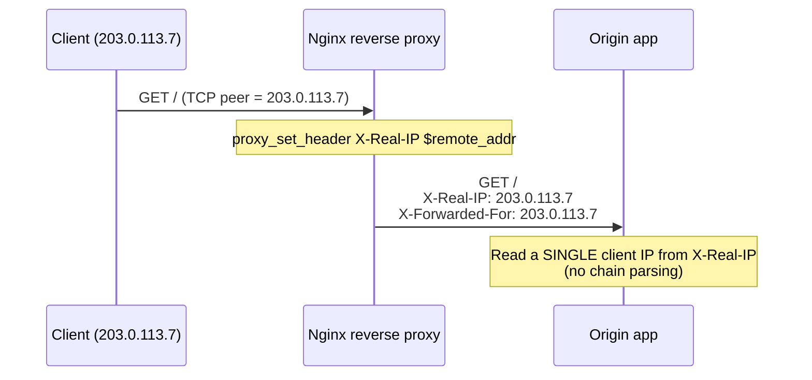

# X-Real-IP

## Quick Summary

`X-Real-IP` is a **non-standard request** header, popularized by **Nginx**, that carries a **single IP address** — the one the proxy considers the "real" client. Unlike [`X-Forwarded-For`](./X-Forwarded-For.md), which is a *comma-separated chain* of every hop, `X-Real-IP` holds exactly **one** value: the client IP as determined by the proxy that set it. This makes it simpler to consume (no list parsing, no hop-counting) but also less expressive (no chain, so it can't represent multiple intermediaries) and more fragile in multi-proxy setups (if two layers both set it, the last writer wins and can clobber the true client). It exists because, in the common "Nginx in front of an app" topology, the app just wants *the client IP* without walking a chain — and `X-Real-IP` delivers exactly that. Like every forwarding header it is **client-forgeable** and must only be trusted from proxies you control. It has no RFC standing; the standardized options are [`X-Forwarded-For`](./X-Forwarded-For.md) (entrenched convention) and [`Forwarded`](./Forwarded.md) (actual RFC 7239).

## What problem does this header solve?

Behind a proxy, your app's TCP peer address is the *proxy's* IP, not the user's ([the core problem `X-Forwarded-For` also solves](./X-Forwarded-For.md)). `X-Forwarded-For` solves it by carrying the whole chain — but consuming a chain correctly requires **hop-counting and trust logic**: you must know how many proxies are in front of you, walk the list from the right, and skip your own infrastructure. In the very common case of *one* trusted reverse proxy (Nginx) directly in front of the app, that ceremony is overkill; the app just wants a single, ready-to-use client IP.

`X-Real-IP` provides that: the reverse proxy computes "the real client IP" once (using its own trust configuration) and hands the app a **single value** to read — no list, no parsing, no hop math. For simple topologies it's ergonomic and hard to misuse *within the app* (though the trust burden shifts to the proxy). Its whole reason to exist is developer convenience in the dominant "single reverse proxy → app" pattern.

## Why was it introduced?

`X-Real-IP` is a **convention introduced by Nginx** (via its `ngx_http_realip_module` and the common `proxy_set_header X-Real-IP $remote_addr;` idiom), not by any standards body. It arose because Nginx-fronted apps needed a dead-simple way to receive the client IP, and a single-value header was easier to produce and consume than orchestrating XFF parsing in every backend. It follows the (RFC 6648-deprecated) `X-` naming pattern and was never standardized. The IETF's answer to the whole forwarding-header space is [`Forwarded`](./Forwarded.md) (RFC 7239), and the dominant real-world convention is [`X-Forwarded-For`](./X-Forwarded-For.md); `X-Real-IP` persists as an Nginx-flavored shortcut. Understanding it matters because a huge fraction of the internet runs Nginx and emits this header — but it should be seen as a *convenience layer over* the same trust model, not a distinct security mechanism.

## How does it work?

The reverse proxy determines the client IP (typically from its own inbound `$remote_addr`, or via the `realip` module from a trusted XFF) and sets `X-Real-IP: <that single IP>` before forwarding to the app. The app reads that one value.



- **Browser behavior:** Browsers do **not** send `X-Real-IP`; it's proxy-generated.
- **Server behavior:** The origin reads the single `X-Real-IP` value as the client IP — **only if** it trusts the proxy that set it. It performs no chain parsing.
- **Proxy behavior:** The reverse proxy sets it to one IP. Critically, in a **multi-proxy** chain, each proxy that sets `X-Real-IP` **overwrites** the previous value (it's not a list), so only the *last* setter's notion survives — a footgun if an inner proxy overwrites the true client IP established by the edge.
- **CDN behavior:** Some CDNs/edges set `X-Real-IP`; many instead use `X-Forwarded-For` and their own dedicated header (`CF-Connecting-IP`, etc.). Don't assume it's present.
- **Reverse proxy behavior:** Nginx is the canonical setter (`proxy_set_header X-Real-IP $remote_addr;`) and can also *derive* `$remote_addr` from a trusted XFF via the `realip` module.

## HTTP Request Example

A single-proxy request carrying one client IP:

```http
GET /api/orders HTTP/1.1
Host: api.example.com
X-Real-IP: 203.0.113.7
X-Forwarded-For: 203.0.113.7
X-Forwarded-Proto: https
```

A **forged** request sent directly to an origin that naively trusts `X-Real-IP`:

```http
GET /admin HTTP/1.1
Host: api.example.com
X-Real-IP: 127.0.0.1
```

If the app trusts `X-Real-IP` unconditionally, it now believes the request came from localhost — a classic allowlist bypass, identical in spirit to the XFF forgery risk.

## HTTP Response Example

`X-Real-IP` is **request-only** — it never appears on responses. The origin consumes it (usually logging the client IP) and does not echo it.

## Express.js Example

Express's `trust proxy` machinery is built around **`X-Forwarded-For`**, not `X-Real-IP` — so `req.ip` won't automatically come from `X-Real-IP`. If your Nginx emits `X-Real-IP`, either also emit XFF (recommended) or read `X-Real-IP` explicitly with a trust check:

```js
const express = require('express');
const net = require('net');
const app = express();

// Preferred: rely on X-Forwarded-For + trust proxy (Express-native).
app.set('trust proxy', 1);   // req.ip uses XFF under this setting.

// If you must consume X-Real-IP, do it explicitly AND gate on a trusted peer.
const TRUSTED_PROXIES = ['10.0.0.9', '127.0.0.1'];

app.use((req, res, next) => {
  const peer = req.socket.remoteAddress;
  const proxyIsTrusted = TRUSTED_PROXIES.includes(peer);

  // Only believe X-Real-IP from a proxy we control; validate it's a real IP.
  const realIp = req.headers['x-real-ip'];
  if (proxyIsTrusted && realIp && net.isIP(realIp)) {
    req.clientIp = realIp;                 // single value, no parsing needed
  } else {
    req.clientIp = req.ip;                 // fall back to Express's XFF-derived ip
  }
  next();
});

app.get('/api/orders', (req, res) => res.json({ client: req.clientIp }));

app.listen(3000);
```

Why each piece matters: the `proxyIsTrusted` gate is the whole security story — `X-Real-IP` from an *untrusted* direct connection is attacker-controlled, so believing it lets anyone spoof `127.0.0.1`. `net.isIP(realIp)` rejects garbage/injection. The bigger lesson is architectural: because Express is XFF-native, the *simplest correct* setup is to have Nginx set **both** `X-Real-IP` (for tools that want it) and `X-Forwarded-For` (for Express's `trust proxy`), and let `req.ip` do the work — reserve manual `X-Real-IP` reading for cases where XFF isn't available. Setting `trust proxy: true` remains dangerous for the same forgery reason as everywhere else.

## Node.js Example

Raw `http` — read the single value, trust-gated:

```js
const http = require('http');
const net = require('net');

const TRUSTED_PEERS = ['10.0.0.9', '127.0.0.1'];

http.createServer((req, res) => {
  const peer = req.socket.remoteAddress;
  const trusted = TRUSTED_PEERS.includes(peer);

  // X-Real-IP is a single IP — no comma-splitting. Trust only from your proxy.
  const realIp = req.headers['x-real-ip'];
  const clientIp = (trusted && realIp && net.isIP(realIp)) ? realIp : peer;

  console.log('client:', clientIp, 'peer:', peer);
  res.end(JSON.stringify({ clientIp }));
}).listen(3000);
```

The contrast with [`X-Forwarded-For`](./X-Forwarded-For.md): no list, no right-to-left walk, no hop count — just one value you either trust (from your proxy) or ignore. Simpler, but it can't express a multi-hop chain, and it silently loses the true client if an inner proxy overwrites it.

## React Example

React never sends or reads `X-Real-IP` — it's a proxy/server header the browser doesn't touch. The indirect effects mirror [`X-Forwarded-For`](./X-Forwarded-For.md):

1. **Client-IP-dependent UI** (geolocation, IP-based feature flags, abuse challenges) works only if the server correctly derives the client IP — from `X-Real-IP`, XFF, or a CDN header. Misconfiguration (or an inner proxy overwriting `X-Real-IP`) makes every user look like they come from the proxy.
2. **Rate-limit 429s** appear in the React app if IP derivation collapses all users into one bucket — a server-side `X-Real-IP`/trust issue.
3. **You don't set it in fetch/axios** — the browser ignores such attempts, and a correct server trusts `X-Real-IP` only from its own proxy.

## Browser Lifecycle

There is **no browser lifecycle** for `X-Real-IP`. The browser never generates, reads, or exposes it. It is created by the reverse proxy (recording the client IP) and consumed at the origin. The browser's only role is being the client whose IP the proxy records.

## Production Use Cases

- **Single-reverse-proxy (Nginx → app) topologies:** the app reads one client IP with zero parsing.
- **Access logging:** simple, single-value client IP in app logs.
- **Rate limiting / geo / abuse checks:** keying on the single derived client IP (when the proxy set it correctly).
- **Legacy apps** that expect a single client-IP header rather than XFF parsing.
- **Internal services** behind a trusted mesh/proxy that injects `X-Real-IP` for convenience.

## Common Mistakes

- **Trusting `X-Real-IP` from any peer.** Forgeable; only believe it from your proxy. Gate on the TCP peer / trusted source.
- **Assuming Express `req.ip` uses it.** It doesn't — `trust proxy` reads XFF. Emit XFF too, or read `X-Real-IP` explicitly.
- **Multi-proxy overwrite.** If two layers both `set X-Real-IP`, the inner one clobbers the edge's true-client value. Set it **once**, at the trust boundary, and don't overwrite it downstream (or use XFF, which appends).
- **Expecting a chain.** It holds a single IP; you can't recover intermediate hops from it. Use XFF/`Forwarded` when you need the chain.
- **Not validating the value.** Always check it's a real IP (`net.isIP`) to avoid log injection / bad data.
- **Using it for authentication.** IP is not identity.
- **Assuming it's always present.** Not all proxies/CDNs set it; fall back to XFF or the socket peer.

## Security Considerations

- **Client-forgeable — trust only your proxy.** `X-Real-IP` is a plain request header; a direct attacker can send any value. Believe it only when the connection comes from a proxy you control, and firewall the origin so the proxy can't be bypassed.
- **Overwrite risk hides the true client.** Because it's single-valued, an inner proxy (or a misconfigured hop) overwriting `X-Real-IP` can silently replace the real client IP with a proxy's IP — breaking logging/rate-limiting and, worse, potentially inserting a *trusted* internal IP. Establish it once at the edge.
- **Allowlist / rate-limit bypass.** Naive trust enables the same spoofing bypasses as XFF (fake `127.0.0.1`, IP-ban evasion). Derive from a trusted source; prefer network-level controls for sensitive allowlists.
- **Log injection.** Validate/escape the value before logging.
- **PII.** Client IPs are personal data (GDPR); handle and retain accordingly.
- **Prefer XFF/`Forwarded` for multi-proxy trust.** Their chain semantics make correct trust derivation possible; `X-Real-IP` hides the topology you need to reason about trust.

## Performance Considerations

- **Cheaper to consume than XFF:** a single value, no list parsing or hop-walking — a marginal CPU/logic win per request.
- **Negligible wire cost;** one short header, compressed under HTTP/2/3.
- **Correctness impact dominates:** as with all client-IP headers, a wrong value breaks rate limiting (DoS-enabling or over-throttling) and pollutes analytics — costs far exceeding the header itself.
- **No caching interaction** of its own.

## Reverse Proxy Considerations

Nginx is the canonical `X-Real-IP` producer; set it **once at the trust boundary** and derive it safely from trusted sources:

```nginx
http {
  # Derive $remote_addr from a trusted XFF so X-Real-IP reflects the true client
  # even when Nginx itself sits behind another trusted proxy/CDN.
  set_real_ip_from 198.51.100.0/24;   # trusted CDN egress
  set_real_ip_from 10.0.0.0/8;        # trusted internal LB
  real_ip_header X-Forwarded-For;
  real_ip_recursive on;

  server {
    location / {
      proxy_pass http://app_upstream;
      proxy_set_header X-Real-IP $remote_addr;                 # single true client IP
      proxy_set_header X-Forwarded-For $proxy_add_x_forwarded_for; # also emit the chain
      proxy_set_header X-Forwarded-Proto $scheme;
      proxy_set_header Host $host;
    }
  }
}
```

Key points: `set_real_ip_from` + `real_ip_recursive` make `$remote_addr` the *actual* client (not the immediate CDN/LB), so `X-Real-IP $remote_addr` is correct even in a chain. Emit **both** `X-Real-IP` and `X-Forwarded-For` so XFF-native frameworks (Express) and X-Real-IP consumers both work. Set `X-Real-IP` at the **outermost** trusted hop and avoid overwriting it in inner proxies.

## CDN Considerations

- **Not universal.** Many CDNs emit `X-Forwarded-For` and their own dedicated client-IP header (Cloudflare `CF-Connecting-IP`, Akamai `True-Client-IP`, Fastly `Fastly-Client-IP`) rather than `X-Real-IP`. Prefer the CDN's authoritative header when behind it.
- **Trust only CDN egress ranges** if you consume `X-Real-IP` behind a CDN, and firewall the origin against bypass.
- **Overwrite hazard through the chain:** if the CDN sets `X-Real-IP` and an inner Nginx also sets it from *its* peer (the CDN), the true client is lost — configure the inner proxy to preserve/derive the real client (via `realip` from the CDN header) rather than overwrite.
- **Consistency:** ensure whichever header you rely on carries the same client IP end-to-end.

## Cloud Deployment Considerations

- **Cloud LBs (AWS ALB/GCP/Azure)** generally emit `X-Forwarded-For` (and product-specific headers), **not** `X-Real-IP` — so in cloud-LB topologies, XFF/`Forwarded` is the reliable source; `X-Real-IP` typically appears only when *your own* Nginx injects it.
- **NLB / L4 LBs** don't add HTTP headers at all — use the PROXY protocol to recover the client IP (and your Nginx can then set `X-Real-IP` from it).
- **Service meshes (Envoy/Istio):** prefer XFF/`Forwarded` with configured trusted hops; `X-Real-IP` is less standard there.
- **Managed platforms (Vercel/Netlify):** expose the client IP via platform APIs/headers; use those rather than assuming `X-Real-IP`.
- **Universal rule:** set the client-IP header **once** at your trust boundary, trust it only from that source, and prefer XFF/`Forwarded` when multiple proxies are involved.

## Debugging

- **curl (spoof test):** `curl -H 'X-Real-IP: 1.2.3.4' https://your-origin/whoami` directly at the origin — if the app reports `1.2.3.4`, it's trusting `X-Real-IP` from untrusted peers.
- **Echo endpoint:** return `req.headers['x-real-ip']`, `req.headers['x-forwarded-for']`, `req.ip`, and `req.socket.remoteAddress` to compare what each layer provides.
- **curl through the real path:** hit the public URL and confirm the derived client IP equals your actual public IP.
- **Nginx:** log `$remote_addr` (post-realip), `$http_x_real_ip`, and `$proxy_add_x_forwarded_for` to verify the value and catch overwrites.
- **Multi-proxy check:** trace `X-Real-IP` at each hop to ensure an inner proxy isn't clobbering the edge's true-client value.

## Best Practices

- [ ] Trust `X-Real-IP` **only** from proxies you control (gate on the TCP peer / trusted source); firewall the origin against bypass.
- [ ] Set it **once**, at the outermost trust boundary; don't overwrite it in inner proxies.
- [ ] Derive it from the *true* client (Nginx `realip` from a trusted XFF/CDN header), not just the immediate peer, in multi-proxy chains.
- [ ] Emit [`X-Forwarded-For`](./X-Forwarded-For.md) **alongside** it so XFF-native frameworks (Express `trust proxy`) work — don't rely on `req.ip` reading `X-Real-IP`.
- [ ] Validate the value as a real IP (`net.isIP`) before using/logging it.
- [ ] Prefer [`X-Forwarded-For`](./X-Forwarded-For.md) / [`Forwarded`](./Forwarded.md) when you need multi-hop trust semantics.
- [ ] Never authenticate on `X-Real-IP`; treat client IPs as **PII**.
- [ ] Fall back to the socket peer when it's absent.

## Related Headers

- [X-Forwarded-For](./X-Forwarded-For.md) — the chain-based client-IP header; preferred for multi-proxy trust. `X-Real-IP` is its single-value cousin.
- [Forwarded](./Forwarded.md) — the RFC 7239 standard for client IP/scheme/host.
- [X-Forwarded-Proto](./X-Forwarded-Proto.md) / [X-Forwarded-Host](./X-Forwarded-Host.md) — scheme and host counterparts.
- [Via](./Via.md) — proxy-chain identities (not client IP).
- [Proxies Overview](./Proxies-Overview.md) — the forwarding/trust framing.
- [End-to-End vs Hop-by-Hop Headers](../01-Introduction/End-to-End-vs-Hop-by-Hop-Headers.md) — why forwarding headers propagate.

## Decision Tree

```mermaid
flowchart TD
    A[Need the client IP?] --> B{Single trusted reverse proxy<br/>(Nginx) in front?}
    B -- Yes --> C[X-Real-IP is convenient<br/>+ also emit XFF for frameworks]
    B -- Multi-proxy / cloud LB / CDN --> D[Use X-Forwarded-For / Forwarded<br/>(chain + trust logic)]
    C --> E[Trust only from your proxy;<br/>validate as IP]
    D --> E
    E --> F{Using it for auth?}
    F -- Yes --> G[STOP: IP is not identity]
    F -- No --> H[OK for log/rate-limit/geo]
    A --> I[NEVER trust X-Real-IP from<br/>arbitrary/direct connections]
```

## Mental Model

Think of `X-Real-IP` as a **single "From:" line the front-desk clerk writes on your visitor slip**, versus [`X-Forwarded-For`](./X-Forwarded-For.md), which is a **running list every mailroom adds to**. In a small office with one front desk (a single Nginx proxy), the clerk just looks at who walked in, writes "From: 203.0.113.7," and hands the slip to the department — clean and simple, no one has to trace a chain. The trouble starts in a bigger building with several checkpoints: because there's only *one* "From:" line, each checkpoint that fills it in **erases** what the previous one wrote, so by the time the slip reaches the department it might say "From: the second-floor checkpoint" instead of the actual visitor — the true origin got overwritten. That's why, once you have more than one checkpoint, you want the *append-only guestbook* (XFF) that preserves the whole trail. And in both systems the same rule holds: the "From:" line is only trustworthy if a checkpoint *you* staff wrote it — a stranger can scribble "From: the CEO" on their own slip before walking in.
