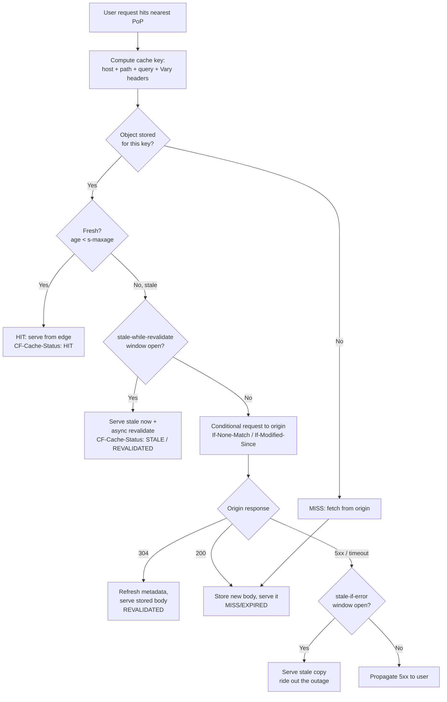

# CDN Caching Overview

## Why a CDN is just a very large, very distributed cache

Strip away the marketing and a CDN is one thing: a globally-distributed, shared HTTP cache that sits between your users and your origin. Cloudflare, Fastly, Amazon CloudFront, Akamai, and Bunny all implement the same core loop — receive a request at the geographically-nearest point of presence (PoP), check whether a fresh copy of the response is stored *at that PoP*, and either serve it locally (a **hit**, tens of milliseconds, zero origin load) or fetch it from origin (a **miss**, a full RTT to your servers plus origin compute). Everything else — image resizing, WAF rules, bot management, edge compute — is bolted onto that loop.

Because a CDN is a *shared* cache (one stored object serves millions of unrelated users), it obeys the same RFC 9111 rules as any other shared cache, and it is driven almost entirely by the **response headers your origin emits**. The single most important consequence of that sentence: your CDN's behavior is your responsibility. If you send the wrong [`Cache-Control`](../06-Caching-Headers/Cache-Control.md), the CDN will faithfully cache a logged-in user's dashboard and serve it to a stranger. The CDN is not "smart" by default; it is obedient. Your headers are the program it runs.

This chapter is about that program: which headers the edge reads, how it builds a cache key, how revalidation and stale-serving work at the edge, how you invalidate what you've cached, and — the part that ends careers — how to keep private API responses from ever entering a shared cache.

## `max-age` vs `s-maxage`: the browser and the edge want different lifetimes

The freshness lifetime of a cached response is computed in a strict priority order. For a shared cache like a CDN it is: `s-maxage` → `max-age` → [`Expires`](../06-Caching-Headers/Expires.md) → heuristic. For a browser's private cache it is: `max-age` → `Expires` → heuristic (a browser ignores `s-maxage` entirely, because `s-maxage` is *defined* as "shared caches only").

This split is the whole reason both directives exist. You almost always want a different TTL at the edge than in the browser:

```http
HTTP/1.1 200 OK
Content-Type: text/html; charset=utf-8
Cache-Control: public, max-age=0, s-maxage=300
```

Read this as two instructions to two different audiences. To the browser: `max-age=0` — treat this HTML as immediately stale, revalidate on every use, so a user always gets fresh content on navigation. To the CDN: `s-maxage=300` — cache this HTML at the edge for five minutes, absorbing the thundering herd of requests for the homepage and serving them without ever touching origin. One document, two lifetimes, one header. The browser never over-caches HTML (you can always ship an update in ≤5 min at the edge), and the origin sees at most one request per PoP per 5-minute window instead of one per user.

The inverse pattern — long browser cache, short edge cache — is rarer but valid for content you want sticky on a device but purgeable centrally. The point is that `max-age` and `s-maxage` are independent knobs, and treating them as one number is how people accidentally either hammer origin (both set to 0) or serve stale HTML for a day (both set to 86400).

> A subtlety: `s-maxage` also implies `proxy-revalidate` semantics in some caches and, more importantly, its mere presence tells the shared cache the response *is* cacheable even without `public`. But do not rely on that — always be explicit. See [`Cache-Control`](../06-Caching-Headers/Cache-Control.md) for the full directive matrix.

## The cache key: what makes two requests "the same"

A CDN stores a response under a **cache key**. On the next request it computes the key and looks for a stored object under it. If two different requests hash to the same key, they get the same cached response — which is exactly what you want for two users requesting `/logo.png`, and exactly what you must prevent for two users requesting `/api/me`.

The default cache key on every major CDN is roughly:

```
scheme + host + path + query-string + (request headers named in Vary)
```

Everything in the key partitions the cache; everything *not* in the key is ignored for matching. Three practical consequences:

1. **Query strings usually count.** By default `/img?v=1` and `/img?v=2` are separate cache entries. This is the mechanism behind cache-busting (below), but it also means marketing/tracking params (`?utm_source=…`) can shatter your hit ratio by creating thousands of distinct keys for identical content. Every CDN lets you *normalize* the key — sort params, or ignore specific ones. Cloudflare's "Cache Key" rules and Fastly's VCL both do this. Ignore `utm_*` and your hit ratio jumps.

2. **The `Cookie` header is *not* in the default key** — but many CDNs will refuse to cache a response at all if the *request* carries certain cookies, or if the response carries [`Set-Cookie`](../08-Cookies/Set-Cookie.md). This is a safety heuristic (a cookie usually signals personalization). Understand your CDN's cookie behavior before assuming a page is cached.

3. **[`Vary`](../06-Caching-Headers/Vary.md) extends the key.** This is the sanctioned, origin-controlled way to say "this URL has multiple representations, cache them separately."

### `Vary`: correct partitioning, or a foot-gun

`Vary: Accept-Encoding` tells the cache to store the gzip, brotli, and identity variants of a response under separate keys, so a client that only accepts gzip never receives brotli. This is essentially mandatory when you compress at origin — see [`Content-Encoding`](../10-Compression/Content-Encoding.md) and [`Accept-Encoding`](../03-Request-Headers/Accept-Encoding.md).

The danger is high-cardinality `Vary`. `Vary: User-Agent` means a separate cache entry per unique User-Agent string — and there are effectively infinite of those. Your hit ratio collapses to near zero and your origin melts. `Vary: Cookie` on a page that sets a per-session cookie is the same disaster: every user gets their own cache entry (so no sharing) *and* you risk storing personalized content in a shared cache. Rule: only `Vary` on headers with a small, bounded set of values that genuinely change the response body. In practice that's `Accept-Encoding`, sometimes `Accept` (for content negotiation), and occasionally a small `X-` device-class header you set yourself. Never `Vary: *` on a CDN — it makes the response effectively uncacheable.

## Revalidation at the edge: `ETag`, `Last-Modified`, and the conditional round-trip

When a cached object goes stale, the edge doesn't blindly re-download it. If the origin supplied a validator — an [`ETag`](../06-Caching-Headers/ETag.md) or a [`Last-Modified`](../06-Caching-Headers/Last-Modified.md) date — the edge issues a **conditional request** to origin:

```http
GET /app.abc123.js HTTP/1.1
Host: origin.example.com
If-None-Match: "abc123"
If-Modified-Since: Wed, 01 Jul 2026 10:00:00 GMT
```

See [`If-None-Match`](../12-Conditional-Requests/If-None-Match.md) and [`If-Modified-Since`](../12-Conditional-Requests/If-Modified-Since.md). If the resource is unchanged the origin replies `304 Not Modified` with **no body**, and the edge refreshes the freshness metadata (resetting the age clock) and re-serves the body it already had. The win is bandwidth and origin compute: a 304 is a few hundred bytes and usually a cheap `stat()`/hash comparison, versus re-transferring and regenerating a full response.

For this to work the origin's `ETag` must be *stable and correct*. Two traps at scale:

- **Weak vs strong ETags.** A weak validator (`W/"abc"`) asserts semantic equivalence, not byte equivalence. That's fine for revalidation but disqualifies the response from [`Range` requests](../13-Range-Requests/Range.md) served from that validator. If you serve video/large files through a CDN, prefer strong ETags.
- **ETag mismatch across origin replicas.** If you run N origin servers and each computes ETags differently (e.g., inode-based ETags on Nginx, or timestamps that differ per deploy), the edge revalidation constantly fails — every 304 attempt becomes a 200 with a full body, because server A's ETag never matches server B's. Normalize ETag generation across your fleet, or you get a "revalidation that never validates."

## Serving stale on purpose: `stale-while-revalidate` and `stale-if-error`

Two directives (RFC 5861) turn a CDN from a strict freshness enforcer into a resilience layer.

```http
Cache-Control: public, s-maxage=60, stale-while-revalidate=600, stale-if-error=86400
```

- **`stale-while-revalidate=600`**: for 600 seconds *after* the object goes stale, the edge may serve the stale copy **immediately** to the user while kicking off an asynchronous revalidation in the background. The user pays zero latency for freshness; the next user gets the refreshed copy. This eliminates the "one unlucky user eats the origin round-trip" tax that plagues plain `max-age`. It is the single highest-leverage caching directive for perceived performance on dynamic-but-cacheable content.

- **`stale-if-error=86400`**: if the origin is down or returns 5xx during revalidation, the edge may serve the stale copy for up to a day instead of propagating the error. This is a free availability upgrade — your site stays up (serving slightly-stale content) through an origin outage, as long as the edge had a copy.

Not every CDN implements both, and some gate them behind config (Cloudflare historically required Enterprise or a specific setting for SWR; Fastly and CloudFront support them). Verify support, but where available, this pattern is close to a default for cacheable HTML and API GETs.



## Cache-busting: why hashed filenames beat purging

The hardest problem in caching is invalidation, and the best solution is to never need it. **Content-hashed filenames** sidestep the entire problem:

```
app.9f2a1c.js      →  Cache-Control: public, max-age=31536000, immutable
vendor.4b8e0d.css  →  Cache-Control: public, max-age=31536000, immutable
```

Every bundler (Webpack, Vite, esbuild, Rollup) can emit the content hash in the filename. Because the filename *is* a function of the content, a changed file gets a new name, which is a new URL, which is a new cache key — so there is no stale-vs-fresh question at all. The old `app.9f2a1c.js` can live in caches forever (`max-age=31536000, immutable`) because it will *never* need to change; when you deploy, `index.html` simply references `app.7d3f88.js` instead. The `immutable` directive is the finishing touch: it tells browsers not to even *revalidate* on reload, killing the `max-age=0` conditional storm that a plain reload otherwise triggers on every sub-resource.

The one thing you must **not** cache aggressively is the HTML that references these assets. The HTML is the manifest; it must update the moment you deploy. Hence the classic split:

- **Hashed static assets** (`.js`, `.css`, fonts, images): `public, max-age=31536000, immutable`. Cache forever, everywhere.
- **The HTML entry document**: `public, max-age=0, s-maxage=60, stale-while-revalidate=…` or `no-cache`. Short/zero browser life, short edge life, revalidate constantly.

Get these two backwards and you either serve users a year-old app or you never cache your assets at all.

## Purging: nuking what's already cached

Hashed filenames handle *versioned* assets. For content that keeps its URL — an article at `/blog/my-post`, an API response at `/api/products`, the homepage — you need to actively **purge** (invalidate) the edge copy when the underlying data changes. Every CDN exposes a purge API. Three flavors:

- **Purge by URL** (single-file purge): `POST /purge {"files":["https://ex.com/blog/my-post"]}`. Precise, fast, but you must know every URL affected by a change. Purging one blog post is easy; purging "every page that embeds this product's price" is not.
- **Purge everything**: nukes the entire cache. Simple, brutal, and it exposes your origin to a full cache-miss stampede as every PoP refills. Use only in emergencies.
- **Purge by tag / key** (the good one): you tag responses at origin, then purge by tag. This is what surrogate keys are for.

### Surrogate headers: `Surrogate-Control` and `Surrogate-Key` / `Cache-Tag`

Surrogate headers are a private channel between origin and CDN that the CDN **strips before responding to the browser** — the browser never sees them. This lets you give the edge different instructions than the browser without polluting the public response.

`Surrogate-Control` (from the Edge Architecture Specification) is a CDN-only twin of `Cache-Control`:

```http
Cache-Control: max-age=0, private
Surrogate-Control: max-age=600, stale-while-revalidate=86400
```

Here the browser is told "private, don't store" while the CDN is told "cache 10 minutes, serve stale for a day." When present, `Surrogate-Control` takes precedence over `Cache-Control` *at the surrogate (CDN) only*. Fastly honors this natively; Cloudflare does not use `Surrogate-Control` (it uses its own `Cache-Control`/config model), so this is CDN-specific — check your vendor.

`Surrogate-Key` (Fastly) and `Cache-Tag` (Cloudflare Enterprise, Akamai's `Edge-Cache-Tag`) attach one or more space-separated tags to a cached object:

```http
Surrogate-Key: product-42 category-shoes homepage
Cache-Tag: product-42,category-shoes,homepage
```

Now when product 42's price changes, you issue **one** tag purge — `PURGE key=product-42` — and the CDN invalidates *every* cached object tagged `product-42`: the product page, the category listing, the homepage feature, the JSON API response, all at once, across all PoPs, in one call. This is the correct architecture for content-driven invalidation: tag responses by the data entities they depend on, purge by entity on write. It turns "which of my 40,000 URLs mention this product?" into "purge tag `product-42`."

## Reading the edge: CDN diagnostic headers

When you `curl -I` a URL through a CDN, the response tells you the cache decision. These headers are your primary debugging surface.

- **`Age`** (standard, RFC 9111): seconds the object has been sitting in caches since it was fetched/validated at origin. `Age: 250` on a response with `s-maxage=300` means "50 seconds of freshness left." An `Age` that keeps growing across requests but never resets means the object is being served from cache and never revalidated (possibly correct, possibly a purge that isn't working). `Age: 0` on every request means you're missing constantly.
- **`CF-Cache-Status`** (Cloudflare): the verdict. `HIT` (served from edge), `MISS` (fetched from origin, now cached), `EXPIRED` (was stale, revalidated), `REVALIDATED`, `STALE` (served stale, e.g. via SWR/error), `DYNAMIC` (not eligible for caching — the default for anything Cloudflare won't cache without a rule), `BYPASS` (a rule/cookie forced origin). If you expect `HIT` and see `DYNAMIC`, Cloudflare has decided your response isn't cacheable — usually because of `Set-Cookie`, `Cache-Control: private/no-store`, or no cache rule for that content type.
- **`X-Cache`** (CloudFront, Fastly, Varnish convention): typically `Hit from cloudfront` / `Miss from cloudfront`, or Fastly's `HIT, HIT` (two values for the two-tier edge/shield architecture). Varnish sets `X-Cache: HIT`/`MISS` too.
- **`X-Served-By`** (Fastly): which PoP(s) served it, e.g. `cache-lhr6634-LHR, cache-fra-eddf8230068-FRA` — the shield and edge nodes in the path. Combined with `X-Cache: HIT, MISS` you can see the object hit the shield but missed the edge.
- **`Via`** (standard, RFC 9110): identifies each proxy/cache in the chain, e.g. `Via: 1.1 varnish, 1.1 cloudfront`. Its presence proves a shared cache touched the response.

See [Cloudflare and CDN-Specific Headers](./Cloudflare-and-CDN-Headers.md) for the full reference on reading these when debugging, including the request-side headers (`CF-Connecting-IP`, `CF-Ray`, `X-Forwarded-For`) that the edge injects toward your origin.

## Separating cacheable static from private API responses

The organizing principle of a CDN-fronted architecture is a clean split between two response classes, ideally on **different hostnames or path prefixes** so you can apply blanket rules:

- **Public, cacheable**: static assets, marketing pages, public catalog/API GETs. `Cache-Control: public, …`, long or medium TTLs, tagged for purge. Served overwhelmingly from the edge.
- **Private, per-user**: authenticated APIs, dashboards, anything gated by [`Authorization`](../03-Request-Headers/Authorization.md) or a session [`Cookie`](../08-Cookies/Cookie.md). `Cache-Control: private, no-store` (or at least `private, no-cache`), never cached in the shared tier.

Route them separately: `cdn.example.com` / `/static/*` for the cacheable class with a "cache aggressively" rule, and `api.example.com` / `/api/*` for the private class with a "never cache" rule. This makes the security-critical default explicit at the routing layer instead of relying on every individual response getting its header right.

## The career-ending mistake: caching an authenticated response in a shared cache

This is the one to internalize. A shared cache stores *one* object per key and serves it to *everyone* who computes that key. If a response that depends on *who is asking* — because it was gated by an `Authorization` header or a session cookie — is stored in a shared cache, the **first** authenticated user's private data is served to **every subsequent** user who requests that URL. Bank balances, PII, other people's shopping carts, admin panels — leaked at line rate, cached across the globe, until the TTL expires or you purge.

How it happens (all of these are real incidents):

- Origin emits `Cache-Control: public, max-age=300` (or nothing, and the CDN applies a default TTL) on `/api/me`. The `Authorization` header isn't in the cache key, so all users share one entry.
- A misconfigured CDN "cache everything" page rule that also matches `/api/*`.
- `Vary: Cookie` was *supposed* to partition per-session, but the session id lives in a header the cache doesn't vary on, or the CDN ignores cookies in the key.
- HTML rendered server-side with the user's name baked in, cached at the edge with `s-maxage`.

Defenses, in order of reliability:

1. **Never send `public` on an authenticated response.** For anything gated by `Authorization` or a session cookie, emit `Cache-Control: private, no-store`. `private` alone forbids shared caches from storing it; `no-store` forbids *any* cache. RFC 9111 also says a response to a request with `Authorization` is not stored by shared caches unless explicitly allowed — but do not rely on that alone, because CDN config can override it and not every intermediary is strict.
2. **Route private traffic to a "never cache" hostname/rule** (previous section) so a single misplaced header can't opt something in.
3. **Strip/normalize the cache key** so credentials never accidentally *become* the key, and confirm the CDN treats cookie-bearing requests as uncacheable.
4. **Verify in production**: `curl` an authenticated endpoint as two different users and confirm you get two different bodies and `CF-Cache-Status: DYNAMIC`/`BYPASS` (or your CDN's "not cached" verdict), never `HIT`.

The asymmetry is the point: caching a static asset wrong costs you a stale file; caching an authenticated response wrong is a data breach. Treat "is this response shared-cacheable?" as a security decision, not a performance one.

## Mental Model

Think of a CDN as a chain of neighborhood **lending libraries**, one in every city, all stocked from a single central publisher (your origin).

- **`Cache-Control`/`s-maxage`** is the "return by" date the publisher stamps in each book: how long a branch may lend a copy before checking whether a new edition exists.
- **The cache key** is the catalog number. Two requests with the same catalog number get the same book off the shelf. `Vary` says "this title has a large-print and a standard edition — shelve them under different numbers."
- **Revalidation (`ETag`/304)** is the branch phoning the publisher: "Is edition `abc123` still current?" A `304` means "yes, keep lending the copy you have" — no need to ship a new one.
- **`stale-while-revalidate`** is a branch that hands you the slightly-outdated copy *now* and phones the publisher for the new edition in the background, so you never wait at the desk. **`stale-if-error`** is that same branch continuing to lend the old edition when the publisher's phone line is down.
- **Hashed filenames** mean every edition is a brand-new title with its own catalog number, so "old" and "new" never collide — no returns needed, ever.
- **Surrogate keys / cache tags** are subject stickers on the spine: to recall every book about "product 42," you don't hunt title by title — you tell all branches "pull everything tagged product-42," and they do it at once.
- **The fatal error** is a branch that lends out someone's *personal diary* as if it were a library book, because it was dropped in the return slot without a "PRIVATE — do not shelve" label. That label is `Cache-Control: private, no-store`. On a shared shelf, forgetting it doesn't lose a book — it hands one patron's secrets to everyone in line behind them.
