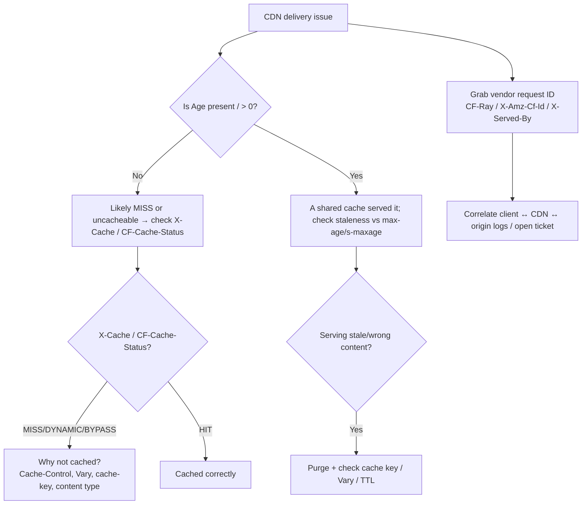

# CDN Debugging Headers

> A **chapter page** — a vendor-neutral catalogue of the headers you use to **debug CDN behavior**: was this a cache hit or miss? how old is the cached copy? which edge/POP served it? what's the request's correlation ID? Every CDN exposes these, but under **different header names**, so this page maps the common concepts across Cloudflare, Fastly, AWS CloudFront, Akamai, and others — plus the standard headers ([`Age`](../06-Caching-Headers/Age.md), [`Via`](../14-Proxies/Via.md), [`Cache-Control`](../06-Caching-Headers/Cache-Control.md)) that work everywhere. For Cloudflare specifics see [Cloudflare-Specific Headers](./Cloudflare-Specific-Headers.md).

## The core questions CDN debugging headers answer

When something's wrong with CDN delivery, you need to answer, in order:

1. **Was it cached?** (HIT/MISS/EXPIRED/BYPASS) — the single most common question.
2. **How stale is the cached copy?** ([`Age`](../06-Caching-Headers/Age.md)).
3. **Which edge/POP/datacenter served it?** (for geo/routing issues).
4. **What's the correlation ID?** (to match client ↔ CDN ↔ origin logs and open support tickets).
5. **Why wasn't it cached / why was it stale?** (cache-key, [`Vary`](../06-Caching-Headers/Vary.md), [`Cache-Control`](../06-Caching-Headers/Cache-Control.md), origin directives).

The headers below map onto these questions per vendor.

## Cross-vendor header map

| Concept | Standard | Cloudflare | Fastly | AWS CloudFront | Akamai |
|---|---|---|---|---|---|
| **Cache hit/miss** | — | `CF-Cache-Status` | `X-Cache` (`HIT`/`MISS`), `X-Cache-Hits` | `X-Cache` (`Hit from cloudfront` / `Miss from cloudfront`) | `X-Cache` (via debug), `X-Cache-Remote` |
| **Cache age** | [`Age`](../06-Caching-Headers/Age.md) | `Age` | `Age` | `Age` | `Age` |
| **Which edge/POP** | — | `CF-Ray` (…-`FRA`) | `X-Served-By` (POP list) | `X-Amz-Cf-Pop` | `X-Akamai-*` (debug) |
| **Correlation/request ID** | — | `CF-Ray` | `X-Served-By` + `Fastly-Debug` | `X-Amz-Cf-Id` | `X-Akamai-Request-ID` |
| **Proxy chain** | [`Via`](../14-Proxies/Via.md) | (Via/CF-Ray) | `Via: 1.1 varnish` | `Via: ...cloudfront.net (CloudFront)` | `Via` |
| **Client IP (authoritative)** | [`X-Forwarded-For`](../14-Proxies/X-Forwarded-For.md) | `CF-Connecting-IP` | `Fastly-Client-IP` | `CloudFront-Viewer-Address` | `True-Client-IP` |
| **Client geo** | — | `CF-IPCountry` | `Fastly-Geo-*` (via VCL) | `CloudFront-Viewer-Country` | `X-Akamai-Edgescape` |
| **Debug/verbose mode** | — | (dashboard) | `Fastly-Debug: 1` → `Fastly-Debug-*` | (limited) | `Pragma: akamai-x-cache-on...` |

**Rule of thumb:** for **cache hit/miss**, look for `X-Cache` (most vendors) or `CF-Cache-Status` (Cloudflare); for **age**, use the standard [`Age`](../06-Caching-Headers/Age.md); for **which node**, use the vendor's POP/ray header; for **correlation**, grab the vendor's request-ID header and log it.

## Standard headers that work everywhere

Before vendor headers, three **standard** signals are available on any CDN:

- **[`Age`](../06-Caching-Headers/Age.md):** present and > 0 ⇒ a shared cache served it; the value is seconds since origin generation. Absent ⇒ likely a MISS / uncacheable.
- **[`Via`](../14-Proxies/Via.md):** names intermediaries (e.g. `Via: 1.1 varnish` = Fastly; `Via: ... (CloudFront)`); confirms a CDN handled it.
- **[`Cache-Control`](../06-Caching-Headers/Cache-Control.md)** (+ [`Vary`](../06-Caching-Headers/Vary.md), [`ETag`](../06-Caching-Headers/ETag.md)): what the origin *told* the CDN to do — the starting point for "why isn't this cached?".

## How to debug: a systematic flow



## curl: the primary CDN-debugging tool

```bash
# Dump response headers only (see cache status, age, request IDs, POP):
curl -sI https://cdn.example.com/asset.js

# Hit it twice and watch Age climb + status flip MISS→HIT (confirms caching):
curl -sI https://cdn.example.com/asset.js | grep -iE 'age|x-cache|cf-cache-status|x-served-by'
curl -sI https://cdn.example.com/asset.js | grep -iE 'age|x-cache|cf-cache-status|x-served-by'

# Force revalidation / bypass to compare:
curl -sI -H 'Cache-Control: no-cache' https://cdn.example.com/asset.js

# Fastly verbose debug:
curl -sI -H 'Fastly-Debug: 1' https://cdn.example.com/asset.js   # → Fastly-Debug-* headers

# Test a specific variant (compression/language) to catch Vary issues:
curl -sI -H 'Accept-Encoding: br' https://cdn.example.com/app.js
curl -sI -H 'Accept-Encoding: gzip' https://cdn.example.com/app.js
```

Reading the results: a second request with a **higher `Age`** and `X-Cache: HIT` (or `CF-Cache-Status: HIT`) confirms caching works. If `Age` stays 0/absent and status stays `MISS`/`DYNAMIC`/`BYPASS`, the object isn't being cached — investigate [`Cache-Control`](../06-Caching-Headers/Cache-Control.md), content type, cache rules, or a `Set-Cookie` that's forcing bypass.

## Express.js Example — logging CDN diagnostics from upstream calls

```js
const express = require('express');
const app = express();

// When your service calls a CDN-fronted upstream, capture diagnostics for logs.
async function fetchWithCdnDiag(url) {
  const r = await fetch(url);
  const diag = {
    // Standard:
    age: r.headers.get('age'),
    via: r.headers.get('via'),
    // Vendor cache status (whichever is present):
    cacheStatus: r.headers.get('cf-cache-status')
      || r.headers.get('x-cache'),               // Fastly/CloudFront/Akamai
    // Vendor request/POP IDs (for support/correlation):
    requestId: r.headers.get('cf-ray')
      || r.headers.get('x-amz-cf-id')            // CloudFront
      || r.headers.get('x-served-by'),           // Fastly
    pop: r.headers.get('x-amz-cf-pop') || r.headers.get('x-served-by'),
  };
  return { data: await r.json(), diag };
}

app.get('/proxy-data', async (req, res) => {
  const { data, diag } = await fetchWithCdnDiag('https://cdn.example.com/api/data');
  console.log('cdn-diag', diag);   // → dashboards/alerts: track hit ratio, staleness
  res.json(data);
});

app.listen(3000);
```

Why this matters: normalizing across vendors (`cf-cache-status || x-cache`, `cf-ray || x-amz-cf-id || x-served-by`) means your logging/alerting works regardless of CDN, and lets you **track edge hit ratio and staleness** and **correlate incidents** via the captured request ID. When a user reports a problem, the vendor request ID they can read from their own response headers (if you surface it) matches your logs and the CDN's.

## React Example — surfacing a support ID and cache state

```jsx
async function fetchWithSupportId(url) {
  const res = await fetch(url);
  // Prefer whichever correlation ID the CDN provides.
  const supportId = res.headers.get('cf-ray')
    || res.headers.get('x-amz-cf-id')
    || res.headers.get('x-served-by');
  const cache = res.headers.get('cf-cache-status') || res.headers.get('x-cache');
  return { data: await res.json(), supportId, cache };
}

function ErrorBanner({ supportId }) {
  // Showing the CDN request ID lets users quote it to support for instant tracing.
  return <div role="alert">Something went wrong. Reference: {supportId || 'n/a'}</div>;
}
```

Cross-origin caveat: to read these vendor headers from cross-origin JS, the CDN/origin must include them in [`Access-Control-Expose-Headers`](../07-CORS/Access-Control-Expose-Headers.md).

## "Why isn't it caching?" — the usual suspects

When `X-Cache`/`CF-Cache-Status` shows `MISS`/`DYNAMIC`/`BYPASS` repeatedly:

- **[`Cache-Control`](../06-Caching-Headers/Cache-Control.md) says no** — `no-store`, `private`, `max-age=0`, or missing/`s-maxage` absent. Fix the origin directives.
- **`Set-Cookie` on the response** — many CDNs bypass caching for responses with cookies. Strip cookies on cacheable assets.
- **Content type not eligible** — some CDNs (Cloudflare) only cache certain extensions by default; add Cache Rules to cache HTML/API deliberately.
- **Cache key excludes needed dimension** — or includes too much (e.g. querystring/cookies) fragmenting the cache. Tune the cache key.
- **[`Vary`](../06-Caching-Headers/Vary.md) too broad** (`User-Agent`) — shreds the cache; normalize.
- **Method not `GET`/`HEAD`** — unsafe methods aren't cached.
- **Authorization present** — often bypasses cache.

## "Why is it serving stale/wrong content?"

- **[`Age`](../06-Caching-Headers/Age.md) high** vs your expected TTL → TTL too long or a purge is needed.
- **Cross-served [`Vary`](../06-Caching-Headers/Vary.md) variants** → wrong compression/language served; check `Vary` and cache-key alignment.
- **Wrong cache key** → e.g. querystring stripped when it shouldn't be. Inspect and adjust.
- **Purge lag** → verify with the vendor's purge API/status and re-check `Age`/status.
- **Stale-while-revalidate** → `Age` may legitimately exceed `max-age` briefly (status `STALE`/`UPDATING`).

## Common Mistakes

- **Assuming one vendor's header names apply to another.** `X-Cache` (most) vs `CF-Cache-Status` (Cloudflare) — normalize when logging.
- **Ignoring the standard [`Age`](../06-Caching-Headers/Age.md).** It works everywhere and instantly tells you if a shared cache served the response.
- **Not capturing the vendor request ID.** Without `CF-Ray`/`X-Amz-Cf-Id`/`X-Served-By`, cross-system correlation and support tickets are painful.
- **Debugging cache from the app logs only.** The CDN may reject/serve before origin; check CDN headers/analytics too.
- **Not testing per-variant.** Compression/language bugs need per-`Accept-Encoding`/`Accept-Language` requests to reveal.
- **Forgetting CORS exposure.** Cross-origin browser apps can't read vendor headers without [`Access-Control-Expose-Headers`](../07-CORS/Access-Control-Expose-Headers.md).
- **Reading `X-Cache: HIT` as "fully fresh."** Combine with [`Age`](../06-Caching-Headers/Age.md) and status nuances (`STALE`/`REVALIDATED`).

## Security Considerations

- **Vendor headers can leak infrastructure detail** (POP names, internal IDs, cache internals) — usually acceptable, but be deliberate about exposing them publicly; you can strip verbose debug headers in production.
- **Client-IP headers are PII** ([`X-Forwarded-For`](../14-Proxies/X-Forwarded-For.md), `CF-Connecting-IP`, `Fastly-Client-IP`, `CloudFront-Viewer-Address`) — handle per privacy policy, and only trust them from the CDN's ranges (lock the origin).
- **Debug modes** (`Fastly-Debug: 1`) reveal internals — restrict/avoid in production responses to untrusted clients.
- **Don't gate security on cache/debug headers** — they're diagnostic, spoofable if the origin is reachable directly.
- **Support-ID exposure** is fine and useful, but avoid embedding sensitive data in correlation IDs.

## Best Practices

- [ ] Start diagnosis with the **standard [`Age`](../06-Caching-Headers/Age.md)** (shared-cache hit?) then the vendor **`X-Cache`/`CF-Cache-Status`**.
- [ ] **Capture and log the vendor request ID** (`CF-Ray`/`X-Amz-Cf-Id`/`X-Served-By`) on every request for correlation.
- [ ] **Normalize** across vendors in logging (`cacheStatus = cf-cache-status || x-cache`).
- [ ] Use **`curl -sI` twice** to confirm caching (rising `Age`, `MISS`→`HIT`).
- [ ] Test **per-variant** (compression/language) to catch [`Vary`](../06-Caching-Headers/Vary.md)/cache-key bugs.
- [ ] When not caching, check [`Cache-Control`](../06-Caching-Headers/Cache-Control.md), `Set-Cookie`, content type, cache rules, and cache key.
- [ ] **Expose** needed vendor headers via [`Access-Control-Expose-Headers`](../07-CORS/Access-Control-Expose-Headers.md) for cross-origin apps; surface a support ID in error UIs.
- [ ] Treat client-IP headers as **PII**; strip verbose debug headers in production.
- [ ] Cross-check **CDN analytics/logs**, not just origin logs.

## Related Pages

- [Cloudflare-Specific Headers](./Cloudflare-Specific-Headers.md) — the Cloudflare vocabulary in detail.
- [Age](../06-Caching-Headers/Age.md) — the standard cache-age signal (works on every CDN).
- [Via](../14-Proxies/Via.md) — standard proxy-chain header (identifies the CDN).
- [Cache-Control](../06-Caching-Headers/Cache-Control.md) / [Vary](../06-Caching-Headers/Vary.md) / [ETag](../06-Caching-Headers/ETag.md) — the origin directives that drive CDN caching.
- [X-Forwarded-For](../14-Proxies/X-Forwarded-For.md) — standard client-IP; vendors add authoritative equivalents.
- [Access-Control-Expose-Headers](../07-CORS/Access-Control-Expose-Headers.md) — to read vendor headers cross-origin.
- [CDN Caching Overview](./CDN-Caching-Overview.md) / [Cache Keys and Vary](./Cache-Keys-and-Vary.md) — the caching model behind these signals.

## Mental Model

Think of CDN debugging headers as the **tracking-and-handling stickers on a parcel returned to you by a courier network** — every network uses different sticker designs, but they all convey the same few facts. There's a "**delivered from local depot / had to fetch from the central warehouse**" stamp (cache HIT/MISS), a "**how long it sat on the depot shelf**" date ([`Age`](../06-Caching-Headers/Age.md) — the one sticker *every* courier uses the same way), a "**handled at the Frankfurt hub**" mark (the POP/edge), and a unique "**consignment number**" (the request ID) you quote when you phone support. Debugging a delivery problem is just reading these stickers in order: *did it come from the local shelf or the warehouse? how old was it? which hub? what's the consignment number so I can trace it end-to-end?* The only trick is that each courier prints these on differently-named stickers — so you learn the **translation table** once (`X-Cache` here, `CF-Cache-Status` there) and read any parcel from any network fluently.
