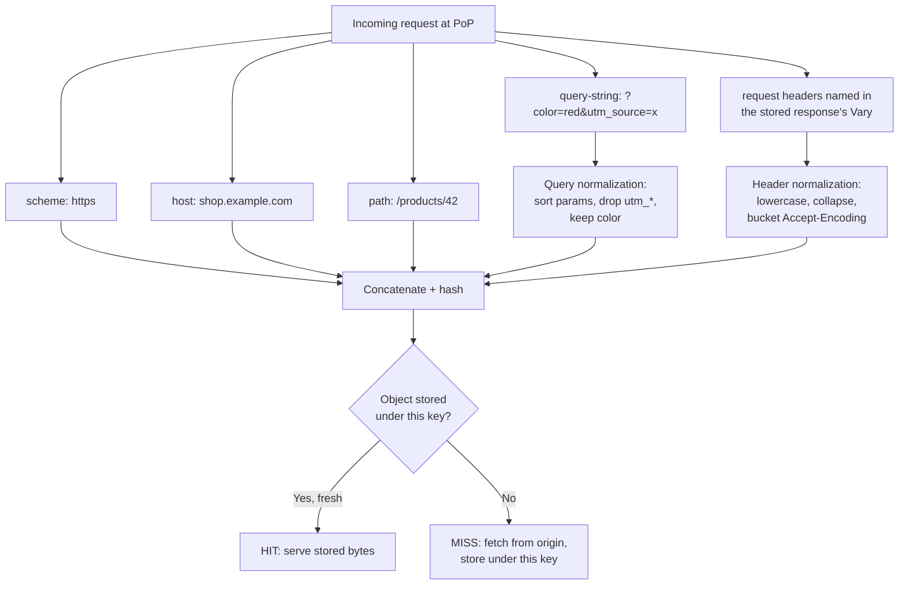
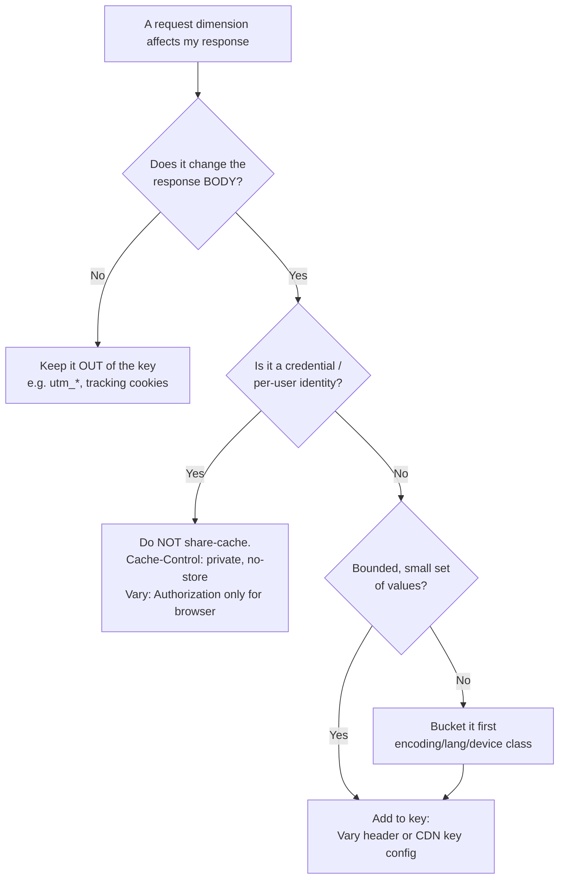

# Cache Keys and Vary

## Quick Summary

A **cache key** is the fingerprint a CDN (or any shared cache) computes for an incoming request and uses to look up a stored response. If two requests produce the same key, they get the same cached bytes — which is exactly what you want for two strangers fetching `/logo.png`, and exactly what ends careers when the two strangers are fetching `/api/me`. The default key on every major CDN is roughly `scheme + host + path + query-string + (the request headers named in the response's Vary header)`. Everything *in* the key partitions the cache; everything *not* in the key is invisible to matching. This page is about controlling that key: how query strings and cookies are handled, how headers get normalized, why [`Vary`](../06-Caching-Headers/Vary.md) is both the sanctioned way to store multiple representations and a hit-ratio-destroying foot-gun, how you customize keys per-CDN, and how an input that affects the response body but is *left out* of the key becomes a cache-poisoning vulnerability. It is a companion to the broader [CDN Caching Overview](./CDN-Caching-Overview.md).

## What problem does the cache key solve?

A cache is a hash map from "request" to "response." But an HTTP request is not a single value — it is a method, a URL, a query string, and dozens of headers, only *some* of which change the response the origin would generate. The cache key is the answer to a single design question: **which parts of the request make two requests equivalent for the purpose of reuse?**

Get the answer too *narrow* (include too little) and you serve wrong content: you cache the brotli-compressed variant under a key that ignores `Accept-Encoding`, then hand those brotli bytes to a client that only speaks gzip, and it renders garbage. Or worse, you cache Alice's authenticated dashboard under a key that ignores `Authorization`, and serve it to Bob.

Get the answer too *wide* (include too much) and your hit ratio collapses: key on the full `User-Agent` string and every browser build gets its own entry, so nothing is ever shared, so the origin melts under a cache that never hits. Key on a `?utm_source=…` param that doesn't change the body and identical content shatters into thousands of distinct entries.

The cache key is the knob that trades **correctness** against **hit ratio**, and getting it right is the core competency of running a CDN.

## Why does the default key look the way it does?

The default — `scheme + host + path + query` — falls straight out of the definition of a URL: the origin generates a response *for a URL*, so the URL is the natural identity of the response. The subtle addition is `Vary`, defined in HTTP/1.1 (RFC 2616, now RFC 9110 §12.5.5). `Vary` exists because a *single* URL can legitimately have *multiple representations* — a gzip version and a brotli version, an English and a French version, a mobile and a desktop render. The origin is the only party that knows which request headers it consulted to pick the representation, so `Vary` is the origin's declaration: "my response for this URL depends on these request headers; cache each combination separately." The cache appends the values of those headers to the key.

Scheme is in the key because an `http://` and `https://` response can differ (and mixing them is a security problem). Host is in the key because one CDN config often fronts many hostnames. Method is implicitly in the key too — a cache stores `GET`/`HEAD` responses and keys on the method, so a `POST` never collides with a `GET`.

## How does it work?

### The composition

At request time the edge assembles the key from components, then hashes them into a lookup token:



The critical mental move: the key is computed from the **request**, but the set of headers that *extend* the key comes from the **stored response's** `Vary`. That is a chicken-and-egg the cache resolves as follows — on the first request (a miss) it fetches from origin, reads `Vary` from the response, and stores the object indexed by the URL plus the values of those `Vary` headers *from that request*. On subsequent requests it must re-derive which headers to consult; caches handle this by remembering the `Vary` set per URL and applying it to the incoming request's headers.

### Browser behavior

The browser's private cache uses the *same* mechanism — URL plus `Vary` headers — but it is a cache of one user, so `Vary: Cookie` or `Vary: Authorization` is harmless there (there is only ever one credential). The browser is where `Vary: Accept-Encoding` matters least (it always sends the same `Accept-Encoding`) and `Vary` on a header it *doesn't* control (like a server-set device class) is irrelevant. The dangers below are almost entirely *shared-cache* dangers.

### CDN behavior

The CDN is a shared cache, so every key decision is a correctness *and* a security decision. Crucially, **CDNs let you override the default key**, and the default may not match what your origin's `Vary` implies. If your origin sends `Vary: Accept-Encoding` but your CDN is configured to compress at the edge and strip `Accept-Encoding` from the key, the two must be reconciled or you serve mismatched encodings. Every major CDN also *ignores* `Vary: Cookie` and `Vary: User-Agent` by default (or refuses to cache), precisely because honoring them would be catastrophic — more on that below.

### Reverse proxy behavior

Nginx builds its key from the `proxy_cache_key` directive (default `$scheme$proxy_host$request_uri`) and honors `Vary` from upstream when deciding variant storage. Varnish exposes the key construction directly in VCL (`vcl_hash`), and it is idiomatic in Varnish to *normalize* `Accept-Encoding` into a small bucket and to explicitly strip cookies before hashing. The lesson from Varnish culture — normalize aggressively, key deliberately — applies to every tier.

## HTTP Request Example

Two requests to the same path that a well-configured CDN should treat as the **same** key (the tracking param is dropped, the meaningful param kept):

```http
GET /products/42?color=red&utm_source=newsletter HTTP/1.1
Host: shop.example.com
Accept-Encoding: br, gzip
```

```http
GET /products/42?color=red&utm_campaign=summer HTTP/1.1
Host: shop.example.com
Accept-Encoding: gzip
```

After query normalization (`color=red` kept, `utm_*` dropped) both share the query component. But note the differing `Accept-Encoding`: if the response carries `Vary: Accept-Encoding`, these become **two** keys (a brotli variant and a gzip variant), which is correct.

## HTTP Response Example

A safe, cacheable response that partitions only on encoding — a small, bounded dimension:

```http
HTTP/1.1 200 OK
Content-Type: application/json; charset=utf-8
Content-Encoding: br
Cache-Control: public, s-maxage=300
Vary: Accept-Encoding
```

A dangerous response — do not do this on a shared cache:

```http
HTTP/1.1 200 OK
Content-Type: text/html; charset=utf-8
Cache-Control: public, s-maxage=300
Vary: Cookie
Set-Cookie: sid=8f3a...; HttpOnly; Secure
```

`Vary: Cookie` means every distinct `Cookie` header value is a separate cache entry. Since the response *sets* a per-session cookie, every user has a unique cookie, so every user gets a unique entry — zero sharing, and personalized content sitting in a shared cache waiting for a key collision to leak it. The `public` here should be `private, no-store`.

## Express.js Example

Setting `Vary` correctly is the origin's job, and it is easy to get wrong because Express `res.vary()` *appends* rather than replaces. Here is a production pattern that varies on the small, bounded dimensions and refuses to leak on the dangerous ones:

```js
const express = require('express');
const compression = require('compression');
const app = express();

// compression middleware negotiates gzip/br from Accept-Encoding AND
// automatically appends `Vary: Accept-Encoding` — because the response body
// now depends on that request header. Without this Vary, a shared cache could
// serve brotli bytes to a gzip-only client. Never remove it while compressing.
app.use(compression());

// Public catalog endpoint: cacheable at the edge, partitioned ONLY by encoding.
app.get('/api/products/:id', async (req, res) => {
  const product = await db.getProduct(req.params.id);

  res.set('Cache-Control', 'public, s-maxage=300, stale-while-revalidate=60');
  // res.vary() appends 'Accept-Encoding' to any existing Vary. It is idempotent
  // and case-insensitive, so calling it alongside compression() is safe.
  // We deliberately do NOT vary on Cookie/Authorization here because this data
  // is identical for every user — varying would destroy the hit ratio.
  res.vary('Accept-Encoding');
  res.json(product);
});

// Authenticated endpoint: the response depends on WHO is asking. The correct
// answer is NOT `Vary: Authorization` on a shared cache (that still stores the
// object, just keyed per-credential — one config slip and it leaks). The correct
// answer is to keep it out of the shared cache entirely.
app.get('/api/me', requireAuth, (req, res) => {
  res.set('Cache-Control', 'private, no-store'); // never enters a shared cache
  // If you WANT per-user browser caching, use `private, no-cache` + ETag and
  // `Vary: Authorization` — private confines it to the browser, where Vary on a
  // credential is harmless because the browser holds one user's credential.
  res.json(req.user.profile);
});

// Content negotiation done right: a small, enumerable set of values.
app.get('/api/report', (req, res) => {
  const wantsCsv = req.accepts(['json', 'csv']) === 'csv';
  res.set('Cache-Control', 'public, s-maxage=600');
  res.vary('Accept'); // Accept has a bounded set here (json|csv) -> at most 2 entries.
  if (wantsCsv) return res.type('text/csv').send(toCsv(data));
  res.json(data);
});

app.listen(3000);
```

The load-bearing decisions: `res.vary('Accept-Encoding')` is mandatory whenever you compress; `Vary: Authorization` belongs only on `private` responses; and content-negotiation `Vary` (`Accept`) is safe only because its value space is tiny.

## Node.js Example

Raw `http` gives you nothing automatically — no `Vary`, no compression negotiation — so the discipline is explicit. This snippet shows how to *normalize* `Accept-Encoding` into a bucket before it ever influences behavior, mirroring what a good CDN key does:

```js
const http = require('http');
const zlib = require('zlib');

function normalizeEncoding(header = '') {
  // Collapse the messy real-world Accept-Encoding into a 3-value bucket.
  // Without this, "br, gzip", "gzip, br", "br;q=1.0, gzip;q=0.8" would each be
  // a distinct cache dimension despite meaning the same thing to us.
  if (/\bbr\b/.test(header)) return 'br';
  if (/\bgzip\b/.test(header)) return 'gzip';
  return 'identity';
}

http.createServer((req, res) => {
  if (req.url === '/data') {
    const body = JSON.stringify({ ok: true, ts: Date.now() });
    const enc = normalizeEncoding(req.headers['accept-encoding']);

    res.setHeader('Cache-Control', 'public, s-maxage=120');
    res.setHeader('Content-Type', 'application/json');
    // Advertise the exact dimension the body depends on. Because we bucketed
    // encoding into {br,gzip,identity}, a downstream cache keying on
    // Accept-Encoding still only ever stores 3 variants, not N.
    res.setHeader('Vary', 'Accept-Encoding');

    if (enc === 'br') {
      res.setHeader('Content-Encoding', 'br');
      return res.end(zlib.brotliCompressSync(body));
    }
    if (enc === 'gzip') {
      res.setHeader('Content-Encoding', 'gzip');
      return res.end(zlib.gzipSync(body));
    }
    return res.end(body);
  }
  res.statusCode = 404;
  res.end();
}).listen(3000);
```

The contrast with Express: nothing appends `Vary` for you, so a forgotten `setHeader('Vary', …)` here silently ships mismatched encodings the moment a shared cache is involved.

## React Example

React never sets a cache key or `Vary` — it has no access to response headers. Its relationship is entirely *indirect* and shows up in two ways that matter for keys:

1. **Cache-busting via hashed filenames** is the client-side half of key design. Vite/webpack emit `app.9f2a1c.js`; the hash *is* the version, so the URL (and thus the cache key) changes when content changes. This is why hashed assets need no `Vary` and no purge — a new build is a new key. See [CDN Caching Overview](./CDN-Caching-Overview.md).

2. **Query params in data fetches pollute the key.** A React app that appends a cache-buster or analytics param to every request can shatter the CDN's hit ratio:

```jsx
// BAD: a per-render timestamp makes every request a unique cache key -> 0% hit.
fetch(`/api/products/${id}?t=${Date.now()}`);

// GOOD: stable URL. If you need to force freshness, use the request cache mode,
// which maps to Cache-Control request directives WITHOUT changing the key.
fetch(`/api/products/${id}`, { cache: 'no-cache' });
```

If React genuinely needs a cache-buster (rare — prefer purge or hashed URLs), pick a param the CDN is configured to *keep in the key deliberately*, not a random one that fragments every response.

## Browser Lifecycle

1. **Request initiated.** The browser computes its own cache key: the URL plus the values of any `Vary` headers from the stored response for that URL.
2. **Variant match.** If a stored response exists but the request's `Vary` headers don't match the stored variant's, it is a miss — the browser fetches a fresh representation.
3. **`Vary: *`** makes the response effectively uncacheable in the browser (no request can ever match), same as at the edge.
4. **Encoding.** The browser always sends a consistent `Accept-Encoding`, so `Vary: Accept-Encoding` rarely causes browser-side misses; it exists for the shared caches downstream.
5. **Reload.** Reloads change request `Cache-Control` (adding `max-age=0`/`no-cache`) but do **not** change the cache key — the key is about identity, not freshness.

## Production Use Cases

- **Compression variants:** `Vary: Accept-Encoding` — the one `Vary` almost every cacheable text response should carry. Bounded to ~3 values.
- **Language negotiation:** `Vary: Accept-Language` on a site that server-renders localized HTML — acceptable *if* you normalize to your supported locale set (e.g., collapse `en-US`, `en-GB` → `en`); dangerous if you key on the raw header (dozens of variants).
- **Device-class rendering:** set your *own* `X-Device-Class: mobile|desktop` header at the edge from a User-Agent classifier, and `Vary: X-Device-Class`. This gives you 2 variants instead of the infinite cardinality of `Vary: User-Agent`.
- **Dropping tracking params:** configure the CDN key to ignore `utm_*`, `fbclid`, `gclid` — these never change the body and otherwise fragment the cache.
- **API versioning by path, not query:** `/v2/products` is a clean key; `/products?v=2` works but relies on the CDN keeping `v` in the key.

## Common Mistakes

- **`Vary: Cookie` on a shared cache.** Every user has a unique cookie → zero sharing and a personalization-leak risk. Almost never correct at the edge; use `private`/`no-store` instead.
- **`Vary: User-Agent`.** Effectively infinite cardinality. Collapses hit ratio to ~0. Normalize to a device-class header instead.
- **`Vary: *`.** Tells caches the response varies on *unspecified* request aspects → uncacheable everywhere. Occasionally used deliberately to prevent caching, but `no-store` is clearer.
- **Compressing without `Vary: Accept-Encoding`.** A shared cache stores the first variant it sees (say brotli) and serves it to a gzip-only client → decode failure. Silent until a specific client hits it.
- **Cache-busting with random query params.** `?t=Date.now()` guarantees 0% hit ratio if the CDN keys on query. Use hashed filenames or purge instead.
- **Assuming the CDN key equals the origin's `Vary`.** CDNs normalize and override keys; a `Vary` the origin sends may be ignored (Cookie/User-Agent) or the key may include params the origin doesn't consult. Always verify the *effective* key in the CDN config.
- **Forgetting `res.vary()` appends.** In Express, calling it multiple times accumulates headers; calling `res.set('Vary', …)` replaces and can wipe the `Accept-Encoding` that compression added.

## Security Considerations

- **Cache key correctness is a security control.** The single most dangerous key mistake is leaving `Authorization`/session cookie out of the key on a `public`, cacheable authenticated response — the first user's private data is served to everyone. The fix is `private, no-store`, not `Vary: Authorization` (see [CDN Caching Overview](./CDN-Caching-Overview.md)).
- **Cache poisoning via unkeyed inputs.** This is the flip side of the key. If the response *body or headers* reflect a request input that is **not in the cache key**, an attacker sends one poisoned request, the malformed response is cached under the normal key, and every subsequent user is served the poison. Classic vectors:
  - **Unkeyed headers reflected into the body/headers.** Frameworks that trust `X-Forwarded-Host` to build absolute URLs (e.g., in `<link>`, `Location`, or password-reset emails) let an attacker set `X-Forwarded-Host: evil.com`; if that header isn't in the key, the poisoned absolute URL is cached for all. This is the canonical [web cache poisoning](https://portswigger.net/research/practical-web-cache-poisoning) attack.
  - **Unkeyed query params reflected into HTML.** If `?lang=…` is echoed into the page but the CDN strips it from the key, an injected value gets cached and served to everyone.
  - **Cache-key normalization attacks.** If the CDN normalizes the key more aggressively than the origin normalizes the input (e.g., CDN ignores a trailing param the origin acts on), attacker input reaches the origin without changing the key.
- **The defensive rule:** *every* request input that can influence the response must either be **in the cache key** (via `Vary` or CDN key config) or **not reflected** into the response at all. Never reflect an untrusted header (`X-Forwarded-Host`, `X-Forwarded-For`, arbitrary `X-*`) into a cacheable response.
- **`Vary` header injection.** If an attacker can influence the `Vary` value your origin emits, they can control cache partitioning — treat `Vary` as a trusted, statically-defined value, never built from user input.

## Performance Considerations

- **Hit ratio is a direct function of key cardinality.** Every dimension you add to the key multiplies the number of entries and divides the reuse. Add only dimensions that genuinely change the body.
- **Query normalization is often the single biggest hit-ratio win.** Sorting params and dropping `utm_*`/`fbclid` on a marketing-heavy site can take hit ratio from 40% to 95% overnight.
- **Bucket high-cardinality dimensions.** Never key on raw `Accept-Encoding`, `Accept-Language`, or `User-Agent`; collapse each into a handful of buckets (encoding: br/gzip/identity; language: your supported locales; device: mobile/desktop).
- **Vary and origin shield interact.** With a two-tier CDN (edge + shield), a high-cardinality `Vary` fragments *both* tiers, so a bad `Vary` hurts even more.
- **Cache key size has a cost** on some CDNs (very long query strings), but it is negligible next to cardinality.

## Reverse Proxy Considerations

Nginx: the key is `proxy_cache_key`, and you should normalize before it is computed. Nginx honors upstream `Vary` for variant storage but you can neutralize a dangerous one:

```nginx
map $http_accept_encoding $enc_bucket {
    default        "";
    "~*\bbr\b"     "br";
    "~*\bgzip\b"   "gzip";
}

server {
  location /api/ {
    proxy_pass http://app_upstream;
    proxy_cache app_cache;

    # Deterministic key: scheme + host + path + normalized query is your job to
    # curate. Here we key on the bucketed encoding instead of the raw header, so
    # upstream `Vary: Accept-Encoding` never explodes into N variants.
    proxy_cache_key "$scheme$host$uri$is_args$args|$enc_bucket";

    # A `Vary: Cookie`/`Vary: User-Agent` from upstream would make Nginx store a
    # variant per value. Neutralize it so a mistake upstream can't wreck the key:
    proxy_ignore_headers Vary;   # use with care: now YOU own all partitioning.

    add_header X-Cache-Status $upstream_cache_status;
  }
}
```

`proxy_ignore_headers Vary` is powerful and dangerous: it means Nginx no longer partitions by any upstream `Vary`, so *you* must guarantee the key covers every dimension that matters (here, encoding, via the bucket). Varnish's `vcl_hash`/`vcl_backend_response` give the same control with more precision — normalizing `Accept-Encoding` and stripping cookies in VCL is textbook.

## CDN Considerations

- **Cloudflare:** default key is host + path + query. Cookies are *not* in the key, but a matching cookie/`Set-Cookie` can make a response `BYPASS`/uncacheable. "Cache Key" rules (Enterprise) and Cache Rules let you sort/ignore query params, include specific cookies/headers, and separate device types. Cloudflare **ignores `Vary` for anything except `Accept-Encoding`** by default — a critical safety default that neuters `Vary: Cookie`/`Vary: User-Agent`.
- **Fastly:** the key is fully programmable in VCL (`req.hash`). Idiomatic Fastly normalizes `Accept-Encoding` and manages variants with `Vary` explicitly. Fastly honors `Vary` broadly, so *you* must avoid high-cardinality values.
- **CloudFront:** the key is defined by a **Cache Policy** — you explicitly list which query strings, headers, and cookies are included. Nothing is in the key unless you add it, which is safe-by-default but means you must remember to add `Accept-Encoding` (or enable CloudFront's automatic compression, which handles it).
- **Akamai:** cache key customization via "Cache Key Query Parameters" and rules; supports its own `Edge-Cache-Tag` for purge.
- **Universal rule:** the CDN's *effective* key can differ from your origin's `Vary`. Always confirm both agree on every response-affecting dimension.

## Cloud Deployment Considerations

- **API Gateways** often have their *own* response cache with a *separately configured* key (AWS API Gateway keys on method + path + configured "cache key parameters"). An API Gateway that caches an authenticated response because its key omits the auth token is the same leak as at the CDN — configure it to key on the token or disable caching for authenticated routes.
- **Managed platforms (Vercel/Netlify)** derive the key from the URL and honor `Vary` for edge caching; hashed asset URLs plus a normalized key are the norm.
- **Multi-tier stacking (Browser → CDN → API Gateway → App):** each tier can have a *different* key. A dimension keyed at the CDN but not at the gateway (or vice versa) creates a seam where wrong content can be served. Align keys across tiers for any response whose correctness depends on a request dimension.

## Debugging

- **Chrome DevTools → Network:** compare two requests you expect to share a key; if one is `(disk cache)` and the other hits the network with identical URLs, a `Vary` header is partitioning them — check the response `Vary` and the differing request header.
- **curl:** vary one dimension at a time. `curl -sD - -o /dev/null -H 'Accept-Encoding: gzip' URL` then again with `br` and compare `CF-Cache-Status`/`Age`/`X-Cache`. If dropping a `utm_*` param changes `HIT`→`MISS`, the CDN is keying on it.
- **Confirm normalization:** request `/x?a=1&b=2` and `/x?b=2&a=1`; a well-configured CDN returns the same cached object (same `Age`) for both.
- **Postman / Bruno:** script assertions on `res.headers['vary']` to catch a missing or dangerous `Vary` in CI.
- **Node/Express logging:** log `res.getHeader('vary')` and the incoming `req.headers` you vary on, on `res.on('finish')`, to confirm what dimensions you actually emitted.
- **CDN dashboards:** Cloudflare/Fastly/CloudFront all expose per-URL hit ratio; a sudden drop usually means a new key dimension (a new `Vary`, or a param that started fragmenting).

## Best Practices

- [ ] Always send `Vary: Accept-Encoding` on any compressed, cacheable response.
- [ ] Never send `Vary: Cookie`, `Vary: User-Agent`, or `Vary: *` on a shared cache.
- [ ] Bucket high-cardinality dimensions (encoding, language, device) into a handful of values before they touch the key.
- [ ] Normalize query strings at the CDN: sort params, drop `utm_*`/`fbclid`/`gclid`.
- [ ] Keep authenticated responses out of the shared cache with `private, no-store` rather than partitioning them with `Vary: Authorization`.
- [ ] Never reflect an untrusted request input (`X-Forwarded-Host`, arbitrary headers, echoed params) into a cacheable response unless that input is in the cache key.
- [ ] Confirm the CDN's *effective* cache key matches your origin's `Vary` for every response-affecting dimension.
- [ ] Treat `Vary` as a static, trusted value — never build it from user input.
- [ ] Verify with `curl` that param-order and `utm_*` variations return the same cached object.

## Related Headers

- [Vary](../06-Caching-Headers/Vary.md) — the origin's declaration of which request headers extend the cache key; the subject of half this page.
- [Cache-Control](../06-Caching-Headers/Cache-Control.md) — decides *whether* and *how long* to cache; the key decides *under what identity*. `private`/`no-store` is the correct alternative to keying on credentials.
- [Content-Encoding](../10-Compression/Content-Encoding.md) and [Accept-Encoding](../03-Request-Headers/Accept-Encoding.md) — the archetypal keyed dimension via `Vary: Accept-Encoding`.
- [Set-Cookie](../08-Cookies/Set-Cookie.md) and [Cookie](../08-Cookies/Cookie.md) — cookies are not in the default key but signal personalization; their presence often forces a bypass.
- [Age](../06-Caching-Headers/Age.md) — comparing `Age` across requests reveals whether two requests hit the same keyed object.
- [CDN Caching Overview](./CDN-Caching-Overview.md), [Cloudflare Headers](./Cloudflare-Headers.md), and [CDN Debugging Headers](./CDN-Debugging-Headers.md).

## Decision Tree



## Mental Model

Think of the cache key as the **catalog number** in a chain of lending libraries. Two patrons who ask for the same catalog number get the same book off the shelf — perfect for a paperback everyone reads, disastrous if the "book" is one patron's diary. The URL is the base catalog number. `Vary` is the librarian's note that a title has *editions* — "large-print" and "standard" get sub-numbers so a large-print reader never gets standard type. The art is choosing sub-numbers wisely: split by *edition* (`Accept-Encoding`, a locale) and the shelf stays tidy; split by *the reader's name* (`User-Agent`, `Cookie`) and you print a unique copy per patron, the shelves overflow, and nothing is ever shared. And the security nightmare — **cache poisoning** — is a patron who slips a forged page into the book *before* it's catalogued: because the forged content rides in under the normal catalog number, every future reader checks out the poisoned copy. The defense is the same discipline both ways: nothing may influence what's on the page unless it's reflected in the catalog number.
