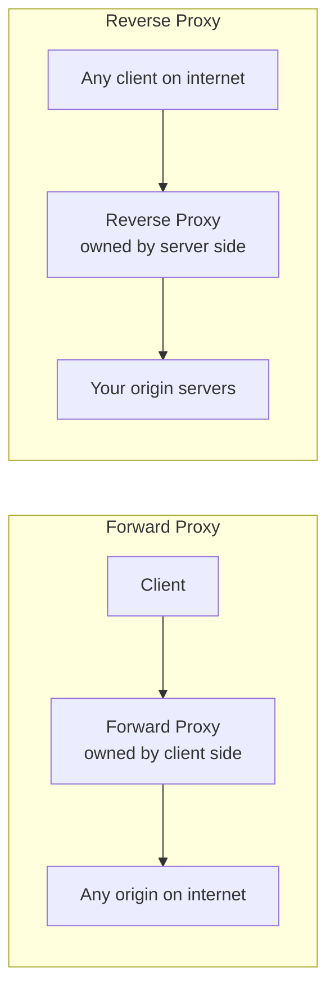
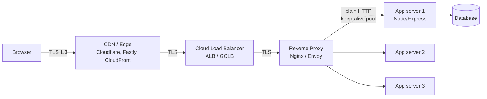
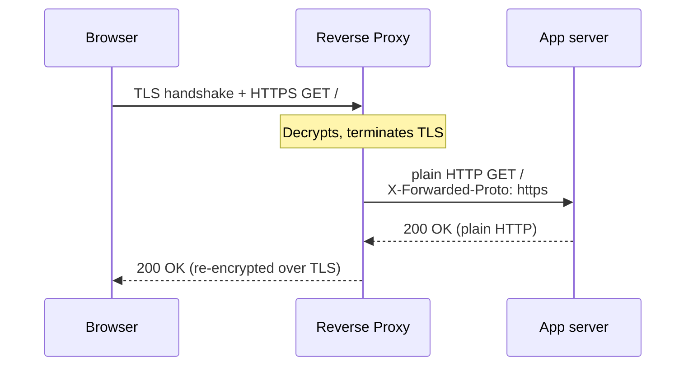
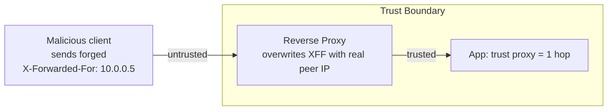
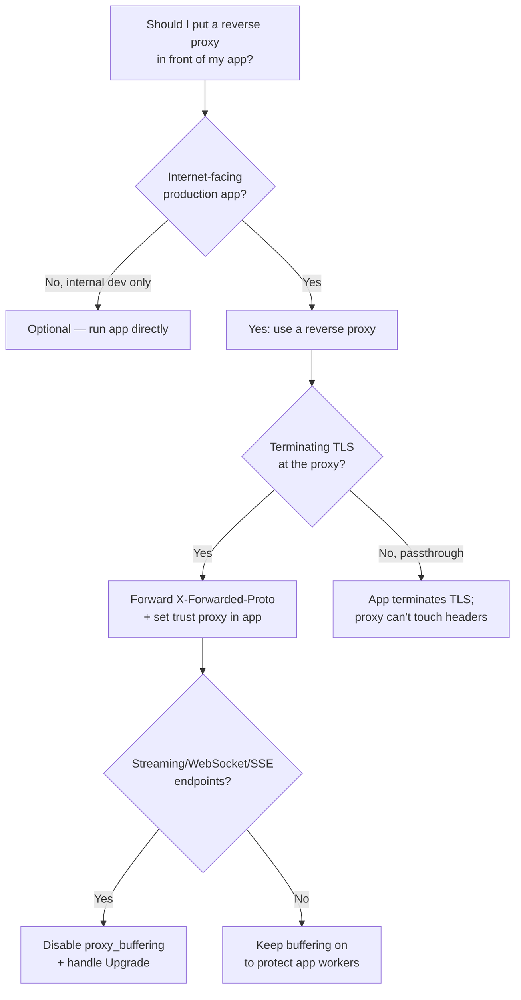

# Reverse Proxy Overview

## Quick Summary

A **reverse proxy** is a server that sits *in front of* one or more origin (application) servers and accepts client connections on their behalf. To the browser it looks like the origin — it terminates the TCP/TLS connection, speaks HTTP, and returns a response. To your app it looks like the client — it opens a fresh upstream connection and forwards the request. Nginx, HAProxy, Envoy, Traefik, and cloud load balancers (ALB, GCLB) are reverse proxies. Because it interposes on every request and response, the reverse proxy becomes the single most important place in your stack for **header manipulation**: it terminates TLS (so it must tell the app the connection *was* HTTPS via [`X-Forwarded-Proto`](./Nginx-Header-Handling.md)), it hides the client's real IP behind its own socket (so it must forward it via [`X-Forwarded-For`](../14-Proxies/X-Forwarded-For.md)), it rewrites the [`Host`](../03-Request-Headers/Host.md), it strips hop-by-hop headers, it can add security headers, buffer bodies, compress responses, and cache. It is also the stack's **trust boundary**: everything the app believes about "who the client is" and "was this secure" is only as trustworthy as what the reverse proxy sets.

## What problem does this reverse proxy solve?

Exposing an application server directly to the internet is a bad idea in production for a dozen reasons, and the reverse proxy solves all of them in one place:

- **TLS is expensive and fiddly.** You do not want your Node process managing certificates, OCSP stapling, cipher suites, and TLS handshakes for every connection. Terminate TLS once at the proxy.
- **App servers are slow with many idle/slow connections.** A single Node event loop or a pool of app workers should not be tied up feeding bytes to a client on a 3G phone. The proxy buffers, so the app answers fast and moves on.
- **You have more than one app server.** The proxy load-balances across a pool, health-checks them, and drains them for deploys — the client sees one stable endpoint.
- **The app must not trust the raw network.** The proxy is a controlled choke point where you normalize headers, strip dangerous client-supplied ones, add security headers, and enforce limits.
- **One hostname, many services.** Path- and host-based routing (`/api` → service A, `/` → the SPA, `admin.example.com` → service B) lives at the proxy, not baked into each app.
- **Static assets, compression, and caching** are better done at the edge of your own infrastructure than inside application code.

The core problem it solves is **decoupling the public-facing HTTP contract from the internal topology**, while giving you a single, auditable place to control every header that crosses the boundary.

## Reverse proxy vs forward proxy

These share the word "proxy" and almost nothing else. The direction of trust and who they represent is inverted.

- A **forward proxy** sits in front of *clients* and represents *them* to the wider internet. A corporate egress proxy, an ISP proxy, or a developer's `HTTP_PROXY` are forward proxies. The client is configured to use it; the origin server has no idea it exists (it just sees the proxy's IP). It exists to serve the client side: egress filtering, caching, anonymity, access control. See [Proxies Overview](../14-Proxies/Proxies-Overview.md).
- A **reverse proxy** sits in front of *servers* and represents *them* to clients. The client has no idea it exists — it thinks it is talking to the origin. It is configured and owned by the *server operator*. It exists to serve the origin side: TLS termination, load balancing, caching, security.



A useful one-liner: a **forward proxy hides the client from the server; a reverse proxy hides the server from the client.** Both intercept and can rewrite headers, but the reverse proxy is the one *you* operate and are responsible for.

## Where a reverse proxy sits

In a modern production stack a request typically crosses several hops, and the reverse proxy is usually the last shared, operator-owned hop before your application code:



Each hop is a shared cache/relay that can add to the `X-Forwarded-*` chain. The critical consequence: **by the time a request reaches your Express app, the TCP peer is the reverse proxy, not the browser.** `req.socket.remoteAddress` is the proxy's IP; the connection is plain HTTP; the `Host` may have been rewritten. Everything your app knows about the *real* client comes from headers the proxy chose to set — which is exactly why those headers, and their trustworthiness, matter so much.

## TLS termination

The dominant pattern is **TLS termination at the edge**: the client's HTTPS connection ends at the CDN or reverse proxy, which decrypts, and the proxy then talks **plain HTTP** to the app over a trusted private network.



This is efficient (one place manages certs, app avoids crypto cost) but it creates a specific, dangerous information loss: **the app cannot tell that the original request was HTTPS.** From the app's socket it sees plain HTTP on port 80/3000. If the app makes security decisions based on "is this secure?" — setting `Secure` cookies, issuing HSTS, deciding whether to redirect to HTTPS — it will get them wrong unless the proxy explicitly tells it via [`X-Forwarded-Proto: https`](./Nginx-Header-Handling.md). This is why Express's `app.set('trust proxy', ...)` exists: it makes `req.protocol`, `req.secure`, and `req.ip` read the forwarded headers instead of the raw socket.

Two variants exist:
- **TLS passthrough** — the proxy forwards encrypted bytes without decrypting (L4). It cannot read or modify headers at all; used when the app must terminate TLS itself (e.g., mTLS to the app).
- **TLS re-encryption / end-to-end TLS** — the proxy terminates the client TLS *and* opens a new TLS connection to the app. Common in zero-trust internal networks. Header handling is identical to termination; only the upstream leg is encrypted.

## Header responsibilities

The reverse proxy is where the request's identity is reconstructed for the app. Its header duties fall into four groups:

**1. Reconstruct the lost client context.** Because the app sees the *proxy's* connection, the proxy must forward:
- [`X-Forwarded-For`](../14-Proxies/X-Forwarded-For.md) — the original client IP (and the chain of proxies). The modern standard is the [`Forwarded`](../14-Proxies/Proxies-Overview.md) header (RFC 7239), but `X-Forwarded-For` remains dominant.
- `X-Forwarded-Proto` — `http` or `https`, so the app knows the original scheme after TLS termination.
- `X-Forwarded-Host` / `X-Forwarded-Port` — the `Host` and port the client originally requested, if the proxy rewrites `Host`.
- `X-Real-IP` — an Nginx convention carrying just the single client IP.

**2. Rewrite `Host` for upstream routing.** The proxy often changes the `Host` header sent upstream (e.g., to a fixed internal name), which is why it must preserve the original in `X-Forwarded-Host` if the app needs it for absolute URL generation.

**3. Strip hop-by-hop headers.** `Connection`, `Keep-Alive`, `Transfer-Encoding`, `TE`, `Upgrade`, `Trailer`, `Proxy-Authorization`, and any header listed in the `Connection` header are *connection-scoped* and must not be blindly forwarded. Failing to handle these correctly is a source of request smuggling and broken keep-alive.

**4. Add/hide response headers.** The proxy can inject security headers (`Strict-Transport-Security`, `X-Content-Type-Options`), hide leaky upstream headers (`Server`, `X-Powered-By`), and rewrite `Location` on redirects (`proxy_redirect`).

See [Nginx Header Handling](./Nginx-Header-Handling.md) for the exact directives and [Header Rewriting Pitfalls](./Header-Rewriting-Pitfalls.md) for the ways this goes wrong.

## Buffering

By default Nginx **buffers**: it reads the entire response from the upstream app as fast as the app can produce it, stores it (in memory, spilling to disk for large bodies), then feeds it to the client at the client's pace. This is a deliberate and important design.

- **Why buffer responses:** a slow client (mobile, high-latency) would otherwise hold your app worker busy for the whole download. With buffering, the app worker is freed the instant the proxy has the bytes; the proxy — which is built to babysit thousands of slow sockets cheaply — handles the trickle. This protects a limited pool of expensive app workers from "slowloris"-style resource exhaustion.
- **Request buffering** (`proxy_request_buffering`) does the same for uploads: Nginx reads the whole request body before opening the upstream connection, so the app is not tied up receiving a slow upload.
- **When buffering hurts:** streaming responses. Server-Sent Events, long-poll, chunked progress streams, and WebSocket upgrades must *not* be buffered or the client sees nothing until the stream ends. You disable it per-location with `proxy_buffering off;` (and set `X-Accel-Buffering: no` from the app to signal Nginx per-response).

Buffering interacts with headers: while buffering, Nginx may recompute `Content-Length`, and it controls whether `Transfer-Encoding: chunked` is preserved. A streaming endpoint that emits `Transfer-Encoding: chunked` but is buffered by the proxy will be collected and re-sent with a `Content-Length`, silently defeating the stream.

## The trust boundary

This is the single most important security concept for reverse proxies. **`X-Forwarded-For`, `X-Forwarded-Proto`, and friends are just request headers — any client can send them.** A request arriving at your reverse proxy might already contain a forged `X-Forwarded-For: 1.2.3.4` that a malicious client typed in to impersonate another IP, bypass an IP allowlist, or poison your logs.

The rule: **a header is trustworthy only if it was set by a hop you control.** The reverse proxy must therefore *overwrite* (not append to) client-supplied trust headers for direct clients, and only *append* when the immediately-upstream hop is a proxy you trust (like your CDN). Everything downstream of the boundary trusts the boundary; nothing trusts the raw internet.



In Express this is codified by `app.set('trust proxy', n)` — you tell it *how many* proxy hops in front of it are trusted, so it reads the correct entry from the `X-Forwarded-For` chain and ignores the forgeable prefix. Set it too permissively (`trust proxy: true` when directly internet-facing) and an attacker controls `req.ip`; set it wrong and rate-limiters, geo-blocks, and audit logs all key off an attacker-supplied value. The [X-Forwarded-For](../14-Proxies/X-Forwarded-For.md) page covers the exact indexing rules.

## Express.js Example

The app-side half of living behind a reverse proxy is configuring trust correctly, then reading the reconstructed context.

```js
const express = require('express');
const app = express();

// Tell Express EXACTLY how many trusted proxy hops sit in front of it.
// If your topology is Browser -> CDN -> Nginx -> app, and both CDN and Nginx
// append to X-Forwarded-For, that's 2 trusted hops.
// - `1` means "trust the last 1 entry from the right of X-Forwarded-For".
// - NEVER use `true` (trust all) when internet-facing: it trusts a forged chain.
app.set('trust proxy', 1);
// With this set correctly:
//   req.ip           -> the real client IP (from XFF, not the Nginx socket IP)
//   req.protocol     -> 'https' (from X-Forwarded-Proto), even though the
//                       upstream connection to us is plain HTTP
//   req.secure       -> true, so `Secure` cookies and HTTPS-only logic work
//   req.hostname     -> derived from X-Forwarded-Host / Host correctly
// Remove this line and req.ip becomes the proxy's private IP, req.secure is
// false, every user shares one "IP" for rate-limiting, and Secure cookies break.

app.use((req, res, next) => {
  // These now reflect the ORIGINAL client, reconstructed from forwarded headers.
  console.log({
    ip: req.ip,                 // real client, used for rate limiting / audit
    proto: req.protocol,        // 'https' after TLS termination upstream
    secure: req.secure,         // gate Secure/SameSite cookie flags on this
    host: req.hostname,         // for building absolute redirect URLs
    xff: req.headers['x-forwarded-for'], // the raw chain, for debugging
  });
  next();
});

// A redirect that MUST target the public HTTPS URL, not the internal http one.
app.get('/dashboard', requireAuth, (req, res) => {
  // Because trust proxy is set, req.protocol is 'https' -> this builds
  // https://app.example.com/... not http://internal-host/...
  res.redirect(`${req.protocol}://${req.get('host')}/dashboard/home`);
});

// Only mark cookies Secure when the ORIGINAL request was HTTPS. Without trust
// proxy, req.secure is false behind a TLS-terminating proxy and the cookie is
// never sent the flag -> it can leak over plain HTTP.
app.get('/login', (req, res) => {
  res.cookie('sid', issueSession(), {
    httpOnly: true,
    secure: req.secure,   // correct only because trust proxy reads X-Forwarded-Proto
    sameSite: 'lax',
  });
  res.sendStatus(204);
});

app.listen(3000); // plain HTTP on a private port; Nginx terminates TLS in front.
```

The whole point: the app runs plain HTTP on a private port and delegates every question of "who is the client / was this secure / what host did they ask for" to the trusted proxy via forwarded headers, wired up by `trust proxy`.

## Node.js Example

Without Express, nothing parses forwarded headers for you — you must do the trust logic by hand, which makes the security stakes explicit:

```js
const http = require('http');

const TRUSTED_HOPS = 1; // number of proxies we control, nearest to us

http.createServer((req, res) => {
  // req.socket.remoteAddress is ALWAYS the proxy's IP behind a reverse proxy.
  const socketIp = req.socket.remoteAddress;

  // X-Forwarded-For is "client, proxy1, proxy2" (left = original, right = nearest).
  // To find the real client we must strip the entries added by hops we DON'T trust.
  const xff = (req.headers['x-forwarded-for'] || '')
    .split(',')
    .map(s => s.trim())
    .filter(Boolean);

  // Take the entry TRUSTED_HOPS from the right end. Everything to its left is
  // client-supplied and forgeable; we must not trust it for security decisions.
  const clientIp = xff.length >= TRUSTED_HOPS
    ? xff[xff.length - TRUSTED_HOPS]
    : socketIp;

  // Scheme was lost at TLS termination; reconstruct from the trusted proxy header.
  const proto = req.headers['x-forwarded-proto'] || 'http';
  const isSecure = proto === 'https';

  res.setHeader('Content-Type', 'application/json');
  res.end(JSON.stringify({ clientIp, proto, isSecure, socketIp }));
}).listen(3000);
```

This is exactly the logic `trust proxy` encapsulates. Getting the index wrong — taking `xff[0]` instead of counting from the right — is the classic bug that lets a client spoof its IP by prepending a value.

## Production Use Cases

- **TLS termination + HTTP/2 to browsers, HTTP/1.1 to a legacy app.** The proxy speaks modern protocols to clients and downgrades to what the app supports.
- **Blue/green and canary deploys.** The proxy shifts traffic between upstream pools with zero client-visible change.
- **Path/host routing to a microservice mesh.** `/api/*` → API service, `/` → SPA static files, `assets.example.com` → object storage.
- **A security choke point.** Strip `Server`/`X-Powered-By`, inject HSTS/CSP, enforce request size limits and rate limits before traffic reaches app code.
- **Absorbing slow clients and uploads** via buffering, protecting a small pool of expensive app workers.
- **Terminating WebSockets/SSE** with correct `Upgrade` handling and buffering disabled.

## Common Mistakes

- **App directly internet-facing but configured as if behind a proxy** (`trust proxy: true`) — an attacker sets `X-Forwarded-For` and controls `req.ip`, defeating rate limits and IP allowlists.
- **Behind a proxy but `trust proxy` unset** — `req.secure` is false, `Secure` cookies never get their flag, and HTTPS redirects loop forever (app thinks it's HTTP, redirects to HTTPS, proxy terminates TLS, app sees HTTP again → infinite redirect).
- **Appending to `X-Forwarded-For` from untrusted clients** instead of overwriting at the boundary — poisons the chain.
- **Buffering a streaming endpoint** — SSE/long-poll appear frozen because the proxy holds the whole response.
- **Forwarding hop-by-hop headers verbatim** — breaks keep-alive and can enable request smuggling.

## Security Considerations

- **The trust boundary is everything.** Only trust forwarded headers set by hops you own. Overwrite forgeable client trust headers at the outermost proxy you control.
- **Request smuggling** arises when the proxy and the app disagree about where a request ends (conflicting `Content-Length` vs `Transfer-Encoding`). A conformant proxy normalizes these; strip and re-derive framing headers.
- **Header injection / CRLF** — never build a proxied header value from raw client input without validation; a smuggled `\r\n` can inject headers upstream.
- **Information leakage** — hide `Server`, `X-Powered-By`, stack traces, and internal hostnames in `Location` at the proxy.
- **TLS downgrade awareness** — if the app can also be reached directly over plain HTTP internally, an attacker on the private network could bypass the proxy's security headers. Restrict the app's listener to the proxy.

## Performance Considerations

- **Connection reuse.** The proxy maintains a keep-alive pool to upstreams (`upstream { keepalive 64; }`), amortizing TCP/TLS setup and dramatically cutting latency and CPU versus a fresh connection per request.
- **Buffering protects app throughput** by decoupling app worker time from client download time.
- **Compression at the proxy** (`gzip`/`brotli`) offloads CPU from the app and lets you compress responses from apps that don't.
- **Caching at the proxy** (`proxy_cache`) turns repeated dynamic responses into edge-speed hits — see [Cache-Control](../06-Caching-Headers/Cache-Control.md) for how upstream directives drive it.
- **TLS session resumption / HTTP/2 / HTTP/3** are all terminated and optimized at the proxy without touching app code.

## Debugging

- **curl through vs. around the proxy.** `curl -sD - https://public.example.com/health` (through) vs. `curl -sD - http://10.0.0.5:3000/health` (direct to app) reveals exactly which headers the proxy adds, strips, or rewrites.
- **Echo the forwarded headers.** A temporary endpoint returning `req.headers` shows you the real `X-Forwarded-For`/`-Proto`/`-Host` the app receives.
- **Add a debug header at the proxy.** `add_header X-Debug-Client $remote_addr always;` and `add_header X-Debug-Proto $scheme always;` surface what the proxy saw.
- **Chrome DevTools** shows only what the *browser* sent/received (the public side); it cannot see the proxy→app leg — you need server-side logging or curl for that.
- **Express logging.** Log `req.ip`, `req.protocol`, `req.secure`, and `req.headers['x-forwarded-for']` to confirm `trust proxy` is resolving correctly.

## Best Practices

- [ ] Set `trust proxy` to the *exact number* of proxy hops you control — never `true` when internet-facing.
- [ ] Terminate TLS at the edge and forward `X-Forwarded-Proto` so the app knows the original scheme.
- [ ] Overwrite forgeable trust headers at the outermost owned proxy; append only across trusted hops.
- [ ] Strip hop-by-hop headers and re-derive request framing to prevent smuggling.
- [ ] Disable buffering for SSE/streaming/WebSocket locations.
- [ ] Hide `Server`/`X-Powered-By`; inject security headers at the proxy in one place.
- [ ] Restrict the app's listener to the proxy's network so it can't be reached directly.
- [ ] Verify end-to-end by curling both through and around the proxy.

## Related Headers

- [X-Forwarded-For](../14-Proxies/X-Forwarded-For.md) — the reconstructed client IP chain; its trust rules are the reverse-proxy trust boundary in header form.
- [Host](../03-Request-Headers/Host.md) — rewritten upstream; preserved in `X-Forwarded-Host`.
- [Cache-Control](../06-Caching-Headers/Cache-Control.md) — drives `proxy_cache` behavior at the reverse proxy.
- [Nginx Header Handling](./Nginx-Header-Handling.md) — the exact directives that implement all of the above.
- [Header Rewriting Pitfalls](./Header-Rewriting-Pitfalls.md) — how proxy header manipulation goes wrong.
- [Proxies Overview](../14-Proxies/Proxies-Overview.md) — the forward-proxy counterpart and the shared hop-by-hop rules.
- [CDN Caching Overview](../15-CDNs/CDN-Caching-Overview.md) — the tier that usually sits *in front of* the reverse proxy.

## Decision Tree



## Mental Model

Think of the reverse proxy as the **front desk of a large office building**. Visitors (clients) never walk straight into an employee's office (your app server) — they arrive at the lobby, show ID, and the receptionist decides where to route them. The receptionist stamps every visitor pass with the facts the employee will need: *who you really are* (`X-Forwarded-For`), *which entrance you came through* (`X-Forwarded-Proto`), *which company you asked for* (`X-Forwarded-Host`). Employees trust the badge precisely because the front desk — a controlled boundary — issued it; a badge someone printed at home in the street outside means nothing. The receptionist also handles the messy public-facing work (security screening, taking coats, buffering the crowd) so employees can focus on real work, and they scrub the building's internal directory off anything that leaves the lobby. Trust flows outward from the front desk, never inward from the street.
