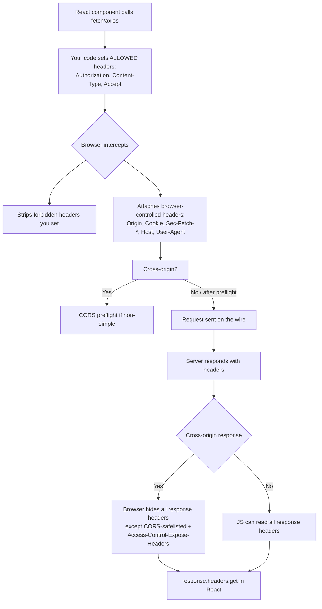

# Headers and React

## Quick Summary

React has **no HTTP layer**. It is a rendering library that produces a DOM; it never opens a socket, never assembles a request line, and never sees a raw response frame. Every header interaction you attribute to "React" is really performed by one of three actors: **the browser** (which sends `Cookie`, `Origin`, `Host`, `Sec-Fetch-*`, `User-Agent`, applies the HTTP cache, enforces CORS, and refuses to let JS set forbidden headers), **your data-fetching code** (`fetch`/`axios`, where you set `Content-Type`, `Authorization`, `Accept`, and read a *subset* of response headers), and — in SSR frameworks like **Next.js** — **the server runtime** (which reads incoming request headers via `headers()`/`cookies()` and sets outgoing response headers via `next.config.js`, middleware, or `Response` objects). This page is the map of who does what, and why React itself is a bystander to almost all of it. If you remember one thing: the browser is a security agent that intentionally hides and locks down headers from your JavaScript, and CORS is what governs which response headers your React code is even *allowed to read*.

## What problem does this header solve?

This is a concept page, not a single header, so the "problem" it addresses is a category confusion that costs teams days of debugging: engineers treat React as if it controls the network. They write `fetch(url, { headers: { Cookie: '...' } })` and wonder why the cookie doesn't stick. They read `response.headers.get('X-Total-Count')` and get `null` even though curl shows the header plainly. They set `credentials: 'include'` against a wildcard CORS origin and get a console error with no body. They cache `index.html` for a year and can't figure out why users are stuck on an old build after deploy. Every one of these is a boundary problem: the boundary between **what your JavaScript may do** and **what the browser reserves for itself as the trusted user agent**. Understanding headers in a React app means understanding exactly where that boundary sits.

## Why was it introduced?

There is no "React header." What exists is a layered contract that predates React by decades: the **Fetch Standard** (WHATWG) defines which request headers JS may set (the "forbidden header names" list) and which response headers CORS exposes; the **Same-Origin Policy** and **CORS** (originally the cross-origin resource sharing spec, now folded into Fetch) define credential and header visibility across origins; **CSP** (Content Security Policy, [../05-Security-Headers/Content-Security-Policy.md](../05-Security-Headers/Content-Security-Policy.md)) governs whether the inline scripts a React bundle sometimes needs are allowed to run. React (2013) and later SSR frameworks (Next.js, Remix) sit *on top* of these primitives. Next.js added a server-side header API (`headers()`, `cookies()`, `next.config.js` `headers()`, and Edge middleware) precisely because on the server there is a real request/response object React-the-library never had access to in the browser.

## How does it work?

The single most important mental split is **request-side** (headers going out) versus **response-side** (headers coming in), each governed by a different set of rules and a different actor.

- **Browser behavior (the trusted agent):** The browser owns a set of **forbidden request headers** your JS may never set — `Host`, `Origin`, `Cookie`, `Referer`, `Content-Length`, `Connection`, `Date`, anything starting with `Sec-` or `Proxy-`, and the `Sec-Fetch-*` metadata headers. If you try to set them via `fetch`/`axios`, the browser silently drops them. The browser *also* attaches these itself based on context (the document's origin, the cookie jar, the request destination). On the response side, the browser enforces CORS: for a cross-origin response, JS can only read a **CORS-safelisted** set of response headers (`Cache-Control`, `Content-Language`, `Content-Type`, `Expires`, `Last-Modified`, `Pragma`) unless the server opts additional headers in via [`Access-Control-Expose-Headers`](../07-CORS/Access-Control-Expose-Headers.md). The browser also applies its HTTP cache to every `fetch`/``/`<script>` per `Cache-Control`.
- **Server behavior:** In a pure SPA, the server is a separate API host that sets CORS headers, `Set-Cookie`, `Cache-Control`, `Content-Type`. In SSR (Next.js), the same Node/Edge process renders React *and* controls request/response headers.
- **Proxy / reverse proxy behavior:** Your static React bundle is typically served by Nginx/CDN, which sets `Cache-Control` on `.js`/`.css` (hashed → immutable) vs `index.html` (revalidate). API calls pass through a reverse proxy that may inject `X-Forwarded-*` and handle CORS.
- **CDN behavior:** Serves the hashed bundle from edge with long TTLs; must *not* aggressively cache `index.html` or authenticated API responses.



## HTTP Request Example

A React SPA on `https://app.example.com` calling its API on `https://api.example.com`. Note which headers your code set versus which the browser added:

```http
GET /api/orders HTTP/2
Host: api.example.com
Accept: application/json
Authorization: Bearer eyJhbGciOi...        ← set by your fetch/axios code
Origin: https://app.example.com            ← browser-controlled, you CANNOT set this
Referer: https://app.example.com/dashboard ← browser-controlled
Cookie: session=abc123                       ← browser-controlled (only if credentials:'include')
Sec-Fetch-Site: cross-site                   ← browser-controlled metadata
Sec-Fetch-Mode: cors                         ← browser-controlled metadata
Sec-Fetch-Dest: empty                        ← browser-controlled metadata
User-Agent: Mozilla/5.0 ...                  ← browser-controlled
```

The lines your JavaScript actually contributed are `Accept` and `Authorization`. Everything marked "browser-controlled" is attached by the user agent from ambient context (the document origin, the cookie jar, the request destination) and cannot be forged from React code — this is a deliberate security property, not a limitation to work around.

## HTTP Response Example

The API's response. The browser decides which of these your React code can read:

```http
HTTP/2 200 OK
Content-Type: application/json                    ← readable (CORS-safelisted)
Cache-Control: private, no-cache                  ← readable (CORS-safelisted)
X-Total-Count: 1394                               ← HIDDEN from JS unless exposed
X-RateLimit-Remaining: 58                         ← HIDDEN from JS unless exposed
Set-Cookie: session=abc123; HttpOnly; Secure      ← NEVER readable by JS (HttpOnly)
Access-Control-Allow-Origin: https://app.example.com
Access-Control-Allow-Credentials: true
Access-Control-Expose-Headers: X-Total-Count, X-RateLimit-Remaining
```

Because of the `Access-Control-Expose-Headers` line, `response.headers.get('X-Total-Count')` now returns `"1394"` in your React code. Remove that line and it returns `null` — the header still arrives over the wire (you'll see it in DevTools) but the browser refuses to hand it to JavaScript. `Set-Cookie` is never visible to JS regardless, because it is `HttpOnly` and because `Set-Cookie` is a forbidden *response* header for the Fetch API.

## Express.js Example

The API side that makes the above work. This is the code that controls what React can read — React itself sets nothing here:

```js
const express = require('express');
const cors = require('cors');
const cookieParser = require('cookie-parser');
const app = express();

app.use(cookieParser());
app.use(express.json()); // parses Content-Type: application/json bodies from the SPA.

// CORS is the contract that decides what the React app may send and read.
app.use(cors({
  origin: 'https://app.example.com', // NOT '*' — a wildcard is illegal with credentials.
  credentials: true,                 // -> Access-Control-Allow-Credentials: true, so the
                                     //    browser will attach & accept cookies on fetch({credentials:'include'}).
  // Without this line, ANY custom response header is invisible to React's response.headers.get():
  exposedHeaders: ['X-Total-Count', 'X-RateLimit-Remaining'],
  // Which request headers the SPA is allowed to send (checked in the preflight):
  allowedHeaders: ['Authorization', 'Content-Type'],
}));

app.get('/api/orders', requireAuth, (req, res) => {
  const orders = getOrders(req.user);
  res.set('X-Total-Count', String(orders.total));   // arrives on the wire regardless...
  res.set('X-RateLimit-Remaining', String(req.rateLimit.remaining));
  res.set('Cache-Control', 'private, no-cache');     // per-user data: never in a shared cache.
  res.json(orders.items);
});

// Login sets an HttpOnly cookie the SPA's JS can NEVER read — that's the point.
app.post('/api/login', (req, res) => {
  const token = issueSession(req.body);
  res.cookie('session', token, {
    httpOnly: true,   // invisible to document.cookie and to fetch's response.headers -> XSS can't steal it.
    secure: true,     // HTTPS only.
    sameSite: 'strict', // browser won't send it on cross-site requests -> CSRF defense.
    maxAge: 86400_000,
  });
  res.json({ ok: true });
});

app.listen(4000);
```

Remove `exposedHeaders` and your React pagination breaks (`X-Total-Count` reads `null`). Remove `credentials: true` and the cookie set at login is silently ignored on subsequent `fetch`es. Change `origin` to `'*'` while keeping credentials and the browser rejects every response — the two are mutually exclusive by spec.

## Node.js Example

The raw `http` module makes explicit that CORS and cookie handling are just headers you write by hand — there is no framework doing it for you, and React on the other end is still a passive reader:

```js
const http = require('http');

http.createServer((req, res) => {
  // You must echo the specific Origin (not '*') to allow credentialed reads:
  res.setHeader('Access-Control-Allow-Origin', 'https://app.example.com');
  res.setHeader('Access-Control-Allow-Credentials', 'true');
  res.setHeader('Access-Control-Expose-Headers', 'X-Total-Count');

  // A non-simple request (custom headers / methods) triggers a preflight OPTIONS.
  // The browser sends it automatically; React never sees it. You must answer it:
  if (req.method === 'OPTIONS') {
    res.setHeader('Access-Control-Allow-Methods', 'GET, POST');
    res.setHeader('Access-Control-Allow-Headers', 'Authorization, Content-Type');
    res.setHeader('Access-Control-Max-Age', '600'); // cache the preflight 10 min -> fewer OPTIONS.
    res.statusCode = 204;
    return res.end();
  }

  if (req.url === '/api/orders') {
    const body = JSON.stringify([{ id: 1 }]);
    res.setHeader('Content-Type', 'application/json');
    res.setHeader('X-Total-Count', '1394');
    res.setHeader('Cache-Control', 'private, no-cache');
    return res.end(body);
  }
  res.statusCode = 404;
  res.end();
}).listen(4000);
```

The contrast with Express is only ergonomics: the `cors` middleware writes exactly these headers. In both cases the browser generated the preflight `OPTIONS` on React's behalf, and React's `fetch` promise doesn't even resolve until the preflight *and* the real request both succeed.

## React Example

This is the heart of the page. React interacts with headers only through the data-fetching code you write. Here is the same authenticated request in **fetch** and **axios**, showing exactly which headers you may set and read.

### Fetch

```jsx
import { useEffect, useState } from 'react';

function useOrders() {
  const [orders, setOrders] = useState(null);
  const [total, setTotal] = useState(0);

  useEffect(() => {
    const controller = new AbortController();

    fetch('https://api.example.com/api/orders', {
      method: 'GET',
      // credentials:'include' -> browser attaches the Cookie header on cross-origin requests.
      // Default is 'same-origin', so WITHOUT this your session cookie is NOT sent cross-site.
      credentials: 'include',
      headers: {
        // These are allowed request headers — your code CAN set them:
        'Authorization': `Bearer ${getAccessToken()}`,
        'Accept': 'application/json',
        // 'Cookie': '...'   <- WOULD BE SILENTLY DROPPED by the browser (forbidden header).
        // 'Origin': '...'   <- WOULD BE SILENTLY DROPPED (browser sets it).
      },
      signal: controller.signal, // lets React abort the request on unmount -> no state-after-unmount warning.
    })
      .then((res) => {
        if (!res.ok) throw new Error(`HTTP ${res.status}`);
        // Reading a response header. Works only because the server sent
        // Access-Control-Expose-Headers: X-Total-Count. Otherwise this is null.
        setTotal(Number(res.headers.get('X-Total-Count') ?? 0));
        return res.json(); // reads Content-Type-driven body parsing (you do it explicitly).
      })
      .then(setOrders)
      .catch((err) => {
        if (err.name !== 'AbortError') console.error(err);
      });

    return () => controller.abort(); // cleanup on unmount.
  }, []);

  return { orders, total };
}
```

### Axios

```jsx
import axios from 'axios';

// One shared instance so every request carries the same header/credential policy.
const api = axios.create({
  baseURL: 'https://api.example.com',
  withCredentials: true, // axios's equivalent of fetch credentials:'include' -> sends cookies cross-origin.
  headers: { Accept: 'application/json' },
});

// An interceptor injects the token on every request — the idiomatic place for Authorization.
api.interceptors.request.use((config) => {
  config.headers.Authorization = `Bearer ${getAccessToken()}`;
  return config;
});

// A response interceptor is the natural home for token refresh on 401.
api.interceptors.response.use(
  (res) => res,
  async (error) => {
    if (error.response?.status === 401 && !error.config._retried) {
      error.config._retried = true;
      await refreshAccessToken();          // hits a refresh endpoint (often cookie-based).
      return api(error.config);            // replay the original request with a fresh token.
    }
    return Promise.reject(error);
  }
);

async function loadOrders() {
  const res = await api.get('/api/orders');
  // axios lowercases header keys; still gated by Access-Control-Expose-Headers:
  const total = Number(res.headers['x-total-count'] ?? 0);
  return { items: res.data, total };
}
```

Key parity notes: `withCredentials: true` ≡ `credentials: 'include'`. Axios sets `Content-Type: application/json` automatically when you pass a plain object as the body; `fetch` does **not** — you must set it yourself (see [Content type on request bodies](#content-type-on-fetch-bodies)). Both libraries are still bound by the browser's forbidden-header list and by CORS response-header gating — axios is a convenience wrapper over `XMLHttpRequest`, not an escape hatch from browser policy.

### Why the browser — not React — sends Cookie/Origin/Sec-Fetch

When you call `fetch`, control passes to the browser's network stack, which decorates the request from **ambient authority** the page cannot lie about: the document's real origin (`Origin`, `Referer`), the cookie jar scoped to the target domain (`Cookie`), and request-context metadata (`Sec-Fetch-Site`, `Sec-Fetch-Mode`, `Sec-Fetch-Dest`). If React code could set `Origin` or `Cookie`, then any XSS payload or malicious script could impersonate another origin or replay another user's session — the entire Same-Origin Policy and CSRF defense model would collapse. The browser therefore treats these as *its* headers and ignores any attempt by JS to set them. This is why you can't "just add the cookie manually" to fix an auth problem: the fix is always to make the browser want to send it (`credentials:'include'` + correct CORS + a `SameSite`-compatible cookie), never to set it from code.

### CSP, inline scripts, and nonces

Content Security Policy ([../05-Security-Headers/Content-Security-Policy.md](../05-Security-Headers/Content-Security-Policy.md)) directly constrains how a React app is allowed to load and run code. Two pain points recur:

1. **Inline scripts.** SSR frameworks inject an inline `<script>` block to bootstrap hydration state (Next.js's `__NEXT_DATA__`, Remix's loader data). A strict `script-src 'self'` policy blocks these unless the server stamps each inline script with a **nonce** matching `script-src 'nonce-<random>'`, and that same random value is generated per-response and injected both into the CSP header and the script tag. Next.js supports this via a nonce read from the request in middleware.
2. **Inline styles.** CSS-in-JS libraries (styled-components, Emotion) inject `<style>` tags at runtime; `style-src 'self'` blocks them unless you allow `'unsafe-inline'` (weakens CSP) or use nonces/hashes. Prefer build-time extraction so styles are static files under `'self'`.

```js
// Next.js middleware.js — generate a per-request nonce and wire it into the CSP header.
import { NextResponse } from 'next/server';

export function middleware(request) {
  const nonce = Buffer.from(crypto.randomUUID()).toString('base64');
  const csp = [
    `default-src 'self'`,
    `script-src 'self' 'nonce-${nonce}' 'strict-dynamic'`, // only nonce'd inline scripts run.
    `style-src 'self' 'nonce-${nonce}'`,
    `object-src 'none'`,
  ].join('; ');

  const requestHeaders = new Headers(request.headers);
  requestHeaders.set('x-nonce', nonce); // pass the nonce to the app so it can stamp its inline scripts.

  const response = NextResponse.next({ request: { headers: requestHeaders } });
  response.headers.set('Content-Security-Policy', csp);
  return response;
}
```

Avoid `'unsafe-inline'` in `script-src` — it neutralizes CSP's XSS protection entirely, and a React app almost never needs it once nonces are wired up.

## Caching of API responses and static bundles

There are two totally different caching stories in a React app, and conflating them causes the classic "users stuck on old build" bug.

**Static bundles (JS/CSS/fonts).** Vite/webpack emit content-hashed filenames like `app.9f2c1a.js`. Because the hash changes whenever content changes, the URL is a perfect cache key: serve these with `Cache-Control: public, max-age=31536000, immutable` (see [../06-Caching-Headers/Cache-Control.md](../06-Caching-Headers/Cache-Control.md)). The browser and CDN cache them forever; a new deploy produces new filenames, so there's nothing to invalidate.

**`index.html`.** The HTML entry point references those hashed files by name, so it **must not** be cached long-term — otherwise the browser keeps loading the old HTML that points at the old (possibly purged) bundles. Serve it with `Cache-Control: no-cache` (revalidate every load) or a very short `s-maxage` with `stale-while-revalidate`.

```nginx
# Nginx serving a built React SPA.
location /assets/ {
  # Hashed filenames -> cache forever, never revalidate.
  add_header Cache-Control "public, max-age=31536000, immutable";
  try_files $uri =404;
}

location = /index.html {
  # The pointer file: always revalidate so new deploys are picked up immediately.
  add_header Cache-Control "no-cache";
}

location / {
  # SPA fallback: every unknown route serves index.html for client-side routing.
  try_files $uri /index.html;
}
```

**API responses** are a third category, cached by the browser's HTTP cache per the API's `Cache-Control` and, separately, by your data library's in-memory cache (TanStack Query, SWR). These two caches are independent: TanStack Query can hold data in memory that the HTTP layer considers stale, and vice versa. For authenticated data use `Cache-Control: private, no-cache` on the API so shared caches never store it.

## Auth token storage: cookie vs memory vs localStorage

Where the React app keeps its session credential determines which headers carry it and which attacks apply. This is the single highest-stakes decision in SPA security (deep dive: [../08-Cookies/Sessions-vs-Stateless-Tokens.md](../08-Cookies/Sessions-vs-Stateless-Tokens.md)).

- **HttpOnly cookie (recommended for sessions).** The browser stores it and attaches it via the `Cookie` header automatically (with `credentials:'include'`). JavaScript — including any XSS payload — **cannot read it** (`document.cookie` skips `HttpOnly` cookies; `response.headers` never exposes `Set-Cookie`). Trade-off: cookies are sent automatically, so you need CSRF defense (`SameSite=Strict/Lax`, or a CSRF token). This is why you can't and shouldn't try to read the auth cookie from React.
- **In-memory (JS variable / React state).** Token lives in a module variable, sent via the `Authorization` header you set on each request. Immune to CSRF (not auto-attached) and not persisted to disk, but lost on refresh (needs a silent refresh flow) and readable by XSS while the page is open.
- **localStorage/sessionStorage.** Persists across reloads and is easy, but is **fully readable by any XSS** — a single injected script exfiltrates the token. Widely used, widely regretted. Avoid for long-lived credentials; if used, keep tokens short-lived and refresh via an HttpOnly cookie.

The common production pattern: a long-lived **refresh token in an HttpOnly, Secure, SameSite cookie**, plus a short-lived **access token in memory** attached via `Authorization`. React reads neither cookie directly; it just calls the refresh endpoint (cookie sent by the browser) to mint new access tokens.

## SSR / Next.js: reading and setting headers on the server

In Next.js the same process renders React and owns real request/response objects, so — unlike a browser SPA — server code *can* read and set arbitrary headers.

### Reading request headers on the server

```jsx
// app/dashboard/page.jsx — a React Server Component.
import { headers, cookies } from 'next/headers';

export default async function Dashboard() {
  const h = await headers();               // read-only incoming request headers.
  const cookieStore = await cookies();     // read/set cookies on the server.

  const country = h.get('x-vercel-ip-country') ?? 'US'; // geo header injected by the edge.
  const session = cookieStore.get('session')?.value;    // the HttpOnly cookie the browser sent.

  // This runs on the server, so we CAN read the HttpOnly cookie here — the browser
  // never exposed it to client JS, but the server received it in the Cookie header.
  const data = await fetchDashboard(session, country);
  return <DashboardView data={data} />;
}
```

`headers()` and `cookies()` are server-only APIs that read the actual inbound `Cookie`, `Authorization`, `X-Forwarded-*`, and geo headers — things client-side React can never see. Reading them marks the route as dynamically rendered.

### Setting response headers

Three mechanisms, in increasing specificity:

```js
// next.config.js — static, path-pattern response headers for security & caching.
module.exports = {
  async headers() {
    return [
      {
        source: '/:path*',
        headers: [
          { key: 'X-Content-Type-Options', value: 'nosniff' },
          { key: 'Strict-Transport-Security', value: 'max-age=63072000; includeSubDomains; preload' },
        ],
      },
      {
        // Hashed static chunks -> immutable, matching the SPA strategy above.
        source: '/_next/static/:path*',
        headers: [{ key: 'Cache-Control', value: 'public, max-age=31536000, immutable' }],
      },
    ];
  },
};
```

```js
// middleware.js — dynamic, per-request headers (auth gating, nonces, geo redirects).
import { NextResponse } from 'next/server';

export function middleware(request) {
  // Runs on the Edge before the route. Read incoming headers/cookies:
  const token = request.cookies.get('session')?.value;
  if (!token && request.nextUrl.pathname.startsWith('/dashboard')) {
    return NextResponse.redirect(new URL('/login', request.url)); // sets Location header.
  }
  const res = NextResponse.next();
  res.headers.set('X-Request-Id', crypto.randomUUID()); // add an outgoing response header.
  return res;
}

export const config = { matcher: ['/dashboard/:path*'] };
```

### Streaming, revalidation/ISR, and Cache-Control

- **Streaming SSR.** Next.js streams HTML in chunks (React `Suspense` + `renderToPipeableStream`). Because the response starts flushing before it's complete, headers must be committed *before* the first byte — you cannot set a response header after streaming begins. Set caching/security headers in middleware or config, not mid-render.
- **ISR / revalidation.** `export const revalidate = 60` (or `fetch(url, { next: { revalidate: 60 } })`) tells Next.js to regenerate a static page at most every 60s. On Vercel this is translated into `Cache-Control: s-maxage=60, stale-while-revalidate` at the edge — the CDN serves the cached page and refreshes in the background. `export const dynamic = 'force-dynamic'` (or reading `headers()`/`cookies()`) disables it and emits `Cache-Control: no-store`.
- **Data fetch caching.** In the App Router, `fetch` on the server is cached by default; `fetch(url, { cache: 'no-store' })` opts out, `{ next: { revalidate: N } }` sets a time-based cache. These map onto the response `Cache-Control` Next.js emits.

## Content type on fetch bodies

A frequent bug: `fetch` does **not** set `Content-Type` for you the way axios does. If you send a JSON body without the header, the server's body parser sees the default `text/plain` and `req.body` is empty.

```jsx
// JSON body — you MUST set Content-Type yourself with fetch:
fetch('/api/orders', {
  method: 'POST',
  headers: { 'Content-Type': 'application/json' }, // omit this -> Express express.json() won't parse it.
  body: JSON.stringify({ item: 'widget', qty: 3 }),
});

// FormData — you MUST NOT set Content-Type. Let the browser set
// multipart/form-data with the correct boundary=... it computed:
const fd = new FormData();
fd.append('file', fileInput.files[0]);
fetch('/api/upload', { method: 'POST', body: fd }); // browser sets Content-Type: multipart/form-data; boundary=...
```

Setting `Content-Type: multipart/form-data` manually is a classic mistake — you omit the `boundary` parameter the browser generates, and the server can't parse the parts. With `FormData`, always let the browser own the header. Axios follows the same rules: it auto-sets JSON content type for objects and leaves `FormData` to the browser.

## File upload and download from React

**Upload** uses `FormData` (above) so the browser sets `Content-Type: multipart/form-data; boundary=...`. To show progress, axios exposes `onUploadProgress` (fetch can't report upload progress without streams):

```jsx
await api.post('/api/upload', formData, {
  onUploadProgress: (e) => setPct(Math.round((e.loaded / e.total) * 100)),
});
```

**Download** of an authenticated file can't use a plain `<a href>` (that navigation won't carry your `Authorization` header). Fetch the bytes as a `Blob`, honoring the server's `Content-Disposition` for the filename:

```jsx
async function download(url) {
  const res = await fetch(url, {
    headers: { Authorization: `Bearer ${getAccessToken()}` }, // <a> can't send this; fetch can.
    credentials: 'include',
  });
  const blob = await res.blob(); // browser uses Content-Type to type the Blob.
  // Content-Disposition gives the suggested filename — but it's only readable if the
  // server exposed it via Access-Control-Expose-Headers on cross-origin responses:
  const dispo = res.headers.get('Content-Disposition') ?? '';
  const name = /filename="?([^"]+)"?/.exec(dispo)?.[1] ?? 'download';
  const objUrl = URL.createObjectURL(blob);
  const a = Object.assign(document.createElement('a'), { href: objUrl, download: name });
  a.click();
  URL.revokeObjectURL(objUrl); // free the blob URL -> no memory leak.
}
```

Again the CORS gate bites: for a cross-origin download, `Content-Disposition` reads `null` in JS unless the server includes it in [`Access-Control-Expose-Headers`](../07-CORS/Access-Control-Expose-Headers.md).

## Browser Lifecycle

1. **React calls `fetch`/`axios`.** Your code assembles method, URL, body, and the *allowed* headers (`Authorization`, `Accept`, `Content-Type`).
2. **Browser sanitizes.** It strips any forbidden headers you tried to set (`Cookie`, `Origin`, `Host`, `Sec-*`) and attaches its own from ambient context and the cookie jar (only attaching `Cookie` cross-origin if `credentials:'include'`).
3. **Preflight (if needed).** For non-simple requests (custom headers, `PUT`/`DELETE`, non-form content types), the browser first sends an `OPTIONS` preflight and waits for `Access-Control-Allow-*`. React never sees this exchange.
4. **HTTP cache check.** For cacheable GETs the browser may serve from its cache per `Cache-Control` without hitting the network.
5. **Request on the wire; server responds.**
6. **CORS response filtering.** For cross-origin responses the browser exposes only CORS-safelisted headers plus those in `Access-Control-Expose-Headers` to your JS; it applies `Set-Cookie` to the jar itself but never reveals it to JS.
7. **Promise resolves.** `response.headers.get(...)` reads only what the browser allowed; `res.json()`/`res.blob()` parse the body.

## Production Use Cases

- **SPA + separate API domain:** cross-origin CORS with `credentials:'include'`, echoed `Access-Control-Allow-Origin`, and `Access-Control-Expose-Headers` for pagination/rate-limit headers.
- **BFF (backend-for-frontend):** put the API same-origin behind the same domain via a reverse-proxy path (`/api/*`) so cookies are same-origin and you sidestep CORS entirely.
- **Next.js SSR with per-request auth:** read the session cookie server-side with `cookies()`, render personalized HTML, emit `Cache-Control: private, no-store`.
- **Immutable bundle + revalidated HTML:** the canonical deploy-safety caching split.
- **CSP with nonces** for SSR hydration scripts to keep a strict policy without `'unsafe-inline'`.

## Common Mistakes

- **Trying to set `Cookie`/`Origin` from `fetch`.** Silently dropped. The fix is `credentials:'include'` + correct CORS, never manual header setting.
- **`response.headers.get('X-...')` returns null cross-origin.** The server forgot [`Access-Control-Expose-Headers`](../07-CORS/Access-Control-Expose-Headers.md). The header is on the wire (visible in DevTools) but hidden from JS.
- **`Access-Control-Allow-Origin: *` with `credentials:'include'`.** Illegal combo; the browser rejects the response. Echo the specific origin and set `Access-Control-Allow-Credentials: true`.
- **Forgetting `credentials:'include'`.** Cookies default to `same-origin`; your session simply isn't sent cross-site, and you get 401s that look like a server bug.
- **Caching `index.html` aggressively.** Users load stale HTML pointing at purged hashed bundles → white screen / chunk-load errors after deploy.
- **Storing long-lived tokens in localStorage.** One XSS = full account takeover. Prefer HttpOnly cookies for the durable credential.
- **Manually setting `Content-Type: multipart/form-data`.** Drops the `boundary`; the server can't parse the upload. Let the browser set it for `FormData`.
- **Omitting `Content-Type: application/json` on a fetch JSON POST.** The body parser ignores the body; `req.body` is empty.
- **Assuming TanStack Query/SWR cache == HTTP cache.** They're independent layers; a stale library cache is not fixed by `Cache-Control`.

## Security Considerations

- **HttpOnly cookies neutralize token theft via XSS** because JS can never read them — a deliberate reason React *can't* see the auth cookie. Pair with `SameSite` and/or CSRF tokens because cookies are auto-sent.
- **CORS is not a server-side authorization mechanism.** It only governs what *browser JS* may read cross-origin; a non-browser client (curl, server) ignores it. Always enforce auth server-side regardless of CORS.
- **`Access-Control-Expose-Headers` is a disclosure decision.** Only expose headers the client genuinely needs; exposing internal headers can leak infrastructure detail.
- **CSP with nonces is your main XSS mitigation for the React runtime.** Never fall back to `'unsafe-inline'` in `script-src`.
- **`Origin`/`Sec-Fetch-*` being browser-controlled is a feature** — servers can trust them for CSRF checks precisely because JS can't forge them.

## Performance Considerations

- **Preflight cost:** every non-simple cross-origin request pays an extra `OPTIONS` RTT. Raise `Access-Control-Max-Age` to cache preflights, or keep requests "simple" (same-origin BFF) to avoid them entirely.
- **Immutable hashed assets** eliminate revalidation traffic; the biggest SPA perf win.
- **Streaming SSR** improves TTFB by flushing HTML shell before data resolves — but locks headers early.
- **ISR/`s-maxage` + `stale-while-revalidate`** decouples user latency from origin render time.
- **Data-library caching** (TanStack Query) avoids redundant network round-trips on top of the HTTP cache.

## Reverse Proxy Considerations

Putting the API behind the same origin as the SPA (a BFF path) removes CORS and its preflights entirely:

```nginx
server {
  server_name app.example.com;

  location /assets/ {
    add_header Cache-Control "public, max-age=31536000, immutable";
  }
  location = /index.html { add_header Cache-Control "no-cache"; }

  # Same-origin API path -> no CORS, cookies are first-party, no preflight.
  location /api/ {
    proxy_pass http://api_upstream;
    proxy_set_header Host $host;
    proxy_set_header X-Forwarded-For $proxy_add_x_forwarded_for;
    proxy_set_header X-Forwarded-Proto $scheme;
  }
  location / { try_files $uri /index.html; }
}
```

## CDN Considerations

- Cache hashed `/_next/static` or `/assets` at the edge forever; never edge-cache `index.html` or authenticated API responses.
- On Vercel/Netlify, `s-maxage` + `stale-while-revalidate` (from ISR/`revalidate`) drives edge caching.
- Ensure the CDN cache key includes anything in the API's `Vary` (e.g. `Authorization`) or you risk cross-user leakage.

## Cloud Deployment Considerations

- **Vercel/Netlify/Cloudflare Pages** interpret `s-maxage`/`stale-while-revalidate` and Next.js `revalidate` to power edge caching; `no-store`/`force-dynamic` disable it.
- **API Gateways** may add their own response cache — never let them cache authenticated routes; key on the token or disable.
- **Edge middleware** (Vercel Edge, Cloudflare Workers) is where you set security headers and per-request nonces close to the user.

## Debugging

- **Chrome DevTools → Network → Headers:** shows *all* headers on the wire (including ones CORS hides from JS) split into Request/Response. If a header is here but `response.headers.get` returns null, it's a missing `Access-Control-Expose-Headers`.
- **DevTools → Application → Cookies:** shows `HttpOnly`/`Secure`/`SameSite` flags; confirms whether the browser stored your `Set-Cookie`.
- **curl:** `curl -i -H 'Origin: https://app.example.com' -H 'Authorization: Bearer x' https://api.example.com/api/orders` — curl ignores CORS, so if it works but the browser doesn't, it's a CORS config issue, not a server bug.
- **Preflight check:** `curl -i -X OPTIONS -H 'Origin: https://app.example.com' -H 'Access-Control-Request-Method: POST' -H 'Access-Control-Request-Headers: authorization' https://api.example.com/api/orders`.
- **Postman / Bruno:** great for the raw API, but they don't enforce CORS or the forbidden-header list — a request that works in Postman can still fail in the browser. Always reproduce browser-specific failures in the browser.
- **Node/Express logging:** log `req.headers.origin`, `req.headers.cookie`, `req.headers.authorization` to confirm what actually arrived.

## Best Practices

- [ ] Treat the browser, not React, as the owner of `Cookie`/`Origin`/`Referer`/`Sec-Fetch-*`; never try to set them from JS.
- [ ] Use `credentials:'include'` / `withCredentials:true` with a specific (non-wildcard) `Access-Control-Allow-Origin` for cookie-based auth.
- [ ] Expose exactly the response headers React needs via [`Access-Control-Expose-Headers`](../07-CORS/Access-Control-Expose-Headers.md); nothing more.
- [ ] Store the durable credential in an HttpOnly, Secure, SameSite cookie; keep access tokens short-lived in memory. See [Sessions vs Stateless Tokens](../08-Cookies/Sessions-vs-Stateless-Tokens.md).
- [ ] Serve hashed bundles `immutable, max-age=31536000`; serve `index.html` with `no-cache`. See [Cache-Control](../06-Caching-Headers/Cache-Control.md).
- [ ] Set `Content-Type: application/json` explicitly on fetch JSON POSTs; never set it for `FormData`.
- [ ] Adopt a strict CSP with per-request nonces for SSR hydration scripts; avoid `'unsafe-inline'`. See [Content-Security-Policy](../05-Security-Headers/Content-Security-Policy.md).
- [ ] In Next.js, read request headers with `headers()`/`cookies()` and set response headers in `next.config.js`/middleware — before streaming begins.
- [ ] Mark authenticated API/SSR responses `private, no-store`; use `s-maxage`+`stale-while-revalidate`/`revalidate` for cacheable public pages.
- [ ] Reproduce header/CORS bugs in the browser, not just curl/Postman.

## Related Headers

- [Access-Control-Expose-Headers](../07-CORS/Access-Control-Expose-Headers.md) — the gate that decides which response headers your React `fetch`/`axios` code can read cross-origin.
- [Content-Security-Policy](../05-Security-Headers/Content-Security-Policy.md) — constrains inline scripts/styles React and SSR frameworks emit; nonces make strict CSP compatible with hydration.
- [Cache-Control](../06-Caching-Headers/Cache-Control.md) — the immutable-bundle vs revalidated-`index.html` split, and API-response caching.
- [Sessions vs Stateless Tokens](../08-Cookies/Sessions-vs-Stateless-Tokens.md) — where to store the auth credential the browser will carry.
- [Cookies Overview](../08-Cookies/Cookies-Overview.md) — how `Set-Cookie`/`Cookie` and the `HttpOnly`/`SameSite` flags interact with SPA auth.
- [Headers in Express](../17-ExpressJS/Headers-in-Express.md) — the server side that sets what React reads.

## Decision Tree


## Mental Model

Think of React as a **passenger, not the driver**. React decides *where you want to go* (which URL, what data) and hands a note to the driver — the browser — listing the few things a passenger is allowed to request (an `Authorization` badge, an `Accept` preference, a `Content-Type` label on the parcel you're shipping). The driver, who is also a security guard, fills in everything that proves *who you really are and where you came from* — your `Origin`, your `Cookie` credentials, the `Sec-Fetch` trip metadata — because a passenger can't be trusted to state those honestly. When the reply comes back, the guard reads the whole letter but only lets you (the passenger) see the parts marked shareable; the rest (`Set-Cookie`, unexposed headers) the guard files away or shreds. In server-side React (Next.js), you finally get to *be* the driver for one leg of the trip — you can read the full inbound letter (`headers()`, `cookies()`) and write the outbound one (config/middleware). But in the browser, always design for the passenger seat: make the guard *want* to carry your credentials, rather than trying to grab the wheel.
