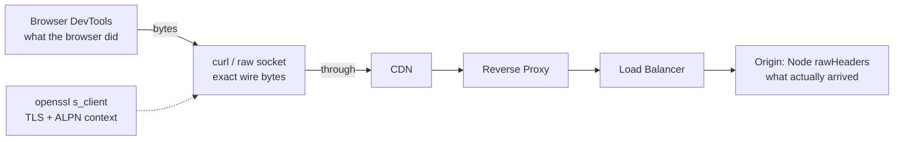
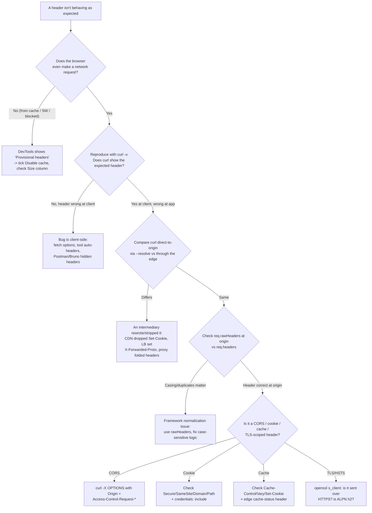

# Debugging HTTP Headers

## Quick Summary

Almost every "it works on my machine but not in prod" bug is a header bug: a CORS preflight that silently fails, a cookie the browser refuses to store, a cache that never hits, a redirect loop behind a load balancer. Headers are invisible until you go looking for them, and the tools that show them each lie in their own way — Chrome hides `Authorization` behind "Provisional headers," curl injects a default `Accept: */*`, Postman quietly adds `Postman-Token` and its own `User-Agent`, Node's `http.get` normalizes header casing. This page is a practical, copy-pasteable toolkit for **seeing the exact bytes on the wire** and reasoning about why a header did or didn't do what you expected. It covers Chrome DevTools, curl, Postman/Bruno, raw Node.js clients and servers, Express request/response logging, `openssl s_client` for TLS/HSTS, and end-to-end playbooks for the five header bugs you will actually hit in production.

## What problem does this header debugging solve?

The core problem: **the header you *think* you sent is often not the header that arrived**, and the header you *think* you set is often not the header the client received. Between your `fetch()` call and your Express handler sit the browser's networking stack, a TLS terminator, a CDN, a reverse proxy, and a load balancer — each free to add, strip, rewrite, fold, or reorder headers. A CDN drops `Set-Cookie` on cacheable responses. A reverse proxy sets `X-Forwarded-Proto: http` while the browser spoke HTTPS. A framework lowercases and de-duplicates headers before your code ever sees them.

Debugging headers is the discipline of **collapsing that uncertainty** by observing the real message at each hop, rather than trusting any single tool's rendering of it. The goal is always to answer one question precisely: *what exact header bytes crossed this specific boundary?*

## How header debugging works: the layers

You debug headers at four observation points, and each shows you something the others cannot:

- **Browser (DevTools):** the only place that shows what the *browser* actually decided to do — which cookies it attached, whether it treated a response as a CORS failure, whether it served from cache. It hides some request headers it adds late (see the provisional-headers gotcha).
- **On-the-wire client (curl / raw Node socket):** shows the *exact bytes* a client sends and receives, with zero framework normalization. This is ground truth for request/response headers.
- **Server logs (Node `rawHeaders` / Express middleware):** the only place that shows what *arrived at your origin* after every proxy in front of it had its way. Diverges from the client view whenever an intermediary rewrote something.
- **TLS layer (`openssl s_client`):** shows the handshake, certificate chain, and ALPN-negotiated protocol — the context in which HSTS, secure cookies, and HTTP/2 pseudo-headers only make sense.



Whenever two observation points disagree, the bug lives between them.

## Chrome DevTools

The Network tab is your first stop, but you must know what it does and does not show.

### Viewing raw request and response headers

1. Open DevTools (F12) → **Network** tab. Reload the page or trigger the request.
2. Click the request row → **Headers** sub-tab. You get four groups: **General** (URL, method, status, remote address), **Response Headers**, **Request Headers**, and (for POST) **Payload**.
3. Click **"Raw"** (a toggle next to "Response Headers" / "Request Headers") to switch from DevTools' prettified key/value view to the **literal header block as it appeared on the wire** — original casing, duplicate headers, folded values. Always toggle Raw when debugging: the pretty view merges duplicate `Set-Cookie` headers and normalizes casing, which can hide the exact bug you're chasing.
4. The **status line** at the top of Raw shows `HTTP/1.1 200 OK` vs `HTTP/2 200` — critical, because HTTP/2 has no reason phrase and lowercases all header names, and pseudo-headers (`:status`, `:method`) never appear in HTTP/1.1.

### The "Provisional headers are shown" gotcha

If the Request Headers panel shows a yellow warning **"Provisional headers are shown. Disable cache to see full headers"** (or just a suspiciously short list missing `Authorization`, `Cookie`, `User-Agent`), DevTools is telling you it **never captured the real request headers**. This happens when:

- The response was served from the **disk/memory cache**, so no real network request was made — DevTools shows the *provisional* (pre-send) header set the browser had assembled, not what went over the wire (nothing did).
- The request was **blocked** (by an extension, an ad-blocker, `net::ERR_BLOCKED_BY_CLIENT`, or a failed CORS check) before headers were committed.
- A **Service Worker** synthesized the response, so the network layer never saw the request.

Fix: tick **Disable cache** (see below) and reload, or check the **Size** column — `(disk cache)` / `(ServiceWorker)` confirms no wire request happened. To see the truly-sent headers regardless, capture with curl or a raw socket, or use `chrome://net-export` for a full network log. Never conclude "my `Authorization` header isn't being sent" from a provisional-headers view alone — it's an artifact, not evidence.

### Disabling cache

Tick **Network → Disable cache** (only effective while DevTools is open). This makes the browser send `Cache-Control: no-cache` (and skip its HTTP cache) on every request, forcing real network round-trips so you can see genuine request/response headers and status codes (`200` instead of `(from disk cache)`, real `304`s on revalidation). Essential when debugging [`Cache-Control`](../06-Caching-Headers/Cache-Control.md) or the provisional-headers issue above.

### Filtering and finding the right request

- The **filter box** accepts substrings and special filters: `method:OPTIONS` isolates CORS preflights, `status-code:304` finds revalidations, `mime-type:application/json` narrows to API calls, `-domain:*.googleapis.com` excludes noise. Prefix with `-` to invert.
- Filter type buttons (**Fetch/XHR**, **Doc**, **CSS**, **Img**) narrow by resource type — click **Fetch/XHR** to see only your API traffic.
- **Right-click a column header → add "Cache-Control"** (or any header) as a column to scan a header's value across all requests at once.
- **Right-click a request → Copy → Copy as cURL** reproduces the exact request (all headers, cookies, body) as a curl command you can paste into a terminal — the single fastest way to move a browser request into a scriptable, wire-level tool.

## curl

curl is the ground-truth client. Know that curl adds three default headers unless you override them: `Host` (derived from the URL), `User-Agent: curl/x.y.z`, and `Accept: */*`. Remove any with `-H 'Header:'` (empty value deletes it).

```bash
# -v (verbose): show the full request AND response headers, plus TLS handshake.
#   > lines are what curl SENT, < lines are what the server RETURNED, * lines are curl's own notes.
curl -v https://api.example.com/health

# -I (HEAD request): fetch ONLY response headers, no body. Great for inspecting
#   Cache-Control/ETag/Content-Type quickly. Note: some servers behave differently
#   for HEAD vs GET — if in doubt use -sD - -o /dev/null (below) to keep it a GET.
curl -I https://cdn.example.com/app.9f2c1a.js

# GET but dump response headers only, discard body: -D - writes headers to stdout,
#   -o /dev/null throws the body away, -s silences the progress meter.
#   This is the honest way to see response headers on a real GET.
curl -sD - -o /dev/null https://api.example.com/products

# --resolve: pin a hostname to a specific IP without touching /etc/hosts or DNS.
#   Indispensable for testing a new origin, a specific CDN edge, or a blue/green
#   deploy while still sending the correct Host + SNI + TLS cert name.
#   Format: HOST:PORT:IP  (443 for HTTPS).
curl -v --resolve api.example.com:443:10.0.0.42 https://api.example.com/health

# Sending custom request headers with -H (repeatable). This is how you simulate
#   an authenticated client, a specific content negotiation, or a conditional request.
curl -sD - -o /dev/null https://api.example.com/me \
  -H 'Authorization: Bearer eyJhbGci...' \
  -H 'Accept: application/json' \
  -H 'If-None-Match: "user-42-v7"'   # expect a 304 if the ETag still matches

# Following redirects: by default curl does NOT follow 3xx. -L follows them;
#   add -v to watch each hop's Location header. This is how you catch redirect loops.
curl -sL -o /dev/null -w '%{http_code} %{url_effective}\n' https://example.com
```

### Testing a CORS preflight (the OPTIONS request the browser sends)

A CORS preflight is a real HTTP `OPTIONS` request the browser makes *before* a non-simple cross-origin call. You can reproduce it exactly with curl to see whether your server answers correctly — without fighting the browser's opaque "CORS error" message:

```bash
curl -v -X OPTIONS https://api.example.com/orders \
  -H 'Origin: https://app.example.com' \
  -H 'Access-Control-Request-Method: POST' \
  -H 'Access-Control-Request-Headers: content-type, authorization'
```

Then read the response headers. A correctly-configured server must return:
- `Access-Control-Allow-Origin: https://app.example.com` (the exact origin, or `*` — but `*` is incompatible with credentials),
- `Access-Control-Allow-Methods` including `POST`,
- `Access-Control-Allow-Headers` including both `content-type` and `authorization`,
- and if the real request sends cookies, `Access-Control-Allow-Credentials: true`.

If any of those is missing or mismatched, the browser blocks the *real* request and you see a console CORS error — but curl will happily show you the exact missing header. See [Access-Control-Allow-Origin](../07-CORS/Access-Control-Allow-Origin.md) and the [CORS Overview](../07-CORS/CORS-Overview.md).

### Testing gzip / Brotli compression

```bash
# Ask for compression and dump ONLY response headers. Look for `Content-Encoding: gzip`
#   (or br) and `Vary: Accept-Encoding`. If Content-Encoding is absent, the server
#   didn't compress — check payload size threshold and MIME-type allowlist.
curl -sD - -o /dev/null -H 'Accept-Encoding: gzip, br' https://example.com/app.js

# --compressed: send Accept-Encoding AND transparently decompress the body so you
#   can inspect real content while confirming it arrived compressed (-w shows sizes).
curl --compressed -sD - -o /dev/null \
  -w 'downloaded(compressed): %{size_download} bytes\n' https://example.com/app.js
```

See [Accept-Encoding](../10-Compression/Accept-Encoding.md).

### Testing range requests (partial content)

```bash
# Request bytes 0-1023. A range-capable server replies `206 Partial Content` with
#   `Content-Range: bytes 0-1023/<total>` and `Accept-Ranges: bytes`.
#   If it returns 200 with the whole body, ranges aren't supported (or a proxy stripped them).
curl -sD - -o /dev/null -H 'Range: bytes=0-1023' https://cdn.example.com/video.mp4

# Request the LAST 500 bytes (suffix range) — used for reading file trailers/footers.
curl -sD - -o /dev/null -H 'Range: bytes=-500' https://cdn.example.com/archive.zip
```

See [Range Requests Overview](../13-Range-Requests/Range-Requests-Overview.md).

## Postman & Bruno

Both are GUI/CLI API clients; both **silently add headers** you did not type, which is the number-one source of "works in Postman, fails in the browser" confusion.

### Inspecting headers

- **Postman:** the request **Headers** tab has a **"hidden"** / **"auto-generated headers"** disclosure (a "n hidden" link). Click it to reveal the headers Postman adds for you: `Host`, `User-Agent: PostmanRuntime/x.y.z`, `Accept: */*`, `Accept-Encoding: gzip, deflate, br`, `Connection: keep-alive`, `Content-Length`, `Content-Type` (from the body type), and a unique `Postman-Token` per request. On the response side, the **Headers** tab shows all response headers, and the **Postman Console** (bottom-left, or `Ctrl/Cmd+Alt+C`) shows the *actual* network request including these hidden headers and any redirects Postman followed.
- **Bruno:** an offline, git-friendly client that stores requests as `.bru` files in your repo (so header configs are version-controlled and reviewable in PRs). The response pane shows headers directly; Bruno adds far fewer surprise headers than Postman but still supplies `Host`, `User-Agent: bruno-runtime/x.y.z`, `Accept`, and `Content-Length`. Its `Timeline` view shows the raw request/response for a given send.

### Environment / collection auth headers

Both tools inject `Authorization` from **Auth settings** (collection-, folder-, or request-level) rather than from a header you typed. If a request 401s unexpectedly:
- In Postman, check the request's **Authorization** tab *and* the inherited collection auth — a request set to "Inherit auth from parent" gets a token you can't see in the Headers tab. Variables like `{{access_token}}` resolve from the selected **Environment**; a request failing only for one teammate is usually a missing/stale environment variable.
- In Bruno, auth lives in the `.bru` file's `auth` block and variables in `environments/*.bru`. Because it's all text in git, you can `grep` for the header and diff environments.

The takeaway: when a request behaves differently in Postman/Bruno than in your app, **open the console/timeline and compare the full sent header set byte-for-byte** — the difference is almost always an auto-added header (`Accept-Encoding`, `User-Agent`, `Postman-Token`) or an injected auth header.

## Node.js

To see the *exact bytes* with no framework in the way, write a raw client against a socket. This bypasses `http`'s header parsing and shows you literally what the server sends.

```js
// raw-dump.js — connect a TLS socket and print every byte the server returns,
// including the raw status line and header block exactly as transmitted.
const tls = require('tls');

const socket = tls.connect(443, 'example.com', { servername: 'example.com' }, () => {
  // Write a hand-crafted HTTP/1.1 request. \r\n line endings are mandatory;
  // the blank line (\r\n\r\n) terminates the header block.
  socket.write(
    'GET / HTTP/1.1\r\n' +
    'Host: example.com\r\n' +
    'Accept-Encoding: gzip\r\n' +
    'Connection: close\r\n' +   // ask the server to close so the socket ends cleanly
    '\r\n'
  );
});

// The chunks arriving here are the unmodified wire bytes: status line + headers + body.
socket.on('data', (chunk) => process.stdout.write(chunk));
socket.on('end', () => process.stdout.write('\n--- connection closed ---\n'));
socket.on('error', console.error);
```

For a higher-level view that still shows original header casing:

```js
// http-get.js — use http/https but inspect BOTH the parsed and the raw headers.
const https = require('https');

https.get('https://example.com/', (res) => {
  // res.headers: lowercased, and duplicate headers are joined (Set-Cookie is the
  //   exception — it stays an array). This is what your application code normally sees.
  console.log('parsed headers:', res.headers);

  // res.rawHeaders: a FLAT array [name, value, name, value, ...] preserving the
  //   ORIGINAL casing and EVERY duplicate in wire order. Use this to debug:
  //   - casing bugs (a client that matches header names case-sensitively),
  //   - duplicate headers that res.headers silently merged,
  //   - the exact order headers arrived (matters for some security checks).
  console.log('rawHeaders:', res.rawHeaders);

  res.resume(); // drain the body so the socket can close
}).on('error', console.error);
```

`req.headers` vs `req.rawHeaders` on the **server** side follows the same rule: `req.headers` is the convenient lowercased/merged object your handlers use; `req.rawHeaders` is the ground truth for casing, duplicates, and order. When a proxy sends two `X-Forwarded-For` headers, `req.headers['x-forwarded-for']` merges them with a comma while `req.rawHeaders` shows them as separate entries — the difference matters for trust/parsing logic.

## Express logging

`console.log` per handler doesn't scale. Use structured, lifecycle-aware logging.

### morgan for request/response summaries

```js
const express = require('express');
const morgan = require('morgan');
const app = express();

// Built-in 'combined' format logs method, URL, status, size, Referer, User-Agent.
app.use(morgan('combined'));

// Custom tokens let you log ANY header, request or response. Response headers are
// only available after the response is sent, which morgan handles for you.
morgan.token('req-auth', (req) => req.headers['authorization'] ? 'present' : 'absent');
morgan.token('res-cc',   (req, res) => res.getHeader('cache-control') || '-');
morgan.token('res-cookie', (req, res) => (res.getHeader('set-cookie') || []).length + ' cookie(s)');

app.use(morgan(':method :url :status :res-cc auth=:req-auth :res-cookie'));
// Never log the actual Authorization/Cookie VALUES — log presence/count only, to
// avoid writing credentials into your log aggregation system.
```

### A custom middleware logging request and response headers

The subtlety: **response headers are not final when a request arrives** — your handlers and downstream middleware set them later, and some (like `Content-Length`) are computed at the moment of writing. You must hook the right lifecycle event.

```js
const onHeaders = require('on-headers');   // fires the instant headers are flushed
const onFinished = require('on-finished'); // fires when the response is fully sent

app.use((req, res, next) => {
  // Request headers ARE final here — log what actually arrived at the origin.
  console.log('IN ', req.method, req.url, '\n  req.headers:', req.headers);
  // req.rawHeaders if you need casing/duplicates/order (e.g. multiple X-Forwarded-For).

  // on-headers: runs synchronously RIGHT BEFORE the header block is written to the
  //   socket. This is the ONLY point where res.getHeaders() reflects the FINAL,
  //   about-to-be-sent response headers — after every middleware has had its say.
  onHeaders(res, function () {
    console.log('OUT', this.statusCode, '\n  res.headers:', this.getHeaders());
  });

  // on-finished: runs after the last byte is flushed (or the connection errored).
  //   Right place for timing and "did the response complete?" logging. Headers may
  //   already be gone from some framework state here, so read them in on-headers.
  onFinished(res, (err) => {
    console.log('DONE', req.method, req.url, res.statusCode, err ? '(errored)' : '');
  });

  next();
});
```

Why not just log in `res.on('finish')`? You can, and `res.getHeaders()` still works there for most cases — but `on-headers` fires *before* the flush, so it captures the exact header set even if the connection is aborted mid-body, and `on-finished` correctly reports aborted/errored responses that `'finish'` misses. Together they give you "what headers went out" and "did it complete" as two clean signals.

## openssl s_client — TLS, HSTS, and protocol context

Some header behavior only makes sense in TLS context: [`Strict-Transport-Security`](../05-Security-Headers/Strict-Transport-Security.md) is ignored over plain HTTP, `Secure` cookies require HTTPS, and HTTP/2 pseudo-headers exist only after ALPN negotiates `h2`. `openssl s_client` opens a raw TLS connection so you can inspect the handshake and then speak HTTP by hand.

```bash
# Open a TLS connection, print the certificate chain and negotiated protocol,
#   then type an HTTP request by hand. -servername sends SNI (required for vhosts/CDNs).
openssl s_client -connect example.com:443 -servername example.com

# Once connected, paste an HTTP/1.1 request (end with a blank line):
#   GET / HTTP/1.1
#   Host: example.com
#   Connection: close
#
# The response headers (including Strict-Transport-Security) print in the terminal.

# Non-interactive one-liner: pipe the request in and grep for the HSTS header.
printf 'GET / HTTP/1.1\r\nHost: example.com\r\nConnection: close\r\n\r\n' \
  | openssl s_client -quiet -connect example.com:443 -servername example.com 2>/dev/null \
  | grep -i strict-transport-security
# Verify: max-age is large (>= 15552000 / 180d for preload), and includeSubDomains
#   + preload are present if you intend to submit to the HSTS preload list.

# Inspect the certificate + which ALPN protocol the server negotiates (h2 vs http/1.1):
openssl s_client -connect example.com:443 -servername example.com -alpn h2,http/1.1 </dev/null 2>/dev/null \
  | grep -i 'ALPN'
```

Key checks: the cert `subject`/`issuer` and expiry (`-dates`), that SNI (`-servername`) matches the cert (mismatched SNI is a common cause of the wrong cert / wrong vhost being served behind a CDN), and that HSTS is present **on the HTTPS response** — browsers ignore `Strict-Transport-Security` sent over HTTP, so testing it requires this TLS-level view.

## Common Debugging Playbooks

### Playbook: CORS is failing

Symptom: browser console shows "blocked by CORS policy," but curl to the same endpoint works fine.

1. Reproduce the **preflight** with curl (`-X OPTIONS` + `Origin` + `Access-Control-Request-Method`/`-Headers`, shown above). curl doesn't enforce CORS, so this shows you the server's raw answer.
2. Compare the returned `Access-Control-Allow-Origin` to the **exact** `Origin` (scheme + host + port must match; `https://app.example.com` ≠ `https://app.example.com:443` in some stacks, and trailing behavior differs).
3. If the request sends cookies (`credentials: 'include'`), the server must return `Access-Control-Allow-Credentials: true` **and** a specific origin — `Access-Control-Allow-Origin: *` is rejected by the browser with credentials.
4. Confirm `Access-Control-Allow-Headers` lists every non-simple request header (e.g. `authorization`, `content-type` when not `text/plain`/`form`).
5. In DevTools, filter `method:OPTIONS` — if there's no preflight row, the browser treated it as a simple request; if the preflight is `200` but the real request still fails, the failure is on the **actual** response's `Access-Control-Allow-Origin`, not the preflight. See [Access-Control-Allow-Origin](../07-CORS/Access-Control-Allow-Origin.md).

### Playbook: caching not working (every request hits origin)

1. `curl -sD - -o /dev/null <url>` and read `Cache-Control`. `no-store`/`no-cache`/`private` (on a shared cache) or a missing/`0` `max-age`/`s-maxage` all defeat caching.
2. Check for a `Set-Cookie` on the response — most CDNs and reverse proxies **refuse to cache any response carrying `Set-Cookie`**. A stray session cookie on a static asset silently disables edge caching.
3. Check `Vary`: an over-broad `Vary` (e.g. `Vary: User-Agent` or `Vary: *`) fragments the cache key so nothing ever hits. See [Cache-Control](../06-Caching-Headers/Cache-Control.md).
4. Look at the edge status header: `cf-cache-status` (Cloudflare), `x-cache` (CloudFront/Fastly), or your Nginx `X-Cache-Status`. `MISS`/`DYNAMIC` on every request tells you the CDN chose not to cache — the reason is one of the above.
5. In DevTools with **Disable cache** *off*, confirm the **Size** column shows `(disk cache)`/`(memory cache)` for the browser tier.

### Playbook: cookie not being set / not sent back

1. Inspect the raw `Set-Cookie` (DevTools Raw view, or `curl -sD -`). Common blockers:
   - `Secure` attribute but the page is HTTP → browser drops it.
   - `SameSite=None` **without** `Secure` → rejected by modern browsers.
   - `Domain`/`Path` scoped so the cookie doesn't apply to the request URL.
   - Cross-site request with `SameSite=Lax`/`Strict` → cookie not sent on the cross-site call.
2. For a cross-origin `fetch`, the cookie is only stored/sent if the request used `credentials: 'include'` **and** the server sent `Access-Control-Allow-Credentials: true` with a specific `Access-Control-Allow-Origin`.
3. A CDN/reverse proxy stripping `Set-Cookie` (see caching playbook) — confirm with curl *directly to origin* (`--resolve` to bypass the CDN) vs through the edge; if the cookie is present at origin but gone at the edge, the intermediary stripped it. See [Cookies Overview](../08-Cookies/Cookies-Overview.md).

### Playbook: 431 Request Header Fields Too Large

Symptom: intermittent `431` (or `400`) from Node/Express, often for some users only.

1. `431` means the total request header size exceeded the server limit (Node's default `--max-http-header-size` is 16 KB). The usual culprit is a **bloated `Cookie` header** — accumulated auth/session/analytics cookies, or a giant JWT stored in a cookie.
2. Reproduce: `curl -sD - -o /dev/null <url> -H "Cookie: $(printf 'x=%.0s' {1..20000})"` (a 20 KB cookie) to confirm the limit.
3. Fixes: trim cookie count/size, move large tokens out of cookies, or raise the limit deliberately with `node --max-http-header-size=32768`. Also check any reverse proxy header buffer (`large_client_header_buffers` in Nginx) — the tightest limit in the chain wins, so a `431` can come from Nginx before Node ever sees it.

### Playbook: redirect loop from X-Forwarded-Proto

Symptom: `ERR_TOO_MANY_REDIRECTS`; curl `-L` shows the same URL redirecting to itself forever.

1. The classic cause: your app does "redirect HTTP → HTTPS" based on `req.protocol`, but it sits behind a TLS-terminating load balancer/CDN. The browser speaks HTTPS to the edge; the edge speaks **HTTP** to your app and sets `X-Forwarded-Proto: https` to tell you the *original* scheme. If your app ignores that header, `req.protocol` is `http`, so it redirects to HTTPS → hits the edge → forwards as HTTP again → redirects again. Infinite loop.
2. Diagnose: `curl -sL -o /dev/null -w '%{http_code} %{url_effective}\n' -H 'X-Forwarded-Proto: https' https://example.com` — if adding the header stops the loop, the header wasn't being trusted.
3. Fix in Express: `app.set('trust proxy', true)` (or a specific hop count / subnet) so `req.protocol` and `req.secure` read `X-Forwarded-Proto`. Then the HTTPS check passes and no redirect is issued. See [X-Forwarded-Proto](../14-Proxies/Proxies-Overview.md) / [Proxies Overview](../14-Proxies/Proxies-Overview.md).
4. Confirm at origin with `req.rawHeaders` that the header actually arrives and isn't being set by an untrusted client (only trust `X-Forwarded-*` from proxies you control).

## Troubleshooting Decision Tree



## Best Practices

- [ ] When a header "isn't being sent," confirm with **curl or a raw socket** before trusting DevTools' provisional-headers view.
- [ ] Always toggle DevTools **"Raw"** to see original casing and duplicate headers (especially multiple `Set-Cookie`).
- [ ] Use `curl --resolve` to test origin vs edge separately — the diff localizes which hop rewrote the header.
- [ ] Reproduce CORS failures with `curl -X OPTIONS` + `Origin`/`Access-Control-Request-*` rather than guessing from the browser's opaque error.
- [ ] In server logs, inspect `req.rawHeaders` when casing, duplicates, or order matter (e.g. multiple `X-Forwarded-For`).
- [ ] Log response headers in **`on-headers`** (final, pre-flush) and completion in **`on-finished`** — not in the request handler.
- [ ] Never log `Authorization`/`Cookie` **values** — log presence/count to keep credentials out of log storage.
- [ ] Account for tool-injected headers (curl's `Accept: */*`, Postman's `Postman-Token`/`User-Agent`) when comparing to browser behavior.
- [ ] Test HSTS/secure-cookie behavior over real TLS with `openssl s_client`; browsers ignore HSTS sent over HTTP.
- [ ] Behind a TLS-terminating proxy, set `trust proxy` and verify `X-Forwarded-Proto` arrives — the #1 cause of redirect loops.

## Related Headers

- [Access-Control-Allow-Origin](../07-CORS/Access-Control-Allow-Origin.md) and [CORS Overview](../07-CORS/CORS-Overview.md) — the preflight-debugging workflow above targets these directly.
- [Cache-Control](../06-Caching-Headers/Cache-Control.md) — the caching-not-working playbook centers on its directives plus `Vary`.
- [Cookies Overview](../08-Cookies/Cookies-Overview.md) — cookie-not-set debugging turns on `Secure`/`SameSite`/`Domain`.
- [Strict-Transport-Security](../05-Security-Headers/Strict-Transport-Security.md) — only observable/valid over the TLS connection you open with `openssl s_client`.
- [Authorization](../09-Authentication/Authorization.md) — the header most often hidden by DevTools provisional view and injected invisibly by Postman/Bruno.
- [Accept-Encoding](../10-Compression/Accept-Encoding.md) and [Range Requests Overview](../13-Range-Requests/Range-Requests-Overview.md) — the compression/range curl recipes exercise these.
- [Proxies Overview](../14-Proxies/Proxies-Overview.md) — `X-Forwarded-Proto`/`X-Forwarded-For` behavior behind the redirect-loop and rawHeaders playbooks.

## Mental Model

Debugging headers is **detective work along a chain of custody**. The header is the evidence; the browser, curl, the CDN, the proxy, and your origin are witnesses who each saw the package at a different point on its journey. Every witness has a bias: the browser politely hides some of what it added ("provisional headers"), curl always slips in its own `Accept: */*`, Postman staples on a `Postman-Token`, and your framework re-labels everything in lowercase and throws away the duplicates. Your job is not to trust any single witness but to **take statements at each hop and find where the stories diverge** — because the header didn't vanish or mutate everywhere at once. It changed at exactly one boundary, and the two witnesses on either side of that boundary are pointing straight at your bug.
