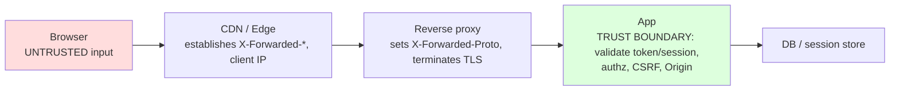

# Auth Architecture End-to-End

> A **chapter page** tracing authentication and authorization **through every hop and header** of a real production system: browser → CDN → reverse proxy → app → database, and back. Individual auth headers are covered in [Authentication Overview](../09-Authentication/Authentication-Overview.md), [`Authorization`](../09-Authentication/Authorization.md), [`WWW-Authenticate`](../09-Authentication/WWW-Authenticate.md), [`Set-Cookie`](../08-Cookies/Set-Cookie.md), and [`Cookie`](../08-Cookies/Cookie.md). This page shows how they **compose** — which header does what at which tier, where trust boundaries lie, and the header interactions that make auth secure (or catastrophically insecure) in a full architecture.

## The two dominant auth models

Almost every production web auth architecture is one of two patterns (often both, for different clients):

1. **Cookie-based sessions** — the server issues a [`Set-Cookie`](../08-Cookies/Set-Cookie.md) with a session ID (or an encrypted session), the browser returns it automatically via [`Cookie`](../08-Cookies/Cookie.md) on every same-site request. Best for **first-party browser apps**. Security rests on [`SameSite`](../08-Cookies/Set-Cookie.md)/`Secure`/`HttpOnly` + CSRF defenses.
2. **Token-based (Bearer/JWT)** — the client obtains a token and sends it in [`Authorization: Bearer <token>`](../09-Authentication/Authorization.md) on each request. Best for **APIs, SPAs calling separate API origins, mobile, service-to-service**. Security rests on token validation, expiry, and transport (HTTPS).

The header story differs at each tier depending on which model (or hybrid) you use.

## End-to-end flow (cookie session, first-party app)

```mermaid
sequenceDiagram
    participant B as Browser
    participant CDN as CDN
    participant RP as Reverse proxy (Nginx)
    participant App as App (Express)
    participant DB as Session store / DB
    Note over B,App: 1) LOGIN
    B->>CDN: POST /login (credentials, Origin: app.example.com)
    CDN->>RP: forwards (adds X-Forwarded-*, CF-Connecting-IP)
    RP->>App: forwards (X-Forwarded-Proto: https)
    App->>DB: verify credentials, create session
    App-->>B: 200 Set-Cookie: sid=...; HttpOnly; Secure; SameSite=Lax<br/>Cache-Control: no-store
    Note over B,App: 2) AUTHENTICATED REQUEST
    B->>CDN: GET /account (Cookie: sid=...)
    Note over CDN: MUST NOT cache (private) → passes through
    CDN->>RP: forwards Cookie
    RP->>App: forwards Cookie
    App->>DB: look up session by sid
    App-->>B: 200 (private data) Cache-Control: private, no-store
    Note over B,App: 3) UNAUTHENTICATED
    B->>App: GET /account (no/invalid Cookie)
    App-->>B: 302 → /login  (or 401)
```

## Header responsibilities by tier

| Tier | On the way in (request) | On the way out (response) | Key concern |
|---|---|---|---|
| **Browser** | Sends [`Cookie`](../08-Cookies/Cookie.md) automatically (subject to [`SameSite`](../08-Cookies/Set-Cookie.md)); or [`Authorization: Bearer`](../09-Authentication/Authorization.md) set by JS; sends [`Origin`](../03-Request-Headers/Origin.md) on cross-origin/unsafe requests | Stores [`Set-Cookie`](../08-Cookies/Set-Cookie.md) per flags | Never exposes `HttpOnly` cookies to JS; enforces SameSite/CORS |
| **CDN** | Forwards auth headers; adds [`X-Forwarded-For`](../14-Proxies/X-Forwarded-For.md)/client-IP | **Must not cache** authenticated/`private`/`Set-Cookie` responses; passes through | Cache poisoning / private-data leakage if it caches auth responses |
| **Reverse proxy** | Sets [`X-Forwarded-Proto`](../14-Proxies/X-Forwarded-Proto.md)/[`-For`](../14-Proxies/X-Forwarded-For.md); may terminate TLS; can do auth ([`WWW-Authenticate`](../09-Authentication/WWW-Authenticate.md)) | May strip/rewrite; adds security headers | Correct `trust proxy`; don't leak internal auth |
| **App** | Reads [`Cookie`](../08-Cookies/Cookie.md)/[`Authorization`](../09-Authentication/Authorization.md); validates [`Origin`](../03-Request-Headers/Origin.md) for CSRF; checks CORS | Issues [`Set-Cookie`](../08-Cookies/Set-Cookie.md), [`WWW-Authenticate`](../09-Authentication/WWW-Authenticate.md)/`401`; sets `Cache-Control: no-store`, CORS headers | Session/token validation, authz, CSRF |
| **DB / session store** | — | — | Session lookup; token revocation lists |

## The critical header interactions

Auth security in a full architecture is really about a handful of **header interactions working together**:

- **[`Set-Cookie`](../08-Cookies/Set-Cookie.md) flags + HTTPS:** `Secure` (only over TLS) + `HttpOnly` (no JS access, mitigates XSS token theft) + [`SameSite`](../08-Cookies/Set-Cookie.md) (`Lax`/`Strict` mitigates CSRF) + `__Host-` prefix (locks domain/path). All four together, over HTTPS enforced by [`Strict-Transport-Security`](../05-Security-Headers/Strict-Transport-Security.md).
- **[`X-Forwarded-Proto`](../14-Proxies/X-Forwarded-Proto.md) + `Secure` cookies:** behind a TLS-terminating edge, the app only knows the client used HTTPS via XFP — so `trust proxy` must be correct or `Secure` cookies get dropped / HTTPS redirects loop.
- **[`Origin`](../03-Request-Headers/Origin.md) + CSRF + [`Access-Control-Allow-Credentials`](../07-CORS/Access-Control-Allow-Credentials.md):** for cross-origin credentialed APIs, ACAC must be `true` with a *specific* [`Access-Control-Allow-Origin`](../07-CORS/Access-Control-Allow-Origin.md) (never `*`) — and CORS is **not** CSRF protection, so SameSite/CSRF tokens still apply.
- **[`Cache-Control: private`/`no-store`](../06-Caching-Headers/Cache-Control.md) + CDN:** authenticated responses must be marked uncacheable or a shared cache can serve one user's data to another (see [Vary](../06-Caching-Headers/Vary.md)).
- **[`Authorization`](../09-Authentication/Authorization.md) + caching:** responses to `Authorization`-bearing requests are non-cacheable by default (per spec) — good, but be deliberate.
- **[`WWW-Authenticate`](../09-Authentication/WWW-Authenticate.md)/`401` (origin) vs [`Proxy-Authenticate`](../09-Authentication/Proxy-Authenticate.md)/`407` (proxy):** don't confuse app auth with proxy auth.

## Express.js Example — cookie session behind a proxy/CDN

```js
const express = require('express');
const session = require('express-session');
const helmet = require('helmet');
const app = express();

// 1) Trust the edge so req.secure/req.ip reflect the CLIENT (via X-Forwarded-*).
//    Without this, Secure cookies get dropped and HTTPS redirects can loop.
app.set('trust proxy', 1);

app.use(helmet()); // sets HSTS, X-Content-Type-Options, etc.

// 2) Session cookie with all the protective flags. These only work correctly
//    because trust proxy makes req.secure true behind the TLS-terminating edge.
app.use(session({
  name: '__Host-sid',                 // __Host- prefix locks it to this origin, path=/
  secret: process.env.SESSION_SECRET,
  resave: false,
  saveUninitialized: false,
  cookie: {
    httpOnly: true,                   // JS can't read it → mitigates XSS theft
    secure: true,                     // HTTPS only (needs correct trust proxy)
    sameSite: 'lax',                  // mitigates CSRF on top-level navigations
    maxAge: 1000 * 60 * 60,           // 1h
    path: '/',
  },
  store: sessionStore,                // DB/Redis-backed session store
}));

// 3) Authenticated responses MUST be uncacheable so the CDN never shares them.
app.use('/account', (req, res, next) => {
  res.set('Cache-Control', 'private, no-store'); // shared caches won't store it
  if (!req.session.userId) return res.redirect('/login'); // or 401 for APIs
  next();
});

// 4) CSRF defense for state-changing requests: validate Origin + a CSRF token.
//    (CORS ≠ CSRF protection; SameSite=Lax helps but validate for sensitive ops.)
app.post('/account/transfer', (req, res) => {
  const origin = req.headers.origin;
  if (origin && origin !== 'https://app.example.com') return res.status(403).end();
  if (!validCsrfToken(req)) return res.status(403).end();
  // ...perform the transfer...
  res.json({ ok: true });
});

app.get('/account', (req, res) => res.json({ user: lookup(req.session.userId) }));
app.listen(3000);
```

Why each piece matters: `trust proxy` (step 1) is the linchpin behind a CDN/LB — it makes `req.secure` reflect the client's real HTTPS ([via X-Forwarded-Proto](../14-Proxies/X-Forwarded-Proto.md)), so the `Secure` cookie in step 2 is actually set (otherwise it's silently dropped). The cookie flags (step 2) are a *stack* of defenses: `HttpOnly` (XSS), `Secure` (transport), `SameSite` (CSRF), `__Host-` (scope) — remove any and you widen an attack. Step 3 is the CDN safety rule: `Cache-Control: private, no-store` on authenticated responses prevents a shared cache from serving user A's account to user B — one of the most damaging cache-config bugs. Step 4 shows that **CORS is not CSRF protection**: even with correct CORS, a state-changing request needs [`Origin`](../03-Request-Headers/Origin.md) validation and/or a CSRF token because the request still reaches the server.

## Express.js Example — token (Bearer/JWT) API with CORS

```js
const express = require('express');
const cors = require('cors');
const app = express();

const ALLOWED = new Set(['https://app.example.com']);

// Credentialed CORS: specific origin + ACAC:true (NEVER * with credentials).
app.use(cors({
  origin: (o, cb) => cb(null, ALLOWED.has(o)),   // reflects allowlisted origin only
  credentials: true,                             // Access-Control-Allow-Credentials: true
}));
app.use((req, res, next) => { res.vary('Origin'); next(); }); // cache correctness

// Bearer token validation on each request (stateless auth).
app.use((req, res, next) => {
  const auth = req.headers['authorization'] || '';
  if (!auth.startsWith('Bearer ')) {
    res.set('WWW-Authenticate', 'Bearer realm="api"'); // 401 challenge
    return res.status(401).json({ error: 'unauthorized' });
  }
  try {
    req.user = verifyJwt(auth.slice(7));            // signature + expiry + revocation check
  } catch {
    res.set('WWW-Authenticate', 'Bearer error="invalid_token"');
    return res.status(401).json({ error: 'invalid_token' });
  }
  // Responses to Authorization-bearing requests are non-cacheable by default; be explicit:
  res.set('Cache-Control', 'no-store');
  next();
});

app.get('/api/me', (req, res) => res.json({ user: req.user }));
app.listen(3000);
```

Why each piece matters: for a cross-origin credentialed API, [`Access-Control-Allow-Credentials: true`](../07-CORS/Access-Control-Allow-Credentials.md) **requires** a *specific* [`Access-Control-Allow-Origin`](../07-CORS/Access-Control-Allow-Origin.md) (the `cors` config reflects only allowlisted origins) and [`Vary: Origin`](../06-Caching-Headers/Vary.md) for cache correctness. The [`Authorization: Bearer`](../09-Authentication/Authorization.md) check validates the token *on every request* (signature, expiry, revocation) — the app is the trust boundary. `Cache-Control: no-store` prevents caching of per-user API responses.

## Trust boundaries (where header trust is established)



The **app is the authoritative trust boundary**: everything the browser sends ([`Cookie`](../08-Cookies/Cookie.md), [`Authorization`](../09-Authentication/Authorization.md), [`Origin`](../03-Request-Headers/Origin.md), [`X-Forwarded-*`](../14-Proxies/X-Forwarded-For.md)) is *client-influenceable* until validated. Forwarding headers ([`X-Forwarded-For`](../14-Proxies/X-Forwarded-For.md)/[`-Proto`](../14-Proxies/X-Forwarded-Proto.md)) are only trustworthy if the origin is **locked to the CDN/proxy** and `trust proxy` matches the exact hop count.

## Common Mistakes (architecture-level)

- **CDN caching authenticated responses.** Missing `Cache-Control: private/no-store` → one user's data served to another. The most damaging auth-caching bug.
- **`trust proxy` wrong behind an edge.** `Secure` cookies dropped, HTTPS redirect loops, wrong `req.ip` for rate limiting.
- **`ACAO: *` + `ACAC: true`.** Illegal/blocked; and reflecting arbitrary origins with credentials = data theft. Allowlist + specific origin.
- **Treating CORS as CSRF protection.** It isn't — the request still executes server-side. Use [`SameSite`](../08-Cookies/Set-Cookie.md) + CSRF tokens + [`Origin`](../03-Request-Headers/Origin.md) validation.
- **JWT in a JS-readable cookie / localStorage.** XSS steals it. Prefer `HttpOnly` cookies for session, or short-lived tokens with careful handling.
- **No token revocation.** Stateless JWTs can't be revoked without a denylist/short expiry; a leaked long-lived token is game over.
- **Confusing `401`/[`WWW-Authenticate`](../09-Authentication/WWW-Authenticate.md) (origin) with `407`/[`Proxy-Authenticate`](../09-Authentication/Proxy-Authenticate.md) (proxy).**
- **Leaking auth headers across hops.** [`Proxy-Authorization`](../09-Authentication/Proxy-Authorization.md) is hop-by-hop; don't forward.
- **Large JWTs blowing [header size limits](../02-Core-Concepts/Header-Size-Limits.md)** at a proxy/CDN → `431`/`400`.

## Security Considerations

- **Defense in depth:** cookie flags + HSTS + CSRF tokens + CORS allowlist + server-side validation — no single header is sufficient.
- **XSS is the master key:** it can steal non-`HttpOnly` tokens and forge same-origin requests. `HttpOnly` cookies + [CSP](../05-Security-Headers/Content-Security-Policy.md) are essential.
- **CSRF:** [`SameSite=Lax/Strict`](../08-Cookies/Set-Cookie.md) + CSRF tokens + [`Origin`](../03-Request-Headers/Origin.md) checks for state-changing requests.
- **Transport:** enforce HTTPS everywhere ([HSTS](../05-Security-Headers/Strict-Transport-Security.md)); `Secure` cookies; correct [`X-Forwarded-Proto`](../14-Proxies/X-Forwarded-Proto.md).
- **Never cache authenticated content in shared caches** without a per-user key; prefer `private`/`no-store`.
- **Lock the origin** to the CDN/proxy so forwarding/client-IP/CF-* headers are trustworthy.
- **Token hygiene:** short expiry, rotation, revocation, audience/issuer validation.

## Best Practices (checklist)

- [ ] Set `trust proxy` to the exact topology so [`X-Forwarded-Proto`](../14-Proxies/X-Forwarded-Proto.md)/`req.secure` and [`X-Forwarded-For`](../14-Proxies/X-Forwarded-For.md)/`req.ip` are correct.
- [ ] Session cookies: `HttpOnly; Secure; SameSite=Lax|Strict`, `__Host-` prefix, HTTPS-only, HSTS.
- [ ] Mark **all** authenticated responses `Cache-Control: private, no-store`.
- [ ] Credentialed CORS: specific [`Access-Control-Allow-Origin`](../07-CORS/Access-Control-Allow-Origin.md) + [`ACAC: true`](../07-CORS/Access-Control-Allow-Credentials.md) + [`Vary: Origin`](../06-Caching-Headers/Vary.md); never `*`.
- [ ] CSRF defense independent of CORS ([`SameSite`](../08-Cookies/Set-Cookie.md) + tokens + [`Origin`](../03-Request-Headers/Origin.md) checks).
- [ ] Validate tokens/sessions **server-side** on every request (signature, expiry, revocation, authz).
- [ ] Lock the origin to the CDN/proxy; treat client-supplied headers as untrusted until validated.
- [ ] Keep tokens small to avoid [header-size limits](../02-Core-Concepts/Header-Size-Limits.md).
- [ ] Enforce HTTPS end-to-end; add [CSP](../05-Security-Headers/Content-Security-Policy.md) to mitigate XSS.

## Related Pages

- [Authentication Overview](../09-Authentication/Authentication-Overview.md) — schemes and flows.
- [Authorization](../09-Authentication/Authorization.md) / [WWW-Authenticate](../09-Authentication/WWW-Authenticate.md) — origin auth headers.
- [Set-Cookie](../08-Cookies/Set-Cookie.md) / [Cookie](../08-Cookies/Cookie.md) — session cookies + protective flags.
- [Access-Control-Allow-Credentials](../07-CORS/Access-Control-Allow-Credentials.md) / [Access-Control-Allow-Origin](../07-CORS/Access-Control-Allow-Origin.md) — credentialed CORS.
- [Origin](../03-Request-Headers/Origin.md) — CSRF/CORS origin validation.
- [X-Forwarded-Proto](../14-Proxies/X-Forwarded-Proto.md) / [X-Forwarded-For](../14-Proxies/X-Forwarded-For.md) — trust behind the edge.
- [Strict-Transport-Security](../05-Security-Headers/Strict-Transport-Security.md) / [Content-Security-Policy](../05-Security-Headers/Content-Security-Policy.md) — transport + XSS hardening.
- [End-to-End Header Flow](./End-to-End-Header-Flow.md) — the general request/response flow.

## Mental Model

Think of end-to-end auth as a **secure courier delivering a sealed briefcase through a chain of checkpoints, where each checkpoint has exactly one job and the final office is the only place the seal is truly verified.** The building's front desk (CDN) must be told "**never photocopy briefcases addressed to a person**" (`Cache-Control: private`) or it'll hand one employee's confidential file to the next visitor. The internal courier (reverse proxy) clips on a note — "**this person came through the secure entrance**" ([`X-Forwarded-Proto`](../14-Proxies/X-Forwarded-Proto.md)) — that the destination office relies on to decide whether to hand over sensitive documents (`Secure` cookies). The office itself (your app) is the **only place the briefcase's seal is genuinely checked** — every note clipped on along the way is just a claim until verified here (session/token validation, authz). And because a forger could walk in the back door if it's unlocked, you **bar every entrance except the courier's own** (lock the origin to the CDN/proxy) — otherwise all those helpful checkpoint notes become worthless, forgeable scraps. Security isn't any single lock; it's the whole chain of them holding at once.
