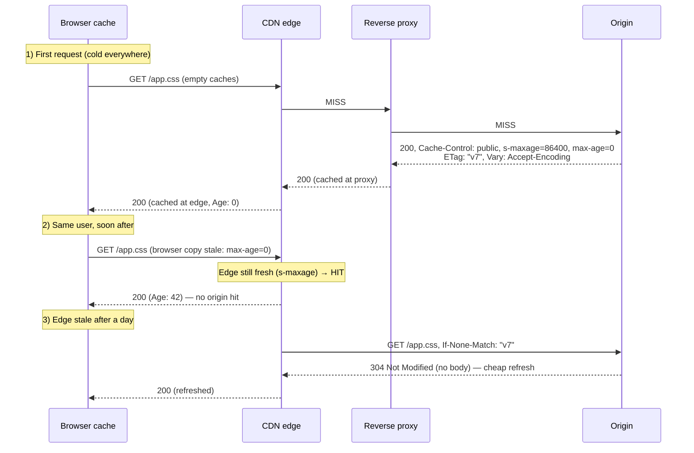
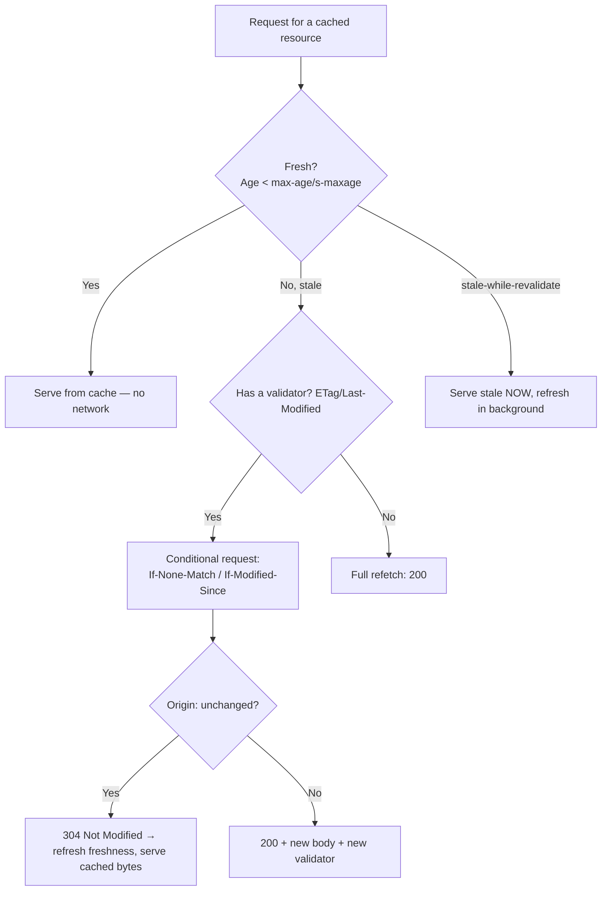

# Caching Architecture End-to-End

> A **chapter page** tracing how a response is cached — or not — through **every cache tier**: browser cache → CDN edge → reverse-proxy cache → origin, and how the caching headers *compose* across them. Individual headers are covered in [`Cache-Control`](../06-Caching-Headers/Cache-Control.md), [`ETag`](../06-Caching-Headers/ETag.md), [`Vary`](../06-Caching-Headers/Vary.md), [`Age`](../06-Caching-Headers/Age.md), [`Expires`](../06-Caching-Headers/Expires.md), and the [conditional-request family](../12-Conditional-Requests/Conditional-Requests-Overview.md). This page shows the **whole caching pipeline** — which header controls which tier, how freshness and validation flow, and the patterns (immutable assets, SWR, private data, tag-purge) that make caching fast *and* correct.

## The mental model: multiple caches, one set of directives

A response can be cached in **four+ places** simultaneously: the browser's private cache, one or more CDN edge caches, a reverse-proxy cache (Nginx/Varnish), and sometimes an application-layer cache. The same [`Cache-Control`](../06-Caching-Headers/Cache-Control.md) response header speaks to all of them, but with important distinctions:

- **`max-age`** → applies to **all** caches (including the browser's private cache).
- **`s-maxage`** → applies to **shared** caches (CDN, reverse proxy) *only*, overriding `max-age` for them.
- **`private`** → only the **browser** may cache; shared caches must not.
- **`public`** → shared caches may cache even normally-uncacheable responses.
- **`no-store`** → **no** cache may store it (sensitive data).
- **`no-cache`** → may store, but must **revalidate** ([conditional request](../12-Conditional-Requests/Conditional-Requests-Overview.md)) before reuse.

This lets you say, in one header, "cache hard at the edge, revalidate quickly in the browser": `Cache-Control: public, max-age=0, s-maxage=86400` (browser always revalidates; CDN caches a day).

## End-to-end flow



## Which header controls which tier

| Concern | Header(s) | Applies to |
|---|---|---|
| **Freshness (all caches)** | [`Cache-Control: max-age`](../06-Caching-Headers/Cache-Control.md), [`Expires`](../06-Caching-Headers/Expires.md) (legacy) | Browser + shared |
| **Freshness (shared only)** | `Cache-Control: s-maxage` | CDN, reverse proxy |
| **Who may cache** | `private` / `public` / `no-store` | Scope control |
| **Revalidation required** | `no-cache`, `must-revalidate` | All |
| **Validation (what happens on revalidate)** | [`ETag`](../06-Caching-Headers/ETag.md) + [`If-None-Match`](../12-Conditional-Requests/If-None-Match.md); [`Last-Modified`](../06-Caching-Headers/Last-Modified.md) + [`If-Modified-Since`](../12-Conditional-Requests/If-Modified-Since.md) | All |
| **Cache key / variants** | [`Vary`](../06-Caching-Headers/Vary.md) | All (esp. CDN) |
| **How stale is a copy** | [`Age`](../06-Caching-Headers/Age.md) | Shared caches report it |
| **Serve-stale behavior** | `stale-while-revalidate`, `stale-if-error` | Shared (mainly) |
| **Edge-only TTL + tag purge** | [`Surrogate-Control` / `Surrogate-Key`](../06-Caching-Headers/Surrogate-Control.md) | CDN only |

## The canonical caching patterns

**1. Immutable, content-hashed assets** (`/app.9f2c3a.js`) — cache forever, never revalidate:

```http
Cache-Control: public, max-age=31536000, immutable
```
The URL *is* the version (build hash), so a new deploy = a new URL. No revalidation, maximum hit ratio. The dominant pattern for JS/CSS/images from bundlers (Vite/webpack).

**2. HTML / frequently-changing content** — cache at edge, revalidate in browser:

```http
Cache-Control: public, max-age=0, s-maxage=300
ETag: "home-v128"
```
Browser always revalidates (fast `304`s); CDN serves for 5 min then revalidates with the origin. Balances freshness and load.

**3. Private/authenticated content** — browser-only or not at all:

```http
Cache-Control: private, no-store
```
Shared caches must never store it (prevents [cross-user leakage](./Auth-Architecture-End-to-End.md)).

**4. Stale-while-revalidate** — instant response, background refresh:

```http
Cache-Control: public, max-age=60, stale-while-revalidate=3600
```
After 60s, serve the stale copy *instantly* while refreshing in the background — great perceived performance.

**5. Tag-based edge caching** — cache hard, purge on change:

```http
Cache-Control: public, max-age=60
Surrogate-Control: max-age=86400
Surrogate-Key: product-42 category-shoes
```
Aggressive edge TTL + instant purge-by-tag when data changes (see [Surrogate-Control](../06-Caching-Headers/Surrogate-Control.md)).

## Express.js Example — a coherent caching strategy

```js
const express = require('express');
const crypto = require('crypto');
const app = express();

// 1) Immutable, content-hashed build assets: cache forever, no revalidation.
app.use('/static', express.static('dist', {
  immutable: true,
  maxAge: '1y',
  setHeaders: (res) => res.set('Cache-Control', 'public, max-age=31536000, immutable'),
}));

// 2) HTML: edge-cache briefly, browser revalidates; ETag for cheap 304s.
app.get('/', (req, res) => {
  const html = renderHome();
  const etag = '"' + crypto.createHash('sha1').update(html).digest('base64') + '"';
  res.set('Cache-Control', 'public, max-age=0, s-maxage=300, stale-while-revalidate=600');
  res.set('ETag', etag);                       // fleet-safe content hash → CDN 304s work
  res.vary('Accept-Encoding');                 // keep gzip/br variants separate
  if (req.headers['if-none-match'] === etag) return res.status(304).end();
  res.type('html').send(html);
});

// 3) Public API data: short shared cache + validation.
app.get('/api/products', async (req, res) => {
  const data = await db.products.list();
  const body = JSON.stringify(data);
  const etag = '"' + crypto.createHash('sha1').update(body).digest('base64') + '"';
  res.set('Cache-Control', 'public, max-age=0, s-maxage=60');
  res.set('ETag', etag);
  res.vary('Accept, Accept-Encoding');
  const inm = req.headers['if-none-match'];
  if (inm && inm.split(',').map(s => s.trim()).includes(etag)) return res.status(304).end();
  res.type('application/json').send(body);
});

// 4) Private/authenticated data: never cache in shared caches.
app.get('/account', requireAuth, (req, res) => {
  res.set('Cache-Control', 'private, no-store'); // CDN/proxy must not store
  res.json({ user: req.user });
});

app.listen(3000);
```

Why each piece matters: route 1's `immutable` + `max-age=1y` means the browser and CDN **never revalidate** content-hashed assets — the single biggest caching win, safe because a new build produces a new URL. Route 2's `max-age=0, s-maxage=300` split is the key architectural trick: the *browser* always revalidates (users get near-fresh HTML via cheap [`304`s](../12-Conditional-Requests/If-None-Match.md)) while the *CDN* absorbs load for 5 minutes, and `stale-while-revalidate` hides refresh latency. The **fleet-safe content-hash [`ETag`](../06-Caching-Headers/ETag.md)** is essential (route 2/3): every server produces the same tag for the same bytes, so CDN revalidation actually results in `304`s instead of full re-downloads. Route 4's `private, no-store` is the safety rule that keeps authenticated data out of shared caches. And [`Vary`](../06-Caching-Headers/Vary.md) everywhere keeps compressed variants correct.

## The freshness + validation lifecycle



**Freshness** ([`Cache-Control`](../06-Caching-Headers/Cache-Control.md)/[`Age`](../06-Caching-Headers/Age.md)) decides *whether* to revalidate; **validators** ([`ETag`](../06-Caching-Headers/ETag.md)/[`Last-Modified`](../06-Caching-Headers/Last-Modified.md)) decide *what happens* when you do (`304` vs full `200`). Together they minimize both round-trips (long freshness) and payload (cheap `304`s when stale).

## Reverse proxy (Nginx) tier

```nginx
proxy_cache_path /var/cache/nginx keys_zone=app:100m inactive=24h;

server {
  location /static/ {
    root /var/www;   # immutable assets; Cache-Control from files
    add_header Cache-Control "public, max-age=31536000, immutable";
  }
  location / {
    proxy_pass http://app_upstream;
    proxy_cache app;
    proxy_cache_valid 200 5m;                 # honor s-maxage-like TTL
    proxy_cache_revalidate on;                # revalidate stale via If-None-Match
    proxy_cache_use_stale updating error timeout;  # serve stale while refreshing (SWR-ish)
    proxy_cache_key "$scheme$host$request_uri";    # align with Vary dimensions
    add_header X-Cache-Status $upstream_cache_status;  # HIT/MISS/EXPIRED for debugging
  }
}
```

Key points: `proxy_cache_revalidate on` makes the proxy refresh stale entries with conditional requests (cheap `304`s); `proxy_cache_use_stale updating` is Nginx's serve-stale-while-revalidate. The cache key must account for [`Vary`](../06-Caching-Headers/Vary.md) dimensions or you cross-serve variants. `X-Cache-Status` is your hit/miss debugging signal.

## CDN tier

- Honors [`Cache-Control`](../06-Caching-Headers/Cache-Control.md) `s-maxage`/`public`/`private`, [`Vary`](../06-Caching-Headers/Vary.md), and validators; reports [`Age`](../06-Caching-Headers/Age.md) and a vendor cache-status ([`CF-Cache-Status`/`X-Cache`](../15-CDNs/CDN-Debugging-Headers.md)).
- Often defaults to **not caching HTML/API** unless you opt in via directives/rules — verify.
- [`Surrogate-Control`/`Surrogate-Key`](../06-Caching-Headers/Surrogate-Control.md) enable edge-only TTLs and instant tag-purge.
- Normalize [`Accept-Encoding`](../10-Compression/Accept-Encoding.md) and keep [`Vary`](../06-Caching-Headers/Vary.md) coarse to protect hit ratio (see [Cache Keys and Vary](../15-CDNs/Cache-Keys-and-Vary.md)).

## Common Mistakes (architecture-level)

- **Caching authenticated content in shared caches** (missing `private`/`no-store`) → cross-user data leakage.
- **Same `max-age` for browser and CDN** when you wanted different — use `s-maxage` for the shared tier.
- **Fleet-inconsistent [`ETag`](../06-Caching-Headers/ETag.md)s** (mtime/inode-based) → CDN/browser revalidation always misses → no `304`s. Use content hashes.
- **Missing [`Vary`](../06-Caching-Headers/Vary.md)** → compressed/localized variants cross-served.
- **`Vary: User-Agent` / cookie** → cache fragmentation collapse.
- **No validators with `no-cache`** → forced full refetch on every revalidation.
- **Not versioning assets** while caching them long → stale assets after deploy (use content-hashed URLs + `immutable`).
- **Forgetting purge on data change** when using aggressive edge TTLs → stale content (use [tag purge](../06-Caching-Headers/Surrogate-Control.md)).
- **Relying on [`Pragma`](../06-Caching-Headers/Pragma.md)/`Expires: 0`** instead of `Cache-Control`.

## Security Considerations

- **Private-data leakage via shared caches** is the top risk — always `private`/`no-store` for authenticated/personalized responses; correct [`Vary`](../06-Caching-Headers/Vary.md) where shared.
- **Cache poisoning:** unkeyed inputs reflected into cached responses can poison entries for all users — don't reflect untrusted input into cacheable content; key/`Vary` correctly.
- **Stale content after security fixes:** aggressive TTLs can keep serving vulnerable/old content — use active purge, not just TTL expiry.
- **[ETag tracking](../06-Caching-Headers/ETag.md):** derive validators from content, never user identity.
- **CDN bypass:** lock the origin so cache/security config can't be circumvented.

## Best Practices (checklist)

- [ ] **Content-hash immutable assets** + `Cache-Control: public, max-age=31536000, immutable`.
- [ ] Split browser vs edge TTL with `max-age` vs **`s-maxage`**.
- [ ] Mark authenticated/personalized responses **`private`/`no-store`**.
- [ ] Use **fleet-consistent content-hash [`ETag`](../06-Caching-Headers/ETag.md)s** so revalidation yields `304`s.
- [ ] Always [`Vary: Accept-Encoding`](../06-Caching-Headers/Vary.md) on compressible responses; keep `Vary` **coarse**.
- [ ] Add **`stale-while-revalidate`** for perceived performance on dynamic content.
- [ ] Use [`Surrogate-Key`](../06-Caching-Headers/Surrogate-Control.md) + **purge-on-change** for aggressive edge caching of mutable content.
- [ ] Verify caching with [`Age`](../06-Caching-Headers/Age.md) + vendor [cache-status headers](../15-CDNs/CDN-Debugging-Headers.md).
- [ ] Don't rely on legacy [`Pragma`](../06-Caching-Headers/Pragma.md)/[`Expires`](../06-Caching-Headers/Expires.md); use [`Cache-Control`](../06-Caching-Headers/Cache-Control.md).

## Related Pages

- [Cache-Control](../06-Caching-Headers/Cache-Control.md) — the master caching directive.
- [ETag](../06-Caching-Headers/ETag.md) / [Last-Modified](../06-Caching-Headers/Last-Modified.md) — validators.
- [If-None-Match](../12-Conditional-Requests/If-None-Match.md) / [If-Modified-Since](../12-Conditional-Requests/If-Modified-Since.md) — revalidation requests.
- [Vary](../06-Caching-Headers/Vary.md) — cache-key correctness.
- [Age](../06-Caching-Headers/Age.md) — staleness across tiers.
- [Surrogate-Control / Surrogate-Key](../06-Caching-Headers/Surrogate-Control.md) — edge-only TTL + tag purge.
- [CDN Caching Overview](../15-CDNs/CDN-Caching-Overview.md) / [Cache Keys and Vary](../15-CDNs/Cache-Keys-and-Vary.md) / [CDN Debugging Headers](../15-CDNs/CDN-Debugging-Headers.md).
- [Auth Architecture End-to-End](./Auth-Architecture-End-to-End.md) — why authenticated content must not be shared-cached.
- [Caching Strategy Checklist](../21-Best-Practices/Caching-Strategy.md) — the actionable checklist.

## Mental Model

Think of caching architecture as a **chain of pantries between the farm (origin) and the dinner table (user)** — a big regional warehouse (CDN), a local corner shop (reverse proxy), and your own kitchen fridge (browser cache) — all stocked from one recipe card ([`Cache-Control`](../06-Caching-Headers/Cache-Control.md)) that speaks to each differently: "keep a year's supply of these shelf-stable, never-changing cans" (`immutable` assets), "the warehouse and shop may stock the daily bread for a day, but my fridge should always double-check it's today's loaf" (`s-maxage` vs `max-age=0`), and "*never* stock this person's private groceries in any shared pantry" (`private`/`no-store`). When something's stale, nobody re-buys the whole crate blindly — they show the farm the lot number and ask "still current?" ([`ETag`](../06-Caching-Headers/ETag.md) → `304`), getting a cheap "yep, keep it" instead of a full redelivery. The art is stocking *aggressively* (fast meals, light load on the farm) while staying *fresh* — achieved by versioning the truly-static cans so a new recipe = a new label, checking perishables cheaply, and, when you must cache mutable goods hard, keeping a **recall list** so one call clears every affected pantry instantly ([tag purge](../06-Caching-Headers/Surrogate-Control.md)).
