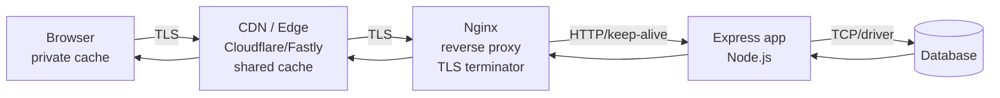
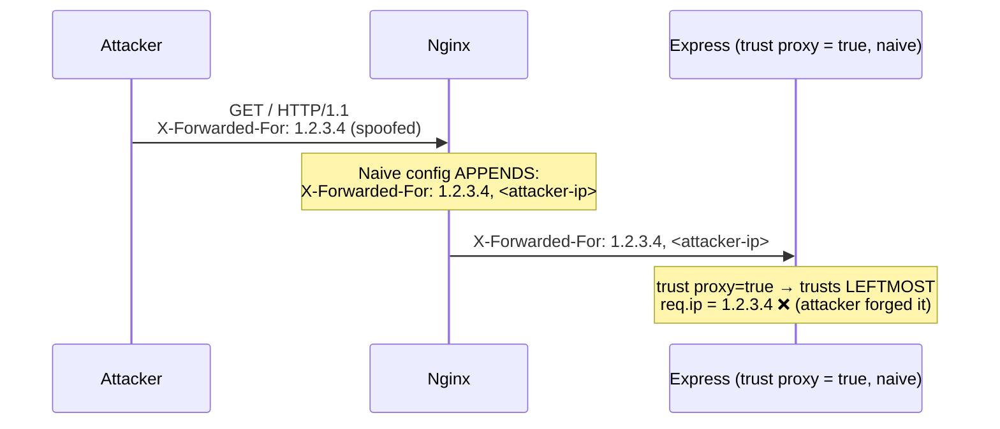
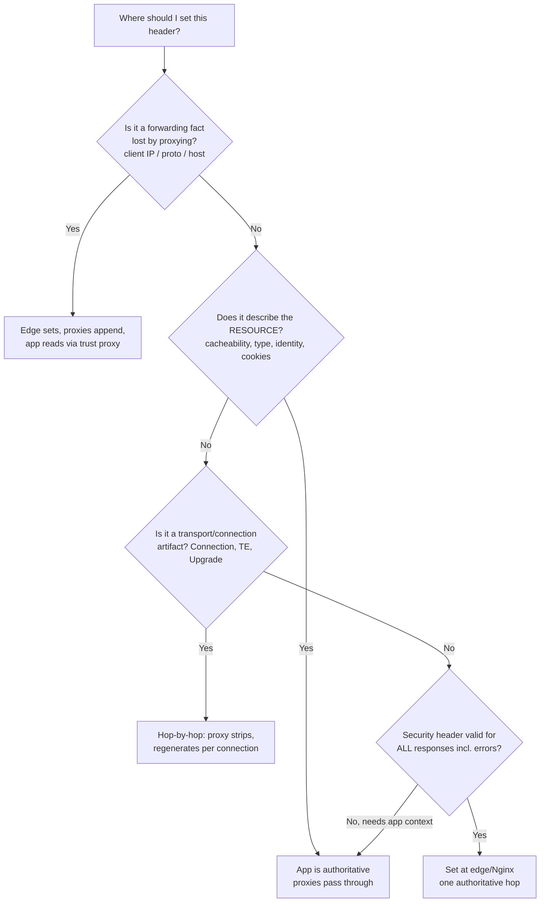

# End-to-End Header Flow

## Quick Summary

This page traces a **single HTTP request and its response** through a canonical production stack — **browser → CDN → Nginx reverse proxy → Express app → database → back out** — and shows exactly which headers are **added**, **rewritten**, **stripped**, or **passed through untouched** at each hop. The central lesson is that a header is not a static string that travels intact end to end; it is repeatedly rewritten by intermediaries, and *most production header bugs are ownership bugs*: the wrong hop set (or failed to strip) a header. By the end you should be able to answer, for any header, the one question that matters operationally: **which hop is the authoritative source of truth for this header, and which hops must treat it as read-only or delete it?**

## What problem does this concept solve?

In a single-process app, `req.headers` and `res.setHeader()` feel authoritative — what you read is what the client sent, what you write is what the client gets. In production that mental model is false and dangerous. Between the browser and your `app.get()` handler there are typically three or four hops, each of which mutates the header set:

- The **client** sends `Host: shop.example.com` — but by the time it reaches Express, the socket-level Host is `app-upstream:3000` and the *real* host is buried in `X-Forwarded-Host`.
- The **client's IP** is invisible to your app: `req.socket.remoteAddress` is the CDN's or the load balancer's IP. The real client is in `X-Forwarded-For`, which an attacker can *also* forge unless you know which hop to trust.
- A **`Set-Cookie`** your app emits can be silently dropped by a misconfigured CDN that strips cookies to make a response cacheable — logging users out at random.
- **Security headers** (`Strict-Transport-Security`, `Content-Security-Policy`) can be set at *any* of the four hops, and if two hops both set them you get duplicates or conflicts.

Understanding the flow answers the recurring production questions: *Why does my app see HTTP when the user is on HTTPS? Why is every client IP the same? Why did the CDN cache a logged-in user's page? Where should I set HSTS — Nginx or Express?*

## The reference architecture



Four network hops, each an *administrative boundary*:

1. **Browser ↔ CDN.** Public internet, TLS. The CDN is the first shared cache and the first place `X-Forwarded-*` gets stamped.
2. **CDN ↔ Nginx.** The CDN forwards to your origin. Nginx usually terminates TLS here (or the CDN did and re-originates over TLS to you).
3. **Nginx ↔ Express.** Private network (localhost, Docker bridge, or VPC). Usually **plaintext HTTP** over keep-alive — this is why your app "sees HTTP."
4. **Express ↔ DB.** Not HTTP at all (Postgres/MySQL wire protocol), but it is where request-scoped identity (from the `Authorization`/`Cookie` header) becomes a `WHERE user_id = $1`.

## Walkthrough: a single request/response

The annotated sequence below is the heart of this page. Read it top to bottom: each arrow shows the header set *as it exists on that wire segment*, with `+` added, `~` rewritten, `✗` stripped.

```mermaid
sequenceDiagram
    autonumber
    participant B as Browser
    participant C as CDN (edge)
    participant N as Nginx (reverse proxy)
    participant E as Express app
    participant D as Database

    Note over B: User navigates to https://shop.example.com/account
    B->>C: GET /account HTTP/2<br/>Host: shop.example.com<br/>Cookie: sid=abc123<br/>User-Agent: ...<br/>Accept: text/html
    Note over C: + X-Forwarded-For: 203.0.113.9<br/>+ X-Forwarded-Proto: https<br/>+ X-Forwarded-Host: shop.example.com<br/>+ CF-Connecting-IP / True-Client-IP<br/>Cache lookup: MISS (has Cookie → bypass)
    C->>N: GET /account HTTP/1.1<br/>Host: shop.example.com<br/>Cookie: sid=abc123<br/>X-Forwarded-For: 203.0.113.9<br/>X-Forwarded-Proto: https
    Note over N: ~ X-Forwarded-For: 203.0.113.9, 172.16.0.5 (append CDN IP)<br/>+ X-Real-IP: 203.0.113.9<br/>+ X-Forwarded-Host / keeps Host<br/>✗ strips hop-by-hop (Connection, Upgrade)<br/>TLS terminated here
    N->>E: GET /account HTTP/1.1<br/>Host: shop.example.com<br/>Cookie: sid=abc123<br/>X-Forwarded-For: 203.0.113.9, 172.16.0.5<br/>X-Forwarded-Proto: https<br/>X-Real-IP: 203.0.113.9
    Note over E: trust proxy → req.ip = 203.0.113.9<br/>req.protocol = https<br/>Parse Cookie → sid=abc123
    E->>D: SELECT * FROM sessions WHERE id='abc123'<br/>SELECT * FROM users WHERE id=session.user_id
    D-->>E: session row + user row
    Note over E: Build 200 response<br/>+ Set-Cookie: sid=abc123; refresh sliding expiry<br/>+ Cache-Control: private, no-store<br/>+ Content-Type: text/html<br/>(security headers via helmet)
    E-->>N: 200 OK<br/>Set-Cookie: sid=...; HttpOnly; Secure; SameSite=Lax<br/>Cache-Control: private, no-store<br/>Content-Type: text/html
    Note over N: + Strict-Transport-Security (authoritative here)<br/>+ Via: 1.1 nginx<br/>~ Server: nginx (hide upstream)<br/>gzip → + Content-Encoding, ~ Content-Length
    N-->>C: 200 OK<br/>+ HSTS, Via, Content-Encoding<br/>Cache-Control: private, no-store
    Note over C: Respects no-store → does NOT cache<br/>+ Age: 0 (only if it had cached)<br/>+ CF-Cache-Status: DYNAMIC<br/>+ Via: 1.1 cloudflare
    C-->>B: 200 OK<br/>Set-Cookie stored by browser<br/>HSTS honored, page rendered
```

Notice several things at once:
- The `Host` header the **browser** sent survives all the way to Express — but only because every hop was configured to preserve it. A default `proxy_pass` would have rewritten it to the upstream name.
- The client IP `203.0.113.9` is only knowable to Express because the CDN *originated* `X-Forwarded-For` and Nginx *appended* to it, and Express is configured with `trust proxy` to read the correct position.
- `Set-Cookie` and `Cache-Control: private, no-store` travel outward unchanged — but a `Cache-Control: public` here would have let the CDN cache Alice's account page and serve it to Bob. The **app** is authoritative for cacheability; every shared cache merely obeys.
- `Strict-Transport-Security` was added by **Nginx**, not the app — a deliberate ownership decision covered below.

## Header-by-header ownership table

The single most useful artifact for operating a stack: for each important header, *who is authoritative*, and what every other hop must do.

| Header | Authoritative hop | Browser | CDN | Nginx | Express |
|---|---|---|---|---|---|
| `Host` | **Browser** (origin intent) | sets | pass through | **must preserve** (`proxy_set_header Host $host`) | reads (`req.hostname`) |
| `X-Forwarded-For` | **First trusted proxy** (CDN) | never sends (or ignore if it does) | sets to real client IP | appends its own peer IP | reads via `trust proxy` |
| `X-Forwarded-Proto` | **TLS terminator** | — | sets `https` | sets/forwards `$scheme` | reads (`req.protocol`) |
| `X-Forwarded-Host` | **Edge** | — | sets original Host | forwards | reads (with care) |
| `X-Real-IP` | **Nginx** | — | — | sets `$remote_addr` | optional read |
| `Via` | **Each proxy appends** | — | appends | appends | rarely reads |
| `Age` | **Shared cache** | reads | sets on HIT | sets if caching | never sets |
| `Cache-Control` | **Express (origin)** | reads/obeys | obeys (`s-maxage`) | obeys/overrides | **sets** |
| `Set-Cookie` | **Express** | stores | **must not strip** | pass through | **sets** |
| `Cookie` | **Browser** | sets | forward (or bypass cache) | pass through | reads |
| `Strict-Transport-Security` | **Edge or Nginx** (one place) | honors | can add | **sets here** | usually not |
| `Content-Security-Policy` | **Express** (needs app context/nonces) | enforces | can add static | pass through | **sets** |
| `Content-Encoding` / `Content-Length` | **Whoever compresses** | reads | may compress | **compresses here** | may compress |
| `Server` | **Rewritten to hide stack** | reads | rewrites | `server_tokens off` | `x-powered-by` off |

The governing rule: **each header has exactly one authoritative writer; every downstream hop either passes it through or, if it is a forwarding artifact, appends to it — never silently overwrites the origin's intent.**

## The forwarding headers: X-Forwarded-* and Forwarded

These exist because **TLS termination and proxying destroy the connection-level facts** your app needs. Once the CDN or Nginx opens a *new* TCP connection to the next hop, the app's `req.socket.remoteAddress` is the proxy's IP, and `req.protocol` is `http` even though the user is on `https`. The `X-Forwarded-*` family carries the lost facts forward.

- **`X-Forwarded-For`** is an ordered, comma-separated list built left-to-right: `client, proxy1, proxy2`. Each proxy **appends the IP of the peer it received the request from**. So the leftmost entry is the original client — *if and only if* you can trust that no untrusted hop inserted a fake one.
- **`X-Forwarded-Proto`** is the scheme the *outermost* client used (`https`). Your app reads this to know the user is secure even though the app socket is plaintext HTTP — critical for `Secure`-cookie decisions and for building absolute redirect URLs.
- **`X-Forwarded-Host`** preserves the original `Host` when a proxy rewrites it.
- **`Forwarded`** (RFC 7239) is the standardized single-header replacement (`Forwarded: for=203.0.113.9;proto=https;host=shop.example.com`) but adoption is uneven; the `X-` variants still dominate.

The security trap:



An attacker who sends `X-Forwarded-For: 1.2.3.4` to a proxy that *appends* rather than *resets* it, combined with an app that trusts the leftmost entry, can spoof their IP — defeating rate limits, IP allowlists, and audit logs. **The authoritative rule:** the *first proxy the request enters from the internet* (here, the CDN) must **overwrite**, not append, any client-supplied `X-Forwarded-For`, and your app's `trust proxy` setting must be the exact *count* or CIDR of trusted hops so it reads the correct index — never a blanket `true` when facing the raw internet.

## Where each header should authoritatively be set

This is the actionable core of the page.

- **`Host`: owned by the browser, preserved everywhere.** Configure Nginx `proxy_set_header Host $host;`. If you let it default to the upstream name, absolute URLs, multi-tenant routing, and OAuth redirect URIs break.
- **`X-Forwarded-For` / `X-Real-IP`: owned by the *edge* the request first hits.** The CDN must reset it from the true client. Nginx uses the `realip` module (`set_real_ip_from <cdn-cidr>; real_ip_header CF-Connecting-IP;`) so `$remote_addr` becomes the real client. Express sets `app.set('trust proxy', <n>)` to the precise hop count.
- **`X-Forwarded-Proto`: owned by the TLS terminator.** Whichever hop terminates TLS sets it to `https`. Express then uses `req.protocol === 'https'` and must have `trust proxy` on or `Secure` cookies and HTTPS redirects misfire.
- **`Cache-Control`, `Set-Cookie`, `Content-Type`, `Vary`, `ETag`: owned by the Express origin.** These describe the *resource* and its identity; only the app has the domain knowledge. Proxies obey; they do not invent them (except a reverse-proxy micro-cache deliberately overriding TTL). See [Cache-Control](../06-Caching-Headers/Cache-Control.md).
- **`Strict-Transport-Security`: set at exactly one hop — the edge or Nginx.** Setting it in Express means it only ships when the app is up and only on app responses (not static error pages); setting it at the TLS terminator guarantees every HTTPS response carries it. Pick one hop; setting it in two produces duplicate headers.
- **`Content-Security-Policy`: owned by Express** when it needs per-request nonces/hashes (the common case for SPAs and SSR); a *static* CSP can live at the edge. Never set a nonce-based CSP at a caching layer — the nonce would be cached and reused, defeating it. See [Content-Security-Policy](../05-Security-Headers/Content-Security-Policy.md).
- **`Server` / `X-Powered-By`: strip/rewrite at the outermost sensible hop.** `server_tokens off` in Nginx, `app.disable('x-powered-by')` in Express — reduce fingerprinting.
- **`Via`, `Age`: owned by the caches/proxies themselves** — never set these in your app.

## Hop-by-hop vs end-to-end (why some headers must be stripped)

RFC 7230 divides headers into **end-to-end** (meant for the final recipient, forwarded unchanged) and **hop-by-hop** (meaningful only for a single transport connection: `Connection`, `Keep-Alive`, `Transfer-Encoding`, `TE`, `Trailer`, `Upgrade`, `Proxy-Authorization`). A conforming proxy **must delete hop-by-hop headers** before forwarding, because they describe *this* connection, not the next. Nginx does this automatically. This is why an app almost never sees `Connection: keep-alive` from the original client — the proxy consumed and regenerated it for its own upstream connection. See [End-to-End vs Hop-by-Hop Headers](../01-Introduction/End-to-End-vs-Hop-by-Hop-Headers.md).

This split is also a **request-smuggling** surface: if the CDN and Nginx disagree about whether `Transfer-Encoding` or `Content-Length` frames the body, an attacker can smuggle a second request past the front-end into the back-end. The mitigation lives at the proxy layer: normalize framing, reject conflicting `Content-Length`/`Transfer-Encoding`, and prefer HTTP/2 to the origin.

## HTTP Request Example

What Express actually receives (post-CDN, post-Nginx) for `GET /account`:

```http
GET /account HTTP/1.1
Host: shop.example.com
X-Forwarded-For: 203.0.113.9, 172.16.0.5
X-Forwarded-Proto: https
X-Forwarded-Host: shop.example.com
X-Real-IP: 203.0.113.9
Via: 1.1 cloudflare, 1.1 nginx
Cookie: sid=abc123
Accept: text/html,application/xhtml+xml
Accept-Encoding: gzip, br
User-Agent: Mozilla/5.0 ...
```

The socket-level facts (`Connection`, TLS) are gone; everything the app needs about the *original* client is in the `X-Forwarded-*` and `Via` lines.

## HTTP Response Example

What leaves Express (before Nginx/CDN annotate it):

```http
HTTP/1.1 200 OK
Content-Type: text/html; charset=utf-8
Cache-Control: private, no-store
Set-Cookie: sid=abc123; Path=/; HttpOnly; Secure; SameSite=Lax; Max-Age=1800
Content-Security-Policy: default-src 'self'; script-src 'self' 'nonce-r4nd0m'
Vary: Cookie
```

What the browser finally sees (after Nginx + CDN add their headers):

```http
HTTP/1.1 200 OK
Content-Type: text/html; charset=utf-8
Cache-Control: private, no-store
Set-Cookie: sid=abc123; Path=/; HttpOnly; Secure; SameSite=Lax; Max-Age=1800
Content-Security-Policy: default-src 'self'; script-src 'self' 'nonce-r4nd0m'
Strict-Transport-Security: max-age=63072000; includeSubDomains; preload
Content-Encoding: gzip
Vary: Cookie, Accept-Encoding
Via: 1.1 nginx, 1.1 cloudflare
CF-Cache-Status: DYNAMIC
Server: nginx
```

`Strict-Transport-Security`, `Content-Encoding`, `Via`, `CF-Cache-Status` were **not** in the app response — they were added downstream. `Vary` gained `Accept-Encoding` because Nginx compressed and must key the variant.

## Express.js Example

The app configuration that makes the flow correct:

```js
const express = require('express');
const helmet = require('helmet');
const app = express();

// 1) Tell Express how many proxies sit in front so req.ip / req.protocol
//    read the CORRECT position in X-Forwarded-For. This is the single most
//    important line for correctness AND security in a proxied deployment.
//    The number = count of TRUSTED hops (CDN + Nginx = 2). NEVER use `true`
//    facing the raw internet — that trusts a client-forged leftmost XFF.
app.set('trust proxy', 2);

// 2) helmet sets security response headers the APP should own — notably CSP,
//    which needs per-request context. We deliberately let the EDGE/Nginx own
//    HSTS (set once at the TLS boundary), so we disable it here to avoid dupes.
app.use(helmet({
  hsts: false,                       // authoritative HSTS lives at Nginx/CDN.
  contentSecurityPolicy: {           // app owns CSP because it mints nonces.
    directives: {
      defaultSrc: ["'self'"],
      scriptSrc: ["'self'", (req, res) => `'nonce-${res.locals.nonce}'`],
    },
  },
}));

app.disable('x-powered-by');         // strip the framework fingerprint.

app.get('/account', requireAuth, async (req, res) => {
  // req.ip is now the REAL client (203.0.113.9), not the proxy — because of
  // `trust proxy`. Used for rate limiting, audit logs, geo.
  console.log('client', req.ip, 'secure', req.protocol === 'https');

  const profile = await db.getProfile(req.user.id); // Cookie → session → user → DB.

  // The app is AUTHORITATIVE for cacheability. `private, no-store` guarantees
  // no shared cache (CDN, Nginx) stores this per-user page. Remove it and a
  // CDN could serve Alice's account to Bob.
  res.set('Cache-Control', 'private, no-store');
  res.set('Vary', 'Cookie');         // key any downstream cache on the credential.
  res.render('account', { profile }); // sliding-session Set-Cookie added by session mw.
});

app.listen(3000);
```

Remove `trust proxy` and `req.ip` becomes Nginx's IP (all clients look identical — rate limiting collapses) and `req.protocol` becomes `http` (secure cookies and HTTPS redirect logic break). Remove `Cache-Control: private, no-store` and you risk cross-user cache leaks at the CDN.

## Node.js Example

Raw `http` gives you nothing — no `trust proxy`, no cookie parsing. You reconstruct the client facts manually, which is instructive about what Express does for you:

```js
const http = require('http');

const TRUSTED_HOPS = 2; // CDN + Nginx

http.createServer((req, res) => {
  // Reconstruct real client IP: take XFF, strip the trusted hops from the right.
  const xff = (req.headers['x-forwarded-for'] || '').split(',').map(s => s.trim());
  // With 2 trusted appending hops, the real client is at index length-1-TRUSTED... but
  // in practice you trust the value the FIRST hop set: index 0 ONLY if the edge reset it.
  const clientIp = xff.length ? xff[0] : req.socket.remoteAddress;
  const proto = req.headers['x-forwarded-proto'] || 'http';

  console.log({ clientIp, proto, host: req.headers.host });
  res.setHeader('Cache-Control', 'private, no-store');
  res.end('ok');
}).listen(3000);
```

The fragility here — index math, trusting index 0 only if the edge reset it — is exactly why frameworks centralize `trust proxy` logic. Do not hand-roll this in production.

## Browser Lifecycle

1. **Request build.** The browser sets `Host` from the URL authority, attaches matching `Cookie`s (by domain/path/`SameSite`), negotiates ALPN (HTTP/2), and never sends `X-Forwarded-*` (those are proxy artifacts).
2. **TLS to the edge.** The CDN terminates TLS, learns the real client IP from the socket, and stamps `X-Forwarded-For`/`CF-Connecting-IP`.
3. **Response processing.** On the way back, the browser honors `Strict-Transport-Security` (pins HTTPS), enforces `Content-Security-Policy`, stores `Set-Cookie` per its attributes, and applies `Cache-Control` to its private cache.
4. **Subsequent requests.** HSTS forces `https://` before any request leaves; cached cookies re-attach; the whole flow repeats.

## Production Use Cases

- **Multi-tenant SaaS routing on `Host`:** the preserved `Host` header selects the tenant at Express — only works if every hop forwards the original Host.
- **Rate limiting and fraud on real client IP:** rate limiters key on `req.ip`, which is only correct with proper `X-Forwarded-For` handling and `trust proxy`.
- **HTTPS-only enforcement:** Express redirects `req.protocol !== 'https'` to HTTPS using `X-Forwarded-Proto` — the app socket is plaintext, so this is the only signal.
- **Per-user pages behind a CDN:** `Cache-Control: private` + `Vary: Cookie` ensures the CDN never serves one user's authenticated HTML to another.
- **Stack hardening:** `server_tokens off`, `x-powered-by` disabled, HSTS at the edge — layered header hygiene.

## Common Mistakes

- **`trust proxy: true` facing the internet.** Trusts the leftmost (client-forgeable) `X-Forwarded-For`, enabling IP spoofing. Set the exact hop count or trusted CIDRs.
- **Nginx defaulting `Host` to the upstream name.** Breaks absolute URLs, OAuth redirects, and multi-tenant routing. Always `proxy_set_header Host $host;`.
- **CDN stripping cookies to "improve caching."** Randomly logs users out. Configure the CDN to bypass cache (not strip cookies) on authenticated routes.
- **Setting HSTS in two places.** App *and* Nginx both emit it → duplicate `Strict-Transport-Security` headers; some scanners flag it and behavior is undefined. Own it at one hop.
- **Forgetting `X-Forwarded-Proto` handling.** App thinks it is on HTTP, issues an infinite HTTPS-redirect loop or sets non-`Secure` cookies.
- **`Cache-Control: public` on personalized responses.** The canonical cross-user cache-leak. The origin is authoritative — get it right there.

## Security Considerations

- **IP spoofing via `X-Forwarded-For`** — the edge must reset it; the app must trust the exact hop count. This underpins the integrity of rate limits, allowlists, and audit trails.
- **Cross-user cache poisoning/leakage** — `Cache-Control`/`Vary` set at the origin protect every downstream shared cache; a single mistake leaks data.
- **Request smuggling** — `Content-Length`/`Transfer-Encoding` disagreements between CDN, Nginx, and app; normalize framing at the proxy tier.
- **Header injection** — never reflect an untrusted `X-Forwarded-Host` into `Location`/redirect URLs (host-header injection → open redirect / cache poisoning).
- **Fingerprint reduction** — strip `Server`/`X-Powered-By`; they aid targeted attacks.

## Performance Considerations

- **Compression placement:** compress once, at Nginx or the CDN — not redundantly in the app (double CPU, no benefit). Whoever compresses owns `Content-Encoding` and must add `Accept-Encoding` to `Vary`.
- **Keep-alive on the Nginx↔Express hop** (`proxy_http_version 1.1; proxy_set_header Connection "";`) avoids a TCP handshake per request.
- **Cacheable responses short-circuit hops:** a CDN HIT never reaches Nginx/Express/DB — the fastest response is the one that never travels the full flow.
- **`Vary` discipline** keeps caches effective; an over-broad `Vary` (e.g. `Vary: User-Agent`) shatters the cache into near-useless fragments.

## Reverse Proxy Considerations

The Nginx config that implements the correct flow:

```nginx
# realip: rewrite $remote_addr to the true client from the CDN's header,
# but only when the peer is an actual CDN edge (prevents spoofing).
set_real_ip_from 173.245.48.0/20;    # Cloudflare range (example)
real_ip_header CF-Connecting-IP;

server {
  listen 443 ssl http2;
  server_name shop.example.com;
  server_tokens off;                 # strip nginx version from Server header.

  # Own HSTS at this TLS boundary — one authoritative place.
  add_header Strict-Transport-Security "max-age=63072000; includeSubDomains; preload" always;

  location / {
    proxy_pass http://app_upstream;
    proxy_http_version 1.1;
    proxy_set_header Connection "";           # enable upstream keep-alive.

    proxy_set_header Host $host;              # PRESERVE original Host (authoritative: browser).
    proxy_set_header X-Real-IP $remote_addr;  # real client (after realip rewrite).
    proxy_set_header X-Forwarded-For $proxy_add_x_forwarded_for; # append our peer.
    proxy_set_header X-Forwarded-Proto $scheme;  # tell app it's HTTPS.
    proxy_set_header X-Forwarded-Host $host;
  }
}
```

`$proxy_add_x_forwarded_for` appends the immediate peer; combined with `realip` reading the CDN's trusted header, the app gets a trustworthy client IP. `add_header ... always` ensures HSTS ships even on error responses. See [Proxies Overview](../14-Proxies/Proxies-Overview.md).

## CDN Considerations

- The CDN is the **first stamper** of `X-Forwarded-For`/`CF-Connecting-IP` and must **reset** any client-supplied value.
- It is the outermost shared cache: it obeys the origin's `Cache-Control`/`s-maxage` and must be configured to **bypass** (not cache) authenticated routes rather than strip cookies.
- It appends `Via` and exposes debug headers (`CF-Cache-Status`, `X-Cache`).
- A static `Strict-Transport-Security`/CSP can be injected at the edge, but per-request CSP nonces must not be — they would be cached and reused. See [CDN Caching Overview](../15-CDNs/CDN-Caching-Overview.md).

## Cloud Deployment Considerations

- **AWS ALB / GCP LB** add their own `X-Forwarded-For`/`X-Forwarded-Proto` and count as an extra hop — increment `trust proxy` accordingly.
- **API Gateways** may have independent caches and header transforms; an auth response cached at the gateway is a classic leak.
- **Service meshes (Envoy/Istio)** manipulate `x-forwarded-*` and `x-request-id`; treat each sidecar as a hop.
- **Managed edges (Vercel/Netlify/Cloudflare)** read `s-maxage`/`stale-while-revalidate` from the app — the origin's `Cache-Control` still governs.

## Debugging

- **Chrome DevTools → Network:** compare request vs response headers; look for `Via`, `CF-Cache-Status`, and whether `Set-Cookie` survived.
- **curl through each hop:** `curl -sD - -o /dev/null https://shop.example.com/account` (full path) vs `curl --resolve shop.example.com:443:<origin-ip> ...` to hit Nginx directly and diff — this isolates *which hop* added/stripped a header.
- **Echo endpoint:** a temporary `app.get('/whoami', (req,res)=>res.json({ip:req.ip,proto:req.protocol,host:req.hostname,headers:req.headers}))` reveals exactly what Express receives after all rewrites.
- **Nginx `add_header X-Debug-Upstream $upstream_addr;`** confirms routing.
- **`X-Request-Id` propagation:** stamp at the edge, forward through every hop, log at each — the only sane way to trace one request across four systems.

## Best Practices

- [ ] Preserve the original `Host` at every hop (`proxy_set_header Host $host`).
- [ ] Reset `X-Forwarded-For` at the internet-facing edge; append (never blindly trust) downstream.
- [ ] Set `trust proxy` to the *exact* trusted hop count — never `true` on the open internet.
- [ ] Set `X-Forwarded-Proto` at the TLS terminator; use it for `Secure` cookies and HTTPS redirects.
- [ ] Make the **app** authoritative for `Cache-Control`, `Set-Cookie`, `Vary`, `Content-Type`, `ETag`.
- [ ] Own `Strict-Transport-Security` at exactly one hop (edge or Nginx).
- [ ] Own nonce-based `Content-Security-Policy` in the app; never cache the nonce.
- [ ] Strip `Server`/`X-Powered-By`; let proxies remove hop-by-hop headers.
- [ ] Compress once; add `Accept-Encoding` to `Vary` at the compressing hop.
- [ ] Propagate an `X-Request-Id` end to end for tracing.

## Related Pages

- [Cache-Control](../06-Caching-Headers/Cache-Control.md) — the origin-owned directive every shared cache in the flow obeys; expanded in [Caching Architecture](./Caching-Architecture.md).
- [Auth Architecture](./Auth-Architecture.md) — the `Cookie`/`Authorization`/`Set-Cookie` half of this flow in depth.
- [Host](../03-Request-Headers/Host.md) and [Origin](../03-Request-Headers/Origin.md) — browser-owned request identity.
- [End-to-End vs Hop-by-Hop Headers](../01-Introduction/End-to-End-vs-Hop-by-Hop-Headers.md) — why proxies strip some headers.
- [Strict-Transport-Security](../05-Security-Headers/Strict-Transport-Security.md) and [Content-Security-Policy](../05-Security-Headers/Content-Security-Policy.md) — where in the flow to set them.
- [Proxies Overview](../14-Proxies/Proxies-Overview.md) and [CDN Caching Overview](../15-CDNs/CDN-Caching-Overview.md).

## Decision Tree



## Mental Model

Think of a request as a **package moving through a shipping network**, and each header as a **label or stamp** on the box. The **sender (browser)** writes the destination address (`Host`) and encloses their membership card (`Cookie`). The **first depot (CDN)** photographs the real sender and staples that photo to the box (`X-Forwarded-For`) because past this point nobody can see who dropped it off. Each subsequent **sorting facility (Nginx)** adds its own routing stamp (`Via`), removes stickers that only meant something on the truck it arrived on (hop-by-hop headers), and preserves the original address. The **warehouse (Express)** is the only party that knows what's *inside* the box, so it — and only it — writes the handling instructions the whole return journey must obey (`Cache-Control`, `Set-Cookie`). Every bug in production is a case of the **wrong facility writing a label it had no authority to write**, or a facility **failing to preserve a label the destination depended on**. Get the ownership right and the package always arrives correctly stamped.
