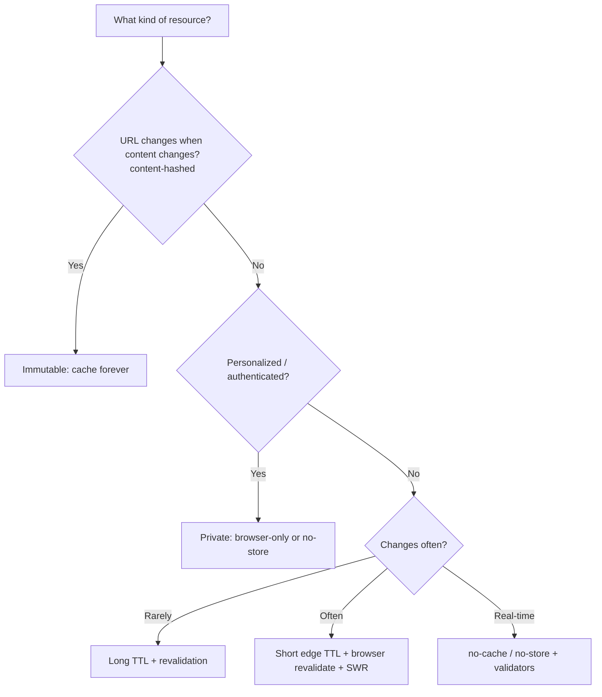

# Caching Strategy Checklist

> A **best-practices chapter** distilling the caching material into an actionable, decision-oriented checklist. For the mechanics see [`Cache-Control`](../06-Caching-Headers/Cache-Control.md), [`ETag`](../06-Caching-Headers/ETag.md), [`Vary`](../06-Caching-Headers/Vary.md), [`Age`](../06-Caching-Headers/Age.md), the [conditional requests](../12-Conditional-Requests/Conditional-Requests-Overview.md) family, and [Caching Architecture End-to-End](../20-Real-World-Architectures/Caching-Architecture-End-to-End.md). This page is the "what should I actually *set*?" reference — organized by resource type, with copy-pasteable directives and the reasoning behind each.

## The one decision that drives everything: how does this resource change?

Before setting any header, classify the resource. This single question determines the whole strategy:



## Cheat sheet by resource type

| Resource | Recommended `Cache-Control` | Also set |
|---|---|---|
| **Content-hashed assets** (`/app.9f2c.js`) | `public, max-age=31536000, immutable` | (skip ETag — URL is the version) |
| **Un-hashed static assets** | `public, max-age=86400` | [`ETag`](../06-Caching-Headers/ETag.md), [`Vary: Accept-Encoding`](../06-Caching-Headers/Vary.md) |
| **HTML pages** | `public, max-age=0, s-maxage=300, stale-while-revalidate=600` | [`ETag`](../06-Caching-Headers/ETag.md), [`Vary`](../06-Caching-Headers/Vary.md) |
| **Public API (GET)** | `public, max-age=0, s-maxage=60` | [`ETag`](../06-Caching-Headers/ETag.md), [`Vary: Accept, Accept-Encoding`](../06-Caching-Headers/Vary.md) |
| **Authenticated/personalized** | `private, no-store` | — |
| **Sensitive (never store)** | `no-store` | — |
| **Real-time data** | `no-cache` | [`ETag`](../06-Caching-Headers/ETag.md) (cheap revalidation) |
| **Aggressive edge + mutable** | `public, max-age=60` + [`Surrogate-Control: max-age=86400`](../06-Caching-Headers/Surrogate-Control.md) | [`Surrogate-Key`](../06-Caching-Headers/Surrogate-Control.md) + purge-on-change |

## The checklist

### Freshness & scope
- [ ] **Classify every response** by change pattern before choosing directives.
- [ ] Use **`s-maxage`** for the CDN/shared tier and **`max-age`** for the browser when they should differ (the "cache hard at edge, revalidate in browser" pattern).
- [ ] Mark **authenticated/personalized** responses `private` (or `no-store`); **never** let shared caches store per-user data.
- [ ] Use `no-store` for **sensitive** data (tokens, PII, financial); don't rely on [`Pragma`](../06-Caching-Headers/Pragma.md).
- [ ] Set an **explicit** `Cache-Control` on every response — don't rely on cache heuristics.

### Immutable assets (the biggest win)
- [ ] **Content-hash** build asset filenames (Vite/webpack do this) so the URL changes when content changes.
- [ ] Serve them `public, max-age=31536000, immutable` — no revalidation, maximum hit ratio.
- [ ] **Skip [`ETag`](../06-Caching-Headers/ETag.md)** on immutable assets (the URL is the version; ETag adds a pointless `304` RTT).

### Validators (for non-immutable)
- [ ] Provide an [`ETag`](../06-Caching-Headers/ETag.md) (or [`Last-Modified`](../06-Caching-Headers/Last-Modified.md)) so revalidation yields cheap [`304`s](../12-Conditional-Requests/If-None-Match.md) instead of full re-downloads.
- [ ] Generate **fleet-consistent** ETags (content hash / shared version), **never** per-node mtime/inode — or CDN/browser revalidation always misses.
- [ ] Handle [`If-None-Match`](../12-Conditional-Requests/If-None-Match.md) → return `304` with **no body**; parse the comma-list/`*` forms.
- [ ] Prefer `ETag` over `Last-Modified` where sub-second or deploy-stable correctness matters.

### Variants (`Vary`)
- [ ] Add [`Vary: Accept-Encoding`](../06-Caching-Headers/Vary.md) on **every** compressible response (let compression middleware do it; don't clobber it).
- [ ] Add `Vary: Accept-Language` / `Accept` only when you genuinely negotiate.
- [ ] Add `Vary: Origin` when reflecting the [CORS origin](../07-CORS/Access-Control-Allow-Origin.md).
- [ ] **Never** `Vary: User-Agent` or `Vary: Cookie` — normalize to low-cardinality; use `private` for per-user.

### Edge / CDN
- [ ] Verify the CDN actually **caches** what you intend (many default HTML/API to uncached — add rules).
- [ ] **Normalize** high-cardinality inputs (`Accept-Encoding`, device) before they hit the cache key.
- [ ] For aggressive edge caching of mutable content, use [`Surrogate-Control`/`Surrogate-Key`](../06-Caching-Headers/Surrogate-Control.md) + **purge-on-change**.
- [ ] Add `stale-while-revalidate` (and `stale-if-error`) for perceived performance and resilience.
- [ ] Confirm behavior with [`Age`](../06-Caching-Headers/Age.md) + vendor [cache-status headers](../15-CDNs/CDN-Debugging-Headers.md).

### Invalidation
- [ ] Prefer **URL versioning** (content hashes) over purging where possible — no invalidation needed.
- [ ] For mutable cached content, implement **event-driven purge** (by URL or [tag](../06-Caching-Headers/Surrogate-Control.md)) on data change — don't wait for TTLs.
- [ ] After **security fixes**, actively **purge** — don't let stale vulnerable content linger until expiry.

## Express.js Example — putting the checklist into code

```js
const express = require('express');
const crypto = require('crypto');
const compression = require('compression');
const app = express();

app.use(compression()); // sets Vary: Accept-Encoding for you

// Immutable content-hashed assets: cache forever, no ETag/revalidation.
app.use('/static', express.static('dist', {
  immutable: true, maxAge: '1y',
  etag: false,  // URL is the version; skip the 304 RTT
  setHeaders: (res) => res.set('Cache-Control', 'public, max-age=31536000, immutable'),
}));

// HTML: edge-cache short, browser revalidates, SWR for perceived speed.
app.get('/', (req, res) => {
  const html = renderHome();
  const etag = '"' + crypto.createHash('sha1').update(html).digest('base64') + '"'; // fleet-safe
  res.set('Cache-Control', 'public, max-age=0, s-maxage=300, stale-while-revalidate=600');
  res.set('ETag', etag);
  res.vary('Accept-Encoding');
  if (req.headers['if-none-match'] === etag) return res.status(304).end();
  res.type('html').send(html);
});

// Authenticated: never shared-cache.
app.get('/account', requireAuth, (req, res) => {
  res.set('Cache-Control', 'private, no-store');
  res.json({ user: req.user });
});

app.listen(3000);
```

Every line maps to a checklist item: `immutable` + long `max-age` for hashed assets (no revalidation), the `max-age=0, s-maxage=300` split (browser revalidates, edge caches), fleet-safe content-hash [`ETag`](../06-Caching-Headers/ETag.md) (revalidation yields `304`s), `Vary: Accept-Encoding` (variant correctness), and `private, no-store` for authenticated data (no cross-user leakage).

## Anti-patterns to avoid (see [Anti-Patterns](./Anti-Patterns.md))

- Caching authenticated content in shared caches (missing `private`/`no-store`).
- Per-node (mtime) [`ETag`](../06-Caching-Headers/ETag.md)s that break revalidation across a fleet/CDN.
- Long-caching un-versioned assets → stale after deploy.
- Missing [`Vary: Accept-Encoding`](../06-Caching-Headers/Vary.md) → corrupted compressed responses cross-served.
- `Vary: User-Agent`/`Cookie` → cache fragmentation collapse.
- Relying on [`Pragma`](../06-Caching-Headers/Pragma.md)/`Expires: 0` instead of `Cache-Control`.
- Aggressive TTLs with no purge mechanism → stale content after changes.

## Measuring success

- **Edge hit ratio** (target high for static, reasonable for HTML/API) — from CDN analytics + [`Age`](../06-Caching-Headers/Age.md)/[cache-status](../15-CDNs/CDN-Debugging-Headers.md).
- **Origin request volume** (should drop as caching improves).
- **`304` ratio** on revalidations (high = validators working; low = fleet-inconsistent ETags).
- **Time-to-first-byte / LCP** improvements from edge caching + SWR.
- **Staleness incidents** (should trend to zero with proper purge/versioning).

## Related Pages

- [Cache-Control](../06-Caching-Headers/Cache-Control.md) — the directives.
- [ETag](../06-Caching-Headers/ETag.md) / [Last-Modified](../06-Caching-Headers/Last-Modified.md) — validators.
- [If-None-Match](../12-Conditional-Requests/If-None-Match.md) / [If-Modified-Since](../12-Conditional-Requests/If-Modified-Since.md) — revalidation.
- [Vary](../06-Caching-Headers/Vary.md) / [Age](../06-Caching-Headers/Age.md) — variants + staleness.
- [Surrogate-Control / Surrogate-Key](../06-Caching-Headers/Surrogate-Control.md) — edge TTL + tag purge.
- [Caching Architecture End-to-End](../20-Real-World-Architectures/Caching-Architecture-End-to-End.md) — the full pipeline.
- [Anti-Patterns](./Anti-Patterns.md) — mistakes to avoid.
- [CDN Debugging Headers](../15-CDNs/CDN-Debugging-Headers.md) — verifying behavior.

## Mental Model

Think of a caching strategy as **stocking a chain of pantries with a clear rule for each kind of food.** Shelf-stable canned goods with a printed batch code (content-hashed assets) get stocked *for a year and never re-checked* — when the recipe changes you print a new code, so old and new never collide. Daily bread (HTML) gets kept a few hours at the warehouse but your home fridge always double-checks it's today's loaf — and if the check is slow, you eat yesterday's while a fresh one's fetched (stale-while-revalidate). A customer's *personal* groceries never go in a shared pantry at all (`private`/`no-store`). The recurring discipline is two-fold: **version the unchanging things** so you never need to recall them, and **keep a recall list for the changing things** so one call clears every pantry the instant the recipe changes. Do that, and every pantry stays both *full* (fast, low farm load) and *fresh* (never serving last week's bread as today's).
