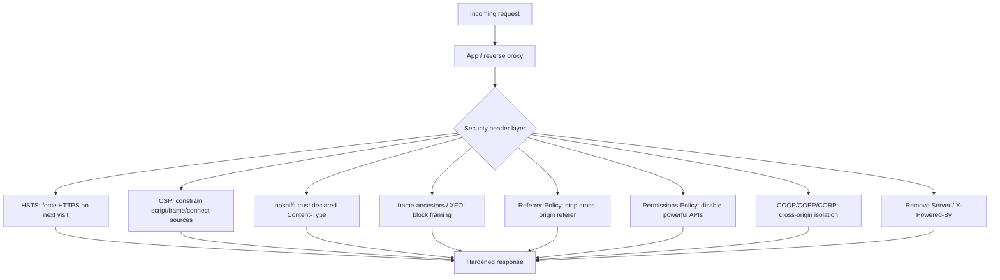
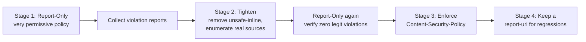
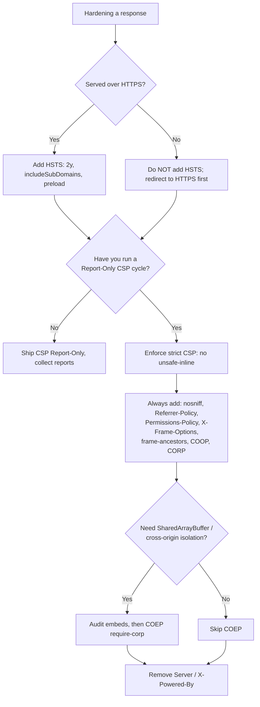

# Security Hardening: The Recommended Response-Header Baseline

## Quick Summary

This page is the opinionated, production-grade checklist for the security headers every HTTP response should (or should not) carry. Individually, each header in [Part 05 — Security Headers](../05-Security-Headers/) closes one specific attack class: [`Strict-Transport-Security`](../05-Security-Headers/Strict-Transport-Security.md) forces HTTPS, [`Content-Security-Policy`](../05-Security-Headers/Content-Security-Policy.md) neutralizes XSS and clickjacking, [`X-Content-Type-Options`](../05-Security-Headers/X-Content-Type-Options.md) stops MIME sniffing, `X-Frame-Options`/CSP `frame-ancestors` block framing, [`Referrer-Policy`](../05-Security-Headers/Referrer-Policy.md) stops referrer leakage, [`Permissions-Policy`](../05-Security-Headers/Permissions-Policy.md) disables powerful APIs, and the Cross-Origin isolation trio (COOP/COEP/CORP) walls your context off from Spectre-class side channels. This page shows how to set them **together**, coherently, once, at the edge of your app — plus what to *remove* (`Server`, `X-Powered-By`). It gives a complete Helmet config with every option explained, an equivalent Nginx config, a staged CSP rollout that won't break your site, and an audit checklist you can paste into a ticket.

## What problem does this baseline solve?

Security headers are defense-in-depth. Your app should already validate input, escape output, and authenticate requests — but those controls fail, and when they do, headers are the second wall. The problem is that they are **set inconsistently**: one route sets HSTS, another forgets it; the API sends `X-Content-Type-Options` but the HTML pages don't; a CSP exists but still allows `unsafe-inline`, so it stops nothing. Attackers only need one unhardened response.

The solution is a **single choke point** — one middleware (Helmet) or one reverse-proxy `include` — that stamps a consistent, reviewed baseline on every response, so hardening is not a per-route decision that someone forgets. This page defines that baseline and shows both the app-layer and edge-layer implementations.

## The baseline at a glance

```http
HTTP/2 200
strict-transport-security: max-age=63072000; includeSubDomains; preload
content-security-policy: default-src 'self'; script-src 'self'; object-src 'none'; base-uri 'none'; frame-ancestors 'none'; upgrade-insecure-requests
x-content-type-options: nosniff
referrer-policy: strict-origin-when-cross-origin
permissions-policy: camera=(), microphone=(), geolocation=(), interest-cohort=()
cross-origin-opener-policy: same-origin
cross-origin-resource-policy: same-origin
cross-origin-embedder-policy: require-corp
x-frame-options: DENY
```

Notice what is **absent**: no `Server: nginx/1.25.3`, no `X-Powered-By: Express`. Those are removed, not added.



## The headers, one by one — why each is in the baseline

### 1. Strict-Transport-Security (HSTS)

```http
Strict-Transport-Security: max-age=63072000; includeSubDomains; preload
```

Tells the browser: for the next two years, **never** speak HTTP to this host — upgrade every request to HTTPS *before it leaves the browser*, and refuse to let the user click through a certificate warning. This closes the SSL-strip / hostile-Wi-Fi downgrade window that a plain `301 http→https` redirect leaves open (the first, pre-redirect request still travels in cleartext). `includeSubDomains` extends the promise to every subdomain — required for `preload`, and the reason you must be sure *all* subdomains are HTTPS-capable before enabling it. `preload` requests inclusion in the browsers' hard-coded HSTS list (submit at hstspreload.org), so even the very first visit is protected. See [`Strict-Transport-Security`](../05-Security-Headers/Strict-Transport-Security.md) for the ramp-up strategy and the one-way-door caveat.

**Critical rule:** only ever send HSTS over HTTPS. Sending it on a plain-HTTP response is meaningless (spec says browsers ignore it) and signals a broken config.

### 2. Content-Security-Policy (CSP)

```http
Content-Security-Policy: default-src 'self'; script-src 'self'; object-src 'none'; base-uri 'none'; frame-ancestors 'none'; upgrade-insecure-requests
```

The single most powerful header here. CSP is a whitelist of where scripts, styles, images, frames, and network connections may come from. Its headline job is **XSS mitigation**: even if an attacker injects `<script>steal()</script>`, a CSP without `unsafe-inline` refuses to execute it. `object-src 'none'` kills Flash/plugin vectors; `base-uri 'none'` stops `<base>`-tag hijacking of relative URLs; `frame-ancestors 'none'` is the modern, more powerful clickjacking defense that supersedes `X-Frame-Options`; `upgrade-insecure-requests` auto-rewrites `http://` subresources to `https://`. The hard part is rolling it out without breaking your own inline scripts — see [Staged CSP rollout](#staged-csp-rollout-report-only--enforce) below and the deep dive in [`Content-Security-Policy`](../05-Security-Headers/Content-Security-Policy.md).

### 3. X-Content-Type-Options

```http
X-Content-Type-Options: nosniff
```

Disables the browser's MIME-sniffing heuristic. Without it, a browser may look *inside* a response, decide your `text/plain` user-upload "looks like" HTML or JavaScript, and execute it — turning a file-upload endpoint into stored XSS. `nosniff` forces the browser to honor the declared [`Content-Type`](../04-Response-Headers/Content-Type.md). It also enforces that scripts are served with a JavaScript MIME type and blocks `no-cors` style/script loads with the wrong type. There is no downside; it belongs on **every** response. See [`X-Content-Type-Options`](../05-Security-Headers/X-Content-Type-Options.md).

### 4. Framing control: frame-ancestors + X-Frame-Options

```http
Content-Security-Policy: ...; frame-ancestors 'none'
X-Frame-Options: DENY
```

Both defend against **clickjacking** (your page loaded invisibly in an attacker's `<iframe>` and overlaid to trick clicks). CSP `frame-ancestors` is the modern control and supports an allow-list (`frame-ancestors 'self' https://partner.example`); `X-Frame-Options: DENY` (or `SAMEORIGIN`) is the legacy header kept only for ancient browsers. When both are present, `frame-ancestors` wins in modern browsers. Set both: `frame-ancestors` for correctness and expressiveness, `X-Frame-Options` for belt-and-suspenders coverage. Do **not** use the obsolete `ALLOW-FROM` value — it was never widely supported; use `frame-ancestors` for allow-listing.

### 5. Referrer-Policy

```http
Referrer-Policy: strict-origin-when-cross-origin
```

Controls how much of the current URL leaks in the [`Referer`](../03-Request-Headers/Referer.md) header on outbound requests and navigations. `strict-origin-when-cross-origin` (now the browser default, but set it explicitly) sends the full URL on same-origin requests, only the origin (scheme+host, no path/query) on cross-origin HTTPS requests, and nothing when downgrading HTTPS→HTTP. This stops leaking session tokens, password-reset tokens, or internal paths embedded in URLs to third-party analytics, ad networks, and linked sites. See [`Referrer-Policy`](../05-Security-Headers/Referrer-Policy.md).

### 6. Permissions-Policy

```http
Permissions-Policy: camera=(), microphone=(), geolocation=(), interest-cohort=()
```

Explicitly disables powerful browser features your app doesn't use. An empty allowlist `()` means "no origin, not even self, may use this API." If XSS or a malicious third-party script somehow runs, it still cannot silently turn on the camera or read geolocation. Enumerate the features you *don't* need and deny them; for features you *do* need, scope them to `(self)` or specific origins. `interest-cohort=()` opts out of FLoC-style cohort tracking. See [`Permissions-Policy`](../05-Security-Headers/Permissions-Policy.md).

### 7. Cross-Origin isolation: COOP / COEP / CORP

```http
Cross-Origin-Opener-Policy: same-origin
Cross-Origin-Embedder-Policy: require-corp
Cross-Origin-Resource-Policy: same-origin
```

This trio defends against **Spectre-class side-channel attacks** and cross-window tampering:

- **COOP `same-origin`** severs the `window.opener` relationship with cross-origin popups/openers, so a page you open (or that opens you) cannot script your window or read cross-origin data through the shared browsing-context group.
- **COEP `require-corp`** demands that every cross-origin subresource explicitly opt in (via CORP or CORS) before it loads — no silent embedding of resources that haven't consented.
- **CORP** is the *server-side opt-in* the above requires: `same-origin` means "only my own origin may embed this resource," protecting it from being pulled into an attacker's document as a speculative-execution oracle.

Together, COOP + COEP put your document into a **cross-origin isolated** state, which is the *prerequisite* for `SharedArrayBuffer` and high-resolution timers. **Caveat:** COEP `require-corp` is the most likely of all these headers to break a working site — every third-party embed (analytics, maps, fonts, ad iframes, images from a CDN) must send CORP/CORS headers or it will be blocked. Roll it out only if you need isolation (e.g., for WASM threads) or after auditing every cross-origin resource. If you don't need `SharedArrayBuffer`, you can safely ship COOP + CORP and hold COEP.

### 8. Remove Server and X-Powered-By

```http
Server: nginx        ← minimized (or removed)
X-Powered-By: Express ← removed entirely
```

These headers leak your stack and version, handing attackers a free reconnaissance step ("this is Express 4.17 behind nginx 1.18 — which known CVEs apply?"). They provide zero value to legitimate clients. Remove [`X-Powered-By`](../04-Response-Headers/Server.md) entirely (`app.disable('x-powered-by')`, which Helmet also does) and either strip or genericize [`Server`](../04-Response-Headers/Server.md) at the reverse proxy. This is obscurity, not security — but it's free obscurity that removes a rung from the attacker's ladder.

## Express.js Example — complete production Helmet config

Helmet is the de-facto Express middleware for security headers. Here is a full, annotated, production configuration. Every option is present and explained, including why you'd deviate.

```js
const express = require('express');
const helmet = require('helmet');
const app = express();

// Behind a TLS-terminating proxy/LB, trust it so req.secure/req.protocol are correct.
// Without this, HSTS-on-HTTPS logic and secure-cookie logic can misfire. Set the exact
// number of proxy hops in production rather than `true` to avoid X-Forwarded-For spoofing
// (see Anti-Patterns.md — "trusting X-Forwarded-For").
app.set('trust proxy', 1);

// Remove the framework fingerprint. Helmet does this too, but be explicit.
app.disable('x-powered-by');

app.use(helmet({
  // ---- HSTS ----------------------------------------------------------------
  // Emits Strict-Transport-Security. Two years, subdomains, preload-eligible.
  // Helmet only sends this on responses; ensure your edge also serves it ONLY over HTTPS.
  strictTransportSecurity: {
    maxAge: 63072000,          // 2 years in seconds. <1 year disqualifies from preload list.
    includeSubDomains: true,   // Required for preload. Be sure EVERY subdomain is HTTPS-ready.
    preload: true,             // Signals eligibility; you still must submit at hstspreload.org.
  },

  // ---- Content-Security-Policy --------------------------------------------
  // Start in Report-Only during rollout (see staged rollout below), then flip to enforce.
  contentSecurityPolicy: {
    useDefaults: false,        // Don't inherit Helmet's defaults; be explicit and auditable.
    directives: {
      defaultSrc: ["'self'"],                 // Fallback for any fetch directive not listed.
      scriptSrc: ["'self'"],                  // No inline, no eval, no third-party JS by default.
      styleSrc: ["'self'"],                   // Prefer nonces/hashes over 'unsafe-inline'.
      imgSrc: ["'self'", 'data:'],            // Allow self + data: URIs (small inline images).
      connectSrc: ["'self'"],                 // XHR/fetch/WebSocket/EventSource targets.
      fontSrc: ["'self'"],                    // Web fonts origin allow-list.
      objectSrc: ["'none'"],                  // Kill <object>/<embed>/<applet> (Flash-era vectors).
      baseUri: ["'none'"],                    // Block <base> hijacking of relative URLs.
      frameAncestors: ["'none'"],             // Clickjacking defense (supersedes X-Frame-Options).
      formAction: ["'self'"],                 // Restrict where <form> can POST (data-exfil defense).
      upgradeInsecureRequests: [],            // Auto-rewrite http:// subresources to https://.
    },
    // reportOnly: true,   // <-- enable during rollout; violations reported, nothing blocked.
  },

  // ---- X-Content-Type-Options: nosniff ------------------------------------
  xContentTypeOptions: true,   // Always on. No reason to disable.

  // ---- Referrer-Policy -----------------------------------------------------
  referrerPolicy: { policy: 'strict-origin-when-cross-origin' },

  // ---- X-Frame-Options: DENY ----------------------------------------------
  // Legacy clickjacking header. frameAncestors above is the modern control; keep both.
  frameguard: { action: 'deny' },

  // ---- Cross-Origin isolation ---------------------------------------------
  crossOriginOpenerPolicy: { policy: 'same-origin' },
  crossOriginResourcePolicy: { policy: 'same-origin' },
  // COEP is OFF by default in Helmet because it breaks cross-origin embeds.
  // Enable ONLY if you need cross-origin isolation (SharedArrayBuffer/WASM threads)
  // AND every third-party resource sends CORP/CORS:
  crossOriginEmbedderPolicy: false, // set to { policy: 'require-corp' } once audited.

  // ---- Misc hardening Helmet sets by default ------------------------------
  xDnsPrefetchControl: { allow: false },  // X-DNS-Prefetch-Control: off (privacy).
  xDownloadOptions: true,                 // X-Download-Options: noopen (legacy IE download safety).
  xPermittedCrossDomainPolicies: { permittedPolicies: 'none' }, // Block Adobe crossdomain.xml abuse.
  originAgentCluster: true,               // Origin-Agent-Cluster: ?1 (process isolation hint).
}));

// Permissions-Policy is NOT set by Helmet — set it manually (empty allowlists = deny).
app.use((req, res, next) => {
  res.setHeader(
    'Permissions-Policy',
    'camera=(), microphone=(), geolocation=(), payment=(), usb=(), interest-cohort=()'
  );
  next();
});

app.get('/', (req, res) => res.send('<h1>Hardened</h1>'));
app.listen(3000);
```

**What breaks if you remove pieces:** drop `trust proxy` and `req.secure` is always false behind a proxy, so any HTTPS-conditional logic and `Secure` cookies misbehave. Drop `objectSrc: 'none'` and legacy plugin XSS vectors reopen. Drop `baseUri: 'none'` and an injected `<base href="//evil">` reroutes every relative script/link to the attacker. Leave `crossOriginEmbedderPolicy` enabled without auditing embeds and your third-party images/scripts/iframes silently fail to load.

## Node.js Example — raw http, no framework

Without Express/Helmet you set every header by hand. Centralize it in one function so no route can forget:

```js
const http = require('http');

// One function, applied to every response — the raw-http equivalent of the Helmet middleware.
function applySecurityHeaders(res) {
  res.setHeader('Strict-Transport-Security', 'max-age=63072000; includeSubDomains; preload');
  res.setHeader('Content-Security-Policy',
    "default-src 'self'; script-src 'self'; object-src 'none'; base-uri 'none'; " +
    "frame-ancestors 'none'; form-action 'self'; upgrade-insecure-requests");
  res.setHeader('X-Content-Type-Options', 'nosniff');
  res.setHeader('Referrer-Policy', 'strict-origin-when-cross-origin');
  res.setHeader('Permissions-Policy', 'camera=(), microphone=(), geolocation=(), interest-cohort=()');
  res.setHeader('X-Frame-Options', 'DENY');
  res.setHeader('Cross-Origin-Opener-Policy', 'same-origin');
  res.setHeader('Cross-Origin-Resource-Policy', 'same-origin');
  // res.setHeader('Cross-Origin-Embedder-Policy', 'require-corp'); // only after auditing embeds
  res.removeHeader('X-Powered-By'); // raw http doesn't set it, but be defensive against libs that do.
}

http.createServer((req, res) => {
  applySecurityHeaders(res);
  res.setHeader('Content-Type', 'text/html; charset=utf-8');
  res.end('<h1>Hardened</h1>');
}).listen(3000);
```

The raw module sets **no** security headers for you — which is both the risk (easy to forget) and the safety (no surprise defaults). A single shared function is your choke point.

## React Example — where the app can and can't help

React runs in the browser and **cannot set response headers** — the security baseline is a server/edge concern. React's relationship to these headers is indirect but real:

1. **CSP and inline scripts.** A strict `script-src 'self'` (no `'unsafe-inline'`) forbids inline `<script>`. Create-React-App and some SSR setups inject inline runtime chunks or `<script>window.__DATA__=...</script>`; those violate a strict CSP. The fix is a **per-response nonce**: the server generates a random nonce, adds `script-src 'nonce-<value>'` to the CSP header, and stamps `nonce="<value>"` on every legitimate inline script tag. Vite and Next.js support nonce injection for exactly this reason.

2. **connect-src and API calls.** If your CSP sets `connect-src 'self'` but your React app `fetch`es `https://api.example.com`, the browser blocks it. Every API host, WebSocket endpoint, and analytics beacon your components talk to must be listed in `connect-src`.

3. **img-src / font-src / style-src.** Styled-components and Emotion inject `<style>` at runtime; a strict `style-src 'self'` without a nonce/hash breaks them. Either use nonces or account for CSS-in-JS in your policy.

```jsx
// Server-side (SSR) — inject a per-request nonce so a strict CSP allows YOUR inline scripts only.
// The nonce comes from res.locals.cspNonce set by middleware that also wrote it into the CSP header.
function Document({ nonce, appHtml, state }) {
  return (
    <html lang="en">
      <body>
        <div id="root" dangerouslySetInnerHTML={{ __html: appHtml }} />
        {/* nonce matches script-src 'nonce-...'; without it, a strict CSP blocks this. */}
        <script nonce={nonce}
          dangerouslySetInnerHTML={{ __html: `window.__STATE__=${JSON.stringify(state)}` }} />
        <script nonce={nonce} src="/assets/app.9f2c1a.js" />
      </body>
    </html>
  );
}
```

## Nginx Example — equivalent edge configuration

Setting headers at the reverse proxy hardens **every** upstream uniformly — even apps you can't modify. Put this in a reusable snippet.

```nginx
# /etc/nginx/snippets/security-headers.conf  (include this in each server block)

# `always` ensures the header is added even on error responses (4xx/5xx), which
# add_header omits by default — a classic hole where error pages ship unhardened.
add_header Strict-Transport-Security "max-age=63072000; includeSubDomains; preload" always;
add_header Content-Security-Policy "default-src 'self'; script-src 'self'; object-src 'none'; base-uri 'none'; frame-ancestors 'none'; form-action 'self'; upgrade-insecure-requests" always;
add_header X-Content-Type-Options "nosniff" always;
add_header Referrer-Policy "strict-origin-when-cross-origin" always;
add_header Permissions-Policy "camera=(), microphone=(), geolocation=(), interest-cohort=()" always;
add_header X-Frame-Options "DENY" always;
add_header Cross-Origin-Opener-Policy "same-origin" always;
add_header Cross-Origin-Resource-Policy "same-origin" always;
# add_header Cross-Origin-Embedder-Policy "require-corp" always;  # only after auditing embeds

# Strip the stack fingerprint.
server_tokens off;                 # Server: nginx  (no version). Full removal needs the headers-more module:
more_clear_headers Server;         # requires ngx_headers_more; otherwise leave server_tokens off.
proxy_hide_header X-Powered-By;    # drop the upstream app's X-Powered-By before it reaches the client.
```

```nginx
server {
  listen 443 ssl http2;
  server_name app.example.com;

  # Redirect plain HTTP to HTTPS. HSTS must ONLY be sent over TLS (below), never here.
  # (Define a separate `listen 80` server that 301s to https — don't add HSTS there.)

  include snippets/security-headers.conf;

  location / {
    proxy_pass http://app_upstream;
    # If the upstream ALSO sets these headers, nginx `add_header` would duplicate them.
    # Either strip the upstream's copies (proxy_hide_header) or set headers in exactly one place.
    proxy_hide_header X-Powered-By;
  }
}
```

**The `always` gotcha is the single most common Nginx security-header mistake:** without it, `add_header` silently skips 4xx/5xx responses, so your 404 and 500 pages go out with *no* security headers. **The duplication gotcha is second:** if both Nginx and the app set `X-Frame-Options`, browsers may see two values and behave unpredictably — decide on one layer as the source of truth (usually the edge) and `proxy_hide_header` the other.

## Staged CSP rollout (Report-Only → Enforce)

CSP is the header most likely to break your site, so never flip it to enforce blind. Roll it out in stages:



**Stage 1 — observe without blocking.** Ship `Content-Security-Policy-Report-Only` with your intended policy plus a reporting endpoint. Nothing is blocked; the browser POSTs a JSON report for every *would-be* violation.

```js
// Report-Only: nothing is blocked; you just learn what your intended policy WOULD break.
app.use(helmet.contentSecurityPolicy({
  useDefaults: false,
  reportOnly: true,
  directives: {
    defaultSrc: ["'self'"],
    scriptSrc: ["'self'"],
    styleSrc: ["'self'"],
    objectSrc: ["'none'"],
    baseUri: ["'none'"],
    frameAncestors: ["'none'"],
    reportUri: ['/csp-report'],           // deprecated but widely supported
    reportTo: ['csp-endpoint'],           // modern Reporting-API group name
  },
}));

// Collect reports. Browsers POST application/csp-report or application/reports+json.
app.post('/csp-report', express.json({ type: ['application/csp-report', 'application/reports+json'] }),
  (req, res) => {
    console.warn('CSP violation:', JSON.stringify(req.body));  // ship to your log pipeline
    res.status(204).end();
  });
```

**Stage 2 — tighten.** Read the reports. For each legitimate inline script/style, switch to a **nonce or hash** rather than adding `'unsafe-inline'`. For each real external host, add it explicitly (`script-src 'self' https://cdn.trusted.com`). Never resolve a violation by widening to `*` or `'unsafe-inline'` — that defeats the header's purpose. See [Anti-Patterns — over-broad CSP](./Anti-Patterns.md).

**Stage 3 — enforce.** Once Report-Only shows zero legitimate violations for a full traffic cycle, drop `reportOnly` (or rename the header from `-Report-Only`). Keep the `report-uri`/`report-to` so future regressions surface as reports instead of user-visible breakage.

**Stage 4 — maintain.** New third-party scripts, new API hosts, and new fonts all need policy updates. Treat the CSP as code, reviewed in PRs.

## Common Mistakes

- **Setting HSTS on plain HTTP**, or with a huge `max-age` before you're sure all subdomains are HTTPS — HSTS is a one-way door; `includeSubDomains; preload` can black-hole a subdomain that only serves HTTP. Ramp `max-age` up (300 → 86400 → 1 year → 2 years).
- **CSP with `'unsafe-inline'` `script-src`** — this is a CSP that stops nothing; the XSS you're defending against is inline script. Use nonces/hashes instead. (See Anti-Patterns.)
- **Nginx `add_header` without `always`** — error pages ship unhardened.
- **Setting headers in two layers** (app *and* proxy) → duplicated/conflicting values.
- **Enabling COEP `require-corp` blind** → third-party embeds silently break.
- **Forgetting Permissions-Policy** because Helmet doesn't set it — powerful APIs stay reachable by injected script.
- **Leaving `X-Powered-By`/verbose `Server`** → free recon for attackers.

## Security Considerations

These headers are **mitigations, not fixes**. A strict CSP reduces XSS *impact* but you must still escape output. HSTS protects transport but you still need valid TLS. The trap is treating a green securityheaders.com score as "we're secure" — it means the walls are up, not that there are no holes behind them. Also: headers only protect resources that *carry* them, so the choke point (one middleware / one edge snippet with `always`) matters more than any single header value. Finally, note the ordering/precedence interactions: CSP `frame-ancestors` overrides `X-Frame-Options` in modern browsers; CSP `upgrade-insecure-requests` and HSTS both push to HTTPS but at different layers (page subresources vs. transport).

## Performance Considerations

Security headers add a few hundred bytes to every response. On HTTP/2 and HTTP/3 this is largely absorbed by **HPACK/QPACK header compression** — repeated static header values across requests on a connection compress to near-nothing after the first. The one directive with real perf *upside* is `upgrade-insecure-requests` (avoids a redirect round-trip for mixed content) and HSTS (browser skips the http→https redirect entirely on repeat visits). COEP/COOP isolation *enables* `SharedArrayBuffer` and precise timers, a perf feature for WASM-heavy apps. Net: negligible cost, occasional win.

## CDN Considerations

Most CDNs (Cloudflare, Fastly, CloudFront) let you inject or transform response headers at the edge via rules/workers — often the cleanest single choke point for a multi-origin fleet. Watch for **double-setting**: if the origin sends CSP and the CDN also adds one, you can get two conflicting headers. Cloudflare's "Managed Transforms" can add several of these automatically; decide origin-vs-edge ownership. Also ensure the CDN doesn't *strip* your HSTS on cached error responses. See [CDN Caching Overview](../15-CDNs/CDN-Caching-Overview.md).

## Cloud Deployment Considerations

- **Load balancers (ALB/GCLB):** generally pass headers through but may add their own (`Server: awselb`); strip or override at your ingress.
- **API gateways:** often the right place to enforce the baseline for microservice fleets; configure a response-header policy once.
- **Managed platforms (Vercel/Netlify):** define headers in `vercel.json` / `netlify.toml` / `_headers` — the platform edge stamps them, so even static assets are covered.

## Debugging

- **securityheaders.com / Mozilla Observatory:** quick external graded scan.
- **Chrome DevTools → Network → Headers:** confirm every header is present on the *document* and on *error* responses; the **Console** prints CSP violations with the exact blocked URL and directive.
- **curl:** `curl -sI https://app.example.com` dumps response headers — verify HSTS is present over HTTPS and absent over HTTP, and that `Server`/`X-Powered-By` are gone. Test error paths too: `curl -sI https://app.example.com/does-not-exist`.
- **Postman / Bruno:** inspect headers per response; Bruno lets you commit assertions like `expect(res.headers['x-content-type-options']).to.equal('nosniff')` into a versioned suite.
- **Report endpoint:** during CSP rollout, tail your `/csp-report` logs.

## Best Practices — audit checklist

- [ ] `Strict-Transport-Security` present on **all HTTPS** responses; `max-age` ≥ 1 year; `includeSubDomains`; `preload` only after every subdomain is HTTPS-ready. **Not** sent over plain HTTP.
- [ ] `Content-Security-Policy` enforced (not just Report-Only) with **no** `'unsafe-inline'`/`'unsafe-eval'` in `script-src`.
- [ ] CSP includes `object-src 'none'`, `base-uri 'none'`, `frame-ancestors 'none'` (or explicit allow-list), `form-action 'self'`.
- [ ] `X-Content-Type-Options: nosniff` on **every** response.
- [ ] `X-Frame-Options: DENY`/`SAMEORIGIN` **and** CSP `frame-ancestors` both set.
- [ ] `Referrer-Policy: strict-origin-when-cross-origin` (or stricter).
- [ ] `Permissions-Policy` denies every powerful feature you don't use (empty allowlists).
- [ ] `Cross-Origin-Opener-Policy: same-origin` and `Cross-Origin-Resource-Policy: same-origin` set.
- [ ] `Cross-Origin-Embedder-Policy: require-corp` set **only** after auditing every cross-origin embed (or intentionally omitted).
- [ ] `X-Powered-By` removed; `Server` minimized/removed.
- [ ] Headers applied at **one** choke point (Helmet middleware or edge snippet) — no per-route omissions.
- [ ] Nginx `add_header ... always` so **error pages** are hardened too.
- [ ] Verified end-to-end with `curl -sI`, DevTools, and an external scanner — including 4xx/5xx responses.

## Related Pages

- [Strict-Transport-Security](../05-Security-Headers/Strict-Transport-Security.md) — force HTTPS; ramp-up and preload caveats.
- [Content-Security-Policy](../05-Security-Headers/Content-Security-Policy.md) — the deep dive on directives, nonces, and hashes.
- [X-Content-Type-Options](../05-Security-Headers/X-Content-Type-Options.md) — MIME-sniffing defense.
- [Referrer-Policy](../05-Security-Headers/Referrer-Policy.md) — controlling `Referer` leakage.
- [Permissions-Policy](../05-Security-Headers/Permissions-Policy.md) — disabling powerful browser features.
- [Server](../04-Response-Headers/Server.md) — fingerprint minimization (and `X-Powered-By`).
- [Caching-Strategy](./Caching-Strategy.md) — the caching counterpart to this hardening baseline.
- [Anti-Patterns](./Anti-Patterns.md) — the broken-vs-fixed catalog of header mistakes.

## Decision Tree



## Mental Model

Think of your app as a building. Your input validation and auth are the **locks on the doors** — the primary defense. Security headers are the **building code**: the fire doors (CSP), the shatterproof glass (nosniff), the "no unaccompanied visitors" policy (frame-ancestors/COOP), the sign that hides which alarm system you use (removing `Server`/`X-Powered-By`), and the mandate that the whole street is paved in concrete not gravel (HSTS forcing HTTPS). You don't install building code door-by-door as you remember; you enforce it at the permit office — **one choke point** (Helmet or the edge) that every room must pass through — so no room is ever built without it. And you don't rip out the old sprinklers before the new ones are tested (staged CSP rollout), because a fire door that jams shut is its own kind of hazard.
